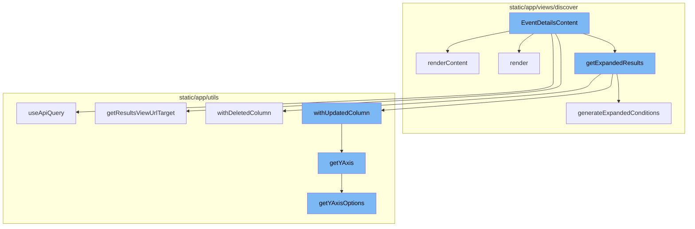
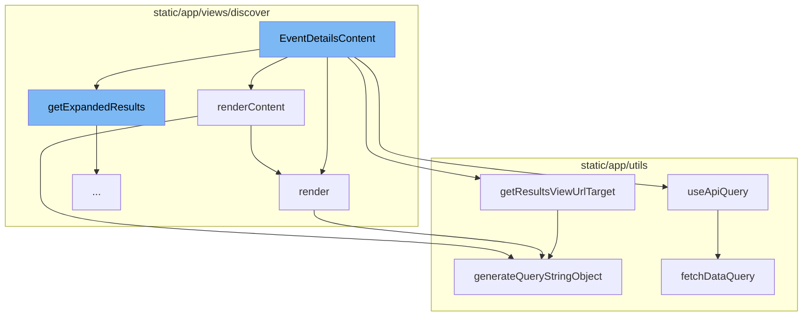
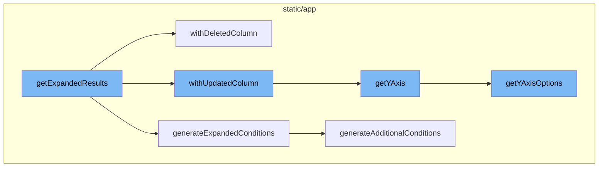

# EventDetailsContent Overview

EventDetailsContent is a key component in the Sentry application, responsible for displaying detailed information about specific events. It fetches and displays event data based on provided properties, such as the event slug, and handles user interactions like toggling the visibility of the sidebar.

<SwmSnippet path="/static/app/views/discover/eventDetails/content.tsx" line="80">

---

# EventDetailsContent Function

The `EventDetailsContent` function is the main component for displaying event details. It takes in properties such as the event slug and uses them to fetch and display detailed information about a specific event. It also handles user interactions such as toggling the visibility of the sidebar.

```tsx
function EventDetailsContent(props: Props) {
  const [isSidebarVisible, setIsSidebarVisible] = useState<boolean>(true);
  const projectId = props.eventSlug.split(':')[0];

  const {
    data: event,
    isLoading,
    error,
  } = useApiQuery<Event>(
    [`/organizations/${props.organization.slug}/events/${props.eventSlug}/`],
    {staleTime: 2 * 60 * 1000} // 2 minutes in milliseonds
  );

  const generateTagUrl = (tag: EventTag) => {
    const {eventView, organization, isHomepage} = props;
    if (!event) {
      return '';
    }
    const eventReference = {...event};
    if (eventReference.id) {
      delete (eventReference as any).id;
```

---

</SwmSnippet>

<SwmSnippet path="/static/app/views/discover/eventDetails/content.tsx" line="107">

---

# renderContent Function

The `renderContent` function is responsible for rendering the main content of the event details page. It checks if the event data is available, and if not, it displays a `NotFound` component. If the event data is available, it renders the event details, including the event metadata, event entries, and other related information.

```tsx
  function renderContent() {
    if (!event) {
      return <NotFound />;
    }

    const {organization, location, eventView, isHomepage} = props;

    const transactionName = event.tags.find(tag => tag.key === 'transaction')?.value;
    const transactionSummaryTarget =
      event.type === 'transaction' && transactionName
        ? transactionSummaryRouteWithQuery({
            orgSlug: organization.slug,
            transaction: transactionName,
            projectID: event.projectID,
            query: location.query,
          })
        : null;

    const eventJsonUrl = `/api/0/projects/${organization.slug}/${projectId}/events/${event.eventID}/json/`;

    const hasProfilingFeature = organization.features.includes('profiling');
```

---

</SwmSnippet>

<SwmSnippet path="/static/app/utils/queryClient.tsx" line="121">

---

# useApiQuery Function

The `useApiQuery` function is a wrapper around React Query's `useQuery` function. It takes in a query key, which includes an endpoint URL and options such as query parameters, and executes the request using the query key URL. It returns the data from the API request along with other query information.

```tsx
export function useApiQuery<TResponseData, TError = RequestError>(
  queryKey: ApiQueryKey,
  options: UseApiQueryOptions<TResponseData, TError>
): UseApiQueryResult<TResponseData, TError> {
  const api = useApi({persistInFlight: PERSIST_IN_FLIGHT});
  const queryFn = fetchDataQuery(api);

  const {data, ...rest} = useQuery(queryKey, queryFn, options);

  const queryResult = {
    data: data?.[0],
    getResponseHeader: data?.[2]?.getResponseHeader,
    ...rest,
  };

  // XXX: We need to cast here because unwrapping `data` breaks the type returned by
  //      useQuery above. The react-query library's UseQueryResult is a union type and
  //      too complex to recreate here so casting the entire object is more appropriate.
  return queryResult as UseApiQueryResult<TResponseData, TError>;
}
```

---

</SwmSnippet>

<SwmSnippet path="/static/app/views/discover/eventDetails/content.tsx" line="131">

---

# render Function

The `render` function is responsible for rendering the event details content. It uses the `TransactionProfileIdProvider` to provide the transaction ID and timestamp to its child components. It also renders the header, main content, and sidebar of the event details page.

```tsx
    const render = (
      results?: QuickTraceQueryChildrenProps,
      metaResults?: TraceMetaQueryChildrenProps
    ) => {
      return (
        <TransactionProfileIdProvider
          projectId={event.projectID}
          transactionId={event.type === 'transaction' ? event.id : undefined}
          timestamp={event.dateReceived}
        >
          <Layout.Header>
            <Layout.HeaderContent>
              <DiscoverBreadcrumb
                eventView={eventView}
                event={event}
                organization={organization}
                location={location}
                isHomepage={isHomepage}
              />
              <EventHeader event={event} />
            </Layout.HeaderContent>
```

---

</SwmSnippet>

<SwmSnippet path="/static/app/utils/discover/eventView.tsx" line="1190">

---

# getResultsViewUrlTarget Method

The `getResultsViewUrlTarget` method generates the URL for the results view. It takes in a slug and a boolean indicating whether the current page is the homepage. It returns an object containing the pathname and query string for the results view URL.

```tsx
  getResultsViewUrlTarget(
    slug: string,
    isHomepage: boolean = false
  ): {pathname: string; query: Query} {
    const target = isHomepage ? 'homepage' : 'results';
    return {
      pathname: normalizeUrl(`/organizations/${slug}/discover/${target}/`),
      query: this.generateQueryStringObject(),
    };
  }
```

---

</SwmSnippet>

<SwmSnippet path="/static/app/utils/discover/eventView.tsx" line="672">

---

# generateQueryStringObject Method

The `generateQueryStringObject` method generates a query string object based on the properties of the `EventView` object. This query string object can be used to make API requests or to generate URLs.

```tsx
  generateQueryStringObject(): Query {
    const output = {
      id: this.id,
      name: this.name,
      field: this.getFields(),
      widths: this.getWidths(),
      sort: encodeSorts(this.sorts),
      environment: this.environment,
      project: this.project,
      query: this.query,
      yAxis: this.yAxis || this.getYAxis(),
      dataset: this.dataset,
      display: this.display,
      topEvents: this.topEvents,
      interval: this.interval,
    };

    for (const field of EXTERNAL_QUERY_STRING_KEYS) {
      if (this[field]?.length) {
        output[field] = this[field];
      }
```

---

</SwmSnippet>

<SwmSnippet path="/static/app/views/discover/utils.tsx" line="262">

---

# getExpandedResults Function

The `getExpandedResults` function is the starting point of the flow. It converts an aggregated query into one that does not have aggregates. It also applies additional conditions defined in `additionalConditions` and generates conditions based on the `dataRow` parameter and the current fields in the `eventView`.

```tsx
export function getExpandedResults(
  eventView: EventView,
  additionalConditions: Record<string, string>,
  dataRow?: TableDataRow | Event
): EventView {
  const fieldSet = new Set();
  // Expand any functions in the resulting column, and dedupe the result.
  // Mark any column as null to remove it.
  const expandedColumns: (Column | null)[] = eventView.fields.map((field: Field) => {
    const exploded = explodeFieldString(field.field, field.alias);
    const column = exploded.kind === 'function' ? drilldownAggregate(exploded) : exploded;

    if (
      // if expanding the function failed
      column === null ||
      // the new column is already present
      fieldSet.has(column.field) ||
      // Skip aggregate equations, their functions will already be added so we just want to remove it
      isAggregateEquation(field.field)
    ) {
      return null;
```

---

</SwmSnippet>

<SwmSnippet path="/static/app/utils/discover/eventView.tsx" line="971">

---

# withDeletedColumn Method

The `withDeletedColumn` method is called within `getExpandedResults`. It removes a column from the EventView and adjusts the sort keys and yAxis accordingly.

```tsx
  withDeletedColumn(columnIndex: number, tableMeta: MetaType | undefined): EventView {
    // Disallow removal of the orphan column, and check for out-of-bounds
    if (this.fields.length <= 1 || this.fields.length <= columnIndex || columnIndex < 0) {
      return this;
    }

    // ensure tableMeta is non-empty
    tableMeta = validateTableMeta(tableMeta);

    // delete the column
    const newEventView = this.clone();
    const fields = [...newEventView.fields];
    fields.splice(columnIndex, 1);
    newEventView.fields = fields;

    // Ensure there is at least one auto width column
    // To ensure a well formed table results.
    const hasAutoIndex = fields.find(field => field.width === COL_WIDTH_UNDEFINED);
    if (!hasAutoIndex) {
      newEventView.fields[0].width = COL_WIDTH_UNDEFINED;
    }
```

---

</SwmSnippet>

<SwmSnippet path="/static/app/views/discover/utils.tsx" line="423">

---

# generateExpandedConditions Function

The `generateExpandedConditions` function is also called within `getExpandedResults`. It generates additional conditions based on the fields in an EventView and a data row or event.

```tsx
function generateExpandedConditions(
  eventView: EventView,
  additionalConditions: Record<string, string>,
  dataRow?: TableDataRow | Event
): string {
  const parsedQuery = new MutableSearch(eventView.query);

  // Remove any aggregates from the search conditions.
  // otherwise, it'll lead to an invalid query result.
  for (const key in parsedQuery.filters) {
    const column = explodeFieldString(key);
    if (column.kind === 'function') {
      parsedQuery.removeFilter(key);
    }
  }

  const conditions: Record<string, string | string[]> = Object.assign(
    {},
    additionalConditions,
    generateAdditionalConditions(eventView, dataRow)
  );
```

---

</SwmSnippet>

<SwmSnippet path="/static/app/utils/discover/eventView.tsx" line="877">

---

# withUpdatedColumn Method

The `withUpdatedColumn` method is invoked within `getExpandedResults`. It updates a column in the EventView and adjusts the sort keys and yAxis accordingly.

```tsx
  withUpdatedColumn(
    columnIndex: number,
    updatedColumn: Column,
    tableMeta: MetaType | undefined
  ): EventView {
    const columnToBeUpdated = this.fields[columnIndex];
    const fieldAsString = generateFieldAsString(updatedColumn);

    const updateField = columnToBeUpdated.field !== fieldAsString;
    if (!updateField) {
      return this;
    }

    // ensure tableMeta is non-empty
    tableMeta = validateTableMeta(tableMeta);

    const newEventView = this.clone();

    const updatedField: Field = {
      field: fieldAsString,
      width: COL_WIDTH_UNDEFINED,
```

---

</SwmSnippet>

<SwmSnippet path="/static/app/utils/discover/eventView.tsx" line="1319">

---

# getYAxis Method

The `getYAxis` method is called within `withUpdatedColumn` and `withDeletedColumn`. It returns the current selected yAxis if it is one of the items in yAxisOptions, otherwise, it returns the default option.

```tsx
  getYAxis(): string {
    const yAxisOptions = this.getYAxisOptions();

    const yAxis = this.yAxis;
    const defaultOption = yAxisOptions[0].value;

    if (!yAxis) {
      return defaultOption;
    }

    // ensure current selected yAxis is one of the items in yAxisOptions
    const result = yAxisOptions.findIndex(
      (option: SelectValue<string>) => option.value === yAxis
    );

    if (result >= 0) {
      return typeof yAxis === 'string' ? yAxis : yAxis[0];
    }

    return defaultOption;
  }
```

---

</SwmSnippet>

<SwmSnippet path="/static/app/utils/discover/eventView.tsx" line="1300">

---

# getYAxisOptions Method

The `getYAxisOptions` method is invoked within `getYAxis`. It returns a list of yAxis options based on the aggregate fields in the EventView.

```tsx
  getYAxisOptions(): SelectValue<string>[] {
    // Make option set and add the default options in.
    return uniqBy(
      this.getAggregateFields()
        // Only include aggregates that make sense to be graphable (eg. not string or date)
        .filter(
          (field: Field) =>
            isLegalYAxisType(aggregateOutputType(field.field)) ||
            isAggregateEquation(field.field)
        )
        .map((field: Field) => ({
          label: isEquation(field.field) ? getEquation(field.field) : field.field,
          value: field.field,
        }))
        .concat(CHART_AXIS_OPTIONS),
      'value'
    );
  }
```

---

</SwmSnippet>



# Flow drill down

First, we'll zoom into this section of the flow:



<SwmSnippet path="/static/app/views/discover/eventDetails/content.tsx" line="80">

---

# EventDetailsContent Function

The `EventDetailsContent` function is the main component for displaying event details. It takes in properties such as the event slug and uses them to fetch and display detailed information about a specific event. It also handles user interactions such as toggling the visibility of the sidebar.

```tsx
function EventDetailsContent(props: Props) {
  const [isSidebarVisible, setIsSidebarVisible] = useState<boolean>(true);
  const projectId = props.eventSlug.split(':')[0];

  const {
    data: event,
    isLoading,
    error,
  } = useApiQuery<Event>(
    [`/organizations/${props.organization.slug}/events/${props.eventSlug}/`],
    {staleTime: 2 * 60 * 1000} // 2 minutes in milliseonds
  );

  const generateTagUrl = (tag: EventTag) => {
    const {eventView, organization, isHomepage} = props;
    if (!event) {
      return '';
    }
    const eventReference = {...event};
    if (eventReference.id) {
      delete (eventReference as any).id;
```

---

</SwmSnippet>

<SwmSnippet path="/static/app/views/discover/eventDetails/content.tsx" line="107">

---

# renderContent Function

The `renderContent` function is responsible for rendering the main content of the event details page. It checks if the event data is available, and if not, it displays a `NotFound` component. If the event data is available, it renders the event details, including the event metadata, event entries, and other related information.

```tsx
  function renderContent() {
    if (!event) {
      return <NotFound />;
    }

    const {organization, location, eventView, isHomepage} = props;

    const transactionName = event.tags.find(tag => tag.key === 'transaction')?.value;
    const transactionSummaryTarget =
      event.type === 'transaction' && transactionName
        ? transactionSummaryRouteWithQuery({
            orgSlug: organization.slug,
            transaction: transactionName,
            projectID: event.projectID,
            query: location.query,
          })
        : null;

    const eventJsonUrl = `/api/0/projects/${organization.slug}/${projectId}/events/${event.eventID}/json/`;

    const hasProfilingFeature = organization.features.includes('profiling');
```

---

</SwmSnippet>

<SwmSnippet path="/static/app/utils/queryClient.tsx" line="121">

---

# useApiQuery Function

The `useApiQuery` function is a wrapper around React Query's `useQuery` function. It takes in a query key, which includes an endpoint URL and options such as query parameters, and executes the request using the query key URL. It returns the data from the API request along with other query information.

```tsx
export function useApiQuery<TResponseData, TError = RequestError>(
  queryKey: ApiQueryKey,
  options: UseApiQueryOptions<TResponseData, TError>
): UseApiQueryResult<TResponseData, TError> {
  const api = useApi({persistInFlight: PERSIST_IN_FLIGHT});
  const queryFn = fetchDataQuery(api);

  const {data, ...rest} = useQuery(queryKey, queryFn, options);

  const queryResult = {
    data: data?.[0],
    getResponseHeader: data?.[2]?.getResponseHeader,
    ...rest,
  };

  // XXX: We need to cast here because unwrapping `data` breaks the type returned by
  //      useQuery above. The react-query library's UseQueryResult is a union type and
  //      too complex to recreate here so casting the entire object is more appropriate.
  return queryResult as UseApiQueryResult<TResponseData, TError>;
}
```

---

</SwmSnippet>

<SwmSnippet path="/static/app/views/discover/eventDetails/content.tsx" line="131">

---

# render Function

The `render` function is responsible for rendering the event details content. It uses the `TransactionProfileIdProvider` to provide the transaction ID and timestamp to its child components. It also renders the header, main content, and sidebar of the event details page.

```tsx
    const render = (
      results?: QuickTraceQueryChildrenProps,
      metaResults?: TraceMetaQueryChildrenProps
    ) => {
      return (
        <TransactionProfileIdProvider
          projectId={event.projectID}
          transactionId={event.type === 'transaction' ? event.id : undefined}
          timestamp={event.dateReceived}
        >
          <Layout.Header>
            <Layout.HeaderContent>
              <DiscoverBreadcrumb
                eventView={eventView}
                event={event}
                organization={organization}
                location={location}
                isHomepage={isHomepage}
              />
              <EventHeader event={event} />
            </Layout.HeaderContent>
```

---

</SwmSnippet>

<SwmSnippet path="/static/app/utils/discover/eventView.tsx" line="1190">

---

# getResultsViewUrlTarget Method

The `getResultsViewUrlTarget` method generates the URL for the results view. It takes in a slug and a boolean indicating whether the current page is the homepage. It returns an object containing the pathname and query string for the results view URL.

```tsx
  getResultsViewUrlTarget(
    slug: string,
    isHomepage: boolean = false
  ): {pathname: string; query: Query} {
    const target = isHomepage ? 'homepage' : 'results';
    return {
      pathname: normalizeUrl(`/organizations/${slug}/discover/${target}/`),
      query: this.generateQueryStringObject(),
    };
  }
```

---

</SwmSnippet>

<SwmSnippet path="/static/app/utils/discover/eventView.tsx" line="672">

---

# generateQueryStringObject Method

The `generateQueryStringObject` method generates a query string object based on the properties of the `EventView` object. This query string object can be used to make API requests or to generate URLs.

```tsx
  generateQueryStringObject(): Query {
    const output = {
      id: this.id,
      name: this.name,
      field: this.getFields(),
      widths: this.getWidths(),
      sort: encodeSorts(this.sorts),
      environment: this.environment,
      project: this.project,
      query: this.query,
      yAxis: this.yAxis || this.getYAxis(),
      dataset: this.dataset,
      display: this.display,
      topEvents: this.topEvents,
      interval: this.interval,
    };

    for (const field of EXTERNAL_QUERY_STRING_KEYS) {
      if (this[field]?.length) {
        output[field] = this[field];
      }
```

---

</SwmSnippet>

Now, lets zoom into this section of the flow:



<SwmSnippet path="/static/app/views/discover/utils.tsx" line="262">

---

# EventDetailsContent Flow

The `getExpandedResults` function is the starting point of the flow. It converts an aggregated query into one that does not have aggregates. It also applies additional conditions defined in `additionalConditions` and generates conditions based on the `dataRow` parameter and the current fields in the `eventView`.

```tsx
export function getExpandedResults(
  eventView: EventView,
  additionalConditions: Record<string, string>,
  dataRow?: TableDataRow | Event
): EventView {
  const fieldSet = new Set();
  // Expand any functions in the resulting column, and dedupe the result.
  // Mark any column as null to remove it.
  const expandedColumns: (Column | null)[] = eventView.fields.map((field: Field) => {
    const exploded = explodeFieldString(field.field, field.alias);
    const column = exploded.kind === 'function' ? drilldownAggregate(exploded) : exploded;

    if (
      // if expanding the function failed
      column === null ||
      // the new column is already present
      fieldSet.has(column.field) ||
      // Skip aggregate equations, their functions will already be added so we just want to remove it
      isAggregateEquation(field.field)
    ) {
      return null;
```

---

</SwmSnippet>

<SwmSnippet path="/static/app/utils/discover/eventView.tsx" line="971">

---

The `withDeletedColumn` method is called within `getExpandedResults`. It removes a column from the EventView and adjusts the sort keys and yAxis accordingly.

```tsx
  withDeletedColumn(columnIndex: number, tableMeta: MetaType | undefined): EventView {
    // Disallow removal of the orphan column, and check for out-of-bounds
    if (this.fields.length <= 1 || this.fields.length <= columnIndex || columnIndex < 0) {
      return this;
    }

    // ensure tableMeta is non-empty
    tableMeta = validateTableMeta(tableMeta);

    // delete the column
    const newEventView = this.clone();
    const fields = [...newEventView.fields];
    fields.splice(columnIndex, 1);
    newEventView.fields = fields;

    // Ensure there is at least one auto width column
    // To ensure a well formed table results.
    const hasAutoIndex = fields.find(field => field.width === COL_WIDTH_UNDEFINED);
    if (!hasAutoIndex) {
      newEventView.fields[0].width = COL_WIDTH_UNDEFINED;
    }
```

---

</SwmSnippet>

<SwmSnippet path="/static/app/views/discover/utils.tsx" line="423">

---

The `generateExpandedConditions` function is also called within `getExpandedResults`. It generates additional conditions based on the fields in an EventView and a data row or event.

```tsx
function generateExpandedConditions(
  eventView: EventView,
  additionalConditions: Record<string, string>,
  dataRow?: TableDataRow | Event
): string {
  const parsedQuery = new MutableSearch(eventView.query);

  // Remove any aggregates from the search conditions.
  // otherwise, it'll lead to an invalid query result.
  for (const key in parsedQuery.filters) {
    const column = explodeFieldString(key);
    if (column.kind === 'function') {
      parsedQuery.removeFilter(key);
    }
  }

  const conditions: Record<string, string | string[]> = Object.assign(
    {},
    additionalConditions,
    generateAdditionalConditions(eventView, dataRow)
  );
```

---

</SwmSnippet>

<SwmSnippet path="/static/app/utils/discover/eventView.tsx" line="877">

---

The `withUpdatedColumn` method is invoked within `getExpandedResults`. It updates a column in the EventView and adjusts the sort keys and yAxis accordingly.

```tsx
  withUpdatedColumn(
    columnIndex: number,
    updatedColumn: Column,
    tableMeta: MetaType | undefined
  ): EventView {
    const columnToBeUpdated = this.fields[columnIndex];
    const fieldAsString = generateFieldAsString(updatedColumn);

    const updateField = columnToBeUpdated.field !== fieldAsString;
    if (!updateField) {
      return this;
    }

    // ensure tableMeta is non-empty
    tableMeta = validateTableMeta(tableMeta);

    const newEventView = this.clone();

    const updatedField: Field = {
      field: fieldAsString,
      width: COL_WIDTH_UNDEFINED,
```

---

</SwmSnippet>

<SwmSnippet path="/static/app/utils/discover/eventView.tsx" line="1319">

---

The `getYAxis` method is called within `withUpdatedColumn` and `withDeletedColumn`. It returns the current selected yAxis if it is one of the items in yAxisOptions, otherwise, it returns the default option.

```tsx
  getYAxis(): string {
    const yAxisOptions = this.getYAxisOptions();

    const yAxis = this.yAxis;
    const defaultOption = yAxisOptions[0].value;

    if (!yAxis) {
      return defaultOption;
    }

    // ensure current selected yAxis is one of the items in yAxisOptions
    const result = yAxisOptions.findIndex(
      (option: SelectValue<string>) => option.value === yAxis
    );

    if (result >= 0) {
      return typeof yAxis === 'string' ? yAxis : yAxis[0];
    }

    return defaultOption;
  }
```

---

</SwmSnippet>

<SwmSnippet path="/static/app/utils/discover/eventView.tsx" line="1300">

---

The `getYAxisOptions` method is invoked within `getYAxis`. It returns a list of yAxis options based on the aggregate fields in the EventView.

```tsx
  getYAxisOptions(): SelectValue<string>[] {
    // Make option set and add the default options in.
    return uniqBy(
      this.getAggregateFields()
        // Only include aggregates that make sense to be graphable (eg. not string or date)
        .filter(
          (field: Field) =>
            isLegalYAxisType(aggregateOutputType(field.field)) ||
            isAggregateEquation(field.field)
        )
        .map((field: Field) => ({
          label: isEquation(field.field) ? getEquation(field.field) : field.field,
          value: field.field,
        }))
        .concat(CHART_AXIS_OPTIONS),
      'value'
    );
  }
```

---

</SwmSnippet>

&nbsp;

*This is an auto-generated document by Swimm AI 🌊 and has not yet been verified by a human*

<SwmMeta version="3.0.0" repo-id="Z2l0aHViJTNBJTNBc2VudHJ5LWRlbW8lM0ElM0FTd2ltbS1EZW1v" repo-name="sentry-demo" doc-type="flows"><sup>Powered by [Swimm](/)</sup></SwmMeta>
