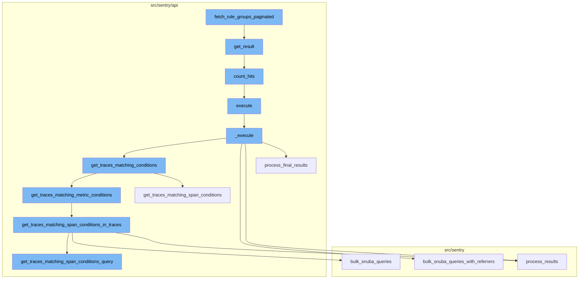
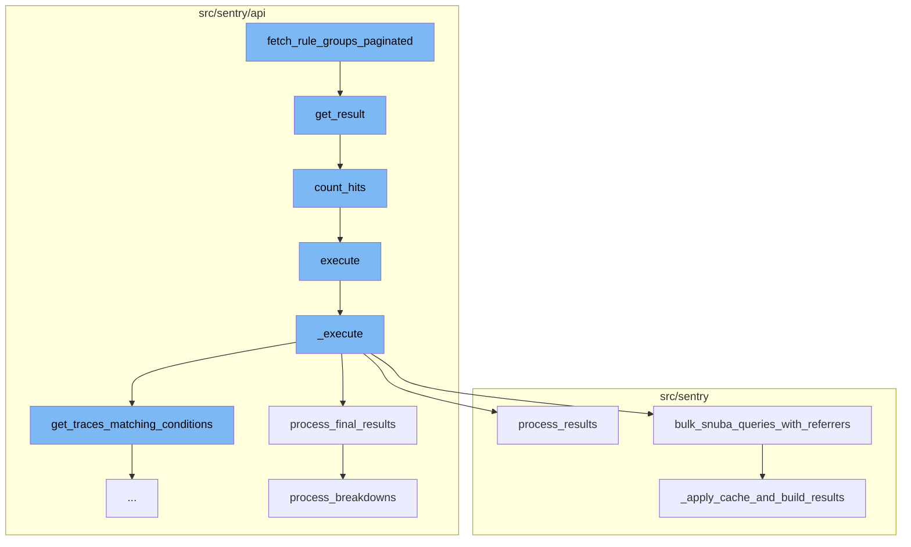
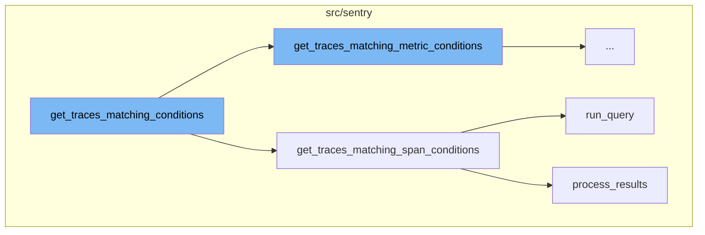
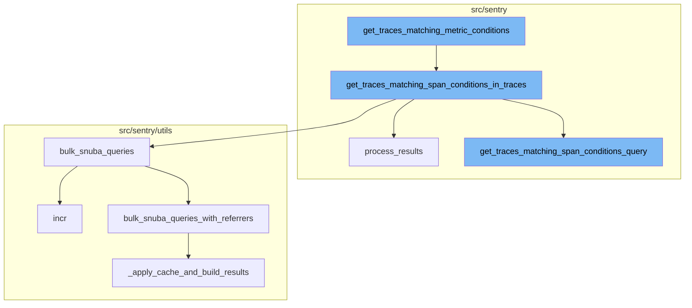

# Overview of fetch_rule_groups_paginated

The `fetch_rule_groups_paginated` function is a key part of the Sentry application. It is responsible for fetching rule groups in a paginated manner. This function filters the rule fire history based on the provided rule and date range, then groups the results by group, and annotates each group with count, event_id, and last_triggered. The results are then paginated using the `OffsetPaginator`.

# Detailed Flow

The flow starts with the `fetch_rule_groups_paginated` function. It then moves to the `get_result` method in the `OffsetPaginator` class, which builds a queryset based on the cursor value and counts the hits. The `count_hits` method is used to count the number of hits in a queryset. The flow then moves to the `execute` method, which returns the data from the `_execute` method. The `_execute` method gets traces matching conditions, refines the parameters, gets all queries, executes the queries in bulk, processes the results, and finally processes the final results. The `bulk_snuba_queries_with_referrers` function is used to run multiple Snuba queries in bulk. The `_apply_cache_and_build_results` function applies cache to the Snuba requests and builds the results.

# Further Flow Details

The flow continues with the `get_traces_matching_conditions` function, which decides which method to use for fetching traces based on the `mri` attribute. If `mri` is not None, it uses `get_traces_matching_metric_conditions`, otherwise it uses `get_traces_matching_span_conditions`. The `get_traces_matching_span_conditions` function is responsible for fetching traces that match certain span conditions. It first constructs a query using `get_traces_matching_span_conditions_query`, then runs the query using `run_query`, and processes the results using `process_results`. The `get_traces_matching_metric_conditions` function retrieves traces that match certain metric conditions. The `get_traces_matching_span_conditions_in_traces` function takes the trace IDs from the previous function and matches them with span conditions. The `bulk_snuba_queries` function is then called with the queries from the previous step. This function is an alias for `bulk_snuba_queries_with_referrers` that uses the same referrer for every request. It increments a metric for each query and then calls `bulk_snuba_queries_with_referrers` with the requests and referrer. The `get_traces_matching_span_conditions_query` function generates a query to match traces with span conditions. If there are multiple user queries, it uses an aggregate form of the condition to match on the trace. The `bulk_snuba_queries_with_referrers` function runs the queries on the appropriate endpoint. Each request is paired with a referrer to be used for that request. If caching is enabled, it checks the cache for each request and adds any misses to the query list. The `_apply_cache_and_build_results` function applies caching and builds the results for the queries. If caching is enabled, it checks the cache for each request and adds any misses to the query list. It then runs the queries and stores the results in the cache. The `process_results` function processes the results of the queries, translating columns and processing field metadata and results. It returns a dictionary containing the processed data and metadata.



# Flow drill down

First, we'll zoom into this section of the flow:



<SwmSnippet path="/src/sentry/rules/history/backends/postgres.py" line="59">

---

# fetch_rule_groups_paginated

The `fetch_rule_groups_paginated` function is used to fetch rule groups in a paginated manner. It filters the rule fire history based on the provided rule and date range, then groups the results by group, and annotates each group with count, event_id, and last_triggered. The results are then paginated using the `OffsetPaginator`.

```python
    def fetch_rule_groups_paginated(
        self,
        rule: Rule,
        start: datetime,
        end: datetime,
        cursor: Cursor | None = None,
        per_page: int = 25,
    ) -> CursorResult[Group]:
        filtered_history = RuleFireHistory.objects.filter(
            rule=rule,
            date_added__gte=start,
            date_added__lt=end,
        )

        # subquery that retrieves row with the largest date in a group
        group_max_dates = filtered_history.filter(group=OuterRef("group")).order_by("-date_added")[
            :1
        ]
        qs = (
            filtered_history.select_related("group")
            .values("group")
```

---

</SwmSnippet>

<SwmSnippet path="/src/sentry/api/paginator.py" line="136">

---

# get_result

`get_result` is a method in the `OffsetPaginator` class. It takes a limit and a cursor, and returns a cursor result. It builds a queryset based on the cursor value and counts the hits. It then fetches the required number of results from the queryset and builds a cursor for the next page.

```python
    def get_result(self, limit=100, cursor=None, count_hits=False, known_hits=None, max_hits=None):
        # cursors are:
        #   (identifier(integer), row offset, is_prev)
        if cursor is None:
            cursor = Cursor(0, 0, 0)

        limit = min(limit, self.max_limit)

        if cursor.value:
            cursor_value = self.value_from_cursor(cursor)
        else:
            cursor_value = 0

        queryset = self.build_queryset(cursor_value, cursor.is_prev)

        # TODO(dcramer): this does not yet work correctly for ``is_prev`` when
        # the key is not unique

        # max_hits can be limited to speed up the query
        if max_hits is None:
            max_hits = MAX_HITS_LIMIT
```

---

</SwmSnippet>

<SwmSnippet path="/src/sentry/api/paginator.py" line="27">

---

# count_hits

`count_hits` is a method used to count the number of hits in a queryset. It clears out any select fields and pulls just the id, then executes a count query on the database.

```python
def count_hits(queryset, max_hits):
    if not max_hits:
        return 0
    hits_query = queryset.values()[:max_hits].query
    # clear out any select fields (include select_related) and pull just the id
    hits_query.clear_select_clause()
    hits_query.add_fields(["id"])
    hits_query.clear_ordering(force=True, clear_default=True)
    try:
        h_sql, h_params = hits_query.sql_with_params()
    except EmptyResultSet:
        return 0
    cursor = connections[queryset.using_replica().db].cursor()
    cursor.execute(f"SELECT COUNT(*) FROM ({h_sql}) as t", h_params)
    return cursor.fetchone()[0]
```

---

</SwmSnippet>

<SwmSnippet path="/src/sentry/api/endpoints/organization_traces.py" line="341">

---

# execute

`execute` is a method that returns the data from the `_execute` method.

```python
    def execute(self, offset: int, limit: int):
        return {"data": self._execute()}
```

---

</SwmSnippet>

<SwmSnippet path="/src/sentry/api/endpoints/organization_traces.py" line="344">

---

# \_execute

`_execute` is a method that gets traces matching conditions, refines the parameters, gets all queries, executes the queries in bulk, processes the results, and finally processes the final results.

```python
    def _execute(self):
        with handle_span_query_errors():
            min_timestamp, max_timestamp, trace_ids = self.get_traces_matching_conditions(
                self.params,
                self.snuba_params,
            )

        self.refine_params(min_timestamp, max_timestamp)

        if not trace_ids:
            return []

        with handle_span_query_errors():
            params, snuba_params = self.params_with_all_projects()

            all_queries = self.get_all_queries(
                params,
                snuba_params,
                trace_ids,
            )

```

---

</SwmSnippet>

<SwmSnippet path="/src/sentry/api/endpoints/organization_traces.py" line="699">

---

# process_final_results

`process_final_results` is a method that processes the final results of the queries. It processes the breakdowns, gets the trace name, and returns a list of trace results.

```python
    def process_final_results(
        self,
        *,
        traces_metas_results,
        traces_errors_results,
        traces_occurrences_results,
        traces_breakdown_projects_results,
    ) -> list[TraceResult]:
        traces_range = {
            row["trace"]: {
                "start": row["first_seen()"],
                "end": row["last_seen()"],
                "slices": self.breakdown_slices,
            }
            for row in traces_metas_results["data"]
        }

        spans = [span for span in traces_breakdown_projects_results["data"]]
        spans.sort(key=lambda span: (span["precise.start_ts"], span["precise.finish_ts"]))

        try:
```

---

</SwmSnippet>

<SwmSnippet path="/src/sentry/utils/snuba.py" line="921">

---

# bulk_snuba_queries_with_referrers

`bulk_snuba_queries_with_referrers` is a function that runs multiple Snuba queries in bulk. It pairs each request with a referrer and runs them on the appropriate endpoint.

```python
def bulk_snuba_queries_with_referrers(
    requests_with_referrers: list[tuple[Request, str | None]],
    use_cache: bool = False,
    query_source: (
        QuerySource | None
    ) = None,  # TODO: @athena Make this field required after updated all the callsites
) -> ResultSet:
    """
    The main entrypoint to running queries in Snuba. This function accepts
    Requests for either MQL or SnQL queries and runs them on the appropriate endpoint.

    Every request is paired with a referrer to be used for that request.
    """

    if "consistent" in OVERRIDE_OPTIONS:
        for request, _ in requests_with_referrers:
            request.flags.consistent = OVERRIDE_OPTIONS["consistent"]

    for request, referrer in requests_with_referrers:
        if referrer or query_source:
            request.tenant_ids = request.tenant_ids or dict()
```

---

</SwmSnippet>

<SwmSnippet path="/src/sentry/utils/snuba.py" line="993">

---

# \_apply_cache_and_build_results

`_apply_cache_and_build_results` is a function that applies cache to the Snuba requests and builds the results. If cache is used, it gets the cache data, checks for cache hits and misses, and queries the missing ones. If cache is not used, it queries all requests. Finally, it sorts the results in the original order.

```python
def _apply_cache_and_build_results(
    snuba_requests: Sequence[SnubaRequest],
    use_cache: bool | None = False,
) -> ResultSet:
    parent_api: str = "<missing>"
    scope = sentry_sdk.Scope.get_current_scope()
    if scope.transaction:
        parent_api = scope.transaction.name

    # Store the original position of the query so that we can maintain the order
    snuba_requests_list: list[tuple[int, SnubaRequest]] = []
    for i, snuba_request in enumerate(snuba_requests):
        snuba_request.request.parent_api = parent_api
        snuba_requests_list.append((i, snuba_request))

    results = []

    to_query: list[tuple[int, SnubaRequest, str | None]] = []

    if use_cache:
        cache_keys = [
```

---

</SwmSnippet>

Now, lets zoom into this section of the flow:



<SwmSnippet path="/src/sentry/api/endpoints/organization_traces.py" line="415">

---

# get_traces_matching_conditions

The `get_traces_matching_conditions` function is the starting point of the flow. It decides which method to use for fetching traces based on the `mri` attribute. If `mri` is not None, it uses `get_traces_matching_metric_conditions`, otherwise it uses `get_traces_matching_span_conditions`.

```python
    def get_traces_matching_conditions(
        self,
        params: ParamsType,
        snuba_params: SnubaParams,
    ) -> tuple[datetime, datetime, list[str]]:
        if self.mri is not None:
            sentry_sdk.set_tag("mri", self.mri)
            return self.get_traces_matching_metric_conditions(params, snuba_params)

        return self.get_traces_matching_span_conditions(params, snuba_params)
```

---

</SwmSnippet>

<SwmSnippet path="/src/sentry/api/endpoints/organization_traces.py" line="492">

---

# get_traces_matching_span_conditions

The `get_traces_matching_span_conditions` function is responsible for fetching traces that match certain span conditions. It first constructs a query using `get_traces_matching_span_conditions_query`, then runs the query using `run_query`, and processes the results using `process_results`. The function returns a tuple containing the minimum timestamp, maximum timestamp, and a list of matching trace IDs.

```python
    def get_traces_matching_span_conditions(
        self,
        params: ParamsType,
        snuba_params: SnubaParams,
        trace_ids: list[str] | None = None,
    ) -> tuple[datetime, datetime, list[str]]:
        query, timestamp_column = self.get_traces_matching_span_conditions_query(
            params,
            snuba_params,
        )

        results = query.run_query(
            referrer=Referrer.API_TRACE_EXPLORER_SPANS_LIST.value,
        )
        results = query.process_results(results)

        matching_trace_ids: list[str] = []
        min_timestamp = self.snuba_params.end
        max_timestamp = self.snuba_params.start
        assert min_timestamp is not None
        assert max_timestamp is not None
```

---

</SwmSnippet>

<SwmSnippet path="/src/sentry/snuba/metrics_layer/query.py" line="143">

---

# run_query

The `run_query` function is used to execute a metrics query in Snuba. It is used within `get_traces_matching_span_conditions` to run the constructed query.

```python
def run_query(request: Request) -> Mapping[str, Any]:
    """
    Entrypoint for executing a metrics query in Snuba.
    """
    return bulk_run_query([request])[0]
```

---

</SwmSnippet>

<SwmSnippet path="/src/sentry/search/events/builder/base.py" line="1516">

---

# process_results

The `process_results` function is used to process the results of the query. It transforms the raw results into a more usable format, including translating columns, processing field meta, and processing field results. This processed data is then used in `get_traces_matching_span_conditions`.

```python
    def process_results(self, results: Any) -> EventsResponse:
        with sentry_sdk.start_span(op="QueryBuilder", description="process_results") as span:
            span.set_data("result_count", len(results.get("data", [])))
            translated_columns = {}
            if self.builder_config.transform_alias_to_input_format:
                translated_columns = {
                    column: function_details.field
                    for column, function_details in self.function_alias_map.items()
                }

                for column in list(self.function_alias_map):
                    translated_column = translated_columns.get(column, column)
                    if translated_column in self.function_alias_map:
                        continue
                    function_alias = self.function_alias_map.get(column)
                    if function_alias is not None:
                        self.function_alias_map[translated_column] = function_alias

                if self.raw_equations:
                    for index, equation in enumerate(self.raw_equations):
                        translated_columns[f"equation[{index}]"] = f"equation|{equation}"
```

---

</SwmSnippet>

Now, lets zoom into this section of the flow:



<SwmSnippet path="/src/sentry/api/endpoints/organization_traces.py" line="426">

---

# Fetching Rule Groups Paginated

The `get_traces_matching_metric_conditions` function is the starting point of the flow. It retrieves traces that match certain metric conditions. The function takes in parameters and snuba parameters, and returns a tuple containing minimum and maximum timestamps, and a list of trace IDs. If there are user queries, it further refines the trace IDs by applying them, leaving us with only traces where the metric exists and matches the user queries.

```python
    def get_traces_matching_metric_conditions(
        self,
        params: ParamsType,
        snuba_params: SnubaParams,
    ) -> tuple[datetime, datetime, list[str]]:
        assert self.mri is not None

        executor_cls = get_sample_list_executor_cls(self.mri)
        if executor_cls is None:
            raise ParseError(detail=f"Unsupported MRI: {self.mri}")

        executor = executor_cls(
            mri=self.mri,
            params=params,
            snuba_params=snuba_params,
            fields=["trace"],
            max=self.metrics_max,
            min=self.metrics_min,
            operation=self.metrics_operation,
            query=self.metrics_query,
            referrer=Referrer.API_TRACE_EXPLORER_METRICS_SPANS_LIST,
```

---

</SwmSnippet>

<SwmSnippet path="/src/sentry/api/endpoints/organization_traces.py" line="526">

---

The `get_traces_matching_span_conditions_in_traces` function is the next step in the flow. It takes the trace IDs from the previous function and matches them with span conditions. The function divides the trace IDs into chunks to avoid hitting the max query size limit in ClickHouse. For each chunk of trace IDs, it calls the `get_traces_matching_span_conditions_query` function to get the query and timestamp column.

```python
    def get_traces_matching_span_conditions_in_traces(
        self,
        params: ParamsType,
        snuba_params: SnubaParams,
        trace_ids: list[str],
    ) -> tuple[datetime, datetime, list[str]]:
        all_queries: list[BaseQueryBuilder] = []
        timestamp_column: str | None = None

        # Putting all the trace ids into a single query will likely encounter the
        # max query size limit in ClickHouse. This tries to spread the trace ids
        # out evenly across N queries up to some limit per query.
        max_trace_ids_per_chunk = options.get(
            "performance.traces.trace-explorer-max-trace-ids-per-chunk"
        )
        num_chunks = math.ceil(len(trace_ids) / max_trace_ids_per_chunk)
        chunk_size = math.ceil(len(trace_ids) / num_chunks)

        for chunk in chunked(trace_ids, chunk_size):
            query, timestamp_column = self.get_traces_matching_span_conditions_query(
                params,
```

---

</SwmSnippet>

<SwmSnippet path="/src/sentry/utils/snuba.py" line="900">

---

The `bulk_snuba_queries` function is then called with the queries from the previous step. This function is an alias for `bulk_snuba_queries_with_referrers` that uses the same referrer for every request. It increments a metric for each query and then calls `bulk_snuba_queries_with_referrers` with the requests and referrer.

```python
def bulk_snuba_queries(
    requests: list[Request],
    referrer: str | None = None,
    use_cache: bool = False,
    query_source: (
        QuerySource | None
    ) = None,  # TODO: @athena Make this field required after updated all the callsites
) -> ResultSet:
    """
    Alias for `bulk_snuba_queries_with_referrers` that uses the same referrer for every request.
    """

    metrics.incr("snql.sdk.api", tags={"referrer": referrer or "unknown"})

    return bulk_snuba_queries_with_referrers(
        [(request, referrer) for request in requests],
        use_cache=use_cache,
        query_source=query_source,
    )
```

---

</SwmSnippet>

<SwmSnippet path="/src/sentry/api/endpoints/organization_traces.py" line="584">

---

The `get_traces_matching_span_conditions_query` function is called within the `get_traces_matching_span_conditions_in_traces` function. It generates a query to match traces with span conditions. If there are multiple user queries, it uses an aggregate form of the condition to match on the trace.

```python
    def get_traces_matching_span_conditions_query(
        self,
        params: ParamsType,
        snuba_params: SnubaParams,
        sort: str | None = None,
    ) -> tuple[BaseQueryBuilder, str]:
        if len(self.user_queries) < 2:
            timestamp_column = "timestamp"
        else:
            timestamp_column = "min(timestamp)"

        if sort == "-timestamp":
            orderby = [f"-{timestamp_column}"]
        else:
            # The orderby is intentionally `None` here as this query is much faster
            # if we let Clickhouse decide which order to return the results in.
            # This also means we cannot order by any columns or paginate.
            orderby = None

        if len(self.user_queries) < 2:
            # Optimization: If there is only a condition for a single span,
```

---

</SwmSnippet>

<SwmSnippet path="/src/sentry/utils/snuba.py" line="921">

---

The `bulk_snuba_queries_with_referrers` function is called by `bulk_snuba_queries`. It runs the queries on the appropriate endpoint. Each request is paired with a referrer to be used for that request. If caching is enabled, it checks the cache for each request and adds any misses to the query list.

```python
def bulk_snuba_queries_with_referrers(
    requests_with_referrers: list[tuple[Request, str | None]],
    use_cache: bool = False,
    query_source: (
        QuerySource | None
    ) = None,  # TODO: @athena Make this field required after updated all the callsites
) -> ResultSet:
    """
    The main entrypoint to running queries in Snuba. This function accepts
    Requests for either MQL or SnQL queries and runs them on the appropriate endpoint.

    Every request is paired with a referrer to be used for that request.
    """

    if "consistent" in OVERRIDE_OPTIONS:
        for request, _ in requests_with_referrers:
            request.flags.consistent = OVERRIDE_OPTIONS["consistent"]

    for request, referrer in requests_with_referrers:
        if referrer or query_source:
            request.tenant_ids = request.tenant_ids or dict()
```

---

</SwmSnippet>

<SwmSnippet path="/src/sentry/utils/snuba.py" line="993">

---

The `_apply_cache_and_build_results` function is called within `bulk_snuba_queries_with_referrers`. It applies caching and builds the results for the queries. If caching is enabled, it checks the cache for each request and adds any misses to the query list. It then runs the queries and stores the results in the cache.

```python
def _apply_cache_and_build_results(
    snuba_requests: Sequence[SnubaRequest],
    use_cache: bool | None = False,
) -> ResultSet:
    parent_api: str = "<missing>"
    scope = sentry_sdk.Scope.get_current_scope()
    if scope.transaction:
        parent_api = scope.transaction.name

    # Store the original position of the query so that we can maintain the order
    snuba_requests_list: list[tuple[int, SnubaRequest]] = []
    for i, snuba_request in enumerate(snuba_requests):
        snuba_request.request.parent_api = parent_api
        snuba_requests_list.append((i, snuba_request))

    results = []

    to_query: list[tuple[int, SnubaRequest, str | None]] = []

    if use_cache:
        cache_keys = [
```

---

</SwmSnippet>

<SwmSnippet path="/src/sentry/search/events/builder/base.py" line="1516">

---

The `process_results` function is called after the queries have been run and the results have been built. It processes the results of the queries, translating columns and processing field metadata and results. It returns a dictionary containing the processed data and metadata.

```python
    def process_results(self, results: Any) -> EventsResponse:
        with sentry_sdk.start_span(op="QueryBuilder", description="process_results") as span:
            span.set_data("result_count", len(results.get("data", [])))
            translated_columns = {}
            if self.builder_config.transform_alias_to_input_format:
                translated_columns = {
                    column: function_details.field
                    for column, function_details in self.function_alias_map.items()
                }

                for column in list(self.function_alias_map):
                    translated_column = translated_columns.get(column, column)
                    if translated_column in self.function_alias_map:
                        continue
                    function_alias = self.function_alias_map.get(column)
                    if function_alias is not None:
                        self.function_alias_map[translated_column] = function_alias

                if self.raw_equations:
                    for index, equation in enumerate(self.raw_equations):
                        translated_columns[f"equation[{index}]"] = f"equation|{equation}"
```

---

</SwmSnippet>

&nbsp;

*This is an auto-generated document by Swimm AI 🌊 and has not yet been verified by a human*

<SwmMeta version="3.0.0" repo-id="Z2l0aHViJTNBJTNBc2VudHJ5LWRlbW8lM0ElM0FTd2ltbS1EZW1v" repo-name="sentry-demo" doc-type="flows"><sup>Powered by [Swimm](/)</sup></SwmMeta>
