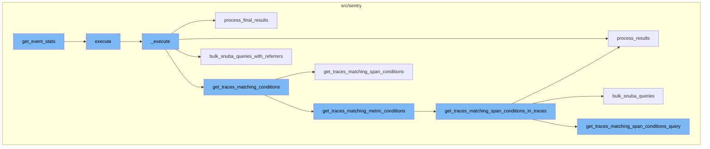
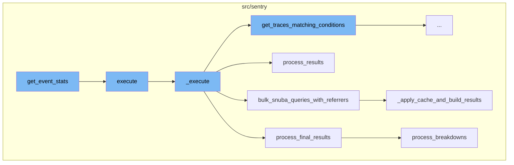
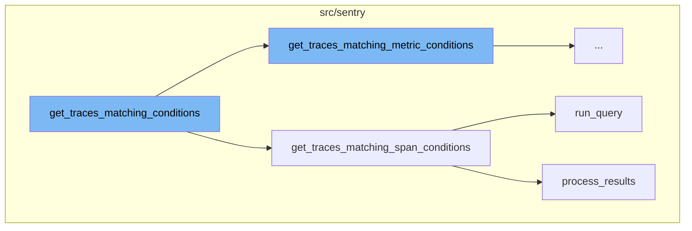
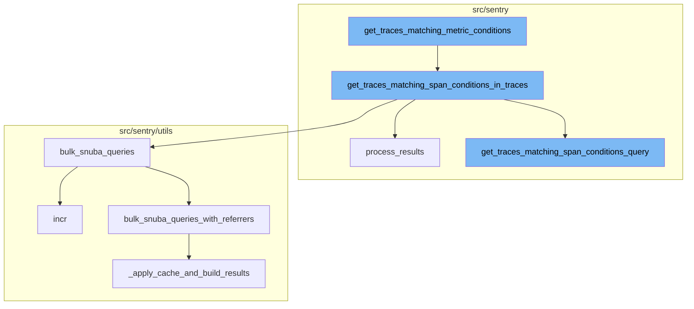

# Overview of get_event_stats

The `get_event_stats` function is the entry point for fetching event statistics. It initializes a `TraceStatsExecutor` with the necessary parameters and then calls its `execute` method to start the process of fetching the statistics.

# Execution of get_event_stats

The `execute` method is a wrapper around the `_execute` method. It simply calls `_execute` and wraps its result in a dictionary under the key 'data'.

# The \_execute Method

The `_execute` method is where the main logic for fetching event statistics resides. It first fetches traces matching certain conditions, then refines the parameters based on the fetched traces. It then performs a series of queries to fetch various types of data related to the traces. The results of these queries are then processed and combined into a final result set.

# Bulk Snuba Queries

The `bulk_snuba_queries_with_referrers` function is used to execute multiple Snuba queries at once. It takes a list of query and referrer pairs, and optionally a flag indicating whether to use cache. It then executes each query and returns the results.

# Processing Results

The `process_results` method is used to process the results of a Snuba query. It translates column names, processes field metadata, and transforms the result rows. It returns a dictionary containing the processed data and metadata.

# Processing Final Results

The `process_final_results` method is used to process the final results of the `_execute` method. It takes the results of various queries, processes them, and combines them into a list of `TraceResult` objects.

# Matching Conditions

The `get_traces_matching_conditions` function is the starting point of the flow. It checks if the `mri` attribute is not None, and if so, it sets a tag and calls `get_traces_matching_metric_conditions`. If `mri` is None, it calls `get_traces_matching_span_conditions` instead.

# Matching Span Conditions

The `get_traces_matching_span_conditions` function is responsible for getting traces that match certain conditions. It first gets the query and timestamp column, then runs the query and processes the results. It iterates over the results, appending matching trace IDs and updating the min and max timestamps. If the number of matching trace IDs reaches the limit, it returns early.

# Running the Query

The `run_query` function is called within `get_traces_matching_span_conditions`. It is the entry point for executing a metrics query in Snuba.

# Processing the Results

The `process_results` function is also called within `get_traces_matching_span_conditions`. It processes the results of the query, transforming and translating columns, processing field meta and field results, and handling invalid float values.

# Matching Metric Conditions

The `get_traces_matching_metric_conditions` function is the starting point of the flow. It retrieves traces that match certain metric conditions. The function takes in parameters and snuba parameters, and returns a tuple of minimum timestamp, maximum timestamp, and a list of trace IDs. If there are user queries, it further refines the trace IDs by applying them, leaving us with only traces where the metric exists and matches the user queries.

# Matching Span Conditions in Traces

The `get_traces_matching_span_conditions_in_traces` function is called next. It gets traces that match certain span conditions. The function takes in parameters, snuba parameters, and a list of trace IDs, and returns a tuple of minimum timestamp, maximum timestamp, and a list of matching trace IDs. The function divides the trace IDs into chunks and for each chunk, it calls the `get_traces_matching_span_conditions_query` function.

# Generating the Query

The `get_traces_matching_span_conditions_query` function is used to generate a query that matches span conditions. It returns a query and a timestamp column. The function creates a query based on the user queries and adds conditions to the query.

# Bulk Snuba Queries

The `bulk_snuba_queries` function is called next. It is an alias for `bulk_snuba_queries_with_referrers` that uses the same referrer for every request. It takes in a list of requests and a referrer, and returns a result set.

# Bulk Snuba Queries with Referrers

The `bulk_snuba_queries_with_referrers` function is the main entry point to running queries in Snuba. It accepts requests for either MQL or SnQL queries and runs them on the appropriate endpoint. Every request is paired with a referrer to be used for that request. The function applies cache and builds results.

# Processing the Results

The `process_results` function is called to process the results of the queries. It takes in the results and returns an events response. The function translates columns, processes the field meta, and processes the field results.



# Flow drill down

First, we'll zoom into this section of the flow:



<SwmSnippet path="/src/sentry/api/endpoints/organization_traces.py" line="267">

---

# get_event_stats Function

The `get_event_stats` function is the entry point for fetching event statistics. It initializes a `TraceStatsExecutor` with the necessary parameters and then calls its `execute` method to start the process of fetching the statistics.

```python
        def get_event_stats(
            _columns: Sequence[str],
            _query: str,
            _params: dict[str, str],
            rollup: int,
            zerofill_results: bool,
            comparison_delta: timedelta | None,
        ) -> SnubaTSResult:
            executor = TraceStatsExecutor(
                params=cast(ParamsType, params),
                snuba_params=snuba_params,
                columns=serialized["yAxis"],
                user_queries=serialized.get("query", []),
                rollup=rollup,
                zerofill_results=zerofill_results,
            )
            return executor.execute()
```

---

</SwmSnippet>

<SwmSnippet path="/src/sentry/api/endpoints/organization_traces.py" line="341">

---

# execute Method

The `execute` method is a wrapper around the `_execute` method. It simply calls `_execute` and wraps its result in a dictionary under the key 'data'.

```python
    def execute(self, offset: int, limit: int):
        return {"data": self._execute()}
```

---

</SwmSnippet>

<SwmSnippet path="/src/sentry/api/endpoints/organization_traces.py" line="344">

---

# \_execute Method

The `_execute` method is where the main logic for fetching event statistics resides. It first fetches traces matching certain conditions, then refines the parameters based on the fetched traces. It then performs a series of queries to fetch various types of data related to the traces. The results of these queries are then processed and combined into a final result set.

```python
    def _execute(self):
        with handle_span_query_errors():
            min_timestamp, max_timestamp, trace_ids = self.get_traces_matching_conditions(
                self.params,
                self.snuba_params,
            )

        self.refine_params(min_timestamp, max_timestamp)

        if not trace_ids:
            return []

        with handle_span_query_errors():
            params, snuba_params = self.params_with_all_projects()

            all_queries = self.get_all_queries(
                params,
                snuba_params,
                trace_ids,
            )

```

---

</SwmSnippet>

<SwmSnippet path="/src/sentry/utils/snuba.py" line="921">

---

# bulk_snuba_queries_with_referrers Function

The `bulk_snuba_queries_with_referrers` function is used to execute multiple Snuba queries at once. It takes a list of query and referrer pairs, and optionally a flag indicating whether to use cache. It then executes each query and returns the results.

```python
def bulk_snuba_queries_with_referrers(
    requests_with_referrers: list[tuple[Request, str | None]],
    use_cache: bool = False,
    query_source: (
        QuerySource | None
    ) = None,  # TODO: @athena Make this field required after updated all the callsites
) -> ResultSet:
    """
    The main entrypoint to running queries in Snuba. This function accepts
    Requests for either MQL or SnQL queries and runs them on the appropriate endpoint.

    Every request is paired with a referrer to be used for that request.
    """

    if "consistent" in OVERRIDE_OPTIONS:
        for request, _ in requests_with_referrers:
            request.flags.consistent = OVERRIDE_OPTIONS["consistent"]

    for request, referrer in requests_with_referrers:
        if referrer or query_source:
            request.tenant_ids = request.tenant_ids or dict()
```

---

</SwmSnippet>

<SwmSnippet path="/src/sentry/search/events/builder/base.py" line="1516">

---

# process_results Method

The `process_results` method is used to process the results of a Snuba query. It translates column names, processes field metadata, and transforms the result rows. It returns a dictionary containing the processed data and metadata.

```python
    def process_results(self, results: Any) -> EventsResponse:
        with sentry_sdk.start_span(op="QueryBuilder", description="process_results") as span:
            span.set_data("result_count", len(results.get("data", [])))
            translated_columns = {}
            if self.builder_config.transform_alias_to_input_format:
                translated_columns = {
                    column: function_details.field
                    for column, function_details in self.function_alias_map.items()
                }

                for column in list(self.function_alias_map):
                    translated_column = translated_columns.get(column, column)
                    if translated_column in self.function_alias_map:
                        continue
                    function_alias = self.function_alias_map.get(column)
                    if function_alias is not None:
                        self.function_alias_map[translated_column] = function_alias

                if self.raw_equations:
                    for index, equation in enumerate(self.raw_equations):
                        translated_columns[f"equation[{index}]"] = f"equation|{equation}"
```

---

</SwmSnippet>

<SwmSnippet path="/src/sentry/api/endpoints/organization_traces.py" line="699">

---

# process_final_results Method

The `process_final_results` method is used to process the final results of the `_execute` method. It takes the results of various queries, processes them, and combines them into a list of `TraceResult` objects.

```python
    def process_final_results(
        self,
        *,
        traces_metas_results,
        traces_errors_results,
        traces_occurrences_results,
        traces_breakdown_projects_results,
    ) -> list[TraceResult]:
        traces_range = {
            row["trace"]: {
                "start": row["first_seen()"],
                "end": row["last_seen()"],
                "slices": self.breakdown_slices,
            }
            for row in traces_metas_results["data"]
        }

        spans = [span for span in traces_breakdown_projects_results["data"]]
        spans.sort(key=lambda span: (span["precise.start_ts"], span["precise.finish_ts"]))

        try:
```

---

</SwmSnippet>

Now, lets zoom into this section of the flow:



<SwmSnippet path="/src/sentry/api/endpoints/organization_traces.py" line="415">

---

# get_event_stats Flow

The `get_traces_matching_conditions` function is the starting point of the flow. It checks if the `mri` attribute is not None, and if so, it sets a tag and calls `get_traces_matching_metric_conditions`. If `mri` is None, it calls `get_traces_matching_span_conditions` instead.

```python
    def get_traces_matching_conditions(
        self,
        params: ParamsType,
        snuba_params: SnubaParams,
    ) -> tuple[datetime, datetime, list[str]]:
        if self.mri is not None:
            sentry_sdk.set_tag("mri", self.mri)
            return self.get_traces_matching_metric_conditions(params, snuba_params)

        return self.get_traces_matching_span_conditions(params, snuba_params)
```

---

</SwmSnippet>

<SwmSnippet path="/src/sentry/api/endpoints/organization_traces.py" line="492">

---

## get_traces_matching_span_conditions Function

The `get_traces_matching_span_conditions` function is responsible for getting traces that match certain conditions. It first gets the query and timestamp column, then runs the query and processes the results. It iterates over the results, appending matching trace IDs and updating the min and max timestamps. If the number of matching trace IDs reaches the limit, it returns early.

```python
    def get_traces_matching_span_conditions(
        self,
        params: ParamsType,
        snuba_params: SnubaParams,
        trace_ids: list[str] | None = None,
    ) -> tuple[datetime, datetime, list[str]]:
        query, timestamp_column = self.get_traces_matching_span_conditions_query(
            params,
            snuba_params,
        )

        results = query.run_query(
            referrer=Referrer.API_TRACE_EXPLORER_SPANS_LIST.value,
        )
        results = query.process_results(results)

        matching_trace_ids: list[str] = []
        min_timestamp = self.snuba_params.end
        max_timestamp = self.snuba_params.start
        assert min_timestamp is not None
        assert max_timestamp is not None
```

---

</SwmSnippet>

<SwmSnippet path="/src/sentry/snuba/metrics_layer/query.py" line="143">

---

### Running the Query

The `run_query` function is called within `get_traces_matching_span_conditions`. It is the entry point for executing a metrics query in Snuba.

```python
def run_query(request: Request) -> Mapping[str, Any]:
    """
    Entrypoint for executing a metrics query in Snuba.
    """
    return bulk_run_query([request])[0]
```

---

</SwmSnippet>

<SwmSnippet path="/src/sentry/search/events/builder/base.py" line="1516">

---

### Processing the Results

The `process_results` function is also called within `get_traces_matching_span_conditions`. It processes the results of the query, transforming and translating columns, processing field meta and field results, and handling invalid float values.

```python
    def process_results(self, results: Any) -> EventsResponse:
        with sentry_sdk.start_span(op="QueryBuilder", description="process_results") as span:
            span.set_data("result_count", len(results.get("data", [])))
            translated_columns = {}
            if self.builder_config.transform_alias_to_input_format:
                translated_columns = {
                    column: function_details.field
                    for column, function_details in self.function_alias_map.items()
                }

                for column in list(self.function_alias_map):
                    translated_column = translated_columns.get(column, column)
                    if translated_column in self.function_alias_map:
                        continue
                    function_alias = self.function_alias_map.get(column)
                    if function_alias is not None:
                        self.function_alias_map[translated_column] = function_alias

                if self.raw_equations:
                    for index, equation in enumerate(self.raw_equations):
                        translated_columns[f"equation[{index}]"] = f"equation|{equation}"
```

---

</SwmSnippet>

Now, lets zoom into this section of the flow:



<SwmSnippet path="/src/sentry/api/endpoints/organization_traces.py" line="426">

---

# get_event_stats Flow

The `get_traces_matching_metric_conditions` function is the starting point of the flow. It retrieves traces that match certain metric conditions. The function takes in parameters and snuba parameters, and returns a tuple of minimum timestamp, maximum timestamp, and a list of trace IDs. If there are user queries, it further refines the trace IDs by applying them, leaving us with only traces where the metric exists and matches the user queries.

```python
    def get_traces_matching_metric_conditions(
        self,
        params: ParamsType,
        snuba_params: SnubaParams,
    ) -> tuple[datetime, datetime, list[str]]:
        assert self.mri is not None

        executor_cls = get_sample_list_executor_cls(self.mri)
        if executor_cls is None:
            raise ParseError(detail=f"Unsupported MRI: {self.mri}")

        executor = executor_cls(
            mri=self.mri,
            params=params,
            snuba_params=snuba_params,
            fields=["trace"],
            max=self.metrics_max,
            min=self.metrics_min,
            operation=self.metrics_operation,
            query=self.metrics_query,
            referrer=Referrer.API_TRACE_EXPLORER_METRICS_SPANS_LIST,
```

---

</SwmSnippet>

<SwmSnippet path="/src/sentry/api/endpoints/organization_traces.py" line="526">

---

The `get_traces_matching_span_conditions_in_traces` function is called next. It gets traces that match certain span conditions. The function takes in parameters, snuba parameters, and a list of trace IDs, and returns a tuple of minimum timestamp, maximum timestamp, and a list of matching trace IDs. The function divides the trace IDs into chunks and for each chunk, it calls the `get_traces_matching_span_conditions_query` function.

```python
    def get_traces_matching_span_conditions_in_traces(
        self,
        params: ParamsType,
        snuba_params: SnubaParams,
        trace_ids: list[str],
    ) -> tuple[datetime, datetime, list[str]]:
        all_queries: list[BaseQueryBuilder] = []
        timestamp_column: str | None = None

        # Putting all the trace ids into a single query will likely encounter the
        # max query size limit in ClickHouse. This tries to spread the trace ids
        # out evenly across N queries up to some limit per query.
        max_trace_ids_per_chunk = options.get(
            "performance.traces.trace-explorer-max-trace-ids-per-chunk"
        )
        num_chunks = math.ceil(len(trace_ids) / max_trace_ids_per_chunk)
        chunk_size = math.ceil(len(trace_ids) / num_chunks)

        for chunk in chunked(trace_ids, chunk_size):
            query, timestamp_column = self.get_traces_matching_span_conditions_query(
                params,
```

---

</SwmSnippet>

<SwmSnippet path="/src/sentry/api/endpoints/organization_traces.py" line="584">

---

The `get_traces_matching_span_conditions_query` function is used to generate a query that matches span conditions. It returns a query and a timestamp column. The function creates a query based on the user queries and adds conditions to the query.

```python
    def get_traces_matching_span_conditions_query(
        self,
        params: ParamsType,
        snuba_params: SnubaParams,
        sort: str | None = None,
    ) -> tuple[BaseQueryBuilder, str]:
        if len(self.user_queries) < 2:
            timestamp_column = "timestamp"
        else:
            timestamp_column = "min(timestamp)"

        if sort == "-timestamp":
            orderby = [f"-{timestamp_column}"]
        else:
            # The orderby is intentionally `None` here as this query is much faster
            # if we let Clickhouse decide which order to return the results in.
            # This also means we cannot order by any columns or paginate.
            orderby = None

        if len(self.user_queries) < 2:
            # Optimization: If there is only a condition for a single span,
```

---

</SwmSnippet>

<SwmSnippet path="/src/sentry/utils/snuba.py" line="900">

---

The `bulk_snuba_queries` function is called next. It is an alias for `bulk_snuba_queries_with_referrers` that uses the same referrer for every request. It takes in a list of requests and a referrer, and returns a result set.

```python
def bulk_snuba_queries(
    requests: list[Request],
    referrer: str | None = None,
    use_cache: bool = False,
    query_source: (
        QuerySource | None
    ) = None,  # TODO: @athena Make this field required after updated all the callsites
) -> ResultSet:
    """
    Alias for `bulk_snuba_queries_with_referrers` that uses the same referrer for every request.
    """

    metrics.incr("snql.sdk.api", tags={"referrer": referrer or "unknown"})

    return bulk_snuba_queries_with_referrers(
        [(request, referrer) for request in requests],
        use_cache=use_cache,
        query_source=query_source,
    )
```

---

</SwmSnippet>

<SwmSnippet path="/src/sentry/utils/snuba.py" line="921">

---

The `bulk_snuba_queries_with_referrers` function is the main entry point to running queries in Snuba. It accepts requests for either MQL or SnQL queries and runs them on the appropriate endpoint. Every request is paired with a referrer to be used for that request. The function applies cache and builds results.

```python
def bulk_snuba_queries_with_referrers(
    requests_with_referrers: list[tuple[Request, str | None]],
    use_cache: bool = False,
    query_source: (
        QuerySource | None
    ) = None,  # TODO: @athena Make this field required after updated all the callsites
) -> ResultSet:
    """
    The main entrypoint to running queries in Snuba. This function accepts
    Requests for either MQL or SnQL queries and runs them on the appropriate endpoint.

    Every request is paired with a referrer to be used for that request.
    """

    if "consistent" in OVERRIDE_OPTIONS:
        for request, _ in requests_with_referrers:
            request.flags.consistent = OVERRIDE_OPTIONS["consistent"]

    for request, referrer in requests_with_referrers:
        if referrer or query_source:
            request.tenant_ids = request.tenant_ids or dict()
```

---

</SwmSnippet>

<SwmSnippet path="/src/sentry/search/events/builder/base.py" line="1516">

---

The `process_results` function is called to process the results of the queries. It takes in the results and returns an events response. The function translates columns, processes the field meta, and processes the field results.

```python
    def process_results(self, results: Any) -> EventsResponse:
        with sentry_sdk.start_span(op="QueryBuilder", description="process_results") as span:
            span.set_data("result_count", len(results.get("data", [])))
            translated_columns = {}
            if self.builder_config.transform_alias_to_input_format:
                translated_columns = {
                    column: function_details.field
                    for column, function_details in self.function_alias_map.items()
                }

                for column in list(self.function_alias_map):
                    translated_column = translated_columns.get(column, column)
                    if translated_column in self.function_alias_map:
                        continue
                    function_alias = self.function_alias_map.get(column)
                    if function_alias is not None:
                        self.function_alias_map[translated_column] = function_alias

                if self.raw_equations:
                    for index, equation in enumerate(self.raw_equations):
                        translated_columns[f"equation[{index}]"] = f"equation|{equation}"
```

---

</SwmSnippet>

&nbsp;

*This is an auto-generated document by Swimm AI 🌊 and has not yet been verified by a human*

<SwmMeta version="3.0.0" repo-id="Z2l0aHViJTNBJTNBc2VudHJ5LWRlbW8lM0ElM0FTd2ltbS1EZW1v" repo-name="sentry-demo" doc-type="flows"><sup>Powered by [Swimm](/)</sup></SwmMeta>
