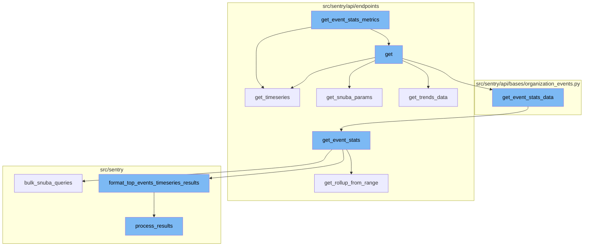
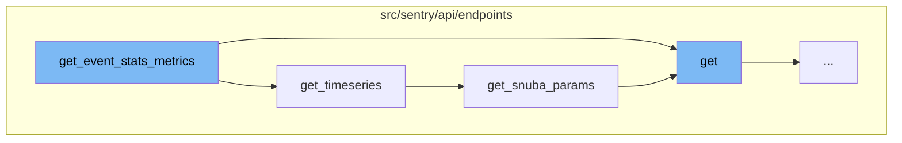
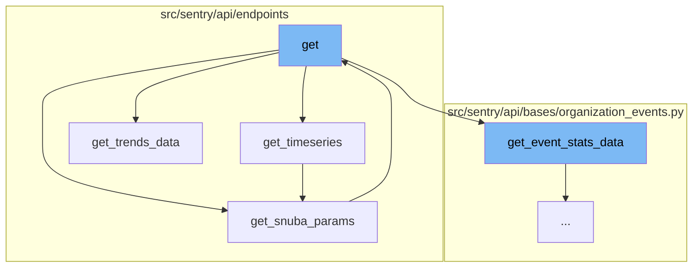
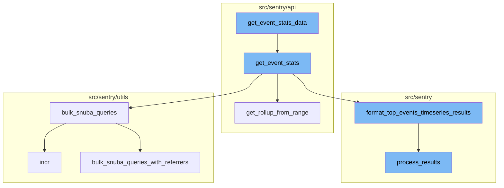

# Overview of get_event_stats_metrics

The `get_event_stats_metrics` function is a key component in the Sentry application. It is responsible for fetching the top trending transactions based on the user query and parameters. The function first determines the limit for the top events, then fetches the top trending transactions. If no top trending transactions are found, it returns an empty dictionary. Otherwise, it fetches the timeseries for each top transaction name.

# get_timeseries Function

The `get_timeseries` function is used to fetch the timeseries for each top transaction. It splits the top events into multiple queries for bulk timeseries query. It then prunes the projects to reduce query cardinality and performs a bulk timeseries query. The results are then parsed and formatted before being returned.

# get_snuba_params Function

The `get_snuba_params` function is used to get the parameters for the Snuba query. It checks if exactly one project is specified, otherwise it raises a ParseError.

# get Function

The `get` function is the main entry point for the API endpoint. It first gets the Snuba parameters and validates the request data. It then performs a query to get the suspect span groups and paginates the results before returning them.

# get_event_stats_metrics Flow

The `get` function is the entry point of the flow. It receives a request and an organization as parameters and returns a response. Inside this function, several other functions are called to process the request and generate the response.

# get_timeseries Function

`get_timeseries` is a function that takes top events, rollup, and zerofill_results as parameters. It splits the top events into multiple queries for a bulk timeseries query. It also prunes the projects to reduce query cardinality and performs a bulk timeseries query.

# get_snuba_params Function

`get_snuba_params` is a function that retrieves the parameters for the Snuba query. It checks if exactly one project is specified in the parameters, otherwise, it raises an error.

# get_trends_data Function

`get_trends_data` is a function that processes the stats data and the request to generate trends data. It formats the stats data, sends it to a microservice, and sorts the results into a trending events list.

# get_event_stats_data Function

The `get_event_stats_data` function is the entry point of the flow. It receives various parameters including the `get_event_stats` function and uses them to construct a query for event statistics. It handles errors, sets up parameters, and makes a call to the `get_event_stats` function. The results are then serialized and returned.

# get_event_stats Function

The `get_event_stats` function is called within `get_event_stats_data`. It calculates the rollup from the date range, builds the query, and makes a bulk request to Snuba. The results are then formatted and returned.

# get_rollup_from_range Function

The `get_rollup_from_range` function is used within `get_event_stats` to calculate the rollup from the date range.

# bulk_snuba_queries Function

The `bulk_snuba_queries` function is used within `get_event_stats` to make a bulk request to Snuba.

# format_top_events_timeseries_results Function

The `format_top_events_timeseries_results` function is used within `get_event_stats` to format the results from the Snuba query.

# process_results Function

The `process_results` function is used within `format_top_events_timeseries_results` to process the results and return a transformed version of the data.

# bulk_snuba_queries_with_referrers Function

The `bulk_snuba_queries_with_referrers` function is used within `bulk_snuba_queries` to make a bulk request to Snuba with referrers.

# incr Function

The `incr` function is used within `bulk_snuba_queries_with_referrers` to increment a metric.



# Flow drill down

First, we'll zoom into this section of the flow:



<SwmSnippet path="/src/sentry/api/endpoints/organization_events_trends_v2.py" line="228">

---

# get_event_stats_metrics Function

The `get_event_stats_metrics` function is used to fetch the top trending transactions based on the user query and parameters. It first determines the limit for the top events, then fetches the top trending transactions using the `get_top_events` function. If no top trending transactions are found, it returns an empty dictionary. Otherwise, it fetches the timeseries for each top transaction name using the `get_timeseries` function.

```python
        def get_event_stats_metrics(_, user_query, params, rollup, zerofill_results, __):
            top_event_limit = min(
                int(request.GET.get("topEvents", DEFAULT_TOP_EVENTS_LIMIT)),
                MAX_TOP_EVENTS_LIMIT,
            )

            # Fetch transactions names with the highest event count
            top_trending_transactions = get_top_events(
                user_query=user_query,
                params=params,
                event_limit=top_event_limit,
                referrer=Referrer.API_TRENDS_GET_EVENT_STATS_V2_TOP_EVENTS.value,
            )

            sentry_sdk.set_tag(
                "performance.trendsv2.top_events",
                top_trending_transactions.get("data", None) is not None,
            )
            if len(top_trending_transactions.get("data", [])) == 0:
                return {}

```

---

</SwmSnippet>

<SwmSnippet path="/src/sentry/api/endpoints/organization_events_trends_v2.py" line="123">

---

# get_timeseries Function

The `get_timeseries` function is used to fetch the timeseries for each top transaction. It splits the top events into multiple queries for bulk timeseries query. It then prunes the projects to reduce query cardinality and performs a bulk timeseries query. The results are then parsed and formatted before being returned.

```python
        def get_timeseries(top_events, _, rollup, zerofill_results):
            # Split top events into multiple queries for bulk timeseries query
            data = top_events["data"]

            queries = [
                generate_top_transaction_query(chunk) for chunk in chunked(data, EVENTS_PER_QUERY)
            ]

            timeseries_columns = selected_columns[:]
            timeseries_columns.append(trend_function)

            # When all projects or my projects options selected,
            # keep only projects that top events belong to to reduce query cardinality
            used_project_ids = set({event["project_id"] for event in data})

            # Get new params with pruned projects
            pruned_params = self.get_snuba_params(request, organization)
            pruned_params["project_objects"] = [
                project
                for project in pruned_params["project_objects"]
                if project.id in used_project_ids
```

---

</SwmSnippet>

<SwmSnippet path="/src/sentry/api/endpoints/organization_events_spans_performance.py" line="90">

---

# get_snuba_params Function

The `get_snuba_params` function is used to get the parameters for the Snuba query. It checks if exactly one project is specified, otherwise it raises a ParseError.

```python
    def get_snuba_params(
        self, request: Request, organization: Organization, check_global_views: bool = True
    ) -> ParamsType:
        params = super().get_snuba_params(request, organization, check_global_views)

        if len(params.get("project_id", [])) != 1:
            raise ParseError(detail="You must specify exactly 1 project.")

        return params
```

---

</SwmSnippet>

<SwmSnippet path="/src/sentry/api/endpoints/organization_events_spans_performance.py" line="158">

---

# get Function

The `get` function is the main entry point for the API endpoint. It first gets the Snuba parameters and validates the request data. It then performs a query to get the suspect span groups and paginates the results before returning them.

```python
    def get(self, request: Request, organization: Organization) -> Response:
        try:
            params = self.get_snuba_params(request, organization)
        except NoProjects:
            return Response(status=404)

        serializer = SpansPerformanceSerializer(data=request.GET)
        if not serializer.is_valid():
            return Response(serializer.errors, status=400)
        serialized = serializer.validated_data

        fields = serialized.get("field", [])
        query = serialized.get("query")
        span_ops = serialized.get("spanOp")
        exclude_span_ops = serialized.get("excludeSpanOp")
        span_groups = serialized.get("spanGroup")
        min_exclusive_time = serialized.get("min_exclusive_time")
        max_exclusive_time = serialized.get("max_exclusive_time")

        direction, orderby_column = self.get_orderby_column(request)

```

---

</SwmSnippet>

Now, lets zoom into this section of the flow:



<SwmSnippet path="/src/sentry/api/endpoints/organization_events_trends_v2.py" line="75">

---

# get_event_stats_metrics Flow

The `get` function is the entry point of the flow. It receives a request and an organization as parameters and returns a response. Inside this function, several other functions are called to process the request and generate the response.

```python
    def get(self, request: Request, organization) -> Response:
        if not self.has_feature(organization, request):
            return Response(status=404)

        try:
            params = self.get_snuba_params(request, organization)
        except NoProjects:
            return Response([])

        trend_type = request.GET.get("trendType", REGRESSION)
        if trend_type not in TREND_TYPES:
            raise ParseError(detail=f"{trend_type} is not a supported trend type")

        trend_function = request.GET.get("trendFunction", "p50()")

        selected_columns = ["project_id", "transaction"]

        query = request.GET.get("query")

        def get_top_events(user_query, params, event_limit, referrer):
            top_event_columns = selected_columns[:]
```

---

</SwmSnippet>

<SwmSnippet path="/src/sentry/api/endpoints/organization_events_trends_v2.py" line="123">

---

`get_timeseries` is a function that takes top events, rollup, and zerofill_results as parameters. It splits the top events into multiple queries for a bulk timeseries query. It also prunes the projects to reduce query cardinality and performs a bulk timeseries query.

```python
        def get_timeseries(top_events, _, rollup, zerofill_results):
            # Split top events into multiple queries for bulk timeseries query
            data = top_events["data"]

            queries = [
                generate_top_transaction_query(chunk) for chunk in chunked(data, EVENTS_PER_QUERY)
            ]

            timeseries_columns = selected_columns[:]
            timeseries_columns.append(trend_function)

            # When all projects or my projects options selected,
            # keep only projects that top events belong to to reduce query cardinality
            used_project_ids = set({event["project_id"] for event in data})

            # Get new params with pruned projects
            pruned_params = self.get_snuba_params(request, organization)
            pruned_params["project_objects"] = [
                project
                for project in pruned_params["project_objects"]
                if project.id in used_project_ids
```

---

</SwmSnippet>

<SwmSnippet path="/src/sentry/api/endpoints/organization_events_spans_performance.py" line="90">

---

`get_snuba_params` is a function that retrieves the parameters for the Snuba query. It checks if exactly one project is specified in the parameters, otherwise, it raises an error.

```python
    def get_snuba_params(
        self, request: Request, organization: Organization, check_global_views: bool = True
    ) -> ParamsType:
        params = super().get_snuba_params(request, organization, check_global_views)

        if len(params.get("project_id", [])) != 1:
            raise ParseError(detail="You must specify exactly 1 project.")

        return params
```

---

</SwmSnippet>

<SwmSnippet path="/src/sentry/api/endpoints/organization_events_trends_v2.py" line="264">

---

`get_trends_data` is a function that processes the stats data and the request to generate trends data. It formats the stats data, sends it to a microservice, and sorts the results into a trending events list.

```python
        def get_trends_data(stats_data, request):
            stats_data = dict(
                [format_start_end(data) for data in list(stats_data.items()) if data[1] is not None]
            )

            trend_sort = "" if trend_type == ANY else request.GET.get("sort", "trend_percentage()")
            trend_function = request.GET.get("trendFunction", "p50()")

            # list of requests to send to microservice async
            trends_requests = [
                {
                    "data": dict(chunk),
                    "sort": trend_sort,
                    "trendFunction": trend_function,
                }
                for chunk in chunked(stats_data.items(), EVENTS_PER_QUERY)
            ]

            # send the data to microservice
            results = list(_query_thread_pool.map(detect_breakpoints, trends_requests))
            trend_results = []
```

---

</SwmSnippet>

Now, lets zoom into this section of the flow:



<SwmSnippet path="/src/sentry/api/bases/organization_events.py" line="421">

---

# get_event_stats_metrics Flow

The `get_event_stats_data` function is the entry point of the flow. It receives various parameters including the `get_event_stats` function and uses them to construct a query for event statistics. It handles errors, sets up parameters, and makes a call to the `get_event_stats` function. The results are then serialized and returned.

```python
    def get_event_stats_data(
        self,
        request: Request,
        organization: Organization,
        get_event_stats: Callable[
            [Sequence[str], str, dict[str, str], int, bool, timedelta | None], SnubaTSResult
        ],
        top_events: int = 0,
        query_column: str = "count()",
        params: ParamsType | None = None,
        query: str | None = None,
        allow_partial_buckets: bool = False,
        zerofill_results: bool = True,
        comparison_delta: timedelta | None = None,
        additional_query_column: str | None = None,
        dataset: Any | None = None,
    ) -> dict[str, Any]:
        with handle_query_errors():
            with sentry_sdk.start_span(
                op="discover.endpoint", description="base.stats_query_creation"
            ):
```

---

</SwmSnippet>

<SwmSnippet path="/src/sentry/api/endpoints/organization_profiling_functions.py" line="115">

---

The `get_event_stats` function is called within `get_event_stats_data`. It calculates the rollup from the date range, builds the query, and makes a bulk request to Snuba. The results are then formatted and returned.

```python
        def get_event_stats(_columns, query, params, _rollup, zerofill_results, _comparison_delta):
            rollup = get_rollup_from_range(params["end"] - params["start"])

            chunks = [
                top_functions["data"][i : i + FUNCTIONS_PER_QUERY]
                for i in range(0, len(top_functions["data"]), FUNCTIONS_PER_QUERY)
            ]

            builders = [
                ProfileTopFunctionsTimeseriesQueryBuilder(
                    dataset=Dataset.Functions,
                    params=params,
                    interval=rollup,
                    top_events=chunk,
                    other=False,
                    query=query,
                    selected_columns=["project.id", "fingerprint"],
                    # It's possible to override the columns via
                    # the `yAxis` qs. So we explicitly ignore the
                    # columns, and hard code in the columns we want.
                    timeseries_columns=[data["function"], "examples()"],
```

---

</SwmSnippet>

<SwmSnippet path="/src/sentry/api/endpoints/organization_profiling_functions.py" line="285">

---

The `get_rollup_from_range` function is used within `get_event_stats` to calculate the rollup from the date range.

```python
def get_rollup_from_range(date_range: timedelta, top_functions=TOP_FUNCTIONS_LIMIT) -> int:
    interval = parse_stats_period(get_interval_from_range(date_range))
    if interval is None:
        interval = timedelta(hours=1)
    validate_interval(interval, InvalidSearchQuery(), date_range, top_functions)
    return int(interval.total_seconds())
```

---

</SwmSnippet>

<SwmSnippet path="/src/sentry/utils/snuba.py" line="900">

---

The `bulk_snuba_queries` function is used within `get_event_stats` to make a bulk request to Snuba.

```python
def bulk_snuba_queries(
    requests: list[Request],
    referrer: str | None = None,
    use_cache: bool = False,
    query_source: (
        QuerySource | None
    ) = None,  # TODO: @athena Make this field required after updated all the callsites
) -> ResultSet:
    """
    Alias for `bulk_snuba_queries_with_referrers` that uses the same referrer for every request.
    """

    metrics.incr("snql.sdk.api", tags={"referrer": referrer or "unknown"})

    return bulk_snuba_queries_with_referrers(
        [(request, referrer) for request in requests],
        use_cache=use_cache,
        query_source=query_source,
    )
```

---

</SwmSnippet>

<SwmSnippet path="/src/sentry/snuba/functions.py" line="196">

---

The `format_top_events_timeseries_results` function is used within `get_event_stats` to format the results from the Snuba query.

```python
def format_top_events_timeseries_results(
    result,
    query_builder,
    params,
    rollup,
    top_events=None,
    allow_empty=True,
    zerofill_results=True,
    result_key_order=None,
):
    if top_events is None:
        assert top_events, "Need to provide top events"  # TODO: support this use case

    if not allow_empty and not len(result.get("data", [])):
        return SnubaTSResult(
            {
                "data": zerofill([], params["start"], params["end"], rollup, "time")
                if zerofill_results
                else [],
            },
            params["start"],
```

---

</SwmSnippet>

<SwmSnippet path="/src/sentry/search/events/builder/base.py" line="1516">

---

The `process_results` function is used within `format_top_events_timeseries_results` to process the results and return a transformed version of the data.

```python
    def process_results(self, results: Any) -> EventsResponse:
        with sentry_sdk.start_span(op="QueryBuilder", description="process_results") as span:
            span.set_data("result_count", len(results.get("data", [])))
            translated_columns = {}
            if self.builder_config.transform_alias_to_input_format:
                translated_columns = {
                    column: function_details.field
                    for column, function_details in self.function_alias_map.items()
                }

                for column in list(self.function_alias_map):
                    translated_column = translated_columns.get(column, column)
                    if translated_column in self.function_alias_map:
                        continue
                    function_alias = self.function_alias_map.get(column)
                    if function_alias is not None:
                        self.function_alias_map[translated_column] = function_alias

                if self.raw_equations:
                    for index, equation in enumerate(self.raw_equations):
                        translated_columns[f"equation[{index}]"] = f"equation|{equation}"
```

---

</SwmSnippet>

<SwmSnippet path="/src/sentry/utils/snuba.py" line="921">

---

The `bulk_snuba_queries_with_referrers` function is used within `bulk_snuba_queries` to make a bulk request to Snuba with referrers.

```python
def bulk_snuba_queries_with_referrers(
    requests_with_referrers: list[tuple[Request, str | None]],
    use_cache: bool = False,
    query_source: (
        QuerySource | None
    ) = None,  # TODO: @athena Make this field required after updated all the callsites
) -> ResultSet:
```

---

</SwmSnippet>

<SwmSnippet path="/src/sentry/utils/metrics.py" line="101">

---

The `incr` function is used within `bulk_snuba_queries_with_referrers` to increment a metric.

```python
    def incr(
        self,
        key: str,
        instance: str | None = None,
        tags: Tags | None = None,
        amount: int = 1,
        sample_rate: float = settings.SENTRY_METRICS_SAMPLE_RATE,
    ) -> None:
        if not self._started:
```

---

</SwmSnippet>

&nbsp;

*This is an auto-generated document by Swimm AI 🌊 and has not yet been verified by a human*

<SwmMeta version="3.0.0" repo-id="Z2l0aHViJTNBJTNBc2VudHJ5LWRlbW8lM0ElM0FTd2ltbS1EZW1v" repo-name="sentry-demo" doc-type="flows"><sup>Powered by [Swimm](/)</sup></SwmMeta>
