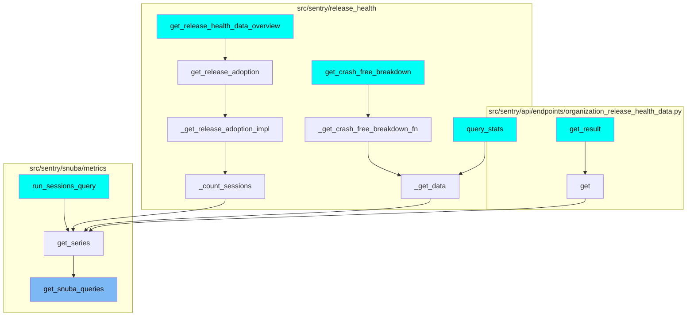
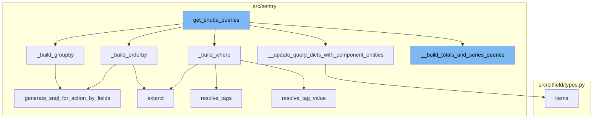

# Overview of get_snuba_queries

The `get_snuba_queries` function is a crucial part of the Sentry application. It is responsible for building Snuba queries, which are used to fetch and manipulate data from the database. The function starts by iterating over the metrics query select fields and creating metric field objects. Depending on the type of the entity, it either updates the query dictionaries with component entities or validates the entity and adds it to the metric object dictionary. After that, it constructs the where, groupby, and orderby clauses. Finally, it constructs the queries dictionary and returns it along with the fields in entities.

# Building the where clause

The `_build_where` function is a part of the `get_snuba_queries` function. It is responsible for building the where clause of the Snuba query. It starts by adding conditions for the organization id and project ids. Then it adds the timeframe conditions. If there are additional where conditions in the metrics query, it processes them and adds them to the where clause.

# Building the orderby clause

The `_build_orderby` function is another part of the `get_snuba_queries` function. It is responsible for building the orderby clause of the Snuba query. It iterates over the orderby fields in the metrics query and generates the necessary SnQL for each field.

# Building the groupby clause

The `_build_groupby` function is also a part of the `get_snuba_queries` function. It is responsible for building the groupby clause of the Snuba query. It iterates over the groupby fields in the metrics query and generates the necessary SnQL for each field.

# Updating query dictionaries with component entities

The `__update_query_dicts_with_component_entities` function is used within the `get_snuba_queries` function to update the query dictionaries with component entities. It iterates over the component entities and updates the metric object dictionary and fields in entities dictionary.

# Building totals and series queries

The `__build_totals_and_series_queries` function is used within the `get_snuba_queries` function to build the totals and series queries. It creates a totals query and if the metrics query includes totals, it adds the totals query to the return value. If the metrics query includes series, it calculates the series limit and adds the series query to the return value.

# Usage of get_snuba_queries

The `get_snuba_queries` function is used in multiple places in the codebase. Some of the entry points include `get_release_health_data_overview`, `get_crash_free_breakdown`, `get_result`, `query_stats`, and `run_sessions_query`.



# Flow drill down



<SwmSnippet path="/src/sentry/snuba/metrics/query_builder.py" line="1116">

---

# get_snuba_queries Function

The `get_snuba_queries` function is the main entry point for building Snuba queries. It starts by iterating over the metrics query select fields and creating metric field objects. It then checks if the entity is a dictionary or a string. If it's a dictionary, it updates the query dictionaries with component entities. If it's a string, it validates the entity and adds it to the metric object dictionary. After that, it builds the where, groupby, and orderby clauses. Finally, it constructs the queries dictionary and returns it along with the fields in entities.

```python
    def get_snuba_queries(self):
        metric_mri_to_obj_dict = {}
        fields_in_entities = {}

        for field in self._metrics_query.select:
            metric_field_obj = metric_object_factory(field.op, field.metric_mri)
            # `get_entity` is called the first, to fetch the entities of constituent metrics,
            # and validate especially in the case of SingularEntityDerivedMetric that it is
            # actually composed of metrics that belong to the same entity
            try:
                #  When we get to an instance of a MetricFieldBase where the entity is an
                #  instance of dict, we know it is from a composite entity derived metric, and
                #  we need to traverse down the constituent metrics dependency tree until we get
                #  to instances of SingleEntityDerivedMetric, and add those to our queries so
                #  that we are able to generate the original CompositeEntityDerivedMetric later
                #  on as a result of a post query operation on the results of the constituent
                #  SingleEntityDerivedMetric instances
                component_entities = metric_field_obj.get_entity(
                    projects=self._projects, use_case_id=self._use_case_id
                )
                if isinstance(component_entities, dict):
```

---

</SwmSnippet>

<SwmSnippet path="/src/sentry/snuba/metrics/query_builder.py" line="890">

---

# \_build_where Function

The `_build_where` function is responsible for building the where clause of the Snuba query. It starts by adding conditions for the organization id and project ids. Then it adds the timeframe conditions. If there are additional where conditions in the metrics query, it processes them and adds them to the where clause.

```python
    def _build_where(self) -> list[BooleanCondition | Condition]:
        where: list[BooleanCondition | Condition] = [
            Condition(Column("org_id"), Op.EQ, self._org_id),
            Condition(Column("project_id"), Op.IN, self._metrics_query.project_ids),
        ]

        where += self._build_timeframe()

        if not self._metrics_query.where:
            return where

        snuba_conditions = []
        # Adds filters that do not need to be resolved because they are instances of `MetricConditionField`
        metric_condition_filters = []
        for condition in self._metrics_query.where:
            if isinstance(condition, MetricConditionField):
                metric_expression = metric_object_factory(
                    condition.lhs.op, condition.lhs.metric_mri
                )
                try:
                    metric_condition_filters.append(
```

---

</SwmSnippet>

<SwmSnippet path="/src/sentry/snuba/metrics/query_builder.py" line="974">

---

# \_build_orderby Function

The `_build_orderby` function is responsible for building the orderby clause of the Snuba query. It iterates over the orderby fields in the metrics query and generates the necessary SnQL for each field.

```python
    def _build_orderby(self) -> list[OrderBy] | None:
        if self._metrics_query.orderby is None:
            return None

        orderby_fields = []
        for metric_order_by_obj in self._metrics_query.orderby:
            orderby_fields.extend(
                self.generate_snql_for_action_by_fields(
                    metric_action_by_field=metric_order_by_obj,
                    use_case_id=self._use_case_id,
                    org_id=self._org_id,
                    projects=self._projects,
                    is_column=True,
                )
            )

        return orderby_fields
```

---

</SwmSnippet>

<SwmSnippet path="/src/sentry/snuba/metrics/query_builder.py" line="957">

---

# \_build_groupby Function

The `_build_groupby` function is responsible for building the groupby clause of the Snuba query. It iterates over the groupby fields in the metrics query and generates the necessary SnQL for each field.

```python
    def _build_groupby(self) -> list[Column] | None:
        if self._metrics_query.groupby is None:
            return None

        groupby_cols = []

        for metric_groupby_obj in self._metrics_query.groupby or []:
            groupby_cols.append(
                self.generate_snql_for_action_by_fields(
                    metric_action_by_field=metric_groupby_obj,
                    use_case_id=self._use_case_id,
                    org_id=self._org_id,
                    projects=self._projects,
                )
            )
        return groupby_cols
```

---

</SwmSnippet>

<SwmSnippet path="/src/sentry/snuba/metrics/query_builder.py" line="1086">

---

# \__update_query_dicts_with_component_entities Function

The `__update_query_dicts_with_component_entities` function is used to update the query dictionaries with component entities. It iterates over the component entities and updates the metric object dictionary and fields in entities dictionary.

```python
    def __update_query_dicts_with_component_entities(
        self,
        component_entities,
        metric_mri_to_obj_dict,
        fields_in_entities,
        parent_alias,
    ):
        # At this point in time, we are only supporting raw metrics in the metrics attribute of
        # any instance of DerivedMetric, and so in this case the op will always be None
        # ToDo(ahmed): In future PR, we might want to allow for dependency metrics to also have an
        #  an aggregate and in this case, we would need to parse the op here
        op = None
        for entity, metric_mris in component_entities.items():
            for metric_mri in metric_mris:
                # The constituents of an instance of CompositeEntityDerivedMetric will have a reference to their parent
                # alias so that we are able to distinguish the constituents in case we have naming collisions that could
                # potentially occur from requesting the same CompositeEntityDerivedMetric multiple times with different
                # params. This means that if parent composite metric alias is for example sessions_errored, and it has
                # a constituent `e:sessions/error.unique@none` then that constituent will be aliased as
                # `e:sessions/error.unique@none__CHILD_OF__sessions_errored`
                metric_key = (
```

---

</SwmSnippet>

<SwmSnippet path="/src/sentry/snuba/metrics/query_builder.py" line="1023">

---

# \__build_totals_and_series_queries Function

The `__build_totals_and_series_queries` function is used to build the totals and series queries. It creates a totals query and if the metrics query includes totals, it adds the totals query to the return value. If the metrics query includes series, it calculates the series limit and adds the series query to the return value.

```python
    def __build_totals_and_series_queries(
        self,
        entity,
        select,
        where,
        having,
        groupby,
        orderby,
        limit,
        offset,
        rollup,
        intervals_len,
    ):
        rv = {}
        totals_query = Query(
            match=Entity(entity),
            groupby=groupby,
            select=select,
            where=where,
            having=having,
            limit=limit,
```

---

</SwmSnippet>

# Where is this flow used?

This flow is used multiple times in the codebase as represented in the following diagram:

(Note - these are only some of the entry points of this flow)


&nbsp;

*This is an auto-generated document by Swimm AI 🌊 and has not yet been verified by a human*

<SwmMeta version="3.0.0" repo-id="Z2l0aHViJTNBJTNBc2VudHJ5LWRlbW8lM0ElM0FTd2ltbS1EZW1v" repo-name="sentry-demo" doc-type="flows"><sup>Powered by [Swimm](/)</sup></SwmMeta>
