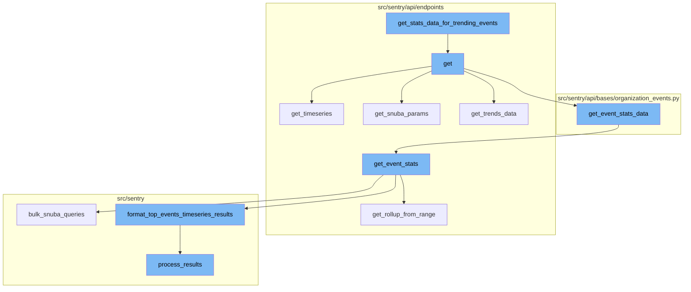
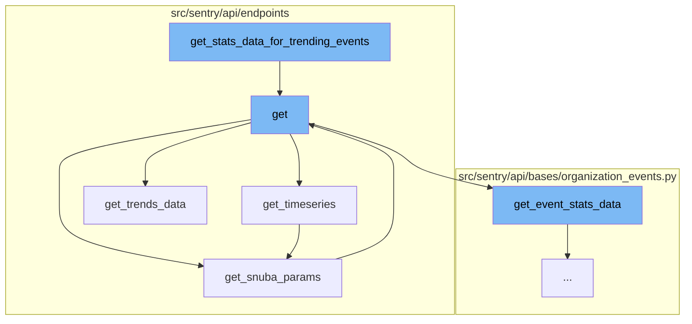
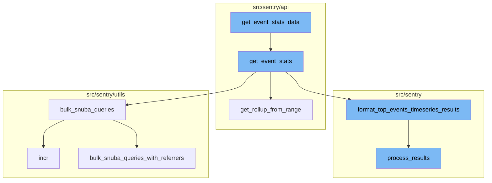

<SwmSnippet path="/src/sentry/api/endpoints/organization_events_trends_v2.py" line="310">

---

# get_stats_data_for_trending_events

The `get_stats_data_for_trending_events` function is used to gather statistical data for trending events. It checks if the 'withTimeseries' parameter is set in the request. If it is, it assigns the `stats_data` to `trending_transaction_names_stats`. If it's not, it iterates over the results data, and for each transaction, it checks if the transaction is present in the `stats_data`. If it is, it selects the stats data for that transaction and updates the `trending_transaction_names_stats` with the selected stats data.

```python
        def get_stats_data_for_trending_events(results):
            trending_transaction_names_stats = {}
            if request.GET.get("withTimeseries", False):
                trending_transaction_names_stats = stats_data
            else:
                for t in results["data"]:
                    transaction_name = t["transaction"]
                    project = t["project"]
                    t_p_key = f"{project},{transaction_name}"
                    if t_p_key in stats_data:
                        selected_stats_data = stats_data[t_p_key]
                        idx = next(
                            i
                            for i, data in enumerate(selected_stats_data["data"])
                            if data[0] >= params["start"].timestamp()
                        )
                        parsed_stats_data = selected_stats_data["data"][idx:]
                        selected_stats_data["data"] = parsed_stats_data
                        trending_transaction_names_stats[t_p_key] = selected_stats_data
                    else:
                        logger.warning(
```

---

</SwmSnippet>

<SwmSnippet path="/src/sentry/api/endpoints/organization_events_trends_v2.py" line="75">

---

# get

The `get` function is the main function that is called when a GET request is made to the endpoint. It calls several other functions to gather the necessary data. It calls `get_top_events` to get the top events based on the user query and parameters. It then calls `get_timeseries` to get the timeseries data for the top events. It also calls `get_snuba_params` to get the parameters for the Snuba query. Finally, it calls `get_trends_data` to get the trends data based on the stats data.

```python
    def get(self, request: Request, organization) -> Response:
        if not self.has_feature(organization, request):
            return Response(status=404)

        try:
            params = self.get_snuba_params(request, organization)
        except NoProjects:
            return Response([])

        trend_type = request.GET.get("trendType", REGRESSION)
        if trend_type not in TREND_TYPES:
            raise ParseError(detail=f"{trend_type} is not a supported trend type")

        trend_function = request.GET.get("trendFunction", "p50()")

        selected_columns = ["project_id", "transaction"]

        query = request.GET.get("query")

        def get_top_events(user_query, params, event_limit, referrer):
            top_event_columns = selected_columns[:]
```

---

</SwmSnippet>

<SwmSnippet path="/src/sentry/api/endpoints/organization_events_trends_v2.py" line="123">

---

# get_timeseries

The `get_timeseries` function is used to get the timeseries data for the top events. It splits the top events into multiple queries for the bulk timeseries query. It then performs a bulk timeseries query using the `metrics_performance.bulk_timeseries_query` function. The results are then parsed and formatted into a `SnubaTSResult` object.

```python
        def get_timeseries(top_events, _, rollup, zerofill_results):
            # Split top events into multiple queries for bulk timeseries query
            data = top_events["data"]

            queries = [
                generate_top_transaction_query(chunk) for chunk in chunked(data, EVENTS_PER_QUERY)
            ]

            timeseries_columns = selected_columns[:]
            timeseries_columns.append(trend_function)

            # When all projects or my projects options selected,
            # keep only projects that top events belong to to reduce query cardinality
            used_project_ids = set({event["project_id"] for event in data})

            # Get new params with pruned projects
            pruned_params = self.get_snuba_params(request, organization)
            pruned_params["project_objects"] = [
                project
                for project in pruned_params["project_objects"]
                if project.id in used_project_ids
```

---

</SwmSnippet>

<SwmSnippet path="/src/sentry/api/endpoints/organization_events_spans_performance.py" line="90">

---

# get_snuba_params

The `get_snuba_params` function is used to get the parameters for the Snuba query. It checks if exactly one project is specified in the parameters. If not, it raises a `ParseError`.

```python
    def get_snuba_params(
        self, request: Request, organization: Organization, check_global_views: bool = True
    ) -> ParamsType:
        params = super().get_snuba_params(request, organization, check_global_views)

        if len(params.get("project_id", [])) != 1:
            raise ParseError(detail="You must specify exactly 1 project.")

        return params
```

---

</SwmSnippet>

<SwmSnippet path="/src/sentry/api/endpoints/organization_events_trends_v2.py" line="264">

---

# get_trends_data

The `get_trends_data` function is used to get the trends data based on the stats data. It formats the start and end of the data and sends the data to a microservice for processing. The results are then sorted into a trending events list based on the trend percentage or the absolute percentage change.

```python
        def get_trends_data(stats_data, request):
            stats_data = dict(
                [format_start_end(data) for data in list(stats_data.items()) if data[1] is not None]
            )

            trend_sort = "" if trend_type == ANY else request.GET.get("sort", "trend_percentage()")
            trend_function = request.GET.get("trendFunction", "p50()")

            # list of requests to send to microservice async
            trends_requests = [
                {
                    "data": dict(chunk),
                    "sort": trend_sort,
                    "trendFunction": trend_function,
                }
                for chunk in chunked(stats_data.items(), EVENTS_PER_QUERY)
            ]

            # send the data to microservice
            results = list(_query_thread_pool.map(detect_breakpoints, trends_requests))
            trend_results = []
```

---

</SwmSnippet>

<SwmSnippet path="/src/sentry/api/bases/organization_events.py" line="421">

---

# get_event_stats_data

The `get_event_stats_data` function is the entry point for fetching event statistics data. It takes in various parameters including the request, organization, a callable `get_event_stats`, and other optional parameters. It starts by setting up the query parameters and columns, then calls the `get_event_stats` function to fetch the event statistics. The results are then serialized and returned.

```python
    def get_event_stats_data(
        self,
        request: Request,
        organization: Organization,
        get_event_stats: Callable[
            [Sequence[str], str, dict[str, str], int, bool, timedelta | None], SnubaTSResult
        ],
        top_events: int = 0,
        query_column: str = "count()",
        params: ParamsType | None = None,
        query: str | None = None,
        allow_partial_buckets: bool = False,
        zerofill_results: bool = True,
        comparison_delta: timedelta | None = None,
        additional_query_column: str | None = None,
        dataset: Any | None = None,
    ) -> dict[str, Any]:
        with handle_query_errors():
            with sentry_sdk.start_span(
                op="discover.endpoint", description="base.stats_query_creation"
            ):
```

---

</SwmSnippet>

<SwmSnippet path="/src/sentry/api/endpoints/organization_profiling_functions.py" line="115">

---

# get_event_stats

The `get_event_stats` function is responsible for fetching event statistics. It starts by determining the rollup from the date range, then prepares and executes a series of Snuba queries using the `bulk_snuba_queries` function. The results are then formatted using the `format_top_events_timeseries_results` function and returned.

```python
        def get_event_stats(_columns, query, params, _rollup, zerofill_results, _comparison_delta):
            rollup = get_rollup_from_range(params["end"] - params["start"])

            chunks = [
                top_functions["data"][i : i + FUNCTIONS_PER_QUERY]
                for i in range(0, len(top_functions["data"]), FUNCTIONS_PER_QUERY)
            ]

            builders = [
                ProfileTopFunctionsTimeseriesQueryBuilder(
                    dataset=Dataset.Functions,
                    params=params,
                    interval=rollup,
                    top_events=chunk,
                    other=False,
                    query=query,
                    selected_columns=["project.id", "fingerprint"],
                    # It's possible to override the columns via
                    # the `yAxis` qs. So we explicitly ignore the
                    # columns, and hard code in the columns we want.
                    timeseries_columns=[data["function"], "examples()"],
```

---

</SwmSnippet>

<SwmSnippet path="/src/sentry/api/endpoints/organization_profiling_functions.py" line="285">

---

# get_rollup_from_range

The `get_rollup_from_range` function is used within `get_event_stats` to determine the rollup interval based on the provided date range. It parses the date range into an interval and validates it before returning the total seconds of the interval.

```python
def get_rollup_from_range(date_range: timedelta, top_functions=TOP_FUNCTIONS_LIMIT) -> int:
    interval = parse_stats_period(get_interval_from_range(date_range))
    if interval is None:
        interval = timedelta(hours=1)
    validate_interval(interval, InvalidSearchQuery(), date_range, top_functions)
    return int(interval.total_seconds())
```

---

</SwmSnippet>

<SwmSnippet path="/src/sentry/utils/snuba.py" line="900">

---

# bulk_snuba_queries

The `bulk_snuba_queries` function is used within `get_event_stats` to execute a series of Snuba queries. It increments a metrics counter and then delegates to the `bulk_snuba_queries_with_referrers` function to perform the actual queries.

```python
def bulk_snuba_queries(
    requests: list[Request],
    referrer: str | None = None,
    use_cache: bool = False,
    query_source: (
        QuerySource | None
    ) = None,  # TODO: @athena Make this field required after updated all the callsites
) -> ResultSet:
    """
    Alias for `bulk_snuba_queries_with_referrers` that uses the same referrer for every request.
    """

    metrics.incr("snql.sdk.api", tags={"referrer": referrer or "unknown"})

    return bulk_snuba_queries_with_referrers(
        [(request, referrer) for request in requests],
        use_cache=use_cache,
        query_source=query_source,
    )
```

---

</SwmSnippet>

<SwmSnippet path="/src/sentry/snuba/functions.py" line="196">

---

# format_top_events_timeseries_results

The `format_top_events_timeseries_results` function is used within `get_event_stats` to format the results of the Snuba queries. It starts by checking if there are any results and if not, it returns a zero-filled series. It then processes the results and formats them into a dictionary of `SnubaTSResult` objects.

```python
def format_top_events_timeseries_results(
    result,
    query_builder,
    params,
    rollup,
    top_events=None,
    allow_empty=True,
    zerofill_results=True,
    result_key_order=None,
):
    if top_events is None:
        assert top_events, "Need to provide top events"  # TODO: support this use case

    if not allow_empty and not len(result.get("data", [])):
        return SnubaTSResult(
            {
                "data": zerofill([], params["start"], params["end"], rollup, "time")
                if zerofill_results
                else [],
            },
            params["start"],
```

---

</SwmSnippet>

<SwmSnippet path="/src/sentry/search/events/builder/base.py" line="1516">

---

# process_results

The `process_results` function is used within `format_top_events_timeseries_results` to process the results of the Snuba queries. It starts by setting up a map of translated columns, then processes the field meta and results. The processed results are then returned.

```python
    def process_results(self, results: Any) -> EventsResponse:
        with sentry_sdk.start_span(op="QueryBuilder", description="process_results") as span:
            span.set_data("result_count", len(results.get("data", [])))
            translated_columns = {}
            if self.builder_config.transform_alias_to_input_format:
                translated_columns = {
                    column: function_details.field
                    for column, function_details in self.function_alias_map.items()
                }

                for column in list(self.function_alias_map):
                    translated_column = translated_columns.get(column, column)
                    if translated_column in self.function_alias_map:
                        continue
                    function_alias = self.function_alias_map.get(column)
                    if function_alias is not None:
                        self.function_alias_map[translated_column] = function_alias

                if self.raw_equations:
                    for index, equation in enumerate(self.raw_equations):
                        translated_columns[f"equation[{index}]"] = f"equation|{equation}"
```

---

</SwmSnippet>

<SwmSnippet path="/src/sentry/utils/snuba.py" line="921">

---

# bulk_snuba_queries_with_referrers

The `bulk_snuba_queries_with_referrers` function is used within `bulk_snuba_queries` to execute a series of Snuba queries with referrers. It sets up the requests with the referrers and then delegates to the `_apply_cache_and_build_results` function to perform the actual queries and build the results.

```python
def bulk_snuba_queries_with_referrers(
    requests_with_referrers: list[tuple[Request, str | None]],
    use_cache: bool = False,
    query_source: (
        QuerySource | None
    ) = None,  # TODO: @athena Make this field required after updated all the callsites
) -> ResultSet:
```

---

</SwmSnippet>

<SwmSnippet path="/src/sentry/utils/metrics.py" line="101">

---

# incr

The `incr` function is used within `bulk_snuba_queries` to increment a metrics counter. It takes in a key, an optional instance, tags, amount, and sample rate, and increments the counter by the specified amount.

```python
    def incr(
        self,
        key: str,
        instance: str | None = None,
        tags: Tags | None = None,
        amount: int = 1,
        sample_rate: float = settings.SENTRY_METRICS_SAMPLE_RATE,
    ) -> None:
        if not self._started:
```

---

</SwmSnippet>



# Flow drill down

First, we'll zoom into this section of the flow:



<SwmSnippet path="/src/sentry/api/endpoints/organization_events_trends_v2.py" line="310">

---

# get_stats_data_for_trending_events

The `get_stats_data_for_trending_events` function is used to gather statistical data for trending events. It checks if the 'withTimeseries' parameter is set in the request. If it is, it assigns the `stats_data` to `trending_transaction_names_stats`. If it's not, it iterates over the results data, and for each transaction, it checks if the transaction is present in the `stats_data`. If it is, it selects the stats data for that transaction and updates the `trending_transaction_names_stats` with the selected stats data.

```python
        def get_stats_data_for_trending_events(results):
            trending_transaction_names_stats = {}
            if request.GET.get("withTimeseries", False):
                trending_transaction_names_stats = stats_data
            else:
                for t in results["data"]:
                    transaction_name = t["transaction"]
                    project = t["project"]
                    t_p_key = f"{project},{transaction_name}"
                    if t_p_key in stats_data:
                        selected_stats_data = stats_data[t_p_key]
                        idx = next(
                            i
                            for i, data in enumerate(selected_stats_data["data"])
                            if data[0] >= params["start"].timestamp()
                        )
                        parsed_stats_data = selected_stats_data["data"][idx:]
                        selected_stats_data["data"] = parsed_stats_data
                        trending_transaction_names_stats[t_p_key] = selected_stats_data
                    else:
                        logger.warning(
```

---

</SwmSnippet>

<SwmSnippet path="/src/sentry/api/endpoints/organization_events_trends_v2.py" line="75">

---

# get

The `get` function is the main function that is called when a GET request is made to the endpoint. It calls several other functions to gather the necessary data. It calls `get_top_events` to get the top events based on the user query and parameters. It then calls `get_timeseries` to get the timeseries data for the top events. It also calls `get_snuba_params` to get the parameters for the Snuba query. Finally, it calls `get_trends_data` to get the trends data based on the stats data.

```python
    def get(self, request: Request, organization) -> Response:
        if not self.has_feature(organization, request):
            return Response(status=404)

        try:
            params = self.get_snuba_params(request, organization)
        except NoProjects:
            return Response([])

        trend_type = request.GET.get("trendType", REGRESSION)
        if trend_type not in TREND_TYPES:
            raise ParseError(detail=f"{trend_type} is not a supported trend type")

        trend_function = request.GET.get("trendFunction", "p50()")

        selected_columns = ["project_id", "transaction"]

        query = request.GET.get("query")

        def get_top_events(user_query, params, event_limit, referrer):
            top_event_columns = selected_columns[:]
```

---

</SwmSnippet>

<SwmSnippet path="/src/sentry/api/endpoints/organization_events_trends_v2.py" line="123">

---

# get_timeseries

The `get_timeseries` function is used to get the timeseries data for the top events. It splits the top events into multiple queries for the bulk timeseries query. It then performs a bulk timeseries query using the `metrics_performance.bulk_timeseries_query` function. The results are then parsed and formatted into a `SnubaTSResult` object.

```python
        def get_timeseries(top_events, _, rollup, zerofill_results):
            # Split top events into multiple queries for bulk timeseries query
            data = top_events["data"]

            queries = [
                generate_top_transaction_query(chunk) for chunk in chunked(data, EVENTS_PER_QUERY)
            ]

            timeseries_columns = selected_columns[:]
            timeseries_columns.append(trend_function)

            # When all projects or my projects options selected,
            # keep only projects that top events belong to to reduce query cardinality
            used_project_ids = set({event["project_id"] for event in data})

            # Get new params with pruned projects
            pruned_params = self.get_snuba_params(request, organization)
            pruned_params["project_objects"] = [
                project
                for project in pruned_params["project_objects"]
                if project.id in used_project_ids
```

---

</SwmSnippet>

<SwmSnippet path="/src/sentry/api/endpoints/organization_events_spans_performance.py" line="90">

---

# get_snuba_params

The `get_snuba_params` function is used to get the parameters for the Snuba query. It checks if exactly one project is specified in the parameters. If not, it raises a `ParseError`.

```python
    def get_snuba_params(
        self, request: Request, organization: Organization, check_global_views: bool = True
    ) -> ParamsType:
        params = super().get_snuba_params(request, organization, check_global_views)

        if len(params.get("project_id", [])) != 1:
            raise ParseError(detail="You must specify exactly 1 project.")

        return params
```

---

</SwmSnippet>

<SwmSnippet path="/src/sentry/api/endpoints/organization_events_trends_v2.py" line="264">

---

# get_trends_data

The `get_trends_data` function is used to get the trends data based on the stats data. It formats the start and end of the data and sends the data to a microservice for processing. The results are then sorted into a trending events list based on the trend percentage or the absolute percentage change.

```python
        def get_trends_data(stats_data, request):
            stats_data = dict(
                [format_start_end(data) for data in list(stats_data.items()) if data[1] is not None]
            )

            trend_sort = "" if trend_type == ANY else request.GET.get("sort", "trend_percentage()")
            trend_function = request.GET.get("trendFunction", "p50()")

            # list of requests to send to microservice async
            trends_requests = [
                {
                    "data": dict(chunk),
                    "sort": trend_sort,
                    "trendFunction": trend_function,
                }
                for chunk in chunked(stats_data.items(), EVENTS_PER_QUERY)
            ]

            # send the data to microservice
            results = list(_query_thread_pool.map(detect_breakpoints, trends_requests))
            trend_results = []
```

---

</SwmSnippet>

Now, lets zoom into this section of the flow:



<SwmSnippet path="/src/sentry/api/bases/organization_events.py" line="421">

---

# get_event_stats_data Function

The `get_event_stats_data` function is the entry point for fetching event statistics data. It takes in various parameters including the request, organization, a callable `get_event_stats`, and other optional parameters. It starts by setting up the query parameters and columns, then calls the `get_event_stats` function to fetch the event statistics. The results are then serialized and returned.

```python
    def get_event_stats_data(
        self,
        request: Request,
        organization: Organization,
        get_event_stats: Callable[
            [Sequence[str], str, dict[str, str], int, bool, timedelta | None], SnubaTSResult
        ],
        top_events: int = 0,
        query_column: str = "count()",
        params: ParamsType | None = None,
        query: str | None = None,
        allow_partial_buckets: bool = False,
        zerofill_results: bool = True,
        comparison_delta: timedelta | None = None,
        additional_query_column: str | None = None,
        dataset: Any | None = None,
    ) -> dict[str, Any]:
        with handle_query_errors():
            with sentry_sdk.start_span(
                op="discover.endpoint", description="base.stats_query_creation"
            ):
```

---

</SwmSnippet>

<SwmSnippet path="/src/sentry/api/endpoints/organization_profiling_functions.py" line="115">

---

# get_event_stats Function

The `get_event_stats` function is responsible for fetching event statistics. It starts by determining the rollup from the date range, then prepares and executes a series of Snuba queries using the `bulk_snuba_queries` function. The results are then formatted using the `format_top_events_timeseries_results` function and returned.

```python
        def get_event_stats(_columns, query, params, _rollup, zerofill_results, _comparison_delta):
            rollup = get_rollup_from_range(params["end"] - params["start"])

            chunks = [
                top_functions["data"][i : i + FUNCTIONS_PER_QUERY]
                for i in range(0, len(top_functions["data"]), FUNCTIONS_PER_QUERY)
            ]

            builders = [
                ProfileTopFunctionsTimeseriesQueryBuilder(
                    dataset=Dataset.Functions,
                    params=params,
                    interval=rollup,
                    top_events=chunk,
                    other=False,
                    query=query,
                    selected_columns=["project.id", "fingerprint"],
                    # It's possible to override the columns via
                    # the `yAxis` qs. So we explicitly ignore the
                    # columns, and hard code in the columns we want.
                    timeseries_columns=[data["function"], "examples()"],
```

---

</SwmSnippet>

<SwmSnippet path="/src/sentry/api/endpoints/organization_profiling_functions.py" line="285">

---

# get_rollup_from_range Function

The `get_rollup_from_range` function is used within `get_event_stats` to determine the rollup interval based on the provided date range. It parses the date range into an interval and validates it before returning the total seconds of the interval.

```python
def get_rollup_from_range(date_range: timedelta, top_functions=TOP_FUNCTIONS_LIMIT) -> int:
    interval = parse_stats_period(get_interval_from_range(date_range))
    if interval is None:
        interval = timedelta(hours=1)
    validate_interval(interval, InvalidSearchQuery(), date_range, top_functions)
    return int(interval.total_seconds())
```

---

</SwmSnippet>

<SwmSnippet path="/src/sentry/utils/snuba.py" line="900">

---

# bulk_snuba_queries Function

The `bulk_snuba_queries` function is used within `get_event_stats` to execute a series of Snuba queries. It increments a metrics counter and then delegates to the `bulk_snuba_queries_with_referrers` function to perform the actual queries.

```python
def bulk_snuba_queries(
    requests: list[Request],
    referrer: str | None = None,
    use_cache: bool = False,
    query_source: (
        QuerySource | None
    ) = None,  # TODO: @athena Make this field required after updated all the callsites
) -> ResultSet:
    """
    Alias for `bulk_snuba_queries_with_referrers` that uses the same referrer for every request.
    """

    metrics.incr("snql.sdk.api", tags={"referrer": referrer or "unknown"})

    return bulk_snuba_queries_with_referrers(
        [(request, referrer) for request in requests],
        use_cache=use_cache,
        query_source=query_source,
    )
```

---

</SwmSnippet>

<SwmSnippet path="/src/sentry/snuba/functions.py" line="196">

---

# format_top_events_timeseries_results Function

The `format_top_events_timeseries_results` function is used within `get_event_stats` to format the results of the Snuba queries. It starts by checking if there are any results and if not, it returns a zero-filled series. It then processes the results and formats them into a dictionary of `SnubaTSResult` objects.

```python
def format_top_events_timeseries_results(
    result,
    query_builder,
    params,
    rollup,
    top_events=None,
    allow_empty=True,
    zerofill_results=True,
    result_key_order=None,
):
    if top_events is None:
        assert top_events, "Need to provide top events"  # TODO: support this use case

    if not allow_empty and not len(result.get("data", [])):
        return SnubaTSResult(
            {
                "data": zerofill([], params["start"], params["end"], rollup, "time")
                if zerofill_results
                else [],
            },
            params["start"],
```

---

</SwmSnippet>

<SwmSnippet path="/src/sentry/search/events/builder/base.py" line="1516">

---

# process_results Function

The `process_results` function is used within `format_top_events_timeseries_results` to process the results of the Snuba queries. It starts by setting up a map of translated columns, then processes the field meta and results. The processed results are then returned.

```python
    def process_results(self, results: Any) -> EventsResponse:
        with sentry_sdk.start_span(op="QueryBuilder", description="process_results") as span:
            span.set_data("result_count", len(results.get("data", [])))
            translated_columns = {}
            if self.builder_config.transform_alias_to_input_format:
                translated_columns = {
                    column: function_details.field
                    for column, function_details in self.function_alias_map.items()
                }

                for column in list(self.function_alias_map):
                    translated_column = translated_columns.get(column, column)
                    if translated_column in self.function_alias_map:
                        continue
                    function_alias = self.function_alias_map.get(column)
                    if function_alias is not None:
                        self.function_alias_map[translated_column] = function_alias

                if self.raw_equations:
                    for index, equation in enumerate(self.raw_equations):
                        translated_columns[f"equation[{index}]"] = f"equation|{equation}"
```

---

</SwmSnippet>

<SwmSnippet path="/src/sentry/utils/snuba.py" line="921">

---

# bulk_snuba_queries_with_referrers Function

The `bulk_snuba_queries_with_referrers` function is used within `bulk_snuba_queries` to execute a series of Snuba queries with referrers. It sets up the requests with the referrers and then delegates to the `_apply_cache_and_build_results` function to perform the actual queries and build the results.

```python
def bulk_snuba_queries_with_referrers(
    requests_with_referrers: list[tuple[Request, str | None]],
    use_cache: bool = False,
    query_source: (
        QuerySource | None
    ) = None,  # TODO: @athena Make this field required after updated all the callsites
) -> ResultSet:
```

---

</SwmSnippet>

<SwmSnippet path="/src/sentry/utils/metrics.py" line="101">

---

# incr Function

The `incr` function is used within `bulk_snuba_queries` to increment a metrics counter. It takes in a key, an optional instance, tags, amount, and sample rate, and increments the counter by the specified amount.

```python
    def incr(
        self,
        key: str,
        instance: str | None = None,
        tags: Tags | None = None,
        amount: int = 1,
        sample_rate: float = settings.SENTRY_METRICS_SAMPLE_RATE,
    ) -> None:
        if not self._started:
```

---

</SwmSnippet>

&nbsp;

*This is an auto-generated document by Swimm AI 🌊 and has not yet been verified by a human*

<SwmMeta version="3.0.0" repo-id="Z2l0aHViJTNBJTNBc2VudHJ5LWRlbW8lM0ElM0FTd2ltbS1EZW1v" repo-name="sentry-demo" doc-type="flows"><sup>Powered by [Swimm](/)</sup></SwmMeta>
