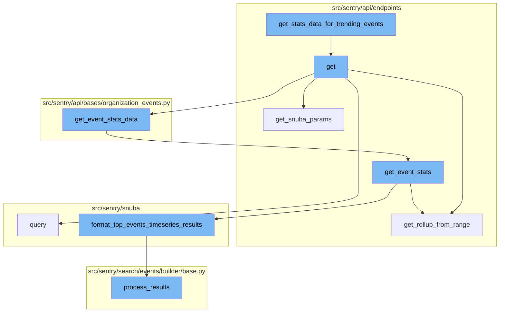
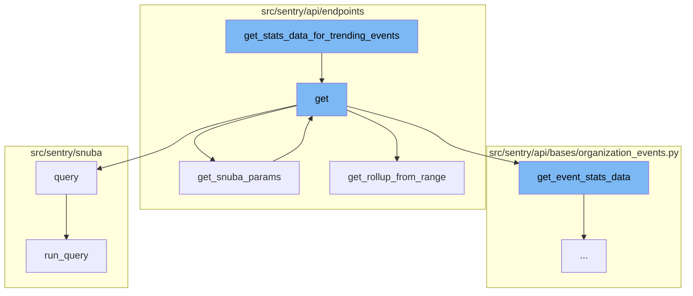
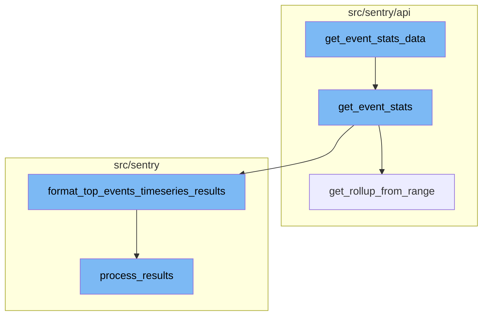

# Overview of get_stats_data_for_trending_events

The `get_stats_data_for_trending_events` function is a key component in the data processing flow of the application. It is responsible for formatting the statistical data for trending events. The function takes the results of the trending events, formats them, and returns the formatted results. This function is the starting point of the flow.

# The get Function

The `get` function is the next step in the flow. It is responsible for handling the request and organization parameters, and it calls several other functions such as `get_event_stats`, `get_trends_data`, and `paginate_trending_events` to process the data.

# The query Function

The `query` function is used to build and run a query with the given parameters. It uses the `SpansMetricsQueryBuilder` to build the query and then processes the results.

# The get_snuba_params Function

The `get_snuba_params` function retrieves the parameters needed for the Snuba query. It checks if the project_id is specified and raises an error if not.

# The get_rollup_from_range Function

The `get_rollup_from_range` function calculates the rollup value based on the given date range. This value is used in the `get_event_stats` function to determine the granularity of the data.

# The get_event_stats_data Function

The `get_event_stats_data` function is the entry point for fetching event statistics data. It takes in various parameters including the request, organization, and a callable `get_event_stats` function. It handles query errors, retrieves parameters from the request, and calls the `get_event_stats` function to fetch the event statistics. The results are then serialized and returned.

# The get_event_stats Function

The `get_event_stats` function is called within `get_event_stats_data`. It calculates the rollup from the date range, divides the data into chunks, and builds queries for each chunk. The queries are then executed in bulk and the results are formatted using the `format_top_events_timeseries_results` function.

# The format_top_events_timeseries_results Function

The `format_top_events_timeseries_results` function is used within `get_event_stats` to format the results of the bulk queries. It checks if the results are empty and if so, returns a zero-filled series. Otherwise, it transforms the results, adds the order to the results using the top events, and returns the results as a `SnubaTSResult`.

# The process_results Function

The `process_results` function is used within `format_top_events_timeseries_results` to process the results. It translates the columns, processes the field meta, and transforms the field results. The processed results are then returned.



# Flow drill down

First, we'll zoom into this section of the flow:



<SwmSnippet path="/src/sentry/api/endpoints/organization_profiling_functions.py" line="231">

---

# get_stats_data_for_trending_events Function

The `get_stats_data_for_trending_events` function is used to format the statistical data for trending events. It takes the results of the trending events, formats them, and returns the formatted results. This function is the starting point of the flow.

```python
        def get_stats_data_for_trending_events(results):
            functions = {
                f"{function['project.id']},{function['fingerprint']}": function
                for function in top_functions.get("data", [])
            }
            formatted_results = []
            for result in results["data"]:
                # The endpoint originally was meant for only transactions
                # hence the name of the key, but it can be adapted to work
                # for functions as well.
                key = f"{result['project']},{result['transaction']}"
                formatted_result = {
                    "stats": stats_data[key][data["function"]],
                    "worst": [
                        (ts, data[0]["count"][0])
                        for ts, data in stats_data[key]["examples()"]["data"]
                        if data[0]["count"]  # filter out entries without an example
                    ],
                }
                formatted_result.update(
                    {
```

---

</SwmSnippet>

<SwmSnippet path="/src/sentry/api/endpoints/organization_profiling_functions.py" line="81">

---

## get Function

The `get` function is the next step in the flow. It is responsible for handling the request and organization parameters, and it calls several other functions such as `get_event_stats`, `get_trends_data`, and `paginate_trending_events` to process the data.

```python
    def get(self, request: Request, organization: Organization) -> Response:
        if not self.has_feature(organization, request):
            return Response(status=404)

        try:
            params = self.get_snuba_params(request, organization)
        except NoProjects:
            return Response({})

        serializer = FunctionTrendsSerializer(data=request.GET)
        if not serializer.is_valid():
            return Response(serializer.errors, status=400)
        data = serializer.validated_data

        with handle_query_errors():
            top_functions = functions.query(
                selected_columns=[
                    "project.id",
                    "fingerprint",
                    "package",
                    "function",
```

---

</SwmSnippet>

<SwmSnippet path="/src/sentry/snuba/spans_metrics.py" line="21">

---

## query Function

The `query` function is used to build and run a query with the given parameters. It uses the `SpansMetricsQueryBuilder` to build the query and then processes the results.

```python
def query(
    selected_columns,
    query,
    params,
    snuba_params=None,
    equations=None,
    orderby=None,
    offset=None,
    limit=50,
    referrer=None,
    auto_fields=False,
    auto_aggregations=False,
    include_equation_fields=False,
    allow_metric_aggregates=False,
    use_aggregate_conditions=False,
    conditions=None,
    functions_acl=None,
    transform_alias_to_input_format=False,
    sample=None,
    has_metrics=False,
    use_metrics_layer=False,
```

---

</SwmSnippet>

<SwmSnippet path="/src/sentry/api/endpoints/organization_events_spans_performance.py" line="90">

---

## get_snuba_params Function

The `get_snuba_params` function retrieves the parameters needed for the Snuba query. It checks if the project_id is specified and raises an error if not.

```python
    def get_snuba_params(
        self, request: Request, organization: Organization, check_global_views: bool = True
    ) -> ParamsType:
        params = super().get_snuba_params(request, organization, check_global_views)

        if len(params.get("project_id", [])) != 1:
            raise ParseError(detail="You must specify exactly 1 project.")

        return params
```

---

</SwmSnippet>

<SwmSnippet path="/src/sentry/api/endpoints/organization_profiling_functions.py" line="285">

---

## get_rollup_from_range Function

The `get_rollup_from_range` function calculates the rollup value based on the given date range. This value is used in the `get_event_stats` function to determine the granularity of the data.

```python
def get_rollup_from_range(date_range: timedelta, top_functions=TOP_FUNCTIONS_LIMIT) -> int:
    interval = parse_stats_period(get_interval_from_range(date_range))
    if interval is None:
        interval = timedelta(hours=1)
    validate_interval(interval, InvalidSearchQuery(), date_range, top_functions)
    return int(interval.total_seconds())
```

---

</SwmSnippet>

Now, lets zoom into this section of the flow:



<SwmSnippet path="/src/sentry/api/bases/organization_events.py" line="421">

---

# get_event_stats_data

The `get_event_stats_data` function is the entry point for fetching event statistics data. It takes in various parameters including the request, organization, and a callable `get_event_stats` function. It handles query errors, retrieves parameters from the request, and calls the `get_event_stats` function to fetch the event statistics. The results are then serialized and returned.

```python
    def get_event_stats_data(
        self,
        request: Request,
        organization: Organization,
        get_event_stats: Callable[
            [Sequence[str], str, dict[str, str], int, bool, timedelta | None], SnubaTSResult
        ],
        top_events: int = 0,
        query_column: str = "count()",
        params: ParamsType | None = None,
        query: str | None = None,
        allow_partial_buckets: bool = False,
        zerofill_results: bool = True,
        comparison_delta: timedelta | None = None,
        additional_query_column: str | None = None,
        dataset: Any | None = None,
    ) -> dict[str, Any]:
        with handle_query_errors():
            with sentry_sdk.start_span(
                op="discover.endpoint", description="base.stats_query_creation"
            ):
```

---

</SwmSnippet>

<SwmSnippet path="/src/sentry/api/endpoints/organization_profiling_functions.py" line="115">

---

# get_event_stats

The `get_event_stats` function is called within `get_event_stats_data`. It calculates the rollup from the date range, divides the data into chunks, and builds queries for each chunk. The queries are then executed in bulk and the results are formatted using the `format_top_events_timeseries_results` function.

```python
        def get_event_stats(_columns, query, params, _rollup, zerofill_results, _comparison_delta):
            rollup = get_rollup_from_range(params["end"] - params["start"])

            chunks = [
                top_functions["data"][i : i + FUNCTIONS_PER_QUERY]
                for i in range(0, len(top_functions["data"]), FUNCTIONS_PER_QUERY)
            ]

            builders = [
                ProfileTopFunctionsTimeseriesQueryBuilder(
                    dataset=Dataset.Functions,
                    params=params,
                    interval=rollup,
                    top_events=chunk,
                    other=False,
                    query=query,
                    selected_columns=["project.id", "fingerprint"],
                    # It's possible to override the columns via
                    # the `yAxis` qs. So we explicitly ignore the
                    # columns, and hard code in the columns we want.
                    timeseries_columns=[data["function"], "examples()"],
```

---

</SwmSnippet>

<SwmSnippet path="/src/sentry/api/endpoints/organization_profiling_functions.py" line="285">

---

# get_rollup_from_range

The `get_rollup_from_range` function is used within `get_event_stats` to calculate the rollup from the date range. It parses the interval from the date range and validates it. The rollup is then returned as the total seconds of the interval.

```python
def get_rollup_from_range(date_range: timedelta, top_functions=TOP_FUNCTIONS_LIMIT) -> int:
    interval = parse_stats_period(get_interval_from_range(date_range))
    if interval is None:
        interval = timedelta(hours=1)
    validate_interval(interval, InvalidSearchQuery(), date_range, top_functions)
    return int(interval.total_seconds())
```

---

</SwmSnippet>

<SwmSnippet path="/src/sentry/snuba/functions.py" line="196">

---

# format_top_events_timeseries_results

The `format_top_events_timeseries_results` function is used within `get_event_stats` to format the results of the bulk queries. It checks if the results are empty and if so, returns a zero-filled series. Otherwise, it transforms the results, adds the order to the results using the top events, and returns the results as a `SnubaTSResult`.

```python
def format_top_events_timeseries_results(
    result,
    query_builder,
    params,
    rollup,
    top_events=None,
    allow_empty=True,
    zerofill_results=True,
    result_key_order=None,
):
    if top_events is None:
        assert top_events, "Need to provide top events"  # TODO: support this use case

    if not allow_empty and not len(result.get("data", [])):
        return SnubaTSResult(
            {
                "data": zerofill([], params["start"], params["end"], rollup, "time")
                if zerofill_results
                else [],
            },
            params["start"],
```

---

</SwmSnippet>

<SwmSnippet path="/src/sentry/search/events/builder/base.py" line="1516">

---

# process_results

The `process_results` function is used within `format_top_events_timeseries_results` to process the results. It translates the columns, processes the field meta, and transforms the field results. The processed results are then returned.

```python
    def process_results(self, results: Any) -> EventsResponse:
        with sentry_sdk.start_span(op="QueryBuilder", description="process_results") as span:
            span.set_data("result_count", len(results.get("data", [])))
            translated_columns = {}
            if self.builder_config.transform_alias_to_input_format:
                translated_columns = {
                    column: function_details.field
                    for column, function_details in self.function_alias_map.items()
                }

                for column in list(self.function_alias_map):
                    translated_column = translated_columns.get(column, column)
                    if translated_column in self.function_alias_map:
                        continue
                    function_alias = self.function_alias_map.get(column)
                    if function_alias is not None:
                        self.function_alias_map[translated_column] = function_alias

                if self.raw_equations:
                    for index, equation in enumerate(self.raw_equations):
                        translated_columns[f"equation[{index}]"] = f"equation|{equation}"
```

---

</SwmSnippet>

&nbsp;

*This is an auto-generated document by Swimm AI 🌊 and has not yet been verified by a human*

<SwmMeta version="3.0.0" repo-id="Z2l0aHViJTNBJTNBc2VudHJ5LWRlbW8lM0ElM0FTd2ltbS1EZW1v" repo-name="sentry-demo" doc-type="flows"><sup>Powered by [Swimm](/)</sup></SwmMeta>
