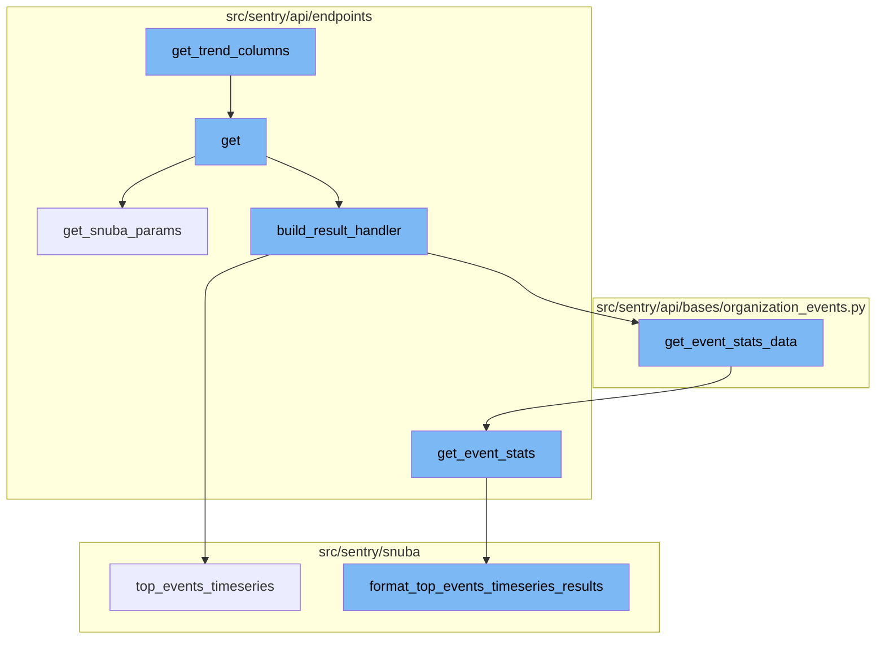
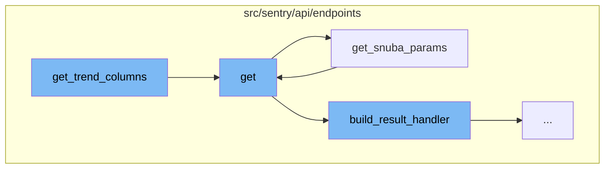
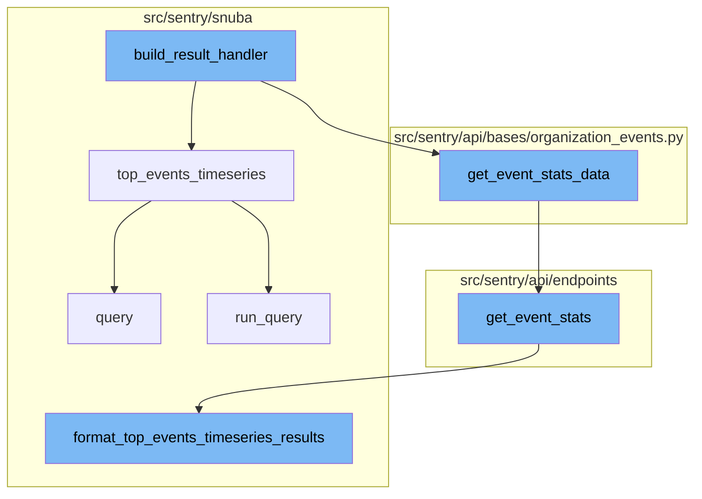

<SwmSnippet path="/src/sentry/api/endpoints/organization_events_trends.py" line="352">

---

# get_trend_columns Function

The `get_trend_columns` function is used to construct the columns needed to calculate high confidence trends. It takes in a baseline function, a column, and a middle value. The function first checks if the baseline function is supported, then it constructs the necessary columns for the t-test and other calculations. The function returns a list of these constructed columns.

```python
    def get_trend_columns(self, baseline_function, column, middle):
        """Construct the columns needed to calculate high confidence trends"""
        trend_column = self.trend_columns.get(baseline_function)
        if trend_column is None:
            raise ParseError(detail=f"{baseline_function} is not a supported trend function")

        count_column = self.trend_columns["count_range"]
        percentage_column = self.trend_columns["percentage"]
        variance_column = self.trend_columns["variance"]

        # t_test, and the columns required to calculate it
        t_test_columns = [
            variance_column.format(
                condition="greater", boundary=middle, query_alias="variance_range_1"
            ),
            variance_column.format(
                condition="lessOrEquals", boundary=middle, query_alias="variance_range_2"
            ),
        ]
        # Only add average when its not the baseline
        if baseline_function != "avg":
```

---

</SwmSnippet>

<SwmSnippet path="/src/sentry/api/endpoints/organization_events_trends.py" line="425">

---

# get Function

The `get` function is the main entry point for the trend calculation process. It first checks if the organization has the necessary feature. Then, it retrieves the necessary parameters from the request and the organization. It also handles the parsing and validation of the request parameters. The function then constructs a `TrendQueryBuilder` object and uses it to perform the trend query. The results are then processed and returned.

```python
    def get(self, request: Request, organization) -> Response:
        if not self.has_feature(organization, request):
            return Response(status=404)

        try:
            params = self.get_snuba_params(request, organization)
        except NoProjects:
            return Response([])

        with sentry_sdk.start_span(op="discover.endpoint", description="trend_dates"):
            middle_date = request.GET.get("middle")
            if middle_date:
                try:
                    middle = parse_datetime_string(middle_date)
                except InvalidQuery:
                    raise ParseError(detail=f"{middle_date} is not a valid date format")
                if middle <= params["start"] or middle >= params["end"]:
                    raise ParseError(
                        detail="The middle date should be within the duration of the query"
                    )
            else:
```

---

</SwmSnippet>

<SwmSnippet path="/src/sentry/api/endpoints/organization_events_spans_performance.py" line="90">

---

# get_snuba_params Function

The `get_snuba_params` function is used to retrieve the necessary parameters for the Snuba query. It checks if exactly one project is specified in the parameters. If not, it raises a `ParseError`.

```python
    def get_snuba_params(
        self, request: Request, organization: Organization, check_global_views: bool = True
    ) -> ParamsType:
        params = super().get_snuba_params(request, organization, check_global_views)

        if len(params.get("project_id", [])) != 1:
            raise ParseError(detail="You must specify exactly 1 project.")

        return params
```

---

</SwmSnippet>

<SwmSnippet path="/src/sentry/api/endpoints/organization_events_trends.py" line="528">

---

# build_result_handler Function

The `build_result_handler` function is the starting point of the flow. It defines a nested function `on_results` that takes `events_results` as an argument. Inside `on_results`, another nested function `get_event_stats` is defined, which calls `top_events_timeseries` from the `discover` module. The `get_event_stats` function is then passed as an argument to `get_event_stats_data`.

```python
    def build_result_handler(
        self,
        request,
        organization,
        params,
        trend_function,
        selected_columns,
        orderby,
        query,
    ):
        def on_results(events_results):
            def get_event_stats(query_columns, query, params, rollup, zerofill_results, _=None):
                return discover.top_events_timeseries(
                    query_columns,
                    selected_columns,
                    query,
                    params,
                    orderby,
                    rollup,
                    min(5, len(events_results["data"])),
                    organization,
```

---

</SwmSnippet>

<SwmSnippet path="/src/sentry/snuba/spans_metrics.py" line="138">

---

# top_events_timeseries Function

`top_events_timeseries` is a high-level API for doing arbitrary user timeseries queries for a limited number of top events. It returns a dictionary of SnubaTSResult objects that have been zerofilled in case of gaps. Each value of the dictionary should match the result of a timeseries query.

```python
def top_events_timeseries(
    timeseries_columns,
    selected_columns,
    user_query,
    params,
    orderby,
    rollup,
    limit,
    organization,
    equations=None,
    referrer=None,
    top_events=None,
    allow_empty=True,
    zerofill_results=True,
    include_other=False,
    functions_acl=None,
    on_demand_metrics_enabled=False,
    on_demand_metrics_type: MetricSpecType | None = None,
):
    """
    High-level API for doing arbitrary user timeseries queries for a limited number of top events
```

---

</SwmSnippet>

<SwmSnippet path="/src/sentry/api/bases/organization_events.py" line="421">

---

# get_event_stats_data Function

`get_event_stats_data` is a function that handles the retrieval of event stats data. It takes a callable `get_event_stats` as an argument, which is the function defined in `build_result_handler`. It uses this function to retrieve event stats and then serializes the result.

```python
    def get_event_stats_data(
        self,
        request: Request,
        organization: Organization,
        get_event_stats: Callable[
            [Sequence[str], str, dict[str, str], int, bool, timedelta | None], SnubaTSResult
        ],
        top_events: int = 0,
        query_column: str = "count()",
        params: ParamsType | None = None,
        query: str | None = None,
        allow_partial_buckets: bool = False,
        zerofill_results: bool = True,
        comparison_delta: timedelta | None = None,
        additional_query_column: str | None = None,
        dataset: Any | None = None,
    ) -> dict[str, Any]:
        with handle_query_errors():
            with sentry_sdk.start_span(
                op="discover.endpoint", description="base.stats_query_creation"
            ):
```

---

</SwmSnippet>

<SwmSnippet path="/src/sentry/api/endpoints/organization_profiling_functions.py" line="115">

---

# get_event_stats Function

`get_event_stats` is a function that gets event stats by dividing the top functions data into chunks and running queries on each chunk. The results are then formatted using `format_top_events_timeseries_results`.

```python
        def get_event_stats(_columns, query, params, _rollup, zerofill_results, _comparison_delta):
            rollup = get_rollup_from_range(params["end"] - params["start"])

            chunks = [
                top_functions["data"][i : i + FUNCTIONS_PER_QUERY]
                for i in range(0, len(top_functions["data"]), FUNCTIONS_PER_QUERY)
            ]

            builders = [
                ProfileTopFunctionsTimeseriesQueryBuilder(
                    dataset=Dataset.Functions,
                    params=params,
                    interval=rollup,
                    top_events=chunk,
                    other=False,
                    query=query,
                    selected_columns=["project.id", "fingerprint"],
                    # It's possible to override the columns via
                    # the `yAxis` qs. So we explicitly ignore the
                    # columns, and hard code in the columns we want.
                    timeseries_columns=[data["function"], "examples()"],
```

---

</SwmSnippet>

<SwmSnippet path="/src/sentry/snuba/spans_metrics.py" line="21">

---

# query Function

`query` is a function that builds and runs a query based on the provided parameters. It is used within `top_events_timeseries` when `top_events` is None.

```python
def query(
    selected_columns,
    query,
    params,
    snuba_params=None,
    equations=None,
    orderby=None,
    offset=None,
    limit=50,
    referrer=None,
    auto_fields=False,
    auto_aggregations=False,
    include_equation_fields=False,
    allow_metric_aggregates=False,
    use_aggregate_conditions=False,
    conditions=None,
    functions_acl=None,
    transform_alias_to_input_format=False,
    sample=None,
    has_metrics=False,
    use_metrics_layer=False,
```

---

</SwmSnippet>

<SwmSnippet path="/src/sentry/snuba/metrics_layer/query.py" line="143">

---

# run_query Function

`run_query` is a function that executes a metrics query in Snuba. It is used within the `query` function.

```python
def run_query(request: Request) -> Mapping[str, Any]:
    """
    Entrypoint for executing a metrics query in Snuba.
    """
```

---

</SwmSnippet>

<SwmSnippet path="/src/sentry/snuba/functions.py" line="196">

---

# format_top_events_timeseries_results Function

`format_top_events_timeseries_results` is a function that formats the results of top events timeseries. It is used within `get_event_stats` to format the results of the queries run on each chunk of top functions data.

```python
def format_top_events_timeseries_results(
    result,
    query_builder,
    params,
    rollup,
    top_events=None,
    allow_empty=True,
    zerofill_results=True,
    result_key_order=None,
):
    if top_events is None:
        assert top_events, "Need to provide top events"  # TODO: support this use case

    if not allow_empty and not len(result.get("data", [])):
        return SnubaTSResult(
            {
                "data": zerofill([], params["start"], params["end"], rollup, "time")
                if zerofill_results
                else [],
            },
            params["start"],
```

---

</SwmSnippet>



# Flow drill down

First, we'll zoom into this section of the flow:



<SwmSnippet path="/src/sentry/api/endpoints/organization_events_trends.py" line="352">

---

# get_trend_columns Function

The `get_trend_columns` function is used to construct the columns needed to calculate high confidence trends. It takes in a baseline function, a column, and a middle value. The function first checks if the baseline function is supported, then it constructs the necessary columns for the t-test and other calculations. The function returns a list of these constructed columns.

```python
    def get_trend_columns(self, baseline_function, column, middle):
        """Construct the columns needed to calculate high confidence trends"""
        trend_column = self.trend_columns.get(baseline_function)
        if trend_column is None:
            raise ParseError(detail=f"{baseline_function} is not a supported trend function")

        count_column = self.trend_columns["count_range"]
        percentage_column = self.trend_columns["percentage"]
        variance_column = self.trend_columns["variance"]

        # t_test, and the columns required to calculate it
        t_test_columns = [
            variance_column.format(
                condition="greater", boundary=middle, query_alias="variance_range_1"
            ),
            variance_column.format(
                condition="lessOrEquals", boundary=middle, query_alias="variance_range_2"
            ),
        ]
        # Only add average when its not the baseline
        if baseline_function != "avg":
```

---

</SwmSnippet>

<SwmSnippet path="/src/sentry/api/endpoints/organization_events_trends.py" line="425">

---

# get Function

The `get` function is the main entry point for the trend calculation process. It first checks if the organization has the necessary feature. Then, it retrieves the necessary parameters from the request and the organization. It also handles the parsing and validation of the request parameters. The function then constructs a `TrendQueryBuilder` object and uses it to perform the trend query. The results are then processed and returned.

```python
    def get(self, request: Request, organization) -> Response:
        if not self.has_feature(organization, request):
            return Response(status=404)

        try:
            params = self.get_snuba_params(request, organization)
        except NoProjects:
            return Response([])

        with sentry_sdk.start_span(op="discover.endpoint", description="trend_dates"):
            middle_date = request.GET.get("middle")
            if middle_date:
                try:
                    middle = parse_datetime_string(middle_date)
                except InvalidQuery:
                    raise ParseError(detail=f"{middle_date} is not a valid date format")
                if middle <= params["start"] or middle >= params["end"]:
                    raise ParseError(
                        detail="The middle date should be within the duration of the query"
                    )
            else:
```

---

</SwmSnippet>

<SwmSnippet path="/src/sentry/api/endpoints/organization_events_spans_performance.py" line="90">

---

# get_snuba_params Function

The `get_snuba_params` function is used to retrieve the necessary parameters for the Snuba query. It checks if exactly one project is specified in the parameters. If not, it raises a `ParseError`.

```python
    def get_snuba_params(
        self, request: Request, organization: Organization, check_global_views: bool = True
    ) -> ParamsType:
        params = super().get_snuba_params(request, organization, check_global_views)

        if len(params.get("project_id", [])) != 1:
            raise ParseError(detail="You must specify exactly 1 project.")

        return params
```

---

</SwmSnippet>

Now, lets zoom into this section of the flow:



<SwmSnippet path="/src/sentry/api/endpoints/organization_events_trends.py" line="528">

---

# get_trend_columns Flow

The `build_result_handler` function is the starting point of the flow. It defines a nested function `on_results` that takes `events_results` as an argument. Inside `on_results`, another nested function `get_event_stats` is defined, which calls `top_events_timeseries` from the `discover` module. The `get_event_stats` function is then passed as an argument to `get_event_stats_data`.

```python
    def build_result_handler(
        self,
        request,
        organization,
        params,
        trend_function,
        selected_columns,
        orderby,
        query,
    ):
        def on_results(events_results):
            def get_event_stats(query_columns, query, params, rollup, zerofill_results, _=None):
                return discover.top_events_timeseries(
                    query_columns,
                    selected_columns,
                    query,
                    params,
                    orderby,
                    rollup,
                    min(5, len(events_results["data"])),
                    organization,
```

---

</SwmSnippet>

<SwmSnippet path="/src/sentry/snuba/spans_metrics.py" line="138">

---

`top_events_timeseries` is a high-level API for doing arbitrary user timeseries queries for a limited number of top events. It returns a dictionary of SnubaTSResult objects that have been zerofilled in case of gaps. Each value of the dictionary should match the result of a timeseries query.

```python
def top_events_timeseries(
    timeseries_columns,
    selected_columns,
    user_query,
    params,
    orderby,
    rollup,
    limit,
    organization,
    equations=None,
    referrer=None,
    top_events=None,
    allow_empty=True,
    zerofill_results=True,
    include_other=False,
    functions_acl=None,
    on_demand_metrics_enabled=False,
    on_demand_metrics_type: MetricSpecType | None = None,
):
    """
    High-level API for doing arbitrary user timeseries queries for a limited number of top events
```

---

</SwmSnippet>

<SwmSnippet path="/src/sentry/api/bases/organization_events.py" line="421">

---

`get_event_stats_data` is a function that handles the retrieval of event stats data. It takes a callable `get_event_stats` as an argument, which is the function defined in `build_result_handler`. It uses this function to retrieve event stats and then serializes the result.

```python
    def get_event_stats_data(
        self,
        request: Request,
        organization: Organization,
        get_event_stats: Callable[
            [Sequence[str], str, dict[str, str], int, bool, timedelta | None], SnubaTSResult
        ],
        top_events: int = 0,
        query_column: str = "count()",
        params: ParamsType | None = None,
        query: str | None = None,
        allow_partial_buckets: bool = False,
        zerofill_results: bool = True,
        comparison_delta: timedelta | None = None,
        additional_query_column: str | None = None,
        dataset: Any | None = None,
    ) -> dict[str, Any]:
        with handle_query_errors():
            with sentry_sdk.start_span(
                op="discover.endpoint", description="base.stats_query_creation"
            ):
```

---

</SwmSnippet>

<SwmSnippet path="/src/sentry/api/endpoints/organization_profiling_functions.py" line="115">

---

`get_event_stats` is a function that gets event stats by dividing the top functions data into chunks and running queries on each chunk. The results are then formatted using `format_top_events_timeseries_results`.

```python
        def get_event_stats(_columns, query, params, _rollup, zerofill_results, _comparison_delta):
            rollup = get_rollup_from_range(params["end"] - params["start"])

            chunks = [
                top_functions["data"][i : i + FUNCTIONS_PER_QUERY]
                for i in range(0, len(top_functions["data"]), FUNCTIONS_PER_QUERY)
            ]

            builders = [
                ProfileTopFunctionsTimeseriesQueryBuilder(
                    dataset=Dataset.Functions,
                    params=params,
                    interval=rollup,
                    top_events=chunk,
                    other=False,
                    query=query,
                    selected_columns=["project.id", "fingerprint"],
                    # It's possible to override the columns via
                    # the `yAxis` qs. So we explicitly ignore the
                    # columns, and hard code in the columns we want.
                    timeseries_columns=[data["function"], "examples()"],
```

---

</SwmSnippet>

<SwmSnippet path="/src/sentry/snuba/spans_metrics.py" line="21">

---

`query` is a function that builds and runs a query based on the provided parameters. It is used within `top_events_timeseries` when `top_events` is None.

```python
def query(
    selected_columns,
    query,
    params,
    snuba_params=None,
    equations=None,
    orderby=None,
    offset=None,
    limit=50,
    referrer=None,
    auto_fields=False,
    auto_aggregations=False,
    include_equation_fields=False,
    allow_metric_aggregates=False,
    use_aggregate_conditions=False,
    conditions=None,
    functions_acl=None,
    transform_alias_to_input_format=False,
    sample=None,
    has_metrics=False,
    use_metrics_layer=False,
```

---

</SwmSnippet>

<SwmSnippet path="/src/sentry/snuba/metrics_layer/query.py" line="143">

---

`run_query` is a function that executes a metrics query in Snuba. It is used within the `query` function.

```python
def run_query(request: Request) -> Mapping[str, Any]:
    """
    Entrypoint for executing a metrics query in Snuba.
    """
```

---

</SwmSnippet>

<SwmSnippet path="/src/sentry/snuba/functions.py" line="196">

---

`format_top_events_timeseries_results` is a function that formats the results of top events timeseries. It is used within `get_event_stats` to format the results of the queries run on each chunk of top functions data.

```python
def format_top_events_timeseries_results(
    result,
    query_builder,
    params,
    rollup,
    top_events=None,
    allow_empty=True,
    zerofill_results=True,
    result_key_order=None,
):
    if top_events is None:
        assert top_events, "Need to provide top events"  # TODO: support this use case

    if not allow_empty and not len(result.get("data", [])):
        return SnubaTSResult(
            {
                "data": zerofill([], params["start"], params["end"], rollup, "time")
                if zerofill_results
                else [],
            },
            params["start"],
```

---

</SwmSnippet>

&nbsp;

*This is an auto-generated document by Swimm AI 🌊 and has not yet been verified by a human*

<SwmMeta version="3.0.0" repo-id="Z2l0aHViJTNBJTNBc2VudHJ5LWRlbW8lM0ElM0FTd2ltbS1EZW1v" repo-name="sentry-demo" doc-type="flows"><sup>Powered by [Swimm](/)</sup></SwmMeta>
