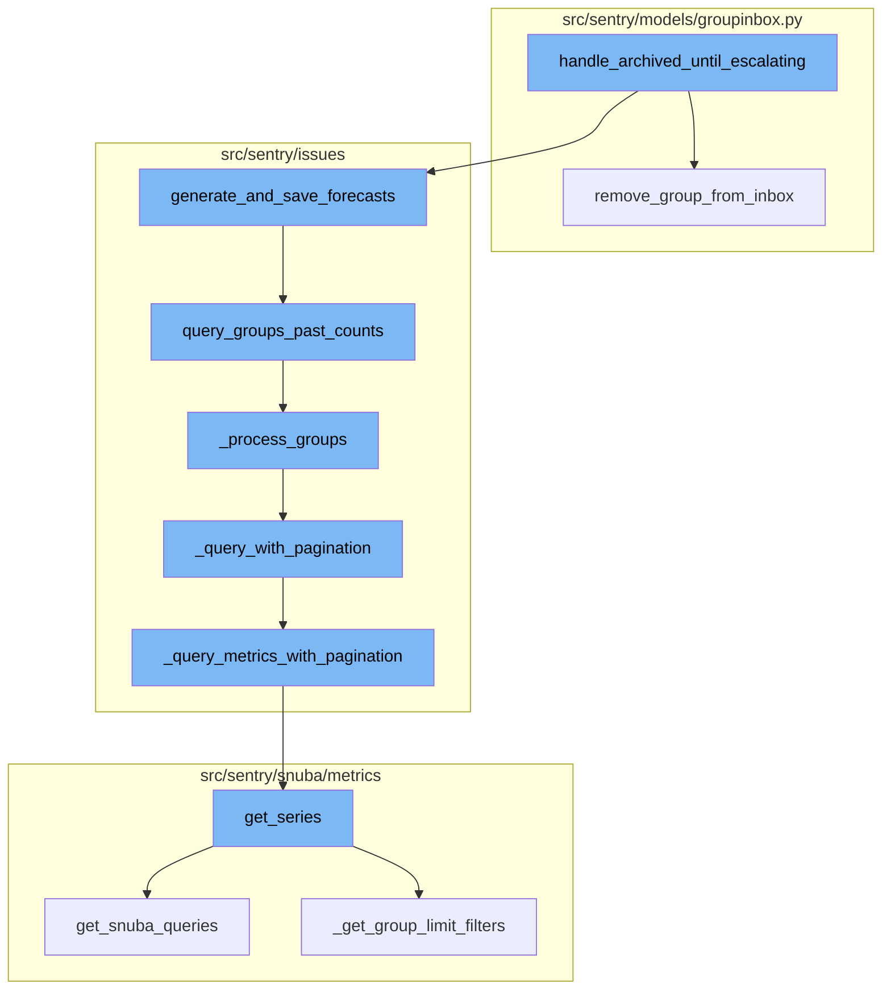
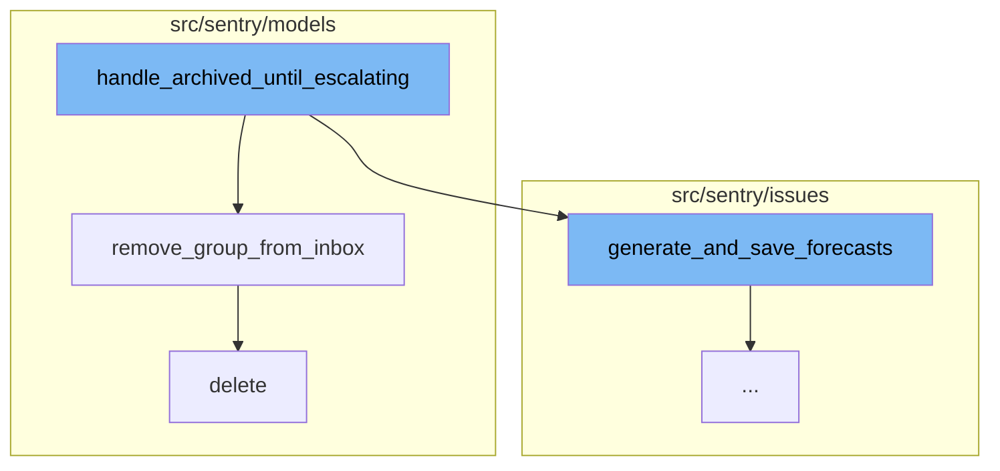
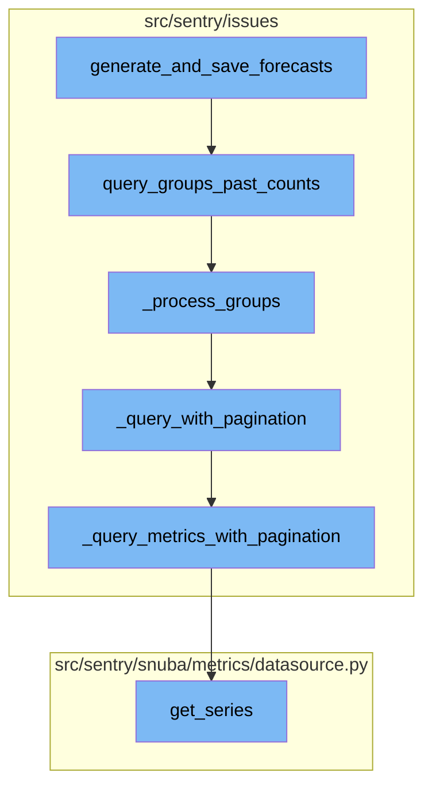

<SwmSnippet path="/src/sentry/issues/ignored.py" line="38">

---

# handle_archived_until_escalating

The `handle_archived_until_escalating` function is responsible for managing issues that are archived until they escalate. It processes a list of groups, an acting user, a list of projects, and a sender. For each group in the list, it removes the group from the inbox and generates forecasts for the group list. It then sends a robust signal `issue_archived` for each project with the list of groups belonging to that project.

```python
def handle_archived_until_escalating(
    group_list: Sequence[Group],
    acting_user: User | None,
    projects: Sequence[Project],
    sender: Any,
) -> dict[str, bool]:
    """
    Handle issues that are archived until escalating and create a forecast for them.

    Issues that are marked as ignored with `archiveDuration: until_escalating`
    in the statusDetail are treated as `archived_until_escalating`.
    """
    metrics.incr("group.archived_until_escalating", skip_internal=True)
    for group in group_list:
        remove_group_from_inbox(group, action=GroupInboxRemoveAction.IGNORED, user=acting_user)
    generate_and_save_forecasts(group_list)
    logger.info(
        "archived_until_escalating.forecast_created",
        extra={
            "detail": "Created forecast for groups",
            "group_ids": [group.id for group in group_list],
```

---

</SwmSnippet>

<SwmSnippet path="/src/sentry/models/groupinbox.py" line="96">

---

# remove_group_from_inbox

The `remove_group_from_inbox` function is called within `handle_archived_until_escalating`. It removes a specific group from the inbox. If the action is `MARK_REVIEWED` and a user is provided, it creates an activity of type `MARK_REVIEWED` for the group and records the group history as `REVIEWED`.

```python
def remove_group_from_inbox(group, action=None, user=None, referrer=None):
    try:
        group_inbox = GroupInbox.objects.get(group=group)
        group_inbox.delete()

        if action is GroupInboxRemoveAction.MARK_REVIEWED and user is not None:
            Activity.objects.create(
                project_id=group_inbox.group.project_id,
                group_id=group_inbox.group_id,
                type=ActivityType.MARK_REVIEWED.value,
                user_id=user.id,
            )
            record_group_history(group, GroupHistoryStatus.REVIEWED, actor=user)
    except GroupInbox.DoesNotExist:
        pass
```

---

</SwmSnippet>

<SwmSnippet path="/src/sentry/models/project.py" line="722">

---

# delete

The `delete` function is indirectly related to the `handle_archived_until_escalating` function. It is used to delete a project, which involves removing notification settings for the project and updating the project's outbox before deletion.

```python
    def delete(self, **kwargs):
        # There is no foreign key relationship so we have to manually cascade.
        notifications_service.remove_notification_settings_for_project(project_id=self.id)

        with outbox_context(transaction.atomic(router.db_for_write(Project))):
            Project.outbox_for_update(self.id, self.organization_id).save()
            return super().delete(**kwargs)
```

---

</SwmSnippet>

<SwmSnippet path="/src/sentry/issues/forecasts.py" line="53">

---

# generate_and_save_forecasts

The `generate_and_save_forecasts` function generates and saves forecasted values for each group. It filters out groups that should not be escalated and then queries past counts for these groups. The past counts are then parsed and saved per group.

```python
def generate_and_save_forecasts(groups: Iterable[Group]) -> None:
    """
    Generates and saves a list of forecasted values for each group.
    `groups`: Sequence of groups to be forecasted
    """
    groups = [group for group in groups if group.issue_type.should_detect_escalation()]
    past_counts = query_groups_past_counts(groups)
    group_counts = parse_groups_past_counts(past_counts)
    save_forecast_per_group(groups, group_counts)
    logger.info(
        "generate_and_save_forecasts",
        extra={
            "detail": "Created forecast for groups",
            "group_ids": [group.id for group in groups],
        },
    )
```

---

</SwmSnippet>

<SwmSnippet path="/src/sentry/issues/escalating.py" line="82">

---

# query_groups_past_counts

The `query_groups_past_counts` function queries Snuba for the counts for every group bucketed into hours. It optimizes the query by ensuring that we look at group_ids that are from the same project id. It separates groups into error groups and other groups, and processes them separately.

```python
def query_groups_past_counts(groups: Iterable[Group]) -> list[GroupsCountResponse]:
    """Query Snuba for the counts for every group bucketed into hours.

    It optimizes the query by guaranteeing that we look at group_ids that are from the same project id.
    This is important for Snuba as the data is stored in blocks related to the project id.

    If the group's issue type does not allow escalation, it will not be included in the query.

    We maximize the number of projects and groups to reduce the total number of Snuba queries.
    Each project may not have enough groups in order to reach the max number of returned
    elements (ELEMENTS_PER_SNUBA_PAGE), thus, projects with few groups should be grouped together until
    we get at least a certain number of groups.

    NOTE: Groups with less than the maximum number of buckets (think of groups with just 1 event or less
    than 7 days old) will skew the optimization since we may only get one page and less elements than the max
    ELEMENTS_PER_SNUBA_PAGE.
    """
    all_results: list[GroupsCountResponse] = []
    if not groups:
        return all_results

```

---

</SwmSnippet>

<SwmSnippet path="/src/sentry/issues/escalating.py" line="120">

---

# \_process_groups

The `_process_groups` function queries Snuba for their hourly bucket count. It organizes groups by project and organization, and queries them in batches to maximize the number of groups on the first page of results.

```python
def _process_groups(
    groups: Sequence[Group],
    start_date: datetime,
    end_date: datetime,
    category: GroupCategory | None = None,
) -> list[GroupsCountResponse]:
    """Given a list of groups, query Snuba for their hourly bucket count.
    The category defines which Snuba dataset and entity we query."""
    all_results: list[GroupsCountResponse] = []
    if not groups:
        return all_results

    group_ids_by_project_by_organization = _extract_organization_and_project_and_group_ids(groups)
    proj_ids, group_ids = [], []
    processed_projects = 0

    # This iteration guarantees that all groups for a project will be queried in the same call
    # and only one page where the groups could be mixed with groups from another project
    # Iterating over the sorted keys guarantees results for tests
    for organization_id in sorted(group_ids_by_project_by_organization.keys()):
        group_ids_by_project = group_ids_by_project_by_organization[organization_id]
```

---

</SwmSnippet>

<SwmSnippet path="/src/sentry/issues/escalating.py" line="168">

---

# \_query_with_pagination

The `_query_with_pagination` function queries Snuba for event counts for the given list of project ids and groups ids in a time range. It paginates the results and calls `_query_metrics_with_pagination` to paginate Snuba metric queries for event counts.

```python
def _query_with_pagination(
    organization_id: int,
    project_ids: Sequence[int],
    group_ids: Sequence[int],
    start_date: datetime,
    end_date: datetime,
    category: GroupCategory | None = None,
) -> list[GroupsCountResponse]:
    """Query Snuba for event counts for the given list of project ids and groups ids in
    a time range."""
    all_results = []
    offset = 0

    while True:
        query = _generate_entity_dataset_query(
            project_ids, group_ids, offset, start_date, end_date, category
        )
        request = Request(
            dataset=_issue_category_dataset(category),
            app_id=REFERRER,
            query=query,
```

---

</SwmSnippet>

<SwmSnippet path="/src/sentry/issues/escalating.py" line="204">

---

# \_query_metrics_with_pagination

The `_query_metrics_with_pagination` function paginates Snuba metric queries for event counts for the given list of project ids and groups ids in a time range. It checks if the returned results are equivalent to `all_results`. If not equivalent, it will generate a log.

```python
def _query_metrics_with_pagination(
    organization_id: int,
    project_ids: Sequence[int],
    group_ids: Sequence[int],
    start_date: datetime,
    end_date: datetime,
    all_results: list[GroupsCountResponse],
    category: GroupCategory | None = None,
) -> None:
    """
    Paginates Snuba metric queries for event counts for the
    given list of project ids and groups ids in a time range.

    Checks if the returned results are equivalent to `all_results`.
    If not equivalent, it will generate a log.
    """
    organization = Organization.objects.get(id=organization_id)

    if category == GroupCategory.ERROR and features.has(
        "organizations:escalating-issues-v2", organization
    ):
```

---

</SwmSnippet>

<SwmSnippet path="/src/sentry/snuba/metrics/datasource.py" line="897">

---

# get_series

The `get_series` function gets time series for the given query. It queries Snuba for event counts for the given list of project ids and groups ids in a time range. It also handles the case where there is no groupBy columns specified, and the case where the order by field spans multiple entities.

```python
def get_series(
    projects: Sequence[Project],
    metrics_query: DeprecatingMetricsQuery,
    use_case_id: UseCaseID,
    include_meta: bool = False,
    tenant_ids: dict[str, Any] | None = None,
) -> dict:
    """Get time series for the given query"""

    organization_id = projects[0].organization_id if projects else None
    tenant_ids = dict()
    if organization_id is not None:
        tenant_ids["organization_id"] = organization_id
    tenant_ids["use_case_id"] = use_case_id.value

    if metrics_query.interval is not None:
        interval = metrics_query.interval
    else:
        interval = metrics_query.granularity.granularity

    start, end, _num_intervals = to_intervals(metrics_query.start, metrics_query.end, interval)
```

---

</SwmSnippet>



# Flow drill down

First, we'll zoom into this section of the flow:



<SwmSnippet path="/src/sentry/issues/ignored.py" line="38">

---

# handle_archived_until_escalating Function

The `handle_archived_until_escalating` function is responsible for handling issues that are archived until they escalate. It takes a list of groups, an acting user, a list of projects, and a sender as parameters. For each group in the list, it removes the group from the inbox and generates forecasts for the group list. It then sends a robust signal `issue_archived` for each project with the list of groups belonging to that project.

```python
def handle_archived_until_escalating(
    group_list: Sequence[Group],
    acting_user: User | None,
    projects: Sequence[Project],
    sender: Any,
) -> dict[str, bool]:
    """
    Handle issues that are archived until escalating and create a forecast for them.

    Issues that are marked as ignored with `archiveDuration: until_escalating`
    in the statusDetail are treated as `archived_until_escalating`.
    """
    metrics.incr("group.archived_until_escalating", skip_internal=True)
    for group in group_list:
        remove_group_from_inbox(group, action=GroupInboxRemoveAction.IGNORED, user=acting_user)
    generate_and_save_forecasts(group_list)
    logger.info(
        "archived_until_escalating.forecast_created",
        extra={
            "detail": "Created forecast for groups",
            "group_ids": [group.id for group in group_list],
```

---

</SwmSnippet>

<SwmSnippet path="/src/sentry/models/groupinbox.py" line="96">

---

# remove_group_from_inbox Function

The `remove_group_from_inbox` function is called within `handle_archived_until_escalating`. It removes a specific group from the inbox. If the action is `MARK_REVIEWED` and a user is provided, it creates an activity of type `MARK_REVIEWED` for the group and records the group history as `REVIEWED`.

```python
def remove_group_from_inbox(group, action=None, user=None, referrer=None):
    try:
        group_inbox = GroupInbox.objects.get(group=group)
        group_inbox.delete()

        if action is GroupInboxRemoveAction.MARK_REVIEWED and user is not None:
            Activity.objects.create(
                project_id=group_inbox.group.project_id,
                group_id=group_inbox.group_id,
                type=ActivityType.MARK_REVIEWED.value,
                user_id=user.id,
            )
            record_group_history(group, GroupHistoryStatus.REVIEWED, actor=user)
    except GroupInbox.DoesNotExist:
        pass
```

---

</SwmSnippet>

<SwmSnippet path="/src/sentry/models/project.py" line="722">

---

# delete Function

The `delete` function is indirectly related to the `handle_archived_until_escalating` function. It is used to delete a project, which involves removing notification settings for the project and updating the project's outbox before deletion.

```python
    def delete(self, **kwargs):
        # There is no foreign key relationship so we have to manually cascade.
        notifications_service.remove_notification_settings_for_project(project_id=self.id)

        with outbox_context(transaction.atomic(router.db_for_write(Project))):
            Project.outbox_for_update(self.id, self.organization_id).save()
            return super().delete(**kwargs)
```

---

</SwmSnippet>

Now, lets zoom into this section of the flow:



<SwmSnippet path="/src/sentry/issues/forecasts.py" line="53">

---

# Generate and Save Forecasts

The `generate_and_save_forecasts` function is the starting point of the flow. It generates and saves forecasted values for each group. It filters out groups that should not be escalated and then queries past counts for these groups. The past counts are then parsed and saved per group.

```python
def generate_and_save_forecasts(groups: Iterable[Group]) -> None:
    """
    Generates and saves a list of forecasted values for each group.
    `groups`: Sequence of groups to be forecasted
    """
    groups = [group for group in groups if group.issue_type.should_detect_escalation()]
    past_counts = query_groups_past_counts(groups)
    group_counts = parse_groups_past_counts(past_counts)
    save_forecast_per_group(groups, group_counts)
    logger.info(
        "generate_and_save_forecasts",
        extra={
            "detail": "Created forecast for groups",
            "group_ids": [group.id for group in groups],
        },
    )
```

---

</SwmSnippet>

<SwmSnippet path="/src/sentry/issues/escalating.py" line="82">

---

# Query Groups Past Counts

The `query_groups_past_counts` function queries Snuba for the counts for every group bucketed into hours. It optimizes the query by ensuring that we look at group_ids that are from the same project id. It separates groups into error groups and other groups, and processes them separately.

```python
def query_groups_past_counts(groups: Iterable[Group]) -> list[GroupsCountResponse]:
    """Query Snuba for the counts for every group bucketed into hours.

    It optimizes the query by guaranteeing that we look at group_ids that are from the same project id.
    This is important for Snuba as the data is stored in blocks related to the project id.

    If the group's issue type does not allow escalation, it will not be included in the query.

    We maximize the number of projects and groups to reduce the total number of Snuba queries.
    Each project may not have enough groups in order to reach the max number of returned
    elements (ELEMENTS_PER_SNUBA_PAGE), thus, projects with few groups should be grouped together until
    we get at least a certain number of groups.

    NOTE: Groups with less than the maximum number of buckets (think of groups with just 1 event or less
    than 7 days old) will skew the optimization since we may only get one page and less elements than the max
    ELEMENTS_PER_SNUBA_PAGE.
    """
    all_results: list[GroupsCountResponse] = []
    if not groups:
        return all_results

```

---

</SwmSnippet>

<SwmSnippet path="/src/sentry/issues/escalating.py" line="120">

---

# Process Groups

The `_process_groups` function queries Snuba for their hourly bucket count. It organizes groups by project and organization, and queries them in batches to maximize the number of groups on the first page of results.

```python
def _process_groups(
    groups: Sequence[Group],
    start_date: datetime,
    end_date: datetime,
    category: GroupCategory | None = None,
) -> list[GroupsCountResponse]:
    """Given a list of groups, query Snuba for their hourly bucket count.
    The category defines which Snuba dataset and entity we query."""
    all_results: list[GroupsCountResponse] = []
    if not groups:
        return all_results

    group_ids_by_project_by_organization = _extract_organization_and_project_and_group_ids(groups)
    proj_ids, group_ids = [], []
    processed_projects = 0

    # This iteration guarantees that all groups for a project will be queried in the same call
    # and only one page where the groups could be mixed with groups from another project
    # Iterating over the sorted keys guarantees results for tests
    for organization_id in sorted(group_ids_by_project_by_organization.keys()):
        group_ids_by_project = group_ids_by_project_by_organization[organization_id]
```

---

</SwmSnippet>

<SwmSnippet path="/src/sentry/issues/escalating.py" line="168">

---

# Query with Pagination

The `_query_with_pagination` function queries Snuba for event counts for the given list of project ids and groups ids in a time range. It paginates the results and calls `_query_metrics_with_pagination` to paginate Snuba metric queries for event counts.

```python
def _query_with_pagination(
    organization_id: int,
    project_ids: Sequence[int],
    group_ids: Sequence[int],
    start_date: datetime,
    end_date: datetime,
    category: GroupCategory | None = None,
) -> list[GroupsCountResponse]:
    """Query Snuba for event counts for the given list of project ids and groups ids in
    a time range."""
    all_results = []
    offset = 0

    while True:
        query = _generate_entity_dataset_query(
            project_ids, group_ids, offset, start_date, end_date, category
        )
        request = Request(
            dataset=_issue_category_dataset(category),
            app_id=REFERRER,
            query=query,
```

---

</SwmSnippet>

<SwmSnippet path="/src/sentry/issues/escalating.py" line="204">

---

# Query Metrics with Pagination

The `_query_metrics_with_pagination` function paginates Snuba metric queries for event counts for the given list of project ids and groups ids in a time range. It checks if the returned results are equivalent to `all_results`. If not equivalent, it will generate a log.

```python
def _query_metrics_with_pagination(
    organization_id: int,
    project_ids: Sequence[int],
    group_ids: Sequence[int],
    start_date: datetime,
    end_date: datetime,
    all_results: list[GroupsCountResponse],
    category: GroupCategory | None = None,
) -> None:
    """
    Paginates Snuba metric queries for event counts for the
    given list of project ids and groups ids in a time range.

    Checks if the returned results are equivalent to `all_results`.
    If not equivalent, it will generate a log.
    """
    organization = Organization.objects.get(id=organization_id)

    if category == GroupCategory.ERROR and features.has(
        "organizations:escalating-issues-v2", organization
    ):
```

---

</SwmSnippet>

<SwmSnippet path="/src/sentry/snuba/metrics/datasource.py" line="897">

---

# Get Series

The `get_series` function gets time series for the given query. It queries Snuba for event counts for the given list of project ids and groups ids in a time range. It also handles the case where there is no groupBy columns specified, and the case where the order by field spans multiple entities.

```python
def get_series(
    projects: Sequence[Project],
    metrics_query: DeprecatingMetricsQuery,
    use_case_id: UseCaseID,
    include_meta: bool = False,
    tenant_ids: dict[str, Any] | None = None,
) -> dict:
    """Get time series for the given query"""

    organization_id = projects[0].organization_id if projects else None
    tenant_ids = dict()
    if organization_id is not None:
        tenant_ids["organization_id"] = organization_id
    tenant_ids["use_case_id"] = use_case_id.value

    if metrics_query.interval is not None:
        interval = metrics_query.interval
    else:
        interval = metrics_query.granularity.granularity

    start, end, _num_intervals = to_intervals(metrics_query.start, metrics_query.end, interval)
```

---

</SwmSnippet>

&nbsp;

*This is an auto-generated document by Swimm AI 🌊 and has not yet been verified by a human*

<SwmMeta version="3.0.0" repo-id="Z2l0aHViJTNBJTNBc2VudHJ5LWRlbW8lM0ElM0FTd2ltbS1EZW1v" repo-name="sentry-demo" doc-type="flows"><sup>Powered by [Swimm](/)</sup></SwmMeta>
