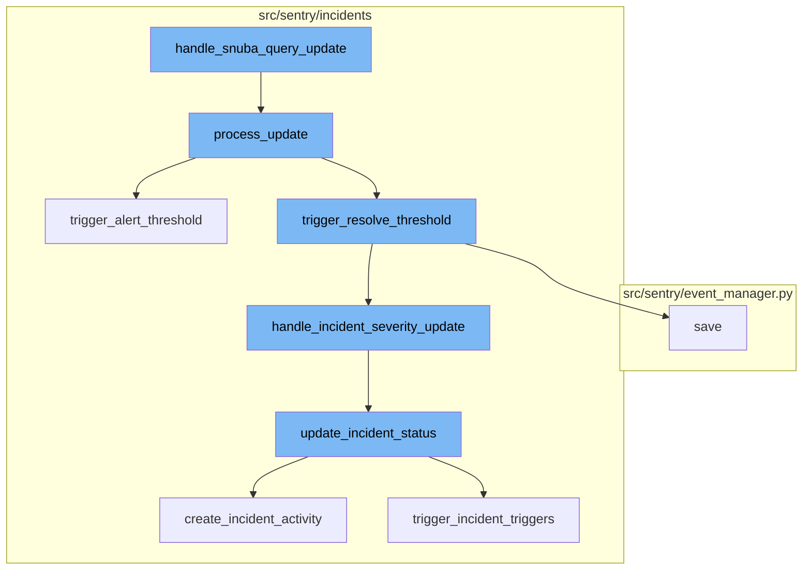
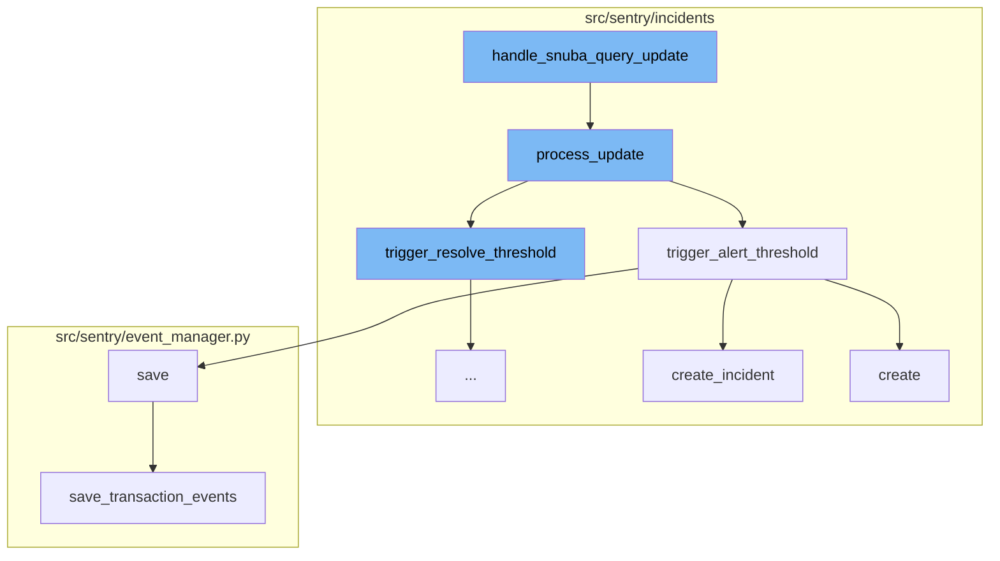
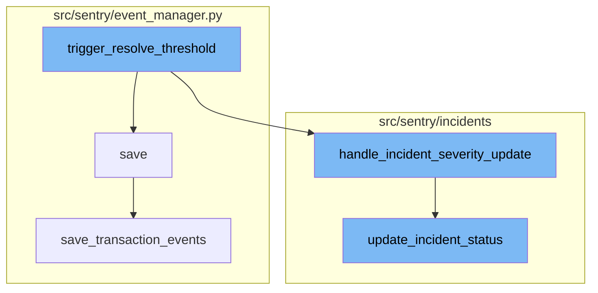

<SwmSnippet path="/src/sentry/incidents/tasks.py" line="165">

---

# handle_snuba_query_update

The `handle_snuba_query_update` function is the entry point for handling updates to a `QuerySubscription`. It uses the `SubscriptionProcessor` to process the update.

```python
def handle_snuba_query_update(
    subscription_update: QuerySubscriptionUpdate, subscription: QuerySubscription
) -> None:
    """
    Handles a subscription update for a `QuerySubscription`.
    """
    from sentry.incidents.subscription_processor import SubscriptionProcessor

    # noinspection SpellCheckingInspection
    with metrics.timer("incidents.subscription_procesor.process_update"):
        SubscriptionProcessor(subscription).process_update(subscription_update)
```

---

</SwmSnippet>

<SwmSnippet path="/src/sentry/incidents/subscription_processor.py" line="446">

---

# process_update

The `process_update` function is the core processing method used when the Query Subscription Consumer fetches updates. It checks the project and dataset, and if they exist and have the required features, it processes the update. It checks for alert rules and triggers them if the conditions are met.

```python
    def process_update(self, subscription_update: QuerySubscriptionUpdate) -> None:
        """
        This is the core processing method utilized when Query Subscription Consumer fetches updates from kafka
        """
        dataset = self.subscription.snuba_query.dataset
        try:
            # Check that the project exists
            self.subscription.project
        except Project.DoesNotExist:
            metrics.incr("incidents.alert_rules.ignore_deleted_project")
            return
        if dataset == "events" and not features.has(
            "organizations:incidents", self.subscription.project.organization
        ):
            # They have downgraded since these subscriptions have been created. So we just ignore updates for now.
            metrics.incr("incidents.alert_rules.ignore_update_missing_incidents")
            return
        elif dataset == "transactions" and not features.has(
            "organizations:performance-view", self.subscription.project.organization
        ):
            # They have downgraded since these subscriptions have been created. So we just ignore updates for now.
```

---

</SwmSnippet>

<SwmSnippet path="/src/sentry/incidents/subscription_processor.py" line="584">

---

# trigger_alert_threshold

The `trigger_alert_threshold` function is called when a subscription update exceeds the value defined in the `trigger.alert_threshold`, and the trigger hasn't already been activated. It increments the count of how many times we've consecutively exceeded the threshold, and if above the `threshold_period` defined in the alert rule then mark the trigger as activated, and create an incident if there isn't already one.

```python
    def trigger_alert_threshold(
        self, trigger: AlertRuleTrigger, metric_value: float
    ) -> IncidentTrigger | None:
        """
        Called when a subscription update exceeds the value defined in the
        `trigger.alert_threshold`, and the trigger hasn't already been activated.
        Increments the count of how many times we've consecutively exceeded the threshold, and if
        above the `threshold_period` defined in the alert rule then mark the trigger as
        activated, and create an incident if there isn't already one.
        :return:
        """
        self.trigger_alert_counts[trigger.id] += 1

        # If an incident was created for this rule, trigger type, and subscription
        # within the last 10 minutes, don't make another one
        last_it = (
            IncidentTrigger.objects.filter(alert_rule_trigger=trigger)
            .order_by("-incident_id")
            .select_related("incident")
            .first()
        )
```

---

</SwmSnippet>

<SwmSnippet path="/src/sentry/incidents/logic.py" line="113">

---

# create_incident

The `create_incident` function is used to create a new incident if we don't already have an active incident for the AlertRule. It sets the status of the incident to open and associates it with the alert rule.

```python
def create_incident(
    organization,
    type_,
    title,
    date_started,
    date_detected=None,
    # TODO: Probably remove detection_uuid?
    detection_uuid=None,
    projects=None,
    user=None,
    alert_rule=None,
    activation=None,
    subscription=None,
):
    if date_detected is None:
        date_detected = date_started

    with transaction.atomic(router.db_for_write(Incident)):
        incident = Incident.objects.create(
            organization=organization,
            detection_uuid=detection_uuid,
```

---

</SwmSnippet>

<SwmSnippet path="/src/sentry/event_manager.py" line="442">

---

# save

The `save` function is used to save the event after normalizing and processing it. It saves adjacent models such as releases and environments to postgres and writes the event into the eventstream. From there it will be picked up by Snuba and post-processing.

```python
    def save(
        self,
        project_id: int | None,
        raw: bool = False,
        assume_normalized: bool = False,
        start_time: float | None = None,
        cache_key: str | None = None,
        skip_send_first_transaction: bool = False,
        has_attachments: bool = False,
    ) -> Event:
        """
        After normalizing and processing an event, save adjacent models such as
        releases and environments to postgres and write the event into
        eventstream. From there it will be picked up by Snuba and
        post-processing.

        We re-insert events with duplicate IDs into Snuba, which is responsible
        for deduplicating events. Since deduplication in Snuba is on the primary
        key (based on event ID, project ID and day), events with same IDs are only
        deduplicated if their timestamps fall on the same day. The latest event
        always wins and overwrites the value of events received earlier in that day.
```

---

</SwmSnippet>

<SwmSnippet path="/src/sentry/incidents/subscription_processor.py" line="697">

---

# trigger_resolve_threshold

The `trigger_resolve_threshold` function is invoked when a subscription update exceeds the trigger resolve threshold and the trigger is currently active. It increments the resolve count for the trigger and checks if it has reached the alert rule threshold. If so, it resolves the incident trigger and checks if all triggers are resolved. If all triggers are resolved, it updates the incident status to closed. Otherwise, it calls `handle_incident_severity_update` to handle the incident severity update.

```python
    def trigger_resolve_threshold(
        self, trigger: AlertRuleTrigger, metric_value: float
    ) -> IncidentTrigger | None:
        """
        Called when a subscription update exceeds the trigger resolve threshold and the
        trigger is currently ACTIVE.
        :return:
        """
        self.trigger_resolve_counts[trigger.id] += 1
        if self.trigger_resolve_counts[trigger.id] >= self.alert_rule.threshold_period:
            metrics.incr("incidents.alert_rules.trigger", tags={"type": "resolve"})
            incident_trigger = self.incident_trigger_map[trigger.id]
            incident_trigger.status = TriggerStatus.RESOLVED.value
            incident_trigger.save()
            self.trigger_resolve_counts[trigger.id] = 0

            if self.check_triggers_resolved():
                update_incident_status(
                    self.active_incident,
                    IncidentStatus.CLOSED,
                    status_method=IncidentStatusMethod.RULE_TRIGGERED,
```

---

</SwmSnippet>

<SwmSnippet path="/src/sentry/event_manager.py" line="442">

---

# save

The `save` function is used to save an event after it has been normalized and processed. It saves adjacent models such as releases and environments to postgres and writes the event into the eventstream. It also handles deduplication of events with duplicate IDs in Snuba.

```python
    def save(
        self,
        project_id: int | None,
        raw: bool = False,
        assume_normalized: bool = False,
        start_time: float | None = None,
        cache_key: str | None = None,
        skip_send_first_transaction: bool = False,
        has_attachments: bool = False,
    ) -> Event:
        """
        After normalizing and processing an event, save adjacent models such as
        releases and environments to postgres and write the event into
        eventstream. From there it will be picked up by Snuba and
        post-processing.

        We re-insert events with duplicate IDs into Snuba, which is responsible
        for deduplicating events. Since deduplication in Snuba is on the primary
        key (based on event ID, project ID and day), events with same IDs are only
        deduplicated if their timestamps fall on the same day. The latest event
        always wins and overwrites the value of events received earlier in that day.
```

---

</SwmSnippet>

<SwmSnippet path="/src/sentry/incidents/subscription_processor.py" line="807">

---

# handle_incident_severity_update

The `handle_incident_severity_update` function is used to handle the update of incident severity. It checks if there are any active incident triggers and updates the incident status based on the severity of the triggers.

```python
    def handle_incident_severity_update(self) -> None:
        if self.active_incident:
            active_incident_triggers = IncidentTrigger.objects.filter(
                incident=self.active_incident, status=TriggerStatus.ACTIVE.value
            )
            severity = None
            for active_incident_trigger in active_incident_triggers:
                trigger = active_incident_trigger.alert_rule_trigger
                if trigger.label == CRITICAL_TRIGGER_LABEL:
                    severity = IncidentStatus.CRITICAL
                    break
                elif trigger.label == WARNING_TRIGGER_LABEL:
                    severity = IncidentStatus.WARNING

            if severity:
                update_incident_status(
                    self.active_incident,
                    severity,
                    status_method=IncidentStatusMethod.RULE_TRIGGERED,
                )
```

---

</SwmSnippet>

<SwmSnippet path="/src/sentry/incidents/logic.py" line="168">

---

# update_incident_status

The `update_incident_status` function is used to update the status of an incident and log the change. If the status is closed, it sets the date closed to the current time and takes a snapshot of the current incident state.

```python
def update_incident_status(
    incident,
    status,
    user=None,
    comment=None,
    status_method=IncidentStatusMethod.RULE_TRIGGERED,
    date_closed=None,
):
    """
    Updates the status of an Incident and write an IncidentActivity row to log
    the change. When the status is CLOSED we also set the date closed to the
    current time and take a snapshot of the current incident state.
    """
    if incident.status == status.value:
        # If the status isn't actually changing just no-op.
        return incident
    with transaction.atomic(router.db_for_write(Incident)):
        create_incident_activity(
            incident,
            IncidentActivityType.STATUS_CHANGE,
            user=user,
```

---

</SwmSnippet>

<SwmSnippet path="/src/sentry/event_manager.py" line="3042">

---

# save_transaction_events

The `save_transaction_events` function is used to save transaction events. It creates releases, event users, derives plugin tags and interface tags, calculates span grouping, materializes metadata, creates environments, and inserts the events into the eventstream.

```python
def save_transaction_events(jobs: Sequence[Job], projects: ProjectsMapping) -> Sequence[Job]:
    organization_ids = {project.organization_id for project in projects.values()}
    organizations = {o.id: o for o in Organization.objects.get_many_from_cache(organization_ids)}

    for project in projects.values():
        try:
            project.set_cached_field_value("organization", organizations[project.organization_id])
        except KeyError:
            continue

    set_measurement(measurement_name="jobs", value=len(jobs))
    set_measurement(measurement_name="projects", value=len(projects))

    _get_or_create_release_many(jobs, projects)
    _get_event_user_many(jobs, projects)
    _derive_plugin_tags_many(jobs, projects)
    _derive_interface_tags_many(jobs)
    _calculate_span_grouping(jobs, projects)
    _materialize_metadata_many(jobs)
    _get_or_create_environment_many(jobs, projects)
    _get_or_create_release_associated_models(jobs, projects)
```

---

</SwmSnippet>



# Flow drill down

First, we'll zoom into this section of the flow:



<SwmSnippet path="/src/sentry/incidents/tasks.py" line="165">

---

# handle_snuba_query_update

The `handle_snuba_query_update` function is the entry point for handling updates to a `QuerySubscription`. It uses the `SubscriptionProcessor` to process the update.

```python
def handle_snuba_query_update(
    subscription_update: QuerySubscriptionUpdate, subscription: QuerySubscription
) -> None:
    """
    Handles a subscription update for a `QuerySubscription`.
    """
    from sentry.incidents.subscription_processor import SubscriptionProcessor

    # noinspection SpellCheckingInspection
    with metrics.timer("incidents.subscription_procesor.process_update"):
        SubscriptionProcessor(subscription).process_update(subscription_update)
```

---

</SwmSnippet>

<SwmSnippet path="/src/sentry/incidents/subscription_processor.py" line="446">

---

# process_update

The `process_update` function is the core processing method used when the Query Subscription Consumer fetches updates. It checks the project and dataset, and if they exist and have the required features, it processes the update. It checks for alert rules and triggers them if the conditions are met.

```python
    def process_update(self, subscription_update: QuerySubscriptionUpdate) -> None:
        """
        This is the core processing method utilized when Query Subscription Consumer fetches updates from kafka
        """
        dataset = self.subscription.snuba_query.dataset
        try:
            # Check that the project exists
            self.subscription.project
        except Project.DoesNotExist:
            metrics.incr("incidents.alert_rules.ignore_deleted_project")
            return
        if dataset == "events" and not features.has(
            "organizations:incidents", self.subscription.project.organization
        ):
            # They have downgraded since these subscriptions have been created. So we just ignore updates for now.
            metrics.incr("incidents.alert_rules.ignore_update_missing_incidents")
            return
        elif dataset == "transactions" and not features.has(
            "organizations:performance-view", self.subscription.project.organization
        ):
            # They have downgraded since these subscriptions have been created. So we just ignore updates for now.
```

---

</SwmSnippet>

<SwmSnippet path="/src/sentry/incidents/subscription_processor.py" line="584">

---

# trigger_alert_threshold

The `trigger_alert_threshold` function is called when a subscription update exceeds the value defined in the `trigger.alert_threshold`, and the trigger hasn't already been activated. It increments the count of how many times we've consecutively exceeded the threshold, and if above the `threshold_period` defined in the alert rule then mark the trigger as activated, and create an incident if there isn't already one.

```python
    def trigger_alert_threshold(
        self, trigger: AlertRuleTrigger, metric_value: float
    ) -> IncidentTrigger | None:
        """
        Called when a subscription update exceeds the value defined in the
        `trigger.alert_threshold`, and the trigger hasn't already been activated.
        Increments the count of how many times we've consecutively exceeded the threshold, and if
        above the `threshold_period` defined in the alert rule then mark the trigger as
        activated, and create an incident if there isn't already one.
        :return:
        """
        self.trigger_alert_counts[trigger.id] += 1

        # If an incident was created for this rule, trigger type, and subscription
        # within the last 10 minutes, don't make another one
        last_it = (
            IncidentTrigger.objects.filter(alert_rule_trigger=trigger)
            .order_by("-incident_id")
            .select_related("incident")
            .first()
        )
```

---

</SwmSnippet>

<SwmSnippet path="/src/sentry/incidents/logic.py" line="113">

---

# create_incident

The `create_incident` function is used to create a new incident if we don't already have an active incident for the AlertRule. It sets the status of the incident to open and associates it with the alert rule.

```python
def create_incident(
    organization,
    type_,
    title,
    date_started,
    date_detected=None,
    # TODO: Probably remove detection_uuid?
    detection_uuid=None,
    projects=None,
    user=None,
    alert_rule=None,
    activation=None,
    subscription=None,
):
    if date_detected is None:
        date_detected = date_started

    with transaction.atomic(router.db_for_write(Incident)):
        incident = Incident.objects.create(
            organization=organization,
            detection_uuid=detection_uuid,
```

---

</SwmSnippet>

<SwmSnippet path="/src/sentry/event_manager.py" line="442">

---

# save

The `save` function is used to save the event after normalizing and processing it. It saves adjacent models such as releases and environments to postgres and writes the event into the eventstream. From there it will be picked up by Snuba and post-processing.

```python
    def save(
        self,
        project_id: int | None,
        raw: bool = False,
        assume_normalized: bool = False,
        start_time: float | None = None,
        cache_key: str | None = None,
        skip_send_first_transaction: bool = False,
        has_attachments: bool = False,
    ) -> Event:
        """
        After normalizing and processing an event, save adjacent models such as
        releases and environments to postgres and write the event into
        eventstream. From there it will be picked up by Snuba and
        post-processing.

        We re-insert events with duplicate IDs into Snuba, which is responsible
        for deduplicating events. Since deduplication in Snuba is on the primary
        key (based on event ID, project ID and day), events with same IDs are only
        deduplicated if their timestamps fall on the same day. The latest event
        always wins and overwrites the value of events received earlier in that day.
```

---

</SwmSnippet>

Now, lets zoom into this section of the flow:



<SwmSnippet path="/src/sentry/incidents/subscription_processor.py" line="697">

---

# Trigger Resolve Threshold

The `trigger_resolve_threshold` function is invoked when a subscription update exceeds the trigger resolve threshold and the trigger is currently active. It increments the resolve count for the trigger and checks if it has reached the alert rule threshold. If so, it resolves the incident trigger and checks if all triggers are resolved. If all triggers are resolved, it updates the incident status to closed. Otherwise, it calls `handle_incident_severity_update` to handle the incident severity update.

```python
    def trigger_resolve_threshold(
        self, trigger: AlertRuleTrigger, metric_value: float
    ) -> IncidentTrigger | None:
        """
        Called when a subscription update exceeds the trigger resolve threshold and the
        trigger is currently ACTIVE.
        :return:
        """
        self.trigger_resolve_counts[trigger.id] += 1
        if self.trigger_resolve_counts[trigger.id] >= self.alert_rule.threshold_period:
            metrics.incr("incidents.alert_rules.trigger", tags={"type": "resolve"})
            incident_trigger = self.incident_trigger_map[trigger.id]
            incident_trigger.status = TriggerStatus.RESOLVED.value
            incident_trigger.save()
            self.trigger_resolve_counts[trigger.id] = 0

            if self.check_triggers_resolved():
                update_incident_status(
                    self.active_incident,
                    IncidentStatus.CLOSED,
                    status_method=IncidentStatusMethod.RULE_TRIGGERED,
```

---

</SwmSnippet>

<SwmSnippet path="/src/sentry/event_manager.py" line="442">

---

# Save

The `save` function is used to save an event after it has been normalized and processed. It saves adjacent models such as releases and environments to postgres and writes the event into the eventstream. It also handles deduplication of events with duplicate IDs in Snuba.

```python
    def save(
        self,
        project_id: int | None,
        raw: bool = False,
        assume_normalized: bool = False,
        start_time: float | None = None,
        cache_key: str | None = None,
        skip_send_first_transaction: bool = False,
        has_attachments: bool = False,
    ) -> Event:
        """
        After normalizing and processing an event, save adjacent models such as
        releases and environments to postgres and write the event into
        eventstream. From there it will be picked up by Snuba and
        post-processing.

        We re-insert events with duplicate IDs into Snuba, which is responsible
        for deduplicating events. Since deduplication in Snuba is on the primary
        key (based on event ID, project ID and day), events with same IDs are only
        deduplicated if their timestamps fall on the same day. The latest event
        always wins and overwrites the value of events received earlier in that day.
```

---

</SwmSnippet>

<SwmSnippet path="/src/sentry/incidents/subscription_processor.py" line="807">

---

# Handle Incident Severity Update

The `handle_incident_severity_update` function is used to handle the update of incident severity. It checks if there are any active incident triggers and updates the incident status based on the severity of the triggers.

```python
    def handle_incident_severity_update(self) -> None:
        if self.active_incident:
            active_incident_triggers = IncidentTrigger.objects.filter(
                incident=self.active_incident, status=TriggerStatus.ACTIVE.value
            )
            severity = None
            for active_incident_trigger in active_incident_triggers:
                trigger = active_incident_trigger.alert_rule_trigger
                if trigger.label == CRITICAL_TRIGGER_LABEL:
                    severity = IncidentStatus.CRITICAL
                    break
                elif trigger.label == WARNING_TRIGGER_LABEL:
                    severity = IncidentStatus.WARNING

            if severity:
                update_incident_status(
                    self.active_incident,
                    severity,
                    status_method=IncidentStatusMethod.RULE_TRIGGERED,
                )
```

---

</SwmSnippet>

<SwmSnippet path="/src/sentry/incidents/logic.py" line="168">

---

# Update Incident Status

The `update_incident_status` function is used to update the status of an incident and log the change. If the status is closed, it sets the date closed to the current time and takes a snapshot of the current incident state.

```python
def update_incident_status(
    incident,
    status,
    user=None,
    comment=None,
    status_method=IncidentStatusMethod.RULE_TRIGGERED,
    date_closed=None,
):
    """
    Updates the status of an Incident and write an IncidentActivity row to log
    the change. When the status is CLOSED we also set the date closed to the
    current time and take a snapshot of the current incident state.
    """
    if incident.status == status.value:
        # If the status isn't actually changing just no-op.
        return incident
    with transaction.atomic(router.db_for_write(Incident)):
        create_incident_activity(
            incident,
            IncidentActivityType.STATUS_CHANGE,
            user=user,
```

---

</SwmSnippet>

<SwmSnippet path="/src/sentry/event_manager.py" line="3042">

---

# Save Transaction Events

The `save_transaction_events` function is used to save transaction events. It creates releases, event users, derives plugin tags and interface tags, calculates span grouping, materializes metadata, creates environments, and inserts the events into the eventstream.

```python
def save_transaction_events(jobs: Sequence[Job], projects: ProjectsMapping) -> Sequence[Job]:
    organization_ids = {project.organization_id for project in projects.values()}
    organizations = {o.id: o for o in Organization.objects.get_many_from_cache(organization_ids)}

    for project in projects.values():
        try:
            project.set_cached_field_value("organization", organizations[project.organization_id])
        except KeyError:
            continue

    set_measurement(measurement_name="jobs", value=len(jobs))
    set_measurement(measurement_name="projects", value=len(projects))

    _get_or_create_release_many(jobs, projects)
    _get_event_user_many(jobs, projects)
    _derive_plugin_tags_many(jobs, projects)
    _derive_interface_tags_many(jobs)
    _calculate_span_grouping(jobs, projects)
    _materialize_metadata_many(jobs)
    _get_or_create_environment_many(jobs, projects)
    _get_or_create_release_associated_models(jobs, projects)
```

---

</SwmSnippet>

&nbsp;

*This is an auto-generated document by Swimm AI 🌊 and has not yet been verified by a human*

<SwmMeta version="3.0.0" repo-id="Z2l0aHViJTNBJTNBc2VudHJ5LWRlbW8lM0ElM0FTd2ltbS1EZW1v" repo-name="sentry-demo" doc-type="flows"><sup>Powered by [Swimm](/)</sup></SwmMeta>
