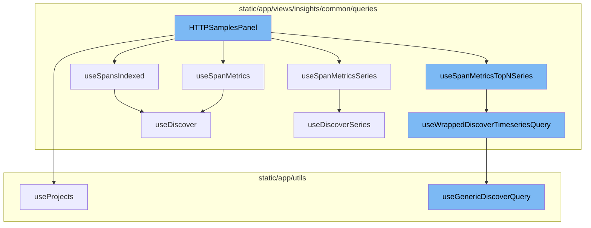

<SwmSnippet path="/static/app/views/insights/http/components/httpSamplesPanel.tsx" line="70">

---

# HTTPSamplesPanel

The `HTTPSamplesPanel` function is the main component of the HTTP samples panel. It uses various hooks and functions to fetch and manage data related to HTTP samples. It also handles user interactions such as panel changes and response code class changes.

```tsx
export function HTTPSamplesPanel() {
  const router = useRouter();
  const location = useLocation();

  const query = useLocationQuery({
    fields: {
      project: decodeScalar,
      domain: decodeScalar,
      transaction: decodeScalar,
      transactionMethod: decodeScalar,
      panel: decodePanel,
      responseCodeClass: decodeResponseCodeClass,
      spanSearchQuery: decodeScalar,
    },
  });

  const organization = useOrganization();

  const {projects} = useProjects();
  const {selection} = usePageFilters();
  const supportedTags = useSpanFieldSupportedTags();
```

---

</SwmSnippet>

<SwmSnippet path="/static/app/utils/useProjects.tsx" line="141">

---

## useProjects

`useProjects` is a hook that provides projects from the ProjectsStore. It also provides a way to select specific project slugs, and search for more projects that may not be in the project store.

```tsx
/**
 * Provides projects from the ProjectsStore
 *
 * This hook also provides a way to select specific project slugs, and search
 * (type-ahead) for more projects that may not be in the project store.
 *
 * NOTE: Currently ALL projects are always loaded, but this hook is designed
 * for future-compat in a world where we do _not_ load all projects.
 */
function useProjects({limit, slugs, orgId: propOrgId}: Options = {}) {
  const api = useApi();

  const organization = useOrganization({allowNull: true});
  const store = useLegacyStore(ProjectsStore);

  const orgId = propOrgId ?? organization?.slug ?? organization?.slug;

  const storeSlugs = new Set(store.projects.map(t => t.slug));
  const slugsToLoad = slugs?.filter(slug => !storeSlugs.has(slug)) ?? [];
  const shouldLoadSlugs = slugsToLoad.length > 0;

```

---

</SwmSnippet>

<SwmSnippet path="/static/app/views/insights/common/queries/useDiscoverSeries.ts" line="30">

---

## useSpanMetricsSeries

`useSpanMetricsSeries` is a hook that uses the `useDiscoverSeries` function to fetch span metrics series data.

```typescript
export const useSpanMetricsSeries = <Fields extends SpanMetricsProperty[]>(
  options: UseMetricsSeriesOptions<Fields> = {},
  referrer: string
) => {
  return useDiscoverSeries<Fields>(options, DiscoverDatasets.SPANS_METRICS, referrer);
};
```

---

</SwmSnippet>

<SwmSnippet path="/static/app/views/insights/common/queries/useDiscover.ts" line="38">

---

## useSpanMetrics

`useSpanMetrics` is a hook that uses the `useDiscover` function to fetch span metrics data.

```typescript
export const useSpanMetrics = <Fields extends SpanMetricsProperty[]>(
  options: UseMetricsOptions<Fields> = {},
  referrer: string
) => {
  return useDiscover<Fields, SpanMetricsResponse>(
    options,
    DiscoverDatasets.SPANS_METRICS,
    referrer
  );
};
```

---

</SwmSnippet>

<SwmSnippet path="/static/app/views/insights/common/queries/useDiscover.ts" line="27">

---

## useSpansIndexed

`useSpansIndexed` is a hook that uses the `useDiscover` function to fetch spans indexed data.

```typescript
export const useSpansIndexed = <Fields extends SpanIndexedField[]>(
  options: UseMetricsOptions<Fields> = {},
  referrer: string
) => {
  return useDiscover<Fields, SpanIndexedResponse>(
    options,
    DiscoverDatasets.SPANS_INDEXED,
    referrer
  );
};
```

---

</SwmSnippet>

<SwmSnippet path="/static/app/views/insights/common/queries/useSpanMetricsTopNSeries.tsx" line="24">

---

## useSpanMetricsTopNSeries

`useSpanMetricsTopNSeries` is a hook that fetches the top N series of span metrics. It uses the `useWrappedDiscoverTimeseriesQuery` function to fetch the data.

```tsx
export const useSpanMetricsTopNSeries = <Fields extends SpanMetricsProperty[]>(
  options: UseSpanMetricsSeriesOptions<Fields> = {topEvents: DEFAULT_EVENT_COUNT}
) => {
  const {
    search = undefined,
    fields = [],
    yAxis = [],
    topEvents,
    sorts = [],
    referrer = 'span-metrics-top-n-series',
  } = options;

  if (yAxis.length > 1) {
    throw new Error(
      'Multi-axis top-N queries are not supported by this hook. Try using `useSpansQuery` directly.'
    );
  }

  const pageFilters = usePageFilters();

  const eventView = getSeriesEventView(
```

---

</SwmSnippet>

<SwmSnippet path="/static/app/views/insights/common/queries/useSpansQuery.tsx" line="63">

---

## useWrappedDiscoverTimeseriesQuery

`useWrappedDiscoverTimeseriesQuery` is a hook that fetches timeseries data from the Discover API. It uses the `useGenericDiscoverQuery` function to fetch the data.

```tsx
export function useWrappedDiscoverTimeseriesQuery<T>({
  eventView,
  enabled,
  initialData,
  referrer,
  cursor,
  overriddenRoute,
}: {
  eventView: EventView;
  cursor?: string;
  enabled?: boolean;
  initialData?: any;
  overriddenRoute?: string;
  referrer?: string;
}) {
  const location = useLocation();
  const organization = useOrganization();
  const {isReady: pageFiltersReady} = usePageFilters();
  const result = useGenericDiscoverQuery<
    {
      data: any[];
```

---

</SwmSnippet>

<SwmSnippet path="/static/app/utils/discover/genericDiscoverQuery.tsx" line="419">

---

## useGenericDiscoverQuery

`useGenericDiscoverQuery` is a hook that fetches data from the Discover API. It is a generic function that can be used to fetch any type of data from the Discover API.

```tsx
export function useGenericDiscoverQuery<T, P>(props: Props<T, P>) {
  const api = useApi();
  const {orgSlug, route, options} = props;
  const url = `/organizations/${orgSlug}/${route}/`;
  const apiPayload = getPayload<T, P>(props);

  const res = useQuery<[T, string | undefined, ResponseMeta<T> | undefined], QueryError>(
    [route, apiPayload],
    ({signal: _signal}) =>
      doDiscoverQuery<T>(api, url, apiPayload, {
        queryBatching: props.queryBatching,
        skipAbort: props.skipAbort,
      }),
    options
  );

  return {
    ...res,
    data: res.data?.[0] ?? undefined,
    error: parseError(res.error),
    statusCode: res.data?.[1] ?? undefined,
```

---

</SwmSnippet>



# Flow drill down


<SwmSnippet path="/static/app/views/insights/http/components/httpSamplesPanel.tsx" line="70">

---

# HTTPSamplesPanel

The `HTTPSamplesPanel` function is the main component of the HTTP samples panel. It uses various hooks and functions to fetch and manage data related to HTTP samples. It also handles user interactions such as panel changes and response code class changes.

```tsx
export function HTTPSamplesPanel() {
  const router = useRouter();
  const location = useLocation();

  const query = useLocationQuery({
    fields: {
      project: decodeScalar,
      domain: decodeScalar,
      transaction: decodeScalar,
      transactionMethod: decodeScalar,
      panel: decodePanel,
      responseCodeClass: decodeResponseCodeClass,
      spanSearchQuery: decodeScalar,
    },
  });

  const organization = useOrganization();

  const {projects} = useProjects();
  const {selection} = usePageFilters();
  const supportedTags = useSpanFieldSupportedTags();
```

---

</SwmSnippet>

<SwmSnippet path="/static/app/utils/useProjects.tsx" line="141">

---

## useProjects

`useProjects` is a hook that provides projects from the ProjectsStore. It also provides a way to select specific project slugs, and search for more projects that may not be in the project store.

```tsx
/**
 * Provides projects from the ProjectsStore
 *
 * This hook also provides a way to select specific project slugs, and search
 * (type-ahead) for more projects that may not be in the project store.
 *
 * NOTE: Currently ALL projects are always loaded, but this hook is designed
 * for future-compat in a world where we do _not_ load all projects.
 */
function useProjects({limit, slugs, orgId: propOrgId}: Options = {}) {
  const api = useApi();

  const organization = useOrganization({allowNull: true});
  const store = useLegacyStore(ProjectsStore);

  const orgId = propOrgId ?? organization?.slug ?? organization?.slug;

  const storeSlugs = new Set(store.projects.map(t => t.slug));
  const slugsToLoad = slugs?.filter(slug => !storeSlugs.has(slug)) ?? [];
  const shouldLoadSlugs = slugsToLoad.length > 0;

```

---

</SwmSnippet>

<SwmSnippet path="/static/app/views/insights/common/queries/useDiscoverSeries.ts" line="30">

---

## useSpanMetricsSeries

`useSpanMetricsSeries` is a hook that uses the `useDiscoverSeries` function to fetch span metrics series data.

```typescript
export const useSpanMetricsSeries = <Fields extends SpanMetricsProperty[]>(
  options: UseMetricsSeriesOptions<Fields> = {},
  referrer: string
) => {
  return useDiscoverSeries<Fields>(options, DiscoverDatasets.SPANS_METRICS, referrer);
};
```

---

</SwmSnippet>

<SwmSnippet path="/static/app/views/insights/common/queries/useDiscover.ts" line="38">

---

## useSpanMetrics

`useSpanMetrics` is a hook that uses the `useDiscover` function to fetch span metrics data.

```typescript
export const useSpanMetrics = <Fields extends SpanMetricsProperty[]>(
  options: UseMetricsOptions<Fields> = {},
  referrer: string
) => {
  return useDiscover<Fields, SpanMetricsResponse>(
    options,
    DiscoverDatasets.SPANS_METRICS,
    referrer
  );
};
```

---

</SwmSnippet>

<SwmSnippet path="/static/app/views/insights/common/queries/useDiscover.ts" line="27">

---

## useSpansIndexed

`useSpansIndexed` is a hook that uses the `useDiscover` function to fetch spans indexed data.

```typescript
export const useSpansIndexed = <Fields extends SpanIndexedField[]>(
  options: UseMetricsOptions<Fields> = {},
  referrer: string
) => {
  return useDiscover<Fields, SpanIndexedResponse>(
    options,
    DiscoverDatasets.SPANS_INDEXED,
    referrer
  );
};
```

---

</SwmSnippet>

<SwmSnippet path="/static/app/views/insights/common/queries/useSpanMetricsTopNSeries.tsx" line="24">

---

## useSpanMetricsTopNSeries

`useSpanMetricsTopNSeries` is a hook that fetches the top N series of span metrics. It uses the `useWrappedDiscoverTimeseriesQuery` function to fetch the data.

```tsx
export const useSpanMetricsTopNSeries = <Fields extends SpanMetricsProperty[]>(
  options: UseSpanMetricsSeriesOptions<Fields> = {topEvents: DEFAULT_EVENT_COUNT}
) => {
  const {
    search = undefined,
    fields = [],
    yAxis = [],
    topEvents,
    sorts = [],
    referrer = 'span-metrics-top-n-series',
  } = options;

  if (yAxis.length > 1) {
    throw new Error(
      'Multi-axis top-N queries are not supported by this hook. Try using `useSpansQuery` directly.'
    );
  }

  const pageFilters = usePageFilters();

  const eventView = getSeriesEventView(
```

---

</SwmSnippet>

<SwmSnippet path="/static/app/views/insights/common/queries/useSpansQuery.tsx" line="63">

---

## useWrappedDiscoverTimeseriesQuery

`useWrappedDiscoverTimeseriesQuery` is a hook that fetches timeseries data from the Discover API. It uses the `useGenericDiscoverQuery` function to fetch the data.

```tsx
export function useWrappedDiscoverTimeseriesQuery<T>({
  eventView,
  enabled,
  initialData,
  referrer,
  cursor,
  overriddenRoute,
}: {
  eventView: EventView;
  cursor?: string;
  enabled?: boolean;
  initialData?: any;
  overriddenRoute?: string;
  referrer?: string;
}) {
  const location = useLocation();
  const organization = useOrganization();
  const {isReady: pageFiltersReady} = usePageFilters();
  const result = useGenericDiscoverQuery<
    {
      data: any[];
```

---

</SwmSnippet>

<SwmSnippet path="/static/app/utils/discover/genericDiscoverQuery.tsx" line="419">

---

## useGenericDiscoverQuery

`useGenericDiscoverQuery` is a hook that fetches data from the Discover API. It is a generic function that can be used to fetch any type of data from the Discover API.

```tsx
export function useGenericDiscoverQuery<T, P>(props: Props<T, P>) {
  const api = useApi();
  const {orgSlug, route, options} = props;
  const url = `/organizations/${orgSlug}/${route}/`;
  const apiPayload = getPayload<T, P>(props);

  const res = useQuery<[T, string | undefined, ResponseMeta<T> | undefined], QueryError>(
    [route, apiPayload],
    ({signal: _signal}) =>
      doDiscoverQuery<T>(api, url, apiPayload, {
        queryBatching: props.queryBatching,
        skipAbort: props.skipAbort,
      }),
    options
  );

  return {
    ...res,
    data: res.data?.[0] ?? undefined,
    error: parseError(res.error),
    statusCode: res.data?.[1] ?? undefined,
```

---

</SwmSnippet>

&nbsp;

*This is an auto-generated document by Swimm AI 🌊 and has not yet been verified by a human*

<SwmMeta version="3.0.0" repo-id="Z2l0aHViJTNBJTNBc2VudHJ5LWRlbW8lM0ElM0FTd2ltbS1EZW1v" repo-name="sentry-demo" doc-type="flows"><sup>Powered by [Swimm](/)</sup></SwmMeta>
