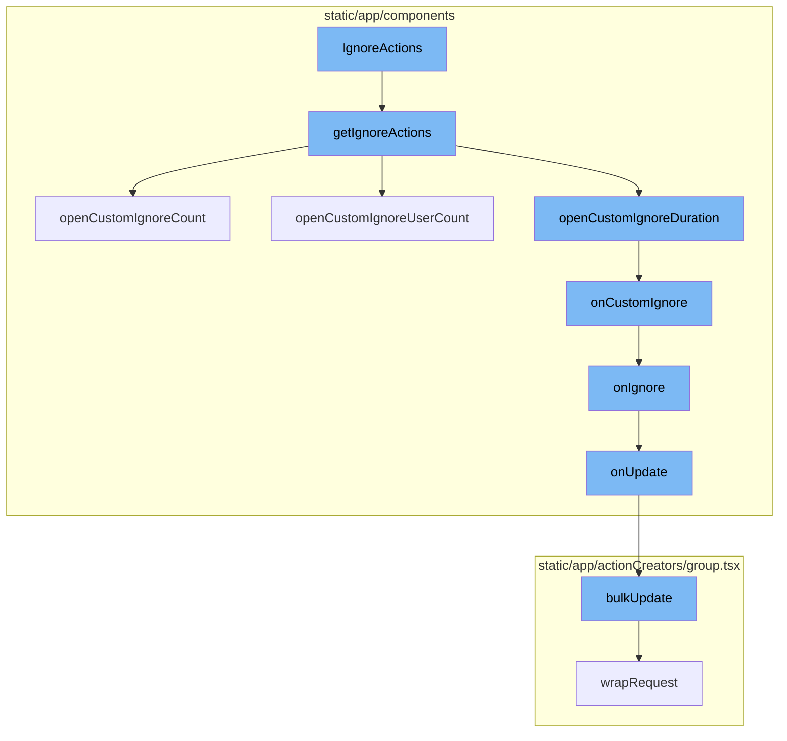
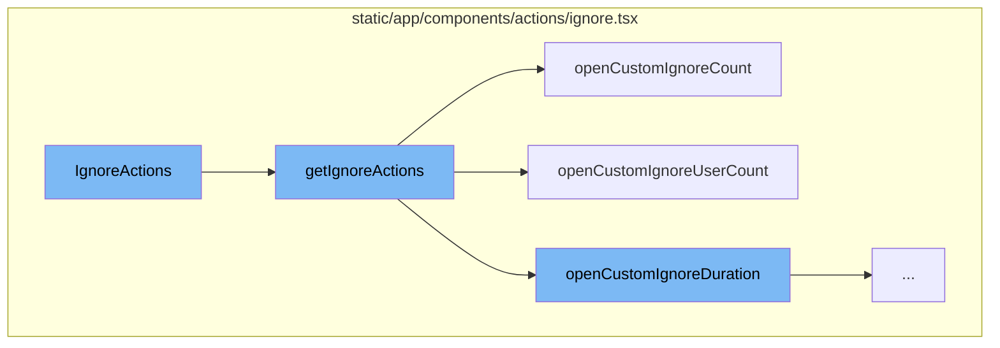
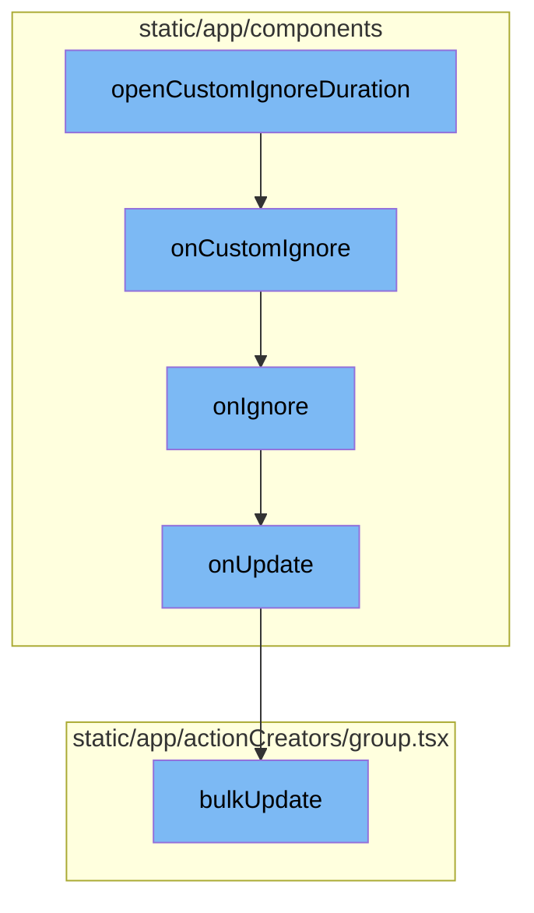

# Overview of IgnoreActions

IgnoreActions is a feature that allows users to ignore specific issues within the Sentry application. This feature provides several options for ignoring issues, such as ignoring for a specific duration, until a certain count of occurrences, or until a certain count of users are affected.

<SwmSnippet path="/static/app/components/actions/ignore.tsx" line="213">

---

# IgnoreActions Function

The `IgnoreActions` function is a component that renders a button to ignore an issue. It uses the `getIgnoreActions` function to determine the actions that should be taken when the ignore button is clicked.

```tsx
function IgnoreActions({
  onUpdate,
  disabled,
  shouldConfirm,
  confirmMessage,
  className,
  size = 'xs',
  confirmLabel = t('Ignore'),
  isIgnored = false,
}: IgnoreActionProps) {
  if (isIgnored) {
    return (
      <Tooltip title={t('Change status to unresolved')}>
        <Button
          priority="primary"
          size="xs"
          onClick={() =>
            onUpdate({
              status: GroupStatus.UNRESOLVED,
              statusDetails: {},
              substatus: GroupSubstatus.ONGOING,
```

---

</SwmSnippet>

<SwmSnippet path="/static/app/components/actions/ignore.tsx" line="43">

---

# getIgnoreActions Function

The `getIgnoreActions` function defines the actions that can be taken when ignoring an issue. It includes options to ignore an issue for a specific duration, ignore until a certain count of occurrences, or ignore until a certain count of users are affected. These options are presented to the user in a dropdown menu.

```tsx
export function getIgnoreActions({
  confirmLabel,
  confirmMessage,
  shouldConfirm,
  onUpdate,
}: Pick<
  IgnoreActionProps,
  'shouldConfirm' | 'confirmMessage' | 'confirmLabel' | 'onUpdate'
>) {
  const onIgnore = (
    statusDetails: IgnoredStatusDetails | undefined = {},
    {bypassConfirm} = {bypassConfirm: false}
  ) => {
    openConfirmModal({
      bypass: bypassConfirm || !shouldConfirm,
      onConfirm: () =>
        onUpdate({
          status: GroupStatus.IGNORED,
          statusDetails,
          substatus: GroupSubstatus.ARCHIVED_UNTIL_CONDITION_MET,
        }),
```

---

</SwmSnippet>

<SwmSnippet path="/static/app/components/actions/ignore.tsx" line="73">

---

# Custom Ignore Options

The `openCustomIgnoreDuration`, `openCustomIgnoreCount`, and `openCustomIgnoreUserCount` functions open modals that allow the user to specify custom ignore options. These options include a custom duration for which the issue should be ignored, a custom count of occurrences at which point the issue should no longer be ignored, and a custom count of affected users at which point the issue should no longer be ignored.

```tsx
  const openCustomIgnoreDuration = () =>
    openModal(deps => (
      <CustomIgnoreDurationModal
        {...deps}
        onSelected={details => onCustomIgnore(details)}
      />
    ));

  const openCustomIgnoreCount = () =>
    openModal(deps => (
      <CustomIgnoreCountModal
        {...deps}
        onSelected={details => onCustomIgnore(details)}
        label={t('Ignore this issue until it occurs again\u2026')}
        countLabel={t('Number of times')}
        countName="ignoreCount"
        windowName="ignoreWindow"
        windowOptions={IGNORE_WINDOWS}
      />
    ));

```

---

</SwmSnippet>

<SwmSnippet path="/static/app/components/actions/ignore.tsx" line="73">

---

# IgnoreActions Flow

The `openCustomIgnoreDuration` function opens a modal for custom ignore duration. It passes the `onCustomIgnore` function as a prop to the `CustomIgnoreDurationModal` component. The `onCustomIgnore` function is triggered when a user selects a custom ignore duration. It calls the `onIgnore` function with the selected status details and bypasses the confirmation. The `onIgnore` function opens a confirmation modal. If the confirmation is bypassed or the user confirms, it calls the `onUpdate` function with the new status details.

```tsx
  const openCustomIgnoreDuration = () =>
    openModal(deps => (
      <CustomIgnoreDurationModal
        {...deps}
        onSelected={details => onCustomIgnore(details)}
      />
    ));

  const openCustomIgnoreCount = () =>
    openModal(deps => (
      <CustomIgnoreCountModal
        {...deps}
        onSelected={details => onCustomIgnore(details)}
        label={t('Ignore this issue until it occurs again\u2026')}
        countLabel={t('Number of times')}
        countName="ignoreCount"
```

---

</SwmSnippet>

<SwmSnippet path="/static/app/components/issues/compactIssue.tsx" line="127">

---

# Updating Issue Status

The `onUpdate` method updates the issue's status. It calls the `bulkUpdate` function with the new status data.

```tsx
  onUpdate(data: Record<string, string>) {
    const issue = this.state.issue;
    if (!issue) {
      return;
    }
    addLoadingMessage(t('Saving changes\u2026'));

    bulkUpdate(
      this.props.api,
      {
        orgId: this.props.organization.slug,
        projectId: issue.project.slug,
        itemIds: [issue.id],
        data,
      },
      {
        complete: () => {
          clearIndicators();
        },
      }
    );
```

---

</SwmSnippet>

<SwmSnippet path="/static/app/actionCreators/group.tsx" line="337">

---

# Bulk Update Function

The `bulkUpdate` function updates the status of a group of issues in the store and sends a PUT request to the server to update the status in the database.

```tsx
export function bulkUpdate(
  api: Client,
  params: BulkUpdateParams,
  options: RequestCallbacks
) {
  const {itemIds, failSilently, data} = params;
  const path = getUpdateUrl(params);

  const query: QueryArgs = paramsToQueryArgs(params);
  const id = uniqueId();

  GroupStore.onUpdate(id, itemIds, data);

  return wrapRequest(
    api,
    path,
    {
      query,
      method: 'PUT',
      data,
      success: response => {
```

---

</SwmSnippet>



# Flow drill down

First, we'll zoom into this section of the flow:



<SwmSnippet path="/static/app/components/actions/ignore.tsx" line="213">

---

# IgnoreActions Function

The `IgnoreActions` function is a component that renders a button to ignore an issue. It uses the `getIgnoreActions` function to determine the actions that should be taken when the ignore button is clicked.

```tsx
function IgnoreActions({
  onUpdate,
  disabled,
  shouldConfirm,
  confirmMessage,
  className,
  size = 'xs',
  confirmLabel = t('Ignore'),
  isIgnored = false,
}: IgnoreActionProps) {
  if (isIgnored) {
    return (
      <Tooltip title={t('Change status to unresolved')}>
        <Button
          priority="primary"
          size="xs"
          onClick={() =>
            onUpdate({
              status: GroupStatus.UNRESOLVED,
              statusDetails: {},
              substatus: GroupSubstatus.ONGOING,
```

---

</SwmSnippet>

<SwmSnippet path="/static/app/components/actions/ignore.tsx" line="43">

---

# getIgnoreActions Function

The `getIgnoreActions` function defines the actions that can be taken when ignoring an issue. It includes options to ignore an issue for a specific duration, ignore until a certain count of occurrences, or ignore until a certain count of users are affected. These options are presented to the user in a dropdown menu.

```tsx
export function getIgnoreActions({
  confirmLabel,
  confirmMessage,
  shouldConfirm,
  onUpdate,
}: Pick<
  IgnoreActionProps,
  'shouldConfirm' | 'confirmMessage' | 'confirmLabel' | 'onUpdate'
>) {
  const onIgnore = (
    statusDetails: IgnoredStatusDetails | undefined = {},
    {bypassConfirm} = {bypassConfirm: false}
  ) => {
    openConfirmModal({
      bypass: bypassConfirm || !shouldConfirm,
      onConfirm: () =>
        onUpdate({
          status: GroupStatus.IGNORED,
          statusDetails,
          substatus: GroupSubstatus.ARCHIVED_UNTIL_CONDITION_MET,
        }),
```

---

</SwmSnippet>

<SwmSnippet path="/static/app/components/actions/ignore.tsx" line="73">

---

# openCustomIgnoreDuration Function

The `openCustomIgnoreDuration` function opens a modal that allows the user to specify a custom duration for which the issue should be ignored.

```tsx
  const openCustomIgnoreDuration = () =>
    openModal(deps => (
      <CustomIgnoreDurationModal
        {...deps}
        onSelected={details => onCustomIgnore(details)}
      />
    ));

  const openCustomIgnoreCount = () =>
```

---

</SwmSnippet>

<SwmSnippet path="/static/app/components/actions/ignore.tsx" line="81">

---

# openCustomIgnoreCount Function

The `openCustomIgnoreCount` function opens a modal that allows the user to specify a custom count of occurrences at which point the issue should no longer be ignored.

```tsx
  const openCustomIgnoreCount = () =>
    openModal(deps => (
      <CustomIgnoreCountModal
        {...deps}
        onSelected={details => onCustomIgnore(details)}
        label={t('Ignore this issue until it occurs again\u2026')}
        countLabel={t('Number of times')}
        countName="ignoreCount"
        windowName="ignoreWindow"
        windowOptions={IGNORE_WINDOWS}
      />
    ));
```

---

</SwmSnippet>

<SwmSnippet path="/static/app/components/actions/ignore.tsx" line="94">

---

# openCustomIgnoreUserCount Function

The `openCustomIgnoreUserCount` function opens a modal that allows the user to specify a custom count of affected users at which point the issue should no longer be ignored.

```tsx
  const openCustomIgnoreUserCount = () =>
    openModal(deps => (
      <CustomIgnoreCountModal
        {...deps}
        onSelected={details => onCustomIgnore(details)}
        label={t('Ignore this issue until it affects an additional\u2026')}
        countLabel={t('Number of users')}
        countName="ignoreUserCount"
        windowName="ignoreUserWindow"
        windowOptions={IGNORE_WINDOWS}
      />
    ));
```

---

</SwmSnippet>

Now, lets zoom into this section of the flow:



<SwmSnippet path="/static/app/components/actions/ignore.tsx" line="73">

---

# IgnoreActions Flow

The `openCustomIgnoreDuration` function opens a modal for custom ignore duration. It passes the `onCustomIgnore` function as a prop to the `CustomIgnoreDurationModal` component.

```tsx
  const openCustomIgnoreDuration = () =>
    openModal(deps => (
      <CustomIgnoreDurationModal
        {...deps}
        onSelected={details => onCustomIgnore(details)}
      />
    ));
```

---

</SwmSnippet>

<SwmSnippet path="/static/app/components/actions/ignore.tsx" line="69">

---

The `onCustomIgnore` function is triggered when a user selects a custom ignore duration. It calls the `onIgnore` function with the selected status details and bypasses the confirmation.

```tsx
  const onCustomIgnore = (statusDetails: IgnoredStatusDetails) => {
    onIgnore(statusDetails, {bypassConfirm: true});
  };
```

---

</SwmSnippet>

<SwmSnippet path="/static/app/components/actions/ignore.tsx" line="52">

---

The `onIgnore` function opens a confirmation modal. If the confirmation is bypassed or the user confirms, it calls the `onUpdate` function with the new status details.

```tsx
  const onIgnore = (
    statusDetails: IgnoredStatusDetails | undefined = {},
    {bypassConfirm} = {bypassConfirm: false}
  ) => {
    openConfirmModal({
      bypass: bypassConfirm || !shouldConfirm,
      onConfirm: () =>
        onUpdate({
          status: GroupStatus.IGNORED,
          statusDetails,
          substatus: GroupSubstatus.ARCHIVED_UNTIL_CONDITION_MET,
        }),
      message: confirmMessage?.() ?? null,
      confirmText: confirmLabel,
    });
  };
```

---

</SwmSnippet>

<SwmSnippet path="/static/app/components/issues/compactIssue.tsx" line="127">

---

The `onUpdate` method updates the issue's status. It calls the `bulkUpdate` function with the new status data.

```tsx
  onUpdate(data: Record<string, string>) {
    const issue = this.state.issue;
    if (!issue) {
      return;
    }
    addLoadingMessage(t('Saving changes\u2026'));

    bulkUpdate(
      this.props.api,
      {
        orgId: this.props.organization.slug,
        projectId: issue.project.slug,
        itemIds: [issue.id],
        data,
      },
      {
        complete: () => {
          clearIndicators();
        },
      }
    );
```

---

</SwmSnippet>

<SwmSnippet path="/static/app/actionCreators/group.tsx" line="337">

---

The `bulkUpdate` function updates the status of a group of issues in the store and sends a PUT request to the server to update the status in the database.

```tsx
export function bulkUpdate(
  api: Client,
  params: BulkUpdateParams,
  options: RequestCallbacks
) {
  const {itemIds, failSilently, data} = params;
  const path = getUpdateUrl(params);

  const query: QueryArgs = paramsToQueryArgs(params);
  const id = uniqueId();

  GroupStore.onUpdate(id, itemIds, data);

  return wrapRequest(
    api,
    path,
    {
      query,
      method: 'PUT',
      data,
      success: response => {
```

---

</SwmSnippet>

&nbsp;

*This is an auto-generated document by Swimm AI 🌊 and has not yet been verified by a human*

<SwmMeta version="3.0.0" repo-id="Z2l0aHViJTNBJTNBc2VudHJ5LWRlbW8lM0ElM0FTd2ltbS1EZW1v" repo-name="sentry-demo" doc-type="flows"><sup>Powered by [Swimm](/)</sup></SwmMeta>
