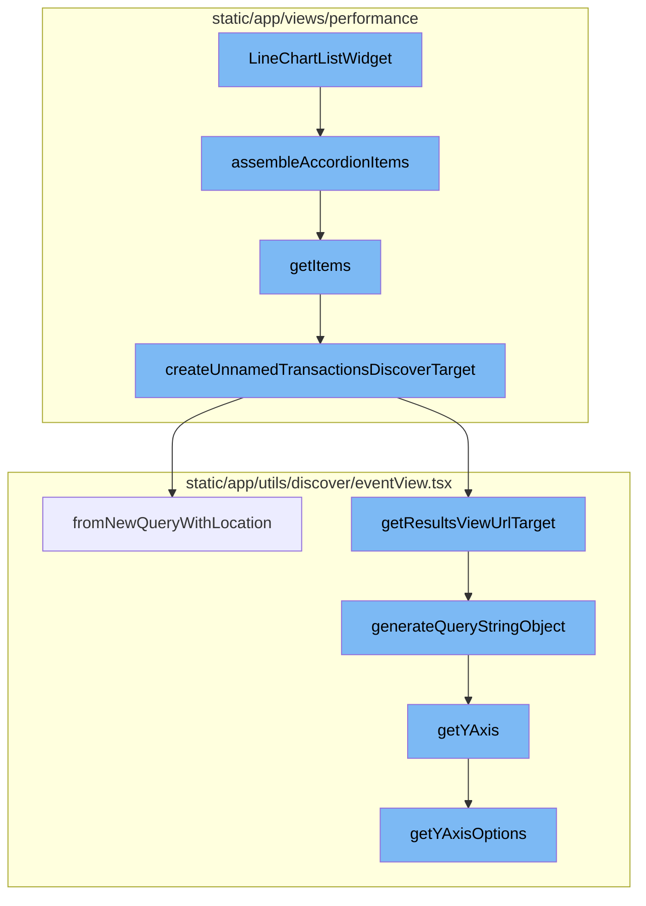
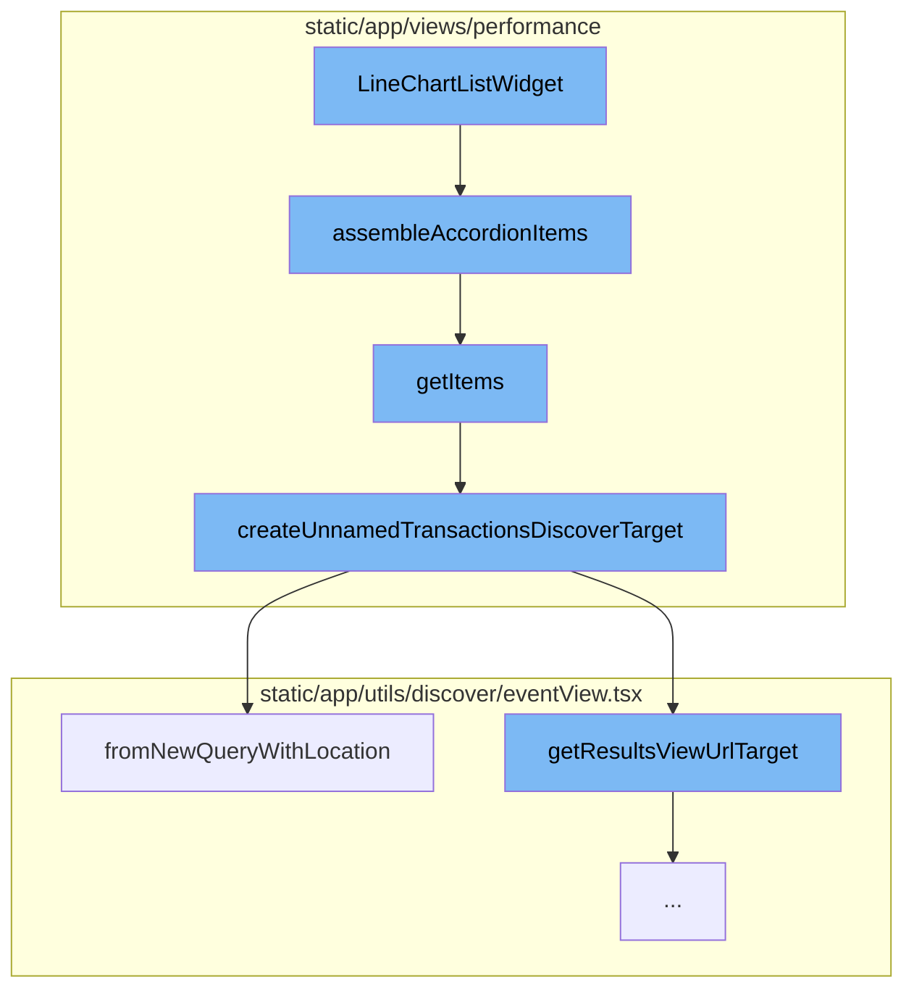
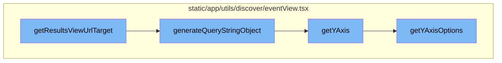

<SwmSnippet path="/static/app/views/performance/landing/widgets/widgets/lineChartListWidget.tsx" line="92">

---

# LineChartListWidget

The `LineChartListWidget` is a component that renders a line chart list widget. It uses various hooks and states to manage its data and behavior. It also defines several helper functions and components within it, such as `assembleAccordionItems`, `getItems`, and `getChart`.

```tsx
export function LineChartListWidget(props: PerformanceWidgetProps) {
  const location = useLocation();
  const mepSetting = useMEPSettingContext();
  const [selectedListIndex, setSelectListIndex] = useState<number>(0);
  const {ContainerActions, organization, InteractiveTitle} = props;
  const {setPageError} = usePageAlert();
  const canHaveIntegrationEmptyState = integrationEmptyStateWidgets.includes(
    props.chartSetting
  );

  let emptyComponent;
  if (props.chartSetting === PerformanceWidgetSetting.MOST_TIME_SPENT_DB_QUERIES) {
    emptyComponent = TimeSpentInDatabaseWidgetEmptyStateWarning;
  } else if (
    props.chartSetting === PerformanceWidgetSetting.MOST_TIME_CONSUMING_DOMAINS
  ) {
    emptyComponent = TimeConsumingDomainsWidgetEmptyStateWarning;
  } else if (
    props.chartSetting === PerformanceWidgetSetting.HIGHEST_CACHE_MISS_RATE_TRANSACTIONS
  ) {
    emptyComponent = HighestCacheMissRateTransactionsWidgetEmptyStateWarning;
```

---

</SwmSnippet>

<SwmSnippet path="/static/app/views/performance/landing/widgets/widgets/lineChartListWidget.tsx" line="488">

---

## assembleAccordionItems Function

The `assembleAccordionItems` function is a helper function within `LineChartListWidget`. It takes the provided data and maps it into a format suitable for an accordion component. Each item in the accordion is composed of a header and content, which are derived from the provided data.

```tsx
  const assembleAccordionItems = provided =>
    getItems(provided).map(item => ({header: item, content: getChart(provided)}));
```

---

</SwmSnippet>

<SwmSnippet path="/static/app/views/performance/landing/widgets/widgets/lineChartListWidget.tsx" line="502">

---

## getItems Function

The `getItems` function is another helper function within `LineChartListWidget`. It takes the provided widget data and maps it into a list of items. Each item is a complex object that includes transaction data, additional query parameters, and a target URL for the transaction. The function also handles different chart settings and formats the item data accordingly.

```tsx
  const getItems = provided =>
    provided.widgetData.list.data.map(listItem => {
      const transaction = (listItem.transaction as string | undefined) ?? '';

      const additionalQuery: Record<string, string> = {};

      if (props.chartSetting === PerformanceWidgetSetting.SLOW_HTTP_OPS) {
        additionalQuery.breakdown = 'http';
        additionalQuery.display = 'latency';
      } else if (props.chartSetting === PerformanceWidgetSetting.SLOW_DB_OPS) {
        additionalQuery.breakdown = 'db';
        additionalQuery.display = 'latency';
      } else if (props.chartSetting === PerformanceWidgetSetting.SLOW_BROWSER_OPS) {
        additionalQuery.breakdown = 'browser';
        additionalQuery.display = 'latency';
      } else if (props.chartSetting === PerformanceWidgetSetting.SLOW_RESOURCE_OPS) {
        additionalQuery.breakdown = 'resource';
        additionalQuery.display = 'latency';
      }

      const isUnparameterizedRow = transaction === UNPARAMETERIZED_TRANSACTION;
```

---

</SwmSnippet>

<SwmSnippet path="/static/app/views/performance/utils/index.tsx" line="51">

---

## createUnnamedTransactionsDiscoverTarget Function

The `createUnnamedTransactionsDiscoverTarget` function is used to create a target URL for unnamed transactions. It takes an object with location and organization data, and optionally a source. It constructs a new query and uses it to create an EventView object, which is then used to generate the target URL.

```tsx
export function createUnnamedTransactionsDiscoverTarget(props: {
  location: Location;
  organization: Organization;
  source?: DiscoverQueryPageSource;
}) {
  const fields =
    props.source === DiscoverQueryPageSource.DISCOVER
      ? ['transaction', 'project', 'transaction.source', 'epm()']
      : ['transaction', 'project', 'transaction.source', 'epm()', 'p50()', 'p95()'];

  const query: NewQuery = {
    id: undefined,
    name:
      props.source === DiscoverQueryPageSource.DISCOVER
        ? t('Unparameterized Transactions')
        : t('Performance - Unparameterized Transactions'),
    query: 'event.type:transaction transaction.source:"url"',
    projects: [],
    fields,
    version: 2,
  };
```

---

</SwmSnippet>

<SwmSnippet path="/static/app/utils/discover/eventView.tsx" line="365">

---

## fromNewQueryWithLocation Method

The `fromNewQueryWithLocation` method is a static method of the `EventView` class. It takes a new query and a location, applies global selection header values from the location, and returns a new `EventView` object created from the saved query.

```tsx
  static fromNewQueryWithLocation(newQuery: NewQuery, location: Location): EventView {
    const query = location.query;

    // apply global selection header values from location whenever possible
    const environment: string[] =
      Array.isArray(newQuery.environment) && newQuery.environment.length > 0
        ? newQuery.environment
        : collectQueryStringByKey(query, 'environment');

    const project: number[] =
      Array.isArray(newQuery.projects) && newQuery.projects.length > 0
        ? newQuery.projects
        : decodeProjects(location);

    const saved: NewQuery = {
      ...newQuery,

      environment,
      projects: project,

      // datetime selection
```

---

</SwmSnippet>

<SwmSnippet path="/static/app/utils/discover/eventView.tsx" line="1190">

---

# getResultsViewUrlTarget

The `getResultsViewUrlTarget` function is used to generate a URL target for the results view. It takes a `slug` and a boolean `isHomepage` as parameters. The function returns an object containing the pathname and a query object generated by the `generateQueryStringObject` function.

```tsx
  getResultsViewUrlTarget(
    slug: string,
    isHomepage: boolean = false
  ): {pathname: string; query: Query} {
    const target = isHomepage ? 'homepage' : 'results';
    return {
      pathname: normalizeUrl(`/organizations/${slug}/discover/${target}/`),
      query: this.generateQueryStringObject(),
    };
  }
```

---

</SwmSnippet>

<SwmSnippet path="/static/app/utils/discover/eventView.tsx" line="672">

---

# generateQueryStringObject

The `generateQueryStringObject` function is used to create a query string object. This object includes various properties such as `id`, `name`, `field`, `widths`, `sort`, `environment`, `project`, `query`, `yAxis`, `dataset`, `display`, `topEvents`, and `interval`. The `yAxis` property is either the current `yAxis` or the result of the `getYAxis` function.

```tsx
  generateQueryStringObject(): Query {
    const output = {
      id: this.id,
      name: this.name,
      field: this.getFields(),
      widths: this.getWidths(),
      sort: encodeSorts(this.sorts),
      environment: this.environment,
      project: this.project,
      query: this.query,
      yAxis: this.yAxis || this.getYAxis(),
      dataset: this.dataset,
      display: this.display,
      topEvents: this.topEvents,
      interval: this.interval,
    };

    for (const field of EXTERNAL_QUERY_STRING_KEYS) {
      if (this[field]?.length) {
        output[field] = this[field];
      }
```

---

</SwmSnippet>

<SwmSnippet path="/static/app/utils/discover/eventView.tsx" line="1319">

---

# getYAxis

The `getYAxis` function is used to get the `yAxis` value. It first gets the `yAxisOptions` and then checks if the current `yAxis` is one of the options. If it is, it returns the `yAxis`, otherwise, it returns the default option.

```tsx
  getYAxis(): string {
    const yAxisOptions = this.getYAxisOptions();

    const yAxis = this.yAxis;
    const defaultOption = yAxisOptions[0].value;

    if (!yAxis) {
      return defaultOption;
    }

    // ensure current selected yAxis is one of the items in yAxisOptions
    const result = yAxisOptions.findIndex(
      (option: SelectValue<string>) => option.value === yAxis
    );

    if (result >= 0) {
      return typeof yAxis === 'string' ? yAxis : yAxis[0];
    }

    return defaultOption;
  }
```

---

</SwmSnippet>

<SwmSnippet path="/static/app/utils/discover/eventView.tsx" line="1300">

---

# getYAxisOptions

The `getYAxisOptions` function is used to get the options for the `yAxis`. It filters the aggregate fields to only include those that can be graphed and then maps them to an object with a `label` and `value`. The function returns these options along with the default `CHART_AXIS_OPTIONS`.

```tsx
  getYAxisOptions(): SelectValue<string>[] {
    // Make option set and add the default options in.
    return uniqBy(
      this.getAggregateFields()
        // Only include aggregates that make sense to be graphable (eg. not string or date)
        .filter(
          (field: Field) =>
            isLegalYAxisType(aggregateOutputType(field.field)) ||
            isAggregateEquation(field.field)
        )
        .map((field: Field) => ({
          label: isEquation(field.field) ? getEquation(field.field) : field.field,
          value: field.field,
        }))
        .concat(CHART_AXIS_OPTIONS),
      'value'
    );
  }
```

---

</SwmSnippet>



# Flow drill down

First, we'll zoom into this section of the flow:



<SwmSnippet path="/static/app/views/performance/landing/widgets/widgets/lineChartListWidget.tsx" line="92">

---

# LineChartListWidget Function

The `LineChartListWidget` function is a component that renders a line chart list widget. It uses various hooks and states to manage its data and behavior. It also defines several helper functions and components within it, such as `assembleAccordionItems`, `getItems`, and `getChart`.

```tsx
export function LineChartListWidget(props: PerformanceWidgetProps) {
  const location = useLocation();
  const mepSetting = useMEPSettingContext();
  const [selectedListIndex, setSelectListIndex] = useState<number>(0);
  const {ContainerActions, organization, InteractiveTitle} = props;
  const {setPageError} = usePageAlert();
  const canHaveIntegrationEmptyState = integrationEmptyStateWidgets.includes(
    props.chartSetting
  );

  let emptyComponent;
  if (props.chartSetting === PerformanceWidgetSetting.MOST_TIME_SPENT_DB_QUERIES) {
    emptyComponent = TimeSpentInDatabaseWidgetEmptyStateWarning;
  } else if (
    props.chartSetting === PerformanceWidgetSetting.MOST_TIME_CONSUMING_DOMAINS
  ) {
    emptyComponent = TimeConsumingDomainsWidgetEmptyStateWarning;
  } else if (
    props.chartSetting === PerformanceWidgetSetting.HIGHEST_CACHE_MISS_RATE_TRANSACTIONS
  ) {
    emptyComponent = HighestCacheMissRateTransactionsWidgetEmptyStateWarning;
```

---

</SwmSnippet>

<SwmSnippet path="/static/app/views/performance/landing/widgets/widgets/lineChartListWidget.tsx" line="488">

---

## assembleAccordionItems Function

The `assembleAccordionItems` function is a helper function within `LineChartListWidget`. It takes the provided data and maps it into a format suitable for an accordion component. Each item in the accordion is composed of a header and content, which are derived from the provided data.

```tsx
  const assembleAccordionItems = provided =>
    getItems(provided).map(item => ({header: item, content: getChart(provided)}));
```

---

</SwmSnippet>

<SwmSnippet path="/static/app/views/performance/landing/widgets/widgets/lineChartListWidget.tsx" line="502">

---

## getItems Function

The `getItems` function is another helper function within `LineChartListWidget`. It takes the provided widget data and maps it into a list of items. Each item is a complex object that includes transaction data, additional query parameters, and a target URL for the transaction. The function also handles different chart settings and formats the item data accordingly.

```tsx
  const getItems = provided =>
    provided.widgetData.list.data.map(listItem => {
      const transaction = (listItem.transaction as string | undefined) ?? '';

      const additionalQuery: Record<string, string> = {};

      if (props.chartSetting === PerformanceWidgetSetting.SLOW_HTTP_OPS) {
        additionalQuery.breakdown = 'http';
        additionalQuery.display = 'latency';
      } else if (props.chartSetting === PerformanceWidgetSetting.SLOW_DB_OPS) {
        additionalQuery.breakdown = 'db';
        additionalQuery.display = 'latency';
      } else if (props.chartSetting === PerformanceWidgetSetting.SLOW_BROWSER_OPS) {
        additionalQuery.breakdown = 'browser';
        additionalQuery.display = 'latency';
      } else if (props.chartSetting === PerformanceWidgetSetting.SLOW_RESOURCE_OPS) {
        additionalQuery.breakdown = 'resource';
        additionalQuery.display = 'latency';
      }

      const isUnparameterizedRow = transaction === UNPARAMETERIZED_TRANSACTION;
```

---

</SwmSnippet>

<SwmSnippet path="/static/app/views/performance/utils/index.tsx" line="51">

---

## createUnnamedTransactionsDiscoverTarget Function

The `createUnnamedTransactionsDiscoverTarget` function is used to create a target URL for unnamed transactions. It takes an object with location and organization data, and optionally a source. It constructs a new query and uses it to create an EventView object, which is then used to generate the target URL.

```tsx
export function createUnnamedTransactionsDiscoverTarget(props: {
  location: Location;
  organization: Organization;
  source?: DiscoverQueryPageSource;
}) {
  const fields =
    props.source === DiscoverQueryPageSource.DISCOVER
      ? ['transaction', 'project', 'transaction.source', 'epm()']
      : ['transaction', 'project', 'transaction.source', 'epm()', 'p50()', 'p95()'];

  const query: NewQuery = {
    id: undefined,
    name:
      props.source === DiscoverQueryPageSource.DISCOVER
        ? t('Unparameterized Transactions')
        : t('Performance - Unparameterized Transactions'),
    query: 'event.type:transaction transaction.source:"url"',
    projects: [],
    fields,
    version: 2,
  };
```

---

</SwmSnippet>

<SwmSnippet path="/static/app/utils/discover/eventView.tsx" line="365">

---

## fromNewQueryWithLocation Method

The `fromNewQueryWithLocation` method is a static method of the `EventView` class. It takes a new query and a location, applies global selection header values from the location, and returns a new `EventView` object created from the saved query.

```tsx
  static fromNewQueryWithLocation(newQuery: NewQuery, location: Location): EventView {
    const query = location.query;

    // apply global selection header values from location whenever possible
    const environment: string[] =
      Array.isArray(newQuery.environment) && newQuery.environment.length > 0
        ? newQuery.environment
        : collectQueryStringByKey(query, 'environment');

    const project: number[] =
      Array.isArray(newQuery.projects) && newQuery.projects.length > 0
        ? newQuery.projects
        : decodeProjects(location);

    const saved: NewQuery = {
      ...newQuery,

      environment,
      projects: project,

      // datetime selection
```

---

</SwmSnippet>

Now, lets zoom into this section of the flow:



<SwmSnippet path="/static/app/utils/discover/eventView.tsx" line="1190">

---

# getResultsViewUrlTarget

The `getResultsViewUrlTarget` function is used to generate a URL target for the results view. It takes a `slug` and a boolean `isHomepage` as parameters. The function returns an object containing the pathname and a query object generated by the `generateQueryStringObject` function.

```tsx
  getResultsViewUrlTarget(
    slug: string,
    isHomepage: boolean = false
  ): {pathname: string; query: Query} {
    const target = isHomepage ? 'homepage' : 'results';
    return {
      pathname: normalizeUrl(`/organizations/${slug}/discover/${target}/`),
      query: this.generateQueryStringObject(),
    };
  }
```

---

</SwmSnippet>

<SwmSnippet path="/static/app/utils/discover/eventView.tsx" line="672">

---

# generateQueryStringObject

The `generateQueryStringObject` function is used to create a query string object. This object includes various properties such as `id`, `name`, `field`, `widths`, `sort`, `environment`, `project`, `query`, `yAxis`, `dataset`, `display`, `topEvents`, and `interval`. The `yAxis` property is either the current `yAxis` or the result of the `getYAxis` function.

```tsx
  generateQueryStringObject(): Query {
    const output = {
      id: this.id,
      name: this.name,
      field: this.getFields(),
      widths: this.getWidths(),
      sort: encodeSorts(this.sorts),
      environment: this.environment,
      project: this.project,
      query: this.query,
      yAxis: this.yAxis || this.getYAxis(),
      dataset: this.dataset,
      display: this.display,
      topEvents: this.topEvents,
      interval: this.interval,
    };

    for (const field of EXTERNAL_QUERY_STRING_KEYS) {
      if (this[field]?.length) {
        output[field] = this[field];
      }
```

---

</SwmSnippet>

<SwmSnippet path="/static/app/utils/discover/eventView.tsx" line="1319">

---

# getYAxis

The `getYAxis` function is used to get the `yAxis` value. It first gets the `yAxisOptions` and then checks if the current `yAxis` is one of the options. If it is, it returns the `yAxis`, otherwise, it returns the default option.

```tsx
  getYAxis(): string {
    const yAxisOptions = this.getYAxisOptions();

    const yAxis = this.yAxis;
    const defaultOption = yAxisOptions[0].value;

    if (!yAxis) {
      return defaultOption;
    }

    // ensure current selected yAxis is one of the items in yAxisOptions
    const result = yAxisOptions.findIndex(
      (option: SelectValue<string>) => option.value === yAxis
    );

    if (result >= 0) {
      return typeof yAxis === 'string' ? yAxis : yAxis[0];
    }

    return defaultOption;
  }
```

---

</SwmSnippet>

<SwmSnippet path="/static/app/utils/discover/eventView.tsx" line="1300">

---

# getYAxisOptions

The `getYAxisOptions` function is used to get the options for the `yAxis`. It filters the aggregate fields to only include those that can be graphed and then maps them to an object with a `label` and `value`. The function returns these options along with the default `CHART_AXIS_OPTIONS`.

```tsx
  getYAxisOptions(): SelectValue<string>[] {
    // Make option set and add the default options in.
    return uniqBy(
      this.getAggregateFields()
        // Only include aggregates that make sense to be graphable (eg. not string or date)
        .filter(
          (field: Field) =>
            isLegalYAxisType(aggregateOutputType(field.field)) ||
            isAggregateEquation(field.field)
        )
        .map((field: Field) => ({
          label: isEquation(field.field) ? getEquation(field.field) : field.field,
          value: field.field,
        }))
        .concat(CHART_AXIS_OPTIONS),
      'value'
    );
  }
```

---

</SwmSnippet>

&nbsp;

*This is an auto-generated document by Swimm AI 🌊 and has not yet been verified by a human*

<SwmMeta version="3.0.0" repo-id="Z2l0aHViJTNBJTNBc2VudHJ5LWRlbW8lM0ElM0FTd2ltbS1EZW1v" repo-name="sentry-demo" doc-type="flows"><sup>Powered by [Swimm](/)</sup></SwmMeta>
