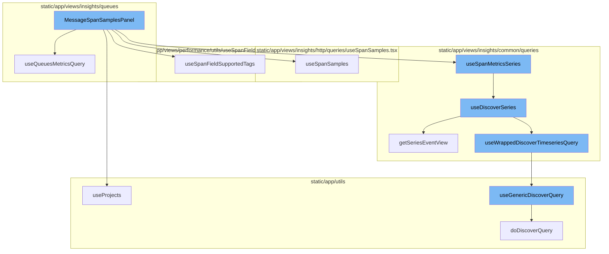
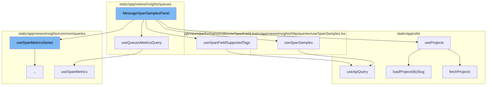
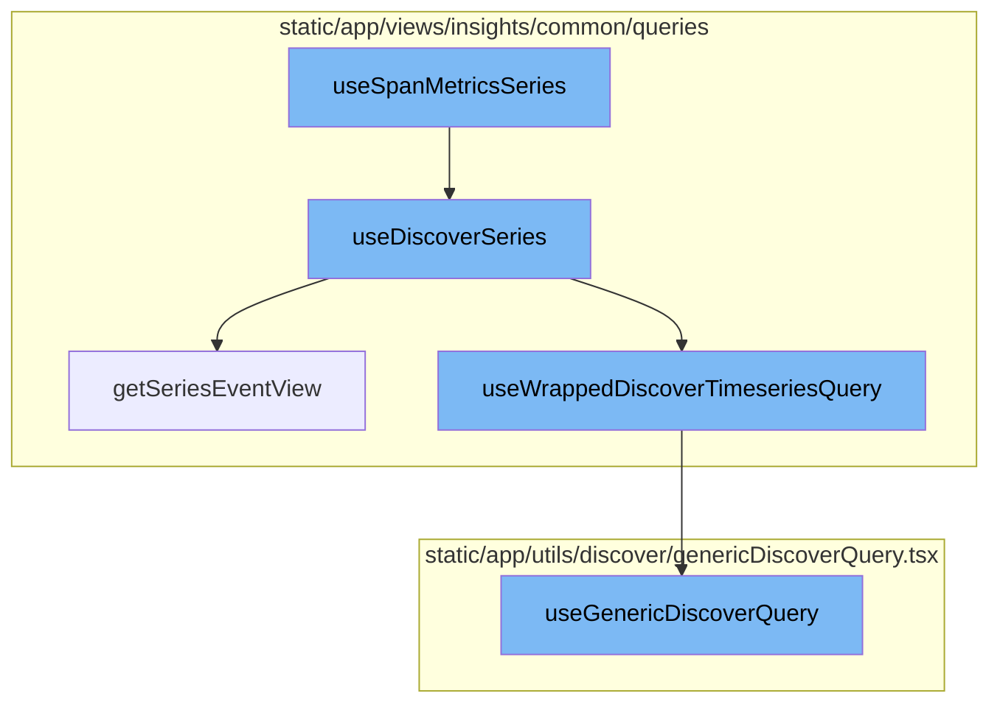

<SwmSnippet path="/static/app/views/insights/queues/components/messageSpanSamplesPanel.tsx" line="57">

---

# MessageSpanSamplesPanel

The `MessageSpanSamplesPanel` function is the main component of the flow. It uses several hooks to fetch and manage data. It also defines several handlers for user interactions such as `handleTraceStatusChange` and `handleRetryCountChange`.

```tsx
export function MessageSpanSamplesPanel() {
  const router = useRouter();
  const location = useLocation();
  const query = useLocationQuery({
    fields: {
      project: decodeScalar,
      destination: decodeScalar,
      transaction: decodeScalar,
      retryCount: decodeRetryCount,
      traceStatus: decodeTraceStatus,
      spanSearchQuery: decodeScalar,
      'span.op': decodeScalar,
    },
  });
  const {projects} = useProjects();
  const {selection} = usePageFilters();
  const supportedTags = useSpanFieldSupportedTags({
    excludedTags: [
      SpanIndexedField.TRACE_STATUS,
      SpanIndexedField.MESSAGING_MESSAGE_RETRY_COUNT,
    ],
```

---

</SwmSnippet>

<SwmSnippet path="/static/app/views/insights/queues/queries/useQueuesMetricsQuery.tsx" line="13">

---

# useQueuesMetricsQuery

`useQueuesMetricsQuery` is a custom hook used by `MessageSpanSamplesPanel` to fetch metrics data related to queues. It uses the `useSpanMetrics` hook to perform the actual data fetching.

```tsx
export function useQueuesMetricsQuery({
  destination,
  transaction,
  enabled,
  referrer,
}: Props) {
  const mutableSearch = new MutableSearch(DEFAULT_QUERY_FILTER);
  if (destination) {
    mutableSearch.addFilterValue('messaging.destination.name', destination);
  }
  if (transaction) {
    mutableSearch.addFilterValue('transaction', transaction);
  }
  const response = useSpanMetrics(
    {
      search: mutableSearch,
      fields: [
        'count()',
        'count_op(queue.publish)',
        'count_op(queue.process)',
        'sum(span.duration)',
```

---

</SwmSnippet>

<SwmSnippet path="/static/app/utils/useProjects.tsx" line="141">

---

# useProjects

`useProjects` is a custom hook used by `MessageSpanSamplesPanel` to fetch and manage project data. It provides a way to select specific project slugs, and search for more projects that may not be in the project store.

```tsx
/**
 * Provides projects from the ProjectsStore
 *
 * This hook also provides a way to select specific project slugs, and search
 * (type-ahead) for more projects that may not be in the project store.
 *
 * NOTE: Currently ALL projects are always loaded, but this hook is designed
 * for future-compat in a world where we do _not_ load all projects.
 */
function useProjects({limit, slugs, orgId: propOrgId}: Options = {}) {
  const api = useApi();

  const organization = useOrganization({allowNull: true});
  const store = useLegacyStore(ProjectsStore);

  const orgId = propOrgId ?? organization?.slug ?? organization?.slug;

  const storeSlugs = new Set(store.projects.map(t => t.slug));
  const slugsToLoad = slugs?.filter(slug => !storeSlugs.has(slug)) ?? [];
  const shouldLoadSlugs = slugsToLoad.length > 0;

```

---

</SwmSnippet>

<SwmSnippet path="/static/app/views/insights/http/queries/useSpanSamples.tsx" line="20">

---

# useSpanSamples

`useSpanSamples` is a custom hook used by `MessageSpanSamplesPanel` to fetch span samples data. It uses the `useApiQuery` hook to perform the actual data fetching.

```tsx
export const useSpanSamples = <Fields extends SpanIndexedField[]>(
  options: UseSpanSamplesOptions<Fields> = {}
) => {
  const {
    fields = [],
    search = undefined,
    referrer,
    enabled,
    min = undefined,
    max = undefined,
  } = options;

  const {selection} = usePageFilters();

  const organization = useOrganization();

  if (defined(min) && min < 0) {
    throw new Error('Minimum must be greater than 0');
  }

  if (defined(min) && defined(max) && min >= max) {
```

---

</SwmSnippet>

<SwmSnippet path="/static/app/views/performance/utils/useSpanFieldSupportedTags.tsx" line="60">

---

# useSpanFieldSupportedTags

`useSpanFieldSupportedTags` is a custom hook used by `MessageSpanSamplesPanel` to fetch and manage supported tags for span fields. It uses the `useApiQuery` hook to perform the actual data fetching.

```tsx
export function useSpanFieldSupportedTags(options?: {
  excludedTags?: string[];
  projects?: PageFilters['projects'];
}): TagCollection {
  const {excludedTags = [], projects} = options || {};
  const {selection} = usePageFilters();
  const organization = useOrganization();
  // we do not yet support span field search by SPAN_AI_PIPELINE_GROUP
  const staticTags = getSpanFieldSupportedTags(
    [SpanIndexedField.SPAN_AI_PIPELINE_GROUP, ...excludedTags],
    DiscoverDatasets.SPANS_INDEXED
  );

  const dynamicTagQuery = useApiQuery<SpanFieldsResponse>(
    getDynamicSpanFieldsEndpoint(
      organization.slug,
      projects ?? selection.projects,
      selection.environments
    ),
    {
      staleTime: 0,
```

---

</SwmSnippet>

<SwmSnippet path="/static/app/utils/queryClient.tsx" line="107">

---

# useApiQuery

`useApiQuery` is a custom hook used by several other hooks in the flow to fetch data from the API. It wraps React Query's `useQuery` for consistent usage in the Sentry app.

```tsx
/**
 * Wraps React Query's useQuery for consistent usage in the Sentry app.
 * Query keys should be an array which include an endpoint URL and options such as query params.
 * This wrapper will execute the request using the query key URL.
 *
 * See https://tanstack.com/query/v4/docs/overview for docs on React Query.
 *
 * Example usage:
 *
 * const {data, isLoading, isError} = useQuery<EventsResponse>(
 *   ['/events', {query: {limit: 50}}],
 *   {staleTime: 0}
 * );
 */
export function useApiQuery<TResponseData, TError = RequestError>(
  queryKey: ApiQueryKey,
  options: UseApiQueryOptions<TResponseData, TError>
): UseApiQueryResult<TResponseData, TError> {
  const api = useApi({persistInFlight: PERSIST_IN_FLIGHT});
  const queryFn = fetchDataQuery(api);

```

---

</SwmSnippet>

<SwmSnippet path="/static/app/views/insights/common/queries/useDiscoverSeries.ts" line="30">

---

# useSpanMetricsSeries

The `useSpanMetricsSeries` function is a hook that wraps around the `useDiscoverSeries` function. It is used to fetch span metrics series data from the Discover datasets. The function takes in options and a referrer as parameters.

```typescript
export const useSpanMetricsSeries = <Fields extends SpanMetricsProperty[]>(
  options: UseMetricsSeriesOptions<Fields> = {},
  referrer: string
) => {
  return useDiscoverSeries<Fields>(options, DiscoverDatasets.SPANS_METRICS, referrer);
};
```

---

</SwmSnippet>

<SwmSnippet path="/static/app/views/insights/common/queries/useDiscoverSeries.ts" line="56">

---

# useDiscoverSeries

The `useDiscoverSeries` function is a hook that fetches metrics series data from the Discover datasets. It takes in options, a dataset, and a referrer as parameters. It uses the `usePageFilters` hook to get page filters, and the `getSeriesEventView` function to get an event view. It then uses the `useWrappedDiscoverTimeseriesQuery` hook to fetch the timeseries data from the Discover datasets.

```typescript
const useDiscoverSeries = <T extends string[]>(
  options: UseMetricsSeriesOptions<T> = {},
  dataset: DiscoverDatasets,
  referrer: string
) => {
  const {search = undefined, yAxis = [], interval = undefined} = options;

  const pageFilters = usePageFilters();

  const eventView = getSeriesEventView(
    search,
    undefined,
    pageFilters.selection,
    yAxis,
    undefined,
    dataset
  );

  if (interval) {
    eventView.interval = interval;
  }
```

---

</SwmSnippet>

<SwmSnippet path="/static/app/views/insights/common/queries/getSeriesEventView.tsx" line="12">

---

# getSeriesEventView

The `getSeriesEventView` function is used to get an event view for a series. It takes in search parameters, fields, page filters, yAxis, top events, and a dataset as parameters. It calculates the interval for the yAxis selection and returns an event view.

```tsx
export function getSeriesEventView(
  search: MutableSearch | undefined,
  fields: string[] = [],
  pageFilters: PageFilters,
  yAxis: string[],
  topEvents?: number,
  dataset?: DiscoverDatasets
) {
  // Pick the highest possible interval for the given yAxis selection. Find the ideal interval for each function, then choose the largest one. This results in the lowest granularity, but best performance.
  const interval = sortBy(
    yAxis.map(yAxisFunctionName => {
      const parseResult = parseFunction(yAxisFunctionName);

      if (!parseResult) {
        return DEFAULT_INTERVAL;
      }

      return getIntervalForMetricFunction(parseResult.name, pageFilters.datetime);
    }),
    result => {
      return intervalToMilliseconds(result);
```

---

</SwmSnippet>

<SwmSnippet path="/static/app/views/insights/common/queries/useSpansQuery.tsx" line="63">

---

# useWrappedDiscoverTimeseriesQuery

The `useWrappedDiscoverTimeseriesQuery` function is a hook that wraps around the `useGenericDiscoverQuery` function. It is used to fetch timeseries data from the Discover datasets. It takes in an event view, enabled flag, initial data, referrer, cursor, and an overridden route as parameters.

```tsx
export function useWrappedDiscoverTimeseriesQuery<T>({
  eventView,
  enabled,
  initialData,
  referrer,
  cursor,
  overriddenRoute,
}: {
  eventView: EventView;
  cursor?: string;
  enabled?: boolean;
  initialData?: any;
  overriddenRoute?: string;
  referrer?: string;
}) {
  const location = useLocation();
  const organization = useOrganization();
  const {isReady: pageFiltersReady} = usePageFilters();
  const result = useGenericDiscoverQuery<
    {
      data: any[];
```

---

</SwmSnippet>

<SwmSnippet path="/static/app/utils/discover/genericDiscoverQuery.tsx" line="419">

---

# useGenericDiscoverQuery

The `useGenericDiscoverQuery` function is a hook that is used to fetch data from the Discover datasets. It takes in props as parameters, which include the orgSlug, route, and options. It uses the `useQuery` hook to fetch the data.

```tsx
export function useGenericDiscoverQuery<T, P>(props: Props<T, P>) {
  const api = useApi();
  const {orgSlug, route, options} = props;
  const url = `/organizations/${orgSlug}/${route}/`;
  const apiPayload = getPayload<T, P>(props);

  const res = useQuery<[T, string | undefined, ResponseMeta<T> | undefined], QueryError>(
    [route, apiPayload],
    ({signal: _signal}) =>
      doDiscoverQuery<T>(api, url, apiPayload, {
        queryBatching: props.queryBatching,
        skipAbort: props.skipAbort,
      }),
    options
  );

  return {
    ...res,
    data: res.data?.[0] ?? undefined,
    error: parseError(res.error),
    statusCode: res.data?.[1] ?? undefined,
```

---

</SwmSnippet>



# Flow drill down

First, we'll zoom into this section of the flow:



<SwmSnippet path="/static/app/views/insights/queues/components/messageSpanSamplesPanel.tsx" line="57">

---

# MessageSpanSamplesPanel

The `MessageSpanSamplesPanel` function is the main component of the flow. It uses several hooks to fetch and manage data. It also defines several handlers for user interactions such as `handleTraceStatusChange` and `handleRetryCountChange`.

```tsx
export function MessageSpanSamplesPanel() {
  const router = useRouter();
  const location = useLocation();
  const query = useLocationQuery({
    fields: {
      project: decodeScalar,
      destination: decodeScalar,
      transaction: decodeScalar,
      retryCount: decodeRetryCount,
      traceStatus: decodeTraceStatus,
      spanSearchQuery: decodeScalar,
      'span.op': decodeScalar,
    },
  });
  const {projects} = useProjects();
  const {selection} = usePageFilters();
  const supportedTags = useSpanFieldSupportedTags({
    excludedTags: [
      SpanIndexedField.TRACE_STATUS,
      SpanIndexedField.MESSAGING_MESSAGE_RETRY_COUNT,
    ],
```

---

</SwmSnippet>

<SwmSnippet path="/static/app/views/insights/queues/queries/useQueuesMetricsQuery.tsx" line="13">

---

# useQueuesMetricsQuery

`useQueuesMetricsQuery` is a custom hook used by `MessageSpanSamplesPanel` to fetch metrics data related to queues. It uses the `useSpanMetrics` hook to perform the actual data fetching.

```tsx
export function useQueuesMetricsQuery({
  destination,
  transaction,
  enabled,
  referrer,
}: Props) {
  const mutableSearch = new MutableSearch(DEFAULT_QUERY_FILTER);
  if (destination) {
    mutableSearch.addFilterValue('messaging.destination.name', destination);
  }
  if (transaction) {
    mutableSearch.addFilterValue('transaction', transaction);
  }
  const response = useSpanMetrics(
    {
      search: mutableSearch,
      fields: [
        'count()',
        'count_op(queue.publish)',
        'count_op(queue.process)',
        'sum(span.duration)',
```

---

</SwmSnippet>

<SwmSnippet path="/static/app/utils/useProjects.tsx" line="141">

---

# useProjects

`useProjects` is a custom hook used by `MessageSpanSamplesPanel` to fetch and manage project data. It provides a way to select specific project slugs, and search for more projects that may not be in the project store.

```tsx
/**
 * Provides projects from the ProjectsStore
 *
 * This hook also provides a way to select specific project slugs, and search
 * (type-ahead) for more projects that may not be in the project store.
 *
 * NOTE: Currently ALL projects are always loaded, but this hook is designed
 * for future-compat in a world where we do _not_ load all projects.
 */
function useProjects({limit, slugs, orgId: propOrgId}: Options = {}) {
  const api = useApi();

  const organization = useOrganization({allowNull: true});
  const store = useLegacyStore(ProjectsStore);

  const orgId = propOrgId ?? organization?.slug ?? organization?.slug;

  const storeSlugs = new Set(store.projects.map(t => t.slug));
  const slugsToLoad = slugs?.filter(slug => !storeSlugs.has(slug)) ?? [];
  const shouldLoadSlugs = slugsToLoad.length > 0;

```

---

</SwmSnippet>

<SwmSnippet path="/static/app/views/insights/http/queries/useSpanSamples.tsx" line="20">

---

# useSpanSamples

`useSpanSamples` is a custom hook used by `MessageSpanSamplesPanel` to fetch span samples data. It uses the `useApiQuery` hook to perform the actual data fetching.

```tsx
export const useSpanSamples = <Fields extends SpanIndexedField[]>(
  options: UseSpanSamplesOptions<Fields> = {}
) => {
  const {
    fields = [],
    search = undefined,
    referrer,
    enabled,
    min = undefined,
    max = undefined,
  } = options;

  const {selection} = usePageFilters();

  const organization = useOrganization();

  if (defined(min) && min < 0) {
    throw new Error('Minimum must be greater than 0');
  }

  if (defined(min) && defined(max) && min >= max) {
```

---

</SwmSnippet>

<SwmSnippet path="/static/app/views/performance/utils/useSpanFieldSupportedTags.tsx" line="60">

---

# useSpanFieldSupportedTags

`useSpanFieldSupportedTags` is a custom hook used by `MessageSpanSamplesPanel` to fetch and manage supported tags for span fields. It uses the `useApiQuery` hook to perform the actual data fetching.

```tsx
export function useSpanFieldSupportedTags(options?: {
  excludedTags?: string[];
  projects?: PageFilters['projects'];
}): TagCollection {
  const {excludedTags = [], projects} = options || {};
  const {selection} = usePageFilters();
  const organization = useOrganization();
  // we do not yet support span field search by SPAN_AI_PIPELINE_GROUP
  const staticTags = getSpanFieldSupportedTags(
    [SpanIndexedField.SPAN_AI_PIPELINE_GROUP, ...excludedTags],
    DiscoverDatasets.SPANS_INDEXED
  );

  const dynamicTagQuery = useApiQuery<SpanFieldsResponse>(
    getDynamicSpanFieldsEndpoint(
      organization.slug,
      projects ?? selection.projects,
      selection.environments
    ),
    {
      staleTime: 0,
```

---

</SwmSnippet>

<SwmSnippet path="/static/app/utils/queryClient.tsx" line="107">

---

# useApiQuery

`useApiQuery` is a custom hook used by several other hooks in the flow to fetch data from the API. It wraps React Query's `useQuery` for consistent usage in the Sentry app.

```tsx
/**
 * Wraps React Query's useQuery for consistent usage in the Sentry app.
 * Query keys should be an array which include an endpoint URL and options such as query params.
 * This wrapper will execute the request using the query key URL.
 *
 * See https://tanstack.com/query/v4/docs/overview for docs on React Query.
 *
 * Example usage:
 *
 * const {data, isLoading, isError} = useQuery<EventsResponse>(
 *   ['/events', {query: {limit: 50}}],
 *   {staleTime: 0}
 * );
 */
export function useApiQuery<TResponseData, TError = RequestError>(
  queryKey: ApiQueryKey,
  options: UseApiQueryOptions<TResponseData, TError>
): UseApiQueryResult<TResponseData, TError> {
  const api = useApi({persistInFlight: PERSIST_IN_FLIGHT});
  const queryFn = fetchDataQuery(api);

```

---

</SwmSnippet>

Now, lets zoom into this section of the flow:



<SwmSnippet path="/static/app/views/insights/common/queries/useDiscoverSeries.ts" line="30">

---

# useSpanMetricsSeries

The `useSpanMetricsSeries` function is a hook that wraps around the `useDiscoverSeries` function. It is used to fetch span metrics series data from the Discover datasets. The function takes in options and a referrer as parameters.

```typescript
export const useSpanMetricsSeries = <Fields extends SpanMetricsProperty[]>(
  options: UseMetricsSeriesOptions<Fields> = {},
  referrer: string
) => {
  return useDiscoverSeries<Fields>(options, DiscoverDatasets.SPANS_METRICS, referrer);
};
```

---

</SwmSnippet>

<SwmSnippet path="/static/app/views/insights/common/queries/useDiscoverSeries.ts" line="56">

---

# useDiscoverSeries

The `useDiscoverSeries` function is a hook that fetches metrics series data from the Discover datasets. It takes in options, a dataset, and a referrer as parameters. It uses the `usePageFilters` hook to get page filters, and the `getSeriesEventView` function to get an event view. It then uses the `useWrappedDiscoverTimeseriesQuery` hook to fetch the timeseries data from the Discover datasets.

```typescript
const useDiscoverSeries = <T extends string[]>(
  options: UseMetricsSeriesOptions<T> = {},
  dataset: DiscoverDatasets,
  referrer: string
) => {
  const {search = undefined, yAxis = [], interval = undefined} = options;

  const pageFilters = usePageFilters();

  const eventView = getSeriesEventView(
    search,
    undefined,
    pageFilters.selection,
    yAxis,
    undefined,
    dataset
  );

  if (interval) {
    eventView.interval = interval;
  }
```

---

</SwmSnippet>

<SwmSnippet path="/static/app/views/insights/common/queries/getSeriesEventView.tsx" line="12">

---

# getSeriesEventView

The `getSeriesEventView` function is used to get an event view for a series. It takes in search parameters, fields, page filters, yAxis, top events, and a dataset as parameters. It calculates the interval for the yAxis selection and returns an event view.

```tsx
export function getSeriesEventView(
  search: MutableSearch | undefined,
  fields: string[] = [],
  pageFilters: PageFilters,
  yAxis: string[],
  topEvents?: number,
  dataset?: DiscoverDatasets
) {
  // Pick the highest possible interval for the given yAxis selection. Find the ideal interval for each function, then choose the largest one. This results in the lowest granularity, but best performance.
  const interval = sortBy(
    yAxis.map(yAxisFunctionName => {
      const parseResult = parseFunction(yAxisFunctionName);

      if (!parseResult) {
        return DEFAULT_INTERVAL;
      }

      return getIntervalForMetricFunction(parseResult.name, pageFilters.datetime);
    }),
    result => {
      return intervalToMilliseconds(result);
```

---

</SwmSnippet>

<SwmSnippet path="/static/app/views/insights/common/queries/useSpansQuery.tsx" line="63">

---

# useWrappedDiscoverTimeseriesQuery

The `useWrappedDiscoverTimeseriesQuery` function is a hook that wraps around the `useGenericDiscoverQuery` function. It is used to fetch timeseries data from the Discover datasets. It takes in an event view, enabled flag, initial data, referrer, cursor, and an overridden route as parameters.

```tsx
export function useWrappedDiscoverTimeseriesQuery<T>({
  eventView,
  enabled,
  initialData,
  referrer,
  cursor,
  overriddenRoute,
}: {
  eventView: EventView;
  cursor?: string;
  enabled?: boolean;
  initialData?: any;
  overriddenRoute?: string;
  referrer?: string;
}) {
  const location = useLocation();
  const organization = useOrganization();
  const {isReady: pageFiltersReady} = usePageFilters();
  const result = useGenericDiscoverQuery<
    {
      data: any[];
```

---

</SwmSnippet>

<SwmSnippet path="/static/app/utils/discover/genericDiscoverQuery.tsx" line="419">

---

# useGenericDiscoverQuery

The `useGenericDiscoverQuery` function is a hook that is used to fetch data from the Discover datasets. It takes in props as parameters, which include the orgSlug, route, and options. It uses the `useQuery` hook to fetch the data.

```tsx
export function useGenericDiscoverQuery<T, P>(props: Props<T, P>) {
  const api = useApi();
  const {orgSlug, route, options} = props;
  const url = `/organizations/${orgSlug}/${route}/`;
  const apiPayload = getPayload<T, P>(props);

  const res = useQuery<[T, string | undefined, ResponseMeta<T> | undefined], QueryError>(
    [route, apiPayload],
    ({signal: _signal}) =>
      doDiscoverQuery<T>(api, url, apiPayload, {
        queryBatching: props.queryBatching,
        skipAbort: props.skipAbort,
      }),
    options
  );

  return {
    ...res,
    data: res.data?.[0] ?? undefined,
    error: parseError(res.error),
    statusCode: res.data?.[1] ?? undefined,
```

---

</SwmSnippet>

&nbsp;

*This is an auto-generated document by Swimm AI 🌊 and has not yet been verified by a human*

<SwmMeta version="3.0.0" repo-id="Z2l0aHViJTNBJTNBc2VudHJ5LWRlbW8lM0ElM0FTd2ltbS1EZW1v" repo-name="sentry-demo" doc-type="flows"><sup>Powered by [Swimm](/)</sup></SwmMeta>
