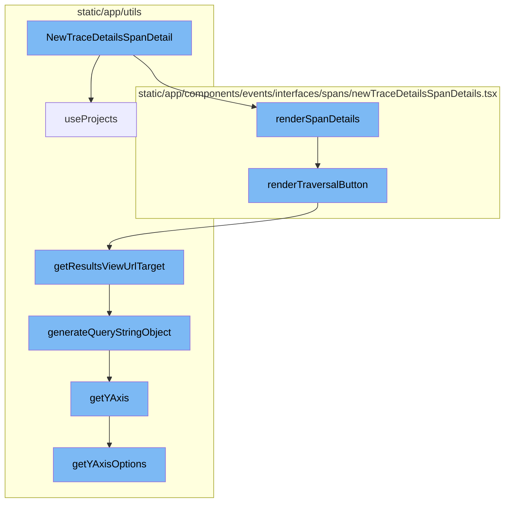
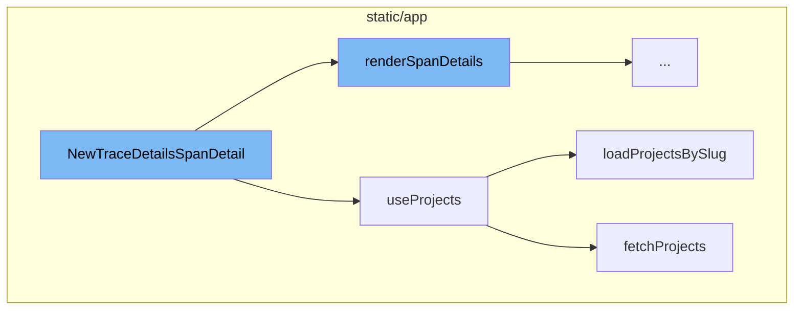
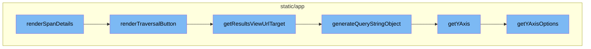

# NewTraceDetailsSpanDetail Overview

NewTraceDetailsSpanDetail is a component that displays the details of a span in a trace. It fetches the necessary project data using the useProjects hook and renders various parts of the span details.

# useProjects Hook

The useProjects hook is used to fetch project data from the ProjectsStore. It provides a way to select specific project slugs and search for more projects that may not be in the project store.

# loadProjectsBySlug Function

The loadProjectsBySlug function is used to load projects by their slugs. It fetches the projects using the fetchProjects function and updates the state and the ProjectsStore with the fetched projects.

# fetchProjects Function

The fetchProjects function is a helper function used to fetch projects. It takes in parameters such as slugs, search, limit, lastSearch, and cursor to customize the fetching process.

# renderSpanDetails Function

The renderSpanDetails function is the starting point of the flow. It is responsible for rendering the details of a span. It checks if the span is a gap span and renders the appropriate details.

# renderTraversalButton Function

The renderTraversalButton function is responsible for rendering a button that allows users to traverse through child transactions of a span. It checks if there are child transactions and creates an EventView object for them.

# getResultsViewUrlTarget Method

The getResultsViewUrlTarget method generates the URL for the results view page. It takes the organization slug and a boolean indicating if it's the homepage as parameters.

# generateQueryStringObject Method

The generateQueryStringObject method generates a query string object based on the properties of the EventView object.

# getYAxis Method

The getYAxis method returns the yAxis value for the EventView object. If the yAxis value is not set, it returns the default option.

# getYAxisOptions Method

The getYAxisOptions method returns an array of yAxis options. It filters out the aggregates that are graphable and maps them to an array of SelectValue objects.



# Flow drill down

First, we'll zoom into this section of the flow:



<SwmSnippet path="/static/app/components/events/interfaces/spans/newTraceDetailsSpanDetails.tsx" line="97">

---

# NewTraceDetailsSpanDetail Function

The `NewTraceDetailsSpanDetail` function is a component that renders the details of a span in a trace. It uses the `useProjects` hook to fetch the projects data and find the project related to the event. It also contains several render functions to display different parts of the span details, such as traversal buttons, child spans, span details actions, orphan span messages, span error messages, and profile messages.

```tsx
function NewTraceDetailsSpanDetail(props: SpanDetailProps) {
  const location = useLocation();
  const profileId = props.event.contexts.profile?.profile_id || '';
  const issues = useMemo(() => {
    return [...props.node.errors, ...props.node.performance_issues];
  }, [props.node.errors, props.node.performance_issues]);

  const {projects} = useProjects();
  const project = projects.find(p => p.id === props.event.projectID);
  const resolvedModule: ModuleName = resolveSpanModule(
    props.node.value.sentry_tags?.op,
    props.node.value.sentry_tags?.category
  );

  function renderTraversalButton(): React.ReactNode {
    if (!props.node.value.childTransactions) {
      // TODO: Amend size to use theme when we eventually refactor LoadingIndicator
      // 12px is consistent with theme.iconSizes['xs'] but theme returns a string.
      return (
        <StyledDiscoverButton size="xs" disabled>
          <StyledLoadingIndicator size={12} />
```

---

</SwmSnippet>

<SwmSnippet path="/static/app/utils/useProjects.tsx" line="141">

---

# useProjects Hook

The `useProjects` hook is used to fetch projects data from the ProjectsStore. It provides a way to select specific project slugs and search for more projects that may not be in the project store. It also includes a function `loadProjectsBySlug` to load projects by their slugs.

```tsx
/**
 * Provides projects from the ProjectsStore
 *
 * This hook also provides a way to select specific project slugs, and search
 * (type-ahead) for more projects that may not be in the project store.
 *
 * NOTE: Currently ALL projects are always loaded, but this hook is designed
 * for future-compat in a world where we do _not_ load all projects.
 */
function useProjects({limit, slugs, orgId: propOrgId}: Options = {}) {
  const api = useApi();

  const organization = useOrganization({allowNull: true});
  const store = useLegacyStore(ProjectsStore);

  const orgId = propOrgId ?? organization?.slug ?? organization?.slug;

  const storeSlugs = new Set(store.projects.map(t => t.slug));
  const slugsToLoad = slugs?.filter(slug => !storeSlugs.has(slug)) ?? [];
  const shouldLoadSlugs = slugsToLoad.length > 0;

```

---

</SwmSnippet>

<SwmSnippet path="/static/app/utils/useProjects.tsx" line="188">

---

# loadProjectsBySlug Function

The `loadProjectsBySlug` function is used to load projects by their slugs. It fetches the projects using the `fetchProjects` function and updates the state and the ProjectsStore with the fetched projects.

```tsx
  async function loadProjectsBySlug() {
    if (orgId === undefined) {
      // eslint-disable-next-line no-console
      console.error('Cannot use useProjects({slugs}) without an organization in context');
      return;
    }

    setState(prev => ({...prev, fetching: true}));
    try {
      const {results, hasMore, nextCursor} = await fetchProjects(api, orgId, {
        slugs: slugsToLoad,
        limit,
      });

      const fetchedProjects = uniqBy([...store.projects, ...results], ({slug}) => slug);
      ProjectsStore.loadInitialData(fetchedProjects);

      setState(prev => ({
        ...prev,
        hasMore,
        fetching: false,
```

---

</SwmSnippet>

<SwmSnippet path="/static/app/utils/useProjects.tsx" line="87">

---

# fetchProjects Function

The `fetchProjects` function is a helper function used to fetch projects. It takes in parameters such as slugs, search, limit, lastSearch, and cursor to customize the fetching process. It returns the fetched projects, a boolean indicating if there are more projects, and the next cursor.

```tsx
/**
 * Helper function to actually load projects
 */
async function fetchProjects(
  api: Client,
  orgId: string,
  {slugs, search, limit, lastSearch, cursor}: FetchProjectsOptions = {}
) {
  const query: {
    collapse: string[];
    all_projects?: number;
    cursor?: typeof cursor;
    per_page?: number;
    query?: string;
  } = {
    // Never return latestDeploys project property from api
    collapse: ['latestDeploys', 'unusedFeatures'],
  };

  if (slugs !== undefined && slugs.length > 0) {
    query.query = slugs.map(slug => `slug:${slug}`).join(' ');
```

---

</SwmSnippet>

Now, lets zoom into this section of the flow:



<SwmSnippet path="/static/app/components/events/interfaces/spans/newTraceDetailsSpanDetails.tsx" line="334">

---

# NewTraceDetailsSpanDetail Flow

The `renderSpanDetails` function is the starting point of the flow. It is responsible for rendering the details of a span. It checks if the span is a gap span and renders the appropriate details. It also calculates various metrics related to the span such as duration, start and end timestamps, and unknown keys.

```tsx
  function renderSpanDetails() {
    const {event, organization} = props;
    const span = props.node.value;

    if (isGapSpan(span)) {
      return (
        <SpanDetails>
          {organization.features.includes('profiling') ? (
            <GapSpanDetails event={event} span={span} resetCellMeasureCache={() => {}} />
          ) : (
            <InlineDocs
              orgSlug={organization.slug}
              platform={event.sdk?.name || ''}
              projectSlug={event?.projectSlug ?? ''}
              resetCellMeasureCache={() => {}}
            />
          )}
        </SpanDetails>
      );
    }

```

---

</SwmSnippet>

<SwmSnippet path="/static/app/components/events/interfaces/spans/newTraceDetailsSpanDetails.tsx" line="111">

---

The `renderTraversalButton` function is called within `renderSpanDetails`. This function is responsible for rendering a button that allows users to traverse through child transactions of a span. It checks if there are child transactions and creates an EventView object for them.

```tsx
  function renderTraversalButton(): React.ReactNode {
    if (!props.node.value.childTransactions) {
      // TODO: Amend size to use theme when we eventually refactor LoadingIndicator
      // 12px is consistent with theme.iconSizes['xs'] but theme returns a string.
      return (
        <StyledDiscoverButton size="xs" disabled>
          <StyledLoadingIndicator size={12} />
        </StyledDiscoverButton>
      );
    }

    if (props.node.value.childTransactions.length <= 0) {
      return null;
    }

    const {trace, event, organization} = props;

    assert(!isGapSpan(props.node.value));

    if (props.node.value.childTransactions.length === 1) {
      // Note: This is rendered by renderSpanChild() as a dedicated row
```

---

</SwmSnippet>

<SwmSnippet path="/static/app/utils/discover/eventView.tsx" line="1190">

---

The `getResultsViewUrlTarget` method is called within `renderTraversalButton`. This method generates the URL for the results view page. It takes the organization slug and a boolean indicating if it's the homepage as parameters.

```tsx
  getResultsViewUrlTarget(
    slug: string,
    isHomepage: boolean = false
  ): {pathname: string; query: Query} {
    const target = isHomepage ? 'homepage' : 'results';
    return {
      pathname: normalizeUrl(`/organizations/${slug}/discover/${target}/`),
      query: this.generateQueryStringObject(),
    };
  }
```

---

</SwmSnippet>

<SwmSnippet path="/static/app/utils/discover/eventView.tsx" line="672">

---

The `generateQueryStringObject` method is called within `getResultsViewUrlTarget`. This method generates a query string object based on the properties of the EventView object.

```tsx
  generateQueryStringObject(): Query {
    const output = {
      id: this.id,
      name: this.name,
      field: this.getFields(),
      widths: this.getWidths(),
      sort: encodeSorts(this.sorts),
      environment: this.environment,
      project: this.project,
      query: this.query,
      yAxis: this.yAxis || this.getYAxis(),
      dataset: this.dataset,
      display: this.display,
      topEvents: this.topEvents,
      interval: this.interval,
    };

    for (const field of EXTERNAL_QUERY_STRING_KEYS) {
      if (this[field]?.length) {
        output[field] = this[field];
      }
```

---

</SwmSnippet>

<SwmSnippet path="/static/app/utils/discover/eventView.tsx" line="1319">

---

The `getYAxis` method is called within `generateQueryStringObject`. This method returns the yAxis value for the EventView object. If the yAxis value is not set, it returns the default option.

```tsx
  getYAxis(): string {
    const yAxisOptions = this.getYAxisOptions();

    const yAxis = this.yAxis;
    const defaultOption = yAxisOptions[0].value;

    if (!yAxis) {
      return defaultOption;
    }

    // ensure current selected yAxis is one of the items in yAxisOptions
    const result = yAxisOptions.findIndex(
      (option: SelectValue<string>) => option.value === yAxis
    );

    if (result >= 0) {
      return typeof yAxis === 'string' ? yAxis : yAxis[0];
    }

    return defaultOption;
  }
```

---

</SwmSnippet>

<SwmSnippet path="/static/app/utils/discover/eventView.tsx" line="1300">

---

The `getYAxisOptions` method is called within `getYAxis`. This method returns an array of yAxis options. It filters out the aggregates that are graphable and maps them to an array of SelectValue objects.

```tsx
  getYAxisOptions(): SelectValue<string>[] {
    // Make option set and add the default options in.
    return uniqBy(
      this.getAggregateFields()
        // Only include aggregates that make sense to be graphable (eg. not string or date)
        .filter(
          (field: Field) =>
            isLegalYAxisType(aggregateOutputType(field.field)) ||
            isAggregateEquation(field.field)
        )
        .map((field: Field) => ({
          label: isEquation(field.field) ? getEquation(field.field) : field.field,
          value: field.field,
        }))
        .concat(CHART_AXIS_OPTIONS),
      'value'
    );
  }
```

---

</SwmSnippet>

&nbsp;

*This is an auto-generated document by Swimm AI 🌊 and has not yet been verified by a human*

<SwmMeta version="3.0.0" repo-id="Z2l0aHViJTNBJTNBc2VudHJ5LWRlbW8lM0ElM0FTd2ltbS1EZW1v" repo-name="sentry-demo" doc-type="flows"><sup>Powered by [Swimm](/)</sup></SwmMeta>
