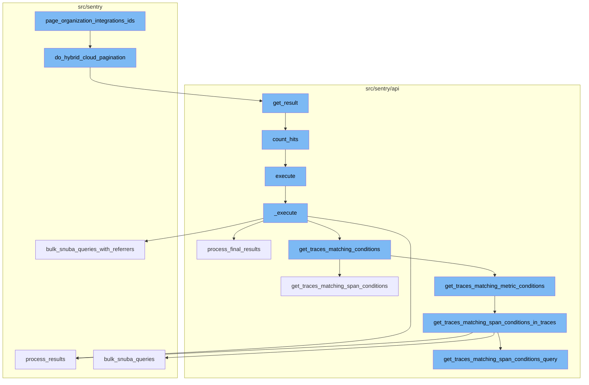
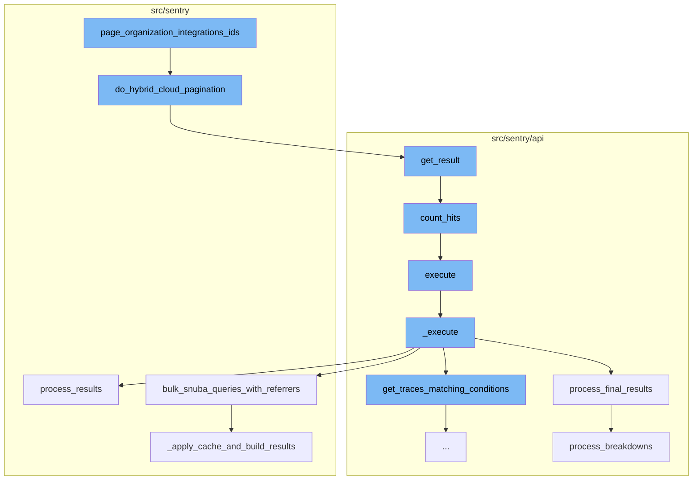
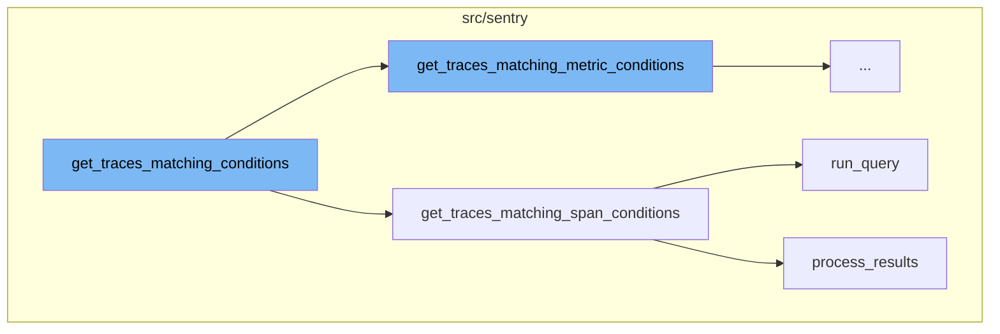
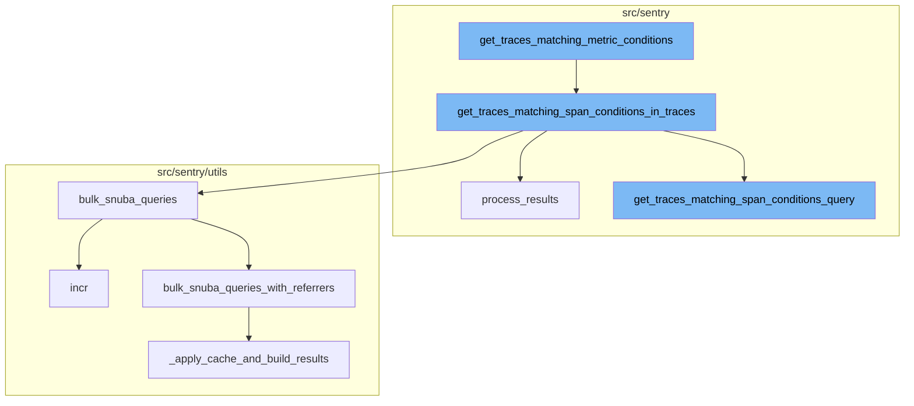

# Overview of page_organization_integrations_ids

The `page_organization_integrations_ids` is a key function in the Sentry application. It is responsible for filtering and paginating the `OrganizationIntegration` objects based on the provided `organization_id` and `statuses`. If a `provider_key` is provided, it further filters the queryset based on it. The function then calls `do_hybrid_cloud_pagination` with the filtered queryset.

# do_hybrid_cloud_pagination

`do_hybrid_cloud_pagination` is responsible for paginating the queryset. It creates a cursor and a paginator, and then returns a `RpcPaginationResult` from the paginator's result.

# get_result

`get_result` is called within `do_hybrid_cloud_pagination`. It builds the queryset based on the cursor value and then counts the hits. It fetches the results from the queryset and builds a cursor from these results.

# count_hits

`count_hits` is used within `get_result` to count the number of hits in the queryset. It executes a raw SQL query to count the hits.

# execute

`execute` is the next step in the flow. It calls the `_execute` function and wraps its result in a dictionary under the `data` key.

# \_execute

`_execute` is responsible for executing the main logic of the flow. It gets the traces matching the conditions, refines the parameters, and then performs a series of queries to get the results. The results are then processed and returned.

# process_final_results

`process_final_results` is called within `_execute`. It processes the results of the queries and returns a list of `TraceResult` objects.

# process_breakdowns

`process_breakdowns` is used within `process_final_results` to process the breakdowns of the traces. It merges intervals, pushes and pops from stacks, and processes the breakdowns.

# get_traces_matching_conditions

The `get_traces_matching_conditions` function is the starting point of the flow. It decides which method to use for fetching traces based on the `mri` attribute. If `mri` is not None, it uses `get_traces_matching_metric_conditions`, otherwise it uses `get_traces_matching_span_conditions`.

# get_traces_matching_span_conditions

The `get_traces_matching_span_conditions` function is responsible for fetching traces that match certain span conditions. It first constructs a query using `get_traces_matching_span_conditions_query`, then runs the query and processes the results. The results are a list of trace IDs and their timestamps.

# run_query

The `run_query` function is used to execute a metrics query in Snuba. It is called within `get_traces_matching_span_conditions` to run the constructed query.

# process_results

The `process_results` function is used to process the results of the query. It translates columns, processes field meta and field results, and handles invalid float values. The processed results are then returned in a structured format.

# get_traces_matching_metric_conditions

The `get_traces_matching_metric_conditions` function is the starting point of the flow. It takes in parameters and snuba parameters, and uses them to create an executor. The executor is then used to get matching traces. If there are user queries, the function further refines the trace ids by applying them, leaving us with only traces where the metric exists and matches the user queries.

# get_traces_matching_span_conditions_in_traces

The `get_traces_matching_span_conditions_in_traces` function is called next. It takes in parameters, snuba parameters, and trace ids. It then divides the trace ids into chunks and for each chunk, it creates a query with conditions and appends it to a list of all queries. These queries are then passed to the `bulk_snuba_queries` function.

# bulk_snuba_queries

The `bulk_snuba_queries` function takes in a list of requests and a referrer. It increments a metric for the referrer and then calls the `bulk_snuba_queries_with_referrers` function with the requests and the referrer.

# get_traces_matching_span_conditions_query

The `get_traces_matching_span_conditions_query` function is called within the `get_traces_matching_span_conditions_in_traces` function. It creates a query based on the user queries and adds conditions to the query. If there are multiple trace conditions, it adds a Boolean condition to the query.

# bulk_snuba_queries_with_referrers

The `bulk_snuba_queries_with_referrers` function takes in a list of requests with referrers. It sets the consistent flag for each request if it is in the override options. It then creates a list of SnubaRequests and passes them to the `_apply_cache_and_build_results` function.

# \_apply_cache_and_build_results

The `_apply_cache_and_build_results` function takes in a sequence of SnubaRequests and a use_cache flag. It checks if the results are in the cache. If they are not, it adds them to a list of queries to be run. It then runs the queries, caches the results if necessary, and returns the results.

# process_results

The `process_results` function is called with the results from the `_apply_cache_and_build_results` function. It processes the results by translating the columns, processing the field meta, and transforming the rows. It then returns the processed data.



# Flow drill down

First, we'll zoom into this section of the flow:



<SwmSnippet path="/src/sentry/integrations/services/integration/impl.py" line="82">

---

# page_organization_integrations_ids

The function `page_organization_integrations_ids` is the starting point of the flow. It filters the `OrganizationIntegration` objects based on the provided `organization_id` and `statuses`. If a `provider_key` is provided, it further filters the queryset based on it. The function then calls `do_hybrid_cloud_pagination` with the filtered queryset.

```python
    def page_organization_integrations_ids(
        self,
        *,
        organization_id: int,
        statuses: list[int],
        provider_key: str | None = None,
        args: RpcPaginationArgs,
    ) -> RpcPaginationResult:
        queryset = OrganizationIntegration.objects.filter(
            organization_id=organization_id,
            status__in=statuses,
        )

        if provider_key:
            queryset = queryset.filter(integration__provider=provider_key.lower())

        return args.do_hybrid_cloud_pagination(
            description="page_organization_integrations_ids",
            paginator_cls=OffsetPaginator,
            order_by="integration__name",
            queryset=queryset,
```

---

</SwmSnippet>

<SwmSnippet path="/src/sentry/hybridcloud/rpc/pagination.py" line="36">

---

## do_hybrid_cloud_pagination

`do_hybrid_cloud_pagination` is responsible for paginating the queryset. It creates a cursor and a paginator, and then returns a `RpcPaginationResult` from the paginator's result.

```python
    def do_hybrid_cloud_pagination(
        self,
        *,
        description: str,
        paginator_cls: type[PaginatorLike],
        order_by: str,
        queryset: Any,
        cursor_cls: type[Cursor] = Cursor,
        count_hits: bool | None = None,
    ) -> "RpcPaginationResult":
        cursor = get_cursor(self.encoded_cursor, cursor_cls)
        with sentry_sdk.start_span(
            op="hybrid_cloud.paginate.get_result",
            description=description,
        ) as span:
            annotate_span_with_pagination_args(span, self.per_page)
            paginator = get_paginator(
                None, paginator_cls, dict(order_by=order_by, queryset=queryset.values("id"))
            )
            extra_args: Any = {}
            if count_hits is not None:
```

---

</SwmSnippet>

<SwmSnippet path="/src/sentry/api/paginator.py" line="136">

---

### get_result

`get_result` is called within `do_hybrid_cloud_pagination`. It builds the queryset based on the cursor value and then counts the hits. It fetches the results from the queryset and builds a cursor from these results.

```python
    def get_result(self, limit=100, cursor=None, count_hits=False, known_hits=None, max_hits=None):
        # cursors are:
        #   (identifier(integer), row offset, is_prev)
        if cursor is None:
            cursor = Cursor(0, 0, 0)

        limit = min(limit, self.max_limit)

        if cursor.value:
            cursor_value = self.value_from_cursor(cursor)
        else:
            cursor_value = 0

        queryset = self.build_queryset(cursor_value, cursor.is_prev)

        # TODO(dcramer): this does not yet work correctly for ``is_prev`` when
        # the key is not unique

        # max_hits can be limited to speed up the query
        if max_hits is None:
            max_hits = MAX_HITS_LIMIT
```

---

</SwmSnippet>

<SwmSnippet path="/src/sentry/api/paginator.py" line="27">

---

#### count_hits

`count_hits` is used within `get_result` to count the number of hits in the queryset. It executes a raw SQL query to count the hits.

```python
def count_hits(queryset, max_hits):
    if not max_hits:
        return 0
    hits_query = queryset.values()[:max_hits].query
    # clear out any select fields (include select_related) and pull just the id
    hits_query.clear_select_clause()
    hits_query.add_fields(["id"])
    hits_query.clear_ordering(force=True, clear_default=True)
    try:
        h_sql, h_params = hits_query.sql_with_params()
    except EmptyResultSet:
        return 0
    cursor = connections[queryset.using_replica().db].cursor()
    cursor.execute(f"SELECT COUNT(*) FROM ({h_sql}) as t", h_params)
    return cursor.fetchone()[0]
```

---

</SwmSnippet>

<SwmSnippet path="/src/sentry/api/endpoints/organization_traces.py" line="339">

---

## execute

`execute` is the next step in the flow. It calls the `_execute` function and wraps its result in a dictionary under the `data` key.

```python
        return cast(ParamsType, all_projects_params), all_projects_snuba_params

    def execute(self, offset: int, limit: int):
        return {"data": self._execute()}
```

---

</SwmSnippet>

<SwmSnippet path="/src/sentry/api/endpoints/organization_traces.py" line="344">

---

### \_execute

`_execute` is responsible for executing the main logic of the flow. It gets the traces matching the conditions, refines the parameters, and then performs a series of queries to get the results. The results are then processed and returned.

```python
    def _execute(self):
        with handle_span_query_errors():
            min_timestamp, max_timestamp, trace_ids = self.get_traces_matching_conditions(
                self.params,
                self.snuba_params,
            )

        self.refine_params(min_timestamp, max_timestamp)

        if not trace_ids:
            return []

        with handle_span_query_errors():
            params, snuba_params = self.params_with_all_projects()

            all_queries = self.get_all_queries(
                params,
                snuba_params,
                trace_ids,
            )

```

---

</SwmSnippet>

<SwmSnippet path="/src/sentry/api/endpoints/organization_traces.py" line="699">

---

#### process_final_results

`process_final_results` is called within `_execute`. It processes the results of the queries and returns a list of `TraceResult` objects.

```python
    def process_final_results(
        self,
        *,
        traces_metas_results,
        traces_errors_results,
        traces_occurrences_results,
        traces_breakdown_projects_results,
    ) -> list[TraceResult]:
        traces_range = {
            row["trace"]: {
                "start": row["first_seen()"],
                "end": row["last_seen()"],
                "slices": self.breakdown_slices,
            }
            for row in traces_metas_results["data"]
        }

        spans = [span for span in traces_breakdown_projects_results["data"]]
        spans.sort(key=lambda span: (span["precise.start_ts"], span["precise.finish_ts"]))

        try:
```

---

</SwmSnippet>

<SwmSnippet path="/src/sentry/api/endpoints/organization_traces.py" line="1288">

---

##### process_breakdowns

`process_breakdowns` is used within `process_final_results` to process the breakdowns of the traces. It merges intervals, pushes and pops from stacks, and processes the breakdowns.

```python
def process_breakdowns(data, traces_range):
    breakdowns: Mapping[str, list[TraceInterval]] = {trace: [] for trace in traces_range}
    stacks: Mapping[str, list[TraceInterval]] = {trace: [] for trace in traces_range}

    def should_merge(interval_a, interval_b):
        return (
            # only merge intervals that have parent spans, i.e. those that aren't the trace root
            not interval_a["isRoot"]
            and not interval_b["isRoot"]
            # only merge intervals that overlap
            and interval_a["end"] >= interval_b["start"]
            # only merge intervals that are part of the same service
            and interval_a["project"] == interval_b["project"]
            and interval_a["sdkName"] == interval_b["sdkName"]
        )

    def breakdown_push(trace, interval):
        breakdown = breakdowns[trace]

        """ TODO: Add this back
        # Find the last interval. If there is an interval on the stack, it
```

---

</SwmSnippet>

Now, lets zoom into this section of the flow:



<SwmSnippet path="/src/sentry/api/endpoints/organization_traces.py" line="415">

---

# get_traces_matching_conditions

The `get_traces_matching_conditions` function is the starting point of the flow. It decides which method to use for fetching traces based on the `mri` attribute. If `mri` is not None, it uses `get_traces_matching_metric_conditions`, otherwise it uses `get_traces_matching_span_conditions`.

```python
    def get_traces_matching_conditions(
        self,
        params: ParamsType,
        snuba_params: SnubaParams,
    ) -> tuple[datetime, datetime, list[str]]:
        if self.mri is not None:
            sentry_sdk.set_tag("mri", self.mri)
            return self.get_traces_matching_metric_conditions(params, snuba_params)

        return self.get_traces_matching_span_conditions(params, snuba_params)
```

---

</SwmSnippet>

<SwmSnippet path="/src/sentry/api/endpoints/organization_traces.py" line="492">

---

# get_traces_matching_span_conditions

The `get_traces_matching_span_conditions` function is responsible for fetching traces that match certain span conditions. It first constructs a query using `get_traces_matching_span_conditions_query`, then runs the query and processes the results. The results are a list of trace IDs and their timestamps.

```python
    def get_traces_matching_span_conditions(
        self,
        params: ParamsType,
        snuba_params: SnubaParams,
        trace_ids: list[str] | None = None,
    ) -> tuple[datetime, datetime, list[str]]:
        query, timestamp_column = self.get_traces_matching_span_conditions_query(
            params,
            snuba_params,
        )

        results = query.run_query(
            referrer=Referrer.API_TRACE_EXPLORER_SPANS_LIST.value,
        )
        results = query.process_results(results)

        matching_trace_ids: list[str] = []
        min_timestamp = self.snuba_params.end
        max_timestamp = self.snuba_params.start
        assert min_timestamp is not None
        assert max_timestamp is not None
```

---

</SwmSnippet>

<SwmSnippet path="/src/sentry/snuba/metrics_layer/query.py" line="143">

---

# run_query

The `run_query` function is used to execute a metrics query in Snuba. It is called within `get_traces_matching_span_conditions` to run the constructed query.

```python
def run_query(request: Request) -> Mapping[str, Any]:
    """
    Entrypoint for executing a metrics query in Snuba.
    """
    return bulk_run_query([request])[0]
```

---

</SwmSnippet>

<SwmSnippet path="/src/sentry/search/events/builder/base.py" line="1516">

---

# process_results

The `process_results` function is used to process the results of the query. It translates columns, processes field meta and field results, and handles invalid float values. The processed results are then returned in a structured format.

```python
    def process_results(self, results: Any) -> EventsResponse:
        with sentry_sdk.start_span(op="QueryBuilder", description="process_results") as span:
            span.set_data("result_count", len(results.get("data", [])))
            translated_columns = {}
            if self.builder_config.transform_alias_to_input_format:
                translated_columns = {
                    column: function_details.field
                    for column, function_details in self.function_alias_map.items()
                }

                for column in list(self.function_alias_map):
                    translated_column = translated_columns.get(column, column)
                    if translated_column in self.function_alias_map:
                        continue
                    function_alias = self.function_alias_map.get(column)
                    if function_alias is not None:
                        self.function_alias_map[translated_column] = function_alias

                if self.raw_equations:
                    for index, equation in enumerate(self.raw_equations):
                        translated_columns[f"equation[{index}]"] = f"equation|{equation}"
```

---

</SwmSnippet>

Now, lets zoom into this section of the flow:



<SwmSnippet path="/src/sentry/api/endpoints/organization_traces.py" line="426">

---

# get_traces_matching_metric_conditions

The `get_traces_matching_metric_conditions` function is the starting point of the flow. It takes in parameters and snuba parameters, and uses them to create an executor. The executor is then used to get matching traces. If there are user queries, the function further refines the trace ids by applying them, leaving us with only traces where the metric exists and matches the user queries.

```python
    def get_traces_matching_metric_conditions(
        self,
        params: ParamsType,
        snuba_params: SnubaParams,
    ) -> tuple[datetime, datetime, list[str]]:
        assert self.mri is not None

        executor_cls = get_sample_list_executor_cls(self.mri)
        if executor_cls is None:
            raise ParseError(detail=f"Unsupported MRI: {self.mri}")

        executor = executor_cls(
            mri=self.mri,
            params=params,
            snuba_params=snuba_params,
            fields=["trace"],
            max=self.metrics_max,
            min=self.metrics_min,
            operation=self.metrics_operation,
            query=self.metrics_query,
            referrer=Referrer.API_TRACE_EXPLORER_METRICS_SPANS_LIST,
```

---

</SwmSnippet>

<SwmSnippet path="/src/sentry/api/endpoints/organization_traces.py" line="526">

---

# get_traces_matching_span_conditions_in_traces

The `get_traces_matching_span_conditions_in_traces` function is called next. It takes in parameters, snuba parameters, and trace ids. It then divides the trace ids into chunks and for each chunk, it creates a query with conditions and appends it to a list of all queries. These queries are then passed to the `bulk_snuba_queries` function.

```python
    def get_traces_matching_span_conditions_in_traces(
        self,
        params: ParamsType,
        snuba_params: SnubaParams,
        trace_ids: list[str],
    ) -> tuple[datetime, datetime, list[str]]:
        all_queries: list[BaseQueryBuilder] = []
        timestamp_column: str | None = None

        # Putting all the trace ids into a single query will likely encounter the
        # max query size limit in ClickHouse. This tries to spread the trace ids
        # out evenly across N queries up to some limit per query.
        max_trace_ids_per_chunk = options.get(
            "performance.traces.trace-explorer-max-trace-ids-per-chunk"
        )
        num_chunks = math.ceil(len(trace_ids) / max_trace_ids_per_chunk)
        chunk_size = math.ceil(len(trace_ids) / num_chunks)

        for chunk in chunked(trace_ids, chunk_size):
            query, timestamp_column = self.get_traces_matching_span_conditions_query(
                params,
```

---

</SwmSnippet>

<SwmSnippet path="/src/sentry/utils/snuba.py" line="900">

---

# bulk_snuba_queries

The `bulk_snuba_queries` function takes in a list of requests and a referrer. It increments a metric for the referrer and then calls the `bulk_snuba_queries_with_referrers` function with the requests and the referrer.

```python
def bulk_snuba_queries(
    requests: list[Request],
    referrer: str | None = None,
    use_cache: bool = False,
    query_source: (
        QuerySource | None
    ) = None,  # TODO: @athena Make this field required after updated all the callsites
) -> ResultSet:
    """
    Alias for `bulk_snuba_queries_with_referrers` that uses the same referrer for every request.
    """

    metrics.incr("snql.sdk.api", tags={"referrer": referrer or "unknown"})

    return bulk_snuba_queries_with_referrers(
        [(request, referrer) for request in requests],
        use_cache=use_cache,
        query_source=query_source,
    )
```

---

</SwmSnippet>

<SwmSnippet path="/src/sentry/api/endpoints/organization_traces.py" line="584">

---

# get_traces_matching_span_conditions_query

The `get_traces_matching_span_conditions_query` function is called within the `get_traces_matching_span_conditions_in_traces` function. It creates a query based on the user queries and adds conditions to the query. If there are multiple trace conditions, it adds a Boolean condition to the query.

```python
    def get_traces_matching_span_conditions_query(
        self,
        params: ParamsType,
        snuba_params: SnubaParams,
        sort: str | None = None,
    ) -> tuple[BaseQueryBuilder, str]:
        if len(self.user_queries) < 2:
            timestamp_column = "timestamp"
        else:
            timestamp_column = "min(timestamp)"

        if sort == "-timestamp":
            orderby = [f"-{timestamp_column}"]
        else:
            # The orderby is intentionally `None` here as this query is much faster
            # if we let Clickhouse decide which order to return the results in.
            # This also means we cannot order by any columns or paginate.
            orderby = None

        if len(self.user_queries) < 2:
            # Optimization: If there is only a condition for a single span,
```

---

</SwmSnippet>

<SwmSnippet path="/src/sentry/utils/snuba.py" line="921">

---

# bulk_snuba_queries_with_referrers

The `bulk_snuba_queries_with_referrers` function takes in a list of requests with referrers. It sets the consistent flag for each request if it is in the override options. It then creates a list of SnubaRequests and passes them to the `_apply_cache_and_build_results` function.

```python
def bulk_snuba_queries_with_referrers(
    requests_with_referrers: list[tuple[Request, str | None]],
    use_cache: bool = False,
    query_source: (
        QuerySource | None
    ) = None,  # TODO: @athena Make this field required after updated all the callsites
) -> ResultSet:
    """
    The main entrypoint to running queries in Snuba. This function accepts
    Requests for either MQL or SnQL queries and runs them on the appropriate endpoint.

    Every request is paired with a referrer to be used for that request.
    """

    if "consistent" in OVERRIDE_OPTIONS:
        for request, _ in requests_with_referrers:
            request.flags.consistent = OVERRIDE_OPTIONS["consistent"]

    for request, referrer in requests_with_referrers:
        if referrer or query_source:
            request.tenant_ids = request.tenant_ids or dict()
```

---

</SwmSnippet>

<SwmSnippet path="/src/sentry/utils/snuba.py" line="993">

---

# \_apply_cache_and_build_results

The `_apply_cache_and_build_results` function takes in a sequence of SnubaRequests and a use_cache flag. It checks if the results are in the cache. If they are not, it adds them to a list of queries to be run. It then runs the queries, caches the results if necessary, and returns the results.

```python
def _apply_cache_and_build_results(
    snuba_requests: Sequence[SnubaRequest],
    use_cache: bool | None = False,
) -> ResultSet:
    parent_api: str = "<missing>"
    scope = sentry_sdk.Scope.get_current_scope()
    if scope.transaction:
        parent_api = scope.transaction.name

    # Store the original position of the query so that we can maintain the order
    snuba_requests_list: list[tuple[int, SnubaRequest]] = []
    for i, snuba_request in enumerate(snuba_requests):
        snuba_request.request.parent_api = parent_api
        snuba_requests_list.append((i, snuba_request))

    results = []

    to_query: list[tuple[int, SnubaRequest, str | None]] = []

    if use_cache:
        cache_keys = [
```

---

</SwmSnippet>

<SwmSnippet path="/src/sentry/search/events/builder/base.py" line="1516">

---

# process_results

The `process_results` function is called with the results from the `_apply_cache_and_build_results` function. It processes the results by translating the columns, processing the field meta, and transforming the rows. It then returns the processed data.

```python
    def process_results(self, results: Any) -> EventsResponse:
        with sentry_sdk.start_span(op="QueryBuilder", description="process_results") as span:
            span.set_data("result_count", len(results.get("data", [])))
            translated_columns = {}
            if self.builder_config.transform_alias_to_input_format:
                translated_columns = {
                    column: function_details.field
                    for column, function_details in self.function_alias_map.items()
                }

                for column in list(self.function_alias_map):
                    translated_column = translated_columns.get(column, column)
                    if translated_column in self.function_alias_map:
                        continue
                    function_alias = self.function_alias_map.get(column)
                    if function_alias is not None:
                        self.function_alias_map[translated_column] = function_alias

                if self.raw_equations:
                    for index, equation in enumerate(self.raw_equations):
                        translated_columns[f"equation[{index}]"] = f"equation|{equation}"
```

---

</SwmSnippet>

&nbsp;

*This is an auto-generated document by Swimm AI 🌊 and has not yet been verified by a human*

<SwmMeta version="3.0.0" repo-id="Z2l0aHViJTNBJTNBc2VudHJ5LWRlbW8lM0ElM0FTd2ltbS1EZW1v" repo-name="sentry-demo" doc-type="flows"><sup>Powered by [Swimm](/)</sup></SwmMeta>
