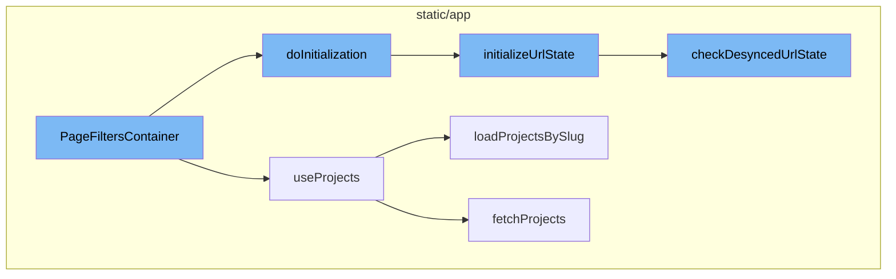

<SwmSnippet path="/static/app/components/organizations/pageFilters/container.tsx" line="53">

---

# PageFiltersContainer

The `PageFiltersContainer` is a component that manages the initialization of page filters for the content it wraps. It ensures that the children components are not rendered until the filters are ready. It utilizes various hooks and properties to manage the state of the page filters, including projects and environments. It also takes care of initializing the GlobalSelectionHeader, which loads the project/environment from local storage when pinned, or populates with defaults.

```tsx
/**
 * The page filters container handles initialization of page filters for the
 * wrapped content. Children will not be rendered until the filters are ready.
 */
function PageFiltersContainer({
  skipLoadLastUsed,
  skipLoadLastUsedEnvironment,
  children,
  ...props
}: Props) {
  const {
    forceProject,
    defaultSelection,
    showAbsolute,
    shouldForceProject,
    specificProjectSlugs,
    skipInitializeUrlParams,
    disablePersistence,
    storageNamespace,
  } = props;
  const router = useRouter();
```

---

</SwmSnippet>

<SwmSnippet path="/static/app/utils/useProjects.tsx" line="141">

---

# useProjects

`useProjects` is a hook that provides projects from the ProjectsStore. It also provides a way to select specific project slugs, and search (type-ahead) for more projects that may not be in the project store. It fetches projects by slug if necessary and handles search functionality.

```tsx
/**
 * Provides projects from the ProjectsStore
 *
 * This hook also provides a way to select specific project slugs, and search
 * (type-ahead) for more projects that may not be in the project store.
 *
 * NOTE: Currently ALL projects are always loaded, but this hook is designed
 * for future-compat in a world where we do _not_ load all projects.
 */
function useProjects({limit, slugs, orgId: propOrgId}: Options = {}) {
  const api = useApi();

  const organization = useOrganization({allowNull: true});
  const store = useLegacyStore(ProjectsStore);

  const orgId = propOrgId ?? organization?.slug ?? organization?.slug;

  const storeSlugs = new Set(store.projects.map(t => t.slug));
  const slugsToLoad = slugs?.filter(slug => !storeSlugs.has(slug)) ?? [];
  const shouldLoadSlugs = slugsToLoad.length > 0;

```

---

</SwmSnippet>

<SwmSnippet path="/static/app/components/organizations/pageFilters/container.tsx" line="95">

---

# doInitialization

`doInitialization` is a function that calls `initializeUrlState` with a set of parameters derived from the component's props and state. This function is used to initialize the URL state based on the current state of the page filters.

```tsx
  const doInitialization = () => {
    initializeUrlState({
      organization,
      queryParams: location.query,
      router,
      skipLoadLastUsed,
      skipLoadLastUsedEnvironment,
      memberProjects,
      nonMemberProjects,
      defaultSelection,
      forceProject,
      shouldForceProject,
      shouldEnforceSingleProject: enforceSingleProject,
      shouldPersist: !disablePersistence,
      showAbsolute,
      skipInitializeUrlParams,
      storageNamespace,
    });
  };
```

---

</SwmSnippet>

<SwmSnippet path="/static/app/actionCreators/pageFilters.tsx" line="158">

---

# initializeUrlState

`initializeUrlState` is a function that initializes the URL state based on the provided parameters. It validates the project ID and environment, checks if the URL state has changed in synchronization from the local storage state, and persists that check into the store. It also updates the URL parameters if necessary.

```tsx
export function initializeUrlState({
  organization,
  queryParams,
  router,
  memberProjects,
  nonMemberProjects,
  skipLoadLastUsed,
  skipLoadLastUsedEnvironment,
  shouldPersist = true,
  shouldForceProject,
  shouldEnforceSingleProject,
  defaultSelection,
  forceProject,
  showAbsolute = true,
  skipInitializeUrlParams = false,
  storageNamespace,
}: InitializeUrlStateParams) {
  const orgSlug = organization.slug;

  const parsed = getStateFromQuery(queryParams, {
    allowAbsoluteDatetime: showAbsolute,
```

---

</SwmSnippet>

<SwmSnippet path="/static/app/actionCreators/pageFilters.tsx" line="504">

---

# checkDesyncedUrlState

`checkDesyncedUrlState` is a function that checks if the URL state has changed in synchronization from the local storage state, and persists that check into the store. It compares the current query parameters with the stored page filters and updates the desynced filters in the PageFiltersStore.

```tsx
/**
 * Checks if the URL state has changed in synchronization from the local
 * storage state, and persists that check into the store.
 *
 * If shouldForceProject is enabled, then we do not record any url desync
 * for the project.
 */
async function checkDesyncedUrlState(router?: Router, shouldForceProject?: boolean) {
  // Cannot compare URL state without the router
  if (!router || !PageFiltersStore.getState().shouldPersist) {
    return;
  }

  const {query} = router.location;

  // XXX(epurkhiser): Since this is called immediately after updating the
  // store, wait for a tick since stores are not updated fully synchronously.
  // This function *should* be called only after persistPageFilters has been
  // called as well This function *should* be called only after
  // persistPageFilters has been called as well
  await new Promise(resolve => window.setTimeout(resolve, 0));
```

---

</SwmSnippet>



# Flow drill down


<SwmSnippet path="/static/app/components/organizations/pageFilters/container.tsx" line="53">

---

# PageFiltersContainer

The `PageFiltersContainer` function is a component that handles the initialization of page filters for the wrapped content. It does not render children until the filters are ready. It uses various hooks and properties to manage the state of the page filters, including projects and environments. It also handles the initialization of the GlobalSelectionHeader, which loads the project/environment from local storage when pinned, or populates with defaults.

```tsx
/**
 * The page filters container handles initialization of page filters for the
 * wrapped content. Children will not be rendered until the filters are ready.
 */
function PageFiltersContainer({
  skipLoadLastUsed,
  skipLoadLastUsedEnvironment,
  children,
  ...props
}: Props) {
  const {
    forceProject,
    defaultSelection,
    showAbsolute,
    shouldForceProject,
    specificProjectSlugs,
    skipInitializeUrlParams,
    disablePersistence,
    storageNamespace,
  } = props;
  const router = useRouter();
```

---

</SwmSnippet>

<SwmSnippet path="/static/app/utils/useProjects.tsx" line="141">

---

# useProjects

`useProjects` is a hook that provides projects from the ProjectsStore. It also provides a way to select specific project slugs, and search (type-ahead) for more projects that may not be in the project store. It fetches projects by slug if necessary and handles search functionality.

```tsx
/**
 * Provides projects from the ProjectsStore
 *
 * This hook also provides a way to select specific project slugs, and search
 * (type-ahead) for more projects that may not be in the project store.
 *
 * NOTE: Currently ALL projects are always loaded, but this hook is designed
 * for future-compat in a world where we do _not_ load all projects.
 */
function useProjects({limit, slugs, orgId: propOrgId}: Options = {}) {
  const api = useApi();

  const organization = useOrganization({allowNull: true});
  const store = useLegacyStore(ProjectsStore);

  const orgId = propOrgId ?? organization?.slug ?? organization?.slug;

  const storeSlugs = new Set(store.projects.map(t => t.slug));
  const slugsToLoad = slugs?.filter(slug => !storeSlugs.has(slug)) ?? [];
  const shouldLoadSlugs = slugsToLoad.length > 0;

```

---

</SwmSnippet>

<SwmSnippet path="/static/app/components/organizations/pageFilters/container.tsx" line="95">

---

# doInitialization

`doInitialization` is a function that calls `initializeUrlState` with a set of parameters derived from the component's props and state. This function is used to initialize the URL state based on the current state of the page filters.

```tsx
  const doInitialization = () => {
    initializeUrlState({
      organization,
      queryParams: location.query,
      router,
      skipLoadLastUsed,
      skipLoadLastUsedEnvironment,
      memberProjects,
      nonMemberProjects,
      defaultSelection,
      forceProject,
      shouldForceProject,
      shouldEnforceSingleProject: enforceSingleProject,
      shouldPersist: !disablePersistence,
      showAbsolute,
      skipInitializeUrlParams,
      storageNamespace,
    });
  };
```

---

</SwmSnippet>

<SwmSnippet path="/static/app/actionCreators/pageFilters.tsx" line="158">

---

# initializeUrlState

`initializeUrlState` is a function that initializes the URL state based on the provided parameters. It validates the project ID and environment, checks if the URL state has changed in synchronization from the local storage state, and persists that check into the store. It also updates the URL parameters if necessary.

```tsx
export function initializeUrlState({
  organization,
  queryParams,
  router,
  memberProjects,
  nonMemberProjects,
  skipLoadLastUsed,
  skipLoadLastUsedEnvironment,
  shouldPersist = true,
  shouldForceProject,
  shouldEnforceSingleProject,
  defaultSelection,
  forceProject,
  showAbsolute = true,
  skipInitializeUrlParams = false,
  storageNamespace,
}: InitializeUrlStateParams) {
  const orgSlug = organization.slug;

  const parsed = getStateFromQuery(queryParams, {
    allowAbsoluteDatetime: showAbsolute,
```

---

</SwmSnippet>

<SwmSnippet path="/static/app/actionCreators/pageFilters.tsx" line="504">

---

# checkDesyncedUrlState

`checkDesyncedUrlState` is a function that checks if the URL state has changed in synchronization from the local storage state, and persists that check into the store. It compares the current query parameters with the stored page filters and updates the desynced filters in the PageFiltersStore.

```tsx
/**
 * Checks if the URL state has changed in synchronization from the local
 * storage state, and persists that check into the store.
 *
 * If shouldForceProject is enabled, then we do not record any url desync
 * for the project.
 */
async function checkDesyncedUrlState(router?: Router, shouldForceProject?: boolean) {
  // Cannot compare URL state without the router
  if (!router || !PageFiltersStore.getState().shouldPersist) {
    return;
  }

  const {query} = router.location;

  // XXX(epurkhiser): Since this is called immediately after updating the
  // store, wait for a tick since stores are not updated fully synchronously.
  // This function *should* be called only after persistPageFilters has been
  // called as well This function *should* be called only after
  // persistPageFilters has been called as well
  await new Promise(resolve => window.setTimeout(resolve, 0));
```

---

</SwmSnippet>

&nbsp;

*This is an auto-generated document by Swimm AI 🌊 and has not yet been verified by a human*

<SwmMeta version="3.0.0" repo-id="Z2l0aHViJTNBJTNBc2VudHJ5LWRlbW8lM0ElM0FTd2ltbS1EZW1v" repo-name="sentry-demo" doc-type="flows"><sup>Powered by [Swimm](/)</sup></SwmMeta>
