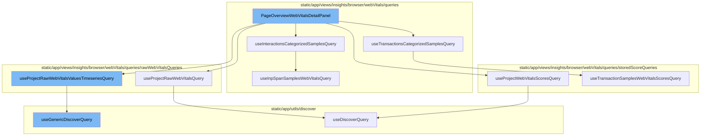

<SwmSnippet path="/static/app/views/insights/browser/webVitals/components/pageOverviewWebVitalsDetailPanel.tsx" line="78">

---

# PageOverviewWebVitalsDetailPanel

The `PageOverviewWebVitalsDetailPanel` function is a component that provides an overview of web vitals details. It uses several hooks and queries to fetch and process the necessary data. It also contains logic for rendering different parts of the UI based on the fetched data.

```tsx
export function PageOverviewWebVitalsDetailPanel({
  webVital,
  onClose,
}: {
  onClose: () => void;
  webVital: WebVitals | null;
}) {
  const location = useLocation();
  const {projects} = useProjects();
  const organization = useOrganization();
  const routes = useRoutes();
  const {replayExists} = useReplayExists();

  const browserTypes = decodeBrowserTypes(location.query[SpanIndexedField.BROWSER_NAME]);
  const isInp = webVital === 'inp';

  const replayLinkGenerator = generateReplayLink(routes);

  const project = useMemo(
    () => projects.find(p => p.id === String(location.query.project)),
    [projects, location.query.project]
```

---

</SwmSnippet>

<SwmSnippet path="/static/app/views/insights/browser/webVitals/queries/useTransactionsCategorizedSamplesQuery.tsx" line="19">

---

# useTransactionsCategorizedSamplesQuery

The `useTransactionsCategorizedSamplesQuery` function is a custom hook that fetches categorized samples of transactions. It uses the `useTransactionSamplesWebVitalsScoresQuery` to fetch data for good, meh, and poor transactions based on the web vital score.

```tsx
export function useTransactionsCategorizedSamplesQuery({
  transaction,
  webVital,
  enabled,
  browserTypes,
}: Props) {
  const {data: goodData, isLoading: isGoodTransactionWebVitalsQueryLoading} =
    useTransactionSamplesWebVitalsScoresQuery({
      limit: 3,
      transaction: transaction ?? '',
      query: webVital
        ? `measurements.${webVital}:<${PERFORMANCE_SCORE_P90S[webVital]}`
        : undefined,
      enabled,
      withProfiles: true,
      sortName: 'webVitalSort',
      webVital: webVital ?? undefined,
      browserTypes,
    });

  const {data: mehData, isLoading: isMehTransactionWebVitalsQueryLoading} =
```

---

</SwmSnippet>

<SwmSnippet path="/static/app/views/insights/browser/webVitals/queries/storedScoreQueries/useProjectWebVitalsScoresQuery.tsx" line="24">

---

# useProjectWebVitalsScoresQuery

The `useProjectWebVitalsScoresQuery` function is a custom hook that fetches web vitals scores for a project. It constructs a query based on the provided parameters and uses the `useDiscoverQuery` to fetch the data.

```tsx
export const useProjectWebVitalsScoresQuery = ({
  transaction,
  tag,
  dataset,
  enabled = true,
  weightWebVital = 'total',
  browserTypes,
}: Props = {}) => {
  const organization = useOrganization();
  const pageFilters = usePageFilters();
  const location = useLocation();
  const shouldUseStaticWeights = useStaticWeightsSetting();

  const search = new MutableSearch([]);
  if (transaction) {
    search.addFilterValue('transaction', transaction);
  }
  if (tag) {
    search.addFilterValue(tag.key, tag.name);
  }
  if (browserTypes) {
```

---

</SwmSnippet>

<SwmSnippet path="/static/app/views/insights/browser/webVitals/queries/rawWebVitalsQueries/useProjectRawWebVitalsQuery.tsx" line="20">

---

# useProjectRawWebVitalsQuery

The `useProjectRawWebVitalsQuery` function is a custom hook that fetches raw web vitals data for a project. It constructs a query based on the provided parameters and uses the `useDiscoverQuery` to fetch the data.

```tsx
export const useProjectRawWebVitalsQuery = ({
  transaction,
  tag,
  dataset,
  browserTypes,
}: Props = {}) => {
  const organization = useOrganization();
  const pageFilters = usePageFilters();
  const location = useLocation();
  const search = new MutableSearch([]);
  if (transaction) {
    search.addFilterValue('transaction', transaction);
  }
  if (tag) {
    search.addFilterValue(tag.key, tag.name);
  }
  if (browserTypes) {
    search.addDisjunctionFilterValues(SpanIndexedField.BROWSER_NAME, browserTypes);
  }

  const projectEventView = EventView.fromNewQueryWithPageFilters(
```

---

</SwmSnippet>

<SwmSnippet path="/static/app/views/insights/browser/webVitals/queries/useInteractionsCategorizedSamplesQuery.tsx" line="15">

---

# useInteractionsCategorizedSamplesQuery

The `useInteractionsCategorizedSamplesQuery` function is a custom hook that fetches categorized samples of interactions. It uses the `useInpSpanSamplesWebVitalsQuery` to fetch data for good, meh, and poor interactions based on the web vital score.

```tsx
export function useInteractionsCategorizedSamplesQuery({
  transaction,
  enabled,
  browserTypes,
}: Props) {
  const {data: goodData, isFetching: isGoodDataLoading} = useInpSpanSamplesWebVitalsQuery(
    {
      transaction,
      enabled,
      limit: 3,
      filters: {
        'measurements.inp': `<${PERFORMANCE_SCORE_P90S.inp}`,
      },
      browserTypes,
    }
  );
  const {data: mehData, isFetching: isMehDataLoading} = useInpSpanSamplesWebVitalsQuery({
    transaction,
    enabled,
    limit: 3,
    filters: {
```

---

</SwmSnippet>

<SwmSnippet path="/static/app/views/insights/browser/webVitals/queries/rawWebVitalsQueries/useProjectRawWebVitalsValuesTimeseriesQuery.tsx" line="23">

---

# useProjectRawWebVitalsValuesTimeseriesQuery

The `useProjectRawWebVitalsValuesTimeseriesQuery` function is a custom hook that fetches raw web vitals data for a project in a timeseries format. It constructs a query based on the provided parameters and uses the `useGenericDiscoverQuery` to fetch the data.

```tsx
export const useProjectRawWebVitalsValuesTimeseriesQuery = ({
  transaction,
  datetime,
  browserTypes,
}: Props) => {
  const pageFilters = usePageFilters();
  const location = useLocation();
  const organization = useOrganization();
  const search = new MutableSearch([]);
  if (transaction) {
    search.addFilterValue('transaction', transaction);
  }
  if (browserTypes) {
    search.addDisjunctionFilterValues(SpanIndexedField.BROWSER_NAME, browserTypes);
  }
  const projectTimeSeriesEventView = EventView.fromNewQueryWithPageFilters(
    {
      yAxis: [
        'p75(measurements.lcp)',
        'p75(measurements.fcp)',
        'p75(measurements.cls)',
```

---

</SwmSnippet>

<SwmSnippet path="/static/app/utils/discover/genericDiscoverQuery.tsx" line="419">

---

# useGenericDiscoverQuery

The `useGenericDiscoverQuery` function is a generic hook for making discover queries. It takes in a set of properties and uses the `useQuery` hook from the `react-query` library to fetch the data.

```tsx
export function useGenericDiscoverQuery<T, P>(props: Props<T, P>) {
  const api = useApi();
  const {orgSlug, route, options} = props;
  const url = `/organizations/${orgSlug}/${route}/`;
  const apiPayload = getPayload<T, P>(props);

  const res = useQuery<[T, string | undefined, ResponseMeta<T> | undefined], QueryError>(
    [route, apiPayload],
    ({signal: _signal}) =>
      doDiscoverQuery<T>(api, url, apiPayload, {
        queryBatching: props.queryBatching,
        skipAbort: props.skipAbort,
      }),
    options
  );

  return {
    ...res,
    data: res.data?.[0] ?? undefined,
    error: parseError(res.error),
    statusCode: res.data?.[1] ?? undefined,
```

---

</SwmSnippet>



# Flow drill down


<SwmSnippet path="/static/app/views/insights/browser/webVitals/components/pageOverviewWebVitalsDetailPanel.tsx" line="78">

---

# PageOverviewWebVitalsDetailPanel

The `PageOverviewWebVitalsDetailPanel` function is a component that provides an overview of web vitals details. It uses several hooks and queries to fetch and process the necessary data. It also contains logic for rendering different parts of the UI based on the fetched data.

```tsx
export function PageOverviewWebVitalsDetailPanel({
  webVital,
  onClose,
}: {
  onClose: () => void;
  webVital: WebVitals | null;
}) {
  const location = useLocation();
  const {projects} = useProjects();
  const organization = useOrganization();
  const routes = useRoutes();
  const {replayExists} = useReplayExists();

  const browserTypes = decodeBrowserTypes(location.query[SpanIndexedField.BROWSER_NAME]);
  const isInp = webVital === 'inp';

  const replayLinkGenerator = generateReplayLink(routes);

  const project = useMemo(
    () => projects.find(p => p.id === String(location.query.project)),
    [projects, location.query.project]
```

---

</SwmSnippet>

<SwmSnippet path="/static/app/views/insights/browser/webVitals/queries/useTransactionsCategorizedSamplesQuery.tsx" line="19">

---

# useTransactionsCategorizedSamplesQuery

The `useTransactionsCategorizedSamplesQuery` function is a custom hook that fetches categorized samples of transactions. It uses the `useTransactionSamplesWebVitalsScoresQuery` to fetch data for good, meh, and poor transactions based on the web vital score.

```tsx
export function useTransactionsCategorizedSamplesQuery({
  transaction,
  webVital,
  enabled,
  browserTypes,
}: Props) {
  const {data: goodData, isLoading: isGoodTransactionWebVitalsQueryLoading} =
    useTransactionSamplesWebVitalsScoresQuery({
      limit: 3,
      transaction: transaction ?? '',
      query: webVital
        ? `measurements.${webVital}:<${PERFORMANCE_SCORE_P90S[webVital]}`
        : undefined,
      enabled,
      withProfiles: true,
      sortName: 'webVitalSort',
      webVital: webVital ?? undefined,
      browserTypes,
    });

  const {data: mehData, isLoading: isMehTransactionWebVitalsQueryLoading} =
```

---

</SwmSnippet>

<SwmSnippet path="/static/app/views/insights/browser/webVitals/queries/storedScoreQueries/useProjectWebVitalsScoresQuery.tsx" line="24">

---

# useProjectWebVitalsScoresQuery

The `useProjectWebVitalsScoresQuery` function is a custom hook that fetches web vitals scores for a project. It constructs a query based on the provided parameters and uses the `useDiscoverQuery` to fetch the data.

```tsx
export const useProjectWebVitalsScoresQuery = ({
  transaction,
  tag,
  dataset,
  enabled = true,
  weightWebVital = 'total',
  browserTypes,
}: Props = {}) => {
  const organization = useOrganization();
  const pageFilters = usePageFilters();
  const location = useLocation();
  const shouldUseStaticWeights = useStaticWeightsSetting();

  const search = new MutableSearch([]);
  if (transaction) {
    search.addFilterValue('transaction', transaction);
  }
  if (tag) {
    search.addFilterValue(tag.key, tag.name);
  }
  if (browserTypes) {
```

---

</SwmSnippet>

<SwmSnippet path="/static/app/views/insights/browser/webVitals/queries/rawWebVitalsQueries/useProjectRawWebVitalsQuery.tsx" line="20">

---

# useProjectRawWebVitalsQuery

The `useProjectRawWebVitalsQuery` function is a custom hook that fetches raw web vitals data for a project. It constructs a query based on the provided parameters and uses the `useDiscoverQuery` to fetch the data.

```tsx
export const useProjectRawWebVitalsQuery = ({
  transaction,
  tag,
  dataset,
  browserTypes,
}: Props = {}) => {
  const organization = useOrganization();
  const pageFilters = usePageFilters();
  const location = useLocation();
  const search = new MutableSearch([]);
  if (transaction) {
    search.addFilterValue('transaction', transaction);
  }
  if (tag) {
    search.addFilterValue(tag.key, tag.name);
  }
  if (browserTypes) {
    search.addDisjunctionFilterValues(SpanIndexedField.BROWSER_NAME, browserTypes);
  }

  const projectEventView = EventView.fromNewQueryWithPageFilters(
```

---

</SwmSnippet>

<SwmSnippet path="/static/app/views/insights/browser/webVitals/queries/useInteractionsCategorizedSamplesQuery.tsx" line="15">

---

# useInteractionsCategorizedSamplesQuery

The `useInteractionsCategorizedSamplesQuery` function is a custom hook that fetches categorized samples of interactions. It uses the `useInpSpanSamplesWebVitalsQuery` to fetch data for good, meh, and poor interactions based on the web vital score.

```tsx
export function useInteractionsCategorizedSamplesQuery({
  transaction,
  enabled,
  browserTypes,
}: Props) {
  const {data: goodData, isFetching: isGoodDataLoading} = useInpSpanSamplesWebVitalsQuery(
    {
      transaction,
      enabled,
      limit: 3,
      filters: {
        'measurements.inp': `<${PERFORMANCE_SCORE_P90S.inp}`,
      },
      browserTypes,
    }
  );
  const {data: mehData, isFetching: isMehDataLoading} = useInpSpanSamplesWebVitalsQuery({
    transaction,
    enabled,
    limit: 3,
    filters: {
```

---

</SwmSnippet>

<SwmSnippet path="/static/app/views/insights/browser/webVitals/queries/rawWebVitalsQueries/useProjectRawWebVitalsValuesTimeseriesQuery.tsx" line="23">

---

# useProjectRawWebVitalsValuesTimeseriesQuery

The `useProjectRawWebVitalsValuesTimeseriesQuery` function is a custom hook that fetches raw web vitals data for a project in a timeseries format. It constructs a query based on the provided parameters and uses the `useGenericDiscoverQuery` to fetch the data.

```tsx
export const useProjectRawWebVitalsValuesTimeseriesQuery = ({
  transaction,
  datetime,
  browserTypes,
}: Props) => {
  const pageFilters = usePageFilters();
  const location = useLocation();
  const organization = useOrganization();
  const search = new MutableSearch([]);
  if (transaction) {
    search.addFilterValue('transaction', transaction);
  }
  if (browserTypes) {
    search.addDisjunctionFilterValues(SpanIndexedField.BROWSER_NAME, browserTypes);
  }
  const projectTimeSeriesEventView = EventView.fromNewQueryWithPageFilters(
    {
      yAxis: [
        'p75(measurements.lcp)',
        'p75(measurements.fcp)',
        'p75(measurements.cls)',
```

---

</SwmSnippet>

<SwmSnippet path="/static/app/utils/discover/genericDiscoverQuery.tsx" line="419">

---

# useGenericDiscoverQuery

The `useGenericDiscoverQuery` function is a generic hook for making discover queries. It takes in a set of properties and uses the `useQuery` hook from the `react-query` library to fetch the data.

```tsx
export function useGenericDiscoverQuery<T, P>(props: Props<T, P>) {
  const api = useApi();
  const {orgSlug, route, options} = props;
  const url = `/organizations/${orgSlug}/${route}/`;
  const apiPayload = getPayload<T, P>(props);

  const res = useQuery<[T, string | undefined, ResponseMeta<T> | undefined], QueryError>(
    [route, apiPayload],
    ({signal: _signal}) =>
      doDiscoverQuery<T>(api, url, apiPayload, {
        queryBatching: props.queryBatching,
        skipAbort: props.skipAbort,
      }),
    options
  );

  return {
    ...res,
    data: res.data?.[0] ?? undefined,
    error: parseError(res.error),
    statusCode: res.data?.[1] ?? undefined,
```

---

</SwmSnippet>

&nbsp;

*This is an auto-generated document by Swimm AI 🌊 and has not yet been verified by a human*

<SwmMeta version="3.0.0" repo-id="Z2l0aHViJTNBJTNBc2VudHJ5LWRlbW8lM0ElM0FTd2ltbS1EZW1v" repo-name="sentry-demo" doc-type="flows"><sup>Powered by [Swimm](/)</sup></SwmMeta>
