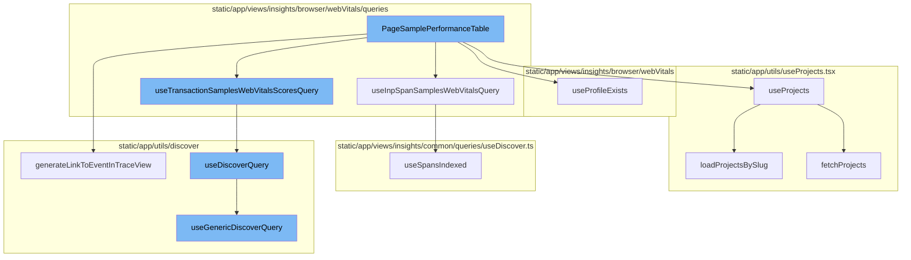

<SwmSnippet path="/static/app/views/insights/browser/webVitals/components/tables/pageSamplePerformanceTable.tsx" line="96">

---

# PageSamplePerformanceTable

The `PageSamplePerformanceTable` function is the main component that renders the performance table for a specific page sample. It takes in a transaction and search parameters, and optionally a limit for the number of results. It uses several hooks and helper functions to fetch and process the necessary data.

```tsx
export function PageSamplePerformanceTable({transaction, search, limit = 9}: Props) {
  const location = useLocation();
  const {projects} = useProjects();
  const organization = useOrganization();
  const {replayExists} = useReplayExists();
  const routes = useRoutes();
  const router = useRouter();

  const browserTypes = decodeBrowserTypes(location.query[SpanIndexedField.BROWSER_NAME]);
  let datatype = Datatype.PAGELOADS;
  switch (decodeScalar(location.query[DATATYPE_KEY], 'pageloads')) {
    case 'interactions':
      datatype = Datatype.INTERACTIONS;
      break;
    default:
      datatype = Datatype.PAGELOADS;
  }

  const sortableFields = SORTABLE_INDEXED_FIELDS;

  const sort = useWebVitalsSort({
```

---

</SwmSnippet>

<SwmSnippet path="/static/app/utils/useProjects.tsx" line="150">

---

## useProjects

`useProjects` is a hook that provides projects from the ProjectsStore. It also provides a way to select specific project slugs, and search for more projects that may not be in the project store.

```tsx
function useProjects({limit, slugs, orgId: propOrgId}: Options = {}) {
  const api = useApi();

  const organization = useOrganization({allowNull: true});
  const store = useLegacyStore(ProjectsStore);

  const orgId = propOrgId ?? organization?.slug ?? organization?.slug;

  const storeSlugs = new Set(store.projects.map(t => t.slug));
  const slugsToLoad = slugs?.filter(slug => !storeSlugs.has(slug)) ?? [];
  const shouldLoadSlugs = slugsToLoad.length > 0;

  const [state, setState] = useState<State>({
    initiallyLoaded: !store.loading && !shouldLoadSlugs,
    fetching: shouldLoadSlugs,
    hasMore: null,
    lastSearch: null,
    nextCursor: null,
    fetchError: null,
  });

```

---

</SwmSnippet>

<SwmSnippet path="/static/app/views/insights/browser/webVitals/utils/useProfileExists.tsx" line="11">

---

## useProfileExists

`useProfileExists` is a hook that queries results for whether a given replayId exists in the database. It uses the `useDiscoverQuery` hook to fetch the data.

```tsx
export default function useProfileExists(ids: string[]) {
  const organization = useOrganization();
  const pageFilters = usePageFilters();
  const location = useLocation();

  const eventView = EventView.fromNewQueryWithPageFilters(
    {
      fields: ['profile.id'],
      name: 'Web Vitals',
      query: `profile.id:[${ids.join(',')}]`,
      version: 2,
      dataset: DiscoverDatasets.DISCOVER,
    },
    pageFilters.selection
  );

  const {data} = useDiscoverQuery({
    eventView,
    location,
    orgSlug: organization.slug,
    limit: 100,
```

---

</SwmSnippet>

<SwmSnippet path="/static/app/views/insights/browser/webVitals/queries/storedScoreQueries/useTransactionSamplesWebVitalsScoresQuery.tsx" line="34">

---

## useTransactionSamplesWebVitalsScoresQuery

`useTransactionSamplesWebVitalsScoresQuery` is a hook that fetches the web vitals scores for transaction samples. It uses the `useDiscoverQuery` hook to fetch the data.

```tsx
export const useTransactionSamplesWebVitalsScoresQuery = ({
  orderBy,
  limit,
  transaction,
  query,
  enabled,
  withProfiles,
  sortName,
  webVital,
  browserTypes,
}: Props) => {
  const organization = useOrganization();
  const pageFilters = usePageFilters();
  const location = useLocation();

  const filteredSortableFields = SORTABLE_INDEXED_FIELDS;

  const sort = useWebVitalsSort({
    sortName,
    defaultSort: DEFAULT_INDEXED_SORT,
    sortableFields: filteredSortableFields as unknown as string[],
```

---

</SwmSnippet>

<SwmSnippet path="/static/app/utils/discover/urls.tsx" line="43">

---

## generateLinkToEventInTraceView

`generateLinkToEventInTraceView` is a helper function that generates a URL to the trace view or the event details view depending on the feature flag.

```tsx
export function generateLinkToEventInTraceView({
  organization,
  isHomepage,
  location,
  spanId,
  projectSlug,
  timestamp,
  traceSlug,
  eventId,
  transactionName,
  eventView,
  demo,
  source,
  type = 'performance',
}: {
  eventId: string;
  location: Location;
  organization: Pick<Organization, 'slug' | 'features'>;
  projectSlug: string;
  timestamp: string | number;
  traceSlug: string;
```

---

</SwmSnippet>



# Flow drill down


<SwmSnippet path="/static/app/views/insights/browser/webVitals/components/tables/pageSamplePerformanceTable.tsx" line="96">

---

# PageSamplePerformanceTable

The `PageSamplePerformanceTable` function is the main component that renders the performance table for a specific page sample. It takes in a transaction and search parameters, and optionally a limit for the number of results. It uses several hooks and helper functions to fetch and process the necessary data.

```tsx
export function PageSamplePerformanceTable({transaction, search, limit = 9}: Props) {
  const location = useLocation();
  const {projects} = useProjects();
  const organization = useOrganization();
  const {replayExists} = useReplayExists();
  const routes = useRoutes();
  const router = useRouter();

  const browserTypes = decodeBrowserTypes(location.query[SpanIndexedField.BROWSER_NAME]);
  let datatype = Datatype.PAGELOADS;
  switch (decodeScalar(location.query[DATATYPE_KEY], 'pageloads')) {
    case 'interactions':
      datatype = Datatype.INTERACTIONS;
      break;
    default:
      datatype = Datatype.PAGELOADS;
  }

  const sortableFields = SORTABLE_INDEXED_FIELDS;

  const sort = useWebVitalsSort({
```

---

</SwmSnippet>

<SwmSnippet path="/static/app/utils/useProjects.tsx" line="150">

---

## useProjects

`useProjects` is a hook that provides projects from the ProjectsStore. It also provides a way to select specific project slugs, and search for more projects that may not be in the project store.

```tsx
function useProjects({limit, slugs, orgId: propOrgId}: Options = {}) {
  const api = useApi();

  const organization = useOrganization({allowNull: true});
  const store = useLegacyStore(ProjectsStore);

  const orgId = propOrgId ?? organization?.slug ?? organization?.slug;

  const storeSlugs = new Set(store.projects.map(t => t.slug));
  const slugsToLoad = slugs?.filter(slug => !storeSlugs.has(slug)) ?? [];
  const shouldLoadSlugs = slugsToLoad.length > 0;

  const [state, setState] = useState<State>({
    initiallyLoaded: !store.loading && !shouldLoadSlugs,
    fetching: shouldLoadSlugs,
    hasMore: null,
    lastSearch: null,
    nextCursor: null,
    fetchError: null,
  });

```

---

</SwmSnippet>

<SwmSnippet path="/static/app/views/insights/browser/webVitals/utils/useProfileExists.tsx" line="11">

---

## useProfileExists

`useProfileExists` is a hook that queries results for whether a given replayId exists in the database. It uses the `useDiscoverQuery` hook to fetch the data.

```tsx
export default function useProfileExists(ids: string[]) {
  const organization = useOrganization();
  const pageFilters = usePageFilters();
  const location = useLocation();

  const eventView = EventView.fromNewQueryWithPageFilters(
    {
      fields: ['profile.id'],
      name: 'Web Vitals',
      query: `profile.id:[${ids.join(',')}]`,
      version: 2,
      dataset: DiscoverDatasets.DISCOVER,
    },
    pageFilters.selection
  );

  const {data} = useDiscoverQuery({
    eventView,
    location,
    orgSlug: organization.slug,
    limit: 100,
```

---

</SwmSnippet>

<SwmSnippet path="/static/app/views/insights/browser/webVitals/queries/storedScoreQueries/useTransactionSamplesWebVitalsScoresQuery.tsx" line="34">

---

## useTransactionSamplesWebVitalsScoresQuery

`useTransactionSamplesWebVitalsScoresQuery` is a hook that fetches the web vitals scores for transaction samples. It uses the `useDiscoverQuery` hook to fetch the data.

```tsx
export const useTransactionSamplesWebVitalsScoresQuery = ({
  orderBy,
  limit,
  transaction,
  query,
  enabled,
  withProfiles,
  sortName,
  webVital,
  browserTypes,
}: Props) => {
  const organization = useOrganization();
  const pageFilters = usePageFilters();
  const location = useLocation();

  const filteredSortableFields = SORTABLE_INDEXED_FIELDS;

  const sort = useWebVitalsSort({
    sortName,
    defaultSort: DEFAULT_INDEXED_SORT,
    sortableFields: filteredSortableFields as unknown as string[],
```

---

</SwmSnippet>

<SwmSnippet path="/static/app/utils/discover/urls.tsx" line="43">

---

## generateLinkToEventInTraceView

`generateLinkToEventInTraceView` is a helper function that generates a URL to the trace view or the event details view depending on the feature flag.

```tsx
export function generateLinkToEventInTraceView({
  organization,
  isHomepage,
  location,
  spanId,
  projectSlug,
  timestamp,
  traceSlug,
  eventId,
  transactionName,
  eventView,
  demo,
  source,
  type = 'performance',
}: {
  eventId: string;
  location: Location;
  organization: Pick<Organization, 'slug' | 'features'>;
  projectSlug: string;
  timestamp: string | number;
  traceSlug: string;
```

---

</SwmSnippet>

&nbsp;

*This is an auto-generated document by Swimm AI 🌊 and has not yet been verified by a human*

<SwmMeta version="3.0.0" repo-id="Z2l0aHViJTNBJTNBc2VudHJ5LWRlbW8lM0ElM0FTd2ltbS1EZW1v" repo-name="sentry-demo" doc-type="flows"><sup>Powered by [Swimm](/)</sup></SwmMeta>
