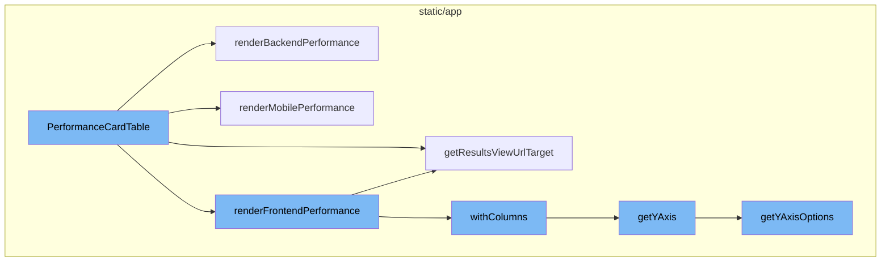
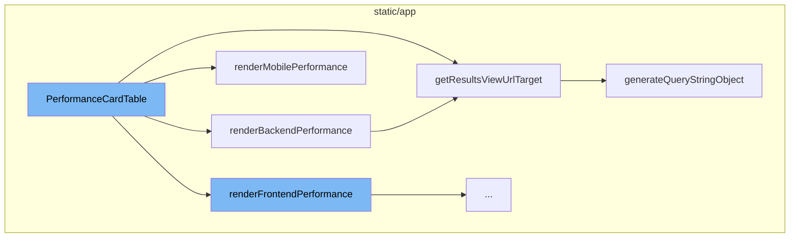
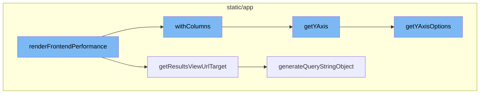

# PerformanceCardTable Overview

The `PerformanceCardTable` is a component that presents performance data in a tabular format. It includes several helper functions to render different types of performance data, such as frontend, backend, and mobile performance.

## Backend Performance Rendering

The `renderBackendPerformance` function is a helper function within `PerformanceCardTable` that specifically handles the rendering of backend performance data. It creates a table with columns for different types of backend performance metrics, such as HTTP and DB spans.

## URL Generation for Results View

The `getResultsViewUrlTarget` method is used to generate the URL for the results view. It takes the organization slug and a boolean indicating whether the target is the homepage as parameters, and returns an object containing the pathname and query string for the URL.

## Mobile Performance Rendering

The `renderMobilePerformance` function is another helper function within `PerformanceCardTable` that handles the rendering of mobile performance data. It creates a table with columns for different types of mobile performance metrics, such as app start times and frame rates.

## Query String Generation for Results View URL

The `generateQueryStringObject` method is used to generate the query string object for the results view URL. It returns an object containing various parameters such as the id, name, field, sort, environment, project, query, yAxis, dataset, display, topEvents, and interval.

## Frontend Performance Rendering

The `renderFrontendPerformance` function in `PerformanceCardTable` is responsible for rendering the performance data. It creates two arrays, `webVitals` and `spans`, which hold the performance metrics to be displayed. For each metric, a new view is created with the corresponding columns using the `withColumns` method. This new view is then used to generate a link that leads to the detailed view of the metric.

## Column Addition in EventView

`withColumns` is a method in the `EventView` class that takes an array of columns as input and returns a new `EventView` instance with these columns. It also updates the sort fields and the yAxis of the new `EventView` instance.

## yAxis Retrieval in EventView

`getYAxis` is a method in the `EventView` class that returns the yAxis of the `EventView` instance. If the yAxis is not set, it returns the default option. If the yAxis is set but not included in the yAxis options, it also returns the default option.

## Results View URL Generation

`getResultsViewUrlTarget` is a method in the `EventView` class that generates the URL for the detailed view of the performance metric. It takes the organization slug and a boolean indicating whether the target is the homepage as input, and returns an object containing the pathname and the query string.

## Query String Generation for URL

`generateQueryStringObject` is a method in the `EventView` class that generates the query string for the URL. It includes all the necessary parameters for the detailed view of the performance metric.

## yAxis Options Retrieval in EventView

`getYAxisOptions` is a method in the `EventView` class that returns the yAxis options for the `EventView` instance. It filters the aggregate fields to include only those that can be graphed and adds them to the yAxis options.



# Flow drill down

First, we'll zoom into this section of the flow:



<SwmSnippet path="/static/app/components/discover/performanceCardTable.tsx" line="40">

---

# PerformanceCardTable

The `PerformanceCardTable` function is a component that renders performance data in a table format. It includes several helper functions to render different types of performance data, such as frontend, backend, and mobile performance.

```tsx
function PerformanceCardTable({
  organization,
  location,
  project,
  releaseEventView,
  allReleasesTableData,
  thisReleaseTableData,
  performanceType,
  isLoading,
}: PerformanceCardTableProps) {
  const miseryRenderer =
    allReleasesTableData?.meta &&
    getFieldRenderer('user_misery()', allReleasesTableData.meta, false);

  function renderChange(
    allReleasesScore: number,
    thisReleaseScore: number,
    meta: string
  ) {
    if (allReleasesScore === undefined || thisReleaseScore === undefined) {
      return <StyledNotAvailable />;
```

---

</SwmSnippet>

<SwmSnippet path="/static/app/components/discover/performanceCardTable.tsx" line="301">

---

## renderBackendPerformance

The `renderBackendPerformance` function is a helper function within `PerformanceCardTable` that specifically handles the rendering of backend performance data. It creates a table with columns for different types of backend performance metrics, such as HTTP and DB spans.

```tsx
  function renderBackendPerformance() {
    const spans = [
      {title: 'HTTP', column: 'p75(spans.http)', field: 'p75_spans_http'},
      {title: 'DB', column: 'p75(spans.db)', field: 'p75_spans_db'},
    ];

    const spanTitles = spans.map((span, idx) => {
      const newView = releaseEventView.withColumns([
        {kind: 'field', field: `${span.column}`},
      ]);
      return (
        <SubTitle key={idx}>
          <Link to={newView.getResultsViewUrlTarget(organization.slug)}>
            {span.title}
          </Link>
        </SubTitle>
      );
    });

    const apdexRenderer =
      allReleasesTableData?.meta &&
```

---

</SwmSnippet>

<SwmSnippet path="/static/app/utils/discover/eventView.tsx" line="1190">

---

## getResultsViewUrlTarget

The `getResultsViewUrlTarget` method is used to generate the URL for the results view. It takes the organization slug and a boolean indicating whether the target is the homepage as parameters, and returns an object containing the pathname and query string for the URL.

```tsx
  getResultsViewUrlTarget(
    slug: string,
    isHomepage: boolean = false
  ): {pathname: string; query: Query} {
    const target = isHomepage ? 'homepage' : 'results';
    return {
      pathname: normalizeUrl(`/organizations/${slug}/discover/${target}/`),
      query: this.generateQueryStringObject(),
    };
  }
```

---

</SwmSnippet>

<SwmSnippet path="/static/app/components/discover/performanceCardTable.tsx" line="454">

---

## renderMobilePerformance

The `renderMobilePerformance` function is another helper function within `PerformanceCardTable` that handles the rendering of mobile performance data. It creates a table with columns for different types of mobile performance metrics, such as app start times and frame rates.

```tsx
  function renderMobilePerformance() {
    const mobileVitals = [
      MobileVital.APP_START_COLD,
      MobileVital.APP_START_WARM,
      MobileVital.FRAMES_SLOW,
      MobileVital.FRAMES_FROZEN,
    ];
    const mobileVitalTitles = mobileVitals.map(mobileVital => {
      return (
        <PanelItem key={mobileVital}>{MOBILE_VITAL_DETAILS[mobileVital].name}</PanelItem>
      );
    });

    const mobileVitalFields = [
      'p75(measurements.app_start_cold)',
      'p75(measurements.app_start_warm)',
      'p75(measurements.frames_slow)',
      'p75(measurements.frames_frozen)',
    ];
    const mobileVitalsRenderer = mobileVitalFields.map(
      field =>
```

---

</SwmSnippet>

<SwmSnippet path="/static/app/utils/discover/eventView.tsx" line="672">

---

## generateQueryStringObject

The `generateQueryStringObject` method is used to generate the query string object for the results view URL. It returns an object containing various parameters such as the id, name, field, sort, environment, project, query, yAxis, dataset, display, topEvents, and interval.

```tsx
  generateQueryStringObject(): Query {
    const output = {
      id: this.id,
      name: this.name,
      field: this.getFields(),
      widths: this.getWidths(),
      sort: encodeSorts(this.sorts),
      environment: this.environment,
      project: this.project,
      query: this.query,
      yAxis: this.yAxis || this.getYAxis(),
      dataset: this.dataset,
      display: this.display,
      topEvents: this.topEvents,
      interval: this.interval,
    };

    for (const field of EXTERNAL_QUERY_STRING_KEYS) {
      if (this[field]?.length) {
        output[field] = this[field];
      }
```

---

</SwmSnippet>

Now, lets zoom into this section of the flow:



<SwmSnippet path="/static/app/components/discover/performanceCardTable.tsx" line="101">

---

# PerformanceCardTable Flow

The `renderFrontendPerformance` function in `PerformanceCardTable` is responsible for rendering the performance data. It creates two arrays, `webVitals` and `spans`, which hold the performance metrics to be displayed. For each metric, a new view is created with the corresponding columns using the `withColumns` method. This new view is then used to generate a link that leads to the detailed view of the metric.

```tsx
  function renderFrontendPerformance() {
    const webVitals = [
      {title: WebVital.FCP, field: 'p75(measurements.fcp)'},
      {title: WebVital.FID, field: 'p75(measurements.fid)'},
      {title: WebVital.LCP, field: 'p75(measurements.lcp)'},
      {title: WebVital.CLS, field: 'p75(measurements.cls)'},
    ];

    const spans = [
      {title: 'HTTP', column: 'p75(spans.http)', field: 'p75(spans.http)'},
      {title: 'Browser', column: 'p75(spans.browser)', field: 'p75(spans.browser)'},
      {title: 'Resource', column: 'p75(spans.resource)', field: 'p75(spans.resource)'},
    ];

    const webVitalTitles = webVitals.map((vital, idx) => {
      const newView = releaseEventView.withColumns([
        {kind: 'field', field: `p75(${vital.title})`},
      ]);
      return (
        <SubTitle key={idx}>
          <Link to={newView.getResultsViewUrlTarget(organization.slug)}>
```

---

</SwmSnippet>

<SwmSnippet path="/static/app/utils/discover/eventView.tsx" line="798">

---

`withColumns` is a method in the `EventView` class that takes an array of columns as input and returns a new `EventView` instance with these columns. It also updates the sort fields and the yAxis of the new `EventView` instance.

```tsx
  withColumns(columns: Column[]): EventView {
    const newEventView = this.clone();
    const fields: Field[] = columns
      .filter(
        col =>
          ((col.kind === 'field' || col.kind === FieldValueKind.EQUATION) && col.field) ||
          (col.kind === 'function' && col.function[0])
      )
      .map(col => generateFieldAsString(col))
      .map((field, i) => {
        // newly added field
        if (!newEventView.fields[i]) {
          return {field, width: COL_WIDTH_UNDEFINED};
        }
        // Existing columns that were not re ordered should retain
        // their old widths.
        const existing = newEventView.fields[i];
        const width =
          existing.field === field && existing.width !== undefined
            ? existing.width
            : COL_WIDTH_UNDEFINED;
```

---

</SwmSnippet>

<SwmSnippet path="/static/app/utils/discover/eventView.tsx" line="1319">

---

`getYAxis` is a method in the `EventView` class that returns the yAxis of the `EventView` instance. If the yAxis is not set, it returns the default option. If the yAxis is set but not included in the yAxis options, it also returns the default option.

```tsx
  getYAxis(): string {
    const yAxisOptions = this.getYAxisOptions();

    const yAxis = this.yAxis;
    const defaultOption = yAxisOptions[0].value;

    if (!yAxis) {
      return defaultOption;
    }

    // ensure current selected yAxis is one of the items in yAxisOptions
    const result = yAxisOptions.findIndex(
      (option: SelectValue<string>) => option.value === yAxis
    );

    if (result >= 0) {
      return typeof yAxis === 'string' ? yAxis : yAxis[0];
    }

    return defaultOption;
  }
```

---

</SwmSnippet>

<SwmSnippet path="/static/app/utils/discover/eventView.tsx" line="1190">

---

`getResultsViewUrlTarget` is a method in the `EventView` class that generates the URL for the detailed view of the performance metric. It takes the organization slug and a boolean indicating whether the target is the homepage as input, and returns an object containing the pathname and the query string.

```tsx
  getResultsViewUrlTarget(
    slug: string,
    isHomepage: boolean = false
  ): {pathname: string; query: Query} {
    const target = isHomepage ? 'homepage' : 'results';
    return {
      pathname: normalizeUrl(`/organizations/${slug}/discover/${target}/`),
      query: this.generateQueryStringObject(),
    };
  }
```

---

</SwmSnippet>

<SwmSnippet path="/static/app/utils/discover/eventView.tsx" line="672">

---

`generateQueryStringObject` is a method in the `EventView` class that generates the query string for the URL. It includes all the necessary parameters for the detailed view of the performance metric.

```tsx
  generateQueryStringObject(): Query {
    const output = {
      id: this.id,
      name: this.name,
      field: this.getFields(),
      widths: this.getWidths(),
      sort: encodeSorts(this.sorts),
      environment: this.environment,
      project: this.project,
      query: this.query,
      yAxis: this.yAxis || this.getYAxis(),
      dataset: this.dataset,
      display: this.display,
      topEvents: this.topEvents,
      interval: this.interval,
    };

    for (const field of EXTERNAL_QUERY_STRING_KEYS) {
      if (this[field]?.length) {
        output[field] = this[field];
      }
```

---

</SwmSnippet>

<SwmSnippet path="/static/app/utils/discover/eventView.tsx" line="1300">

---

`getYAxisOptions` is a method in the `EventView` class that returns the yAxis options for the `EventView` instance. It filters the aggregate fields to include only those that can be graphed and adds them to the yAxis options.

```tsx
  getYAxisOptions(): SelectValue<string>[] {
    // Make option set and add the default options in.
    return uniqBy(
      this.getAggregateFields()
        // Only include aggregates that make sense to be graphable (eg. not string or date)
        .filter(
          (field: Field) =>
            isLegalYAxisType(aggregateOutputType(field.field)) ||
            isAggregateEquation(field.field)
        )
        .map((field: Field) => ({
          label: isEquation(field.field) ? getEquation(field.field) : field.field,
          value: field.field,
        }))
        .concat(CHART_AXIS_OPTIONS),
      'value'
    );
  }
```

---

</SwmSnippet>

&nbsp;

*This is an auto-generated document by Swimm AI 🌊 and has not yet been verified by a human*

<SwmMeta version="3.0.0" repo-id="Z2l0aHViJTNBJTNBc2VudHJ5LWRlbW8lM0ElM0FTd2ltbS1EZW1v" repo-name="sentry-demo" doc-type="flows"><sup>Powered by [Swimm](/)</sup></SwmMeta>
