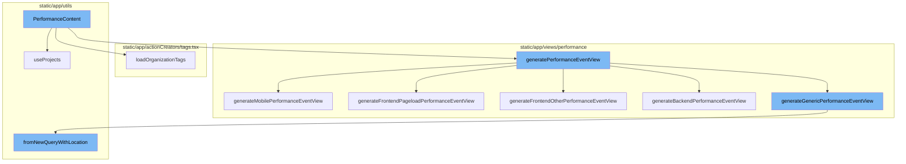
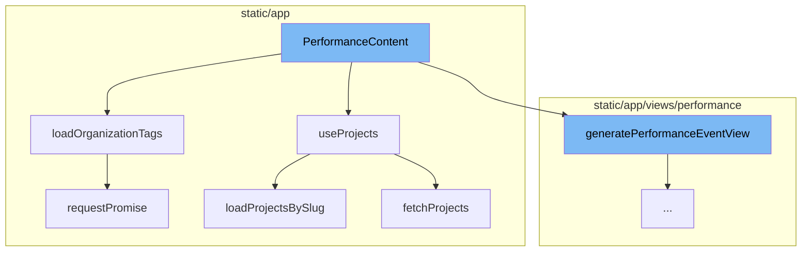
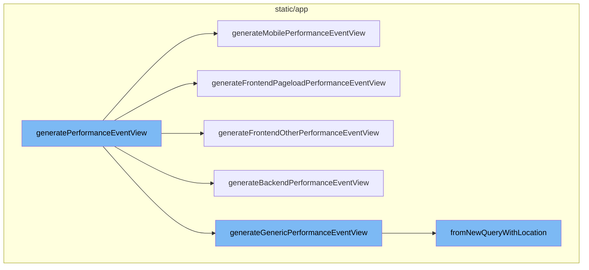

# PerformanceContent Overview

PerformanceContent is a key component in the Sentry application. It is responsible for managing the state and data of the performance content. It uses several hooks and functions to achieve this. The flow starts with the `PerformanceContent` function which uses the `useProjects` hook to fetch and manage the state of projects. It also uses the `loadOrganizationTags` function to load an organization's tags based on a global selection value.

<SwmSnippet path="/static/app/views/performance/content.tsx" line="49">

---

# PerformanceContent Flow

The `PerformanceContent` function is the starting point of the flow. It uses several hooks and functions to manage the state and data of the performance content. It also defines several helper functions within its scope.

```tsx
function PerformanceContent({selection, location, demoMode, router}: Props) {
  const api = useApi();
  const organization = useOrganization();
  const {projects} = useProjects();
  const mounted = useRef(false);
  const previousDateTime = usePrevious(selection.datetime);
  const [state, setState] = useState<State>({error: undefined});
  const withStaticFilters = canUseMetricsData(organization);
  const eventView = generatePerformanceEventView(
    location,
    projects,
    {
      withStaticFilters,
    },
    organization
  );

  function getOnboardingProject(): Project | undefined {
    // XXX used by getsentry to bypass onboarding for the upsell demo state.
    if (demoMode) {
      return undefined;
```

---

</SwmSnippet>

<SwmSnippet path="/static/app/utils/useProjects.tsx" line="141">

---

# useProjects Hook

The `useProjects` hook is used in `PerformanceContent` to fetch and manage the state of projects. It provides a way to select specific project slugs, and search for more projects that may not be in the project store. It also defines the `loadProjectsBySlug` function to load projects by their slugs.

```tsx
/**
 * Provides projects from the ProjectsStore
 *
 * This hook also provides a way to select specific project slugs, and search
 * (type-ahead) for more projects that may not be in the project store.
 *
 * NOTE: Currently ALL projects are always loaded, but this hook is designed
 * for future-compat in a world where we do _not_ load all projects.
 */
function useProjects({limit, slugs, orgId: propOrgId}: Options = {}) {
  const api = useApi();

  const organization = useOrganization({allowNull: true});
  const store = useLegacyStore(ProjectsStore);

  const orgId = propOrgId ?? organization?.slug ?? organization?.slug;

  const storeSlugs = new Set(store.projects.map(t => t.slug));
  const slugsToLoad = slugs?.filter(slug => !storeSlugs.has(slug)) ?? [];
  const shouldLoadSlugs = slugsToLoad.length > 0;

```

---

</SwmSnippet>

<SwmSnippet path="/static/app/actionCreators/tags.tsx" line="28">

---

# loadOrganizationTags Function

The `loadOrganizationTags` function is used in `PerformanceContent` to load an organization's tags based on a global selection value. It makes a GET request to the `/organizations/${orgSlug}/tags/` endpoint to fetch the tags.

```tsx
/**
 * Load an organization's tags based on a global selection value.
 */
export function loadOrganizationTags(
  api: Client,
  orgSlug: string,
  selection: PageFilters
): Promise<void> {
  TagStore.reset();

  const query: Query = selection.datetime
    ? {...normalizeDateTimeParams(selection.datetime)}
    : {};
  query.use_cache = '1';

  if (selection.projects) {
    query.project = selection.projects.map(String);
  }

  return api
    .requestPromise(`/organizations/${orgSlug}/tags/`, {
```

---

</SwmSnippet>

<SwmSnippet path="/static/app/api.tsx" line="656">

---

# requestPromise Method

The `requestPromise` method is used in `loadOrganizationTags` to make the API request. It returns a promise that resolves with the data from the response, or rejects with an error object if the request fails.

```tsx
  requestPromise<IncludeAllArgsType extends boolean>(
    path: string,
    {
      includeAllArgs,
      ...options
    }: {includeAllArgs?: IncludeAllArgsType} & Readonly<RequestOptions> = {}
  ): Promise<IncludeAllArgsType extends true ? ApiResult : any> {
    // Create an error object here before we make any async calls so that we
    // have a helpful stack trace if it errors
    //
    // This *should* get logged to Sentry only if the promise rejection is not handled
    // (since SDK captures unhandled rejections). Ideally we explicitly ignore rejection
    // or handle with a user friendly error message
    const preservedError = new Error('API Request Error');

    return new Promise((resolve, reject) =>
      this.request(path, {
        ...options,
        preservedError,
        success: (data, textStatus, resp) => {
          if (includeAllArgs) {
```

---

</SwmSnippet>

<SwmSnippet path="/static/app/utils/useProjects.tsx" line="87">

---

# fetchProjects Function

The `fetchProjects` function is used in `useProjects` to fetch projects from the API. It makes a GET request to the `/organizations/${orgId}/projects/` endpoint to fetch the projects.

```tsx
/**
 * Helper function to actually load projects
 */
async function fetchProjects(
  api: Client,
  orgId: string,
  {slugs, search, limit, lastSearch, cursor}: FetchProjectsOptions = {}
) {
  const query: {
    collapse: string[];
    all_projects?: number;
    cursor?: typeof cursor;
    per_page?: number;
    query?: string;
  } = {
    // Never return latestDeploys project property from api
    collapse: ['latestDeploys', 'unusedFeatures'],
  };

  if (slugs !== undefined && slugs.length > 0) {
    query.query = slugs.map(slug => `slug:${slug}`).join(' ');
```

---

</SwmSnippet>

<SwmSnippet path="/static/app/views/performance/data.tsx" line="720">

---

# PerformanceContent Flow

The `generatePerformanceEventView` function is the entry point of the PerformanceContent flow. It generates a generic performance event view and then checks the current landing display. Depending on the display field, it calls the appropriate function to generate a specific performance event view.

```tsx
export function generatePerformanceEventView(
  location: Location,
  projects: Project[],
  {isTrends = false, withStaticFilters = false} = {},
  organization: Organization
) {
  const eventView = generateGenericPerformanceEventView(
    location,
    withStaticFilters,
    organization
  );
  if (isTrends) {
    return eventView;
  }

  const display = getCurrentLandingDisplay(location, projects, eventView);
  switch (display?.field) {
    case LandingDisplayField.FRONTEND_PAGELOAD:
      return generateFrontendPageloadPerformanceEventView(
        location,
        withStaticFilters,
```

---

</SwmSnippet>

<SwmSnippet path="/static/app/views/performance/data.tsx" line="552">

---

# generateMobilePerformanceEventView Function

`generateMobilePerformanceEventView` is called when the display field is 'MOBILE'. It generates a performance event view specifically for mobile projects. If all projects are react-native projects, it also shows the stall percentage.

```tsx
function generateMobilePerformanceEventView(
  location: Location,
  projects: Project[],
  genericEventView: EventView,
  withStaticFilters: boolean,
  organization: Organization
): EventView {
  const {query} = location;

  const fields = [
    'team_key_transaction',
    'transaction',
    'project',
    'transaction.op',
    'tpm()',
    'p75(measurements.frames_slow_rate)',
    'p75(measurements.frames_frozen_rate)',
  ];
  if (organization.features.includes('mobile-vitals')) {
    fields.push('p75(measurements.time_to_initial_display)');
  }
```

---

</SwmSnippet>

<SwmSnippet path="/static/app/views/performance/data.tsx" line="619">

---

# generateFrontendPageloadPerformanceEventView Function

`generateFrontendPageloadPerformanceEventView` is called when the display field is 'FRONTEND_PAGELOAD'. It generates a performance event view specifically for frontend pageload transactions.

```tsx
function generateFrontendPageloadPerformanceEventView(
  location: Location,
  withStaticFilters: boolean,
  organization: Organization
): EventView {
  const {query} = location;

  const fields = [
    'team_key_transaction',
    'transaction',
    'project',
    'tpm()',
    'p75(measurements.fcp)',
    'p75(measurements.lcp)',
    'p75(measurements.fid)',
    'p75(measurements.cls)',
    'count_unique(user)',
    'count_miserable(user)',
    'user_misery()',
  ];

```

---

</SwmSnippet>

<SwmSnippet path="/static/app/views/performance/data.tsx" line="670">

---

# generateFrontendOtherPerformanceEventView Function

`generateFrontendOtherPerformanceEventView` is called when the display field is 'FRONTEND_OTHER'. It generates a performance event view specifically for other frontend transactions.

```tsx
function generateFrontendOtherPerformanceEventView(
  location: Location,
  withStaticFilters: boolean,
  organization: Organization
): EventView {
  const {query} = location;

  const fields = [
    'team_key_transaction',
    'transaction',
    'project',
    'transaction.op',
    'tpm()',
    'p50(transaction.duration)',
    'p75(transaction.duration)',
    'p95(transaction.duration)',
    'count_unique(user)',
    'count_miserable(user)',
    'user_misery()',
  ];

```

---

</SwmSnippet>

<SwmSnippet path="/static/app/views/performance/data.tsx" line="500">

---

# generateBackendPerformanceEventView Function

`generateBackendPerformanceEventView` is called when the display field is 'BACKEND'. It generates a performance event view specifically for backend transactions.

```tsx
function generateBackendPerformanceEventView(
  location: Location,
  withStaticFilters: boolean,
  organization: Organization
): EventView {
  const {query} = location;

  const fields = [
    'team_key_transaction',
    'transaction',
    'project',
    'transaction.op',
    'http.method',
    'tpm()',
    'p50()',
    'p95()',
    'failure_rate()',
    'apdex()',
    'count_unique(user)',
    'count_miserable(user)',
    'user_misery()',
```

---

</SwmSnippet>

<SwmSnippet path="/static/app/views/performance/data.tsx" line="439">

---

# generateGenericPerformanceEventView Function

`generateGenericPerformanceEventView` is called when the display field is not any of the above. It generates a generic performance event view.

```tsx
function generateGenericPerformanceEventView(
  location: Location,
  withStaticFilters: boolean,
  organization: Organization
): EventView {
  const {query} = location;

  const fields = [
    'team_key_transaction',
    'transaction',
    'project',
    'tpm()',
    'p50()',
    'p95()',
    'failure_rate()',
    'apdex()',
    'count_unique(user)',
    'count_miserable(user)',
    'user_misery()',
  ];

```

---

</SwmSnippet>

<SwmSnippet path="/static/app/utils/discover/eventView.tsx" line="365">

---

# fromNewQueryWithLocation Method

Each of the above functions uses `EventView.fromNewQueryWithLocation` to create an EventView from the saved query and location. This method applies global selection header values from location whenever possible.

```tsx
  static fromNewQueryWithLocation(newQuery: NewQuery, location: Location): EventView {
    const query = location.query;

    // apply global selection header values from location whenever possible
    const environment: string[] =
      Array.isArray(newQuery.environment) && newQuery.environment.length > 0
        ? newQuery.environment
        : collectQueryStringByKey(query, 'environment');

    const project: number[] =
      Array.isArray(newQuery.projects) && newQuery.projects.length > 0
        ? newQuery.projects
        : decodeProjects(location);

    const saved: NewQuery = {
      ...newQuery,

      environment,
      projects: project,

      // datetime selection
```

---

</SwmSnippet>



# Flow drill down

First, we'll zoom into this section of the flow:



<SwmSnippet path="/static/app/views/performance/content.tsx" line="49">

---

# PerformanceContent Flow

The `PerformanceContent` function is the starting point of the flow. It uses several hooks and functions to manage the state and data of the performance content. It also defines several helper functions within its scope.

```tsx
function PerformanceContent({selection, location, demoMode, router}: Props) {
  const api = useApi();
  const organization = useOrganization();
  const {projects} = useProjects();
  const mounted = useRef(false);
  const previousDateTime = usePrevious(selection.datetime);
  const [state, setState] = useState<State>({error: undefined});
  const withStaticFilters = canUseMetricsData(organization);
  const eventView = generatePerformanceEventView(
    location,
    projects,
    {
      withStaticFilters,
    },
    organization
  );

  function getOnboardingProject(): Project | undefined {
    // XXX used by getsentry to bypass onboarding for the upsell demo state.
    if (demoMode) {
      return undefined;
```

---

</SwmSnippet>

<SwmSnippet path="/static/app/utils/useProjects.tsx" line="141">

---

# useProjects Hook

The `useProjects` hook is used in `PerformanceContent` to fetch and manage the state of projects. It provides a way to select specific project slugs, and search for more projects that may not be in the project store. It also defines the `loadProjectsBySlug` function to load projects by their slugs.

```tsx
/**
 * Provides projects from the ProjectsStore
 *
 * This hook also provides a way to select specific project slugs, and search
 * (type-ahead) for more projects that may not be in the project store.
 *
 * NOTE: Currently ALL projects are always loaded, but this hook is designed
 * for future-compat in a world where we do _not_ load all projects.
 */
function useProjects({limit, slugs, orgId: propOrgId}: Options = {}) {
  const api = useApi();

  const organization = useOrganization({allowNull: true});
  const store = useLegacyStore(ProjectsStore);

  const orgId = propOrgId ?? organization?.slug ?? organization?.slug;

  const storeSlugs = new Set(store.projects.map(t => t.slug));
  const slugsToLoad = slugs?.filter(slug => !storeSlugs.has(slug)) ?? [];
  const shouldLoadSlugs = slugsToLoad.length > 0;

```

---

</SwmSnippet>

<SwmSnippet path="/static/app/actionCreators/tags.tsx" line="28">

---

# loadOrganizationTags Function

The `loadOrganizationTags` function is used in `PerformanceContent` to load an organization's tags based on a global selection value. It makes a GET request to the `/organizations/${orgSlug}/tags/` endpoint to fetch the tags.

```tsx
/**
 * Load an organization's tags based on a global selection value.
 */
export function loadOrganizationTags(
  api: Client,
  orgSlug: string,
  selection: PageFilters
): Promise<void> {
  TagStore.reset();

  const query: Query = selection.datetime
    ? {...normalizeDateTimeParams(selection.datetime)}
    : {};
  query.use_cache = '1';

  if (selection.projects) {
    query.project = selection.projects.map(String);
  }

  return api
    .requestPromise(`/organizations/${orgSlug}/tags/`, {
```

---

</SwmSnippet>

<SwmSnippet path="/static/app/api.tsx" line="656">

---

# requestPromise Method

The `requestPromise` method is used in `loadOrganizationTags` to make the API request. It returns a promise that resolves with the data from the response, or rejects with an error object if the request fails.

```tsx
  requestPromise<IncludeAllArgsType extends boolean>(
    path: string,
    {
      includeAllArgs,
      ...options
    }: {includeAllArgs?: IncludeAllArgsType} & Readonly<RequestOptions> = {}
  ): Promise<IncludeAllArgsType extends true ? ApiResult : any> {
    // Create an error object here before we make any async calls so that we
    // have a helpful stack trace if it errors
    //
    // This *should* get logged to Sentry only if the promise rejection is not handled
    // (since SDK captures unhandled rejections). Ideally we explicitly ignore rejection
    // or handle with a user friendly error message
    const preservedError = new Error('API Request Error');

    return new Promise((resolve, reject) =>
      this.request(path, {
        ...options,
        preservedError,
        success: (data, textStatus, resp) => {
          if (includeAllArgs) {
```

---

</SwmSnippet>

<SwmSnippet path="/static/app/utils/useProjects.tsx" line="87">

---

# fetchProjects Function

The `fetchProjects` function is used in `useProjects` to fetch projects from the API. It makes a GET request to the `/organizations/${orgId}/projects/` endpoint to fetch the projects.

```tsx
/**
 * Helper function to actually load projects
 */
async function fetchProjects(
  api: Client,
  orgId: string,
  {slugs, search, limit, lastSearch, cursor}: FetchProjectsOptions = {}
) {
  const query: {
    collapse: string[];
    all_projects?: number;
    cursor?: typeof cursor;
    per_page?: number;
    query?: string;
  } = {
    // Never return latestDeploys project property from api
    collapse: ['latestDeploys', 'unusedFeatures'],
  };

  if (slugs !== undefined && slugs.length > 0) {
    query.query = slugs.map(slug => `slug:${slug}`).join(' ');
```

---

</SwmSnippet>

Now, lets zoom into this section of the flow:



<SwmSnippet path="/static/app/views/performance/data.tsx" line="720">

---

# PerformanceContent Flow

The `generatePerformanceEventView` function is the entry point of the PerformanceContent flow. It generates a generic performance event view and then checks the current landing display. Depending on the display field, it calls the appropriate function to generate a specific performance event view.

```tsx
export function generatePerformanceEventView(
  location: Location,
  projects: Project[],
  {isTrends = false, withStaticFilters = false} = {},
  organization: Organization
) {
  const eventView = generateGenericPerformanceEventView(
    location,
    withStaticFilters,
    organization
  );
  if (isTrends) {
    return eventView;
  }

  const display = getCurrentLandingDisplay(location, projects, eventView);
  switch (display?.field) {
    case LandingDisplayField.FRONTEND_PAGELOAD:
      return generateFrontendPageloadPerformanceEventView(
        location,
        withStaticFilters,
```

---

</SwmSnippet>

<SwmSnippet path="/static/app/views/performance/data.tsx" line="552">

---

`generateMobilePerformanceEventView` is called when the display field is 'MOBILE'. It generates a performance event view specifically for mobile projects. If all projects are react-native projects, it also shows the stall percentage.

```tsx
function generateMobilePerformanceEventView(
  location: Location,
  projects: Project[],
  genericEventView: EventView,
  withStaticFilters: boolean,
  organization: Organization
): EventView {
  const {query} = location;

  const fields = [
    'team_key_transaction',
    'transaction',
    'project',
    'transaction.op',
    'tpm()',
    'p75(measurements.frames_slow_rate)',
    'p75(measurements.frames_frozen_rate)',
  ];
  if (organization.features.includes('mobile-vitals')) {
    fields.push('p75(measurements.time_to_initial_display)');
  }
```

---

</SwmSnippet>

<SwmSnippet path="/static/app/views/performance/data.tsx" line="619">

---

`generateFrontendPageloadPerformanceEventView` is called when the display field is 'FRONTEND_PAGELOAD'. It generates a performance event view specifically for frontend pageload transactions.

```tsx
function generateFrontendPageloadPerformanceEventView(
  location: Location,
  withStaticFilters: boolean,
  organization: Organization
): EventView {
  const {query} = location;

  const fields = [
    'team_key_transaction',
    'transaction',
    'project',
    'tpm()',
    'p75(measurements.fcp)',
    'p75(measurements.lcp)',
    'p75(measurements.fid)',
    'p75(measurements.cls)',
    'count_unique(user)',
    'count_miserable(user)',
    'user_misery()',
  ];

```

---

</SwmSnippet>

<SwmSnippet path="/static/app/views/performance/data.tsx" line="670">

---

`generateFrontendOtherPerformanceEventView` is called when the display field is 'FRONTEND_OTHER'. It generates a performance event view specifically for other frontend transactions.

```tsx
function generateFrontendOtherPerformanceEventView(
  location: Location,
  withStaticFilters: boolean,
  organization: Organization
): EventView {
  const {query} = location;

  const fields = [
    'team_key_transaction',
    'transaction',
    'project',
    'transaction.op',
    'tpm()',
    'p50(transaction.duration)',
    'p75(transaction.duration)',
    'p95(transaction.duration)',
    'count_unique(user)',
    'count_miserable(user)',
    'user_misery()',
  ];

```

---

</SwmSnippet>

<SwmSnippet path="/static/app/views/performance/data.tsx" line="500">

---

`generateBackendPerformanceEventView` is called when the display field is 'BACKEND'. It generates a performance event view specifically for backend transactions.

```tsx
function generateBackendPerformanceEventView(
  location: Location,
  withStaticFilters: boolean,
  organization: Organization
): EventView {
  const {query} = location;

  const fields = [
    'team_key_transaction',
    'transaction',
    'project',
    'transaction.op',
    'http.method',
    'tpm()',
    'p50()',
    'p95()',
    'failure_rate()',
    'apdex()',
    'count_unique(user)',
    'count_miserable(user)',
    'user_misery()',
```

---

</SwmSnippet>

<SwmSnippet path="/static/app/views/performance/data.tsx" line="439">

---

`generateGenericPerformanceEventView` is called when the display field is not any of the above. It generates a generic performance event view.

```tsx
function generateGenericPerformanceEventView(
  location: Location,
  withStaticFilters: boolean,
  organization: Organization
): EventView {
  const {query} = location;

  const fields = [
    'team_key_transaction',
    'transaction',
    'project',
    'tpm()',
    'p50()',
    'p95()',
    'failure_rate()',
    'apdex()',
    'count_unique(user)',
    'count_miserable(user)',
    'user_misery()',
  ];

```

---

</SwmSnippet>

<SwmSnippet path="/static/app/utils/discover/eventView.tsx" line="365">

---

Each of the above functions uses `EventView.fromNewQueryWithLocation` to create an EventView from the saved query and location. This method applies global selection header values from location whenever possible.

```tsx
  static fromNewQueryWithLocation(newQuery: NewQuery, location: Location): EventView {
    const query = location.query;

    // apply global selection header values from location whenever possible
    const environment: string[] =
      Array.isArray(newQuery.environment) && newQuery.environment.length > 0
        ? newQuery.environment
        : collectQueryStringByKey(query, 'environment');

    const project: number[] =
      Array.isArray(newQuery.projects) && newQuery.projects.length > 0
        ? newQuery.projects
        : decodeProjects(location);

    const saved: NewQuery = {
      ...newQuery,

      environment,
      projects: project,

      // datetime selection
```

---

</SwmSnippet>

&nbsp;

*This is an auto-generated document by Swimm AI 🌊 and has not yet been verified by a human*

<SwmMeta version="3.0.0" repo-id="Z2l0aHViJTNBJTNBc2VudHJ5LWRlbW8lM0ElM0FTd2ltbS1EZW1v" repo-name="sentry-demo" doc-type="flows"><sup>Powered by [Swimm](/)</sup></SwmMeta>
