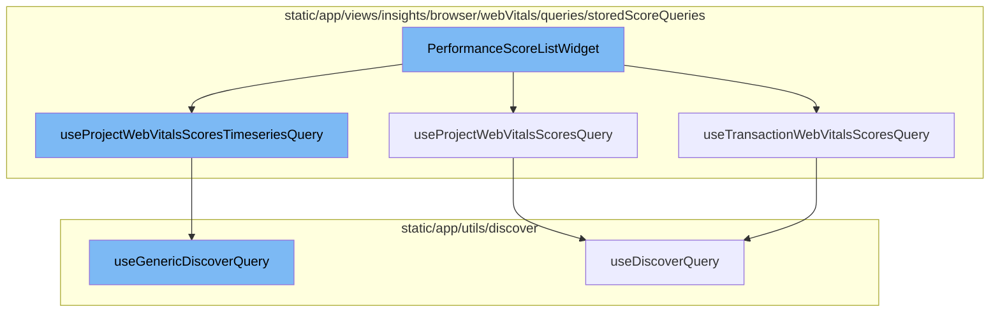

<SwmSnippet path="/static/app/views/performance/landing/widgets/widgets/performanceScoreListWidget.tsx" line="47">

---

# PerformanceScoreListWidget

The `PerformanceScoreListWidget` function is a component that displays performance scores for a project. It uses several hooks and queries to fetch and process the data it needs. It maintains a state for the selected list index and uses this to control which data is displayed in the accordion component.

```tsx
export function PerformanceScoreListWidget(props: PerformanceWidgetProps) {
  const location = useLocation();
  const [selectedListIndex, setSelectListIndex] = useState<number>(0);
  const {ContainerActions, InteractiveTitle} = props;
  const theme = useTheme();

  const {data: projectScoresData, isLoading: isProjectScoresLoading} =
    useProjectWebVitalsScoresQuery();

  const {data: transactionWebVitals, isLoading: isTransactionWebVitalsQueryLoading} =
    useTransactionWebVitalsScoresQuery({limit: 4});

  const {data: timeseriesData, isLoading: isTimeseriesQueryLoading} =
    useProjectWebVitalsScoresTimeseriesQuery({});

  const assembleAccordionItems = provided =>
    getHeaders(provided).map(header => ({header, content: getAreaChart(provided)}));

  const order = ORDER;

  const shouldUseStaticWeights = useStaticWeightsSetting();
```

---

</SwmSnippet>

<SwmSnippet path="/static/app/views/insights/browser/webVitals/queries/storedScoreQueries/useTransactionWebVitalsScoresQuery.tsx" line="32">

---

## useTransactionWebVitalsScoresQuery

The `useTransactionWebVitalsScoresQuery` hook is used to fetch transaction web vitals scores. It takes a set of parameters to customize the query, including limit, transaction, defaultSort, and others. The data fetched by this hook is used in the `PerformanceScoreListWidget` to display transaction web vitals scores.

```tsx
export const useTransactionWebVitalsScoresQuery = ({
  limit,
  transaction,
  defaultSort,
  sortName = 'sort',
  enabled = true,
  webVital = 'total',
  query,
  shouldEscapeFilters = true,
  browserTypes,
}: Props) => {
  const organization = useOrganization();
  const pageFilters = usePageFilters();
  const location = useLocation();
  const shouldUseStaticWeights = useStaticWeightsSetting();

  const sort = useWebVitalsSort({sortName, defaultSort});
  if (sort !== undefined && shouldUseStaticWeights) {
    if (sort.field === 'avg(measurements.score.total)') {
      sort.field = 'performance_score(measurements.score.total)';
    }
```

---

</SwmSnippet>

<SwmSnippet path="/static/app/views/insights/browser/webVitals/queries/storedScoreQueries/useProjectWebVitalsScoresQuery.tsx" line="24">

---

## useProjectWebVitalsScoresQuery

The `useProjectWebVitalsScoresQuery` hook is used to fetch project web vitals scores. Similar to `useTransactionWebVitalsScoresQuery`, it takes a set of parameters to customize the query. The data fetched by this hook is used in the `PerformanceScoreListWidget` to display project web vitals scores.

```tsx
export const useProjectWebVitalsScoresQuery = ({
  transaction,
  tag,
  dataset,
  enabled = true,
  weightWebVital = 'total',
  browserTypes,
}: Props = {}) => {
  const organization = useOrganization();
  const pageFilters = usePageFilters();
  const location = useLocation();
  const shouldUseStaticWeights = useStaticWeightsSetting();

  const search = new MutableSearch([]);
  if (transaction) {
    search.addFilterValue('transaction', transaction);
  }
  if (tag) {
    search.addFilterValue(tag.key, tag.name);
  }
  if (browserTypes) {
```

---

</SwmSnippet>

<SwmSnippet path="/static/app/views/insights/browser/webVitals/queries/storedScoreQueries/useProjectWebVitalsScoresTimeseriesQuery.tsx" line="42">

---

## useProjectWebVitalsScoresTimeseriesQuery

The `useProjectWebVitalsScoresTimeseriesQuery` hook is used to fetch a timeseries of project web vitals scores. It takes a set of parameters to customize the query. The data fetched by this hook is used in the `PerformanceScoreListWidget` to display a timeseries of project web vitals scores.

```tsx
export const useProjectWebVitalsScoresTimeseriesQuery = ({
  transaction,
  tag,
  enabled = true,
  browserTypes,
}: Props) => {
  const pageFilters = usePageFilters();
  const location = useLocation();
  const organization = useOrganization();
  const search = new MutableSearch([
    'has:measurements.score.total',
    ...(tag ? [`${tag.key}:"${tag.name}"`] : []),
  ]);
  if (transaction) {
    search.addFilterValue('transaction', transaction);
  }
  if (browserTypes) {
    search.addDisjunctionFilterValues(SpanIndexedField.BROWSER_NAME, browserTypes);
  }
  const projectTimeSeriesEventView = EventView.fromNewQueryWithPageFilters(
    {
```

---

</SwmSnippet>

<SwmSnippet path="/static/app/utils/discover/genericDiscoverQuery.tsx" line="419">

---

## useGenericDiscoverQuery

The `useGenericDiscoverQuery` hook is a generic hook for making discover queries. It is used by the other hooks (`useTransactionWebVitalsScoresQuery`, `useProjectWebVitalsScoresQuery`, `useProjectWebVitalsScoresTimeseriesQuery`) to actually make the API requests.

```tsx
export function useGenericDiscoverQuery<T, P>(props: Props<T, P>) {
  const api = useApi();
  const {orgSlug, route, options} = props;
  const url = `/organizations/${orgSlug}/${route}/`;
  const apiPayload = getPayload<T, P>(props);

  const res = useQuery<[T, string | undefined, ResponseMeta<T> | undefined], QueryError>(
    [route, apiPayload],
    ({signal: _signal}) =>
      doDiscoverQuery<T>(api, url, apiPayload, {
        queryBatching: props.queryBatching,
        skipAbort: props.skipAbort,
      }),
    options
  );

  return {
    ...res,
    data: res.data?.[0] ?? undefined,
    error: parseError(res.error),
    statusCode: res.data?.[1] ?? undefined,
```

---

</SwmSnippet>



# Flow drill down


<SwmSnippet path="/static/app/views/performance/landing/widgets/widgets/performanceScoreListWidget.tsx" line="47">

---

# PerformanceScoreListWidget

The `PerformanceScoreListWidget` function is a component that displays performance scores for a project. It uses several hooks and queries to fetch and process the data it needs. It maintains a state for the selected list index and uses this to control which data is displayed in the accordion component.

```tsx
export function PerformanceScoreListWidget(props: PerformanceWidgetProps) {
  const location = useLocation();
  const [selectedListIndex, setSelectListIndex] = useState<number>(0);
  const {ContainerActions, InteractiveTitle} = props;
  const theme = useTheme();

  const {data: projectScoresData, isLoading: isProjectScoresLoading} =
    useProjectWebVitalsScoresQuery();

  const {data: transactionWebVitals, isLoading: isTransactionWebVitalsQueryLoading} =
    useTransactionWebVitalsScoresQuery({limit: 4});

  const {data: timeseriesData, isLoading: isTimeseriesQueryLoading} =
    useProjectWebVitalsScoresTimeseriesQuery({});

  const assembleAccordionItems = provided =>
    getHeaders(provided).map(header => ({header, content: getAreaChart(provided)}));

  const order = ORDER;

  const shouldUseStaticWeights = useStaticWeightsSetting();
```

---

</SwmSnippet>

<SwmSnippet path="/static/app/views/insights/browser/webVitals/queries/storedScoreQueries/useTransactionWebVitalsScoresQuery.tsx" line="32">

---

## useTransactionWebVitalsScoresQuery

The `useTransactionWebVitalsScoresQuery` hook is used to fetch transaction web vitals scores. It takes a set of parameters to customize the query, including limit, transaction, defaultSort, and others. The data fetched by this hook is used in the `PerformanceScoreListWidget` to display transaction web vitals scores.

```tsx
export const useTransactionWebVitalsScoresQuery = ({
  limit,
  transaction,
  defaultSort,
  sortName = 'sort',
  enabled = true,
  webVital = 'total',
  query,
  shouldEscapeFilters = true,
  browserTypes,
}: Props) => {
  const organization = useOrganization();
  const pageFilters = usePageFilters();
  const location = useLocation();
  const shouldUseStaticWeights = useStaticWeightsSetting();

  const sort = useWebVitalsSort({sortName, defaultSort});
  if (sort !== undefined && shouldUseStaticWeights) {
    if (sort.field === 'avg(measurements.score.total)') {
      sort.field = 'performance_score(measurements.score.total)';
    }
```

---

</SwmSnippet>

<SwmSnippet path="/static/app/views/insights/browser/webVitals/queries/storedScoreQueries/useProjectWebVitalsScoresQuery.tsx" line="24">

---

## useProjectWebVitalsScoresQuery

The `useProjectWebVitalsScoresQuery` hook is used to fetch project web vitals scores. Similar to `useTransactionWebVitalsScoresQuery`, it takes a set of parameters to customize the query. The data fetched by this hook is used in the `PerformanceScoreListWidget` to display project web vitals scores.

```tsx
export const useProjectWebVitalsScoresQuery = ({
  transaction,
  tag,
  dataset,
  enabled = true,
  weightWebVital = 'total',
  browserTypes,
}: Props = {}) => {
  const organization = useOrganization();
  const pageFilters = usePageFilters();
  const location = useLocation();
  const shouldUseStaticWeights = useStaticWeightsSetting();

  const search = new MutableSearch([]);
  if (transaction) {
    search.addFilterValue('transaction', transaction);
  }
  if (tag) {
    search.addFilterValue(tag.key, tag.name);
  }
  if (browserTypes) {
```

---

</SwmSnippet>

<SwmSnippet path="/static/app/views/insights/browser/webVitals/queries/storedScoreQueries/useProjectWebVitalsScoresTimeseriesQuery.tsx" line="42">

---

## useProjectWebVitalsScoresTimeseriesQuery

The `useProjectWebVitalsScoresTimeseriesQuery` hook is used to fetch a timeseries of project web vitals scores. It takes a set of parameters to customize the query. The data fetched by this hook is used in the `PerformanceScoreListWidget` to display a timeseries of project web vitals scores.

```tsx
export const useProjectWebVitalsScoresTimeseriesQuery = ({
  transaction,
  tag,
  enabled = true,
  browserTypes,
}: Props) => {
  const pageFilters = usePageFilters();
  const location = useLocation();
  const organization = useOrganization();
  const search = new MutableSearch([
    'has:measurements.score.total',
    ...(tag ? [`${tag.key}:"${tag.name}"`] : []),
  ]);
  if (transaction) {
    search.addFilterValue('transaction', transaction);
  }
  if (browserTypes) {
    search.addDisjunctionFilterValues(SpanIndexedField.BROWSER_NAME, browserTypes);
  }
  const projectTimeSeriesEventView = EventView.fromNewQueryWithPageFilters(
    {
```

---

</SwmSnippet>

<SwmSnippet path="/static/app/utils/discover/genericDiscoverQuery.tsx" line="419">

---

## useGenericDiscoverQuery

The `useGenericDiscoverQuery` hook is a generic hook for making discover queries. It is used by the other hooks (`useTransactionWebVitalsScoresQuery`, `useProjectWebVitalsScoresQuery`, `useProjectWebVitalsScoresTimeseriesQuery`) to actually make the API requests.

```tsx
export function useGenericDiscoverQuery<T, P>(props: Props<T, P>) {
  const api = useApi();
  const {orgSlug, route, options} = props;
  const url = `/organizations/${orgSlug}/${route}/`;
  const apiPayload = getPayload<T, P>(props);

  const res = useQuery<[T, string | undefined, ResponseMeta<T> | undefined], QueryError>(
    [route, apiPayload],
    ({signal: _signal}) =>
      doDiscoverQuery<T>(api, url, apiPayload, {
        queryBatching: props.queryBatching,
        skipAbort: props.skipAbort,
      }),
    options
  );

  return {
    ...res,
    data: res.data?.[0] ?? undefined,
    error: parseError(res.error),
    statusCode: res.data?.[1] ?? undefined,
```

---

</SwmSnippet>

&nbsp;

*This is an auto-generated document by Swimm AI 🌊 and has not yet been verified by a human*

<SwmMeta version="3.0.0" repo-id="Z2l0aHViJTNBJTNBc2VudHJ5LWRlbW8lM0ElM0FTd2ltbS1EZW1v" repo-name="sentry-demo" doc-type="flows"><sup>Powered by [Swimm](/)</sup></SwmMeta>
