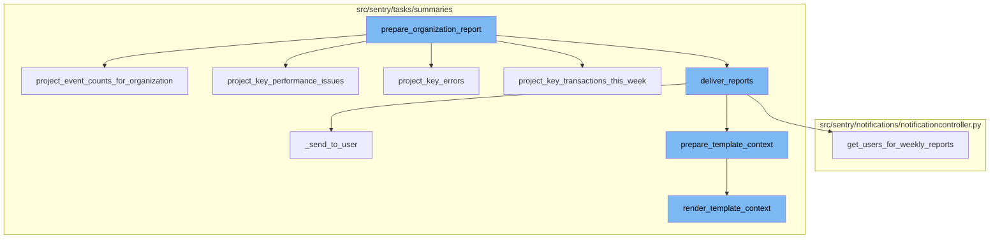
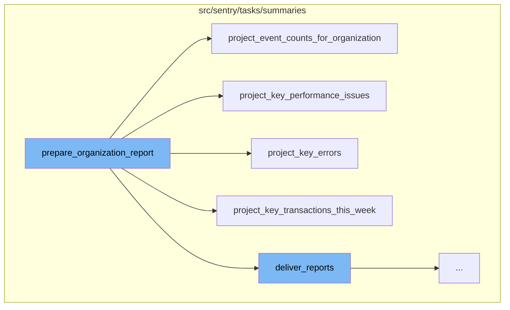
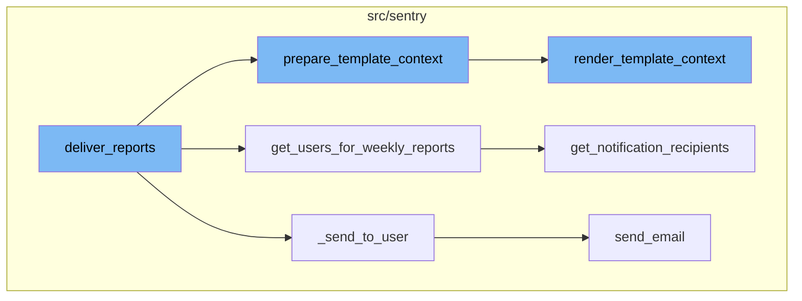

# Overview of prepare_organization_report

The `prepare_organization_report` function is a crucial part of the report preparation process in Sentry. It is responsible for gathering and organizing data related to an organization's events, errors, transactions, and performance issues. This function takes in parameters such as timestamp, duration, organization_id, batch_id, and optional parameters like dry_run, target_user, and email_override. It starts by validating the target user and retrieving the organization details. It then creates an `OrganizationReportContext` object which is used throughout the report preparation process.

# Gathering Data for the Report

The function then calls several other functions to gather data for the report. These functions include `project_event_counts_for_organization`, `project_key_errors`, `project_key_transactions_this_week`, and `project_key_performance_issues`. Each of these functions queries different entities to gather specific data related to the organization's events, errors, transactions, and performance issues.

# Delivering the Report

After gathering all the necessary data, `prepare_organization_report` checks if the report is available. If it is, it proceeds to deliver the reports by calling the `deliver_reports` function. This function checks if there's an email override. If there is, it generates a report for a specific user. If not, it generates reports for all active users in the organization who are not restricted. The function `prepare_template_context` is called to generate the context for the report, which is then sent to the user via the `_send_to_user` function.



# Flow drill down

First, we'll zoom into this section of the flow:



<SwmSnippet path="/src/sentry/tasks/summaries/weekly_reports.py" line="102">

---

# prepare_organization_report

The `prepare_organization_report` function is the main function in the report preparation process. It takes in parameters such as timestamp, duration, organization_id, batch_id, and optional parameters like dry_run, target_user, and email_override. It starts by validating the target user and retrieving the organization details. It then creates an `OrganizationReportContext` object which is used throughout the report preparation process. The function then calls several other functions to gather data for the report, such as `project_event_counts_for_organization`, `project_key_errors`, `project_key_transactions_this_week`, and `project_key_performance_issues`. After gathering all the necessary data, it checks if the report is available. If it is, it proceeds to deliver the reports by calling the `deliver_reports` function.

```python
def prepare_organization_report(
    timestamp: float,
    duration: int,
    organization_id: int,
    batch_id: uuid.UUID,
    dry_run: bool = False,
    target_user: User | None = None,
    email_override: str | None = None,
):
    if target_user and not hasattr(target_user, "id"):
        logger.error(
            "Target user must have an ID",
            extra={
                "batch_id": str(batch_id),
                "organization": organization_id,
                "target_user": target_user,
                "email_override": email_override,
            },
        )
        return
    organization = Organization.objects.get(id=organization_id)
```

---

</SwmSnippet>

<SwmSnippet path="/src/sentry/tasks/summaries/utils.py" line="404">

---

# project_event_counts_for_organization

The `project_event_counts_for_organization` function is called within `prepare_organization_report` to gather event counts for the organization. It queries the outcomes entity to get the outcome, category, and total quantity of events for the given organization and time period. The results are then returned as a list of dictionaries.

```python
def project_event_counts_for_organization(start, end, ctx, referrer: str) -> list[dict[str, Any]]:
    """
    Populates context.projects which is { project_id: ProjectContext }
    """

    def zerofill_data(data):
        return zerofill(data, start, end, ONE_DAY, fill_default=0)

    query = Query(
        match=Entity("outcomes"),
        select=[
            Column("outcome"),
            Column("category"),
            Function("sum", [Column("quantity")], "total"),
        ],
        where=[
            Condition(Column("timestamp"), Op.GTE, start),
            Condition(Column("timestamp"), Op.LT, end + timedelta(days=1)),
            Condition(Column("org_id"), Op.EQ, ctx.organization.id),
            Condition(
                Column("outcome"), Op.IN, [Outcome.ACCEPTED, Outcome.FILTERED, Outcome.RATE_LIMITED]
```

---

</SwmSnippet>

<SwmSnippet path="/src/sentry/tasks/summaries/utils.py" line="225">

---

# project_key_performance_issues

The `project_key_performance_issues` function is used to identify the key performance issues for a project within an organization. It queries the search_issues entity to get the group_id and count of the most frequent events during the last week. The results are then returned as a list of tuples, each containing a group and its count.

```python
def project_key_performance_issues(ctx: OrganizationReportContext, project: Project, referrer: str):
    if not project.first_event:
        return

    prefix = (
        "daily_summary"
        if referrer == Referrer.DAILY_SUMMARY_KEY_PERFORMANCE_ISSUES.value
        else "weekly_reports"
    )
    op = f"{prefix}.project_key_performance_issues"

    with sentry_sdk.start_span(op=op):
        # Pick the 50 top frequent performance issues last seen within a month with the highest event count from all time.
        # Then, we use this to join with snuba, hoping that the top 3 issue by volume counted in snuba would be within this list.
        # We do this to limit the number of group_ids snuba has to join with.
        groups_qs = Group.objects.filter(
            project_id=project.id,
            status=GroupStatus.UNRESOLVED,
            last_seen__gte=ctx.end - timedelta(days=30),
            # performance issue range
            type__gte=1000,
```

---

</SwmSnippet>

<SwmSnippet path="/src/sentry/tasks/summaries/utils.py" line="160">

---

# project_key_errors

The `project_key_errors` function is used to identify the key errors for a project within an organization. It queries the events and group_attributes entities to get the group_id and count of the most frequent error events. The results are then returned as a list of dictionaries.

```python
def project_key_errors(
    ctx: OrganizationReportContext, project: Project, referrer: str
) -> list[dict[str, Any]] | None:
    if not project.first_event:
        return None
    # Take the 3 most frequently occuring events
    prefix = (
        "daily_summary" if referrer == Referrer.DAILY_SUMMARY_KEY_ERRORS.value else "weekly_reports"
    )
    op = f"{prefix}.project_key_errors"

    with sentry_sdk.start_span(op=op):
        events_entity = Entity("events", alias="events")
        group_attributes_entity = Entity("group_attributes", alias="group_attributes")
        query = Query(
            match=Join([Relationship(events_entity, "attributes", group_attributes_entity)]),
            select=[Column("group_id", entity=events_entity), Function("count", [])],
            where=[
                Condition(Column("timestamp", entity=events_entity), Op.GTE, ctx.start),
                Condition(
                    Column("timestamp", entity=events_entity),
```

---

</SwmSnippet>

<SwmSnippet path="/src/sentry/tasks/summaries/utils.py" line="292">

---

# project_key_transactions_this_week

The `project_key_transactions_this_week` function is used to identify the key transactions for a project within an organization during the last week. It queries the transactions entity to get the transaction_name, p95, and count of the most frequent transactions. The results are then returned as a list of dictionaries.

```python
def project_key_transactions_this_week(ctx, project):
    if not project.flags.has_transactions:
        return
    with sentry_sdk.start_span(op="weekly_reports.project_key_transactions"):
        # Take the 3 most frequently occuring transactions this week
        query = Query(
            match=Entity("transactions"),
            select=[
                Column("transaction_name"),
                Function("quantile(0.95)", [Column("duration")], "p95"),
                Function("count", [], "count"),
            ],
            where=[
                Condition(Column("finish_ts"), Op.GTE, ctx.start),
                Condition(Column("finish_ts"), Op.LT, ctx.end + timedelta(days=1)),
                Condition(Column("project_id"), Op.EQ, project.id),
            ],
            groupby=[Column("transaction_name")],
            orderby=[OrderBy(Function("count", []), Direction.DESC)],
            limit=Limit(3),
        )
```

---

</SwmSnippet>

Now, lets zoom into this section of the flow:



<SwmSnippet path="/src/sentry/tasks/summaries/weekly_reports.py" line="252">

---

# Deliver Reports

The `deliver_reports` function is the starting point of the report generation process. It checks if there's an email override. If there is, it generates a report for a specific user. If not, it generates reports for all active users in the organization who are not restricted. The function `prepare_template_context` is called to generate the context for the report, which is then sent to the user via the `_send_to_user` function.

```python
    def deliver_reports(self) -> None:
        """
        For all users in the organization, we generate the template context for the user, and send the email.
        """

        if self.email_override:
            target_user_id = (
                self.target_user.id if self.target_user else None
            )  # if None, generates report for a user with access to all projects
            user_template_context_by_user_id_list = prepare_template_context(
                ctx=self.ctx, user_ids=[target_user_id]
            )
            if user_template_context_by_user_id_list:
                self._send_to_user(user_template_context_by_user_id_list[0])
        else:
            user_list = list(
                OrganizationMember.objects.filter(
                    user_is_active=True,
                    organization_id=self.ctx.organization.id,
                )
                .filter(
```

---

</SwmSnippet>

<SwmSnippet path="/src/sentry/tasks/summaries/weekly_reports.py" line="750">

---

# Prepare Template Context

The `prepare_template_context` function generates the context for the report for each user. It calls the `render_template_context` function to generate the template context for each user. If the template context is not empty, it is added to the list of contexts to be returned.

```python
def prepare_template_context(
    ctx: OrganizationReportContext, user_ids: Sequence[int | None]
) -> list[Mapping[str, Any]] | list:
    user_template_context_by_user_id_list = []
    for user_id in user_ids:
        template_ctx = render_template_context(ctx, user_id)
        if not template_ctx:
            logger.debug(
                "Skipping report for %s to <User: %s>, no qualifying reports to deliver.",
                ctx.organization.id,
                user_id,
            )
            continue
        user_template_context_by_user_id_list.append({"context": template_ctx, "user_id": user_id})
    return user_template_context_by_user_id_list
```

---

</SwmSnippet>

<SwmSnippet path="/src/sentry/tasks/summaries/weekly_reports.py" line="455">

---

# Render Template Context

The `render_template_context` function generates the template context for a user. It includes various sections like trends, key errors, key transactions, key performance issues, and issue summary. Each section is generated by a separate function.

```python
def render_template_context(ctx, user_id: int | None) -> dict[str, Any] | None:
    # Serialize ctx for template, and calculate view parameters (like graph bar heights)
    # Fetch the list of projects associated with the user.
    # Projects owned by teams that the user has membership of.
    if user_id and user_id in ctx.project_ownership:
        user_projects = [
            project_ctx
            for project_ctx in ctx.projects_context_map.values()
            if project_ctx.project.id in ctx.project_ownership[user_id]
        ]
        if len(user_projects) == 0:
            return None
    else:
        # If user is None, or if the user is not a member of the organization, we assume that the email was directed to a user who joined all teams.
        user_projects = ctx.projects_context_map.values()

    notification_uuid = str(uuid.uuid4())

    # Render the first section of the email where we had the table showing the
    # number of accepted/dropped errors/transactions for each project.
    def trends():
```

---

</SwmSnippet>

<SwmSnippet path="/src/sentry/notifications/notificationcontroller.py" line="604">

---

# Get Users for Weekly Reports

The `get_users_for_weekly_reports` function is used to get the list of users who should receive the weekly reports. It calls the `get_notification_recipients` function to get the recipients of the notifications.

```python
    def get_users_for_weekly_reports(self) -> list[int]:
        if not self.organization_id:
            raise Exception("Must specify organization_id")

        if self.type != NotificationSettingEnum.REPORTS:
            raise Exception(f"Type mismatch: the controller was initialized with type: {self.type}")

        recipient_set = self.get_notification_recipients(
            type=NotificationSettingEnum.REPORTS,
            # only look at users
            actor_type=ActorType.USER,
        )[
            ExternalProviders.EMAIL
        ]  # email only
        return [recipient.id for recipient in recipient_set]
```

---

</SwmSnippet>

<SwmSnippet path="/src/sentry/tasks/summaries/weekly_reports.py" line="290">

---

# Send to User

The `_send_to_user` function sends the report to the user. It checks for duplicate delivery and if there's no duplicate, it calls the `send_email` function to send the email.

```python
    def _send_to_user(self, user_template_context: Mapping[str, Any]) -> None:
        template_context: Mapping[str, Any] | None = user_template_context.get("context")
        user_id: int | None = user_template_context.get("user_id")
        if template_context and user_id:
            dupe_check = _DuplicateDeliveryCheck(self, user_id)
            if not dupe_check.check_for_duplicate_delivery():
                self.send_email(template_ctx=template_context, user_id=user_id)
                dupe_check.record_delivery()
```

---

</SwmSnippet>

<SwmSnippet path="/src/sentry/tasks/summaries/weekly_reports.py" line="299">

---

# Send Email

The `send_email` function sends the email to the user. It creates a message with the report and sends it to the user. If there's an email override, it sends the email to the override email. Otherwise, it sends the email to the user's email.

```python
    def send_email(self, template_ctx: Mapping[str, Any], user_id: int) -> None:
        message = MessageBuilder(
            subject=f"Weekly Report for {self.ctx.organization.name}: {date_format(self.ctx.start)} - {date_format(self.ctx.end)}",
            template="sentry/emails/reports/body.txt",
            html_template="sentry/emails/reports/body.html",
            type="report.organization",
            context=template_ctx,
            headers={"X-SMTPAPI": json.dumps({"category": "organization_weekly_report"})},
        )
        if self.dry_run:
            return

        if self.email_override:
            message.send(to=(self.email_override,))
        else:
            analytics.record(
                "weekly_report.sent",
                user_id=user_id,
                organization_id=self.ctx.organization.id,
                notification_uuid=template_ctx["notification_uuid"],
                user_project_count=template_ctx["user_project_count"],
```

---

</SwmSnippet>

&nbsp;

*This is an auto-generated document by Swimm AI 🌊 and has not yet been verified by a human*

<SwmMeta version="3.0.0" repo-id="Z2l0aHViJTNBJTNBc2VudHJ5LWRlbW8lM0ElM0FTd2ltbS1EZW1v" repo-name="sentry-demo" doc-type="flows"><sup>Powered by [Swimm](/)</sup></SwmMeta>
