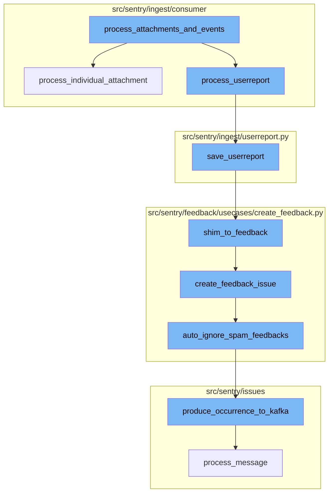
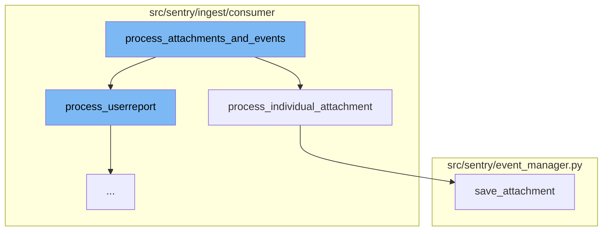
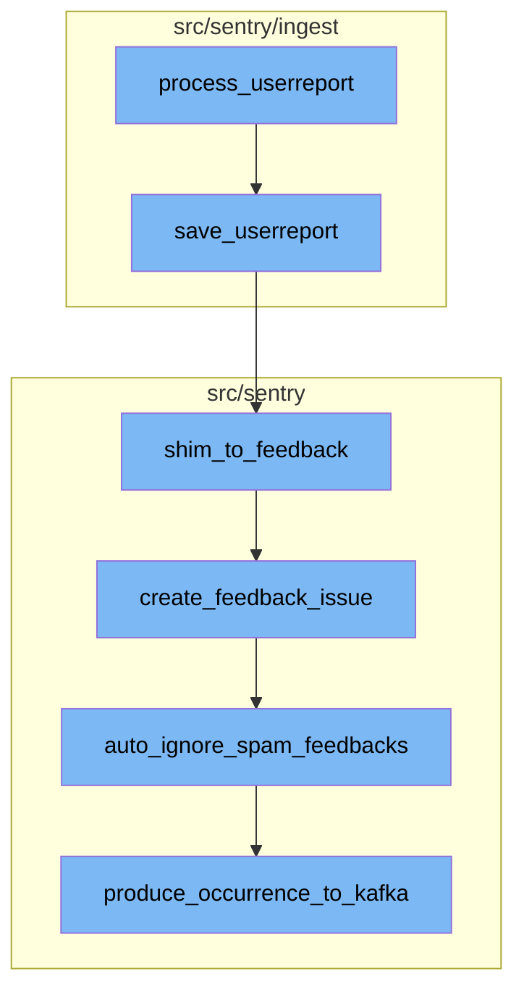

# Overview of process_attachments_and_events

The `process_attachments_and_events` function is a key component in the Sentry error tracking and performance monitoring platform. It serves as the entry point for processing attachments and events. The function takes a raw message and a boolean flag `reprocess_only_stuck_events`, decodes the actual event payload which is in JSON format, performs some initial loadshedding on it, stores the JSON payload in the event processing store, and passes it on to `preprocess_event`, which will schedule a followup task such as `symbolicate_event` or `process_event`.

# Processing Individual Attachments

The `process_individual_attachment` function is called by `process_attachments_and_events` when the message type is 'attachment'. This function processes individual attachments which are not needed for event processing. It fetches the existing group_id, so that the attachment can be fetched by group-level APIs. Then, it retrieves the attachment from the cache and saves it if the attachment type is either 'event.attachment' or 'event.view_hierarchy'.

# Saving Attachments

The `save_attachment` function is called by `process_individual_attachment` to persist a cached event attachment into the file store. It emits one outcome, either ACCEPTED on success or INVALID(missing_chunks) if retrieving the attachment data fails. If the attachment is not rate-limited, it is stored and an ACCEPTED outcome is emitted.

# Processing User Reports

The `process_userreport` function is the first step in the flow. It takes a message and a project as inputs. The function attempts to save the user report and returns a boolean indicating the success of the operation.

# Saving User Reports

The `save_userreport` function is the next step. It saves the user report to the database. If the report already exists, it updates the existing report. If the report is associated with a group, it sends a notification.

# Creating Feedback from User Reports

The `shim_to_feedback` function takes user reports and creates a new User Feedback from it. It tries to grab as much information from the legacy user report and event to create the new feedback.

# Creating Feedback Issues

The `create_feedback_issue` function creates a new feedback issue. It checks if the feedback should be filtered, and if not, it prepares the feedback event and produces an occurrence to Kafka.

# Ignoring Spam Feedbacks

The `auto_ignore_spam_feedbacks` function is used to automatically ignore feedbacks that are identified as spam. It produces a status change to Kafka to set the status of the feedback to ignored.

# Producing Occurrence to Kafka

The `produce_occurrence_to_kafka` function is the final step in the flow. It prepares the payload and sends it to Kafka. If the event stream is not running Kafka, it processes the message directly.



# Flow drill down

First, we'll zoom into this section of the flow:



<SwmSnippet path="/src/sentry/ingest/consumer/attachment_event.py" line="62">

---

# process_attachments_and_events

The `process_attachments_and_events` function is the entry point for processing attachments and events. It takes a raw message and a boolean flag `reprocess_only_stuck_events`. The function first decodes the actual event payload which is in JSON format and performs some initial loadshedding on it. Then, it stores the JSON payload in the event processing store, and passes it on to `preprocess_event`, which will schedule a followup task such as `symbolicate_event` or `process_event`.

```python
def process_attachments_and_events(
    raw_message: Message[IngestMessage], reprocess_only_stuck_events: bool
) -> None:
    """
    The second pass for the `attachments` topic processes *individual* `attachments`
    which are not needed for event processing, and the `event` itself,
    as all attachment chunks those two need have been processed already.

    This will:
    - Decode the actual event payload which is in JSON format and perform some
      initial loadshedding on it.
    - Store the JSON payload in the event processing store, and pass it on to
      `preprocess_event`, which will schedule a followup task such as
      `symbolicate_event` or `process_event`.
    """
    message = raw_message.payload
    message_type = message["type"]
    project_id = message["project_id"]

    try:
        with metrics.timer("ingest_consumer.fetch_project"):
```

---

</SwmSnippet>

<SwmSnippet path="/src/sentry/ingest/consumer/processors.py" line="239">

---

## process_individual_attachment

The `process_individual_attachment` function is called by `process_attachments_and_events` when the message type is 'attachment'. This function processes individual attachments which are not needed for event processing. It fetches the existing group_id, so that the attachment can be fetched by group-level APIs. Then, it retrieves the attachment from the cache and saves it if the attachment type is either 'event.attachment' or 'event.view_hierarchy'.

```python
def process_individual_attachment(message: IngestMessage, project: Project) -> None:
    event_id = message["event_id"]
    cache_key = cache_key_for_event({"event_id": event_id, "project": project.id})

    if not features.has("organizations:event-attachments", project.organization, actor=None):
        logger.info("Organization has no event attachments: %s", project.id)
        return

    if killswitch_matches_context(
        "store.load-shed-pipeline-projects",
        {
            "project_id": project.id,
            "event_id": event_id,
            "has_attachments": True,
        },
    ):
        # This killswitch is for the worst of scenarios and should probably not
        # cause additional load on our logging infrastructure
        return

    try:
```

---

</SwmSnippet>

<SwmSnippet path="/src/sentry/event_manager.py" line="2783">

---

### save_attachment

The `save_attachment` function is called by `process_individual_attachment` to persist a cached event attachment into the file store. It emits one outcome, either ACCEPTED on success or INVALID(missing_chunks) if retrieving the attachment data fails. If the attachment is not rate-limited, it is stored and an ACCEPTED outcome is emitted.

```python
def save_attachment(
    cache_key: str | None,
    attachment: Attachment,
    project: Project,
    event_id: str,
    key_id: int | None = None,
    group_id: int | None = None,
    start_time: float | None = None,
) -> None:
    """
    Persists a cached event attachments into the file store.

    Emits one outcome, either ACCEPTED on success or INVALID(missing_chunks) if
    retrieving the attachment data fails.

    :param cache_key:  The cache key at which the attachment is stored for
                       debugging purposes.
    :param attachment: The ``CachedAttachment`` instance to store.
    :param project:    The project model that this attachment belongs to.
    :param event_id:   Identifier of the event that this attachment belongs to.
                       The event does not have to be stored yet.
```

---

</SwmSnippet>

Now, lets zoom into this section of the flow:



<SwmSnippet path="/src/sentry/ingest/consumer/processors.py" line="306">

---

## Processing User Reports

The `process_userreport` function is the first step in the flow. It takes a message and a project as inputs. The function attempts to save the user report and returns a boolean indicating the success of the operation.

```python
def process_userreport(message: IngestMessage, project: Project) -> bool:
    start_time = to_datetime(message["start_time"])
    feedback = orjson.loads(message["payload"])

    try:
        save_userreport(
            project,
            feedback,
            FeedbackCreationSource.USER_REPORT_ENVELOPE,
            start_time=start_time,
        )
        return True
    except Conflict as e:
        logger.info("Invalid userreport: %s", e)
        return False
    except Exception:
        # XXX(markus): Hotfix because we have broken data in kafka
        # If you want to remove this make sure to have triaged all errors in Sentry
        logger.exception("userreport.save.crash")
        return False
```

---

</SwmSnippet>

<SwmSnippet path="/src/sentry/ingest/userreport.py" line="28">

---

## Saving User Reports

The `save_userreport` function is the next step. It saves the user report to the database. If the report already exists, it updates the existing report. If the report is associated with a group, it sends a notification.

```python
def save_userreport(
    project,
    report,
    source,
    start_time=None,
):
    with metrics.timer("sentry.ingest.userreport.save_userreport"):
        if is_org_in_denylist(project.organization):
            return
        if should_filter_user_report(report["comments"]):
            return

        if start_time is None:
            start_time = timezone.now()

        # XXX(dcramer): enforce case insensitivity by coercing this to a lowercase string
        report["event_id"] = report["event_id"].lower()
        report["project_id"] = project.id

        event = eventstore.backend.get_event_by_id(project.id, report["event_id"])

```

---

</SwmSnippet>

<SwmSnippet path="/src/sentry/feedback/usecases/create_feedback.py" line="304">

---

## Creating Feedback from User Reports

The `shim_to_feedback` function takes user reports and creates a new User Feedback from it. It tries to grab as much information from the legacy user report and event to create the new feedback.

```python
def shim_to_feedback(
    report: UserReportShimDict,
    event: Event | GroupEvent,
    project: Project,
    source: FeedbackCreationSource,
):
    """
    takes user reports from the legacy user report form/endpoint and
    user reports that come from relay envelope ingestion and
    creates a new User Feedback from it.
    User feedbacks are an event type, so we try and grab as much from the
    legacy user report and event to create the new feedback.
    """
    try:
        feedback_event: dict[str, Any] = {
            "contexts": {
                "feedback": {
                    "name": report.get("name", ""),
                    "contact_email": report["email"],
                    "message": report["comments"],
                },
```

---

</SwmSnippet>

<SwmSnippet path="/src/sentry/feedback/usecases/create_feedback.py" line="184">

---

## Creating Feedback Issues

The `create_feedback_issue` function creates a new feedback issue. It checks if the feedback should be filtered, and if not, it prepares the feedback event and produces an occurrence to Kafka.

```python
def create_feedback_issue(event, project_id: int, source: FeedbackCreationSource):
    metrics.incr("feedback.create_feedback_issue.entered")

    if should_filter_feedback(event, project_id, source):
        return

    project = Project.objects.get_from_cache(id=project_id)

    is_message_spam = None
    if features.has(
        "organizations:user-feedback-spam-filter-ingest", project.organization
    ) and project.get_option("sentry:feedback_ai_spam_detection"):
        try:
            is_message_spam = is_spam(event["contexts"]["feedback"]["message"])
        except Exception:
            # until we have LLM error types ironed out, just catch all exceptions
            logger.exception("Error checking if message is spam")
        metrics.incr(
            "feedback.create_feedback_issue.spam_detection",
            tags={"is_spam": is_message_spam},
            sample_rate=1.0,
```

---

</SwmSnippet>

<SwmSnippet path="/src/sentry/feedback/usecases/create_feedback.py" line="360">

---

## Ignoring Spam Feedbacks

The `auto_ignore_spam_feedbacks` function is used to automatically ignore feedbacks that are identified as spam. It produces a status change to Kafka to set the status of the feedback to ignored.

```python
def auto_ignore_spam_feedbacks(project, issue_fingerprint):
    if features.has("organizations:user-feedback-spam-filter-actions", project.organization):
        metrics.incr("feedback.spam-detection-actions.set-ignored")
        produce_occurrence_to_kafka(
            payload_type=PayloadType.STATUS_CHANGE,
            status_change=StatusChangeMessage(
                fingerprint=issue_fingerprint,
                project_id=project.id,
                new_status=GroupStatus.IGNORED,  # we use ignored in the UI for the spam tab
                new_substatus=GroupSubStatus.FOREVER,
            ),
        )
```

---

</SwmSnippet>

<SwmSnippet path="/src/sentry/issues/producer.py" line="50">

---

## Producing Occurrence to Kafka

The `produce_occurrence_to_kafka` function is the final step in the flow. It prepares the payload and sends it to Kafka. If the event stream is not running Kafka, it processes the message directly.

```python
def produce_occurrence_to_kafka(
    payload_type: PayloadType = PayloadType.OCCURRENCE,
    occurrence: IssueOccurrence | None = None,
    status_change: StatusChangeMessage | None = None,
    event_data: dict[str, Any] | None = None,
    is_buffered_spans: bool | None = False,
) -> None:
    if payload_type == PayloadType.OCCURRENCE:
        payload_data = _prepare_occurrence_message(occurrence, event_data, is_buffered_spans)
    elif payload_type == PayloadType.STATUS_CHANGE:
        payload_data = _prepare_status_change_message(status_change)
    else:
        raise NotImplementedError(f"Unknown payload type: {payload_type}")

    if payload_data is None:
        return

    partition_key = None
    if occurrence and occurrence.fingerprint:
        partition_key = occurrence.fingerprint[0].encode()
    elif status_change and status_change.fingerprint:
```

---

</SwmSnippet>

&nbsp;

*This is an auto-generated document by Swimm AI 🌊 and has not yet been verified by a human*

<SwmMeta version="3.0.0" repo-id="Z2l0aHViJTNBJTNBc2VudHJ5LWRlbW8lM0ElM0FTd2ltbS1EZW1v" repo-name="sentry-demo" doc-type="flows"><sup>Powered by [Swimm](/)</sup></SwmMeta>
