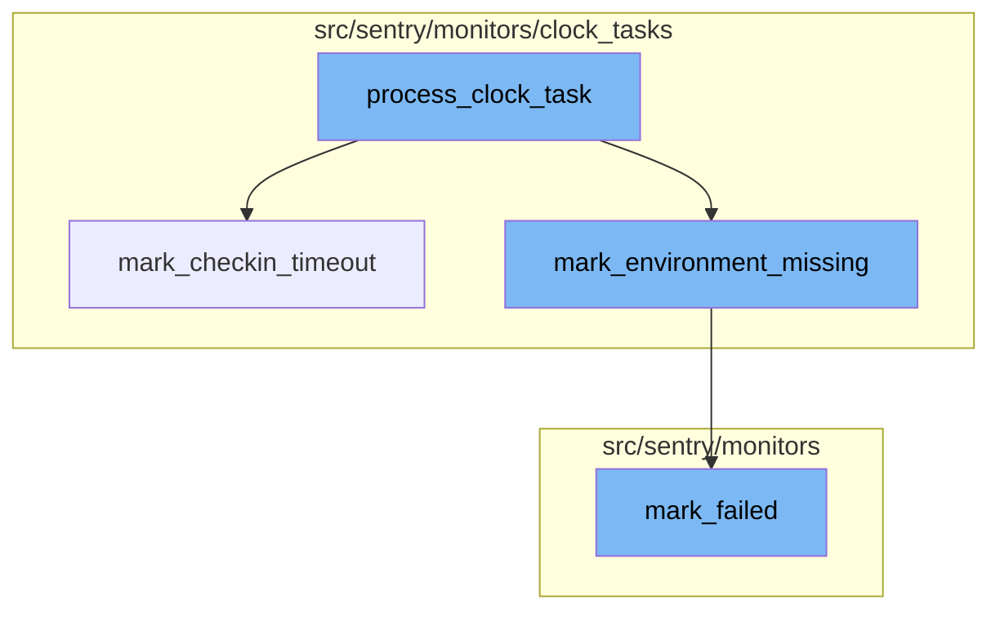

# Overview of process_clock_task

The `process_clock_task` is a function that serves as the entry point for processing clock tasks. It decodes the incoming message and, based on the type of task, it either calls `mark_checkin_timeout` or `mark_environment_missing`.

# mark_checkin_timeout

The `mark_checkin_timeout` function is called when a timeout is detected for a check-in. It updates the status of the check-in to TIMEOUT and if there are no newer check-ins, it calls `mark_failed` to mark the monitor as failed.

# mark_environment_missing

The `mark_environment_missing` function is called when a check-in is missed for a monitor environment. It creates a missed check-in and then calls `mark_failed` to mark the monitor as failed.

# mark_failed

The `mark_failed` function is called when a check-in fails. It updates the monitor environment to failed and triggers side effects for creating monitor incidents and issues.

# Flow drill down



<SwmSnippet path="/src/sentry/monitors/consumers/clock_tasks_consumer.py" line="37">

---

# process_clock_task

The `process_clock_task` function is the entry point for processing clock tasks. It decodes the incoming message and based on the type of task, it either calls `mark_checkin_timeout` or `mark_environment_missing`.

```python
def process_clock_task(message: Message[KafkaPayload | FilteredPayload]):
    assert not isinstance(message.payload, FilteredPayload)
    assert isinstance(message.value, BrokerValue)

    try:
        wrapper = MONITORS_CLOCK_TASKS_CODEC.decode(message.payload.value)
        ts = datetime.fromtimestamp(wrapper["ts"], tz=timezone.utc)

        if is_mark_timeout(wrapper):
            mark_checkin_timeout(int(wrapper["checkin_id"]), ts)
            return

        if is_mark_missing(wrapper):
            mark_environment_missing(int(wrapper["monitor_environment_id"]), ts)
            return

        logger.error("Unsupported clock-tick task type: %s", wrapper["type"])
    except Exception:
        logger.exception("Failed to process clock tick task")
```

---

</SwmSnippet>

<SwmSnippet path="/src/sentry/monitors/clock_tasks/check_timeout.py" line="64">

---

# mark_checkin_timeout

The `mark_checkin_timeout` function is called when a timeout is detected for a check-in. It updates the status of the check-in to TIMEOUT and if there are no newer check-ins, it calls `mark_failed` to mark the monitor as failed.

```python
def mark_checkin_timeout(checkin_id: int, ts: datetime):
    logger.info("checkin_timeout", extra={"checkin_id": checkin_id})

    try:
        checkin = (
            MonitorCheckIn.objects.select_related("monitor_environment")
            .select_related("monitor_environment__monitor")
            .get(id=checkin_id)
        )
    except MonitorCheckIn.DoesNotExist:
        # The monitor may have been deleted or the timeout may have reached
        # it's retention period (less likely)
        metrics.incr("sentry.monitors.tasks.check_timeout.not_found")
        return

    monitor_environment = checkin.monitor_environment
    monitor = monitor_environment.monitor

    affected = (
        MonitorCheckIn.objects.filter(id=checkin_id)
        .exclude(status=CheckInStatus.TIMEOUT)
```

---

</SwmSnippet>

<SwmSnippet path="/src/sentry/monitors/clock_tasks/check_missed.py" line="90">

---

# mark_environment_missing

The `mark_environment_missing` function is called when a check-in is missed for a monitor environment. It creates a missed check-in and then calls `mark_failed` to mark the monitor as failed.

```python
def mark_environment_missing(monitor_environment_id: int, ts: datetime):
    logger.info("mark_missing", extra={"monitor_environment_id": monitor_environment_id})

    try:
        monitor_environment = MonitorEnvironment.objects.select_related("monitor").get(
            IGNORE_MONITORS,
            id=monitor_environment_id,
            # XXX(epurkhiser): Ensure a previous dispatch_check_missing task did
            # not already move the next_checkin_latest forward. This can happen
            # when the clock-ticks happen rapidly and we fire off
            # dispatch_check_missing rapidly (due to a backlog in the
            # ingest-monitors topic)
            next_checkin_latest__lte=ts,
        )
    except MonitorEnvironment.DoesNotExist:
        # Nothing to do. We already handled this miss in an earlier tasks
        # (or the environment was deleted)
        return

    monitor = monitor_environment.monitor
    # next_checkin must be set, since detecting this monitor as missed means
```

---

</SwmSnippet>

<SwmSnippet path="/src/sentry/monitors/logic/mark_failed.py" line="29">

---

# mark_failed

The `mark_failed` function is called when a check-in fails. It updates the monitor environment to failed and triggers side effects for creating monitor incidents and issues.

```python
def mark_failed(
    failed_checkin: MonitorCheckIn,
    ts: datetime,
    received: datetime | None = None,
):
    """
    Given a failing check-in, mark the monitor environment as failed and trigger
    side effects for creating monitor incidents and issues.

    The provided `ts` is the reference time for when the next check-in time is
    calculated from. This typically would be the failed check-in's `date_added`
    or completion time. Though for the missed and timedout tasks this may be
    computed based on the tasks reference time.
    """
    monitor_env = failed_checkin.monitor_environment
    failure_issue_threshold = monitor_env.monitor.config.get("failure_issue_threshold", 1)
    if not failure_issue_threshold:
        failure_issue_threshold = 1

    # Compute the next check-in time from our reference time
    next_checkin = monitor_env.monitor.get_next_expected_checkin(ts)
```

---

</SwmSnippet>

&nbsp;

*This is an auto-generated document by Swimm AI 🌊 and has not yet been verified by a human*

<SwmMeta version="3.0.0" repo-id="Z2l0aHViJTNBJTNBc2VudHJ5LWRlbW8lM0ElM0FTd2ltbS1EZW1v" repo-name="sentry-demo" doc-type="flows"><sup>Powered by [Swimm](/)</sup></SwmMeta>
