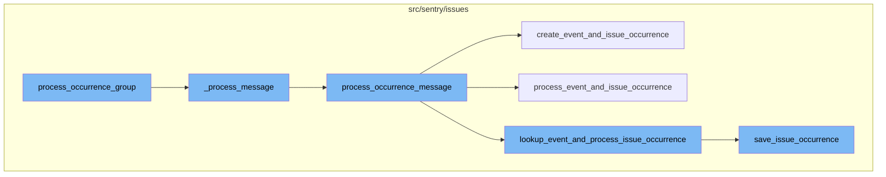

# Overview of process_occurrence_group

The `process_occurrence_group` function is a key part of the Sentry error tracking and performance monitoring platform. It is responsible for processing a group of related occurrences in a serial manner. This function fetches the project and organization from the cache using the project_id from the first item in the list. If the organization has the feature 'occurence-consumer-prune-status-changes', it prunes the status changes from the items. It then processes each item in the list using the `_process_message` function.

# \_process_message

The `_process_message` function is called by `process_occurrence_group` to process a single message. It checks the payload type of the message and based on that, it either processes a status change message or an occurrence message using the `process_status_change_message` or `process_occurrence_message` functions respectively.

# process_occurrence_message

The `process_occurrence_message` function processes an occurrence message. It fetches the project and organization from the cache using the project_id from the occurrence data. It then checks if the group type allows ingestion. If it does, it checks if the event data is present in the kwargs. If it is, it either creates an event and issue occurrence or processes an event and issue occurrence using the `create_event_and_issue_occurrence` or `process_event_and_issue_occurrence` functions respectively. If the event data is not present, it looks up the event and processes the issue occurrence using the `lookup_event_and_process_issue_occurrence` function.

# create_event_and_issue_occurrence

The `create_event_and_issue_occurrence` function creates a lightweight event with a small set of fields that allows us to create occurrences. It then saves the issue occurrence using the `save_issue_occurrence` function.

# process_event_and_issue_occurrence

The `process_event_and_issue_occurrence` function processes an event and issue occurrence. It saves the event from the occurrence using the `save_event_from_occurrence` function and then saves the issue occurrence using the `save_issue_occurrence` function.

# lookup_event_and_process_issue_occurrence

The `lookup_event_and_process_issue_occurrence` function looks up the event using the project_id and event_id from the occurrence data. It then saves the issue occurrence using the `save_issue_occurrence` function.

# save_issue_occurrence

The `save_issue_occurrence` function saves an issue occurrence. It converts the occurrence data to an `IssueOccurrence` object and saves it. It then saves the issue from the occurrence using the `save_issue_from_occurrence` function.

# Flow drill down



<SwmSnippet path="/src/sentry/issues/occurrence_consumer.py" line="413">

---

# process_occurrence_group

The `process_occurrence_group` function processes a group of related occurrences serially. It fetches the project and organization from the cache using the project_id from the first item in the list. If the organization has the feature 'occurence-consumer-prune-status-changes', it prunes the status changes from the items. It then processes each item in the list using the `_process_message` function.

```python
def process_occurrence_group(items: list[Mapping[str, Any]]) -> None:
    """
    Process a group of related occurrences (all part of the same group)
    completely serially.
    """

    try:
        project = Project.objects.get_from_cache(id=items[0]["project_id"])
        organization = Organization.objects.get_from_cache(id=project.organization_id)
    except Exception:
        logger.exception("Failed to fetch project or organization")
        organization = None
    if organization and features.has(
        "organizations:occurence-consumer-prune-status-changes", organization
    ):
        status_changes = [
            item for item in items if item.get("payload_type") == PayloadType.STATUS_CHANGE.value
        ]

        if status_changes:
            items = [
```

---

</SwmSnippet>

<SwmSnippet path="/src/sentry/issues/occurrence_consumer.py" line="335">

---

# \_process_message

The `_process_message` function processes a single message. It checks the payload type of the message and based on that, it either processes a status change message or an occurrence message using the `process_status_change_message` or `process_occurrence_message` functions respectively.

```python
def _process_message(
    message: Mapping[str, Any]
) -> tuple[IssueOccurrence | None, GroupInfo | None] | None:
    """
    :raises InvalidEventPayloadError: when the message is invalid
    :raises EventLookupError: when the provided event_id in the message couldn't be found.
    """
    with sentry_sdk.start_transaction(
        op="_process_message",
        name="issues.occurrence_consumer",
        sampled=True,
    ) as txn:
        try:
            # Messages without payload_type default to an OCCURRENCE payload
            payload_type = message.get("payload_type", PayloadType.OCCURRENCE.value)
            if payload_type == PayloadType.STATUS_CHANGE.value:
                group = process_status_change_message(message, txn)
                if not group:
                    return None

                return None, GroupInfo(group=group, is_new=False, is_regression=False)
```

---

</SwmSnippet>

<SwmSnippet path="/src/sentry/issues/occurrence_consumer.py" line="280">

---

# process_occurrence_message

The `process_occurrence_message` function processes an occurrence message. It fetches the project and organization from the cache using the project_id from the occurrence data. It then checks if the group type allows ingestion. If it does, it checks if the event data is present in the kwargs. If it is, it either creates an event and issue occurrence or processes an event and issue occurrence using the `create_event_and_issue_occurrence` or `process_event_and_issue_occurrence` functions respectively. If the event data is not present, it looks up the event and processes the issue occurrence using the `lookup_event_and_process_issue_occurrence` function.

```python
def process_occurrence_message(
    message: Mapping[str, Any], txn: Transaction | NoOpSpan | Span
) -> tuple[IssueOccurrence, GroupInfo | None] | None:
    with metrics.timer("occurrence_consumer._process_message._get_kwargs"):
        kwargs = _get_kwargs(message)
    occurrence_data = kwargs["occurrence_data"]
    metric_tags = {"occurrence_type": occurrence_data["type"]}
    is_buffered_spans = kwargs.get("is_buffered_spans", False)

    metrics.incr(
        "occurrence_ingest.messages",
        sample_rate=1.0,
        tags=metric_tags,
    )
    txn.set_tag("occurrence_type", occurrence_data["type"])

    project = Project.objects.get_from_cache(id=occurrence_data["project_id"])
    organization = Organization.objects.get_from_cache(id=project.organization_id)

    txn.set_tag("organization_id", organization.id)
    txn.set_tag("organization_slug", organization.slug)
```

---

</SwmSnippet>

<SwmSnippet path="/src/sentry/issues/occurrence_consumer.py" line="88">

---

# create_event_and_issue_occurrence

The `create_event_and_issue_occurrence` function creates a lightweight event with a small set of fields that allows us to create occurrences. It then saves the issue occurrence using the `save_issue_occurrence` function.

```python
def create_event_and_issue_occurrence(
    occurrence_data: IssueOccurrenceData, event_data: dict[str, Any]
) -> tuple[IssueOccurrence, GroupInfo | None]:
    """With standalone span ingestion, we won't be storing events in
    nodestore, so instead we create a light-weight event with a small
    set of fields that lets us create occurrences.
    """
    project_id = occurrence_data["project_id"]
    event_id = occurrence_data["event_id"]
    if occurrence_data["event_id"] != event_data["event_id"]:
        raise ValueError(
            f"event_id in occurrence({occurrence_data['event_id']}) is different from event_id in event_data({event_data['event_id']})"
        )

    event = create_event(project_id, event_id, event_data)

    with metrics.timer(
        "occurrence_consumer._process_message.save_issue_occurrence",
        tags={"method": "create_event_and_issue_occurrence"},
    ):
        return save_issue_occurrence(occurrence_data, event)
```

---

</SwmSnippet>

<SwmSnippet path="/src/sentry/issues/occurrence_consumer.py" line="111">

---

# process_event_and_issue_occurrence

The `process_event_and_issue_occurrence` function processes an event and issue occurrence. It saves the event from the occurrence using the `save_event_from_occurrence` function and then saves the issue occurrence using the `save_issue_occurrence` function.

```python
def process_event_and_issue_occurrence(
    occurrence_data: IssueOccurrenceData, event_data: dict[str, Any]
) -> tuple[IssueOccurrence, GroupInfo | None]:
    if occurrence_data["event_id"] != event_data["event_id"]:
        raise ValueError(
            f"event_id in occurrence({occurrence_data['event_id']}) is different from event_id in event_data({event_data['event_id']})"
        )

    event = save_event_from_occurrence(event_data)
    with metrics.timer(
        "occurrence_consumer._process_message.save_issue_occurrence",
        tags={"method": "process_event_and_issue_occurrence"},
    ):
        return save_issue_occurrence(occurrence_data, event)
```

---

</SwmSnippet>

<SwmSnippet path="/src/sentry/issues/occurrence_consumer.py" line="127">

---

# lookup_event_and_process_issue_occurrence

The `lookup_event_and_process_issue_occurrence` function looks up the event using the project_id and event_id from the occurrence data. It then saves the issue occurrence using the `save_issue_occurrence` function.

```python
def lookup_event_and_process_issue_occurrence(
    occurrence_data: IssueOccurrenceData,
) -> tuple[IssueOccurrence, GroupInfo | None]:
    project_id = occurrence_data["project_id"]
    event_id = occurrence_data["event_id"]
    try:
        event = lookup_event(project_id, event_id)
    except Exception:
        raise EventLookupError(f"Failed to lookup event({event_id}) for project_id({project_id})")

    with metrics.timer(
        "occurrence_consumer._process_message.save_issue_occurrence",
        tags={"method": "lookup_event_and_process_issue_occurrence"},
    ):
        return save_issue_occurrence(occurrence_data, event)
```

---

</SwmSnippet>

<SwmSnippet path="/src/sentry/issues/ingest.py" line="42">

---

# save_issue_occurrence

The `save_issue_occurrence` function saves an issue occurrence. It converts the occurrence data to an `IssueOccurrence` object and saves it. It then saves the issue from the occurrence using the `save_issue_from_occurrence` function.

```python
def save_issue_occurrence(
    occurrence_data: IssueOccurrenceData, event: Event
) -> tuple[IssueOccurrence, GroupInfo | None]:
    # Convert occurrence data to `IssueOccurrence`
    occurrence = IssueOccurrence.from_dict(occurrence_data)
    if occurrence.event_id != event.event_id:
        raise ValueError("IssueOccurrence must have the same event_id as the passed Event")
    # Note: For now we trust the project id passed along with the event. Later on we should make
    # sure that this is somehow validated.
    occurrence.save()

    try:
        release = Release.get(event.project, event.release)
    except Release.DoesNotExist:
        # The release should always exist here since event has been ingested at this point, but just
        # in case it has been deleted
        release = None
    group_info = save_issue_from_occurrence(occurrence, event, release)
    if group_info:
        environment = event.get_environment()
        _get_or_create_group_environment(environment, release, [group_info])
```

---

</SwmSnippet>

&nbsp;

*This is an auto-generated document by Swimm AI 🌊 and has not yet been verified by a human*

<SwmMeta version="3.0.0" repo-id="Z2l0aHViJTNBJTNBc2VudHJ5LWRlbW8lM0ElM0FTd2ltbS1EZW1v" repo-name="sentry-demo" doc-type="flows"><sup>Powered by [Swimm](/)</sup></SwmMeta>
