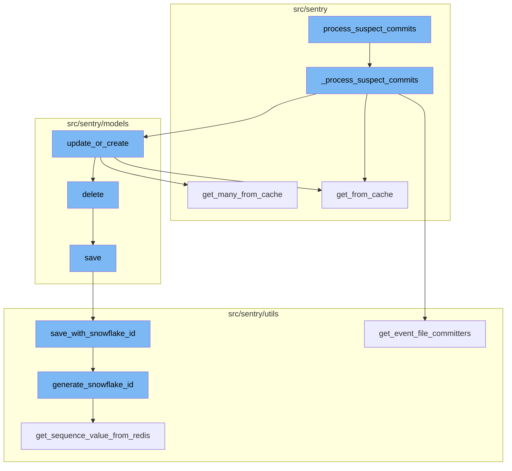
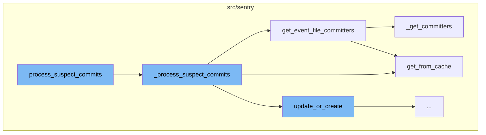
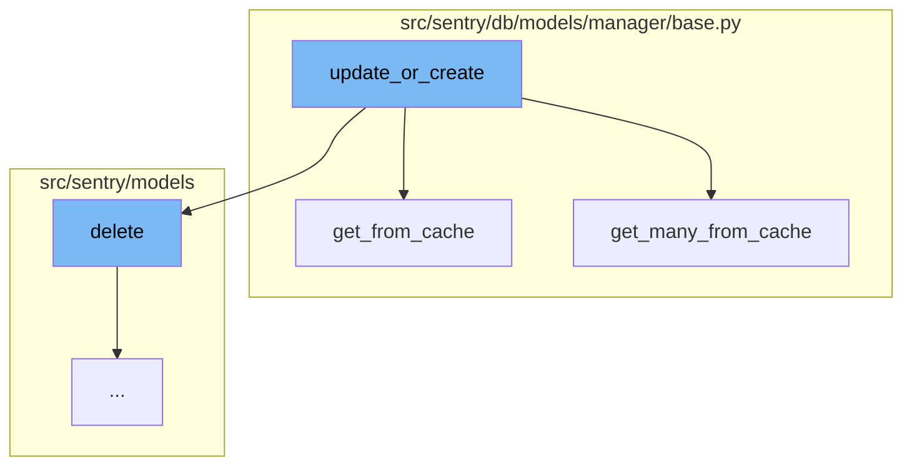
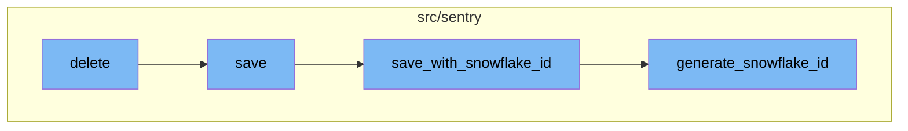

# Overview of process_suspect_commits

The `process_suspect_commits` function is a part of Sentry's error tracking and performance monitoring platform. It is designed to identify and process suspect commits in a project. The function works by acquiring a lock and then calling the `_process_suspect_commits` function with the provided arguments.

# The \_process_suspect_commits Function

`_process_suspect_commits` is the main function in the flow. It starts by incrementing a metric and setting the current event project. It then retrieves the project and group owners from the cache. If the number of owners is above a certain limit, it aborts the process. Otherwise, it retrieves the committers for the event and updates the group owners based on the committers' scores.

# The get_event_file_committers Function

`get_event_file_committers` is called within `_process_suspect_commits`. It retrieves the group and its associated releases and commits from the cache. It then processes the event frames and matches the commits to the file paths in the frames. The function returns a list of authors and their associated commits.

# The update_or_create Function

The `update_or_create` function checks if a rule already exists for the organization. If it does, it updates the rule's end date, number of samples, and sample rate, and then saves the rule. If no rule exists, it creates a new one using the provided parameters, saves it, and assigns a rule id. If the id exceeds the maximum allowed rules, it deletes the rule and raises an exception.

# The delete Function

The `delete` function is responsible for removing a project. It first removes the notification settings for the project and then saves the project in an outbox for update before deleting it.

# The save Function

The `save` function is used to save the project. If the project doesn't have a slug, it generates one. If the Sentry is using Snowflake, it saves the project with a Snowflake ID, otherwise, it just saves the project.

# The save_with_snowflake_id Function

The `save_with_snowflake_id` function is used to save an instance of a model with a Snowflake ID. It generates a Snowflake ID if the instance doesn't have one and then tries to save the instance. If there's an integrity error, it resets the instance ID and raises an error.

# The generate_snowflake_id Function

The `generate_snowflake_id` function is used to generate a Snowflake ID. It creates a unique ID based on the current time, region, and a sequence value from Redis. This ID is then validated before being returned.



# Flow drill down

First, we'll zoom into this section of the flow:



<SwmSnippet path="/src/sentry/tasks/groupowner.py" line="149">

---

# process_suspect_commits Flow

The `process_suspect_commits` function is the entry point of the flow. It acquires a lock and calls the `_process_suspect_commits` function with the provided arguments.

```python
def process_suspect_commits(
    event_id,
    event_platform,
    event_frames,
    group_id,
    project_id,
    sdk_name=None,
    **kwargs,
):
    lock = locks.get(
        f"process-suspect-commits:{group_id}", duration=10, name="process_suspect_commits"
    )
    try:
        with lock.acquire():
            _process_suspect_commits(
                event_id,
                event_platform,
                event_frames,
                group_id,
                project_id,
                sdk_name,
```

---

</SwmSnippet>

<SwmSnippet path="/src/sentry/tasks/groupowner.py" line="29">

---

`_process_suspect_commits` is the main function in the flow. It starts by incrementing a metric and setting the current event project. It then retrieves the project and group owners from the cache. If the number of owners is above a certain limit, it aborts the process. Otherwise, it retrieves the committers for the event and updates the group owners based on the committers' scores.

```python
def _process_suspect_commits(
    event_id, event_platform, event_frames, group_id, project_id, sdk_name=None, **kwargs
):
    metrics.incr("sentry.tasks.process_suspect_commits.start")
    set_current_event_project(project_id)

    cache_key = DEBOUNCE_CACHE_KEY(group_id)

    project = Project.objects.get_from_cache(id=project_id)
    owners = GroupOwner.objects.filter(
        group_id=group_id,
        project=project,
        organization_id=project.organization_id,
        type=GroupOwnerType.SUSPECT_COMMIT.value,
    )
    owner_count = owners.count()
    if owner_count >= PREFERRED_GROUP_OWNERS:
        owners = owners.filter(date_added__lte=timezone.now() - PREFERRED_GROUP_OWNER_AGE).order_by(
            "-date_added"
        )
        if not owners.exists():
```

---

</SwmSnippet>

<SwmSnippet path="/src/sentry/utils/committers.py" line="232">

---

`get_event_file_committers` is called within `_process_suspect_commits`. It retrieves the group and its associated releases and commits from the cache. It then processes the event frames and matches the commits to the file paths in the frames. The function returns a list of authors and their associated commits.

```python
def get_event_file_committers(
    project: Project,
    group_id: int,
    event_frames: Sequence[Mapping[str, Any]],
    event_platform: str,
    frame_limit: int = 25,
    sdk_name: str | None = None,
) -> Sequence[AuthorCommits]:
    group = Group.objects.get_from_cache(id=group_id)

    first_release_version = group.get_first_release()
    if not first_release_version:
        raise Release.DoesNotExist

    releases = get_previous_releases(project, first_release_version)
    if not releases:
        raise Release.DoesNotExist

    commits = _get_commits(releases)
    if not commits:
        raise Commit.DoesNotExist
```

---

</SwmSnippet>

<SwmSnippet path="/src/sentry/db/models/manager/base.py" line="281">

---

`get_from_cache` is a utility function used multiple times in the flow. It retrieves an object from the cache based on provided key-value pairs. If the object is not in the cache, it retrieves it from the database and stores it in the cache for future use.

```python
    def get_from_cache(
        self, use_replica: bool = settings.SENTRY_MODEL_CACHE_USE_REPLICA, **kwargs: Any
    ) -> M:
        """
        Wrapper around QuerySet.get which supports caching of the
        intermediate value.  Callee is responsible for making sure
        the cache key is cleared on save.
        """
        if not self.cache_fields:
            raise ValueError("We cannot cache this query. Just hit the database.")

        key, pk_name, value = self._get_cacheable_kv_from_kwargs(kwargs)
        if key not in self.cache_fields and key != pk_name:
            raise ValueError("We cannot cache this query. Just hit the database.")

        cache_key = self.__get_lookup_cache_key(**{key: value})
        local_cache = self._get_local_cache()

        def validate_result(inst: Any) -> M:
            if isinstance(inst, self.model) and (key != pk_name or int(value) == inst.pk):
                return inst
```

---

</SwmSnippet>

<SwmSnippet path="/src/sentry/utils/committers.py" line="149">

---

`_get_committers` is called within `get_event_file_committers`. It processes the annotated frames and commits, and returns a list of authors and their associated commits.

```python
def _get_committers(
    annotated_frames: Sequence[AnnotatedFrame],
    commits: Sequence[tuple[Commit, int]],
) -> Sequence[AuthorCommits]:
    # extract the unique committers and return their serialized sentry accounts
    committers: MutableMapping[int, int] = defaultdict(int)

    # organize them by this heuristic (first frame is worth 5 points, second is worth 4, etc.)
    limit = 5
    for annotated_frame in annotated_frames:
        if limit == 0:
            break
        for commit, score in annotated_frame["commits"]:
            if not commit.author_id:
                continue
            committers[commit.author_id] += limit
            limit -= 1
            if limit == 0:
                break

    author_users: Mapping[str, Author] = get_users_for_commits([c for c, _ in commits])
```

---

</SwmSnippet>

Now, lets zoom into this section of the flow:



<SwmSnippet path="/src/sentry/models/dynamicsampling.py" line="163">

---

# process_suspect_commits Flow

The `update_or_create` function is the first step in the focused flow. It checks if a rule already exists for the organization. If it does, it updates the rule's end date, number of samples, and sample rate, and then saves the rule. If no rule exists, it creates a new one using the provided parameters, saves it, and assigns a rule id. If the id exceeds the maximum allowed rules, it deletes the rule and raises an exception. If the rule is not at the organization level, it assigns the rule to the projects.

```python
    def update_or_create(
        condition: Any,
        start: datetime,
        end: datetime,
        project_ids: Sequence[int],
        organization_id: int,
        num_samples: int,
        sample_rate: float,
        query: str,
        created_by_id: int | None = None,
    ) -> CustomDynamicSamplingRule:
        from sentry.models.organization import Organization
        from sentry.models.project import Project

        with transaction.atomic(router.db_for_write(CustomDynamicSamplingRule)):
            # check if rule already exists for this organization
            existing_rule = CustomDynamicSamplingRule.get_rule_for_org(
                condition, organization_id, project_ids
            )

            if existing_rule is not None:
```

---

</SwmSnippet>

<SwmSnippet path="/src/sentry/db/models/manager/base.py" line="281">

---

The `get_from_cache` function is called within `update_or_create`. It's a wrapper around QuerySet.get which supports caching of the intermediate value. It checks if the cache key is cleared on save. If the key is not in the cache fields, it raises a ValueError. If the key is in the cache fields, it gets the value from the cache. If the value is not in the cache, it gets the value from the database and stores it in the cache.

```python
    def get_from_cache(
        self, use_replica: bool = settings.SENTRY_MODEL_CACHE_USE_REPLICA, **kwargs: Any
    ) -> M:
        """
        Wrapper around QuerySet.get which supports caching of the
        intermediate value.  Callee is responsible for making sure
        the cache key is cleared on save.
        """
        if not self.cache_fields:
            raise ValueError("We cannot cache this query. Just hit the database.")

        key, pk_name, value = self._get_cacheable_kv_from_kwargs(kwargs)
        if key not in self.cache_fields and key != pk_name:
            raise ValueError("We cannot cache this query. Just hit the database.")

        cache_key = self.__get_lookup_cache_key(**{key: value})
        local_cache = self._get_local_cache()

        def validate_result(inst: Any) -> M:
            if isinstance(inst, self.model) and (key != pk_name or int(value) == inst.pk):
                return inst
```

---

</SwmSnippet>

<SwmSnippet path="/src/sentry/db/models/manager/base.py" line="360">

---

The `get_many_from_cache` function is also called within `update_or_create`. It's a wrapper around `QuerySet.filter(pk__in=values)` which supports caching of the intermediate value. It checks if the cache key is cleared on save. If the key is not in the cache fields, it raises a ValueError. If the key is in the cache fields, it gets the values from the cache. If the values are not in the cache, it gets the values from the database and stores them in the cache.

```python
    def get_many_from_cache(self, values: Collection[str | int], key: str = "pk") -> Sequence[Any]:
        """
        Wrapper around `QuerySet.filter(pk__in=values)` which supports caching of
        the intermediate value.  Callee is responsible for making sure the
        cache key is cleared on save.

        NOTE: We can only query by primary key or some other unique identifier.
        It is not possible to e.g. run `Project.objects.get_many_from_cache([1,
        2, 3], key="organization_id")` and get back all projects belonging to
        those orgs. The length of the return value is bounded by the length of
        `values`.

        For most models, if one attempts to use a non-PK value this will just
        degrade to a DB query, like with `get_from_cache`.
        """

        pk_name = self.model._meta.pk.name

        if key == "pk":
            key = pk_name

```

---

</SwmSnippet>

Now, lets zoom into this section of the flow:



<SwmSnippet path="/src/sentry/models/project.py" line="722">

---

# Deletion of Project

The `delete` function is responsible for removing a project. It first removes the notification settings for the project and then saves the project in an outbox for update before deleting it.

```python
    def delete(self, **kwargs):
        # There is no foreign key relationship so we have to manually cascade.
        notifications_service.remove_notification_settings_for_project(project_id=self.id)

        with outbox_context(transaction.atomic(router.db_for_write(Project))):
            Project.outbox_for_update(self.id, self.organization_id).save()
            return super().delete(**kwargs)
```

---

</SwmSnippet>

<SwmSnippet path="/src/sentry/models/project.py" line="365">

---

# Saving the Project

The `save` function is used to save the project. If the project doesn't have a slug, it generates one. If the Sentry is using Snowflake, it saves the project with a Snowflake ID, otherwise, it just saves the project.

```python
    def save(self, *args, **kwargs):
        if not self.slug:
            lock = locks.get(
                f"slug:project:{self.organization_id}", duration=5, name="project_slug"
            )
            with TimedRetryPolicy(10)(lock.acquire):
                slugify_instance(
                    self,
                    self.name,
                    organization=self.organization,
                    reserved=RESERVED_PROJECT_SLUGS,
                    max_length=50,
                )

        if SENTRY_USE_SNOWFLAKE:
            snowflake_redis_key = "project_snowflake_key"
            save_with_snowflake_id(
                instance=self,
                snowflake_redis_key=snowflake_redis_key,
                save_callback=lambda: super(Project, self).save(*args, **kwargs),
            )
```

---

</SwmSnippet>

<SwmSnippet path="/src/sentry/utils/snowflake.py" line="47">

---

# Saving with Snowflake ID

The `save_with_snowflake_id` function is used to save an instance of a model with a Snowflake ID. It generates a Snowflake ID if the instance doesn't have one and then tries to save the instance. If there's an integrity error, it resets the instance ID and raises an error.

```python
def save_with_snowflake_id(
    instance: BaseModel, snowflake_redis_key: str, save_callback: Callable[[], object]
) -> None:
    assert uses_snowflake_id(
        instance.__class__
    ), "Only models decorated with uses_snowflake_id can be saved with save_with_snowflake_id()"

    for _ in range(settings.MAX_REDIS_SNOWFLAKE_RETRY_COUNTER):
        if not instance.id:
            instance.id = generate_snowflake_id(snowflake_redis_key)
        try:
            with enforce_constraints(transaction.atomic(using=router.db_for_write(type(instance)))):
                save_callback()
            return
        except IntegrityError:
            instance.id = None  # type: ignore[assignment]  # see typeddjango/django-stubs#2014
    raise MaxSnowflakeRetryError
```

---

</SwmSnippet>

<SwmSnippet path="/src/sentry/utils/snowflake.py" line="113">

---

# Generating Snowflake ID

The `generate_snowflake_id` function is used to generate a Snowflake ID. It creates a unique ID based on the current time, region, and a sequence value from Redis. This ID is then validated before being returned.

```python
def generate_snowflake_id(redis_key: str) -> int:
    segment_values = {}

    segment_values[VERSION_ID] = msb_0_ordering(settings.SNOWFLAKE_VERSION_ID, VERSION_ID.length)

    try:
        segment_values[REGION_ID] = get_local_region().snowflake_id
    except RegionContextError:  # expected if running in monolith mode
        segment_values[REGION_ID] = NULL_REGION_ID

    current_time = datetime.now().timestamp()
    # supports up to 130 years
    segment_values[TIME_DIFFERENCE] = int(current_time - settings.SENTRY_SNOWFLAKE_EPOCH_START)

    snowflake_id = 0
    (
        segment_values[TIME_DIFFERENCE],
        segment_values[REGION_SEQUENCE],
    ) = get_sequence_value_from_redis(redis_key, segment_values[TIME_DIFFERENCE])

    for segment in BIT_SEGMENT_SCHEMA:
```

---

</SwmSnippet>

&nbsp;

*This is an auto-generated document by Swimm AI 🌊 and has not yet been verified by a human*

<SwmMeta version="3.0.0" repo-id="Z2l0aHViJTNBJTNBc2VudHJ5LWRlbW8lM0ElM0FTd2ltbS1EZW1v" repo-name="sentry-demo" doc-type="flows"><sup>Powered by [Swimm](/)</sup></SwmMeta>
