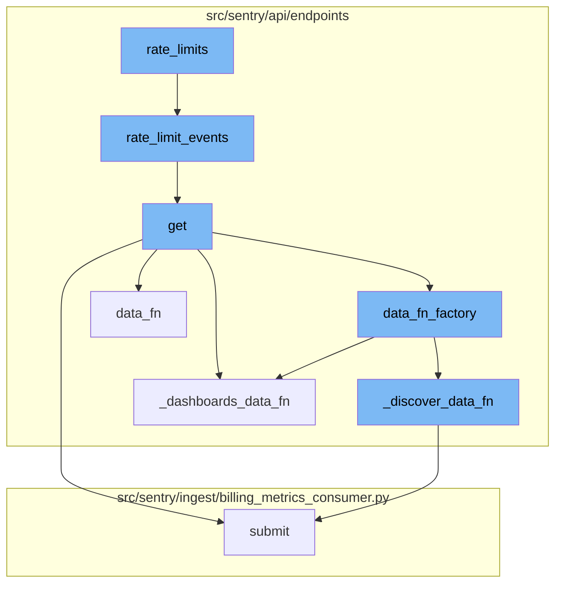
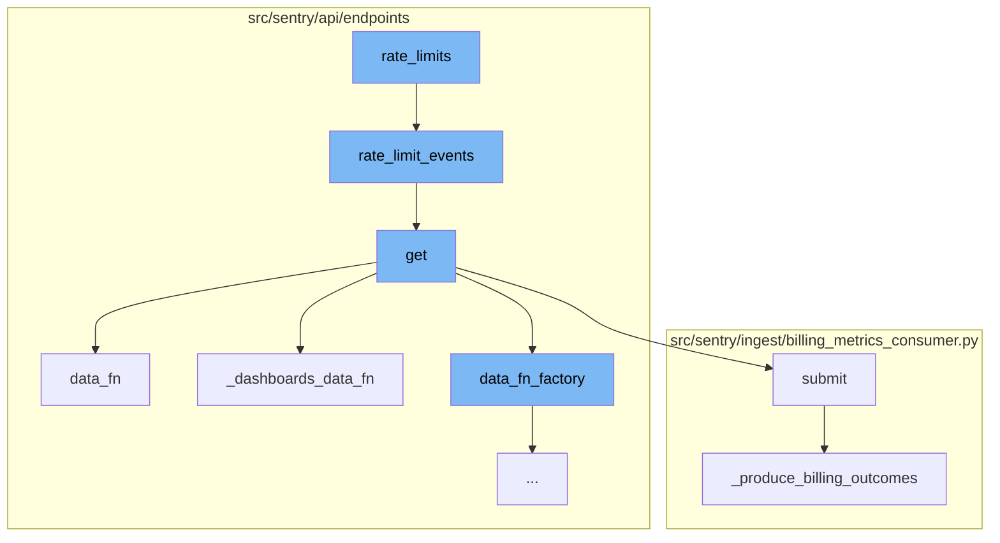
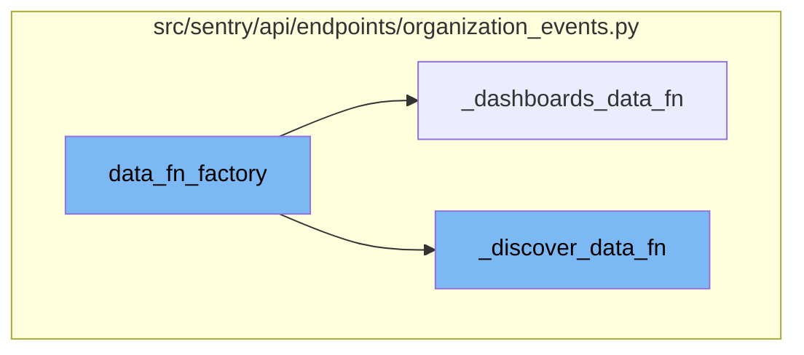

<SwmSnippet path="/src/sentry/api/endpoints/organization_events.py" line="215">

---

# Rate Limits

The `rate_limits` function is a simple wrapper that calls the `rate_limit_events` function. It's used to enforce rate limits on certain operations to prevent abuse or overuse of resources.

```python
    enforce_rate_limit = True

    def rate_limits(*args, **kwargs) -> dict[str, dict[RateLimitCategory, RateLimit]]:
        return rate_limit_events(*args, **kwargs)
```

---

</SwmSnippet>

<SwmSnippet path="/src/sentry/api/endpoints/organization_events.py" line="137">

---

The `rate_limit_events` function is where the actual rate limiting logic resides. It checks the organization's rate limit configuration and returns the appropriate rate limit. It also handles cases where the organization does not exist or has specific rate limit settings.

````python
def rate_limit_events(
    request: Request, organization_id_or_slug: str | None = None, *args, **kwargs
) -> dict[str, dict[RateLimitCategory, RateLimit]]:
    """
    Decision tree for rate limiting for organization events endpoint.
    ```mermaid
     flowchart TD
         A[Get organization] --> B{Organization\nexists}
         B -->|No| C[Return legacy rate limit]
         B -->|Yes| D{Organization\nin increased\nrate limit}
         D -->|Yes| E[Return increased rate limit]
         D -->|No| F{Organization in\nreduced limit\nroll-out}
         F -->|Yes| G[Return reduced rate limit]
         F -->|No| H[Return legacy rate limit]
     ```
    """

    def _config_for_limit(limit: RateLimit) -> dict[str, dict[RateLimitCategory, RateLimit]]:
        return {
            "GET": {
                RateLimitCategory.IP: limit,
````

---

</SwmSnippet>

<SwmSnippet path="/src/sentry/api/endpoints/organization_events.py" line="276">

---

# Handling Requests

The `get` function handles incoming requests. It uses several helper functions (`_data_fn`, `_dashboards_data_fn`, `_discover_data_fn`, `data_fn_factory`) to process the request based on its parameters and the organization's settings. These functions handle different scenarios like querying data, handling dashboard data, and handling discover data.

```python
    def get(self, request: Request, organization) -> Response:
        """
        Retrieves discover (also known as events) data for a given organization.

        **Eventsv2 Deprecation Note**: Users who may be using the `eventsv2` endpoint should update their requests to the `events` endpoint outline in this document.
        The `eventsv2` endpoint is not a public endpoint and has no guaranteed availability. If you are not making any API calls to `eventsv2`, you can safely ignore this.
        Changes between `eventsv2` and `events` include:
        - Field keys in the response now match the keys in the requested `field` param exactly.
        - The `meta` object in the response now shows types in the nested `field` object.

        Aside from the url change, there are no changes to the request payload itself.

        **Note**: This endpoint is intended to get a table of results, and is not for doing a full export of data sent to
        Sentry.

        The `field` query parameter determines what fields will be selected in the `data` and `meta` keys of the endpoint response.
        - The `data` key contains a list of results row by row that match the `query` made
        - The `meta` key contains information about the response, including the unit or type of the fields requested
        """
        if not self.has_feature(organization, request):
            return Response(status=404)
```

---

</SwmSnippet>

<SwmSnippet path="/src/sentry/ingest/billing_metrics_consumer.py" line="77">

---

# Submitting Metrics

The `submit` function is used to process incoming messages. It extracts the payload from the message and then calls the `_produce_billing_outcomes` function to produce billing outcomes based on the payload.

```python
    def submit(self, message: Message[KafkaPayload]) -> None:
        assert not self.__closed

        payload = self._get_payload(message)

        self._produce_billing_outcomes(payload)
        self._flag_metric_received_for_project(payload)

        self.__next_step.submit(message)
```

---

</SwmSnippet>

<SwmSnippet path="/src/sentry/ingest/billing_metrics_consumer.py" line="124">

---

The `_produce_billing_outcomes` function is responsible for producing billing outcomes. It counts the processed items and produces a billing outcome for each category.

```python
    def _produce_billing_outcomes(self, generic_metric: GenericMetric) -> None:
        for category, quantity in self._count_processed_items(generic_metric).items():
            self._produce_billing_outcome(
                org_id=generic_metric["org_id"],
                project_id=generic_metric["project_id"],
                category=category,
                quantity=quantity,
            )
```

---

</SwmSnippet>

<SwmSnippet path="/src/sentry/api/endpoints/organization_events.py" line="552">

---

# Rate Limits Flow

The `data_fn_factory` function is the starting point of the rate limits flow. It takes a `scopedDataset` as an argument and defines a function `fn` that is returned at the end. This function is used to make an additional request to the errors dataset in case the request is from a dashboard widget or a discover query.

```python
        def data_fn_factory(scopedDataset):
            """
            This factory closes over query and dataset in order to make an additional request to the errors dataset
            in the case that this request is from a dashboard widget or a discover query and we're trying to split
            their discover dataset.

            This should be removed once the discover dataset is completely split in dashboards and discover.
            """
            scoped_query = request.GET.get("query")
            dashboard_widget_id = request.GET.get("dashboardWidgetId", None)
            discover_saved_query_id = request.GET.get("discoverSavedQueryId", None)

            def fn(offset, limit) -> dict[str, Any]:
                if save_discover_dataset_decision and discover_saved_query_id:
                    return _discover_data_fn(
                        scopedDataset, offset, limit, scoped_query, discover_saved_query_id
                    )

                if not (metrics_enhanced and dashboard_widget_id):
                    return _data_fn(scopedDataset, offset, limit, scoped_query)

```

---

</SwmSnippet>

<SwmSnippet path="/src/sentry/api/endpoints/organization_events.py" line="381">

---

The `_dashboards_data_fn` function is called by `fn` if the request is from a dashboard widget. It retrieves the widget details and checks if the widget has a split. Depending on the split type, it calls the `_data_fn` function with the appropriate dataset. If the widget has not split the discover dataset yet, it checks for errors and makes decisions based on the presence of errors and other data.

```python
        def _dashboards_data_fn(scopedDataset, offset, limit, scoped_query, dashboard_widget_id):
            try:
                widget = DashboardWidget.objects.get(id=dashboard_widget_id)
                does_widget_have_split = widget.discover_widget_split is not None
                has_override_feature = features.has(
                    "organizations:performance-discover-widget-split-override-save",
                    organization,
                    actor=request.user,
                )

                if does_widget_have_split and not has_override_feature:
                    # This is essentially cached behaviour and we skip the check
                    if widget.discover_widget_split == DashboardWidgetTypes.ERROR_EVENTS:
                        split_dataset = errors
                    elif widget.discover_widget_split == DashboardWidgetTypes.TRANSACTION_LIKE:
                        # We can't add event.type:transaction for now because of on-demand.
                        split_dataset = scopedDataset
                    else:
                        split_dataset = discover

                    return _data_fn(split_dataset, offset, limit, scoped_query)
```

---

</SwmSnippet>

<SwmSnippet path="/src/sentry/api/endpoints/organization_events.py" line="451">

---

The `_discover_data_fn` function is called by `fn` if the request is from a discover query. It retrieves the discover query details and checks if the query has a split. Depending on the split type, it calls the `_data_fn` function with the appropriate dataset. If the query has not split the discover dataset yet, it infers the dataset based on selected columns and query string, and makes decisions based on the presence of errors and transactions.

```python
        def _discover_data_fn(scopedDataset, offset, limit, scoped_query, discover_saved_query_id):
            try:
                discover_query = DiscoverSavedQuery.objects.get(
                    id=discover_saved_query_id, organization=organization
                )
                does_widget_have_split = (
                    discover_query.dataset is not DiscoverSavedQueryTypes.DISCOVER
                )
                if does_widget_have_split:
                    return _data_fn(scopedDataset, offset, limit, scoped_query)

                dataset_inferred_from_query = dataset_split_decision_inferred_from_query(
                    self.get_field_list(organization, request),
                    scoped_query,
                )
                has_errors = False
                has_transactions = False

                # See if we can infer which dataset based on selected columns and query string.
                if dataset_inferred_from_query is not None:
                    result = _data_fn(
```

---

</SwmSnippet>



# Flow drill down

First, we'll zoom into this section of the flow:



<SwmSnippet path="/src/sentry/api/endpoints/organization_events.py" line="215">

---

# Rate Limits

The `rate_limits` function is a simple wrapper that calls the `rate_limit_events` function. It's used to enforce rate limits on certain operations to prevent abuse or overuse of resources.

```python
    enforce_rate_limit = True

    def rate_limits(*args, **kwargs) -> dict[str, dict[RateLimitCategory, RateLimit]]:
        return rate_limit_events(*args, **kwargs)
```

---

</SwmSnippet>

<SwmSnippet path="/src/sentry/api/endpoints/organization_events.py" line="137">

---

The `rate_limit_events` function is where the actual rate limiting logic resides. It checks the organization's rate limit configuration and returns the appropriate rate limit. It also handles cases where the organization does not exist or has specific rate limit settings.

````python
def rate_limit_events(
    request: Request, organization_id_or_slug: str | None = None, *args, **kwargs
) -> dict[str, dict[RateLimitCategory, RateLimit]]:
    """
    Decision tree for rate limiting for organization events endpoint.
    ```mermaid
     flowchart TD
         A[Get organization] --> B{Organization\nexists}
         B -->|No| C[Return legacy rate limit]
         B -->|Yes| D{Organization\nin increased\nrate limit}
         D -->|Yes| E[Return increased rate limit]
         D -->|No| F{Organization in\nreduced limit\nroll-out}
         F -->|Yes| G[Return reduced rate limit]
         F -->|No| H[Return legacy rate limit]
     ```
    """

    def _config_for_limit(limit: RateLimit) -> dict[str, dict[RateLimitCategory, RateLimit]]:
        return {
            "GET": {
                RateLimitCategory.IP: limit,
````

---

</SwmSnippet>

<SwmSnippet path="/src/sentry/api/endpoints/organization_events.py" line="276">

---

# Handling Requests

The `get` function handles incoming requests. It uses several helper functions (`_data_fn`, `_dashboards_data_fn`, `_discover_data_fn`, `data_fn_factory`) to process the request based on its parameters and the organization's settings. These functions handle different scenarios like querying data, handling dashboard data, and handling discover data.

```python
    def get(self, request: Request, organization) -> Response:
        """
        Retrieves discover (also known as events) data for a given organization.

        **Eventsv2 Deprecation Note**: Users who may be using the `eventsv2` endpoint should update their requests to the `events` endpoint outline in this document.
        The `eventsv2` endpoint is not a public endpoint and has no guaranteed availability. If you are not making any API calls to `eventsv2`, you can safely ignore this.
        Changes between `eventsv2` and `events` include:
        - Field keys in the response now match the keys in the requested `field` param exactly.
        - The `meta` object in the response now shows types in the nested `field` object.

        Aside from the url change, there are no changes to the request payload itself.

        **Note**: This endpoint is intended to get a table of results, and is not for doing a full export of data sent to
        Sentry.

        The `field` query parameter determines what fields will be selected in the `data` and `meta` keys of the endpoint response.
        - The `data` key contains a list of results row by row that match the `query` made
        - The `meta` key contains information about the response, including the unit or type of the fields requested
        """
        if not self.has_feature(organization, request):
            return Response(status=404)
```

---

</SwmSnippet>

<SwmSnippet path="/src/sentry/ingest/billing_metrics_consumer.py" line="77">

---

# Submitting Metrics

The `submit` function is used to process incoming messages. It extracts the payload from the message and then calls the `_produce_billing_outcomes` function to produce billing outcomes based on the payload.

```python
    def submit(self, message: Message[KafkaPayload]) -> None:
        assert not self.__closed

        payload = self._get_payload(message)

        self._produce_billing_outcomes(payload)
        self._flag_metric_received_for_project(payload)

        self.__next_step.submit(message)
```

---

</SwmSnippet>

<SwmSnippet path="/src/sentry/ingest/billing_metrics_consumer.py" line="124">

---

The `_produce_billing_outcomes` function is responsible for producing billing outcomes. It counts the processed items and produces a billing outcome for each category.

```python
    def _produce_billing_outcomes(self, generic_metric: GenericMetric) -> None:
        for category, quantity in self._count_processed_items(generic_metric).items():
            self._produce_billing_outcome(
                org_id=generic_metric["org_id"],
                project_id=generic_metric["project_id"],
                category=category,
                quantity=quantity,
            )
```

---

</SwmSnippet>

Now, lets zoom into this section of the flow:



<SwmSnippet path="/src/sentry/api/endpoints/organization_events.py" line="552">

---

# Rate Limits Flow

The `data_fn_factory` function is the starting point of the rate limits flow. It takes a `scopedDataset` as an argument and defines a function `fn` that is returned at the end. This function is used to make an additional request to the errors dataset in case the request is from a dashboard widget or a discover query.

```python
        def data_fn_factory(scopedDataset):
            """
            This factory closes over query and dataset in order to make an additional request to the errors dataset
            in the case that this request is from a dashboard widget or a discover query and we're trying to split
            their discover dataset.

            This should be removed once the discover dataset is completely split in dashboards and discover.
            """
            scoped_query = request.GET.get("query")
            dashboard_widget_id = request.GET.get("dashboardWidgetId", None)
            discover_saved_query_id = request.GET.get("discoverSavedQueryId", None)

            def fn(offset, limit) -> dict[str, Any]:
                if save_discover_dataset_decision and discover_saved_query_id:
                    return _discover_data_fn(
                        scopedDataset, offset, limit, scoped_query, discover_saved_query_id
                    )

                if not (metrics_enhanced and dashboard_widget_id):
                    return _data_fn(scopedDataset, offset, limit, scoped_query)

```

---

</SwmSnippet>

<SwmSnippet path="/src/sentry/api/endpoints/organization_events.py" line="381">

---

The `_dashboards_data_fn` function is called by `fn` if the request is from a dashboard widget. It retrieves the widget details and checks if the widget has a split. Depending on the split type, it calls the `_data_fn` function with the appropriate dataset. If the widget has not split the discover dataset yet, it checks for errors and makes decisions based on the presence of errors and other data.

```python
        def _dashboards_data_fn(scopedDataset, offset, limit, scoped_query, dashboard_widget_id):
            try:
                widget = DashboardWidget.objects.get(id=dashboard_widget_id)
                does_widget_have_split = widget.discover_widget_split is not None
                has_override_feature = features.has(
                    "organizations:performance-discover-widget-split-override-save",
                    organization,
                    actor=request.user,
                )

                if does_widget_have_split and not has_override_feature:
                    # This is essentially cached behaviour and we skip the check
                    if widget.discover_widget_split == DashboardWidgetTypes.ERROR_EVENTS:
                        split_dataset = errors
                    elif widget.discover_widget_split == DashboardWidgetTypes.TRANSACTION_LIKE:
                        # We can't add event.type:transaction for now because of on-demand.
                        split_dataset = scopedDataset
                    else:
                        split_dataset = discover

                    return _data_fn(split_dataset, offset, limit, scoped_query)
```

---

</SwmSnippet>

<SwmSnippet path="/src/sentry/api/endpoints/organization_events.py" line="451">

---

The `_discover_data_fn` function is called by `fn` if the request is from a discover query. It retrieves the discover query details and checks if the query has a split. Depending on the split type, it calls the `_data_fn` function with the appropriate dataset. If the query has not split the discover dataset yet, it infers the dataset based on selected columns and query string, and makes decisions based on the presence of errors and transactions.

```python
        def _discover_data_fn(scopedDataset, offset, limit, scoped_query, discover_saved_query_id):
            try:
                discover_query = DiscoverSavedQuery.objects.get(
                    id=discover_saved_query_id, organization=organization
                )
                does_widget_have_split = (
                    discover_query.dataset is not DiscoverSavedQueryTypes.DISCOVER
                )
                if does_widget_have_split:
                    return _data_fn(scopedDataset, offset, limit, scoped_query)

                dataset_inferred_from_query = dataset_split_decision_inferred_from_query(
                    self.get_field_list(organization, request),
                    scoped_query,
                )
                has_errors = False
                has_transactions = False

                # See if we can infer which dataset based on selected columns and query string.
                if dataset_inferred_from_query is not None:
                    result = _data_fn(
```

---

</SwmSnippet>

&nbsp;

*This is an auto-generated document by Swimm AI 🌊 and has not yet been verified by a human*

<SwmMeta version="3.0.0" repo-id="Z2l0aHViJTNBJTNBc2VudHJ5LWRlbW8lM0ElM0FTd2ltbS1EZW1v" repo-name="sentry-demo" doc-type="flows"><sup>Powered by [Swimm](/)</sup></SwmMeta>
