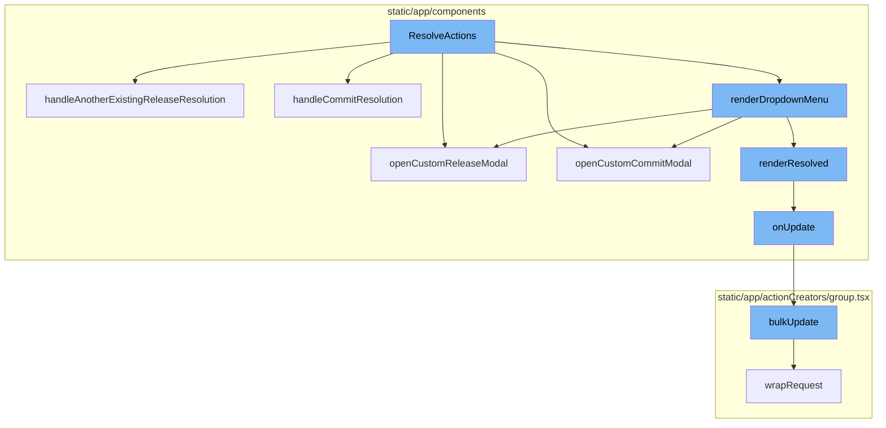
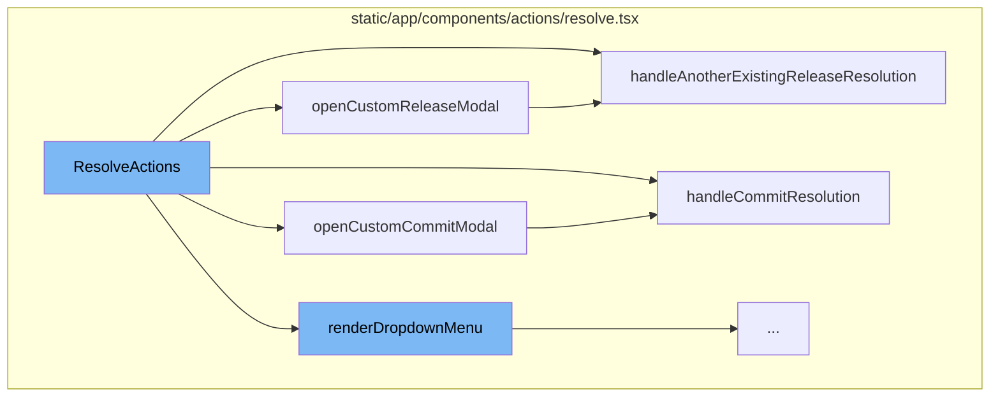
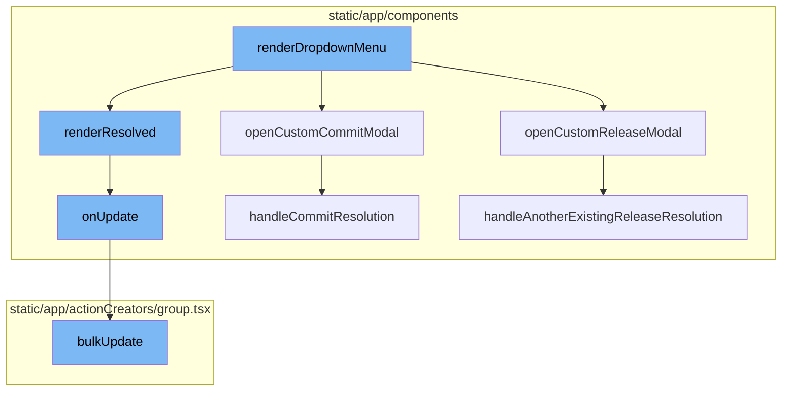

# ResolveActions Overview

ResolveActions is a function that manages the resolution of issues in Sentry. It provides different resolution options to the user, such as resolving by a specific commit or by an existing release. The user's choice triggers a specific action that updates the issue's status to resolved and associates it with the selected commit or release.

<SwmSnippet path="/static/app/components/actions/resolve.tsx" line="70">

---

# ResolveActions Function

The `ResolveActions` function is a central part of the issue resolution process. It contains several helper functions that handle different resolution scenarios, such as resolving by commit or by release.

```tsx
function ResolveActions({
  size = 'xs',
  isResolved = false,
  isAutoResolved = false,
  confirmLabel = t('Resolve'),
  projectSlug,
  hasRelease,
  latestRelease,
  confirmMessage,
  shouldConfirm,
  disabled,
  disableDropdown,
  disableResolveInRelease,
  priority,
  projectFetchError,
  multipleProjectsSelected,
  onUpdate,
}: ResolveActionsProps) {
  const organization = useOrganization();

  function handleCommitResolution(statusDetails: ResolvedStatusDetails) {
```

---

</SwmSnippet>

<SwmSnippet path="/static/app/components/actions/resolve.tsx" line="301">

---

# Opening Custom Release Modal

The `openCustomReleaseModal` function opens a modal that allows users to resolve an issue by selecting an existing release. The selected release details are then passed to the `handleAnotherExistingReleaseResolution` function.

```tsx
  function openCustomReleaseModal() {
    openModal(deps => (
      <CustomResolutionModal
        {...deps}
        onSelected={(statusDetails: ResolvedStatusDetails) =>
          handleAnotherExistingReleaseResolution(statusDetails)
        }
        organization={organization}
        projectSlug={projectSlug}
      />
    ));
  }
```

---

</SwmSnippet>

<SwmSnippet path="/static/app/components/actions/resolve.tsx" line="98">

---

# Handling Existing Release Resolution

The `handleAnotherExistingReleaseResolution` function updates the issue status to resolved and sets the status details to the selected release details. It also tracks this action for analytics purposes.

```tsx
  function handleAnotherExistingReleaseResolution(statusDetails: ResolvedStatusDetails) {
    onUpdate({
      status: GroupStatus.RESOLVED,
      statusDetails,
      substatus: null,
    });
    trackAnalytics('resolve_issue', {
      organization,
      release: 'anotherExisting',
    });
  }
```

---

</SwmSnippet>

<SwmSnippet path="/static/app/components/actions/resolve.tsx" line="288">

---

# Opening Custom Commit Modal

The `openCustomCommitModal` function opens a modal that allows users to resolve an issue by selecting a specific commit. The selected commit details are then passed to the `handleCommitResolution` function.

```tsx
  function openCustomCommitModal() {
    openModal(deps => (
      <CustomCommitsResolutionModal
        {...deps}
        onSelected={(statusDetails: ResolvedStatusDetails) =>
          handleCommitResolution(statusDetails)
        }
        orgSlug={organization.slug}
        projectSlug={projectSlug}
      />
    ));
  }
```

---

</SwmSnippet>

<SwmSnippet path="/static/app/components/actions/resolve.tsx" line="90">

---

# Handling Commit Resolution

The `handleCommitResolution` function updates the issue status to resolved and sets the status details to the selected commit details.

```tsx
  function handleCommitResolution(statusDetails: ResolvedStatusDetails) {
    onUpdate({
      status: GroupStatus.RESOLVED,
      statusDetails,
      substatus: null,
    });
  }
```

---

</SwmSnippet>

<SwmSnippet path="/static/app/components/actions/resolve.tsx" line="189">

---

# ResolveActions Flow

The `renderDropdownMenu` function is the starting point of the ResolveActions flow. It checks if the issue is already resolved, if not, it prepares a dropdown menu with different resolution options. Each option is associated with a specific action that will be triggered upon selection.

```tsx
  function renderDropdownMenu() {
    if (isResolved) {
      return renderResolved();
    }

    const shouldDisplayCta = !hasRelease && !multipleProjectsSelected;
    const actionTitle = shouldDisplayCta
      ? t('Set up release tracking in order to use this feature.')
      : '';

    const onActionOrConfirm = (onAction: () => void) => {
      openConfirmModal({
        bypass: !shouldConfirm,
        onConfirm: onAction,
        message: confirmMessage,
        confirmText: confirmLabel,
      });
    };

    const hasUpcomingRelease = organization.features.includes(
      'resolve-in-upcoming-release'
```

---

</SwmSnippet>

<SwmSnippet path="/static/app/components/issues/compactIssue.tsx" line="127">

---

# Updating Issue Status

The `onUpdate` method is called by both `handleCommitResolution` and `handleAnotherExistingReleaseResolution` functions. It prepares the data for the bulk update operation.

```tsx
  onUpdate(data: Record<string, string>) {
    const issue = this.state.issue;
    if (!issue) {
      return;
    }
    addLoadingMessage(t('Saving changes\u2026'));

    bulkUpdate(
      this.props.api,
      {
        orgId: this.props.organization.slug,
        projectId: issue.project.slug,
        itemIds: [issue.id],
        data,
      },
      {
        complete: () => {
          clearIndicators();
        },
      }
    );
```

---

</SwmSnippet>

<SwmSnippet path="/static/app/actionCreators/group.tsx" line="337">

---

# Bulk Update Operation

The `bulkUpdate` function is the final step in the ResolveActions flow. It performs the actual update operation on the issue, changing its status to resolved and associating it with the selected commit or release.

```tsx
export function bulkUpdate(
  api: Client,
  params: BulkUpdateParams,
  options: RequestCallbacks
) {
  const {itemIds, failSilently, data} = params;
  const path = getUpdateUrl(params);

  const query: QueryArgs = paramsToQueryArgs(params);
  const id = uniqueId();

  GroupStore.onUpdate(id, itemIds, data);

  return wrapRequest(
    api,
    path,
    {
      query,
      method: 'PUT',
      data,
      success: response => {
```

---

</SwmSnippet>



# Flow drill down

First, we'll zoom into this section of the flow:



<SwmSnippet path="/static/app/components/actions/resolve.tsx" line="70">

---

# ResolveActions Function

The `ResolveActions` function is a central part of the issue resolution process. It contains several helper functions that handle different resolution scenarios, such as resolving by commit or by release.

```tsx
function ResolveActions({
  size = 'xs',
  isResolved = false,
  isAutoResolved = false,
  confirmLabel = t('Resolve'),
  projectSlug,
  hasRelease,
  latestRelease,
  confirmMessage,
  shouldConfirm,
  disabled,
  disableDropdown,
  disableResolveInRelease,
  priority,
  projectFetchError,
  multipleProjectsSelected,
  onUpdate,
}: ResolveActionsProps) {
  const organization = useOrganization();

  function handleCommitResolution(statusDetails: ResolvedStatusDetails) {
```

---

</SwmSnippet>

<SwmSnippet path="/static/app/components/actions/resolve.tsx" line="301">

---

# Opening Custom Release Modal

The `openCustomReleaseModal` function opens a modal that allows users to resolve an issue by selecting an existing release. The selected release details are then passed to the `handleAnotherExistingReleaseResolution` function.

```tsx
  function openCustomReleaseModal() {
    openModal(deps => (
      <CustomResolutionModal
        {...deps}
        onSelected={(statusDetails: ResolvedStatusDetails) =>
          handleAnotherExistingReleaseResolution(statusDetails)
        }
        organization={organization}
        projectSlug={projectSlug}
      />
    ));
  }
```

---

</SwmSnippet>

<SwmSnippet path="/static/app/components/actions/resolve.tsx" line="98">

---

# Handling Existing Release Resolution

The `handleAnotherExistingReleaseResolution` function updates the issue status to resolved and sets the status details to the selected release details. It also tracks this action for analytics purposes.

```tsx
  function handleAnotherExistingReleaseResolution(statusDetails: ResolvedStatusDetails) {
    onUpdate({
      status: GroupStatus.RESOLVED,
      statusDetails,
      substatus: null,
    });
    trackAnalytics('resolve_issue', {
      organization,
      release: 'anotherExisting',
    });
  }
```

---

</SwmSnippet>

<SwmSnippet path="/static/app/components/actions/resolve.tsx" line="288">

---

# Opening Custom Commit Modal

The `openCustomCommitModal` function opens a modal that allows users to resolve an issue by selecting a specific commit. The selected commit details are then passed to the `handleCommitResolution` function.

```tsx
  function openCustomCommitModal() {
    openModal(deps => (
      <CustomCommitsResolutionModal
        {...deps}
        onSelected={(statusDetails: ResolvedStatusDetails) =>
          handleCommitResolution(statusDetails)
        }
        orgSlug={organization.slug}
        projectSlug={projectSlug}
      />
    ));
  }
```

---

</SwmSnippet>

<SwmSnippet path="/static/app/components/actions/resolve.tsx" line="90">

---

# Handling Commit Resolution

The `handleCommitResolution` function updates the issue status to resolved and sets the status details to the selected commit details.

```tsx
  function handleCommitResolution(statusDetails: ResolvedStatusDetails) {
    onUpdate({
      status: GroupStatus.RESOLVED,
      statusDetails,
      substatus: null,
    });
  }
```

---

</SwmSnippet>

Now, lets zoom into this section of the flow:



<SwmSnippet path="/static/app/components/actions/resolve.tsx" line="189">

---

# ResolveActions Flow

The `renderDropdownMenu` function is the starting point of the ResolveActions flow. It checks if the issue is already resolved, if not, it prepares a dropdown menu with different resolution options. Each option is associated with a specific action that will be triggered upon selection.

```tsx
  function renderDropdownMenu() {
    if (isResolved) {
      return renderResolved();
    }

    const shouldDisplayCta = !hasRelease && !multipleProjectsSelected;
    const actionTitle = shouldDisplayCta
      ? t('Set up release tracking in order to use this feature.')
      : '';

    const onActionOrConfirm = (onAction: () => void) => {
      openConfirmModal({
        bypass: !shouldConfirm,
        onConfirm: onAction,
        message: confirmMessage,
        confirmText: confirmLabel,
      });
    };

    const hasUpcomingRelease = organization.features.includes(
      'resolve-in-upcoming-release'
```

---

</SwmSnippet>

<SwmSnippet path="/static/app/components/actions/resolve.tsx" line="301">

---

The `openCustomReleaseModal` function is triggered when the 'Another existing release' option is selected from the dropdown menu. It opens a modal that allows the user to select a specific release for issue resolution.

```tsx
  function openCustomReleaseModal() {
    openModal(deps => (
      <CustomResolutionModal
        {...deps}
        onSelected={(statusDetails: ResolvedStatusDetails) =>
          handleAnotherExistingReleaseResolution(statusDetails)
        }
        organization={organization}
        projectSlug={projectSlug}
      />
    ));
  }
```

---

</SwmSnippet>

<SwmSnippet path="/static/app/components/actions/resolve.tsx" line="288">

---

The `openCustomCommitModal` function is triggered when the 'A commit' option is selected from the dropdown menu. It opens a modal that allows the user to select a specific commit for issue resolution.

```tsx
  function openCustomCommitModal() {
    openModal(deps => (
      <CustomCommitsResolutionModal
        {...deps}
        onSelected={(statusDetails: ResolvedStatusDetails) =>
          handleCommitResolution(statusDetails)
        }
        orgSlug={organization.slug}
        projectSlug={projectSlug}
      />
    ));
  }
```

---

</SwmSnippet>

<SwmSnippet path="/static/app/components/actions/resolve.tsx" line="161">

---

The `renderResolved` function is triggered when the issue is already resolved. It renders a button that allows the user to unresolve the issue.

```tsx
  function renderResolved() {
    return (
      <Tooltip
        title={
          isAutoResolved
            ? t(
                'This event is resolved due to the Auto Resolve configuration for this project'
              )
            : t('Unresolve')
        }
      >
        <Button
          priority="primary"
          size="xs"
          aria-label={t('Unresolve')}
          disabled={isAutoResolved}
          onClick={() =>
            onUpdate({
              status: GroupStatus.UNRESOLVED,
              statusDetails: {},
              substatus: GroupSubstatus.ONGOING,
```

---

</SwmSnippet>

<SwmSnippet path="/static/app/components/actions/resolve.tsx" line="90">

---

The `handleCommitResolution` function is triggered when a commit is selected in the `openCustomCommitModal`. It updates the issue status to resolved and associates the selected commit with the resolution.

```tsx
  function handleCommitResolution(statusDetails: ResolvedStatusDetails) {
    onUpdate({
      status: GroupStatus.RESOLVED,
      statusDetails,
      substatus: null,
    });
  }
```

---

</SwmSnippet>

<SwmSnippet path="/static/app/components/actions/resolve.tsx" line="98">

---

The `handleAnotherExistingReleaseResolution` function is triggered when a release is selected in the `openCustomReleaseModal`. It updates the issue status to resolved and associates the selected release with the resolution.

```tsx
  function handleAnotherExistingReleaseResolution(statusDetails: ResolvedStatusDetails) {
    onUpdate({
      status: GroupStatus.RESOLVED,
      statusDetails,
      substatus: null,
    });
    trackAnalytics('resolve_issue', {
      organization,
      release: 'anotherExisting',
    });
  }
```

---

</SwmSnippet>

<SwmSnippet path="/static/app/components/issues/compactIssue.tsx" line="127">

---

The `onUpdate` method is called by both `handleCommitResolution` and `handleAnotherExistingReleaseResolution` functions. It prepares the data for the bulk update operation.

```tsx
  onUpdate(data: Record<string, string>) {
    const issue = this.state.issue;
    if (!issue) {
      return;
    }
    addLoadingMessage(t('Saving changes\u2026'));

    bulkUpdate(
      this.props.api,
      {
        orgId: this.props.organization.slug,
        projectId: issue.project.slug,
        itemIds: [issue.id],
        data,
      },
      {
        complete: () => {
          clearIndicators();
        },
      }
    );
```

---

</SwmSnippet>

<SwmSnippet path="/static/app/actionCreators/group.tsx" line="337">

---

The `bulkUpdate` function is the final step in the ResolveActions flow. It performs the actual update operation on the issue, changing its status to resolved and associating it with the selected commit or release.

```tsx
export function bulkUpdate(
  api: Client,
  params: BulkUpdateParams,
  options: RequestCallbacks
) {
  const {itemIds, failSilently, data} = params;
  const path = getUpdateUrl(params);

  const query: QueryArgs = paramsToQueryArgs(params);
  const id = uniqueId();

  GroupStore.onUpdate(id, itemIds, data);

  return wrapRequest(
    api,
    path,
    {
      query,
      method: 'PUT',
      data,
      success: response => {
```

---

</SwmSnippet>

&nbsp;

*This is an auto-generated document by Swimm AI 🌊 and has not yet been verified by a human*

<SwmMeta version="3.0.0" repo-id="Z2l0aHViJTNBJTNBc2VudHJ5LWRlbW8lM0ElM0FTd2ltbS1EZW1v" repo-name="sentry-demo" doc-type="flows"><sup>Powered by [Swimm](/)</sup></SwmMeta>
