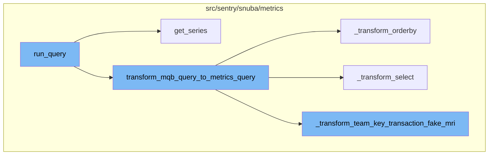
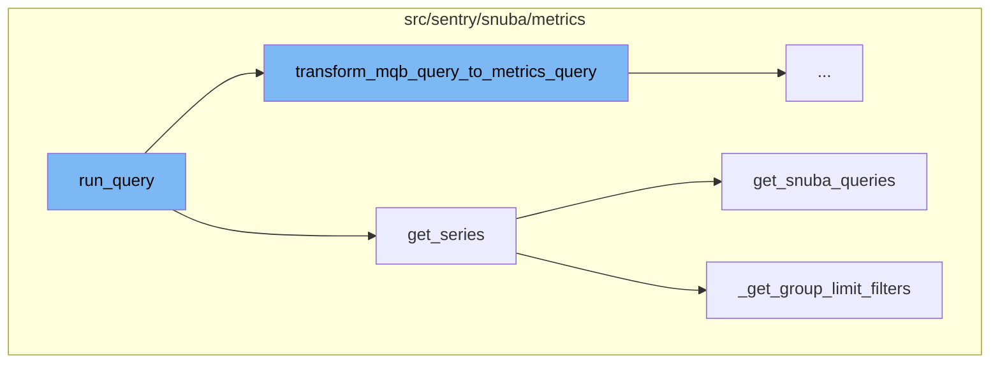
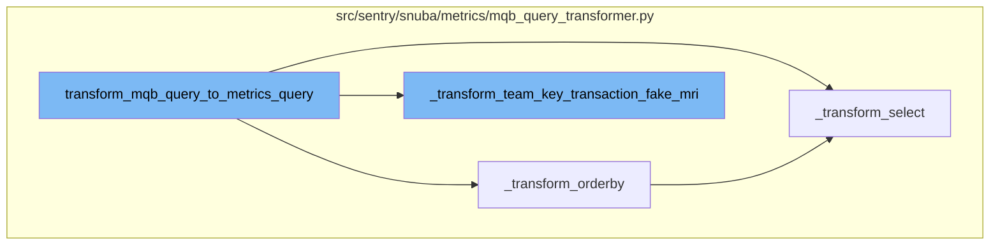

# Overview of run_query

The `run_query` function is a central part of the metrics data retrieval process. It takes in parameters such as `referrer`, `use_cache`, and `query_source` and returns the result of the query. The function first prepares the groupby aliases and sets up the query framework. If the metrics layer is being used, it imports the `get_series` and `transform_mqb_query_to_metrics_query` functions. It then loops through the query details, transforming and running the queries as needed. The results are then transformed and returned.

# get_series Function

The `get_series` function retrieves time series data for a given query. It takes in parameters such as `projects`, `metrics_query`, `use_case_id`, `include_meta`, and `tenant_ids`. The function first sets up the query parameters and intervals. Depending on the presence of groupby in the metrics query, it either runs an initial query to get the groups or directly builds the Snuba queries. The function then loops through the entities and runs the queries, applying group limit filters if necessary. The results are then converted and returned.

# transform_mqb_query_to_metrics_query

The `transform_mqb_query_to_metrics_query` function is the starting point of the flow. It takes a query and transforms it into a metrics query. This function calls several other functions to transform different parts of the query.

# \_transform_orderby

The `_transform_orderby` function is called within `transform_mqb_query_to_metrics_query`. It takes the orderby part of the query and transforms it into a format suitable for a metrics query.

# \_transform_select

The `_transform_select` function is also called within `transform_mqb_query_to_metrics_query`. It takes the select part of the query and transforms it into a format suitable for a metrics query.

# \_transform_team_key_transaction_fake_mri

The `_transform_team_key_transaction_fake_mri` function is called at the end of `transform_mqb_query_to_metrics_query`. It takes the transformed metrics query and applies additional transformations specific to the team_key_transaction operation.



# Flow drill down

First, we'll zoom into this section of the flow:



<SwmSnippet path="/src/sentry/search/events/builder/metrics.py" line="1115">

---

# run_query Function

The `run_query` function is a central part of the metrics data retrieval process. It takes in parameters such as `referrer`, `use_cache`, and `query_source` and returns the result of the query. The function first prepares the groupby aliases and sets up the query framework. If the metrics layer is being used, it imports the `get_series` and `transform_mqb_query_to_metrics_query` functions. It then loops through the query details, transforming and running the queries as needed. The results are then transformed and returned.

```python
    def run_query(
        self, referrer: str, use_cache: bool = False, query_source: QuerySource | None = None
    ) -> Any:
        groupbys = self.groupby
        if not groupbys and self.use_on_demand:
            # Need this otherwise top_events returns only 1 item
            groupbys = [self.resolve_column(col) for col in self._get_group_bys()]
            # Later the query is made by passing these columns to metrics layer so we can just have the aliases be the
            # raw groupbys
            groupby_aliases = self._get_group_bys()
        else:
            groupby_aliases = [
                (
                    groupby.alias
                    if isinstance(groupby, (AliasedExpression, CurriedFunction))
                    else groupby.name
                )
                for groupby in groupbys
                if not (
                    isinstance(groupby, CurriedFunction)
                    and groupby.function == "team_key_transaction"
```

---

</SwmSnippet>

<SwmSnippet path="/src/sentry/snuba/metrics/datasource.py" line="897">

---

# get_series Function

The `get_series` function retrieves time series data for a given query. It takes in parameters such as `projects`, `metrics_query`, `use_case_id`, `include_meta`, and `tenant_ids`. The function first sets up the query parameters and intervals. Depending on the presence of groupby in the metrics query, it either runs an initial query to get the groups or directly builds the Snuba queries. The function then loops through the entities and runs the queries, applying group limit filters if necessary. The results are then converted and returned.

```python
def get_series(
    projects: Sequence[Project],
    metrics_query: DeprecatingMetricsQuery,
    use_case_id: UseCaseID,
    include_meta: bool = False,
    tenant_ids: dict[str, Any] | None = None,
) -> dict:
    """Get time series for the given query"""

    organization_id = projects[0].organization_id if projects else None
    tenant_ids = dict()
    if organization_id is not None:
        tenant_ids["organization_id"] = organization_id
    tenant_ids["use_case_id"] = use_case_id.value

    if metrics_query.interval is not None:
        interval = metrics_query.interval
    else:
        interval = metrics_query.granularity.granularity

    start, end, _num_intervals = to_intervals(metrics_query.start, metrics_query.end, interval)
```

---

</SwmSnippet>

<SwmSnippet path="/src/sentry/snuba/metrics/query_builder.py" line="1116">

---

# get_snuba_queries Function

The `get_snuba_queries` function generates the Snuba queries needed for the metrics data retrieval. It first creates a mapping of groupBy fields to their equivalent SnQL. It then loops through the fields in the entities and generates select statements and metric ids for each field. The function then builds the totals and series queries for each entity and returns them.

```python
    def get_snuba_queries(self):
        metric_mri_to_obj_dict = {}
        fields_in_entities = {}

        for field in self._metrics_query.select:
            metric_field_obj = metric_object_factory(field.op, field.metric_mri)
            # `get_entity` is called the first, to fetch the entities of constituent metrics,
            # and validate especially in the case of SingularEntityDerivedMetric that it is
            # actually composed of metrics that belong to the same entity
            try:
                #  When we get to an instance of a MetricFieldBase where the entity is an
                #  instance of dict, we know it is from a composite entity derived metric, and
                #  we need to traverse down the constituent metrics dependency tree until we get
                #  to instances of SingleEntityDerivedMetric, and add those to our queries so
                #  that we are able to generate the original CompositeEntityDerivedMetric later
                #  on as a result of a post query operation on the results of the constituent
                #  SingleEntityDerivedMetric instances
                component_entities = metric_field_obj.get_entity(
                    projects=self._projects, use_case_id=self._use_case_id
                )
                if isinstance(component_entities, dict):
```

---

</SwmSnippet>

<SwmSnippet path="/src/sentry/snuba/metrics/datasource.py" line="763">

---

# \_get_group_limit_filters Function

The `_get_group_limit_filters` function generates group limit filters for the metrics query. It takes in parameters such as `metrics_query`, `results`, and `use_case_id`. The function first checks if groupby is present in the metrics query and if results are available. If both conditions are met, it creates a mapping of groupBy fields to their equivalent SnQL and generates the conditions for the group limit filters. The function then returns the group limit filters.

```python
def _get_group_limit_filters(
    metrics_query: DeprecatingMetricsQuery,
    results: list[Mapping[str, int]],
    use_case_id: UseCaseID,
) -> GroupLimitFilters | None:
    if not metrics_query.groupby or not results:
        return None

    # Creates a mapping of groupBy fields to their equivalent SnQL
    key_to_condition_dict: dict[Groupable, Any] = {}
    for metric_groupby_obj in metrics_query.groupby:
        key_to_condition_dict[
            metric_groupby_obj.name
        ] = SnubaQueryBuilder.generate_snql_for_action_by_fields(
            metric_action_by_field=metric_groupby_obj,
            use_case_id=use_case_id,
            org_id=metrics_query.org_id,
            projects=Project.objects.get_many_from_cache(metrics_query.project_ids),
            is_column=True,
        )

```

---

</SwmSnippet>

Now, lets zoom into this section of the flow:



<SwmSnippet path="/src/sentry/snuba/metrics/mqb_query_transformer.py" line="427">

---

# transform_mqb_query_to_metrics_query

The `transform_mqb_query_to_metrics_query` function is the starting point of the flow. It takes a query and transforms it into a metrics query. This function calls several other functions to transform different parts of the query.

```python
def transform_mqb_query_to_metrics_query(
    query: Query,
    is_alerts_query: bool = False,
) -> DeprecatingMetricsQuery:
    groupby, include_series, interval = _transform_groupby(query.groupby)

    where_mq_dict, where_conditions = _get_mq_dict_params_and_conditions_from(query.where)

    mq_dict = {
        "select": _transform_select(query.select),
        "groupby": groupby,
        "limit": query.limit,
        "offset": query.offset,
        "include_totals": True,
        "include_series": include_series,
        "granularity": query.granularity if query.granularity is not None else Granularity(3600),
        "orderby": _transform_orderby(query.orderby),
        "interval": interval,
        "is_alerts_query": is_alerts_query,
        "having": query.having,
        "where": where_conditions,
```

---

</SwmSnippet>

<SwmSnippet path="/src/sentry/snuba/metrics/mqb_query_transformer.py" line="230">

---

## \_transform_orderby

The `_transform_orderby` function is called within `transform_mqb_query_to_metrics_query`. It takes the orderby part of the query and transforms it into a format suitable for a metrics query.

```python
def _transform_orderby(query_orderby):
    mq_orderby = []
    for orderby_field in query_orderby:
        orderby_exp = orderby_field.exp

        # We want to use the string field only when a column with a valid field is passed. For example:
        # Column(name="project_id").
        if (
            isinstance(orderby_exp, Column)
            and orderby_exp.name in FIELD_ALIAS_MAPPINGS.keys() | FIELD_ALIAS_MAPPINGS.values()
        ):
            metric_order_by = MetricOrderByField(
                field=orderby_exp.name,
                direction=orderby_field.direction,
            )
        else:
            transformed_field = _transform_select([orderby_exp]).pop()
            metric_exp = metric_object_factory(
                op=transformed_field.op, metric_mri=transformed_field.metric_mri
            )
            try:
```

---

</SwmSnippet>

<SwmSnippet path="/src/sentry/snuba/metrics/mqb_query_transformer.py" line="58">

---

## \_transform_select

The `_transform_select` function is also called within `transform_mqb_query_to_metrics_query`. It takes the select part of the query and transforms it into a format suitable for a metrics query.

```python
def _transform_select(query_select):
    select = []
    for select_field in query_select:
        if isinstance(select_field, (Column, AliasedExpression)):
            if isinstance(select_field, AliasedExpression):
                column_field = select_field.exp
                column_alias = select_field.alias
            else:
                column_field = select_field
                column_alias = None

            try:
                select.append(
                    MetricField(op=None, metric_mri=column_field.name, alias=column_alias)
                )
            except InvalidParams as e:
                raise MQBQueryTransformationException(e)
        elif isinstance(select_field, Function):
            if select_field.function in DERIVED_OPS:
                select.append(_get_derived_op_metric_field_from_snuba_function(select_field))
            else:
```

---

</SwmSnippet>

<SwmSnippet path="/src/sentry/snuba/metrics/mqb_query_transformer.py" line="412">

---

## \_transform_team_key_transaction_fake_mri

The `_transform_team_key_transaction_fake_mri` function is called at the end of `transform_mqb_query_to_metrics_query`. It takes the transformed metrics query and applies additional transformations specific to the team_key_transaction operation.

```python
def _transform_team_key_transaction_fake_mri(mq_dict):
    if "project_ids" not in mq_dict:
        raise MQBQueryTransformationException("Missing project_id in query")
    mri_to_apply = _derive_mri_to_apply(
        mq_dict["project_ids"], mq_dict["select"], mq_dict["orderby"]
    )

    return {
        "select": _transform_team_key_transaction_in_select(mri_to_apply, mq_dict["select"]),
        "where": _transform_team_key_transaction_in_where(mri_to_apply, mq_dict["where"]),
        "groupby": _transform_team_key_transaction_in_groupby(mri_to_apply, mq_dict["groupby"]),
        "orderby": _transform_team_key_transaction_in_orderby(mri_to_apply, mq_dict["orderby"]),
    }
```

---

</SwmSnippet>

&nbsp;

*This is an auto-generated document by Swimm AI 🌊 and has not yet been verified by a human*

<SwmMeta version="3.0.0" repo-id="Z2l0aHViJTNBJTNBc2VudHJ5LWRlbW8lM0ElM0FTd2ltbS1EZW1v" repo-name="sentry-demo" doc-type="flows"><sup>Powered by [Swimm](/)</sup></SwmMeta>
