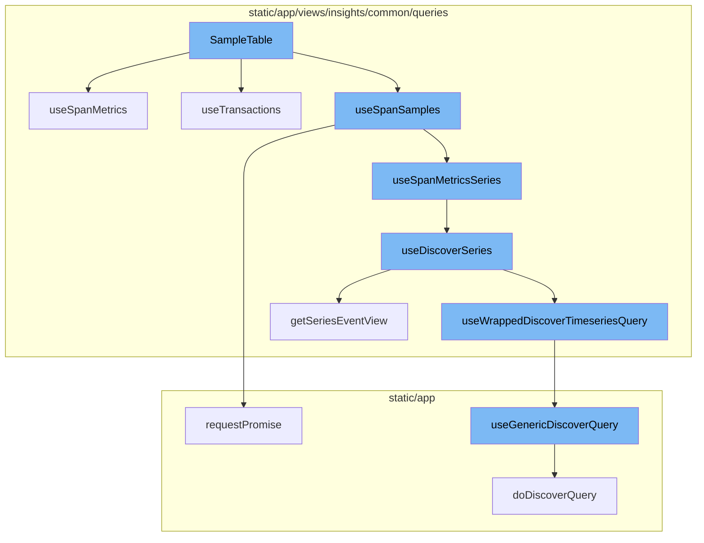
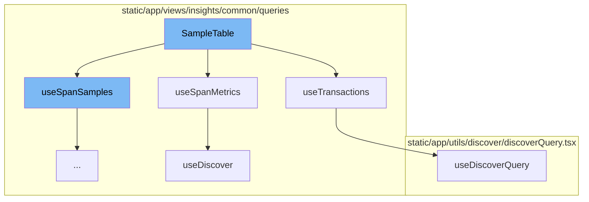
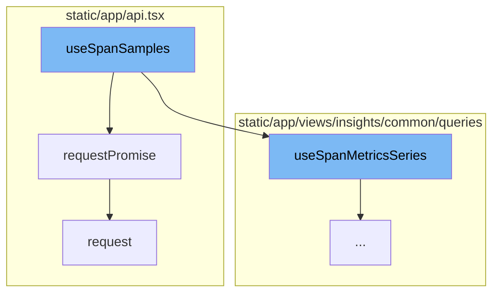
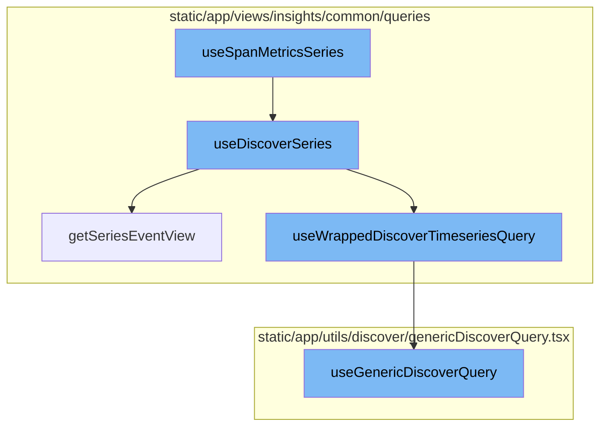

# SampleTable Overview

SampleTable is a component that displays a table of samples. It fetches and manages the data it needs using several hooks. The data is filtered and fetched based on various properties such as groupId, moduleName, transactionName, and others.

# Data Fetching Hooks

SampleTable uses several hooks to fetch data. The `useSpanMetrics` hook fetches span metrics data. The `useTransactions` hook fetches transaction data based on an array of event IDs. These hooks use various functions like `useDiscover`, `useDiscoverQuery`, and `useGenericDiscoverQuery` to fetch the required data.

# API Request

The `useSpanSamples` function prepares the necessary data and conditions for the API request. It uses the `requestPromise` function to make the actual API request. The `request` function handles the low-level details of the API request.

# Data Processing

The `useSpanMetricsSeries` function fetches span metrics series data. The `useDiscoverSeries` function fetches metrics series data. The `getSeriesEventView` function creates an event view based on the provided search, fields, page filters, yAxis, top events, and dataset. The `useWrappedDiscoverTimeseriesQuery` function fetches timeseries data based on the provided event view and other parameters.



# Flow drill down

First, we'll zoom into this section of the flow:



<SwmSnippet path="/static/app/views/insights/common/views/spanSummaryPage/sampleList/sampleTable/sampleTable.tsx" line="44">

---

# SampleTable Function

The `SampleTable` function is a component that displays a table of samples. It uses several hooks to fetch and manage the data it needs. The function takes in a `Props` object which contains various properties such as `groupId`, `moduleName`, `transactionName`, and others that are used to filter and fetch the data.

```tsx
function SampleTable({
  groupId,
  moduleName,
  transactionName,
  highlightedSpanId,
  onMouseLeaveSample,
  onMouseOverSample,
  transactionMethod,
  columnOrder,
  release,
  spanSearch,
  additionalFields,
  additionalFilters,
  referrer,
}: Props) {
  const filters: SpanMetricsQueryFilters = {
    'span.group': groupId,
    transaction: transactionName,
  };

  if (transactionMethod) {
```

---

</SwmSnippet>

<SwmSnippet path="/static/app/views/insights/common/queries/useDiscover.ts" line="38">

---

## useSpanMetrics Hook

`useSpanMetrics` is a hook used within `SampleTable` to fetch span metrics data. It takes in options and a referrer string, and uses the `useDiscover` function to fetch the data from the `SPANS_METRICS` dataset.

```typescript
export const useSpanMetrics = <Fields extends SpanMetricsProperty[]>(
  options: UseMetricsOptions<Fields> = {},
  referrer: string
) => {
  return useDiscover<Fields, SpanMetricsResponse>(
    options,
    DiscoverDatasets.SPANS_METRICS,
    referrer
  );
};
```

---

</SwmSnippet>

<SwmSnippet path="/static/app/views/insights/common/queries/useTransactions.tsx" line="18">

---

## useTransactions Hook

`useTransactions` is another hook used within `SampleTable`. It fetches transaction data based on an array of event IDs. The hook uses the `useDiscoverQuery` function to fetch the data.

```tsx
export function useTransactions(eventIDs: string[], referrer = 'use-transactions') {
  const location = useLocation();
  const {slug} = useOrganization();

  const eventView = EventView.fromNewQueryWithLocation(
    {
      fields: ['id', 'timestamp', 'project.name', 'transaction.duration', 'trace'],
      name: 'Transactions',
      version: 2,
      query: `id:[${eventIDs.join(',')}]`,
    },
    location
  );

  const enabled = Boolean(eventIDs.length);

  const response = useDiscoverQuery({
    eventView,
    location,
    orgSlug: slug,
    referrer,
```

---

</SwmSnippet>

<SwmSnippet path="/static/app/utils/discover/discoverQuery.tsx" line="72">

---

## useDiscoverQuery Function

`useDiscoverQuery` is a function used by `useTransactions` to fetch data. It takes in properties and returns the response from the `useGenericDiscoverQuery` function.

```tsx
export function useDiscoverQuery(props: Omit<DiscoverQueryComponentProps, 'children'>) {
  const afterFetch = (data, _) => {
    const {fields, ...otherMeta} = data.meta ?? {};
    return {
      ...data,
      meta: {...fields, ...otherMeta},
    };
  };

  const res = useGenericDiscoverQuery<TableData, DiscoverQueryPropsWithThresholds>({
    route: 'events',
    shouldRefetchData,
    afterFetch,
    ...props,
  });

  const pageLinks = res.response?.getResponseHeader('Link') ?? undefined;

  return {...res, pageLinks};
}
```

---

</SwmSnippet>

<SwmSnippet path="/static/app/views/insights/common/queries/useDiscover.ts" line="60">

---

## useDiscover Hook

`useDiscover` is a hook used by `useSpanMetrics` to fetch data. It takes in options, a dataset, and a referrer string, and uses the `useWrappedDiscoverQuery` function to fetch the data.

```typescript
const useDiscover = <T extends Extract<keyof ResponseType, string>[], ResponseType>(
  options: UseMetricsOptions<T> = {},
  dataset: DiscoverDatasets,
  referrer: string
) => {
  const {
    fields = [],
    search = undefined,
    sorts = [],
    limit,
    cursor,
    pageFilters: pageFiltersFromOptions,
  } = options;

  const pageFilters = usePageFilters();

  const eventView = getEventView(
    search,
    fields,
    sorts,
    pageFiltersFromOptions ?? pageFilters.selection,
```

---

</SwmSnippet>

Now, lets zoom into this section of the flow:



<SwmSnippet path="/static/app/views/insights/common/queries/useSpanSamples.tsx" line="43">

---

# SampleTable Flow

The `useSpanSamples` function is the starting point of the flow. It prepares the necessary data and conditions for the API request. It uses the `useApi` hook to get the API instance, and the `usePageFilters` hook to get the page filters. It also prepares the query and filters based on the options passed to it. The function then uses the `useSpanMetricsSeries` hook to get the span metrics series data, which is used to calculate the `maxYValue`. This value is used in the API request to get the span samples.

```tsx
export const useSpanSamples = (options: Options) => {
  const organization = useOrganization();
  const url = `/api/0/organizations/${organization.slug}/spans-samples/`;
  const api = useApi();
  const pageFilter = usePageFilters();
  const {
    groupId,
    transactionName,
    transactionMethod,
    release,
    spanSearch,
    additionalFields,
  } = options;
  const location = useLocation();

  const query = spanSearch !== undefined ? spanSearch.copy() : new MutableSearch([]);
  query.addFilterValue(SPAN_GROUP, groupId);
  query.addFilterValue('transaction', transactionName);

  const filters: SpanMetricsQueryFilters = {
    transaction: transactionName,
```

---

</SwmSnippet>

<SwmSnippet path="/static/app/api.tsx" line="656">

---

The `requestPromise` function in `api.tsx` is used to make the actual API request. It takes the path and options as parameters, and returns a promise that resolves with the API response data. This function is used by the `useSpanSamples` function to make the API request to get the span samples.

```tsx
  requestPromise<IncludeAllArgsType extends boolean>(
    path: string,
    {
      includeAllArgs,
      ...options
    }: {includeAllArgs?: IncludeAllArgsType} & Readonly<RequestOptions> = {}
  ): Promise<IncludeAllArgsType extends true ? ApiResult : any> {
    // Create an error object here before we make any async calls so that we
    // have a helpful stack trace if it errors
    //
    // This *should* get logged to Sentry only if the promise rejection is not handled
    // (since SDK captures unhandled rejections). Ideally we explicitly ignore rejection
    // or handle with a user friendly error message
    const preservedError = new Error('API Request Error');

    return new Promise((resolve, reject) =>
      this.request(path, {
        ...options,
        preservedError,
        success: (data, textStatus, resp) => {
          if (includeAllArgs) {
```

---

</SwmSnippet>

<SwmSnippet path="/static/app/api.tsx" line="420">

---

The `request` function in `api.tsx` is used by the `requestPromise` function to make the actual API request. It prepares the request, handles the response, and returns a `Request` object. This function is responsible for handling the low-level details of the API request.

```tsx
  request(path: string, options: Readonly<RequestOptions> = {}): Request {
    const method = options.method || (options.data ? 'POST' : 'GET');

    let fullUrl = buildRequestUrl(this.baseUrl, path, options);

    let data = options.data;

    if (data !== undefined && method !== 'GET' && !(data instanceof FormData)) {
      data = JSON.stringify(data);
    }

    // TODO(epurkhiser): Mimicking the old jQuery API, data could be a string /
    // object for GET requests. jQuery just sticks it onto the URL as query
    // parameters
    if (method === 'GET' && data) {
      const queryString = typeof data === 'string' ? data : qs.stringify(data);

      if (queryString.length > 0) {
        fullUrl = fullUrl + (fullUrl.includes('?') ? '&' : '?') + queryString;
      }
    }
```

---

</SwmSnippet>

Now, lets zoom into this section of the flow:



<SwmSnippet path="/static/app/views/insights/common/queries/useDiscoverSeries.ts" line="30">

---

# useSpanMetricsSeries

The `useSpanMetricsSeries` function is a hook that wraps around the `useDiscoverSeries` function. It is used to fetch span metrics data for a given set of options and a referrer.

```typescript
export const useSpanMetricsSeries = <Fields extends SpanMetricsProperty[]>(
  options: UseMetricsSeriesOptions<Fields> = {},
  referrer: string
) => {
  return useDiscoverSeries<Fields>(options, DiscoverDatasets.SPANS_METRICS, referrer);
};
```

---

</SwmSnippet>

<SwmSnippet path="/static/app/views/insights/common/queries/useDiscoverSeries.ts" line="56">

---

# useDiscoverSeries

The `useDiscoverSeries` function is a hook that fetches metrics series data. It takes in options, a dataset, and a referrer as parameters. It uses the `getSeriesEventView` function to create an event view and the `useWrappedDiscoverTimeseriesQuery` function to fetch the timeseries data.

```typescript
const useDiscoverSeries = <T extends string[]>(
  options: UseMetricsSeriesOptions<T> = {},
  dataset: DiscoverDatasets,
  referrer: string
) => {
  const {search = undefined, yAxis = [], interval = undefined} = options;

  const pageFilters = usePageFilters();

  const eventView = getSeriesEventView(
    search,
    undefined,
    pageFilters.selection,
    yAxis,
    undefined,
    dataset
  );

  if (interval) {
    eventView.interval = interval;
  }
```

---

</SwmSnippet>

<SwmSnippet path="/static/app/views/insights/common/queries/getSeriesEventView.tsx" line="12">

---

# getSeriesEventView

The `getSeriesEventView` function creates an event view based on the provided search, fields, page filters, yAxis, top events, and dataset. It calculates the highest possible interval for the given yAxis selection to ensure best performance.

```tsx
export function getSeriesEventView(
  search: MutableSearch | undefined,
  fields: string[] = [],
  pageFilters: PageFilters,
  yAxis: string[],
  topEvents?: number,
  dataset?: DiscoverDatasets
) {
  // Pick the highest possible interval for the given yAxis selection. Find the ideal interval for each function, then choose the largest one. This results in the lowest granularity, but best performance.
  const interval = sortBy(
    yAxis.map(yAxisFunctionName => {
      const parseResult = parseFunction(yAxisFunctionName);

      if (!parseResult) {
        return DEFAULT_INTERVAL;
      }

      return getIntervalForMetricFunction(parseResult.name, pageFilters.datetime);
    }),
    result => {
      return intervalToMilliseconds(result);
```

---

</SwmSnippet>

<SwmSnippet path="/static/app/views/insights/common/queries/useSpansQuery.tsx" line="63">

---

# useWrappedDiscoverTimeseriesQuery

The `useWrappedDiscoverTimeseriesQuery` function is a hook that fetches timeseries data based on the provided event view and other parameters. It uses the `useGenericDiscoverQuery` function to fetch the data.

```tsx
export function useWrappedDiscoverTimeseriesQuery<T>({
  eventView,
  enabled,
  initialData,
  referrer,
  cursor,
  overriddenRoute,
}: {
  eventView: EventView;
  cursor?: string;
  enabled?: boolean;
  initialData?: any;
  overriddenRoute?: string;
  referrer?: string;
}) {
  const location = useLocation();
  const organization = useOrganization();
  const {isReady: pageFiltersReady} = usePageFilters();
  const result = useGenericDiscoverQuery<
    {
      data: any[];
```

---

</SwmSnippet>

<SwmSnippet path="/static/app/utils/discover/genericDiscoverQuery.tsx" line="419">

---

# useGenericDiscoverQuery

The `useGenericDiscoverQuery` function is a hook that fetches data from the Discover API based on the provided parameters. It returns the fetched data, error, status code, and response.

```tsx
export function useGenericDiscoverQuery<T, P>(props: Props<T, P>) {
  const api = useApi();
  const {orgSlug, route, options} = props;
  const url = `/organizations/${orgSlug}/${route}/`;
  const apiPayload = getPayload<T, P>(props);

  const res = useQuery<[T, string | undefined, ResponseMeta<T> | undefined], QueryError>(
    [route, apiPayload],
    ({signal: _signal}) =>
      doDiscoverQuery<T>(api, url, apiPayload, {
        queryBatching: props.queryBatching,
        skipAbort: props.skipAbort,
      }),
    options
  );

  return {
    ...res,
    data: res.data?.[0] ?? undefined,
    error: parseError(res.error),
    statusCode: res.data?.[1] ?? undefined,
```

---

</SwmSnippet>

&nbsp;

*This is an auto-generated document by Swimm AI 🌊 and has not yet been verified by a human*

<SwmMeta version="3.0.0" repo-id="Z2l0aHViJTNBJTNBc2VudHJ5LWRlbW8lM0ElM0FTd2ltbS1EZW1v" repo-name="sentry-demo" doc-type="flows"><sup>Powered by [Swimm](/)</sup></SwmMeta>
