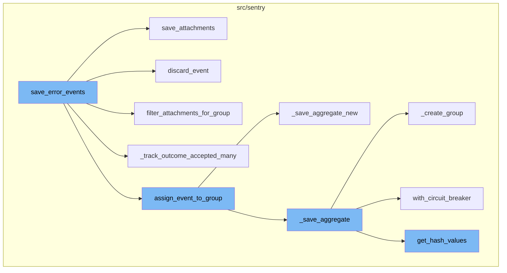
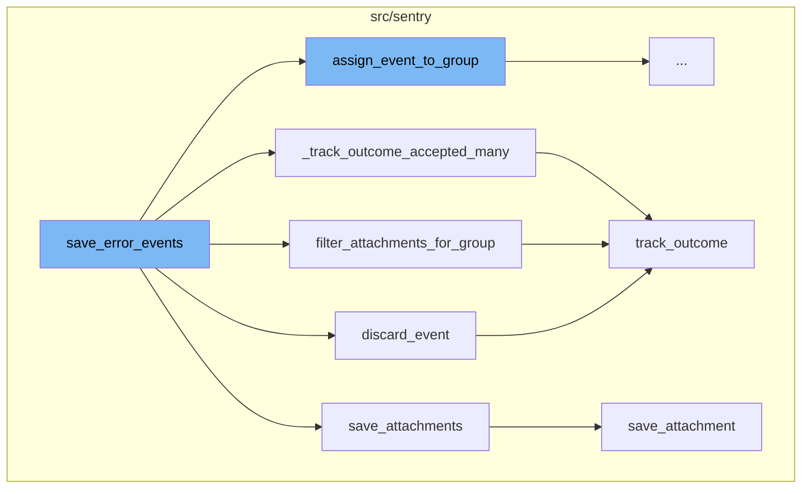
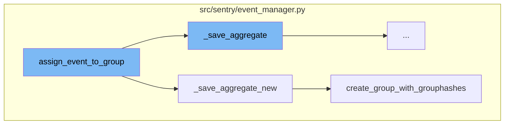
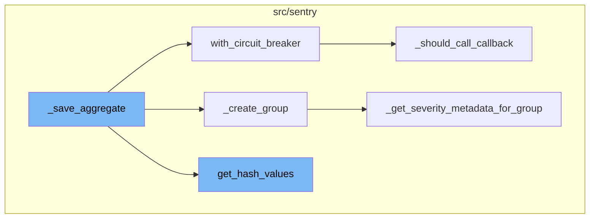

# Overview of save_error_events

The `save_error_events` function is a crucial part of the Sentry error tracking and performance monitoring platform. It is responsible for processing and saving error events, along with their attachments if any, into the system. This function is the entry point for saving error events and it handles any exceptions that might occur during this process.

# Flow of save_error_events

The flow of `save_error_events` involves several steps. Initially, it checks if the event is a sample event. If it is, it logs the event details. Then, it checks if the event has attachments. If it does, it retrieves and saves them after all other processing is done. The function also handles the case where an event needs to be discarded, in which case it refunds the consumed quotas for the event and its attachments.

# Handling Attachments

The `save_attachments` function is responsible for persisting cached event attachments into the file store. It iterates over the attachments and saves each one. If retrieving the attachment fails, it emits an outcome of INVALID(missing_chunks).

# Discarding Events

The `discard_event` function is used when an event needs to be discarded. It refunds the consumed quotas for the event and its attachments and emits an outcome of FILTERED(discarded-hash) for the event and each dropped attachment.

# Filtering Attachments

The `filter_attachments_for_group` function removes crash reports exceeding the group-limit. If the project or organization is configured to limit the amount of crash reports per group, the number of stored crashes is limited. It emits one outcome per removed attachment.

# Tracking Outcomes

The `_track_outcome_accepted_many` function is used to track the outcome of multiple jobs. It iterates over the jobs and for each job, it calls the `track_outcome` function with the outcome set to ACCEPTED.

# Assigning Events to Groups

The `assign_event_to_group` function checks if the job is optimized for grouping. If it is, it calls the `_save_aggregate_new` function, otherwise it calls the `_save_aggregate` function. The function then assigns the group info to the event and job if it exists.

# Creating Groups

The `_create_group` function prepares the necessary data and creates a new group in the database. It also handles the case where another process might be trying to create the same group, in which case it updates the group the other process just created, rather than creating a new group itself.

# Handling Severity Metadata

The `_get_severity_metadata_for_group` function is used to get the severity metadata for an event. This metadata is used for alert filtering.



# Flow drill down

First, we'll zoom into this section of the flow:



<SwmSnippet path="/src/sentry/event_manager.py" line="538">

---

# save_error_events Function

The `save_error_events` function is the entry point for saving error events. It takes in parameters such as the project, job, projects mapping, metric tags, and a few optional parameters. It processes the event, assigns it to a group, and handles any exceptions that might occur during this process. If the event has attachments, it retrieves them and saves them after all other processing is done.

```python
    def save_error_events(
        self,
        project: Project,
        job: Job,
        projects: ProjectsMapping,
        metric_tags: MutableTags,
        raw: bool = False,
        cache_key: str | None = None,
        has_attachments: bool = False,
    ) -> Event:
        jobs = [job]

        if is_sample_event(job):
            logger.info(
                "save_error_events: processing sample event",
                extra={
                    "event.id": job["event"].event_id,
                    "project_id": project.id,
                    "sample_event": True,
                },
            )
```

---

</SwmSnippet>

<SwmSnippet path="/src/sentry/event_manager.py" line="2898">

---

# save_attachments Function

The `save_attachments` function is responsible for persisting cached event attachments into the file store. It iterates over the attachments and saves each one using the `save_attachment` function. If retrieving the attachment fails, it emits an outcome of INVALID(missing_chunks).

```python
def save_attachments(cache_key: str | None, attachments: list[Attachment], job: Job) -> None:
    """
    Persists cached event attachments into the file store.

    Emits one outcome per attachment, either ACCEPTED on success or
    INVALID(missing_chunks) if retrieving the attachment fails.
    :param cache_key:  The cache key at which the attachment is stored for
                       debugging purposes.
    :param attachments: A filtered list of attachments to save.
    :param job:         The job context container.
    """

    event = job["event"]

    for attachment in attachments:
        save_attachment(
            cache_key,
            attachment,
            event.project,
            event.event_id,
            key_id=job["key_id"],
```

---

</SwmSnippet>

<SwmSnippet path="/src/sentry/event_manager.py" line="2596">

---

# discard_event Function

The `discard_event` function is used when an event needs to be discarded. It refunds the consumed quotas for the event and its attachments and emits an outcome of FILTERED(discarded-hash) for the event and each dropped attachment.

```python
def discard_event(job: Job, attachments: Sequence[Attachment]) -> None:
    """
    Refunds consumed quotas for an event and its attachments.

    For the event and each dropped attachment, an outcome
    FILTERED(discarded-hash) is emitted.

    :param job:         The job context container.
    :param attachments: The full list of attachments to filter.
    """

    project = job["event"].project

    quotas.backend.refund(
        project,
        key=job["project_key"],
        timestamp=job["start_time"],
        category=job["category"],
        quantity=1,
    )

```

---

</SwmSnippet>

<SwmSnippet path="/src/sentry/event_manager.py" line="2691">

---

# filter_attachments_for_group Function

The `filter_attachments_for_group` function removes crash reports exceeding the group-limit. If the project or organization is configured to limit the amount of crash reports per group, the number of stored crashes is limited. It emits one outcome per removed attachment.

```python
def filter_attachments_for_group(attachments: list[Attachment], job: Job) -> list[Attachment]:
    """
    Removes crash reports exceeding the group-limit.

    If the project or organization is configured to limit the amount of crash
    reports per group, the number of stored crashes is limited. This requires
    `event.group` to be set.

    Emits one outcome per removed attachment.

    :param attachments: The full list of attachments to filter.
    :param job:         The job context container.
    """
    if not attachments:
        return attachments

    event = job["event"]
    project = event.project

    # The setting is both an organization and project setting. The project
    # setting strictly overrides the organization setting, unless set to the
```

---

</SwmSnippet>

<SwmSnippet path="/src/sentry/event_manager.py" line="1248">

---

# \_track_outcome_accepted_many Function

The `_track_outcome_accepted_many` function is used to track the outcome of multiple jobs. It iterates over the jobs and for each job, it calls the `track_outcome` function with the outcome set to ACCEPTED.

```python
def _track_outcome_accepted_many(jobs: Sequence[Job]) -> None:
    for job in jobs:
        event = job["event"]

        track_outcome(
            org_id=event.project.organization_id,
            project_id=job["project_id"],
            key_id=job["key_id"],
            outcome=Outcome.ACCEPTED,
            reason=None,
            timestamp=to_datetime(job["start_time"]),
            event_id=event.event_id,
            category=job["category"],
        )
```

---

</SwmSnippet>

<SwmSnippet path="/src/sentry/utils/outcomes.py" line="40">

---

# track_outcome Function

The `track_outcome` function is a central point to track org/project counters per incoming event. It sends the 'outcome' message to Kafka which is used by Snuba to serve data for SnubaTSDB and RedisSnubaTSDB, such as # of rate-limited/filtered events.

```python
def track_outcome(
    org_id: int,
    project_id: int,
    key_id: int | None,
    outcome: Outcome,
    reason: str | None = None,
    timestamp: datetime | None = None,
    event_id: str | None = None,
    category: DataCategory | None = None,
    quantity: int | None = None,
) -> None:
    """
    This is a central point to track org/project counters per incoming event.
    NB: This should only ever be called once per incoming event, which means
    it should only be called at the point we know the final outcome for the
    event (invalid, rate_limited, accepted, discarded, etc.)

    This sends the "outcome" message to Kafka which is used by Snuba to serve
    data for SnubaTSDB and RedisSnubaTSDB, such as # of rate-limited/filtered
    events.
    """
```

---

</SwmSnippet>

Now, lets zoom into this section of the flow:



<SwmSnippet path="/src/sentry/event_manager.py" line="1361">

---

# save_error_events Flow

The `assign_event_to_group` function is the first step in the flow. It checks if the job is optimized for grouping. If it is, it calls the `_save_aggregate_new` function, otherwise it calls the `_save_aggregate` function. The function then assigns the group info to the event and job if it exists.

```python
def assign_event_to_group(event: Event, job: Job, metric_tags: MutableTags) -> GroupInfo | None:
    if job["optimized_grouping"]:
        group_info = _save_aggregate_new(
            event=event,
            job=job,
            metric_tags=metric_tags,
        )
    else:
        group_info = _save_aggregate(
            event=event,
            job=job,
            release=job["release"],
            received_timestamp=job["received_timestamp"],
            metric_tags=metric_tags,
        )

    if group_info:
        event.group = group_info.group
    job["groups"] = [group_info]

    return group_info
```

---

</SwmSnippet>

<SwmSnippet path="/src/sentry/event_manager.py" line="1732">

---

The `_save_aggregate_new` function is the next step in the flow. It tries to find an existing group using the current grouping config. If it finds one, it handles the existing group hash. If it doesn't, it tries again using the secondary config. If a group still doesn't exist, it creates a new group with the group hashes. It then performs some housekeeping tasks like running background grouping, recording hash calculation metrics, and updating the grouping config if needed.

```python
# TODO: None of the seer logic has been added to this version yet, so you can't simultaneously use
# optimized transitions and seer
def _save_aggregate_new(
    event: Event,
    job: Job,
    metric_tags: MutableTags,
) -> GroupInfo | None:
    project = event.project
    secondary = NULL_GROUPHASH_INFO

    group_processing_kwargs = _get_group_processing_kwargs(job)

    # Try looking for an existing group using the current grouping config
    primary = get_hashes_and_grouphashes(job, run_primary_grouping, metric_tags)

    # If we've found one, great. No need to do any more calculations
    if primary.existing_grouphash:
        group_info = handle_existing_grouphash(
            job, primary.existing_grouphash, primary.grouphashes, group_processing_kwargs
        )
        result = "found_primary"
```

---

</SwmSnippet>

<SwmSnippet path="/src/sentry/event_manager.py" line="1884">

---

The `create_group_with_grouphashes` function is the final step in the flow. It creates a group from the data in `job` and `group_processing_kwargs` and links it to the given group hashes. It also handles the case where another process might be trying to create the same group, in which case it updates the group the other process just created, rather than creating a new group itself.

```python
def create_group_with_grouphashes(
    job: Job, grouphashes: list[GroupHash], group_processing_kwargs: dict[str, Any]
) -> GroupInfo | None:
    """
    Create a group from the data in `job` and `group_processing_kwargs` and link it to the given
    grouphashes.

    In very rare circumstances, we can end up in a race condition with another process trying to
    create the same group. If the current process loses the race, this function will update the
    group the other process just created, rather than creating a group itself.
    """
    event = job["event"]
    project = event.project

    # If the load-shed killswitch is enabled, this will raise a `HashDiscarded` error to pop us out
    # of this function all the way back to `save_error_events`, preventing group creation
    check_for_group_creation_load_shed(project, event)

    with (
        sentry_sdk.start_span(op="event_manager.create_group_transaction") as span,
        metrics.timer("event_manager.create_group_transaction") as metrics_timer_tags,
```

---

</SwmSnippet>

Now, lets zoom into this section of the flow:



<SwmSnippet path="/src/sentry/event_manager.py" line="1384">

---

# save_error_events Flow

The function `_save_aggregate` is a crucial part of the `save_error_events` flow. It calculates the hashes for an event, updates the grouping config if needed, and prepares the metadata for the event. It then determines whether to create a new group for the event or to add the event to an existing group based on the calculated hashes.

```python
def _save_aggregate(
    event: Event,
    job: Job,
    release: Release | None,
    received_timestamp: int | float,
    metric_tags: MutableTags,
) -> GroupInfo | None:
    project = event.project

    primary_hashes, secondary_hashes, hashes = get_hash_values(project, job, metric_tags)
    has_secondary_hashes = len(extract_hashes(secondary_hashes)) > 0

    # Now that we've used the current and possibly secondary grouping config(s) to calculate the
    # hashes, we're free to perform a config update if needed. Future events will use the new
    # config, but will also be grandfathered into the current config for a week, so as not to
    # erroneously create new groups.
    update_grouping_config_if_needed(project)

    _materialize_metadata_many([job])
    metadata = dict(job["event_metadata"])

```

---

</SwmSnippet>

<SwmSnippet path="/src/sentry/grouping/ingest/hashing.py" line="339">

---

## Hash Calculation

The `get_hash_values` function is called within `_save_aggregate`. It calculates the primary and secondary hashes for an event. These hashes are used to determine if the event should be grouped with an existing group or if a new group should be created.

```python
def get_hash_values(
    project: Project,
    job: Job,
    metric_tags: MutableTags,
) -> tuple[CalculatedHashes, CalculatedHashes | None, CalculatedHashes]:
    # Background grouping is a way for us to get performance metrics for a new
    # config without having it actually affect on how events are grouped. It runs
    # either before or after the main grouping logic, depending on the option value.
    maybe_run_background_grouping(project, job)

    secondary_grouping_config, secondary_hashes = maybe_run_secondary_grouping(
        project, job, metric_tags
    )

    primary_grouping_config, primary_hashes = run_primary_grouping(project, job, metric_tags)

    record_hash_calculation_metrics(
        project,
        primary_grouping_config,
        primary_hashes,
        secondary_grouping_config,
```

---

</SwmSnippet>

<SwmSnippet path="/src/sentry/utils/circuit_breaker.py" line="86">

---

## Circuit Breaker

The `with_circuit_breaker` function is used within `_save_aggregate` to prevent the callback from being called if it has previously errored too many times in a row. This is a safeguard to prevent excessive resource usage in case of repeated errors.

```python
def with_circuit_breaker(
    key: str,
    callback: Callable[P, T],
    custom_config: CircuitBreakerConfig | None = None,
) -> T:
    """
    Attempts to call the given callback, subject to a circuit breaker which will prevent the
    callback from being called if has previously errored too many times in a row.

    If the breaker has been tripped, raises a `CircuitBreakerTripped` exception. If the callback is
    called, and errors, increments the error count before allowing the error to bubble up to this
    function's caller. Otherwise, simply returns the callback's result.

    Can optionally allow a subset of requests to bypass the circuit breaker, as a way to determine
    whether the service has recovered. Once one of these requests succeeds, the circuit breaker will
    be reset to its untripped state and the error count will be reset to 0.

    Note: The callback MUST NOT handle and then silently swallow exceptions, or else they won't
    count towards the ciruit-breaking. In other words, this function should be used - along with an
    `except CircuitBreakerTripped` block - inside the try-except wrapping the callback call:

```

---

</SwmSnippet>

<SwmSnippet path="/src/sentry/event_manager.py" line="1956">

---

## Group Creation

The `_create_group` function is called within `_save_aggregate` when it's determined that a new group should be created for the event. It prepares the necessary data and creates a new group in the database.

```python
def _create_group(
    project: Project,
    event: Event,
    *,
    first_release: Release | None = None,
    **group_creation_kwargs: Any,
) -> Group:
    short_id = _get_next_short_id(project)

    # it's possible the release was deleted between
    # when we queried for the release and now, so
    # make sure it still exists
    group_creation_kwargs["first_release_id"] = (
        Release.objects.filter(id=first_release.id).values_list("id", flat=True).first()
        if first_release
        else None
    )

    group_data = group_creation_kwargs.pop("data", {})

    # add sdk tag to metadata
```

---

</SwmSnippet>

<SwmSnippet path="/src/sentry/event_manager.py" line="2356">

---

## Severity Metadata

The `_get_severity_metadata_for_group` function is used within `_create_group` to get the severity metadata for an event. This metadata is used for alert filtering.

```python
def _get_severity_metadata_for_group(
    event: Event, project_id: int, group_type: int | None
) -> Mapping[str, Any]:
    """
    Returns severity metadata for an event if all of the following are true
    - the feature flag is enabled
    - the event platform supports severity
    - the event group type is an error

    Returns {} if conditions aren't met or on exception.
    """
    from sentry.receivers.rules import PLATFORMS_WITH_PRIORITY_ALERTS

    if killswitch_matches_context("issues.skip-seer-requests", {"project_id": event.project_id}):
        logger.warning(
            "get_severity_metadata_for_group.seer_killswitch_enabled",
            extra={"event_id": event.event_id, "project_id": project_id},
        )
        metrics.incr("issues.severity.seer_killswitch_enabled")
        return {}

```

---

</SwmSnippet>

&nbsp;

*This is an auto-generated document by Swimm AI 🌊 and has not yet been verified by a human*

<SwmMeta version="3.0.0" repo-id="Z2l0aHViJTNBJTNBc2VudHJ5LWRlbW8lM0ElM0FTd2ltbS1EZW1v" repo-name="sentry-demo" doc-type="flows"><sup>Powered by [Swimm](/)</sup></SwmMeta>
