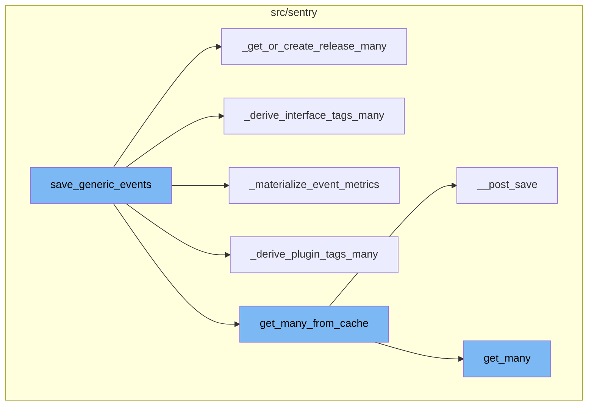
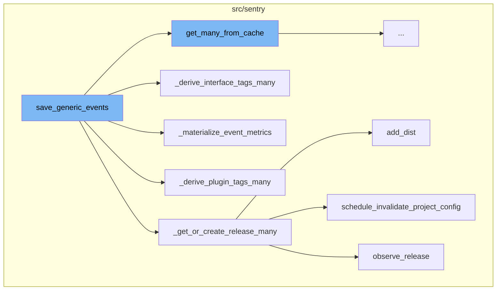
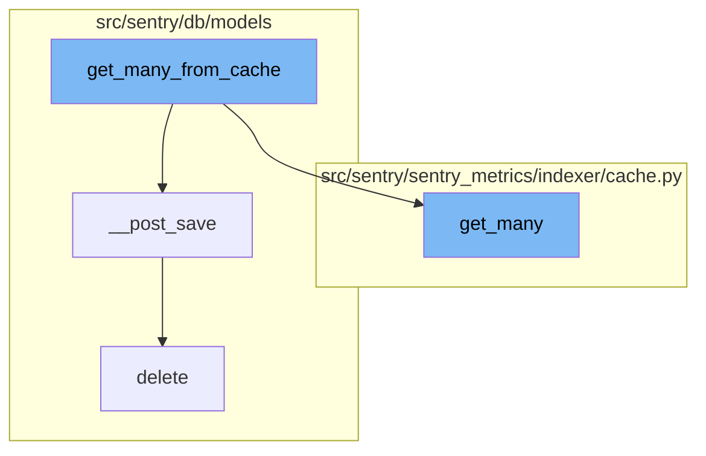

# Overview of save_generic_events

The `save_generic_events` function is a key component in the Sentry application. It is responsible for processing and saving events. The function takes a sequence of jobs and a mapping of projects as arguments. It fetches the organizations associated with the projects and sets the cached field value for each project's organization. Then, it calls several helper functions to process the jobs.

## Helper Functions

Several helper functions are called within `save_generic_events` to process the jobs. These include `_get_or_create_release_many`, `_derive_interface_tags_many`, `_materialize_event_metrics`, and `_derive_plugin_tags_many`. Each of these functions performs a specific task in the processing of the jobs.

## Caching

The `get_many_from_cache` function is used within `save_generic_events` to fetch data from the cache. If the required data is not in the cache, it fetches them from the database and stores them in the cache. After saving an instance, the `__post_save` function is called to push changes to the instance into the cache and remove invalid (changed) lookup values.

## Deletion

The `delete` function is used to soft delete an instance by updating the `date_deleted` field to the current time. This function is part of the `paranoia` module in Sentry, which provides utilities for soft deletion.



# Flow drill down

First, we'll zoom into this section of the flow:



<SwmSnippet path="/src/sentry/event_manager.py" line="3074">

---

# save_generic_events Function

The `save_generic_events` function is the main entry point for saving events. It takes a sequence of jobs and a mapping of projects as arguments. It first fetches the organizations associated with the projects. Then, it iterates over the projects and sets the cached field value for each project's organization. After that, it calls several helper functions to process the jobs.

```python
def save_generic_events(jobs: Sequence[Job], projects: ProjectsMapping) -> Sequence[Job]:
    organization_ids = {project.organization_id for project in projects.values()}
    organizations = {o.id: o for o in Organization.objects.get_many_from_cache(organization_ids)}

    for project in projects.values():
        try:
            project.set_cached_field_value("organization", organizations[project.organization_id])
        except KeyError:
            continue

    _get_or_create_release_many(jobs, projects)
    _get_event_user_many(jobs, projects)
    _derive_plugin_tags_many(jobs, projects)
    _derive_interface_tags_many(jobs)
    _materialize_metadata_many(jobs)
    _get_or_create_environment_many(jobs, projects)
    _materialize_event_metrics(jobs)
    _nodestore_save_many(jobs=jobs, app_feature="issue_platform")

    return jobs
```

---

</SwmSnippet>

<SwmSnippet path="/src/sentry/event_manager.py" line="747">

---

## \_get_or_create_release_many Function

The `_get_or_create_release_many` function is called within `save_generic_events`. It groups jobs by their release and project id. For each group, it tries to get or create a release. If a release is created, it updates the job's data with the release version and possibly a distribution. It also schedules an invalidation of the project's configuration if the release is boosted.

```python
def _get_or_create_release_many(jobs: Sequence[Job], projects: ProjectsMapping) -> None:
    jobs_with_releases: dict[tuple[int, str], list[Job]] = {}
    release_date_added: dict[tuple[int, str], datetime] = {}

    for job in jobs:
        if not job["release"]:
            continue

        release_key = (job["project_id"], job["release"])
        jobs_with_releases.setdefault(release_key, []).append(job)
        new_datetime = job["event"].datetime
        old_datetime = release_date_added.get(release_key)
        if old_datetime is None or new_datetime > old_datetime:
            release_date_added[release_key] = new_datetime

    for (project_id, version), jobs_to_update in jobs_with_releases.items():
        try:
            release = Release.get_or_create(
                project=projects[project_id],
                version=version,
                date_added=release_date_added[(project_id, version)],
```

---

</SwmSnippet>

<SwmSnippet path="/src/sentry/event_manager.py" line="871">

---

## \_derive_interface_tags_many Function

The `_derive_interface_tags_many` function is also called within `save_generic_events`. It iterates over the jobs and for each job, it iterates over the interfaces of the event. For each interface, it sets the tags in the job's data. If the interface is ephemeral, it removes the interface data from the job's data.

```python
def _derive_interface_tags_many(jobs: Sequence[Job]) -> None:
    # XXX: We ought to inline or remove this one for sure
    for job in jobs:
        data = job["data"]
        for path, iface in job["event"].interfaces.items():
            for k, v in iface.iter_tags():
                set_tag(data, k, v)

            # Get rid of ephemeral interface data
            if iface.ephemeral:
                data.pop(iface.path, None)
```

---

</SwmSnippet>

<SwmSnippet path="/src/sentry/event_manager.py" line="2925">

---

## \_materialize_event_metrics Function

The `_materialize_event_metrics` function is another function called within `save_generic_events`. It ensures that the `_metrics` key exists in the event's data and captures the actual size of the event that goes into the node store. It also increments metrics if certain flags are set in the event metrics.

```python
def _materialize_event_metrics(jobs: Sequence[Job]) -> None:
    for job in jobs:
        # Ensure the _metrics key exists. This is usually created during
        # and prefilled with ingestion sizes.
        event_metrics = job["event"].data.get("_metrics") or {}
        job["event"].data["_metrics"] = event_metrics

        # Capture the actual size that goes into node store.
        event_metrics["bytes.stored.event"] = len(
            orjson.dumps(dict(job["event"].data.items())).decode()
        )

        for metric_name in ("flag.processing.error", "flag.processing.fatal"):
            if event_metrics.get(metric_name):
                metrics.incr(f"event_manager.save.event_metrics.{metric_name}")

        job["event_metrics"] = event_metrics
```

---

</SwmSnippet>

<SwmSnippet path="/src/sentry/event_manager.py" line="856">

---

## \_derive_plugin_tags_many Function

The `_derive_plugin_tags_many` function is called within `save_generic_events`. It gets the plugins for each project and for each job, it executes the `get_tags` method of each plugin. If tags are added by the plugin, they are set in the job's data unless they are already set by the user.

```python
def _derive_plugin_tags_many(jobs: Sequence[Job], projects: ProjectsMapping) -> None:
    # XXX: We ought to inline or remove this one for sure
    plugins_for_projects = {p.id: plugins.for_project(p, version=None) for p in projects.values()}

    for job in jobs:
        for plugin in plugins_for_projects[job["project_id"]]:
            added_tags = safe_execute(plugin.get_tags, job["event"])
            if added_tags:
                data = job["data"]
                # plugins should not override user provided tags
                for key, value in added_tags:
                    if get_tag(data, key) is None:
                        set_tag(data, key, value)
```

---

</SwmSnippet>

Now, lets zoom into this section of the flow:



<SwmSnippet path="/src/sentry/db/models/manager/base.py" line="360">

---

# get_many_from_cache

The `get_many_from_cache` function is a wrapper around `QuerySet.filter(pk__in=values)` which supports caching of the intermediate value. It queries by primary key or some other unique identifier. The function checks if the values are in the local cache, if not, it fetches them from the database and stores them in the cache.

```python
    def get_many_from_cache(self, values: Collection[str | int], key: str = "pk") -> Sequence[Any]:
        """
        Wrapper around `QuerySet.filter(pk__in=values)` which supports caching of
        the intermediate value.  Callee is responsible for making sure the
        cache key is cleared on save.

        NOTE: We can only query by primary key or some other unique identifier.
        It is not possible to e.g. run `Project.objects.get_many_from_cache([1,
        2, 3], key="organization_id")` and get back all projects belonging to
        those orgs. The length of the return value is bounded by the length of
        `values`.

        For most models, if one attempts to use a non-PK value this will just
        degrade to a DB query, like with `get_from_cache`.
        """

        pk_name = self.model._meta.pk.name

        if key == "pk":
            key = pk_name

```

---

</SwmSnippet>

<SwmSnippet path="/src/sentry/db/models/manager/base.py" line="188">

---

# \__post_save

The `__post_save` function is called after saving an instance. It pushes changes to an instance into the cache, and removes invalid (changed) lookup values. It also ensures that the database is not serialized into the cache.

```python
    def __post_save(self, instance: M, **kwargs: Any) -> None:
        """
        Pushes changes to an instance into the cache, and removes invalid (changed)
        lookup values.
        """
        pk_name = instance._meta.pk.name
        pk_names = ("pk", pk_name)
        pk_val = instance.pk
        for key in self.cache_fields:
            if key in pk_names:
                continue
            # store pointers
            value = self.__value_for_field(instance, key)
            cache.set(
                key=self.__get_lookup_cache_key(**{key: value}),
                value=pk_val,
                timeout=self.cache_ttl,
                version=self.cache_version,
            )

        # Ensure we don't serialize the database into the cache
```

---

</SwmSnippet>

<SwmSnippet path="/src/sentry/sentry_metrics/indexer/cache.py" line="158">

---

# get_many

The `get_many` function in the `sentry_metrics` module retrieves multiple keys from the cache. It checks if the `NAMESPACED_READ_FEAT_FLAG` is set, if so, it increments the `_INDEXER_CACHE_DOUBLE_READ_METRIC` and fetches the keys from the cache.

```python
    def get_many(self, namespace: str, keys: Iterable[str]) -> MutableMapping[str, int | None]:
        if options.get(NAMESPACED_READ_FEAT_FLAG):
            metrics.incr(_INDEXER_CACHE_DOUBLE_READ_METRIC)
            cache_keys = {self._make_namespaced_cache_key(namespace, key): key for key in keys}
            namespaced_results: MutableMapping[str, int | None] = {
                k: self._validate_result(v)
                for k, v in self.cache.get_many(cache_keys.keys(), version=self.version).items()
            }
            return self._format_namespaced_results(
                namespace,
                keys,
                namespaced_results,
            )
        else:
            cache_keys = {self._make_cache_key(key): key for key in keys}
            results: Mapping[str, int | None] = self.cache.get_many(
                cache_keys.keys(), version=self.version
            )
            return self._format_results(keys, results)
```

---

</SwmSnippet>

<SwmSnippet path="/src/sentry/db/models/paranoia.py" line="24">

---

# delete

The `delete` function is used to soft delete an instance by updating the `date_deleted` field to the current time.

```python
    def delete(self) -> tuple[int, dict[str, int]]:
        self.update(date_deleted=timezone.now())
        return _bogus_delete_return_value()
```

---

</SwmSnippet>

&nbsp;

*This is an auto-generated document by Swimm AI 🌊 and has not yet been verified by a human*

<SwmMeta version="3.0.0" repo-id="Z2l0aHViJTNBJTNBc2VudHJ5LWRlbW8lM0ElM0FTd2ltbS1EZW1v" repo-name="sentry-demo" doc-type="flows"><sup>Powered by [Swimm](/)</sup></SwmMeta>
