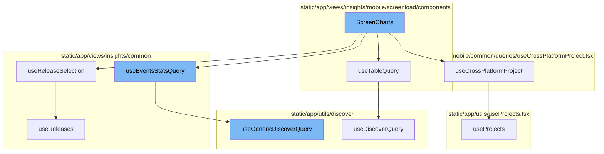

<SwmSnippet path="/static/app/views/insights/mobile/screenload/components/charts/screenCharts.tsx" line="55">

---

# ScreenCharts Function

The `ScreenCharts` function is the main component of the flow. It uses several hooks and functions to gather and process data, and then renders the charts. It uses the `usePageFilters`, `useLocation`, and `useCrossPlatformProject` hooks to get the necessary data for processing. The `useMemo` hook is used to create a memoized version of the query string. The `useTableQuery` function is used to fetch data for the table. The `transformDeviceClassEvents` function is used to transform the fetched data into a format suitable for rendering in the charts.

```tsx
export function ScreenCharts({yAxes, additionalFilters}: Props) {
  const pageFilter = usePageFilters();
  const location = useLocation();
  const {isProjectCrossPlatform, selectedPlatform: platform} = useCrossPlatformProject();

  const yAxisCols = yAxes.map(val => YAXIS_COLUMNS[val]);

  const {
    primaryRelease,
    secondaryRelease,
    isLoading: isReleasesLoading,
  } = useReleaseSelection();

  const queryString = useMemo(() => {
    const query = new MutableSearch([
      'event.type:transaction',
      'transaction.op:ui.load',
      ...(additionalFilters ?? []),
    ]);

    if (isProjectCrossPlatform) {
```

---

</SwmSnippet>

<SwmSnippet path="/static/app/views/insights/mobile/screenload/components/tables/screensTable.tsx" line="252">

---

# useTableQuery Function

The `useTableQuery` function is a custom hook that fetches data for the table. It uses the `useLocation`, `useOrganization`, and `usePageFilters` hooks to get the necessary data for the query. It then uses the `useDiscoverQuery` function to fetch the data from the server.

```tsx
export function useTableQuery({
  eventView,
  enabled,
  referrer,
  initialData,
  limit,
  staleTime,
  cursor,
}: {
  eventView: EventView;
  cursor?: string;
  enabled?: boolean;
  excludeOther?: boolean;
  initialData?: TableData;
  limit?: number;
  referrer?: string;
  staleTime?: number;
}) {
  const location = useLocation();
  const organization = useOrganization();
  const {isReady: pageFiltersReady} = usePageFilters();
```

---

</SwmSnippet>

<SwmSnippet path="/static/app/views/insights/common/queries/useReleases.tsx" line="116">

---

# useReleaseSelection Function

The `useReleaseSelection` function is a custom hook that fetches data about the selected releases. It uses the `useLocation` hook to get the current location, and the `useReleases` function to fetch the data about the releases. It then processes the fetched data to determine the primary and secondary releases.

```tsx
export function useReleaseSelection(): {
  isLoading: boolean;
  primaryRelease: string | undefined;
  secondaryRelease: string | undefined;
} {
  const location = useLocation();

  const {data: releases, isLoading} = useReleases();

  // If there are more than 1 release, the first one should be the older one
  const primaryRelease =
    decodeScalar(location.query.primaryRelease) ??
    (releases && releases.length > 1 ? releases?.[1]?.version : releases?.[0]?.version);

  // If there are more than 1 release, the second one should be the newest one
  const secondaryRelease =
    decodeScalar(location.query.secondaryRelease) ??
    (releases && releases.length > 1 ? releases?.[0]?.version : undefined);

  return {primaryRelease, secondaryRelease, isLoading};
}
```

---

</SwmSnippet>

<SwmSnippet path="/static/app/views/insights/mobile/common/queries/useCrossPlatformProject.tsx" line="13">

---

# useCrossPlatformProject Function

The `useCrossPlatformProject` function is a custom hook that fetches data about the selected project. It uses the `usePageFilters` and `useProjects` hooks to get the necessary data for the query. It then processes the fetched data to determine if the project is cross-platform and to get the selected platform.

```tsx
function useCrossPlatformProject() {
  const {selection} = usePageFilters();
  const {projects} = useProjects();
  const location = useLocation();

  const project = useMemo(() => {
    if (selection.projects.length !== 1) {
      return null;
    }

    return projects.find(p => p.id === String(selection.projects)) ?? null;
  }, [projects, selection.projects]);

  const isProjectCrossPlatform = useMemo(
    () => !!(project && isCrossPlatform(project)),
    [project]
  );

  const selectedPlatform =
    decodeScalar(location.query[PLATFORM_QUERY_PARAM]) ??
    localStorage.getItem(PLATFORM_LOCAL_STORAGE_KEY) ??
```

---

</SwmSnippet>

<SwmSnippet path="/static/app/views/insights/common/utils/useEventsStatsQuery.tsx" line="13">

---

# useEventsStatsQuery Function

The `useEventsStatsQuery` function is a custom hook that fetches data about the events stats. It uses the `useLocation` and `useOrganization` hooks to get the necessary data for the query. It then uses the `useGenericDiscoverQuery` function to fetch the data from the server.

```tsx
export function useEventsStatsQuery({
  eventView,
  enabled,
  referrer,
  initialData,
  excludeOther = false,
}: {
  eventView: EventView;
  enabled?: boolean;
  excludeOther?: boolean;
  initialData?: MultiSeriesEventsStats;
  referrer?: string;
}) {
  const location = useLocation();
  const organization = useOrganization();
  const result = useGenericDiscoverQuery<MultiSeriesEventsStats, DiscoverQueryProps>({
    route: 'events-stats',
    eventView,
    location,
    orgSlug: organization.slug,
    getRequestPayload: () => ({
```

---

</SwmSnippet>

<SwmSnippet path="/static/app/utils/discover/genericDiscoverQuery.tsx" line="419">

---

# useGenericDiscoverQuery Function

The `useGenericDiscoverQuery` function is a generic function that fetches data from the server. It uses the `useApi` hook to get the API instance, and then uses it to send a request to the server. The response from the server is then processed and returned.

```tsx
export function useGenericDiscoverQuery<T, P>(props: Props<T, P>) {
  const api = useApi();
  const {orgSlug, route, options} = props;
  const url = `/organizations/${orgSlug}/${route}/`;
  const apiPayload = getPayload<T, P>(props);

  const res = useQuery<[T, string | undefined, ResponseMeta<T> | undefined], QueryError>(
    [route, apiPayload],
    ({signal: _signal}) =>
      doDiscoverQuery<T>(api, url, apiPayload, {
        queryBatching: props.queryBatching,
        skipAbort: props.skipAbort,
      }),
    options
  );

  return {
    ...res,
    data: res.data?.[0] ?? undefined,
    error: parseError(res.error),
    statusCode: res.data?.[1] ?? undefined,
```

---

</SwmSnippet>



# Flow drill down


<SwmSnippet path="/static/app/views/insights/mobile/screenload/components/charts/screenCharts.tsx" line="55">

---

# ScreenCharts Function

The `ScreenCharts` function is the main component of the flow. It uses several hooks and functions to gather and process data, and then renders the charts. It uses the `usePageFilters`, `useLocation`, and `useCrossPlatformProject` hooks to get the necessary data for processing. The `useMemo` hook is used to create a memoized version of the query string. The `useTableQuery` function is used to fetch data for the table. The `transformDeviceClassEvents` function is used to transform the fetched data into a format suitable for rendering in the charts.

```tsx
export function ScreenCharts({yAxes, additionalFilters}: Props) {
  const pageFilter = usePageFilters();
  const location = useLocation();
  const {isProjectCrossPlatform, selectedPlatform: platform} = useCrossPlatformProject();

  const yAxisCols = yAxes.map(val => YAXIS_COLUMNS[val]);

  const {
    primaryRelease,
    secondaryRelease,
    isLoading: isReleasesLoading,
  } = useReleaseSelection();

  const queryString = useMemo(() => {
    const query = new MutableSearch([
      'event.type:transaction',
      'transaction.op:ui.load',
      ...(additionalFilters ?? []),
    ]);

    if (isProjectCrossPlatform) {
```

---

</SwmSnippet>

<SwmSnippet path="/static/app/views/insights/mobile/screenload/components/tables/screensTable.tsx" line="252">

---

# useTableQuery Function

The `useTableQuery` function is a custom hook that fetches data for the table. It uses the `useLocation`, `useOrganization`, and `usePageFilters` hooks to get the necessary data for the query. It then uses the `useDiscoverQuery` function to fetch the data from the server.

```tsx
export function useTableQuery({
  eventView,
  enabled,
  referrer,
  initialData,
  limit,
  staleTime,
  cursor,
}: {
  eventView: EventView;
  cursor?: string;
  enabled?: boolean;
  excludeOther?: boolean;
  initialData?: TableData;
  limit?: number;
  referrer?: string;
  staleTime?: number;
}) {
  const location = useLocation();
  const organization = useOrganization();
  const {isReady: pageFiltersReady} = usePageFilters();
```

---

</SwmSnippet>

<SwmSnippet path="/static/app/views/insights/common/queries/useReleases.tsx" line="116">

---

# useReleaseSelection Function

The `useReleaseSelection` function is a custom hook that fetches data about the selected releases. It uses the `useLocation` hook to get the current location, and the `useReleases` function to fetch the data about the releases. It then processes the fetched data to determine the primary and secondary releases.

```tsx
export function useReleaseSelection(): {
  isLoading: boolean;
  primaryRelease: string | undefined;
  secondaryRelease: string | undefined;
} {
  const location = useLocation();

  const {data: releases, isLoading} = useReleases();

  // If there are more than 1 release, the first one should be the older one
  const primaryRelease =
    decodeScalar(location.query.primaryRelease) ??
    (releases && releases.length > 1 ? releases?.[1]?.version : releases?.[0]?.version);

  // If there are more than 1 release, the second one should be the newest one
  const secondaryRelease =
    decodeScalar(location.query.secondaryRelease) ??
    (releases && releases.length > 1 ? releases?.[0]?.version : undefined);

  return {primaryRelease, secondaryRelease, isLoading};
}
```

---

</SwmSnippet>

<SwmSnippet path="/static/app/views/insights/mobile/common/queries/useCrossPlatformProject.tsx" line="13">

---

# useCrossPlatformProject Function

The `useCrossPlatformProject` function is a custom hook that fetches data about the selected project. It uses the `usePageFilters` and `useProjects` hooks to get the necessary data for the query. It then processes the fetched data to determine if the project is cross-platform and to get the selected platform.

```tsx
function useCrossPlatformProject() {
  const {selection} = usePageFilters();
  const {projects} = useProjects();
  const location = useLocation();

  const project = useMemo(() => {
    if (selection.projects.length !== 1) {
      return null;
    }

    return projects.find(p => p.id === String(selection.projects)) ?? null;
  }, [projects, selection.projects]);

  const isProjectCrossPlatform = useMemo(
    () => !!(project && isCrossPlatform(project)),
    [project]
  );

  const selectedPlatform =
    decodeScalar(location.query[PLATFORM_QUERY_PARAM]) ??
    localStorage.getItem(PLATFORM_LOCAL_STORAGE_KEY) ??
```

---

</SwmSnippet>

<SwmSnippet path="/static/app/views/insights/common/utils/useEventsStatsQuery.tsx" line="13">

---

# useEventsStatsQuery Function

The `useEventsStatsQuery` function is a custom hook that fetches data about the events stats. It uses the `useLocation` and `useOrganization` hooks to get the necessary data for the query. It then uses the `useGenericDiscoverQuery` function to fetch the data from the server.

```tsx
export function useEventsStatsQuery({
  eventView,
  enabled,
  referrer,
  initialData,
  excludeOther = false,
}: {
  eventView: EventView;
  enabled?: boolean;
  excludeOther?: boolean;
  initialData?: MultiSeriesEventsStats;
  referrer?: string;
}) {
  const location = useLocation();
  const organization = useOrganization();
  const result = useGenericDiscoverQuery<MultiSeriesEventsStats, DiscoverQueryProps>({
    route: 'events-stats',
    eventView,
    location,
    orgSlug: organization.slug,
    getRequestPayload: () => ({
```

---

</SwmSnippet>

<SwmSnippet path="/static/app/utils/discover/genericDiscoverQuery.tsx" line="419">

---

# useGenericDiscoverQuery Function

The `useGenericDiscoverQuery` function is a generic function that fetches data from the server. It uses the `useApi` hook to get the API instance, and then uses it to send a request to the server. The response from the server is then processed and returned.

```tsx
export function useGenericDiscoverQuery<T, P>(props: Props<T, P>) {
  const api = useApi();
  const {orgSlug, route, options} = props;
  const url = `/organizations/${orgSlug}/${route}/`;
  const apiPayload = getPayload<T, P>(props);

  const res = useQuery<[T, string | undefined, ResponseMeta<T> | undefined], QueryError>(
    [route, apiPayload],
    ({signal: _signal}) =>
      doDiscoverQuery<T>(api, url, apiPayload, {
        queryBatching: props.queryBatching,
        skipAbort: props.skipAbort,
      }),
    options
  );

  return {
    ...res,
    data: res.data?.[0] ?? undefined,
    error: parseError(res.error),
    statusCode: res.data?.[1] ?? undefined,
```

---

</SwmSnippet>

&nbsp;

*This is an auto-generated document by Swimm AI 🌊 and has not yet been verified by a human*

<SwmMeta version="3.0.0" repo-id="Z2l0aHViJTNBJTNBc2VudHJ5LWRlbW8lM0ElM0FTd2ltbS1EZW1v" repo-name="sentry-demo" doc-type="flows"><sup>Powered by [Swimm](/)</sup></SwmMeta>
