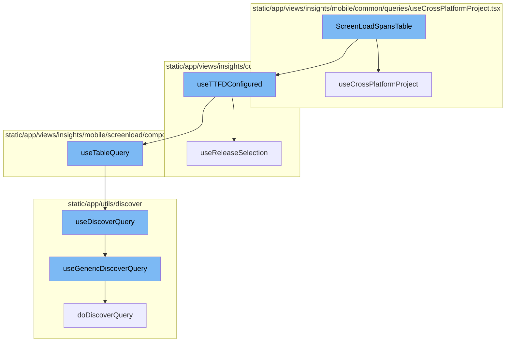
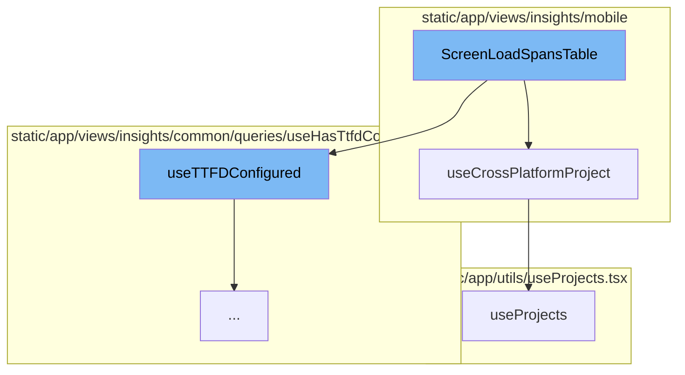
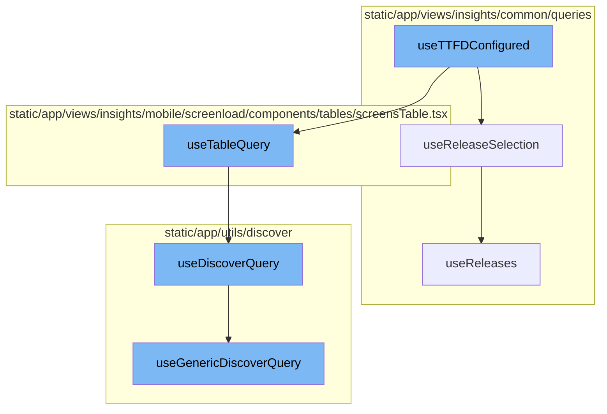

# ScreenLoadSpansTable Overview

ScreenLoadSpansTable is a component that displays a table of span metrics. It uses several hooks to gather necessary data and context, such as the current location, organization, and selection filters. It also uses the `useCrossPlatformProject` and `useTTFDConfigured` hooks to determine if the project is cross-platform and if TTFD is configured, respectively. The function then constructs a query and uses the `useTableQuery` hook to fetch the data. The returned data is then used to render the table.

# useCrossPlatformProject Hook

The `useCrossPlatformProject` hook is used to determine if the selected project is cross-platform. It uses the `usePageFilters` hook to get the current selection and the `useProjects` hook to get the list of projects. It then finds the selected project and checks if it is cross-platform. The hook returns an object containing the project, the selected platform, and a boolean indicating if the project is cross-platform.

# useProjects Hook

The `useProjects` hook is used to fetch projects from the ProjectsStore. It provides a way to select specific project slugs and search for more projects that may not be in the project store. It returns an object containing the projects, placeholders for loading, and several other properties related to the loading state and error handling.

# useTTFDConfigured

The `useTTFDConfigured` function is the starting point of the flow. It uses the `useLocation` hook to get the current location and `useReleaseSelection` to get the primary and secondary releases. It then constructs a query with these and other parameters, and passes it to `useTableQuery`. The function also checks if the data returned from `useTableQuery` has a non-zero time to initial display (TTFD) and a zero time to full display (TTFD), and returns this information along with the result from `useTableQuery`.

# useReleaseSelection

The `useReleaseSelection` function is used within `useTTFDConfigured` to get the primary and secondary releases. It uses the `useLocation` hook to get the current location and `useReleases` to get the releases. If there are more than one release, it sets the older one as the primary release and the newest one as the secondary release.

# useTableQuery

The `useTableQuery` function is used within `useTTFDConfigured` to execute a query. It uses the `useLocation` and `useOrganization` hooks to get the current location and organization, and `usePageFilters` to get the page filters. It then passes these along with other parameters to `useDiscoverQuery`.

# useDiscoverQuery

The `useDiscoverQuery` function is used within `useTableQuery` to execute a query. It uses `useGenericDiscoverQuery` to execute the query and returns the result along with the page links.

# useGenericDiscoverQuery

The `useGenericDiscoverQuery` function is used within `useDiscoverQuery` to execute a query. It uses the `useApi` hook to get the API and executes the query using `doDiscoverQuery`. It returns the result along with the status code and response.



# Flow drill down

First, we'll zoom into this section of the flow:



<SwmSnippet path="/static/app/views/insights/mobile/screenload/components/tables/screenLoadSpansTable.tsx" line="58">

---

# ScreenLoadSpansTable Function

The `ScreenLoadSpansTable` function is a component that displays a table of span metrics. It uses several hooks to gather necessary data and context, such as the current location, organization, and selection filters. It also uses the `useCrossPlatformProject` and `useTTFDConfigured` hooks to determine if the project is cross-platform and if TTFD is configured, respectively. The function then constructs a query and uses the `useTableQuery` hook to fetch the data. The returned data is then used to render the table.

```tsx
export function ScreenLoadSpansTable({
  transaction,
  primaryRelease,
  secondaryRelease,
}: Props) {
  const moduleURL = useModuleURL('screen_load');
  const location = useLocation();
  const {selection} = usePageFilters();
  const organization = useOrganization();
  const cursor = decodeScalar(location.query?.[MobileCursors.SPANS_TABLE]);
  const {isProjectCrossPlatform, selectedPlatform} = useCrossPlatformProject();

  const spanOp = decodeScalar(location.query[SpanMetricsField.SPAN_OP]) ?? '';
  const {hasTTFD, isLoading: hasTTFDLoading} = useTTFDConfigured([
    `transaction:"${transaction}"`,
  ]);

  const queryStringPrimary = useMemo(() => {
    const searchQuery = new MutableSearch([
      'transaction.op:ui.load',
      `transaction:${transaction}`,
```

---

</SwmSnippet>

<SwmSnippet path="/static/app/views/insights/mobile/common/queries/useCrossPlatformProject.tsx" line="13">

---

# useCrossPlatformProject Hook

The `useCrossPlatformProject` hook is used to determine if the selected project is cross-platform. It uses the `usePageFilters` hook to get the current selection and the `useProjects` hook to get the list of projects. It then finds the selected project and checks if it is cross-platform. The hook returns an object containing the project, the selected platform, and a boolean indicating if the project is cross-platform.

```tsx
function useCrossPlatformProject() {
  const {selection} = usePageFilters();
  const {projects} = useProjects();
  const location = useLocation();

  const project = useMemo(() => {
    if (selection.projects.length !== 1) {
      return null;
    }

    return projects.find(p => p.id === String(selection.projects)) ?? null;
  }, [projects, selection.projects]);

  const isProjectCrossPlatform = useMemo(
    () => !!(project && isCrossPlatform(project)),
    [project]
  );

  const selectedPlatform =
    decodeScalar(location.query[PLATFORM_QUERY_PARAM]) ??
    localStorage.getItem(PLATFORM_LOCAL_STORAGE_KEY) ??
```

---

</SwmSnippet>

<SwmSnippet path="/static/app/utils/useProjects.tsx" line="141">

---

# useProjects Hook

The `useProjects` hook is used to fetch projects from the ProjectsStore. It provides a way to select specific project slugs and search for more projects that may not be in the project store. It returns an object containing the projects, placeholders for loading, and several other properties related to the loading state and error handling.

```tsx
/**
 * Provides projects from the ProjectsStore
 *
 * This hook also provides a way to select specific project slugs, and search
 * (type-ahead) for more projects that may not be in the project store.
 *
 * NOTE: Currently ALL projects are always loaded, but this hook is designed
 * for future-compat in a world where we do _not_ load all projects.
 */
function useProjects({limit, slugs, orgId: propOrgId}: Options = {}) {
  const api = useApi();

  const organization = useOrganization({allowNull: true});
  const store = useLegacyStore(ProjectsStore);

  const orgId = propOrgId ?? organization?.slug ?? organization?.slug;

  const storeSlugs = new Set(store.projects.map(t => t.slug));
  const slugsToLoad = slugs?.filter(slug => !storeSlugs.has(slug)) ?? [];
  const shouldLoadSlugs = slugsToLoad.length > 0;

```

---

</SwmSnippet>

Now, lets zoom into this section of the flow:



<SwmSnippet path="/static/app/views/insights/common/queries/useHasTtfdConfigured.tsx" line="11">

---

# useTTFDConfigured

The `useTTFDConfigured` function is the starting point of the flow. It uses the `useLocation` hook to get the current location and `useReleaseSelection` to get the primary and secondary releases. It then constructs a query with these and other parameters, and passes it to `useTableQuery`. The function also checks if the data returned from `useTableQuery` has a non-zero time to initial display (TTFD) and a zero time to full display (TTFD), and returns this information along with the result from `useTableQuery`.

```tsx
export function useTTFDConfigured(additionalFilters?: string[]) {
  const location = useLocation();

  const {
    primaryRelease,
    secondaryRelease,
    isLoading: isReleasesLoading,
  } = useReleaseSelection();

  const {selection} = usePageFilters();

  const query = new MutableSearch([
    'event.type:transaction',
    'transaction.op:ui.load',
    ...(additionalFilters ?? []),
  ]);

  const queryString = appendReleaseFilters(query, primaryRelease, secondaryRelease);

  const newQuery: NewQuery = {
    name: '',
```

---

</SwmSnippet>

<SwmSnippet path="/static/app/views/insights/common/queries/useReleases.tsx" line="116">

---

# useReleaseSelection

The `useReleaseSelection` function is used within `useTTFDConfigured` to get the primary and secondary releases. It uses the `useLocation` hook to get the current location and `useReleases` to get the releases. If there are more than one release, it sets the older one as the primary release and the newest one as the secondary release.

```tsx
export function useReleaseSelection(): {
  isLoading: boolean;
  primaryRelease: string | undefined;
  secondaryRelease: string | undefined;
} {
  const location = useLocation();

  const {data: releases, isLoading} = useReleases();

  // If there are more than 1 release, the first one should be the older one
  const primaryRelease =
    decodeScalar(location.query.primaryRelease) ??
    (releases && releases.length > 1 ? releases?.[1]?.version : releases?.[0]?.version);

  // If there are more than 1 release, the second one should be the newest one
  const secondaryRelease =
    decodeScalar(location.query.secondaryRelease) ??
    (releases && releases.length > 1 ? releases?.[0]?.version : undefined);

  return {primaryRelease, secondaryRelease, isLoading};
}
```

---

</SwmSnippet>

<SwmSnippet path="/static/app/views/insights/mobile/screenload/components/tables/screensTable.tsx" line="252">

---

# useTableQuery

The `useTableQuery` function is used within `useTTFDConfigured` to execute a query. It uses the `useLocation` and `useOrganization` hooks to get the current location and organization, and `usePageFilters` to get the page filters. It then passes these along with other parameters to `useDiscoverQuery`.

```tsx
export function useTableQuery({
  eventView,
  enabled,
  referrer,
  initialData,
  limit,
  staleTime,
  cursor,
}: {
  eventView: EventView;
  cursor?: string;
  enabled?: boolean;
  excludeOther?: boolean;
  initialData?: TableData;
  limit?: number;
  referrer?: string;
  staleTime?: number;
}) {
  const location = useLocation();
  const organization = useOrganization();
  const {isReady: pageFiltersReady} = usePageFilters();
```

---

</SwmSnippet>

<SwmSnippet path="/static/app/utils/discover/discoverQuery.tsx" line="72">

---

# useDiscoverQuery

The `useDiscoverQuery` function is used within `useTableQuery` to execute a query. It uses `useGenericDiscoverQuery` to execute the query and returns the result along with the page links.

```tsx
export function useDiscoverQuery(props: Omit<DiscoverQueryComponentProps, 'children'>) {
  const afterFetch = (data, _) => {
    const {fields, ...otherMeta} = data.meta ?? {};
    return {
      ...data,
      meta: {...fields, ...otherMeta},
    };
  };

  const res = useGenericDiscoverQuery<TableData, DiscoverQueryPropsWithThresholds>({
    route: 'events',
    shouldRefetchData,
    afterFetch,
    ...props,
  });

  const pageLinks = res.response?.getResponseHeader('Link') ?? undefined;

  return {...res, pageLinks};
}
```

---

</SwmSnippet>

<SwmSnippet path="/static/app/utils/discover/genericDiscoverQuery.tsx" line="419">

---

# useGenericDiscoverQuery

The `useGenericDiscoverQuery` function is used within `useDiscoverQuery` to execute a query. It uses the `useApi` hook to get the API and executes the query using `doDiscoverQuery`. It returns the result along with the status code and response.

```tsx
export function useGenericDiscoverQuery<T, P>(props: Props<T, P>) {
  const api = useApi();
  const {orgSlug, route, options} = props;
  const url = `/organizations/${orgSlug}/${route}/`;
  const apiPayload = getPayload<T, P>(props);

  const res = useQuery<[T, string | undefined, ResponseMeta<T> | undefined], QueryError>(
    [route, apiPayload],
    ({signal: _signal}) =>
      doDiscoverQuery<T>(api, url, apiPayload, {
        queryBatching: props.queryBatching,
        skipAbort: props.skipAbort,
      }),
    options
  );

  return {
    ...res,
    data: res.data?.[0] ?? undefined,
    error: parseError(res.error),
    statusCode: res.data?.[1] ?? undefined,
```

---

</SwmSnippet>

&nbsp;

*This is an auto-generated document by Swimm AI 🌊 and has not yet been verified by a human*

<SwmMeta version="3.0.0" repo-id="Z2l0aHViJTNBJTNBc2VudHJ5LWRlbW8lM0ElM0FTd2ltbS1EZW1v" repo-name="sentry-demo" doc-type="flows"><sup>Powered by [Swimm](/)</sup></SwmMeta>
