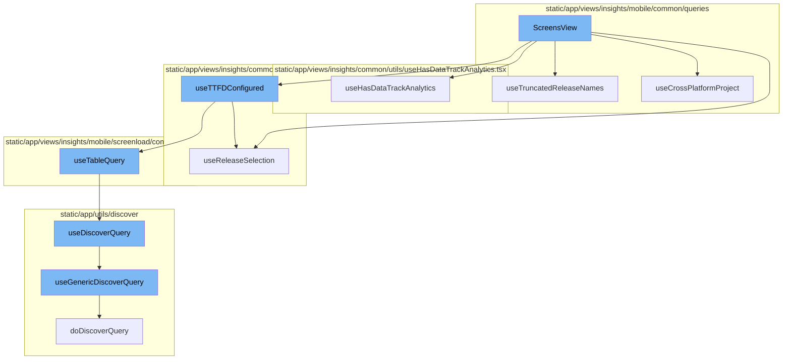
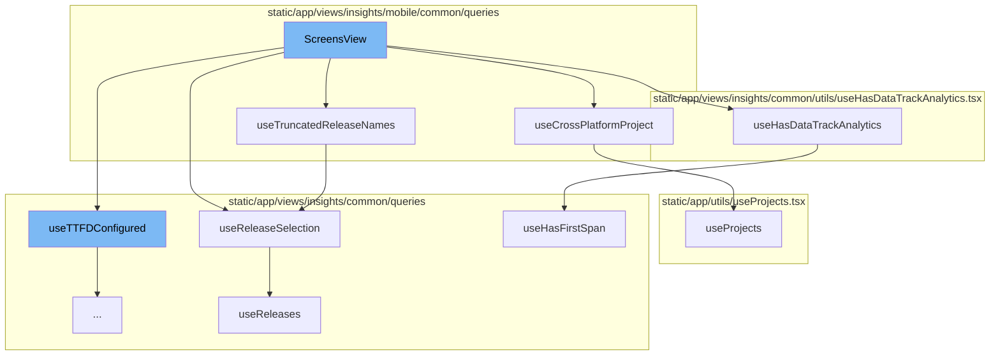
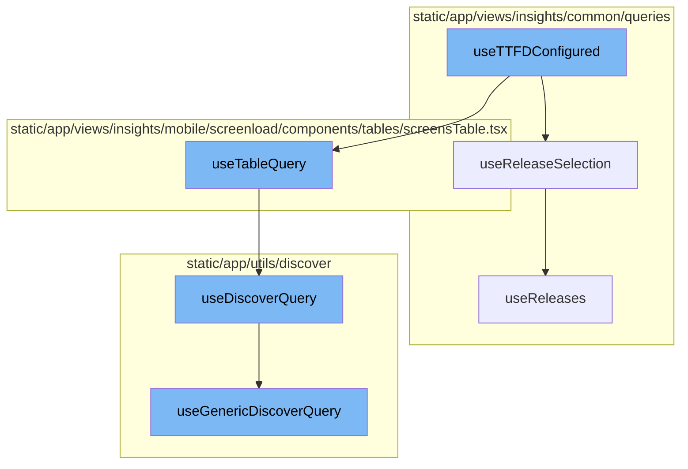

# ScreensView Overview

ScreensView is a component that renders the screen view for mobile insights in the Sentry application. It uses several hooks to gather necessary data and configurations, and then constructs queries to fetch the required data for rendering the charts and tables.

## useTruncatedReleaseNames Hook

The `useTruncatedReleaseNames` hook is used within the `ScreensView` function to get the primary and secondary release names in a truncated format. This is useful for displaying the release names in a limited space, such as in a chart label.

## useReleaseSelection Hook

The `useReleaseSelection` hook is used to select the primary and secondary releases based on the location query or the releases data. This hook is used in both `ScreensView` and `useTruncatedReleaseNames`.

## useHasDataTrackAnalytics Hook

The `useHasDataTrackAnalytics` hook is used to track analytics related to the data. It is used in the `ScreensView` function to track whether the module has ever sent data.

## useCrossPlatformProject Hook

The `useCrossPlatformProject` hook is used to determine if the selected project is a cross-platform project. It is used in the `ScreensView` function to conditionally add a filter to the query.

## useProjects Hook

The `useProjects` hook is used to fetch the projects data. It is used in the `useCrossPlatformProject` hook to get the selected project.

## useHasFirstSpan Hook

The `useHasFirstSpan` hook is used to determine if the module and current project selection has received a first insight span. It is used in the `useHasDataTrackAnalytics` hook.

## useReleases Hook

The `useReleases` hook is used to fetch the releases data. It is used in the `useReleaseSelection` hook to get the primary and secondary releases.

## useTTFDConfigured Function

The `useTTFDConfigured` function is the starting point of the flow. It uses the `useReleaseSelection` and `useTableQuery` functions. It constructs a query based on the primary and secondary releases obtained from `useReleaseSelection` and passes it to `useTableQuery` to fetch data.

## useTableQuery Function

`useTableQuery` is used to fetch data based on the event view constructed in `useTTFDConfigured`. It uses the `useDiscoverQuery` function to fetch the data.

## useDiscoverQuery Function

`useDiscoverQuery` is used to fetch data based on the event view. It uses the `useGenericDiscoverQuery` function to fetch the data.

## useGenericDiscoverQuery Function

`useGenericDiscoverQuery` is the final function in the flow. It uses the API to fetch the data based on the event view and returns the data.



# Flow drill down

First, we'll zoom into this section of the flow:



<SwmSnippet path="/static/app/views/insights/mobile/screenload/components/screensView.tsx" line="56">

---

# ScreensView Function

The `ScreensView` function is a component that renders the screen view for mobile insights. It takes in properties such as `yAxes`, `additionalFilters`, and `chartHeight`. It uses several hooks to gather necessary data and configurations, and then constructs queries to fetch the required data for rendering the charts and tables.

```tsx
export function ScreensView({yAxes, additionalFilters, chartHeight}: Props) {
  const pageFilter = usePageFilters();
  const {selection} = pageFilter;
  const location = useLocation();
  const theme = useTheme();
  const organization = useOrganization();
  const {isProjectCrossPlatform, selectedPlatform} = useCrossPlatformProject();
  const {query: locationQuery} = location;

  const cursor = decodeScalar(location.query?.[MobileCursors.SCREENS_TABLE]);

  const yAxisCols = yAxes.map(val => YAXIS_COLUMNS[val]);

  const {
    primaryRelease,
    secondaryRelease,
    isLoading: isReleasesLoading,
  } = useReleaseSelection();
  const {truncatedPrimaryRelease, truncatedSecondaryRelease} = useTruncatedReleaseNames();

  const router = useRouter();
```

---

</SwmSnippet>

<SwmSnippet path="/static/app/views/insights/mobile/common/queries/useTruncatedRelease.tsx" line="5">

---

## useTruncatedReleaseNames Hook

The `useTruncatedReleaseNames` hook is used within the `ScreensView` function to get the primary and secondary release names in a truncated format. This is useful for displaying the release names in a limited space, such as in a chart label.

```tsx
function useTruncatedReleaseNames(truncation?: number) {
  const {primaryRelease, secondaryRelease} = useReleaseSelection();

  const truncatedPrimaryRelease = formatVersionAndCenterTruncate(
    primaryRelease ?? '',
    truncation ?? MAX_CHART_RELEASE_CHARS
  );
  const truncatedSecondaryRelease = formatVersionAndCenterTruncate(
    secondaryRelease ?? '',
    truncation ?? MAX_CHART_RELEASE_CHARS
  );

  return {truncatedPrimaryRelease, truncatedSecondaryRelease};
}
```

---

</SwmSnippet>

<SwmSnippet path="/static/app/views/insights/common/queries/useReleases.tsx" line="116">

---

## useReleaseSelection Hook

The `useReleaseSelection` hook is used to select the primary and secondary releases based on the location query or the releases data. This hook is used in both `ScreensView` and `useTruncatedReleaseNames`.

```tsx
export function useReleaseSelection(): {
  isLoading: boolean;
  primaryRelease: string | undefined;
  secondaryRelease: string | undefined;
} {
  const location = useLocation();

  const {data: releases, isLoading} = useReleases();

  // If there are more than 1 release, the first one should be the older one
  const primaryRelease =
    decodeScalar(location.query.primaryRelease) ??
    (releases && releases.length > 1 ? releases?.[1]?.version : releases?.[0]?.version);

  // If there are more than 1 release, the second one should be the newest one
  const secondaryRelease =
    decodeScalar(location.query.secondaryRelease) ??
    (releases && releases.length > 1 ? releases?.[0]?.version : undefined);

  return {primaryRelease, secondaryRelease, isLoading};
}
```

---

</SwmSnippet>

<SwmSnippet path="/static/app/views/insights/common/utils/useHasDataTrackAnalytics.tsx" line="10">

---

## useHasDataTrackAnalytics Hook

The `useHasDataTrackAnalytics` hook is used to track analytics related to the data. It is used in the `ScreensView` function to track whether the module has ever sent data.

```tsx
export function useHasDataTrackAnalytics(module: ModuleName, analyticEvent: string) {
  const organization = useOrganization();
  const pageFilters = usePageFilters();
  const hasEverSentData = useHasFirstSpan(module);

  Sentry.withScope(scope => {
    scope.setTag(`insights.${module}.hasEverSentData`, hasEverSentData);
  });

  const projects = JSON.stringify(pageFilters.selection.projects);

  useEffect(() => {
    trackAnalytics(analyticEvent, {
      organization,
      has_ever_sent_data: hasEverSentData,
    });
  }, [organization, hasEverSentData, analyticEvent, projects]);
}
```

---

</SwmSnippet>

<SwmSnippet path="/static/app/views/insights/mobile/common/queries/useCrossPlatformProject.tsx" line="13">

---

## useCrossPlatformProject Hook

The `useCrossPlatformProject` hook is used to determine if the selected project is a cross-platform project. It is used in the `ScreensView` function to conditionally add a filter to the query.

```tsx
function useCrossPlatformProject() {
  const {selection} = usePageFilters();
  const {projects} = useProjects();
  const location = useLocation();

  const project = useMemo(() => {
    if (selection.projects.length !== 1) {
      return null;
    }

    return projects.find(p => p.id === String(selection.projects)) ?? null;
  }, [projects, selection.projects]);

  const isProjectCrossPlatform = useMemo(
    () => !!(project && isCrossPlatform(project)),
    [project]
  );

  const selectedPlatform =
    decodeScalar(location.query[PLATFORM_QUERY_PARAM]) ??
    localStorage.getItem(PLATFORM_LOCAL_STORAGE_KEY) ??
```

---

</SwmSnippet>

<SwmSnippet path="/static/app/utils/useProjects.tsx" line="141">

---

## useProjects Hook

The `useProjects` hook is used to fetch the projects data. It is used in the `useCrossPlatformProject` hook to get the selected project.

```tsx
/**
 * Provides projects from the ProjectsStore
 *
 * This hook also provides a way to select specific project slugs, and search
 * (type-ahead) for more projects that may not be in the project store.
 *
 * NOTE: Currently ALL projects are always loaded, but this hook is designed
 * for future-compat in a world where we do _not_ load all projects.
 */
function useProjects({limit, slugs, orgId: propOrgId}: Options = {}) {
  const api = useApi();

  const organization = useOrganization({allowNull: true});
  const store = useLegacyStore(ProjectsStore);

  const orgId = propOrgId ?? organization?.slug ?? organization?.slug;

  const storeSlugs = new Set(store.projects.map(t => t.slug));
  const slugsToLoad = slugs?.filter(slug => !storeSlugs.has(slug)) ?? [];
  const shouldLoadSlugs = slugsToLoad.length > 0;

```

---

</SwmSnippet>

<SwmSnippet path="/static/app/views/insights/common/queries/useHasFirstSpan.tsx" line="30">

---

## useHasFirstSpan Hook

The `useHasFirstSpan` hook is used to determine if the module and current project selection has received a first insight span. It is used in the `useHasDataTrackAnalytics` hook.

```tsx
/* Returns whether the module and current project selection has received a first insight span */
export function useHasFirstSpan(module: ModuleName): boolean {
  const {projects: allProjects} = useProjects();
  const pageFilters = usePageFilters();

  // Unsupported modules. Remove MOBILE_UI from this list once released.
  if ((excludedModuleNames as readonly ModuleName[]).includes(module)) return false;

  let selectedProjects: Project[] = [];
  // There are three cases for the selected pageFilter projects:
  //  - [] empty list represents "My Projects"
  //  - [-1] represents "All Projects"
  //  - [.., ..] otherwise, represents a list of project IDs
  if (pageFilters.selection.projects.length === 0) {
    selectedProjects = allProjects.filter(p => p.isMember);
  } else if (
    pageFilters.selection.projects.length === 1 &&
    pageFilters.selection.projects[0] === -1
  ) {
    selectedProjects = allProjects;
  } else {
```

---

</SwmSnippet>

<SwmSnippet path="/static/app/views/insights/common/queries/useReleases.tsx" line="17">

---

## useReleases Hook

The `useReleases` hook is used to fetch the releases data. It is used in the `useReleaseSelection` hook to get the primary and secondary releases.

```tsx
export function useReleases(searchTerm?: string) {
  const organization = useOrganization();
  const location = useLocation();
  const {selection, isReady} = usePageFilters();
  const {environments, projects} = selection;
  const api = useApi();

  const releaseResults = useApiQuery<Release[]>(
    [
      `/organizations/${organization.slug}/releases/`,
      {
        query: {
          project: projects,
          per_page: 50,
          environment: environments,
          query: searchTerm,
          sort: 'date',
        },
      },
    ],
    {staleTime: Infinity, enabled: isReady, retry: false}
```

---

</SwmSnippet>

Now, lets zoom into this section of the flow:



<SwmSnippet path="/static/app/views/insights/common/queries/useHasTtfdConfigured.tsx" line="11">

---

# useTTFDConfigured

The `useTTFDConfigured` function is the starting point of the flow. It uses the `useReleaseSelection` and `useTableQuery` functions. It constructs a query based on the primary and secondary releases obtained from `useReleaseSelection` and passes it to `useTableQuery` to fetch data.

```tsx
export function useTTFDConfigured(additionalFilters?: string[]) {
  const location = useLocation();

  const {
    primaryRelease,
    secondaryRelease,
    isLoading: isReleasesLoading,
  } = useReleaseSelection();

  const {selection} = usePageFilters();

  const query = new MutableSearch([
    'event.type:transaction',
    'transaction.op:ui.load',
    ...(additionalFilters ?? []),
  ]);

  const queryString = appendReleaseFilters(query, primaryRelease, secondaryRelease);

  const newQuery: NewQuery = {
    name: '',
```

---

</SwmSnippet>

<SwmSnippet path="/static/app/views/insights/common/queries/useReleases.tsx" line="116">

---

# useReleaseSelection

`useReleaseSelection` is used to fetch the primary and secondary releases. It uses the `useReleases` function to fetch all releases and then selects the primary and secondary releases based on the data returned.

```tsx
export function useReleaseSelection(): {
  isLoading: boolean;
  primaryRelease: string | undefined;
  secondaryRelease: string | undefined;
} {
  const location = useLocation();

  const {data: releases, isLoading} = useReleases();

  // If there are more than 1 release, the first one should be the older one
  const primaryRelease =
    decodeScalar(location.query.primaryRelease) ??
    (releases && releases.length > 1 ? releases?.[1]?.version : releases?.[0]?.version);

  // If there are more than 1 release, the second one should be the newest one
  const secondaryRelease =
    decodeScalar(location.query.secondaryRelease) ??
    (releases && releases.length > 1 ? releases?.[0]?.version : undefined);

  return {primaryRelease, secondaryRelease, isLoading};
}
```

---

</SwmSnippet>

<SwmSnippet path="/static/app/views/insights/mobile/screenload/components/tables/screensTable.tsx" line="252">

---

# useTableQuery

`useTableQuery` is used to fetch data based on the event view constructed in `useTTFDConfigured`. It uses the `useDiscoverQuery` function to fetch the data.

```tsx
export function useTableQuery({
  eventView,
  enabled,
  referrer,
  initialData,
  limit,
  staleTime,
  cursor,
}: {
  eventView: EventView;
  cursor?: string;
  enabled?: boolean;
  excludeOther?: boolean;
  initialData?: TableData;
  limit?: number;
  referrer?: string;
  staleTime?: number;
}) {
  const location = useLocation();
  const organization = useOrganization();
  const {isReady: pageFiltersReady} = usePageFilters();
```

---

</SwmSnippet>

<SwmSnippet path="/static/app/utils/discover/discoverQuery.tsx" line="72">

---

# useDiscoverQuery

`useDiscoverQuery` is used to fetch data based on the event view. It uses the `useGenericDiscoverQuery` function to fetch the data.

```tsx
export function useDiscoverQuery(props: Omit<DiscoverQueryComponentProps, 'children'>) {
  const afterFetch = (data, _) => {
    const {fields, ...otherMeta} = data.meta ?? {};
    return {
      ...data,
      meta: {...fields, ...otherMeta},
    };
  };

  const res = useGenericDiscoverQuery<TableData, DiscoverQueryPropsWithThresholds>({
    route: 'events',
    shouldRefetchData,
    afterFetch,
    ...props,
  });

  const pageLinks = res.response?.getResponseHeader('Link') ?? undefined;

  return {...res, pageLinks};
}
```

---

</SwmSnippet>

<SwmSnippet path="/static/app/utils/discover/genericDiscoverQuery.tsx" line="419">

---

# useGenericDiscoverQuery

`useGenericDiscoverQuery` is the final function in the flow. It uses the API to fetch the data based on the event view and returns the data.

```tsx
export function useGenericDiscoverQuery<T, P>(props: Props<T, P>) {
  const api = useApi();
  const {orgSlug, route, options} = props;
  const url = `/organizations/${orgSlug}/${route}/`;
  const apiPayload = getPayload<T, P>(props);

  const res = useQuery<[T, string | undefined, ResponseMeta<T> | undefined], QueryError>(
    [route, apiPayload],
    ({signal: _signal}) =>
      doDiscoverQuery<T>(api, url, apiPayload, {
        queryBatching: props.queryBatching,
        skipAbort: props.skipAbort,
      }),
    options
  );

  return {
    ...res,
    data: res.data?.[0] ?? undefined,
    error: parseError(res.error),
    statusCode: res.data?.[1] ?? undefined,
```

---

</SwmSnippet>

&nbsp;

*This is an auto-generated document by Swimm AI 🌊 and has not yet been verified by a human*

<SwmMeta version="3.0.0" repo-id="Z2l0aHViJTNBJTNBc2VudHJ5LWRlbW8lM0ElM0FTd2ltbS1EZW1v" repo-name="sentry-demo" doc-type="flows"><sup>Powered by [Swimm](/)</sup></SwmMeta>
