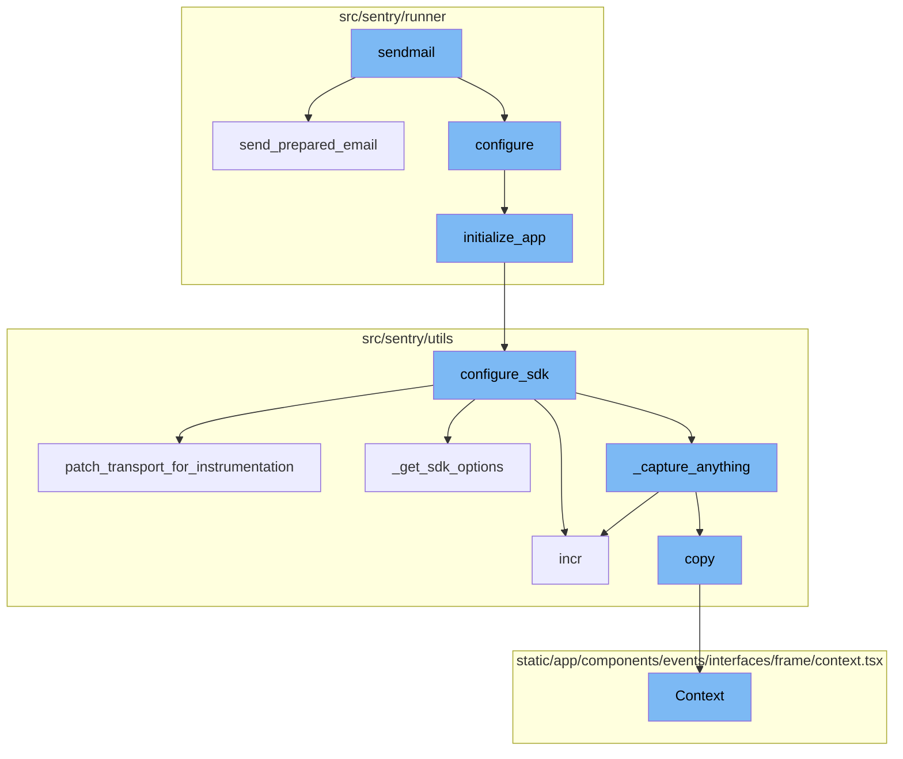
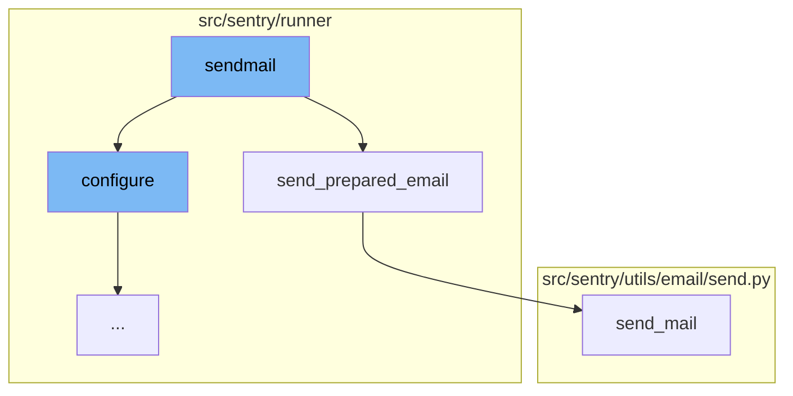
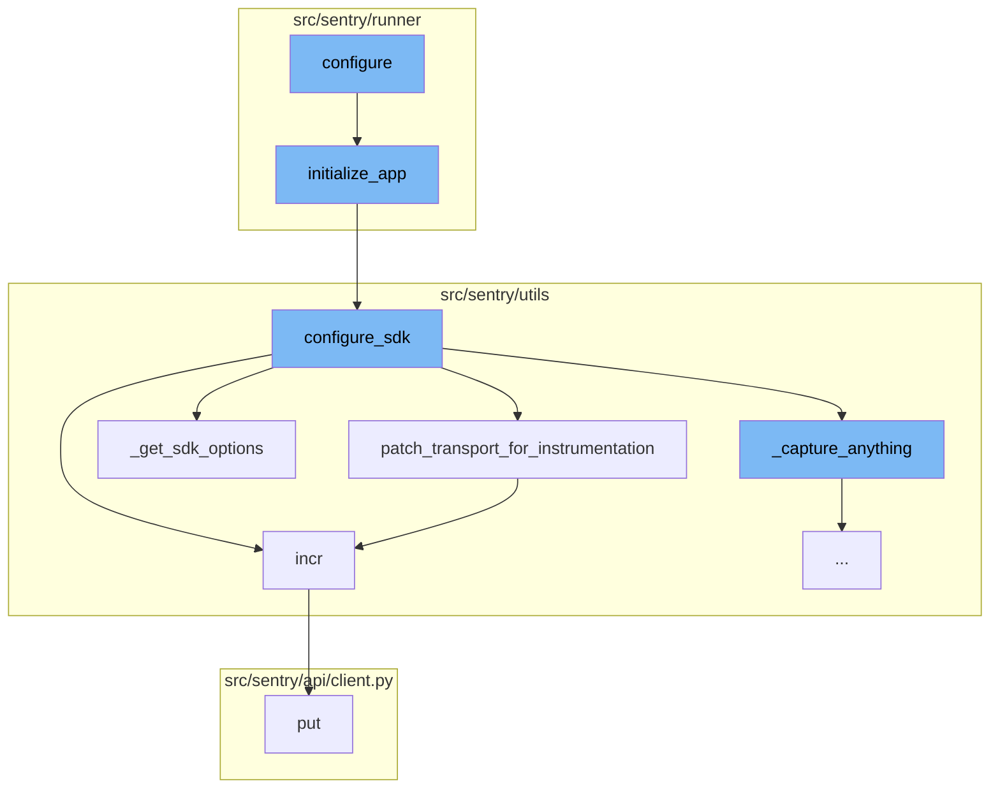
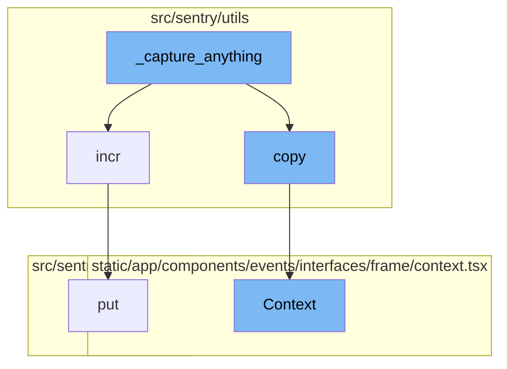

# Sendmail Overview

Sendmail is a function that sends emails from the default notification mail address. It takes in a tuple of files and a boolean `fail_silently` as arguments. The function first configures the application using the `configure` function. Then, it iterates over the files, reading each file and sending the prepared email using the `send_prepared_email` function.

# Send Prepared Email Function

The `send_prepared_email` function is used to send an email that has been prepared in a specific format. It takes in the email content as a string and a boolean `fail_silently` as arguments. The function first parses the email content into a message object. Then, it extracts the headers, reply-to address, and body from the message. Finally, it sends the email using the `send_mail` function.

# Send Mail Function

The `send_mail` function is a wrapper that forces sending mail through our connection. It uses the `EmailMessage` class which has more options than the simple send_mail. It takes in the subject, message, from_email, recipient_list, and fail_silently as arguments, and returns the number of emails sent.

# Configure Function

The `configure` function is the entry point of the sendmail flow. It sets up the environment given two different config files. It also checks if the configuration files exist and if not, it raises an exception.

# Initialize App Function

The `initialize_app` function is called within the `configure` function. It sets up the application by bootstrapping options, configuring logging, validating configurations, and initializing various services.

# Configure SDK Function

The `configure_sdk` function is called within the `initialize_app` function. It sets up the Sentry SDK by configuring various options and initializing the transport layer.

# Patch Transport for Instrumentation Function

The `patch_transport_for_instrumentation` function is called within the `configure_sdk` function. It patches the transport functions to add metrics for improving resolution around events sent to Sentry's ingest.

# Incr Function

The `incr` function is called within the `patch_transport_for_instrumentation` function. It increments a metric counter.

# Get SDK Options Function

The `_get_sdk_options` function is called within the `configure_sdk` function. It retrieves the SDK options for configuring the Sentry SDK.

# Put Function

The `put` function is called within the `incr` function. It sends a PUT request.

# Capture Anything Function

The `_capture_anything` function is the starting point of the sendmail flow. It is responsible for capturing events and metrics. It checks if the `SENTRY_SDK_UPSTREAM_METRICS_ENABLED` setting is enabled and if the method name is `capture_envelope`. If these conditions are met, it filters out all the statsd envelope items, which contain custom metrics sent by the SDK, unless they are allowed via a separate sample rate.

# Copy Function

The `copy` function is used in `_capture_anything` to create a copy of the envelope. This is done to ensure that the original envelope is not modified when filtering out statsd items.

# Context Function

The `Context` function is used to create a context for the frame. This includes information about the frame, event, and any associated variables or registers. It also handles the display of source code and assembly information.



# Flow drill down

First, we'll zoom into this section of the flow:



<SwmSnippet path="/src/sentry/runner/commands/sendmail.py" line="30">

---

# Sendmail Function

The `sendmail` function is used to send emails from the default notification mail address. It takes in a tuple of files and a boolean `fail_silently` as arguments. The function first configures the application using the `configure` function. Then, it iterates over the files, reading each file and sending the prepared email using the `send_prepared_email` function.

```python
def sendmail(files: tuple[str, ...], fail_silently: bool) -> None:
    """
    Sends emails from the default notification mail address.

    This functionality can be used to send a text email to users from the default
    send location.  The emails to be sent must be prepaired in plain text format
    with headers separated by body with double newlines.  Mandatory headers are
    `To` and `Subject`.
    """
    from sentry.runner import configure

    configure()

    for file in files:
        click.echo(f"Sending {file}")
        with open(file) as f:
            send_prepared_email(f.read(), fail_silently=fail_silently)
```

---

</SwmSnippet>

<SwmSnippet path="/src/sentry/runner/commands/sendmail.py" line="6">

---

# Send Prepared Email Function

The `send_prepared_email` function is used to send an email that has been prepared in a specific format. It takes in the email content as a string and a boolean `fail_silently` as arguments. The function first parses the email content into a message object. Then, it extracts the headers, reply-to address, and body from the message. Finally, it sends the email using the `send_mail` function.

```python
def send_prepared_email(input: str, fail_silently: bool = False) -> None:
    from sentry import options
    from sentry.utils.email import send_mail

    msg = email.message_from_string(input)
    headers = {k: v for (k, v) in msg.items() if k.lower() not in ("to", "reply-to", "subject")}
    reply_to = msg.get("reply-to")
    msg_body = msg.get_payload()
    if not isinstance(msg_body, str):
        raise SystemExit(f"expected a non-multipart text email but received {type(msg_body)}")
    send_mail(
        subject=msg["subject"],
        message=msg_body,
        from_email=options.get("mail.from"),
        recipient_list=[msg["to"]],
        fail_silently=fail_silently,
        reply_to=[reply_to] if reply_to else None,
        headers=headers,
    )
```

---

</SwmSnippet>

<SwmSnippet path="/src/sentry/utils/email/send.py" line="55">

---

# Send Mail Function

The `send_mail` function is a wrapper that forces sending mail through our connection. It uses the `EmailMessage` class which has more options than the simple send_mail. It takes in the subject, message, from_email, recipient_list, and fail_silently as arguments, and returns the number of emails sent.

```python
def send_mail(
    subject: str,
    message: str,
    from_email: str,
    recipient_list: Sequence[str],
    fail_silently: bool = False,
    **kwargs: Any,
) -> int:
    """
    Wrapper that forces sending mail through our connection.
    Uses EmailMessage class which has more options than the simple send_mail
    """
    return mail.EmailMessage(
        subject,
        message,
        from_email,
        recipient_list,
        connection=get_connection(fail_silently=fail_silently),
        **kwargs,
    ).send(fail_silently=fail_silently)
```

---

</SwmSnippet>

Now, lets zoom into this section of the flow:



<SwmSnippet path="/src/sentry/runner/settings.py" line="53">

---

# Sendmail Flow

The `configure` function is the entry point of the sendmail flow. It sets up the environment given two different config files. It also checks if the configuration files exist and if not, it raises an exception.

```python
def configure(
    ctx: click.Context | None, py: str, yaml: str | None, skip_service_validation: bool = False
) -> None:
    """
    Given the two different config files, set up the environment.

    NOTE: Will only execute once, so it's safe to call multiple times.
    """
    global __installed
    if __installed:
        return

    # Make sure that our warnings are always displayed.
    warnings.filterwarnings("default", "", Warning, r"^sentry")

    # Add in additional mimetypes that are useful for our static files
    # which aren't common in default system registries
    import mimetypes

    for type, ext in (
        ("application/json", "map"),
```

---

</SwmSnippet>

<SwmSnippet path="/src/sentry/runner/initializer.py" line="306">

---

The `initialize_app` function is called within the `configure` function. It sets up the application by bootstrapping options, configuring logging, validating configurations, and initializing various services.

```python
def initialize_app(config: dict[str, Any], skip_service_validation: bool = False) -> None:
    settings = config["settings"]

    # Just reuse the integration app for Single Org / Self-Hosted as
    # it doesn't make much sense to use 2 separate apps for SSO and
    # integration.
    if settings.SENTRY_SINGLE_ORGANIZATION:
        options_mapper.update(
            {
                "github-app.client-id": "GITHUB_APP_ID",
                "github-app.client-secret": "GITHUB_API_SECRET",
            }
        )

    bootstrap_options(settings, config["options"])

    logging.raiseExceptions = settings.DEBUG

    configure_structlog()

    # Commonly setups don't correctly configure themselves for production envs
```

---

</SwmSnippet>

<SwmSnippet path="/src/sentry/utils/sdk.py" line="275">

---

The `configure_sdk` function is called within the `initialize_app` function. It sets up the Sentry SDK by configuring various options and initializing the transport layer.

```python
def configure_sdk():
    """
    Setup and initialize the Sentry SDK.
    """
    sdk_options, dsns = _get_sdk_options()

    internal_project_key = get_project_key()

    if dsns.sentry4sentry:
        transport = make_transport(get_options(dsn=dsns.sentry4sentry, **sdk_options))
        sentry4sentry_transport = patch_transport_for_instrumentation(transport, "upstream")
    else:
        sentry4sentry_transport = None

    if dsns.sentry_saas:
        transport = make_transport(get_options(dsn=dsns.sentry_saas, **sdk_options))
        sentry_saas_transport = patch_transport_for_instrumentation(transport, "relay")
    elif settings.IS_DEV and not settings.SENTRY_USE_RELAY:
        sentry_saas_transport = None
    elif internal_project_key and internal_project_key.dsn_private:
        transport = make_transport(get_options(dsn=internal_project_key.dsn_private, **sdk_options))
```

---

</SwmSnippet>

<SwmSnippet path="/src/sentry/utils/sdk.py" line="237">

---

The `patch_transport_for_instrumentation` function is called within the `configure_sdk` function. It patches the transport functions to add metrics for improving resolution around events sent to Sentry's ingest.

```python
# Patches transport functions to add metrics to improve resolution around events sent to our ingest.
# Leaving this in to keep a permanent measurement of sdk requests vs ingest.
def patch_transport_for_instrumentation(transport, transport_name):
    _send_request = transport._send_request
    if _send_request:

        def patched_send_request(*args, **kwargs):
            metrics.incr(f"internal.sent_requests.{transport_name}.events")
            return _send_request(*args, **kwargs)

        transport._send_request = patched_send_request
    return transport
```

---

</SwmSnippet>

<SwmSnippet path="/src/sentry/utils/metrics.py" line="101">

---

The `incr` function is called within the `patch_transport_for_instrumentation` function. It increments a metric counter.

```python
    def incr(
        self,
        key: str,
        instance: str | None = None,
        tags: Tags | None = None,
        amount: int = 1,
        sample_rate: float = settings.SENTRY_METRICS_SAMPLE_RATE,
    ) -> None:
        if not self._started:
            self._start()
        self.q.put((key, instance, tags, amount, sample_rate))
```

---

</SwmSnippet>

<SwmSnippet path="/src/sentry/utils/sdk.py" line="256">

---

The `_get_sdk_options` function is called within the `configure_sdk` function. It retrieves the SDK options for configuring the Sentry SDK.

```python
def _get_sdk_options() -> tuple[SdkConfig, Dsns]:
    sdk_options = settings.SENTRY_SDK_CONFIG.copy()
    sdk_options["send_client_reports"] = True
    sdk_options["traces_sampler"] = traces_sampler
    sdk_options["before_send_transaction"] = before_send_transaction
    sdk_options["before_send"] = before_send
    sdk_options["release"] = (
        f"backend@{sdk_options['release']}" if "release" in sdk_options else None
    )

    # Modify SENTRY_SDK_CONFIG in your deployment scripts to specify your desired DSN
    dsns = Dsns(
        sentry4sentry=sdk_options.pop("dsn", None),
        sentry_saas=sdk_options.pop("relay_dsn", None),
    )

    return sdk_options, dsns
```

---

</SwmSnippet>

<SwmSnippet path="/src/sentry/api/client.py" line="119">

---

The `put` function is called within the `incr` function. It sends a PUT request.

```python
    def put(self, *args, **kwargs):
        return self.request("PUT", *args, **kwargs)
```

---

</SwmSnippet>

Now, lets zoom into this section of the flow:



<SwmSnippet path="/src/sentry/utils/sdk.py" line="334">

---

# \_capture_anything function

The `_capture_anything` function is the starting point of the sendmail flow. It is responsible for capturing events and metrics. It checks if the `SENTRY_SDK_UPSTREAM_METRICS_ENABLED` setting is enabled and if the method name is `capture_envelope`. If these conditions are met, it filters out all the statsd envelope items, which contain custom metrics sent by the SDK, unless they are allowed via a separate sample rate.

```python
        def _capture_anything(self, method_name, *args, **kwargs):
            # Sentry4Sentry (upstream) should get the event first because
            # it is most isolated from the sentry installation.
            if sentry4sentry_transport:
                metrics.incr("internal.captured.events.upstream")
                # TODO(mattrobenolt): Bring this back safely.
                # from sentry import options
                # install_id = options.get('sentry:install-id')
                # if install_id:
                #     event.setdefault('tags', {})['install-id'] = install_id
                s4s_args = args
                # We want to control whether we want to send metrics at the s4s upstream.
                if (
                    not settings.SENTRY_SDK_UPSTREAM_METRICS_ENABLED
                    and method_name == "capture_envelope"
                ):
                    args_list = list(args)
                    envelope = args_list[0]
                    # We filter out all the statsd envelope items, which contain custom metrics sent by the SDK.
                    # unless we allow them via a separate sample rate.
                    safe_items = [
```

---

</SwmSnippet>

<SwmSnippet path="/src/sentry/utils/metrics.py" line="101">

---

# incr function

The `incr` function is called within `_capture_anything` to increment a metric. This function is used to track the number of events captured.

```python
    def incr(
        self,
        key: str,
        instance: str | None = None,
        tags: Tags | None = None,
        amount: int = 1,
        sample_rate: float = settings.SENTRY_METRICS_SAMPLE_RATE,
    ) -> None:
        if not self._started:
            self._start()
        self.q.put((key, instance, tags, amount, sample_rate))
```

---

</SwmSnippet>

<SwmSnippet path="/src/sentry/utils/services.py" line="42">

---

# copy function

The `copy` function is used in `_capture_anything` to create a copy of the envelope. This is done to ensure that the original envelope is not modified when filtering out statsd items.

```python
        self.backends = backends

    def copy(self) -> Context:
        return Context(self.request, self.backends.copy())
```

---

</SwmSnippet>

<SwmSnippet path="/static/app/components/events/interfaces/frame/context.tsx" line="66">

---

# Context function

The `Context` function is used to create a context for the frame. This includes information about the frame, event, and any associated variables or registers. It also handles the display of source code and assembly information.

```tsx
function Context({
  hasContextVars = false,
  hasContextSource = false,
  hasContextRegisters = false,
  isExpanded = false,
  hasAssembly = false,
  emptySourceNotation = false,
  registers,
  frame,
  event,
  className,
  frameMeta,
  registersMeta,
  platform,
}: Props) {
  const organization = useOrganization();

  const {projects} = useProjects();
  const project = useMemo(
    () => projects.find(p => p.id === event.projectID),
    [projects, event]
```

---

</SwmSnippet>

<SwmSnippet path="/src/sentry/api/client.py" line="119">

---

# put function

The `put` function is used to send a PUT request. This is part of the API client and is used to update resources on the server.

```python
    def put(self, *args, **kwargs):
        return self.request("PUT", *args, **kwargs)
```

---

</SwmSnippet>

&nbsp;

*This is an auto-generated document by Swimm AI 🌊 and has not yet been verified by a human*

<SwmMeta version="3.0.0" repo-id="Z2l0aHViJTNBJTNBc2VudHJ5LWRlbW8lM0ElM0FTd2ltbS1EZW1v" repo-name="sentry-demo" doc-type="flows"><sup>Powered by [Swimm](/)</sup></SwmMeta>
