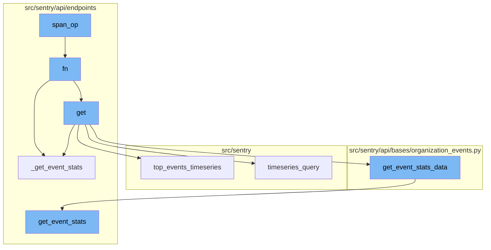
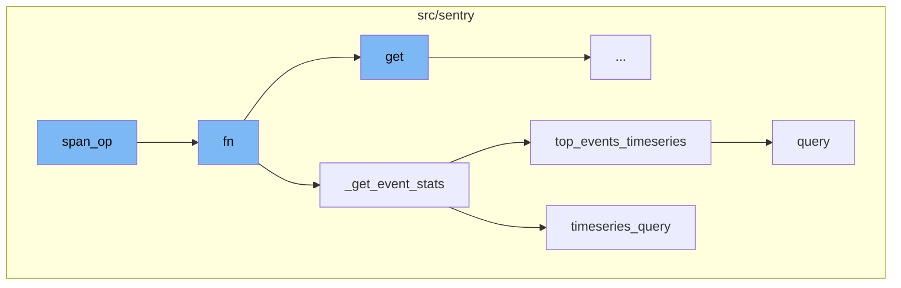
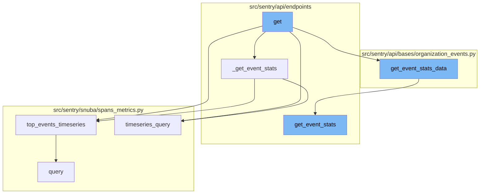

<SwmSnippet path="/src/sentry/spans/grouping/strategy/base.py" line="89">

---

# Span Operation

The `span_op` function is a decorator that wraps a CallableStrategy function. It checks if the operation name (`op_name`) of a span is in the list of permitted operations. If it is, it executes the function `fn` with the span as an argument. If not, it returns None.

```python
def span_op(op_name: str | Sequence[str]) -> Callable[[CallableStrategy], CallableStrategy]:
    permitted_ops = [op_name] if isinstance(op_name, str) else op_name

    def wrapped(fn: CallableStrategy) -> CallableStrategy:
        return lambda span: fn(span) if span.get("op") in permitted_ops else None

    return wrapped
```

---

</SwmSnippet>

<SwmSnippet path="/src/sentry/api/endpoints/organization_events_stats.py" line="316">

---

# Function Execution

The `fn` function is a complex function that performs various operations based on the input parameters. It primarily calls the `_get_event_stats` function to fetch event statistics. However, it also handles various edge cases, such as when the metrics are enhanced and a dashboard widget ID is provided, or when there are errors in the original results.

```python
            def fn(
                query_columns: Sequence[str],
                query: str,
                params: dict[str, str],
                rollup: int,
                zerofill_results: bool,
                comparison_delta: datetime | None,
            ) -> SnubaTSResult | dict[str, SnubaTSResult]:

                if not (metrics_enhanced and dashboard_widget_id):
                    return _get_event_stats(
                        scoped_dataset,
                        query_columns,
                        query,
                        params,
                        rollup,
                        zerofill_results,
                        comparison_delta,
                    )

                try:
```

---

</SwmSnippet>

<SwmSnippet path="/src/sentry/api/endpoints/organization_events_stats.py" line="254">

---

# Event Statistics Retrieval

The `_get_event_stats` function is responsible for retrieving event statistics. It checks if there are top events. If there are, it calls the `top_events_timeseries` function. If not, it calls the `timeseries_query` function.

```python
        def _get_event_stats(
            scoped_dataset: Any,
            query_columns: Sequence[str],
            query: str,
            params: dict[str, str],
            rollup: int,
            zerofill_results: bool,
            comparison_delta: datetime | None,
        ) -> SnubaTSResult | dict[str, SnubaTSResult]:
            if top_events > 0:
                return scoped_dataset.top_events_timeseries(
                    timeseries_columns=query_columns,
                    selected_columns=self.get_field_list(organization, request),
                    equations=self.get_equation_list(organization, request),
                    user_query=query,
                    params=params,
                    orderby=self.get_orderby(request),
                    rollup=rollup,
                    limit=top_events,
                    organization=organization,
                    referrer=referrer + ".find-topn",
```

---

</SwmSnippet>

<SwmSnippet path="/src/sentry/snuba/spans_metrics.py" line="138">

---

# Top Events Timeseries

The `top_events_timeseries` function performs a timeseries query for a limited number of top events. It returns a dictionary of SnubaTSResult objects that have been zerofilled in case of gaps.

```python
def top_events_timeseries(
    timeseries_columns,
    selected_columns,
    user_query,
    params,
    orderby,
    rollup,
    limit,
    organization,
    equations=None,
    referrer=None,
    top_events=None,
    allow_empty=True,
    zerofill_results=True,
    include_other=False,
    functions_acl=None,
    on_demand_metrics_enabled=False,
    on_demand_metrics_type: MetricSpecType | None = None,
):
    """
    High-level API for doing arbitrary user timeseries queries for a limited number of top events
```

---

</SwmSnippet>

<SwmSnippet path="/src/sentry/snuba/spans_metrics.py" line="76">

---

# Timeseries Query

The `timeseries_query` function performs arbitrary user timeseries queries against events. It uses the `TimeseriesSpansMetricsQueryBuilder` to run the query and process the results.

```python
def timeseries_query(
    selected_columns: Sequence[str],
    query: str,
    params: dict[str, str],
    rollup: int,
    referrer: str,
    zerofill_results: bool = True,
    allow_metric_aggregates=True,
    comparison_delta: timedelta | None = None,
    functions_acl: list[str] | None = None,
    has_metrics: bool = True,
    use_metrics_layer: bool = False,
    on_demand_metrics_enabled: bool = False,
    on_demand_metrics_type: MetricSpecType | None = None,
    groupby: Column | None = None,
) -> SnubaTSResult:
    """
    High-level API for doing arbitrary user timeseries queries against events.
    this API should match that of sentry.snuba.discover.timeseries_query
    """
    metrics_query = TimeseriesSpansMetricsQueryBuilder(
```

---

</SwmSnippet>

<SwmSnippet path="/src/sentry/api/endpoints/organization_events_stats.py" line="167">

---

# Span Operation Flow

The span operation flow starts with the `get` function in the `organization_events_stats.py` file. This function is responsible for handling the request and organization parameters and returning a response.

```python
    def get(self, request: Request, organization: Organization) -> Response:
        with sentry_sdk.start_span(op="discover.endpoint", description="filter_params") as span:
            span.set_data("organization", organization)

            top_events = 0

            if "topEvents" in request.GET:
                try:
                    top_events = int(request.GET.get("topEvents", 0))
                except ValueError:
                    return Response({"detail": "topEvents must be an integer"}, status=400)
                if top_events > MAX_TOP_EVENTS:
                    return Response(
                        {"detail": f"Can only get up to {MAX_TOP_EVENTS} top events"},
                        status=400,
                    )
                elif top_events <= 0:
                    return Response({"detail": "If topEvents needs to be at least 1"}, status=400)

            comparison_delta = None
            if "comparisonDelta" in request.GET:
```

---

</SwmSnippet>

<SwmSnippet path="/src/sentry/api/endpoints/organization_events_stats.py" line="254">

---

The `get` function calls the `_get_event_stats` function. This function takes several parameters including the dataset, query columns, query, parameters, rollup, zerofill results, and comparison delta. Depending on the number of top events, it either calls `top_events_timeseries` or `timeseries_query`.

```python
        def _get_event_stats(
            scoped_dataset: Any,
            query_columns: Sequence[str],
            query: str,
            params: dict[str, str],
            rollup: int,
            zerofill_results: bool,
            comparison_delta: datetime | None,
        ) -> SnubaTSResult | dict[str, SnubaTSResult]:
```

---

</SwmSnippet>

<SwmSnippet path="/src/sentry/snuba/spans_metrics.py" line="138">

---

The `top_events_timeseries` function in the `spans_metrics.py` file is responsible for doing arbitrary user timeseries queries for a limited number of top events. It returns a dictionary of SnubaTSResult objects that have been zerofilled in case of gaps.

```python
def top_events_timeseries(
    timeseries_columns,
    selected_columns,
    user_query,
    params,
    orderby,
    rollup,
    limit,
    organization,
    equations=None,
    referrer=None,
    top_events=None,
    allow_empty=True,
    zerofill_results=True,
    include_other=False,
    functions_acl=None,
    on_demand_metrics_enabled=False,
    on_demand_metrics_type: MetricSpecType | None = None,
):
    """
    High-level API for doing arbitrary user timeseries queries for a limited number of top events
```

---

</SwmSnippet>

<SwmSnippet path="/src/sentry/snuba/spans_metrics.py" line="76">

---

The `timeseries_query` function in the `spans_metrics.py` file is a high-level API for doing arbitrary user timeseries queries against events. It returns a SnubaTSResult object.

```python
def timeseries_query(
    selected_columns: Sequence[str],
    query: str,
    params: dict[str, str],
    rollup: int,
    referrer: str,
    zerofill_results: bool = True,
    allow_metric_aggregates=True,
    comparison_delta: timedelta | None = None,
    functions_acl: list[str] | None = None,
    has_metrics: bool = True,
    use_metrics_layer: bool = False,
    on_demand_metrics_enabled: bool = False,
    on_demand_metrics_type: MetricSpecType | None = None,
    groupby: Column | None = None,
) -> SnubaTSResult:
    """
    High-level API for doing arbitrary user timeseries queries against events.
    this API should match that of sentry.snuba.discover.timeseries_query
    """
    metrics_query = TimeseriesSpansMetricsQueryBuilder(
```

---

</SwmSnippet>

<SwmSnippet path="/src/sentry/api/bases/organization_events.py" line="421">

---

The `get_event_stats_data` function in the `organization_events.py` file is responsible for getting event stats data. It takes several parameters including the request, organization, get_event_stats function, top events, query column, parameters, query, allow partial buckets, zerofill results, comparison delta, additional query column, and dataset. It returns a dictionary of event stats data.

```python
    def get_event_stats_data(
        self,
        request: Request,
        organization: Organization,
        get_event_stats: Callable[
            [Sequence[str], str, dict[str, str], int, bool, timedelta | None], SnubaTSResult
        ],
        top_events: int = 0,
        query_column: str = "count()",
        params: ParamsType | None = None,
        query: str | None = None,
        allow_partial_buckets: bool = False,
        zerofill_results: bool = True,
        comparison_delta: timedelta | None = None,
        additional_query_column: str | None = None,
        dataset: Any | None = None,
    ) -> dict[str, Any]:
        with handle_query_errors():
            with sentry_sdk.start_span(
                op="discover.endpoint", description="base.stats_query_creation"
            ):
```

---

</SwmSnippet>

<SwmSnippet path="/src/sentry/api/endpoints/organization_profiling_functions.py" line="115">

---

The `get_event_stats` function in the `organization_profiling_functions.py` file is responsible for getting event stats. It takes several parameters including the columns, query, parameters, rollup, zerofill results, and comparison delta. It returns the results of the event stats.

```python
        def get_event_stats(_columns, query, params, _rollup, zerofill_results, _comparison_delta):
            rollup = get_rollup_from_range(params["end"] - params["start"])

            chunks = [
                top_functions["data"][i : i + FUNCTIONS_PER_QUERY]
                for i in range(0, len(top_functions["data"]), FUNCTIONS_PER_QUERY)
            ]

            builders = [
                ProfileTopFunctionsTimeseriesQueryBuilder(
                    dataset=Dataset.Functions,
                    params=params,
                    interval=rollup,
                    top_events=chunk,
                    other=False,
                    query=query,
                    selected_columns=["project.id", "fingerprint"],
                    # It's possible to override the columns via
                    # the `yAxis` qs. So we explicitly ignore the
                    # columns, and hard code in the columns we want.
                    timeseries_columns=[data["function"], "examples()"],
```

---

</SwmSnippet>



# Flow drill down

First, we'll zoom into this section of the flow:



<SwmSnippet path="/src/sentry/spans/grouping/strategy/base.py" line="89">

---

# Span Operation

The `span_op` function is a decorator that wraps a CallableStrategy function. It checks if the operation name (`op_name`) of a span is in the list of permitted operations. If it is, it executes the function `fn` with the span as an argument. If not, it returns None.

```python
def span_op(op_name: str | Sequence[str]) -> Callable[[CallableStrategy], CallableStrategy]:
    permitted_ops = [op_name] if isinstance(op_name, str) else op_name

    def wrapped(fn: CallableStrategy) -> CallableStrategy:
        return lambda span: fn(span) if span.get("op") in permitted_ops else None

    return wrapped
```

---

</SwmSnippet>

<SwmSnippet path="/src/sentry/api/endpoints/organization_events_stats.py" line="316">

---

# Function Execution

The `fn` function is a complex function that performs various operations based on the input parameters. It primarily calls the `_get_event_stats` function to fetch event statistics. However, it also handles various edge cases, such as when the metrics are enhanced and a dashboard widget ID is provided, or when there are errors in the original results.

```python
            def fn(
                query_columns: Sequence[str],
                query: str,
                params: dict[str, str],
                rollup: int,
                zerofill_results: bool,
                comparison_delta: datetime | None,
            ) -> SnubaTSResult | dict[str, SnubaTSResult]:

                if not (metrics_enhanced and dashboard_widget_id):
                    return _get_event_stats(
                        scoped_dataset,
                        query_columns,
                        query,
                        params,
                        rollup,
                        zerofill_results,
                        comparison_delta,
                    )

                try:
```

---

</SwmSnippet>

<SwmSnippet path="/src/sentry/api/endpoints/organization_events_stats.py" line="254">

---

# Event Statistics Retrieval

The `_get_event_stats` function is responsible for retrieving event statistics. It checks if there are top events. If there are, it calls the `top_events_timeseries` function. If not, it calls the `timeseries_query` function.

```python
        def _get_event_stats(
            scoped_dataset: Any,
            query_columns: Sequence[str],
            query: str,
            params: dict[str, str],
            rollup: int,
            zerofill_results: bool,
            comparison_delta: datetime | None,
        ) -> SnubaTSResult | dict[str, SnubaTSResult]:
            if top_events > 0:
                return scoped_dataset.top_events_timeseries(
                    timeseries_columns=query_columns,
                    selected_columns=self.get_field_list(organization, request),
                    equations=self.get_equation_list(organization, request),
                    user_query=query,
                    params=params,
                    orderby=self.get_orderby(request),
                    rollup=rollup,
                    limit=top_events,
                    organization=organization,
                    referrer=referrer + ".find-topn",
```

---

</SwmSnippet>

<SwmSnippet path="/src/sentry/snuba/spans_metrics.py" line="138">

---

# Top Events Timeseries

The `top_events_timeseries` function performs a timeseries query for a limited number of top events. It returns a dictionary of SnubaTSResult objects that have been zerofilled in case of gaps.

```python
def top_events_timeseries(
    timeseries_columns,
    selected_columns,
    user_query,
    params,
    orderby,
    rollup,
    limit,
    organization,
    equations=None,
    referrer=None,
    top_events=None,
    allow_empty=True,
    zerofill_results=True,
    include_other=False,
    functions_acl=None,
    on_demand_metrics_enabled=False,
    on_demand_metrics_type: MetricSpecType | None = None,
):
    """
    High-level API for doing arbitrary user timeseries queries for a limited number of top events
```

---

</SwmSnippet>

<SwmSnippet path="/src/sentry/snuba/spans_metrics.py" line="76">

---

# Timeseries Query

The `timeseries_query` function performs arbitrary user timeseries queries against events. It uses the `TimeseriesSpansMetricsQueryBuilder` to run the query and process the results.

```python
def timeseries_query(
    selected_columns: Sequence[str],
    query: str,
    params: dict[str, str],
    rollup: int,
    referrer: str,
    zerofill_results: bool = True,
    allow_metric_aggregates=True,
    comparison_delta: timedelta | None = None,
    functions_acl: list[str] | None = None,
    has_metrics: bool = True,
    use_metrics_layer: bool = False,
    on_demand_metrics_enabled: bool = False,
    on_demand_metrics_type: MetricSpecType | None = None,
    groupby: Column | None = None,
) -> SnubaTSResult:
    """
    High-level API for doing arbitrary user timeseries queries against events.
    this API should match that of sentry.snuba.discover.timeseries_query
    """
    metrics_query = TimeseriesSpansMetricsQueryBuilder(
```

---

</SwmSnippet>

Now, lets zoom into this section of the flow:



<SwmSnippet path="/src/sentry/api/endpoints/organization_events_stats.py" line="167">

---

# Span Operation Flow

The span operation flow starts with the `get` function in the `organization_events_stats.py` file. This function is responsible for handling the request and organization parameters and returning a response.

```python
    def get(self, request: Request, organization: Organization) -> Response:
        with sentry_sdk.start_span(op="discover.endpoint", description="filter_params") as span:
            span.set_data("organization", organization)

            top_events = 0

            if "topEvents" in request.GET:
                try:
                    top_events = int(request.GET.get("topEvents", 0))
                except ValueError:
                    return Response({"detail": "topEvents must be an integer"}, status=400)
                if top_events > MAX_TOP_EVENTS:
                    return Response(
                        {"detail": f"Can only get up to {MAX_TOP_EVENTS} top events"},
                        status=400,
                    )
                elif top_events <= 0:
                    return Response({"detail": "If topEvents needs to be at least 1"}, status=400)

            comparison_delta = None
            if "comparisonDelta" in request.GET:
```

---

</SwmSnippet>

<SwmSnippet path="/src/sentry/api/endpoints/organization_events_stats.py" line="254">

---

The `get` function calls the `_get_event_stats` function. This function takes several parameters including the dataset, query columns, query, parameters, rollup, zerofill results, and comparison delta. Depending on the number of top events, it either calls `top_events_timeseries` or `timeseries_query`.

```python
        def _get_event_stats(
            scoped_dataset: Any,
            query_columns: Sequence[str],
            query: str,
            params: dict[str, str],
            rollup: int,
            zerofill_results: bool,
            comparison_delta: datetime | None,
        ) -> SnubaTSResult | dict[str, SnubaTSResult]:
```

---

</SwmSnippet>

<SwmSnippet path="/src/sentry/snuba/spans_metrics.py" line="138">

---

The `top_events_timeseries` function in the `spans_metrics.py` file is responsible for doing arbitrary user timeseries queries for a limited number of top events. It returns a dictionary of SnubaTSResult objects that have been zerofilled in case of gaps.

```python
def top_events_timeseries(
    timeseries_columns,
    selected_columns,
    user_query,
    params,
    orderby,
    rollup,
    limit,
    organization,
    equations=None,
    referrer=None,
    top_events=None,
    allow_empty=True,
    zerofill_results=True,
    include_other=False,
    functions_acl=None,
    on_demand_metrics_enabled=False,
    on_demand_metrics_type: MetricSpecType | None = None,
):
    """
    High-level API for doing arbitrary user timeseries queries for a limited number of top events
```

---

</SwmSnippet>

<SwmSnippet path="/src/sentry/snuba/spans_metrics.py" line="76">

---

The `timeseries_query` function in the `spans_metrics.py` file is a high-level API for doing arbitrary user timeseries queries against events. It returns a SnubaTSResult object.

```python
def timeseries_query(
    selected_columns: Sequence[str],
    query: str,
    params: dict[str, str],
    rollup: int,
    referrer: str,
    zerofill_results: bool = True,
    allow_metric_aggregates=True,
    comparison_delta: timedelta | None = None,
    functions_acl: list[str] | None = None,
    has_metrics: bool = True,
    use_metrics_layer: bool = False,
    on_demand_metrics_enabled: bool = False,
    on_demand_metrics_type: MetricSpecType | None = None,
    groupby: Column | None = None,
) -> SnubaTSResult:
    """
    High-level API for doing arbitrary user timeseries queries against events.
    this API should match that of sentry.snuba.discover.timeseries_query
    """
    metrics_query = TimeseriesSpansMetricsQueryBuilder(
```

---

</SwmSnippet>

<SwmSnippet path="/src/sentry/api/bases/organization_events.py" line="421">

---

The `get_event_stats_data` function in the `organization_events.py` file is responsible for getting event stats data. It takes several parameters including the request, organization, get_event_stats function, top events, query column, parameters, query, allow partial buckets, zerofill results, comparison delta, additional query column, and dataset. It returns a dictionary of event stats data.

```python
    def get_event_stats_data(
        self,
        request: Request,
        organization: Organization,
        get_event_stats: Callable[
            [Sequence[str], str, dict[str, str], int, bool, timedelta | None], SnubaTSResult
        ],
        top_events: int = 0,
        query_column: str = "count()",
        params: ParamsType | None = None,
        query: str | None = None,
        allow_partial_buckets: bool = False,
        zerofill_results: bool = True,
        comparison_delta: timedelta | None = None,
        additional_query_column: str | None = None,
        dataset: Any | None = None,
    ) -> dict[str, Any]:
        with handle_query_errors():
            with sentry_sdk.start_span(
                op="discover.endpoint", description="base.stats_query_creation"
            ):
```

---

</SwmSnippet>

<SwmSnippet path="/src/sentry/api/endpoints/organization_profiling_functions.py" line="115">

---

The `get_event_stats` function in the `organization_profiling_functions.py` file is responsible for getting event stats. It takes several parameters including the columns, query, parameters, rollup, zerofill results, and comparison delta. It returns the results of the event stats.

```python
        def get_event_stats(_columns, query, params, _rollup, zerofill_results, _comparison_delta):
            rollup = get_rollup_from_range(params["end"] - params["start"])

            chunks = [
                top_functions["data"][i : i + FUNCTIONS_PER_QUERY]
                for i in range(0, len(top_functions["data"]), FUNCTIONS_PER_QUERY)
            ]

            builders = [
                ProfileTopFunctionsTimeseriesQueryBuilder(
                    dataset=Dataset.Functions,
                    params=params,
                    interval=rollup,
                    top_events=chunk,
                    other=False,
                    query=query,
                    selected_columns=["project.id", "fingerprint"],
                    # It's possible to override the columns via
                    # the `yAxis` qs. So we explicitly ignore the
                    # columns, and hard code in the columns we want.
                    timeseries_columns=[data["function"], "examples()"],
```

---

</SwmSnippet>

&nbsp;

*This is an auto-generated document by Swimm AI 🌊 and has not yet been verified by a human*

<SwmMeta version="3.0.0" repo-id="Z2l0aHViJTNBJTNBc2VudHJ5LWRlbW8lM0ElM0FTd2ltbS1EZW1v" repo-name="sentry-demo" doc-type="flows"><sup>Powered by [Swimm](/)</sup></SwmMeta>
