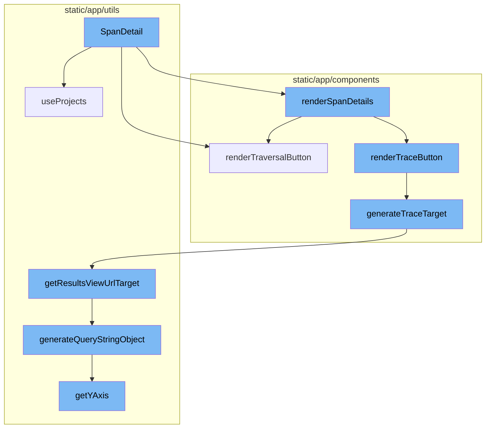
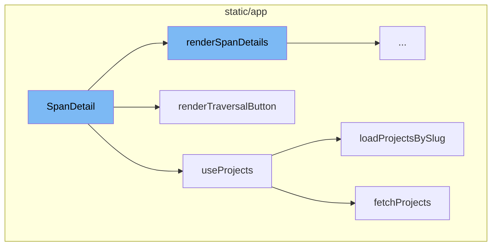
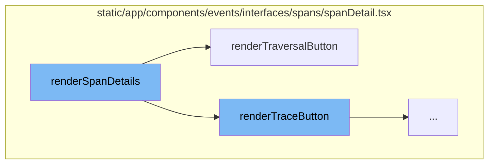
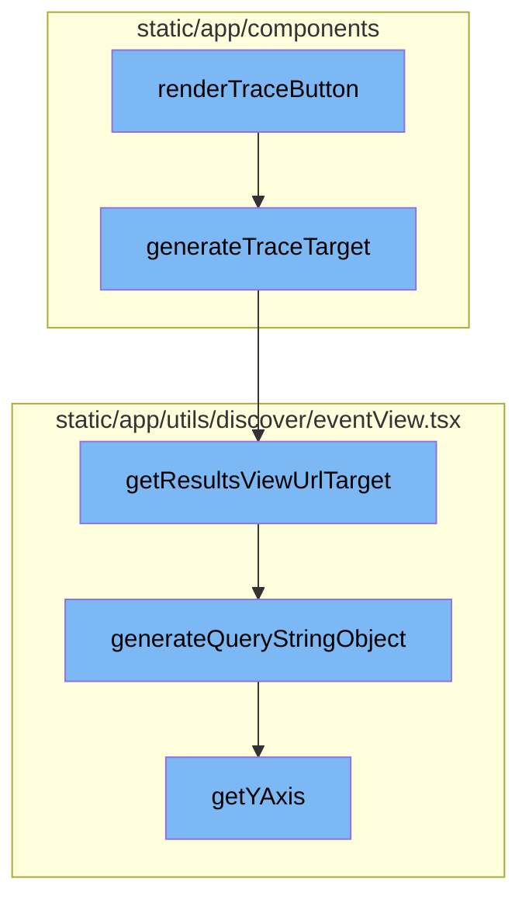

# SpanDetail Overview

SpanDetail is a React component that displays detailed information about a specific span. A span represents a set of timed operations in a transaction. SpanDetail uses various pieces of state and props to determine what to render and includes several nested functions that render specific parts of the span detail view.

# useProjects Hook

The useProjects hook is used within the SpanDetail function to fetch and manage the state of projects from the ProjectsStore. It provides a way to select specific project slugs, and search for more projects that may not be in the project store.

# renderTraversalButton Function

The renderTraversalButton function is a nested function within SpanDetail that renders a button for traversing child transactions of a span. If there are no child transactions, a loading indicator is displayed. If there are child transactions, a button is rendered that links to the EventView of the child transactions.

# loadProjectsBySlug Function

The loadProjectsBySlug function is a nested function within useProjects that is used to fetch projects by their slugs. It updates the state of the useProjects hook to indicate that it's fetching projects, then makes a request to fetch the projects. If the request is successful, the fetched projects are added to the ProjectsStore and the state is updated to indicate that the fetch was successful.

# fetchProjects Function

The fetchProjects function is a helper function used by loadProjectsBySlug to make the actual API request to fetch projects. It takes in an API client, an organization ID, and an options object that can include slugs, search terms, a limit, a last search term, and a cursor for pagination. It returns an object containing the fetched projects, a boolean indicating if there are more projects to fetch, and the next cursor for pagination.

# renderSpanDetails Function

The renderSpanDetails function is the main function in the SpanDetail flow. It takes in a span, event, organization, and other properties from the props. It checks if the span is a gap span and renders different components based on that. It also calculates the duration of the span and filters out hidden and raw span keys. It then renders a table with various details about the span.

# renderTraceButton Function

The renderTraceButton function is also called within renderSpanDetails. It works similarly to renderTraversalButton, but it creates an EventView for the trace of the span instead of the child transactions.

# generateTraceTarget Function

The generateTraceTarget function generates a target for the trace. It first checks if the organization has the 'performance-view' feature. If it does, it calls the getTraceDetailsUrl function. If not, it creates an EventView object and calls the getResultsViewUrlTarget method on it.

# getResultsViewUrlTarget Method

The getResultsViewUrlTarget method generates a URL target for the results view. It calls the generateQueryStringObject method to generate the query string for the URL.

# generateQueryStringObject Method

The generateQueryStringObject method generates a query string object for the event view. It includes various properties such as id, name, field, sort, environment, project, query, yAxis, dataset, display, topEvents, and interval.

# getYAxis Method

The getYAxis method is the final step in the flow. It returns the yAxis value for the event view. If the yAxis value is not set, it returns the default option.



# Flow drill down

First, we'll zoom into this section of the flow:



<SwmSnippet path="/static/app/components/events/interfaces/spans/spanDetail.tsx" line="104">

---

# SpanDetail Function

The `SpanDetail` function is a React component that renders the details of a span. A span represents a set of timed operations in a transaction. This function uses several pieces of state and props to determine what to render. It includes several nested functions that render specific parts of the span detail view, such as `renderTraversalButton`, `renderSpanChild`, `renderTraceButton`, `renderSpanDetailActions`, `renderOrphanSpanMessage`, `renderSpanErrorMessage`, and `renderSpanDetails`.

```tsx
function SpanDetail(props: Props) {
  const [errorsOpened, setErrorsOpened] = useState(false);
  const location = useLocation();
  const profileId = useTransactionProfileId();
  const {projects} = useProjects();
  const project = projects.find(p => p.id === props.event.projectID);

  useEffect(() => {
    // Run on mount.

    const {span, organization, event} = props;
    if (!('op' in span)) {
      return;
    }

    trackAnalytics('performance_views.event_details.open_span_details', {
      organization,
      operation: span.op ?? 'undefined',
      origin: span.origin ?? 'undefined',
      project_platform: event.platform ?? 'undefined',
    });
```

---

</SwmSnippet>

<SwmSnippet path="/static/app/utils/useProjects.tsx" line="150">

---

# useProjects Hook

The `useProjects` hook is used within the `SpanDetail` function to fetch and manage the state of projects from the ProjectsStore. It provides a way to select specific project slugs, and search for more projects that may not be in the project store. It returns an object containing the projects, placeholders for loading projects, and several other pieces of state related to the loading and error status of the projects.

```tsx
function useProjects({limit, slugs, orgId: propOrgId}: Options = {}) {
  const api = useApi();

  const organization = useOrganization({allowNull: true});
  const store = useLegacyStore(ProjectsStore);

  const orgId = propOrgId ?? organization?.slug ?? organization?.slug;

  const storeSlugs = new Set(store.projects.map(t => t.slug));
  const slugsToLoad = slugs?.filter(slug => !storeSlugs.has(slug)) ?? [];
  const shouldLoadSlugs = slugsToLoad.length > 0;

  const [state, setState] = useState<State>({
    initiallyLoaded: !store.loading && !shouldLoadSlugs,
    fetching: shouldLoadSlugs,
    hasMore: null,
    lastSearch: null,
    nextCursor: null,
    fetchError: null,
  });

```

---

</SwmSnippet>

<SwmSnippet path="/static/app/components/events/interfaces/spans/spanDetail.tsx" line="128">

---

# renderTraversalButton Function

The `renderTraversalButton` function is a nested function within `SpanDetail` that renders a button for traversing child transactions of a span. If there are no child transactions, a loading indicator is displayed. If there are child transactions, a button is rendered that links to the EventView of the child transactions.

```tsx
  function renderTraversalButton(): React.ReactNode {
    if (!props.childTransactions) {
      // TODO: Amend size to use theme when we eventually refactor LoadingIndicator
      // 12px is consistent with theme.iconSizes['xs'] but theme returns a string.
      return (
        <StyledDiscoverButton size="xs" disabled>
          <StyledLoadingIndicator size={12} />
        </StyledDiscoverButton>
      );
    }

    if (props.childTransactions.length <= 0) {
      return null;
    }

    const {span, trace, event, organization} = props;

    assert(!isGapSpan(span));

    if (props.childTransactions.length === 1) {
      // Note: This is rendered by renderSpanChild() as a dedicated row
```

---

</SwmSnippet>

<SwmSnippet path="/static/app/utils/useProjects.tsx" line="188">

---

# loadProjectsBySlug Function

The `loadProjectsBySlug` function is a nested function within `useProjects` that is used to fetch projects by their slugs. It updates the state of the `useProjects` hook to indicate that it's fetching projects, then makes a request to fetch the projects. If the request is successful, the fetched projects are added to the ProjectsStore and the state is updated to indicate that the fetch was successful.

```tsx
  async function loadProjectsBySlug() {
    if (orgId === undefined) {
      // eslint-disable-next-line no-console
      console.error('Cannot use useProjects({slugs}) without an organization in context');
      return;
    }

    setState(prev => ({...prev, fetching: true}));
    try {
      const {results, hasMore, nextCursor} = await fetchProjects(api, orgId, {
        slugs: slugsToLoad,
        limit,
      });

      const fetchedProjects = uniqBy([...store.projects, ...results], ({slug}) => slug);
      ProjectsStore.loadInitialData(fetchedProjects);

      setState(prev => ({
        ...prev,
        hasMore,
        fetching: false,
```

---

</SwmSnippet>

<SwmSnippet path="/static/app/utils/useProjects.tsx" line="90">

---

# fetchProjects Function

The `fetchProjects` function is a helper function used by `loadProjectsBySlug` to make the actual API request to fetch projects. It takes in an API client, an organization ID, and an options object that can include slugs, search terms, a limit, a last search term, and a cursor for pagination. It returns an object containing the fetched projects, a boolean indicating if there are more projects to fetch, and the next cursor for pagination.

```tsx
async function fetchProjects(
  api: Client,
  orgId: string,
  {slugs, search, limit, lastSearch, cursor}: FetchProjectsOptions = {}
) {
  const query: {
    collapse: string[];
    all_projects?: number;
    cursor?: typeof cursor;
    per_page?: number;
    query?: string;
  } = {
    // Never return latestDeploys project property from api
    collapse: ['latestDeploys', 'unusedFeatures'],
  };

  if (slugs !== undefined && slugs.length > 0) {
    query.query = slugs.map(slug => `slug:${slug}`).join(' ');
  }

  if (search) {
```

---

</SwmSnippet>

Now, lets zoom into this section of the flow:



<SwmSnippet path="/static/app/components/events/interfaces/spans/spanDetail.tsx" line="394">

---

# SpanDetail

The `renderSpanDetails` function is the main function in the SpanDetail flow. It takes in a span, event, organization, and other properties from the props. It checks if the span is a gap span and renders different components based on that. It also calculates the duration of the span and filters out hidden and raw span keys. It then renders a table with various details about the span.

```tsx
  function renderSpanDetails() {
    const {span, event, organization, resetCellMeasureCache, scrollToHash} = props;

    if (isGapSpan(span)) {
      return (
        <SpanDetails>
          {organization.features.includes('profiling') ? (
            <GapSpanDetails
              event={event}
              span={span}
              resetCellMeasureCache={resetCellMeasureCache}
            />
          ) : (
            <InlineDocs
              orgSlug={organization.slug}
              platform={event.sdk?.name || ''}
              projectSlug={event?.projectSlug ?? ''}
              resetCellMeasureCache={resetCellMeasureCache}
            />
          )}
        </SpanDetails>
```

---

</SwmSnippet>

<SwmSnippet path="/static/app/components/events/interfaces/spans/spanDetail.tsx" line="128">

---

## renderTraversalButton

The `renderTraversalButton` function is called within `renderSpanDetails`. It checks if there are child transactions for the span. If there are, it creates an EventView for the child transactions and returns a button that links to this view. If there are no child transactions, it returns a loading indicator or null.

```tsx
  function renderTraversalButton(): React.ReactNode {
    if (!props.childTransactions) {
      // TODO: Amend size to use theme when we eventually refactor LoadingIndicator
      // 12px is consistent with theme.iconSizes['xs'] but theme returns a string.
      return (
        <StyledDiscoverButton size="xs" disabled>
          <StyledLoadingIndicator size={12} />
        </StyledDiscoverButton>
      );
    }

    if (props.childTransactions.length <= 0) {
      return null;
    }

    const {span, trace, event, organization} = props;

    assert(!isGapSpan(span));

    if (props.childTransactions.length === 1) {
      // Note: This is rendered by renderSpanChild() as a dedicated row
```

---

</SwmSnippet>

<SwmSnippet path="/static/app/components/events/interfaces/spans/spanDetail.tsx" line="128">

---

## renderTraceButton

The `renderTraceButton` function is also called within `renderSpanDetails`. It works similarly to `renderTraversalButton`, but it creates an EventView for the trace of the span instead of the child transactions.

```tsx
  function renderTraversalButton(): React.ReactNode {
    if (!props.childTransactions) {
      // TODO: Amend size to use theme when we eventually refactor LoadingIndicator
      // 12px is consistent with theme.iconSizes['xs'] but theme returns a string.
      return (
        <StyledDiscoverButton size="xs" disabled>
          <StyledLoadingIndicator size={12} />
        </StyledDiscoverButton>
      );
    }

    if (props.childTransactions.length <= 0) {
      return null;
    }

    const {span, trace, event, organization} = props;

    assert(!isGapSpan(span));

    if (props.childTransactions.length === 1) {
      // Note: This is rendered by renderSpanChild() as a dedicated row
```

---

</SwmSnippet>

Now, lets zoom into this section of the flow:



<SwmSnippet path="/static/app/components/events/interfaces/spans/spanDetail.tsx" line="246">

---

# SpanDetail Flow

The `renderTraceButton` function is the starting point of the flow. It checks if the span is a gap span, and if not, it calls the `generateTraceTarget` function with the event, organization, and location as parameters.

```tsx
  function renderTraceButton() {
    const {span, organization, event} = props;

    if (isGapSpan(span)) {
      return null;
    }

    return (
      <StyledButton size="xs" to={generateTraceTarget(event, organization, location)}>
        {t('View Trace')}
      </StyledButton>
    );
  }
```

---

</SwmSnippet>

<SwmSnippet path="/static/app/components/quickTrace/utils.tsx" line="135">

---

The `generateTraceTarget` function generates a target for the trace. It first checks if the organization has the 'performance-view' feature. If it does, it calls the `getTraceDetailsUrl` function. If not, it creates an `EventView` object and calls the `getResultsViewUrlTarget` method on it.

```tsx
export function generateTraceTarget(
  event: Event,
  organization: OrganizationSummary,
  location: Location,
  source?: string
): LocationDescriptor {
  const traceId = event.contexts?.trace?.trace_id ?? '';

  const dateSelection = normalizeDateTimeParams(getTraceTimeRangeFromEvent(event));

  if (organization.features.includes('performance-view')) {
    // TODO(txiao): Should this persist the current query when going to trace view?
    return getTraceDetailsUrl({
      organization,
      traceSlug: traceId,
      dateSelection,
      timestamp: getEventTimestamp(event),
      eventId: event.eventID,
      location,
      source,
    });
```

---

</SwmSnippet>

<SwmSnippet path="/static/app/utils/discover/eventView.tsx" line="1190">

---

The `getResultsViewUrlTarget` method generates a URL target for the results view. It calls the `generateQueryStringObject` method to generate the query string for the URL.

```tsx
  getResultsViewUrlTarget(
    slug: string,
    isHomepage: boolean = false
  ): {pathname: string; query: Query} {
    const target = isHomepage ? 'homepage' : 'results';
    return {
      pathname: normalizeUrl(`/organizations/${slug}/discover/${target}/`),
      query: this.generateQueryStringObject(),
    };
  }
```

---

</SwmSnippet>

<SwmSnippet path="/static/app/utils/discover/eventView.tsx" line="672">

---

The `generateQueryStringObject` method generates a query string object for the event view. It includes various properties such as id, name, field, sort, environment, project, query, yAxis, dataset, display, topEvents, and interval.

```tsx
  generateQueryStringObject(): Query {
    const output = {
      id: this.id,
      name: this.name,
      field: this.getFields(),
      widths: this.getWidths(),
      sort: encodeSorts(this.sorts),
      environment: this.environment,
      project: this.project,
      query: this.query,
      yAxis: this.yAxis || this.getYAxis(),
      dataset: this.dataset,
      display: this.display,
      topEvents: this.topEvents,
      interval: this.interval,
    };

    for (const field of EXTERNAL_QUERY_STRING_KEYS) {
      if (this[field]?.length) {
        output[field] = this[field];
      }
```

---

</SwmSnippet>

<SwmSnippet path="/static/app/utils/discover/eventView.tsx" line="1319">

---

The `getYAxis` method is the final step in the flow. It returns the yAxis value for the event view. If the yAxis value is not set, it returns the default option.

```tsx
  getYAxis(): string {
    const yAxisOptions = this.getYAxisOptions();

    const yAxis = this.yAxis;
    const defaultOption = yAxisOptions[0].value;

    if (!yAxis) {
      return defaultOption;
    }

    // ensure current selected yAxis is one of the items in yAxisOptions
    const result = yAxisOptions.findIndex(
      (option: SelectValue<string>) => option.value === yAxis
    );

    if (result >= 0) {
      return typeof yAxis === 'string' ? yAxis : yAxis[0];
    }

    return defaultOption;
  }
```

---

</SwmSnippet>

&nbsp;

*This is an auto-generated document by Swimm AI 🌊 and has not yet been verified by a human*

<SwmMeta version="3.0.0" repo-id="Z2l0aHViJTNBJTNBc2VudHJ5LWRlbW8lM0ElM0FTd2ltbS1EZW1v" repo-name="sentry-demo" doc-type="flows"><sup>Powered by [Swimm](/)</sup></SwmMeta>
