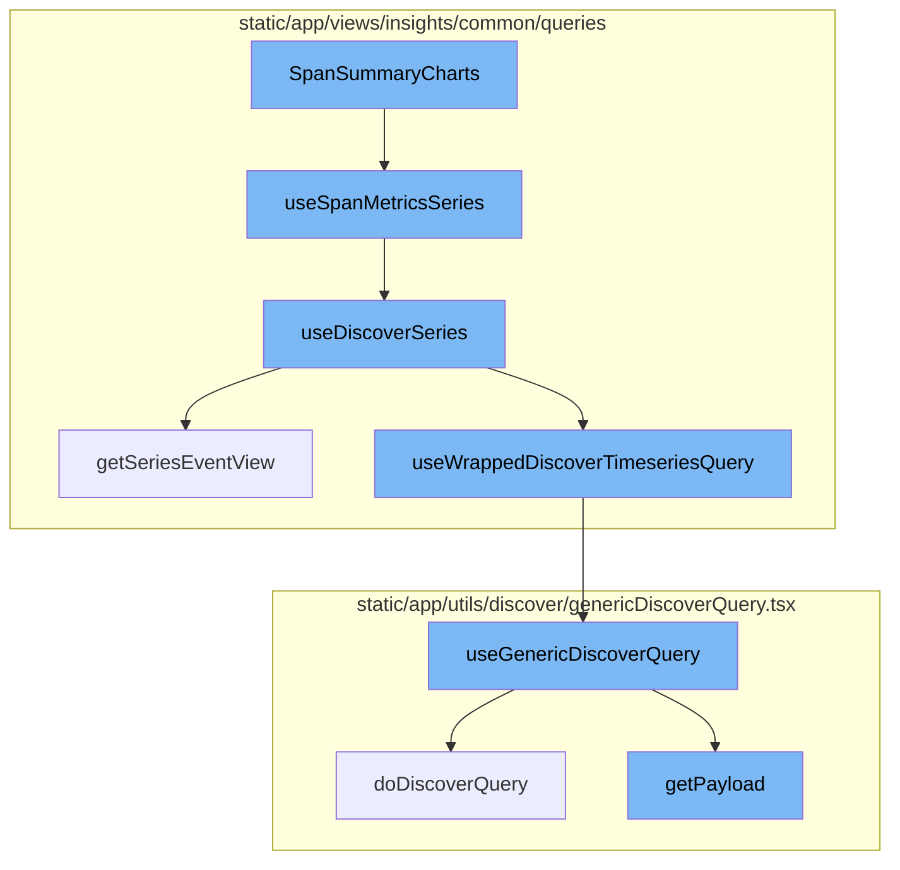
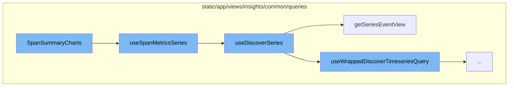
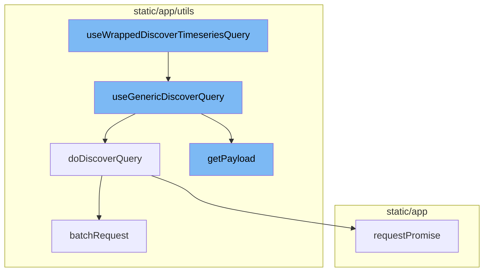

# SpanSummaryCharts Overview

SpanSummaryCharts is a key component in the Sentry application that is responsible for preparing and executing a series of queries to fetch span metrics data. It starts by extracting necessary parameters from the URL and query string using hooks like `useParams` and `useLocation`. These parameters are then used to prepare filters and request payload for the span metrics series.

# Span Metrics Series

The span metrics series is fetched using a custom hook, `useSpanMetricsSeries`, which wraps around the `useDiscoverSeries` function. This function sets the dataset to `SPANS_METRICS` and passes the options and referrer to `useDiscoverSeries`.

# Discover Series

`useDiscoverSeries` is another custom hook that prepares the event view for the discover series. It uses the `getSeriesEventView` function to get the event view based on the provided options and page filters. The timeseries data is then fetched using the `useWrappedDiscoverTimeseriesQuery` function.

# Fetching Timeseries Data

`useWrappedDiscoverTimeseriesQuery` is a custom hook that wraps the `useGenericDiscoverQuery` function. It prepares the request payload and invokes the `useGenericDiscoverQuery` function with the appropriate parameters. The result of the `useGenericDiscoverQuery` function is then processed and returned.

# Generic Discover Query

`useGenericDiscoverQuery` is a custom hook that performs a generic discover query. It prepares the API payload using the `getPayload` function and then performs the query using the `doDiscoverQuery` function. The result of the query is then returned.

# API Request

The actual API request is performed by the `doDiscoverQuery` function. If the `queryBatching` option is provided, it uses the `batchRequest` function to perform the request. Otherwise, it performs the request directly using the `requestPromise` method of the API client.



# Flow drill down

First, we'll zoom into this section of the flow:



<SwmSnippet path="/static/app/views/performance/transactionSummary/transactionSpans/spanSummary/spanSummaryCharts.tsx" line="33">

---

# SpanSummaryCharts

The `SpanSummaryCharts` function is the entry point of the flow. It prepares the necessary data and parameters for the span metrics series. It uses the `useParams` and `useLocation` hooks to extract the necessary parameters from the URL and query string. It also prepares the filters and request payload for the span metrics series.

```tsx
function SpanSummaryCharts() {
  const organization = useOrganization();
  const {spanSlug} = useParams();
  const [spanOp, groupId] = spanSlug.split(':');

  const location = useLocation();
  const {transaction} = location.query;

  const filters: SpanMetricsQueryFilters = {
    'span.group': groupId,
    'span.op': spanOp,
    transaction: transaction as string,
  };

  const {
    isLoading: isThroughputDataLoading,
    data: throughputData,
    error: throughputError,
  } = useSpanMetricsSeries(
    {
      search: MutableSearch.fromQueryObject(filters),
```

---

</SwmSnippet>

<SwmSnippet path="/static/app/views/insights/common/queries/useDiscoverSeries.ts" line="30">

---

# useSpanMetricsSeries

`useSpanMetricsSeries` is a custom hook that wraps around the `useDiscoverSeries` function. It sets the dataset to `SPANS_METRICS` and passes the options and referrer to `useDiscoverSeries`.

```typescript
export const useSpanMetricsSeries = <Fields extends SpanMetricsProperty[]>(
  options: UseMetricsSeriesOptions<Fields> = {},
  referrer: string
) => {
  return useDiscoverSeries<Fields>(options, DiscoverDatasets.SPANS_METRICS, referrer);
};
```

---

</SwmSnippet>

<SwmSnippet path="/static/app/views/insights/common/queries/useDiscoverSeries.ts" line="56">

---

# useDiscoverSeries

`useDiscoverSeries` is a custom hook that prepares the event view for the discover series. It uses the `getSeriesEventView` function to get the event view based on the provided options and page filters. It then uses the `useWrappedDiscoverTimeseriesQuery` function to fetch the timeseries data based on the event view. The data is then parsed into a series and returned.

```typescript
const useDiscoverSeries = <T extends string[]>(
  options: UseMetricsSeriesOptions<T> = {},
  dataset: DiscoverDatasets,
  referrer: string
) => {
  const {search = undefined, yAxis = [], interval = undefined} = options;

  const pageFilters = usePageFilters();

  const eventView = getSeriesEventView(
    search,
    undefined,
    pageFilters.selection,
    yAxis,
    undefined,
    dataset
  );

  if (interval) {
    eventView.interval = interval;
  }
```

---

</SwmSnippet>

<SwmSnippet path="/static/app/views/insights/common/queries/getSeriesEventView.tsx" line="12">

---

# getSeriesEventView

`getSeriesEventView` is a function that creates an event view based on the provided search, fields, page filters, yAxis, top events, and dataset. It calculates the highest possible interval for the given yAxis selection and creates an event view with these parameters.

```tsx
export function getSeriesEventView(
  search: MutableSearch | undefined,
  fields: string[] = [],
  pageFilters: PageFilters,
  yAxis: string[],
  topEvents?: number,
  dataset?: DiscoverDatasets
) {
  // Pick the highest possible interval for the given yAxis selection. Find the ideal interval for each function, then choose the largest one. This results in the lowest granularity, but best performance.
  const interval = sortBy(
    yAxis.map(yAxisFunctionName => {
      const parseResult = parseFunction(yAxisFunctionName);

      if (!parseResult) {
        return DEFAULT_INTERVAL;
      }

      return getIntervalForMetricFunction(parseResult.name, pageFilters.datetime);
    }),
    result => {
      return intervalToMilliseconds(result);
```

---

</SwmSnippet>

Now, lets zoom into this section of the flow:



<SwmSnippet path="/static/app/views/insights/common/queries/useSpansQuery.tsx" line="63">

---

# useWrappedDiscoverTimeseriesQuery

The `useWrappedDiscoverTimeseriesQuery` function is a custom hook that wraps the `useGenericDiscoverQuery` function. It takes an object of parameters, including `eventView`, `enabled`, `initialData`, `referrer`, `cursor`, and `overriddenRoute`. This function is responsible for preparing the request payload and invoking the `useGenericDiscoverQuery` function with the appropriate parameters. The result of the `useGenericDiscoverQuery` function is then processed and returned.

```tsx
export function useWrappedDiscoverTimeseriesQuery<T>({
  eventView,
  enabled,
  initialData,
  referrer,
  cursor,
  overriddenRoute,
}: {
  eventView: EventView;
  cursor?: string;
  enabled?: boolean;
  initialData?: any;
  overriddenRoute?: string;
  referrer?: string;
}) {
  const location = useLocation();
  const organization = useOrganization();
  const {isReady: pageFiltersReady} = usePageFilters();
  const result = useGenericDiscoverQuery<
    {
      data: any[];
```

---

</SwmSnippet>

<SwmSnippet path="/static/app/utils/discover/genericDiscoverQuery.tsx" line="419">

---

# useGenericDiscoverQuery

The `useGenericDiscoverQuery` function is a custom hook that performs a generic discover query. It takes a `props` object as a parameter, which includes the organization slug, route, and options. This function prepares the API payload using the `getPayload` function and then performs the query using the `doDiscoverQuery` function. The result of the query is then returned.

```tsx
export function useGenericDiscoverQuery<T, P>(props: Props<T, P>) {
  const api = useApi();
  const {orgSlug, route, options} = props;
  const url = `/organizations/${orgSlug}/${route}/`;
  const apiPayload = getPayload<T, P>(props);

  const res = useQuery<[T, string | undefined, ResponseMeta<T> | undefined], QueryError>(
    [route, apiPayload],
    ({signal: _signal}) =>
      doDiscoverQuery<T>(api, url, apiPayload, {
        queryBatching: props.queryBatching,
        skipAbort: props.skipAbort,
      }),
    options
  );

  return {
    ...res,
    data: res.data?.[0] ?? undefined,
    error: parseError(res.error),
    statusCode: res.data?.[1] ?? undefined,
```

---

</SwmSnippet>

<SwmSnippet path="/static/app/utils/discover/genericDiscoverQuery.tsx" line="337">

---

# doDiscoverQuery

The `doDiscoverQuery` function is an asynchronous function that performs the actual API request. It takes the API client, URL, request parameters, and options as parameters. If the `queryBatching` option is provided, it uses the `batchRequest` function to perform the request. Otherwise, it performs the request directly using the `requestPromise` method of the API client.

```tsx
export async function doDiscoverQuery<T>(
  api: Client,
  url: string,
  params: DiscoverQueryRequestParams,
  options: {
    queryBatching?: QueryBatching;
    retry?: RetryOptions;
    skipAbort?: boolean;
  } = {}
): Promise<[T, string | undefined, ResponseMeta<T> | undefined]> {
  const {queryBatching, retry, skipAbort} = options;
  if (queryBatching?.batchRequest) {
    return queryBatching.batchRequest(api, url, {
      query: params,
      includeAllArgs: true,
    });
  }

  const baseTimeout = retry?.baseTimeout ?? BASE_TIMEOUT;
  const timeoutMultiplier = retry?.timeoutMultiplier ?? TIMEOUT_MULTIPLIER;
  const statusCodes = retry?.statusCodes ?? [];
```

---

</SwmSnippet>

<SwmSnippet path="/static/app/utils/discover/genericDiscoverQuery.tsx" line="386">

---

# getPayload

The `getPayload` function is used to prepare the payload for the API request. It takes a `props` object as a parameter, which includes various properties such as `cursor`, `limit`, `noPagination`, `referrer`, `getRequestPayload`, `eventView`, `location`, and `forceAppendRawQueryString`. Depending on the provided properties, it prepares the payload accordingly.

```tsx
function getPayload<T, P>(props: Props<T, P>) {
  const {
    cursor,
    limit,
    noPagination,
    referrer,
    getRequestPayload,
    eventView,
    location,
    forceAppendRawQueryString,
  } = props;
  const payload = getRequestPayload
    ? getRequestPayload(props)
    : eventView.getEventsAPIPayload(location, forceAppendRawQueryString);

  if (cursor !== undefined) {
    payload.cursor = cursor;
  }
  if (limit) {
    payload.per_page = limit;
  }
```

---

</SwmSnippet>

<SwmSnippet path="/static/app/utils/performance/contexts/genericQueryBatcher.tsx" line="247">

---

# batchRequest

The `batchRequest` function is used when the `queryBatching` option is provided to the `doDiscoverQuery` function. It takes the API client, path, and request query object as parameters and performs the batch request.

```tsx
  function batchRequest(
    _: Client,
    path: string,
    requestQueryObject: QueryObject
  ): Promise<any> {
    const queryPromise = new Promise((resolve, reject) => {
      const queryDefinition: BatchQueryDefinition = {
        resolve,
        reject,
        transform,
        batchProperty,
        path,
        requestQueryObject,
        api,
      };
      batchContext?.addQuery(queryDefinition, id.current);
    });
    return queryPromise;
  }
```

---

</SwmSnippet>

<SwmSnippet path="/static/app/api.tsx" line="656">

---

# requestPromise

The `requestPromise` method of the API client is used to perform the actual API request. It takes the path and options as parameters and returns a promise that resolves with the response data.

```tsx
  requestPromise<IncludeAllArgsType extends boolean>(
    path: string,
    {
      includeAllArgs,
      ...options
    }: {includeAllArgs?: IncludeAllArgsType} & Readonly<RequestOptions> = {}
  ): Promise<IncludeAllArgsType extends true ? ApiResult : any> {
    // Create an error object here before we make any async calls so that we
    // have a helpful stack trace if it errors
    //
    // This *should* get logged to Sentry only if the promise rejection is not handled
    // (since SDK captures unhandled rejections). Ideally we explicitly ignore rejection
    // or handle with a user friendly error message
    const preservedError = new Error('API Request Error');

    return new Promise((resolve, reject) =>
      this.request(path, {
        ...options,
        preservedError,
        success: (data, textStatus, resp) => {
          if (includeAllArgs) {
```

---

</SwmSnippet>

&nbsp;

*This is an auto-generated document by Swimm AI 🌊 and has not yet been verified by a human*

<SwmMeta version="3.0.0" repo-id="Z2l0aHViJTNBJTNBc2VudHJ5LWRlbW8lM0ElM0FTd2ltbS1EZW1v" repo-name="sentry-demo" doc-type="flows"><sup>Powered by [Swimm](/)</sup></SwmMeta>
