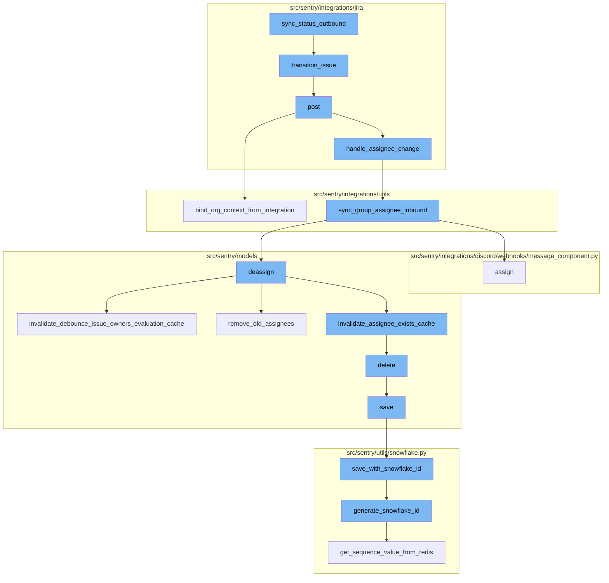
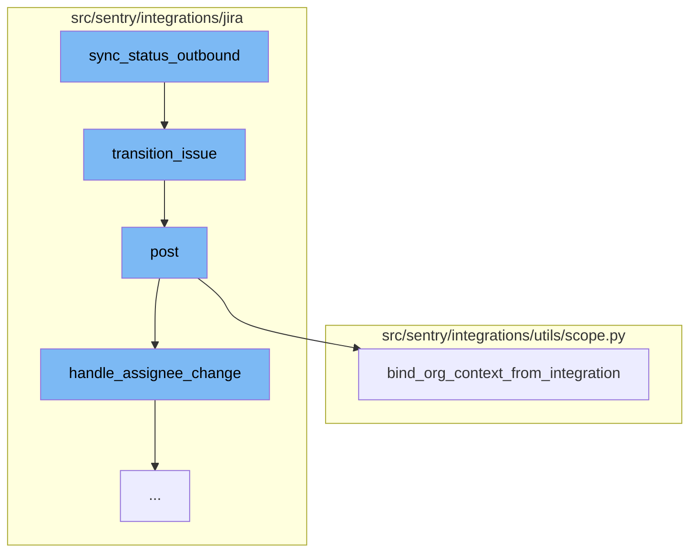
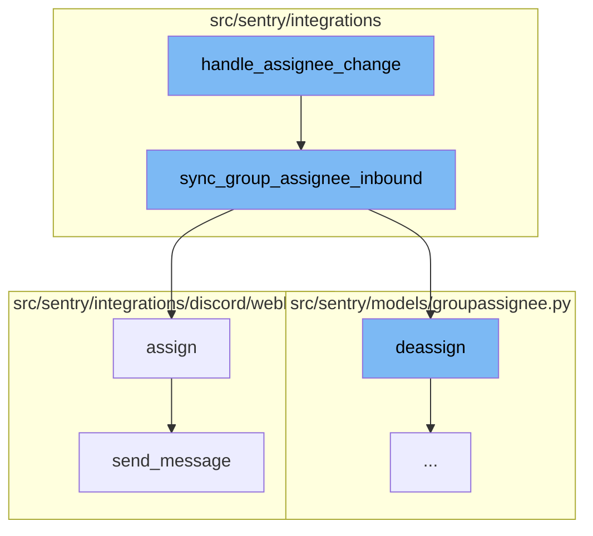
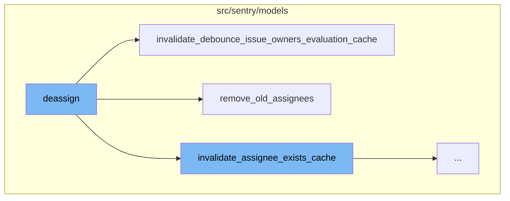
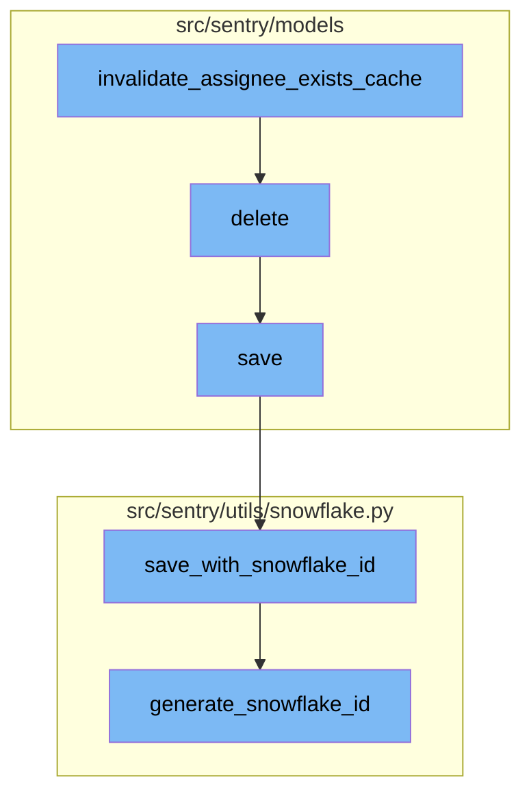

# Overview of sync_status_outbound

The `sync_status_outbound` is a function that plays a crucial role in the synchronization of issue statuses between Sentry and Jira. It ensures that the status of a Sentry issue is accurately reflected in the corresponding Jira issue.

<SwmSnippet path="/src/sentry/integrations/jira/integration.py" line="972">

---

# sync_status_outbound Function

The `sync_status_outbound` function is responsible for propagating a Sentry issue's status to a linked issue's status. It first retrieves the Jira issue and project, then checks if the current status of the Jira issue matches the status in Sentry. If not, it fetches the available transitions for the Jira issue and applies the appropriate transition to match the status in Sentry.

```python
    def sync_status_outbound(self, external_issue, is_resolved, project_id, **kwargs):
        """
        Propagate a sentry issue's status to a linked issue's status.
        """
        client = self.get_client()
        jira_issue = client.get_issue(external_issue.key)
        jira_project = jira_issue["fields"]["project"]

        external_project = integration_service.get_integration_external_project(
            organization_id=external_issue.organization_id,
            integration_id=external_issue.integration_id,
            external_id=jira_project["id"],
        )
        log_context = {
            "integration_id": external_issue.integration_id,
            "is_resolved": is_resolved,
            "issue_key": external_issue.key,
        }
        if not external_project:
            logger.info("jira.external-project-not-found", extra=log_context)
            return
```

---

</SwmSnippet>

<SwmSnippet path="/src/sentry/integrations/jira/client.py" line="198">

---

# Transition Issue Function

The `transition_issue` function is called within `sync_status_outbound` to apply a specific transition to a Jira issue. It makes a POST request to the Jira API to apply the transition.

```python
    def transition_issue(self, issue_key, transition_id):
        return self.post(
            self.TRANSITION_URL % issue_key, data={"transition": {"id": transition_id}}
        )
```

---

</SwmSnippet>

<SwmSnippet path="/src/sentry/integrations/jira/webhooks/issue_updated.py" line="50">

---

# Post Function

The `post` function is triggered when an issue is updated in Jira. It retrieves the integration instance and binds the organization context. It then checks if there are any changes in the assignee or status of the issue and handles them accordingly.

```python
    def post(self, request: Request, *args, **kwargs) -> Response:
        token = self.get_token(request)
        rpc_integration = get_integration_from_jwt(
            token=token,
            path=request.path,
            provider=self.provider,
            query_params=request.GET,
            method="POST",
        )
        # Integrations and their corresponding RpcIntegrations share the same id,
        # so we don't need to first convert this to a full Integration object
        bind_org_context_from_integration(rpc_integration.id, {"webhook": "issue_updated"})
        sentry_sdk.set_tag("integration_id", rpc_integration.id)

        data = request.data
        if not data.get("changelog"):
            logger.info("jira.missing-changelog", extra={"integration_id": rpc_integration.id})
            return self.respond()

        handle_assignee_change(rpc_integration, data, use_email_scope=settings.JIRA_USE_EMAIL_SCOPE)
        handle_status_change(rpc_integration, data)
```

---

</SwmSnippet>

<SwmSnippet path="/src/sentry/integrations/utils/scope.py" line="59">

---

# Bind Org Context from Integration Function

The `bind_org_context_from_integration` function is used within the `post` function to bind the organization context to the scope based on the integration ID. It retrieves the organizations associated with the integration and binds the organization data to the scope.

```python
def bind_org_context_from_integration(
    integration_id: int, extra: Mapping[str, Any] | None = None
) -> None:
    """
    Given the id of an Integration or an RpcIntegration, get the associated org(s) and bind that
    data to the scope.

    Note: An `Integration` is an instance of given provider's integration, tied to a single entity
    on the provider's end (for example, an instance of the GitHub integration tied to a particular
    GitHub org, or an instance of the Slack integration tied to a particular Slack workspace), which
    can be shared by multiple orgs. Also, it doesn't matter whether the passed id comes from an
    Integration or an RpcIntegration object, because corresponding ones share the same id.
    """

    org_integrations = get_org_integrations(integration_id)

    if len(org_integrations) == 0:
        logger.warning(
            "Can't bind org context - no orgs are associated with integration id=%s.",
            integration_id,
            extra=extra,
```

---

</SwmSnippet>

<SwmSnippet path="/src/sentry/integrations/jira/utils/api.py" line="47">

---

# Handle Assignee Change Function

The `handle_assignee_change` function is the starting point of the flow. It checks if the assignee of an issue has changed. If the assignee has changed, it calls the `sync_group_assignee_inbound` function with the assignee's email and issue key.

```python
def handle_assignee_change(
    integration: RpcIntegration,
    data: Mapping[str, Any],
    use_email_scope: bool = False,
) -> None:
    issue_key = data["issue"]["key"]

    log_context = {"issue_key": issue_key, "integration_id": integration.id}
    assignee_changed = any(
        item for item in data["changelog"]["items"] if item["field"] == "assignee"
    )
    if not assignee_changed:
        logger.info("jira.assignee-not-in-changelog", extra=log_context)
        return

    # If there is no assignee, assume it was unassigned.
    fields = data["issue"]["fields"]
    assignee = fields.get("assignee")

    if assignee is None:
        sync_group_assignee_inbound(integration, None, issue_key, assign=False)
```

---

</SwmSnippet>

<SwmSnippet path="/src/sentry/integrations/utils/sync.py" line="64">

---

# Sync Group Assignee Inbound Function

The `sync_group_assignee_inbound` function is responsible for assigning or deassigning groups to users based on the `assign` parameter. If `assign` is `True`, it assigns the groups to the user. If `assign` is `False`, it deassigns the groups from the user.

```python
def sync_group_assignee_inbound(
    integration: RpcIntegration,
    email: str | None,
    external_issue_key: str,
    assign: bool = True,
) -> Sequence[Group]:
    """
    Given an integration, user email address and an external issue key,
    assign linked groups to matching users. Checks project membership.
    Returns a list of groups that were successfully assigned.
    """

    logger = logging.getLogger(f"sentry.integrations.{integration.provider}")

    orgs_with_sync_enabled = where_should_sync(integration, "inbound_assignee")
    affected_groups = Group.objects.get_groups_by_external_issue(
        integration,
        orgs_with_sync_enabled,
        external_issue_key,
    )
    log_context = {
```

---

</SwmSnippet>

<SwmSnippet path="/src/sentry/integrations/discord/webhooks/message_component.py" line="137">

---

# Assign Function

The `assign` function in the Discord integration updates the group with the new assignee and records the assignment action. It then sends a message to the Discord channel to notify about the assignment update.

```python
    def assign(self) -> Response:
        assignee = self.request.get_selected_options()[0]

        self.update_group(
            {
                "assignedTo": assignee,
                "integration": ActivityIntegration.DISCORD.value,
            }
        )

        logger.info(
            "discord.assign.dialog",
            extra={
                "assignee": assignee,
                "user": self.request.user,
            },
        )

        assert self.request.user is not None

        analytics.record(
```

---

</SwmSnippet>

<SwmSnippet path="/src/sentry/integrations/discord/webhooks/handler.py" line="24">

---

# Send Message Function

The `send_message` function is used to send a new follow-up message or update an existing message in the Discord channel. It takes a message and a boolean `update` as parameters. If `update` is `True`, it updates an existing message. If `update` is `False`, it sends a new message.

```python
    def send_message(self, message: str | DiscordMessageBuilder, update: bool = False) -> Response:
        """Sends a new follow up message."""
        response_type = DiscordResponseTypes.UPDATE if update else DiscordResponseTypes.MESSAGE

        if isinstance(message, str):
            message = DiscordMessageBuilder(
                content=message, flags=DiscordMessageFlags().set_ephemeral()
            )
        return Response(
            {
                "type": response_type,
                "data": message.build(),
            },
            status=200,
        )
```

---

</SwmSnippet>

<SwmSnippet path="/src/sentry/models/groupassignee.py" line="197">

---

# Deassign Function

The `deassign` function is responsible for removing the assignment of a group. It first checks if there is a previous assignee for the group. If there is, it deletes the assignment and creates an activity log for the unassignment. It also invalidates the assignee cache for the group and debounces the issue owners evaluation cache.

```python
    def deassign(
        self,
        group: Group,
        acting_user: User | RpcUser | None = None,
        assigned_to: Team | RpcUser | None = None,
        extra: dict[str, str] | None = None,
    ) -> None:
        from sentry.integrations.utils import sync_group_assignee_outbound
        from sentry.models.activity import Activity
        from sentry.models.projectownership import ProjectOwnership

        try:
            previous_groupassignee = self.get(group=group)
        except GroupAssignee.DoesNotExist:
            previous_groupassignee = None

        affected = self.filter(group=group)[:1].count()
        self.filter(group=group).delete()

        if affected > 0:
            Activity.objects.create_group_activity(group, ActivityType.UNASSIGNED, user=acting_user)
```

---

</SwmSnippet>

<SwmSnippet path="/src/sentry/models/groupowner.py" line="125">

---

# Invalidate Debounce Issue Owners Evaluation Cache Function

The `invalidate_debounce_issue_owners_evaluation_cache` function is called within the `deassign` function. It clears the debounce issue owners cache for the group. If a group ID is not provided, it clears the cache for all groups in a project that had an event within a certain time window.

```python
    def invalidate_debounce_issue_owners_evaluation_cache(cls, project_id, group_id=None):
        """
        If `group_id` is provided, clear the debounce issue owners cache for that group, else clear
        the cache of all groups for a project that had an event within the
        ISSUE_OWNERS_DEBOUNCE_DURATION window.
        """
        if group_id:
            cache.delete(ISSUE_OWNERS_DEBOUNCE_KEY(group_id))
            return

        # Get all the groups for a project that had an event within the ISSUE_OWNERS_DEBOUNCE_DURATION window.
        # Any groups without events in that window would have expired their TTL in the cache.
        queryset = Group.objects.filter(
            project_id=project_id,
            last_seen__gte=timezone.now() - timedelta(seconds=ISSUE_OWNERS_DEBOUNCE_DURATION),
        ).values_list("id", flat=True)

        # Run cache invalidation in batches
        group_id_iter = queryset.iterator(chunk_size=1000)
        while True:
            group_ids = list(itertools.islice(group_id_iter, 1000))
```

---

</SwmSnippet>

<SwmSnippet path="/src/sentry/models/groupassignee.py" line="65">

---

# Remove Old Assignees Function

The `remove_old_assignees` function is also called within the `deassign` function. It removes the old assignees from the group. If the previous assignee was a team, it deletes the group subscription for the team. If the previous assignee was a user, it deletes the group subscription for the user.

```python
    def remove_old_assignees(
        self,
        group: Group,
        previous_assignee: GroupAssignee | None,
        new_assignee_id: int | None = None,
        new_assignee_type: str | None = None,
    ) -> None:
        from sentry.models.team import Team

        if not previous_assignee:
            return

        if (
            features.has("organizations:team-workflow-notifications", group.organization)
            and previous_assignee.team
        ):
            GroupSubscription.objects.filter(
                group=group,
                project=group.project,
                team=previous_assignee.team,
                reason=GroupSubscriptionReason.assigned,
```

---

</SwmSnippet>

<SwmSnippet path="/src/sentry/models/groupowner.py" line="152">

---

# Invalidate Assignee Exists Cache Function

The `invalidate_assignee_exists_cache` function is used to clear the assignee exists cache. If a `group_id` is provided, the cache for that specific group is cleared. Otherwise, the cache for all groups within a project that had an event within the `ASSIGNEE_EXISTS_DURATION` window is cleared.

```python
    def invalidate_assignee_exists_cache(cls, project_id, group_id=None):
        """
        If `group_id` is provided, clear the assignee exists cache for that group, else
        clear the cache of all groups for a project that had an event within the
        ASSIGNEE_EXISTS_DURATION window.
        """
        if group_id:
            cache.delete(ASSIGNEE_EXISTS_KEY(group_id))
            return

        # Get all the groups for a project that had an event within the ASSIGNEE_EXISTS_DURATION window.
        # Any groups without events in that window would have expired their TTL in the cache.
        queryset = Group.objects.filter(
            project_id=project_id,
            last_seen__gte=timezone.now() - timedelta(seconds=ASSIGNEE_EXISTS_DURATION),
        ).values_list("id", flat=True)

        # Run cache invalidation in batches
        group_id_iter = queryset.iterator(chunk_size=1000)
        while True:
            group_ids = list(itertools.islice(group_id_iter, 1000))
```

---

</SwmSnippet>

<SwmSnippet path="/src/sentry/models/project.py" line="722">

---

# Delete Project Function

The `delete` function is used to delete a project. It manually cascades the deletion due to the lack of a foreign key relationship. It also removes notification settings for the project.

```python
    def delete(self, **kwargs):
        # There is no foreign key relationship so we have to manually cascade.
        notifications_service.remove_notification_settings_for_project(project_id=self.id)

        with outbox_context(transaction.atomic(router.db_for_write(Project))):
            Project.outbox_for_update(self.id, self.organization_id).save()
            return super().delete(**kwargs)
```

---

</SwmSnippet>

<SwmSnippet path="/src/sentry/models/project.py" line="365">

---

# Save Project Function

The `save` function is used to save a project. If the project does not have a slug, it generates one. If the `SENTRY_USE_SNOWFLAKE` setting is enabled, it saves the project with a snowflake ID.

```python
    def save(self, *args, **kwargs):
        if not self.slug:
            lock = locks.get(
                f"slug:project:{self.organization_id}", duration=5, name="project_slug"
            )
            with TimedRetryPolicy(10)(lock.acquire):
                slugify_instance(
                    self,
                    self.name,
                    organization=self.organization,
                    reserved=RESERVED_PROJECT_SLUGS,
                    max_length=50,
                )

        if SENTRY_USE_SNOWFLAKE:
            snowflake_redis_key = "project_snowflake_key"
            save_with_snowflake_id(
                instance=self,
                snowflake_redis_key=snowflake_redis_key,
                save_callback=lambda: super(Project, self).save(*args, **kwargs),
            )
```

---

</SwmSnippet>

<SwmSnippet path="/src/sentry/utils/snowflake.py" line="47">

---

# Save with Snowflake ID Function

The `save_with_snowflake_id` function is used to save an instance with a snowflake ID. It generates a new snowflake ID if the instance does not have one and then attempts to save the instance.

```python
def save_with_snowflake_id(
    instance: BaseModel, snowflake_redis_key: str, save_callback: Callable[[], object]
) -> None:
    assert uses_snowflake_id(
        instance.__class__
    ), "Only models decorated with uses_snowflake_id can be saved with save_with_snowflake_id()"

    for _ in range(settings.MAX_REDIS_SNOWFLAKE_RETRY_COUNTER):
        if not instance.id:
            instance.id = generate_snowflake_id(snowflake_redis_key)
        try:
            with enforce_constraints(transaction.atomic(using=router.db_for_write(type(instance)))):
                save_callback()
            return
        except IntegrityError:
            instance.id = None  # type: ignore[assignment]  # see typeddjango/django-stubs#2014
    raise MaxSnowflakeRetryError
```

---

</SwmSnippet>

<SwmSnippet path="/src/sentry/utils/snowflake.py" line="113">

---

# Generate Snowflake ID Function

The `generate_snowflake_id` function is used to generate a snowflake ID. It generates a unique ID based on the current time, region, and a sequence value from Redis.

```python
def generate_snowflake_id(redis_key: str) -> int:
    segment_values = {}

    segment_values[VERSION_ID] = msb_0_ordering(settings.SNOWFLAKE_VERSION_ID, VERSION_ID.length)

    try:
        segment_values[REGION_ID] = get_local_region().snowflake_id
    except RegionContextError:  # expected if running in monolith mode
        segment_values[REGION_ID] = NULL_REGION_ID

    current_time = datetime.now().timestamp()
    # supports up to 130 years
    segment_values[TIME_DIFFERENCE] = int(current_time - settings.SENTRY_SNOWFLAKE_EPOCH_START)

    snowflake_id = 0
    (
        segment_values[TIME_DIFFERENCE],
        segment_values[REGION_SEQUENCE],
    ) = get_sequence_value_from_redis(redis_key, segment_values[TIME_DIFFERENCE])

    for segment in BIT_SEGMENT_SCHEMA:
```

---

</SwmSnippet>



# Flow drill down

First, we'll zoom into this section of the flow:



<SwmSnippet path="/src/sentry/integrations/jira/integration.py" line="972">

---

# sync_status_outbound

The `sync_status_outbound` function is responsible for propagating a Sentry issue's status to a linked issue's status. It first retrieves the Jira issue and project, then checks if the current status of the Jira issue matches the status in Sentry. If not, it fetches the available transitions for the Jira issue and applies the appropriate transition to match the status in Sentry.

```python
    def sync_status_outbound(self, external_issue, is_resolved, project_id, **kwargs):
        """
        Propagate a sentry issue's status to a linked issue's status.
        """
        client = self.get_client()
        jira_issue = client.get_issue(external_issue.key)
        jira_project = jira_issue["fields"]["project"]

        external_project = integration_service.get_integration_external_project(
            organization_id=external_issue.organization_id,
            integration_id=external_issue.integration_id,
            external_id=jira_project["id"],
        )
        log_context = {
            "integration_id": external_issue.integration_id,
            "is_resolved": is_resolved,
            "issue_key": external_issue.key,
        }
        if not external_project:
            logger.info("jira.external-project-not-found", extra=log_context)
            return
```

---

</SwmSnippet>

<SwmSnippet path="/src/sentry/integrations/jira/client.py" line="198">

---

# transition_issue

The `transition_issue` function is called within `sync_status_outbound` to apply a specific transition to a Jira issue. It makes a POST request to the Jira API to apply the transition.

```python
    def transition_issue(self, issue_key, transition_id):
        return self.post(
            self.TRANSITION_URL % issue_key, data={"transition": {"id": transition_id}}
        )
```

---

</SwmSnippet>

<SwmSnippet path="/src/sentry/integrations/jira/webhooks/issue_updated.py" line="50">

---

# post

The `post` function is triggered when an issue is updated in Jira. It retrieves the integration instance and binds the organization context. It then checks if there are any changes in the assignee or status of the issue and handles them accordingly.

```python
    def post(self, request: Request, *args, **kwargs) -> Response:
        token = self.get_token(request)
        rpc_integration = get_integration_from_jwt(
            token=token,
            path=request.path,
            provider=self.provider,
            query_params=request.GET,
            method="POST",
        )
        # Integrations and their corresponding RpcIntegrations share the same id,
        # so we don't need to first convert this to a full Integration object
        bind_org_context_from_integration(rpc_integration.id, {"webhook": "issue_updated"})
        sentry_sdk.set_tag("integration_id", rpc_integration.id)

        data = request.data
        if not data.get("changelog"):
            logger.info("jira.missing-changelog", extra={"integration_id": rpc_integration.id})
            return self.respond()

        handle_assignee_change(rpc_integration, data, use_email_scope=settings.JIRA_USE_EMAIL_SCOPE)
        handle_status_change(rpc_integration, data)
```

---

</SwmSnippet>

<SwmSnippet path="/src/sentry/integrations/utils/scope.py" line="59">

---

# bind_org_context_from_integration

The `bind_org_context_from_integration` function is used within the `post` function to bind the organization context to the scope based on the integration ID. It retrieves the organizations associated with the integration and binds the organization data to the scope.

```python
def bind_org_context_from_integration(
    integration_id: int, extra: Mapping[str, Any] | None = None
) -> None:
    """
    Given the id of an Integration or an RpcIntegration, get the associated org(s) and bind that
    data to the scope.

    Note: An `Integration` is an instance of given provider's integration, tied to a single entity
    on the provider's end (for example, an instance of the GitHub integration tied to a particular
    GitHub org, or an instance of the Slack integration tied to a particular Slack workspace), which
    can be shared by multiple orgs. Also, it doesn't matter whether the passed id comes from an
    Integration or an RpcIntegration object, because corresponding ones share the same id.
    """

    org_integrations = get_org_integrations(integration_id)

    if len(org_integrations) == 0:
        logger.warning(
            "Can't bind org context - no orgs are associated with integration id=%s.",
            integration_id,
            extra=extra,
```

---

</SwmSnippet>

Now, lets zoom into this section of the flow:



<SwmSnippet path="/src/sentry/integrations/jira/utils/api.py" line="47">

---

# sync_status_outbound Flow

The `handle_assignee_change` function is the starting point of the flow. It checks if the assignee of an issue has changed. If the assignee has changed, it calls the `sync_group_assignee_inbound` function with the assignee's email and issue key.

```python
def handle_assignee_change(
    integration: RpcIntegration,
    data: Mapping[str, Any],
    use_email_scope: bool = False,
) -> None:
    issue_key = data["issue"]["key"]

    log_context = {"issue_key": issue_key, "integration_id": integration.id}
    assignee_changed = any(
        item for item in data["changelog"]["items"] if item["field"] == "assignee"
    )
    if not assignee_changed:
        logger.info("jira.assignee-not-in-changelog", extra=log_context)
        return

    # If there is no assignee, assume it was unassigned.
    fields = data["issue"]["fields"]
    assignee = fields.get("assignee")

    if assignee is None:
        sync_group_assignee_inbound(integration, None, issue_key, assign=False)
```

---

</SwmSnippet>

<SwmSnippet path="/src/sentry/integrations/utils/sync.py" line="64">

---

The `sync_group_assignee_inbound` function is responsible for assigning or deassigning groups to users based on the `assign` parameter. If `assign` is `True`, it assigns the groups to the user. If `assign` is `False`, it deassigns the groups from the user.

```python
def sync_group_assignee_inbound(
    integration: RpcIntegration,
    email: str | None,
    external_issue_key: str,
    assign: bool = True,
) -> Sequence[Group]:
    """
    Given an integration, user email address and an external issue key,
    assign linked groups to matching users. Checks project membership.
    Returns a list of groups that were successfully assigned.
    """

    logger = logging.getLogger(f"sentry.integrations.{integration.provider}")

    orgs_with_sync_enabled = where_should_sync(integration, "inbound_assignee")
    affected_groups = Group.objects.get_groups_by_external_issue(
        integration,
        orgs_with_sync_enabled,
        external_issue_key,
    )
    log_context = {
```

---

</SwmSnippet>

<SwmSnippet path="/src/sentry/integrations/discord/webhooks/message_component.py" line="137">

---

The `assign` function in the Discord integration updates the group with the new assignee and records the assignment action. It then sends a message to the Discord channel to notify about the assignment update.

```python
    def assign(self) -> Response:
        assignee = self.request.get_selected_options()[0]

        self.update_group(
            {
                "assignedTo": assignee,
                "integration": ActivityIntegration.DISCORD.value,
            }
        )

        logger.info(
            "discord.assign.dialog",
            extra={
                "assignee": assignee,
                "user": self.request.user,
            },
        )

        assert self.request.user is not None

        analytics.record(
```

---

</SwmSnippet>

<SwmSnippet path="/src/sentry/integrations/discord/webhooks/handler.py" line="24">

---

The `send_message` function is used to send a new follow-up message or update an existing message in the Discord channel. It takes a message and a boolean `update` as parameters. If `update` is `True`, it updates an existing message. If `update` is `False`, it sends a new message.

```python
    def send_message(self, message: str | DiscordMessageBuilder, update: bool = False) -> Response:
        """Sends a new follow up message."""
        response_type = DiscordResponseTypes.UPDATE if update else DiscordResponseTypes.MESSAGE

        if isinstance(message, str):
            message = DiscordMessageBuilder(
                content=message, flags=DiscordMessageFlags().set_ephemeral()
            )
        return Response(
            {
                "type": response_type,
                "data": message.build(),
            },
            status=200,
        )
```

---

</SwmSnippet>

Now, lets zoom into this section of the flow:



<SwmSnippet path="/src/sentry/models/groupassignee.py" line="197">

---

# Deassign Function

The `deassign` function is responsible for removing the assignment of a group. It first checks if there is a previous assignee for the group. If there is, it deletes the assignment and creates an activity log for the unassignment. It also invalidates the assignee cache for the group and debounces the issue owners evaluation cache.

```python
    def deassign(
        self,
        group: Group,
        acting_user: User | RpcUser | None = None,
        assigned_to: Team | RpcUser | None = None,
        extra: dict[str, str] | None = None,
    ) -> None:
        from sentry.integrations.utils import sync_group_assignee_outbound
        from sentry.models.activity import Activity
        from sentry.models.projectownership import ProjectOwnership

        try:
            previous_groupassignee = self.get(group=group)
        except GroupAssignee.DoesNotExist:
            previous_groupassignee = None

        affected = self.filter(group=group)[:1].count()
        self.filter(group=group).delete()

        if affected > 0:
            Activity.objects.create_group_activity(group, ActivityType.UNASSIGNED, user=acting_user)
```

---

</SwmSnippet>

<SwmSnippet path="/src/sentry/models/groupowner.py" line="125">

---

# Invalidate Debounce Issue Owners Evaluation Cache Function

The `invalidate_debounce_issue_owners_evaluation_cache` function is called within the `deassign` function. It clears the debounce issue owners cache for the group. If a group ID is not provided, it clears the cache for all groups in a project that had an event within a certain time window.

```python
    def invalidate_debounce_issue_owners_evaluation_cache(cls, project_id, group_id=None):
        """
        If `group_id` is provided, clear the debounce issue owners cache for that group, else clear
        the cache of all groups for a project that had an event within the
        ISSUE_OWNERS_DEBOUNCE_DURATION window.
        """
        if group_id:
            cache.delete(ISSUE_OWNERS_DEBOUNCE_KEY(group_id))
            return

        # Get all the groups for a project that had an event within the ISSUE_OWNERS_DEBOUNCE_DURATION window.
        # Any groups without events in that window would have expired their TTL in the cache.
        queryset = Group.objects.filter(
            project_id=project_id,
            last_seen__gte=timezone.now() - timedelta(seconds=ISSUE_OWNERS_DEBOUNCE_DURATION),
        ).values_list("id", flat=True)

        # Run cache invalidation in batches
        group_id_iter = queryset.iterator(chunk_size=1000)
        while True:
            group_ids = list(itertools.islice(group_id_iter, 1000))
```

---

</SwmSnippet>

<SwmSnippet path="/src/sentry/models/groupassignee.py" line="65">

---

# Remove Old Assignees Function

The `remove_old_assignees` function is also called within the `deassign` function. It removes the old assignees from the group. If the previous assignee was a team, it deletes the group subscription for the team. If the previous assignee was a user, it deletes the group subscription for the user.

```python
    def remove_old_assignees(
        self,
        group: Group,
        previous_assignee: GroupAssignee | None,
        new_assignee_id: int | None = None,
        new_assignee_type: str | None = None,
    ) -> None:
        from sentry.models.team import Team

        if not previous_assignee:
            return

        if (
            features.has("organizations:team-workflow-notifications", group.organization)
            and previous_assignee.team
        ):
            GroupSubscription.objects.filter(
                group=group,
                project=group.project,
                team=previous_assignee.team,
                reason=GroupSubscriptionReason.assigned,
```

---

</SwmSnippet>

Now, lets zoom into this section of the flow:



<SwmSnippet path="/src/sentry/models/groupowner.py" line="152">

---

# Invalidate Assignee Exists Cache

The `invalidate_assignee_exists_cache` function is used to clear the assignee exists cache. If a `group_id` is provided, the cache for that specific group is cleared. Otherwise, the cache for all groups within a project that had an event within the `ASSIGNEE_EXISTS_DURATION` window is cleared.

```python
    def invalidate_assignee_exists_cache(cls, project_id, group_id=None):
        """
        If `group_id` is provided, clear the assignee exists cache for that group, else
        clear the cache of all groups for a project that had an event within the
        ASSIGNEE_EXISTS_DURATION window.
        """
        if group_id:
            cache.delete(ASSIGNEE_EXISTS_KEY(group_id))
            return

        # Get all the groups for a project that had an event within the ASSIGNEE_EXISTS_DURATION window.
        # Any groups without events in that window would have expired their TTL in the cache.
        queryset = Group.objects.filter(
            project_id=project_id,
            last_seen__gte=timezone.now() - timedelta(seconds=ASSIGNEE_EXISTS_DURATION),
        ).values_list("id", flat=True)

        # Run cache invalidation in batches
        group_id_iter = queryset.iterator(chunk_size=1000)
        while True:
            group_ids = list(itertools.islice(group_id_iter, 1000))
```

---

</SwmSnippet>

<SwmSnippet path="/src/sentry/models/project.py" line="722">

---

# Delete Project

The `delete` function is used to delete a project. It manually cascades the deletion due to the lack of a foreign key relationship. It also removes notification settings for the project.

```python
    def delete(self, **kwargs):
        # There is no foreign key relationship so we have to manually cascade.
        notifications_service.remove_notification_settings_for_project(project_id=self.id)

        with outbox_context(transaction.atomic(router.db_for_write(Project))):
            Project.outbox_for_update(self.id, self.organization_id).save()
            return super().delete(**kwargs)
```

---

</SwmSnippet>

<SwmSnippet path="/src/sentry/models/project.py" line="365">

---

# Save Project

The `save` function is used to save a project. If the project does not have a slug, it generates one. If the `SENTRY_USE_SNOWFLAKE` setting is enabled, it saves the project with a snowflake ID.

```python
    def save(self, *args, **kwargs):
        if not self.slug:
            lock = locks.get(
                f"slug:project:{self.organization_id}", duration=5, name="project_slug"
            )
            with TimedRetryPolicy(10)(lock.acquire):
                slugify_instance(
                    self,
                    self.name,
                    organization=self.organization,
                    reserved=RESERVED_PROJECT_SLUGS,
                    max_length=50,
                )

        if SENTRY_USE_SNOWFLAKE:
            snowflake_redis_key = "project_snowflake_key"
            save_with_snowflake_id(
                instance=self,
                snowflake_redis_key=snowflake_redis_key,
                save_callback=lambda: super(Project, self).save(*args, **kwargs),
            )
```

---

</SwmSnippet>

<SwmSnippet path="/src/sentry/utils/snowflake.py" line="47">

---

# Save with Snowflake ID

The `save_with_snowflake_id` function is used to save an instance with a snowflake ID. It generates a new snowflake ID if the instance does not have one and then attempts to save the instance.

```python
def save_with_snowflake_id(
    instance: BaseModel, snowflake_redis_key: str, save_callback: Callable[[], object]
) -> None:
    assert uses_snowflake_id(
        instance.__class__
    ), "Only models decorated with uses_snowflake_id can be saved with save_with_snowflake_id()"

    for _ in range(settings.MAX_REDIS_SNOWFLAKE_RETRY_COUNTER):
        if not instance.id:
            instance.id = generate_snowflake_id(snowflake_redis_key)
        try:
            with enforce_constraints(transaction.atomic(using=router.db_for_write(type(instance)))):
                save_callback()
            return
        except IntegrityError:
            instance.id = None  # type: ignore[assignment]  # see typeddjango/django-stubs#2014
    raise MaxSnowflakeRetryError
```

---

</SwmSnippet>

<SwmSnippet path="/src/sentry/utils/snowflake.py" line="113">

---

# Generate Snowflake ID

The `generate_snowflake_id` function is used to generate a snowflake ID. It generates a unique ID based on the current time, region, and a sequence value from Redis.

```python
def generate_snowflake_id(redis_key: str) -> int:
    segment_values = {}

    segment_values[VERSION_ID] = msb_0_ordering(settings.SNOWFLAKE_VERSION_ID, VERSION_ID.length)

    try:
        segment_values[REGION_ID] = get_local_region().snowflake_id
    except RegionContextError:  # expected if running in monolith mode
        segment_values[REGION_ID] = NULL_REGION_ID

    current_time = datetime.now().timestamp()
    # supports up to 130 years
    segment_values[TIME_DIFFERENCE] = int(current_time - settings.SENTRY_SNOWFLAKE_EPOCH_START)

    snowflake_id = 0
    (
        segment_values[TIME_DIFFERENCE],
        segment_values[REGION_SEQUENCE],
    ) = get_sequence_value_from_redis(redis_key, segment_values[TIME_DIFFERENCE])

    for segment in BIT_SEGMENT_SCHEMA:
```

---

</SwmSnippet>

&nbsp;

*This is an auto-generated document by Swimm AI 🌊 and has not yet been verified by a human*

<SwmMeta version="3.0.0" repo-id="Z2l0aHViJTNBJTNBc2VudHJ5LWRlbW8lM0ElM0FTd2ltbS1EZW1v" repo-name="sentry-demo" doc-type="flows"><sup>Powered by [Swimm](/)</sup></SwmMeta>
