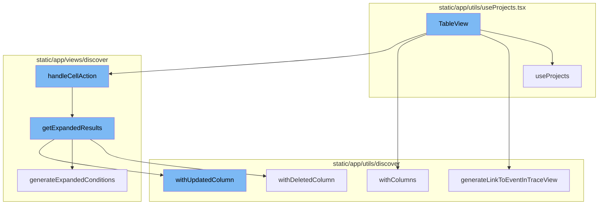
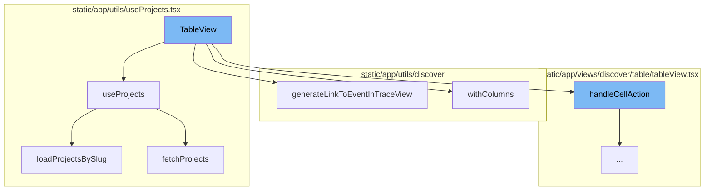
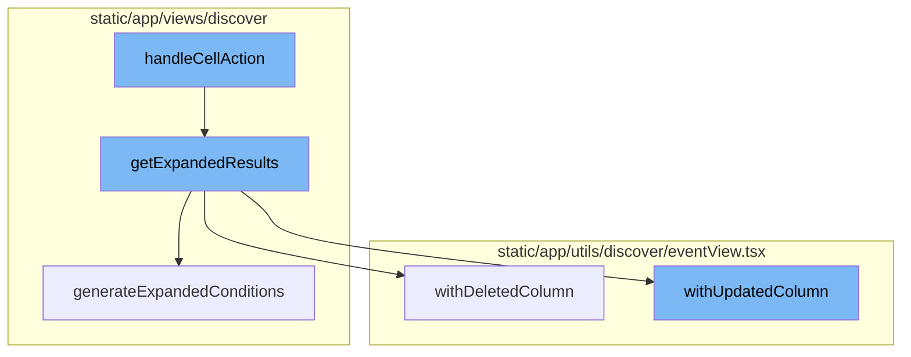

# TableView Overview

TableView is a component that displays data in a tabular format. It fetches and manipulates data using several hooks and helper functions, and handles user interactions such as column resizing, cell actions, and column updates.

# Fetching Projects

TableView uses the `useProjects` hook to fetch projects from the ProjectsStore. This hook provides a way to select specific project slugs, and search for more projects that may not be in the project store. It also handles loading and error states.

# Generating Links

The `generateLinkToEventInTraceView` function is used within TableView to generate a URL to the trace view or the event details view depending on the feature flag. It takes into account various parameters such as organization, location, spanId, projectSlug, timestamp, traceSlug, eventId, transactionName, eventView, and others.

# Updating Columns

TableView uses the `withColumns` method to create a new EventView with the specified columns. It handles the resizing of columns and updates the sort fields if sorted fields have been removed.

# Loading Projects by Slug

The `loadProjectsBySlug` function is used within the `useProjects` hook to load projects by their slugs. It fetches the projects from the API and updates the ProjectsStore and the state of the `useProjects` hook.

# Fetching Projects from API

The `fetchProjects` function is used within the `loadProjectsBySlug` function to fetch projects from the API. It takes into account various parameters such as slugs, search, limit, lastSearch, and cursor. It also handles pagination.

# Handling Cell Actions

The `handleCellAction` function is the entry point of the TableView flow. It handles different actions like 'RELEASE' and 'DRILLDOWN' based on the user's interaction with the table cells. In the case of 'DRILLDOWN', it calls the `getExpandedResults` function.

# Expanding Results

The `getExpandedResults` function is used to convert an aggregated query into one that does not have aggregates. It also applies additional conditions and generates conditions based on the `dataRow` parameter and the current fields in the `eventView`. It then updates the columns according to the expansion and calls the `withDeletedColumn` and `withUpdatedColumn` methods.

# Deleting Columns

The `withDeletedColumn` method is used to remove a column from the event view. It checks for conditions like the removal of the orphan column and out-of-bounds. If the deleted column is one of the sorted columns, it removes it from the list of sorts.

# Updating Columns

The `withUpdatedColumn` method is used to update a column in the event view. If the updated column is one of the sorted columns, it may need to be removed from the list of sorts.

# Generating Expanded Conditions

The `generateExpandedConditions` function is used to generate additional conditions for the expanded results. It removes any aggregates from the search conditions and adds additional conditions provided and generated.



# Flow drill down

First, we'll zoom into this section of the flow:



<SwmSnippet path="/static/app/views/discover/table/tableView.tsx" line="102">

---

# TableView Functionality

The `TableView` function is a component that displays data in a tabular format. It uses several hooks and helper functions to fetch, manipulate, and render the data. It also handles user interactions such as column resizing, cell actions, and column updates.

```tsx
function TableView(props: TableViewProps) {
  const {projects} = useProjects();
  const routes = useRoutes();
  const replayLinkGenerator = generateReplayLink(routes);

  /**
   * Updates a column on resizing
   */
  function _resizeColumn(
    columnIndex: number,
    nextColumn: TableColumn<keyof TableDataRow>
  ) {
    const {location, eventView} = props;

    const newWidth = nextColumn.width ? Number(nextColumn.width) : COL_WIDTH_UNDEFINED;
    const nextEventView = eventView.withResizedColumn(columnIndex, newWidth);

    pushEventViewToLocation({
      location,
      nextEventView,
      extraQuery: pickRelevantLocationQueryStrings(location),
```

---

</SwmSnippet>

<SwmSnippet path="/static/app/utils/useProjects.tsx" line="150">

---

# useProjects Hook

The `useProjects` hook is used within `TableView` to fetch projects from the ProjectsStore. It provides a way to select specific project slugs, and search for more projects that may not be in the project store. It also handles loading and error states.

```tsx
function useProjects({limit, slugs, orgId: propOrgId}: Options = {}) {
  const api = useApi();

  const organization = useOrganization({allowNull: true});
  const store = useLegacyStore(ProjectsStore);

  const orgId = propOrgId ?? organization?.slug ?? organization?.slug;

  const storeSlugs = new Set(store.projects.map(t => t.slug));
  const slugsToLoad = slugs?.filter(slug => !storeSlugs.has(slug)) ?? [];
  const shouldLoadSlugs = slugsToLoad.length > 0;

  const [state, setState] = useState<State>({
    initiallyLoaded: !store.loading && !shouldLoadSlugs,
    fetching: shouldLoadSlugs,
    hasMore: null,
    lastSearch: null,
    nextCursor: null,
    fetchError: null,
  });

```

---

</SwmSnippet>

<SwmSnippet path="/static/app/utils/discover/urls.tsx" line="43">

---

# generateLinkToEventInTraceView Function

The `generateLinkToEventInTraceView` function is used within `TableView` to generate a URL to the trace view or the event details view depending on the feature flag. It takes into account various parameters such as organization, location, spanId, projectSlug, timestamp, traceSlug, eventId, transactionName, eventView, and others.

```tsx
export function generateLinkToEventInTraceView({
  organization,
  isHomepage,
  location,
  spanId,
  projectSlug,
  timestamp,
  traceSlug,
  eventId,
  transactionName,
  eventView,
  demo,
  source,
  type = 'performance',
}: {
  eventId: string;
  location: Location;
  organization: Pick<Organization, 'slug' | 'features'>;
  projectSlug: string;
  timestamp: string | number;
  traceSlug: string;
```

---

</SwmSnippet>

<SwmSnippet path="/static/app/utils/discover/eventView.tsx" line="798">

---

# withColumns Method

The `withColumns` method is used within `TableView` to create a new EventView with the specified columns. It handles the resizing of columns and updates the sort fields if sorted fields have been removed.

```tsx
  withColumns(columns: Column[]): EventView {
    const newEventView = this.clone();
    const fields: Field[] = columns
      .filter(
        col =>
          ((col.kind === 'field' || col.kind === FieldValueKind.EQUATION) && col.field) ||
          (col.kind === 'function' && col.function[0])
      )
      .map(col => generateFieldAsString(col))
      .map((field, i) => {
        // newly added field
        if (!newEventView.fields[i]) {
          return {field, width: COL_WIDTH_UNDEFINED};
        }
        // Existing columns that were not re ordered should retain
        // their old widths.
        const existing = newEventView.fields[i];
        const width =
          existing.field === field && existing.width !== undefined
            ? existing.width
            : COL_WIDTH_UNDEFINED;
```

---

</SwmSnippet>

<SwmSnippet path="/static/app/utils/useProjects.tsx" line="188">

---

# loadProjectsBySlug Function

The `loadProjectsBySlug` function is used within `useProjects` hook to load projects by their slugs. It fetches the projects from the API and updates the ProjectsStore and the state of the `useProjects` hook.

```tsx
  async function loadProjectsBySlug() {
    if (orgId === undefined) {
      // eslint-disable-next-line no-console
      console.error('Cannot use useProjects({slugs}) without an organization in context');
      return;
    }

    setState(prev => ({...prev, fetching: true}));
    try {
      const {results, hasMore, nextCursor} = await fetchProjects(api, orgId, {
        slugs: slugsToLoad,
        limit,
      });

      const fetchedProjects = uniqBy([...store.projects, ...results], ({slug}) => slug);
      ProjectsStore.loadInitialData(fetchedProjects);

      setState(prev => ({
        ...prev,
        hasMore,
        fetching: false,
```

---

</SwmSnippet>

<SwmSnippet path="/static/app/utils/useProjects.tsx" line="90">

---

# fetchProjects Function

The `fetchProjects` function is used within `loadProjectsBySlug` function to fetch projects from the API. It takes into account various parameters such as slugs, search, limit, lastSearch, and cursor. It also handles pagination.

```tsx
async function fetchProjects(
  api: Client,
  orgId: string,
  {slugs, search, limit, lastSearch, cursor}: FetchProjectsOptions = {}
) {
  const query: {
    collapse: string[];
    all_projects?: number;
    cursor?: typeof cursor;
    per_page?: number;
    query?: string;
  } = {
    // Never return latestDeploys project property from api
    collapse: ['latestDeploys', 'unusedFeatures'],
  };

  if (slugs !== undefined && slugs.length > 0) {
    query.query = slugs.map(slug => `slug:${slug}`).join(' ');
  }

  if (search) {
```

---

</SwmSnippet>

Now, lets zoom into this section of the flow:



<SwmSnippet path="/static/app/views/discover/table/tableView.tsx" line="526">

---

# TableView Flow

The `handleCellAction` function is the entry point of the TableView flow. It handles different actions like 'RELEASE' and 'DRILLDOWN' based on the user's interaction with the table cells. In the case of 'DRILLDOWN', it calls the `getExpandedResults` function.

```tsx
  function handleCellAction(
    dataRow: TableDataRow,
    column: TableColumn<keyof TableDataRow>
  ) {
    return (action: Actions, value: React.ReactText) => {
      const {eventView, organization, location, tableData, isHomepage} = props;

      const query = new MutableSearch(eventView.query);

      let nextView = eventView.clone();
      trackAnalytics('discover_v2.results.cellaction', {
        organization,
        action,
      });

      switch (action) {
        case Actions.RELEASE: {
          const maybeProject = projects.find(project => {
            return project.slug === dataRow.project;
          });

```

---

</SwmSnippet>

<SwmSnippet path="/static/app/views/discover/utils.tsx" line="256">

---

## Expanding Results

The `getExpandedResults` function is used to convert an aggregated query into one that does not have aggregates. It also applies additional conditions and generates conditions based on the `dataRow` parameter and the current fields in the `eventView`. It then updates the columns according to the expansion and calls the `withDeletedColumn` and `withUpdatedColumn` methods.

```tsx
/**
 * Convert an aggregated query into one that does not have aggregates.
 * Will also apply additions conditions defined in `additionalConditions`
 * and generate conditions based on the `dataRow` parameter and the current fields
 * in the `eventView`.
 */
export function getExpandedResults(
  eventView: EventView,
  additionalConditions: Record<string, string>,
  dataRow?: TableDataRow | Event
): EventView {
  const fieldSet = new Set();
  // Expand any functions in the resulting column, and dedupe the result.
  // Mark any column as null to remove it.
  const expandedColumns: (Column | null)[] = eventView.fields.map((field: Field) => {
    const exploded = explodeFieldString(field.field, field.alias);
    const column = exploded.kind === 'function' ? drilldownAggregate(exploded) : exploded;

    if (
      // if expanding the function failed
      column === null ||
```

---

</SwmSnippet>

<SwmSnippet path="/static/app/utils/discover/eventView.tsx" line="971">

---

### Deleting Columns

The `withDeletedColumn` method is used to remove a column from the event view. It checks for conditions like the removal of the orphan column and out-of-bounds. If the deleted column is one of the sorted columns, it removes it from the list of sorts.

```tsx
  withDeletedColumn(columnIndex: number, tableMeta: MetaType | undefined): EventView {
    // Disallow removal of the orphan column, and check for out-of-bounds
    if (this.fields.length <= 1 || this.fields.length <= columnIndex || columnIndex < 0) {
      return this;
    }

    // ensure tableMeta is non-empty
    tableMeta = validateTableMeta(tableMeta);

    // delete the column
    const newEventView = this.clone();
    const fields = [...newEventView.fields];
    fields.splice(columnIndex, 1);
    newEventView.fields = fields;

    // Ensure there is at least one auto width column
    // To ensure a well formed table results.
    const hasAutoIndex = fields.find(field => field.width === COL_WIDTH_UNDEFINED);
    if (!hasAutoIndex) {
      newEventView.fields[0].width = COL_WIDTH_UNDEFINED;
    }
```

---

</SwmSnippet>

<SwmSnippet path="/static/app/utils/discover/eventView.tsx" line="877">

---

### Updating Columns

The `withUpdatedColumn` method is used to update a column in the event view. If the updated column is one of the sorted columns, it may need to be removed from the list of sorts.

```tsx
  withUpdatedColumn(
    columnIndex: number,
    updatedColumn: Column,
    tableMeta: MetaType | undefined
  ): EventView {
    const columnToBeUpdated = this.fields[columnIndex];
    const fieldAsString = generateFieldAsString(updatedColumn);

    const updateField = columnToBeUpdated.field !== fieldAsString;
    if (!updateField) {
      return this;
    }

    // ensure tableMeta is non-empty
    tableMeta = validateTableMeta(tableMeta);

    const newEventView = this.clone();

    const updatedField: Field = {
      field: fieldAsString,
      width: COL_WIDTH_UNDEFINED,
```

---

</SwmSnippet>

<SwmSnippet path="/static/app/views/discover/utils.tsx" line="423">

---

## Generating Expanded Conditions

The `generateExpandedConditions` function is used to generate additional conditions for the expanded results. It removes any aggregates from the search conditions and adds additional conditions provided and generated.

```tsx
function generateExpandedConditions(
  eventView: EventView,
  additionalConditions: Record<string, string>,
  dataRow?: TableDataRow | Event
): string {
  const parsedQuery = new MutableSearch(eventView.query);

  // Remove any aggregates from the search conditions.
  // otherwise, it'll lead to an invalid query result.
  for (const key in parsedQuery.filters) {
    const column = explodeFieldString(key);
    if (column.kind === 'function') {
      parsedQuery.removeFilter(key);
    }
  }

  const conditions: Record<string, string | string[]> = Object.assign(
    {},
    additionalConditions,
    generateAdditionalConditions(eventView, dataRow)
  );
```

---

</SwmSnippet>

&nbsp;

*This is an auto-generated document by Swimm AI 🌊 and has not yet been verified by a human*

<SwmMeta version="3.0.0" repo-id="Z2l0aHViJTNBJTNBc2VudHJ5LWRlbW8lM0ElM0FTd2ltbS1EZW1v" repo-name="sentry-demo" doc-type="flows"><sup>Powered by [Swimm](/)</sup></SwmMeta>
