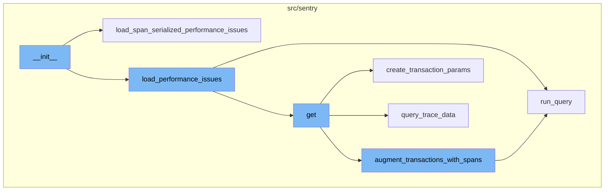
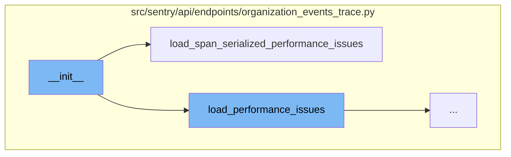
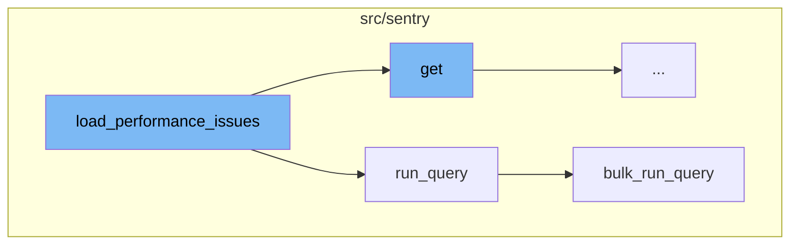
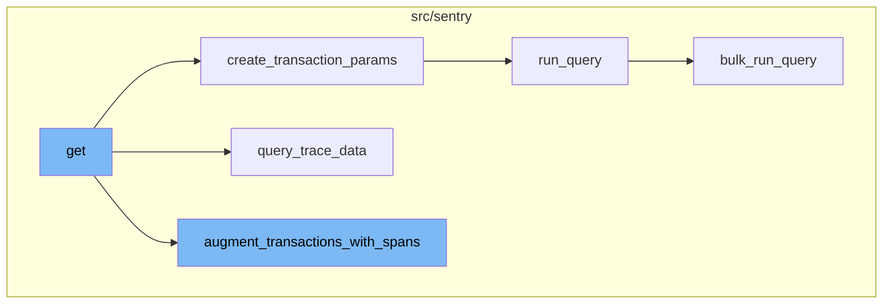

# `__init__` Method

`__init__` is a special method in Python classes. It is the constructor method that's automatically called when an object of a class is instantiated. In this context, it's the starting point of the flow.

<SwmSnippet path="/src/sentry/api/endpoints/organization_events_trace.py" line="188">

---

## `__init__` Function

The `__init__` function is a constructor method in Python. In this case, it's used to initialize an instance of a class with specific attributes such as `event`, `errors`, `children`, `performance_issues`, and others. It also checks if there are any issues associated with the event and based on the `span_serialized` flag, it decides which method to call to load performance issues.

```python
    def __init__(
        self,
        event: SnubaTransaction,
        parent: str | None,
        generation: int | None,
        light: bool = False,
        snuba_params: SnubaParams | None = None,
        span_serialized: bool = False,
    ) -> None:
        self.event: SnubaTransaction = event
        self.errors: list[TraceError] = []
        self.children: list[TraceEvent] = []
        self.performance_issues: list[TracePerformanceIssue] = []

        # Can be None on the light trace when we don't know the parent
        self.parent_event_id: str | None = parent
        self.generation: int | None = generation

        # Added as required because getting the nodestore_event is expensive
        self._nodestore_event: Event | None = None
        self.fetched_nodestore: bool = span_serialized
```

---

</SwmSnippet>

<SwmSnippet path="/src/sentry/api/endpoints/organization_events_trace.py" line="226">

---

## `load_span_serialized_performance_issues` Function

The `load_span_serialized_performance_issues` function is called from the `__init__` function if the `span_serialized` flag is set to True. This function processes the event spans and for each span, it checks if there are any associated issues. If there are, it retrieves the group details for the issue and adds the performance issue details to the `performance_issues` list of the instance.

```python
    def load_span_serialized_performance_issues(self, light: bool) -> None:
        """Rewriting load_performance_issues from scratch so the logic is more independent"""
        memoized_groups = {}
        for event_span in self.event["occurrence_spans"]:
            unique_spans: set[str] = set()
            start: float | None = None
            end: float | None = None
            suspect_spans: list[str] = []
            problem = event_span["problem"]
            offender_span_ids = problem.evidence_data.get("offender_span_ids", [])
            for group_id in self.event["occurrence_to_issue_id"][problem.id]:
                if group_id not in memoized_groups:
                    memoized_groups[group_id] = Group.objects.filter(
                        id=group_id, project=self.event["project.id"]
                    ).first()
                group = memoized_groups[group_id]
                if event_span.get("span_id") in offender_span_ids:
                    start_timestamp = float(event_span["precise.start_ts"])
                    if start is None:
                        start = start_timestamp
                    else:
```

---

</SwmSnippet>

<SwmSnippet path="/src/sentry/api/endpoints/organization_events_trace.py" line="284">

---

## `load_performance_issues` Function

The `load_performance_issues` function is the first step in the flow after **init**. It's responsible for loading performance issues. It takes two parameters: `light` and `snuba_params`. Depending on the `light` parameter, it either gets a simple span or fetches more detailed information about the issue occurrences and their spans. The function then appends the performance issues to the `self.performance_issues` list.

```python
    def load_performance_issues(self, light: bool, snuba_params: SnubaParams | None) -> None:
        """Doesn't get suspect spans, since we don't need that for the light view"""
        for group_id in self.event["issue.ids"]:
            group = Group.objects.filter(id=group_id, project=self.event["project.id"]).first()
            if group is None:
                continue

            suspect_spans: list[str] = []
            unique_spans: set[str] = set()
            start: float | None = None
            end: float | None = None
            if light:
                # This value doesn't matter for the light view
                span = [self.event["trace.span"]]
            else:
                if self.nodestore_event is not None:
                    occurrence_query = DiscoverQueryBuilder(
                        Dataset.IssuePlatform,
                        # Params is ignored if snuba_params is passed
                        params={},
                        snuba_params=snuba_params,
```

---

</SwmSnippet>

<SwmSnippet path="/src/sentry/snuba/metrics_layer/query.py" line="143">

---

## `run_query` Function

The `run_query` function is called next in the flow. It's an entry point for executing a metrics query in Snuba. It simply calls the `bulk_run_query` function with the request as a single-item list and returns the first (and only) result.

```python
def run_query(request: Request) -> Mapping[str, Any]:
    """
    Entrypoint for executing a metrics query in Snuba.
    """
    return bulk_run_query([request])[0]
```

---

</SwmSnippet>

<SwmSnippet path="/src/sentry/snuba/metrics_layer/query.py" line="81">

---

## `bulk_run_query` Function

The `bulk_run_query` function is the final step in the flow. It's an entry point for executing a list of metrics queries in Snuba. It prepares the queries, executes them using the `bulk_snuba_queries` function, processes the results, and returns them. If an error occurs during the query execution, it increments a `query_error` metric and raises the exception.

```python
def bulk_run_query(requests: list[Request]) -> list[Mapping[str, Any]]:
    """
    Entrypoint for executing a list of metrics queries in Snuba.

    This function is used to execute multiple metrics queries in a single request.
    """
    if not requests:
        return []

    queries = []
    for request in requests:
        request, start, end = _setup_metrics_query(request)
        queries.append([request, start, end])

    logging_tags = {"referrer": request.tenant_ids["referrer"] or "unknown", "lang": "mql"}

    for q in queries:
        q[0], reverse_mappings, mappings = _resolve_metrics_query(q[0], logging_tags)
        q.extend([reverse_mappings, mappings])

    try:
```

---

</SwmSnippet>

<SwmSnippet path="/src/sentry/api/endpoints/organization_events_trace.py" line="1029">

---

## `get` Function

The `get` function is the first step in the flow after `__init__`. It receives a request, an organization, and a trace_id as parameters. It checks if the feature is enabled for the organization, retrieves the necessary data, and then creates transaction parameters. It also handles errors and exceptions.

```python
    def get(self, request: Request, organization: Organization, trace_id: str) -> HttpResponse:
        if not self.has_feature(organization, request):
            return Response(status=404)

        try:
            # The trace view isn't useful without global views, so skipping the check here
            snuba_params, _ = self.get_snuba_dataclass(
                request, organization, check_global_views=False
            )
        except NoProjects:
            return Response(status=404)

        # Detailed is deprecated now that we want to use spans instead
        detailed = request.GET.get("detailed", "0") == "1"
        # Temporary url params until we finish migrating the frontend
        use_spans = request.GET.get("useSpans", "0") == "1"
        update_snuba_params_with_timestamp(request, snuba_params)

        sentry_sdk.set_tag("trace_view.using_spans", str(use_spans))
        if detailed and use_spans:
            raise ParseError("Cannot return a detailed response while using spans")
```

---

</SwmSnippet>

<SwmSnippet path="/src/sentry/api/endpoints/organization_events_trace.py" line="520">

---

## `create_transaction_params` Function

The `create_transaction_params` function is called within the `get` function. It takes a trace_id and snuba_params as arguments and returns a modified version of the snuba_params. It queries the DiscoverQueryBuilder to get the minimum and maximum timestamps and the project id for the given trace_id.

```python
def create_transaction_params(
    trace_id: str,
    snuba_params: SnubaParams,
) -> SnubaParams:
    """Can't use the transaction params for errors since traces can be errors only"""
    query_metadata = options.get("performance.traces.query_timestamp_projects")
    sentry_sdk.set_tag("trace_view.queried_timestamp_projects", query_metadata)
    if not query_metadata:
        return snuba_params

    metadata_query = DiscoverQueryBuilder(
        Dataset.Discover,
        params={},
        snuba_params=snuba_params,
        query=f"trace:{trace_id}",
        selected_columns=[
            "min(timestamp)",
            "max(timestamp)",
            "project.id",
        ],
    )
```

---

</SwmSnippet>

<SwmSnippet path="/src/sentry/api/endpoints/organization_events_trace.py" line="579">

---

## `query_trace_data` Function

The `query_trace_data` function is called next in the flow. It queries the DiscoverQueryBuilder to get transaction and error data for the given trace_id. It also processes the results to join group IDs from the occurrence dataset to transactions data.

```python
def query_trace_data(
    trace_id: str,
    snuba_params: SnubaParams,
    transaction_params: SnubaParams,
    limit: int,
    event_id: str | None,
    use_spans: bool,
) -> tuple[Sequence[SnubaTransaction], Sequence[SnubaError]]:
    transaction_columns = [
        "id",
        "transaction.status",
        "transaction.op",
        "transaction.duration",
        "transaction",
        "timestamp",
        "precise.start_ts",
        "precise.finish_ts",
        "project",
        "project.id",
        "profile.id",
        "profile.profiler_id",
```

---

</SwmSnippet>

<SwmSnippet path="/src/sentry/api/endpoints/organization_events_trace.py" line="772">

---

## `augment_transactions_with_spans` Function

The `augment_transactions_with_spans` function is the final step in the flow. It takes the transactions, errors, trace_id, and params as arguments. It augments the transactions with parent, error, and problem data. It also links transactions, performance issues, and errors.

```python
def augment_transactions_with_spans(
    transactions: Sequence[SnubaTransaction],
    errors: Sequence[SnubaError],
    trace_id: str,
    params: SnubaParams,
) -> Sequence[SnubaTransaction]:
    """Augment the list of transactions with parent, error and problem data"""
    with sentry_sdk.start_span(op="augment.transactions", description="setup"):
        trace_parent_spans = set()  # parent span ids of segment spans
        transaction_problem_map: dict[str, SnubaTransaction] = {}
        problem_project_map: dict[int, list[str]] = {}
        issue_occurrences = []
        occurrence_spans: set[str] = set()
        error_spans = set()
        projects = set()
        for error in errors:
            if "trace.span" in error:
                error["trace.span"] = pad_span_id(error["trace.span"])
                error_spans.add(error["trace.span"])
            projects.add(error["project.id"])
        ts_params = find_timestamp_params(transactions)
```

---

</SwmSnippet>



# Flow drill down

First, we'll zoom into this section of the flow:



<SwmSnippet path="/src/sentry/api/endpoints/organization_events_trace.py" line="188">

---

# **init** function

The `__init__` function is a constructor method in Python. In this case, it's used to initialize an instance of a class with specific attributes such as `event`, `errors`, `children`, `performance_issues`, and others. It also checks if there are any issues associated with the event and based on the `span_serialized` flag, it decides which method to call to load performance issues.

```python
    def __init__(
        self,
        event: SnubaTransaction,
        parent: str | None,
        generation: int | None,
        light: bool = False,
        snuba_params: SnubaParams | None = None,
        span_serialized: bool = False,
    ) -> None:
        self.event: SnubaTransaction = event
        self.errors: list[TraceError] = []
        self.children: list[TraceEvent] = []
        self.performance_issues: list[TracePerformanceIssue] = []

        # Can be None on the light trace when we don't know the parent
        self.parent_event_id: str | None = parent
        self.generation: int | None = generation

        # Added as required because getting the nodestore_event is expensive
        self._nodestore_event: Event | None = None
        self.fetched_nodestore: bool = span_serialized
```

---

</SwmSnippet>

<SwmSnippet path="/src/sentry/api/endpoints/organization_events_trace.py" line="226">

---

# load_span_serialized_performance_issues function

The `load_span_serialized_performance_issues` function is called from the `__init__` function if the `span_serialized` flag is set to True. This function processes the event spans and for each span, it checks if there are any associated issues. If there are, it retrieves the group details for the issue and adds the performance issue details to the `performance_issues` list of the instance.

```python
    def load_span_serialized_performance_issues(self, light: bool) -> None:
        """Rewriting load_performance_issues from scratch so the logic is more independent"""
        memoized_groups = {}
        for event_span in self.event["occurrence_spans"]:
            unique_spans: set[str] = set()
            start: float | None = None
            end: float | None = None
            suspect_spans: list[str] = []
            problem = event_span["problem"]
            offender_span_ids = problem.evidence_data.get("offender_span_ids", [])
            for group_id in self.event["occurrence_to_issue_id"][problem.id]:
                if group_id not in memoized_groups:
                    memoized_groups[group_id] = Group.objects.filter(
                        id=group_id, project=self.event["project.id"]
                    ).first()
                group = memoized_groups[group_id]
                if event_span.get("span_id") in offender_span_ids:
                    start_timestamp = float(event_span["precise.start_ts"])
                    if start is None:
                        start = start_timestamp
                    else:
```

---

</SwmSnippet>

Now, lets zoom into this section of the flow:



# **init** Flow

**init** is a special method in Python classes. It is the constructor method that's automatically called when an object of a class is instantiated. In this context, it's the starting point of the flow.

<SwmSnippet path="/src/sentry/api/endpoints/organization_events_trace.py" line="284">

---

## load_performance_issues Function

The `load_performance_issues` function is the first step in the flow after **init**. It's responsible for loading performance issues. It takes two parameters: `light` and `snuba_params`. Depending on the `light` parameter, it either gets a simple span or fetches more detailed information about the issue occurrences and their spans. The function then appends the performance issues to the `self.performance_issues` list.

```python
    def load_performance_issues(self, light: bool, snuba_params: SnubaParams | None) -> None:
        """Doesn't get suspect spans, since we don't need that for the light view"""
        for group_id in self.event["issue.ids"]:
            group = Group.objects.filter(id=group_id, project=self.event["project.id"]).first()
            if group is None:
                continue

            suspect_spans: list[str] = []
            unique_spans: set[str] = set()
            start: float | None = None
            end: float | None = None
            if light:
                # This value doesn't matter for the light view
                span = [self.event["trace.span"]]
            else:
                if self.nodestore_event is not None:
                    occurrence_query = DiscoverQueryBuilder(
                        Dataset.IssuePlatform,
                        # Params is ignored if snuba_params is passed
                        params={},
                        snuba_params=snuba_params,
```

---

</SwmSnippet>

<SwmSnippet path="/src/sentry/snuba/metrics_layer/query.py" line="143">

---

## run_query Function

The `run_query` function is called next in the flow. It's an entry point for executing a metrics query in Snuba. It simply calls the `bulk_run_query` function with the request as a single-item list and returns the first (and only) result.

```python
def run_query(request: Request) -> Mapping[str, Any]:
    """
    Entrypoint for executing a metrics query in Snuba.
    """
    return bulk_run_query([request])[0]
```

---

</SwmSnippet>

<SwmSnippet path="/src/sentry/snuba/metrics_layer/query.py" line="81">

---

## bulk_run_query Function

The `bulk_run_query` function is the final step in the flow. It's an entry point for executing a list of metrics queries in Snuba. It prepares the queries, executes them using the `bulk_snuba_queries` function, processes the results, and returns them. If an error occurs during the query execution, it increments a `query_error` metric and raises the exception.

```python
def bulk_run_query(requests: list[Request]) -> list[Mapping[str, Any]]:
    """
    Entrypoint for executing a list of metrics queries in Snuba.

    This function is used to execute multiple metrics queries in a single request.
    """
    if not requests:
        return []

    queries = []
    for request in requests:
        request, start, end = _setup_metrics_query(request)
        queries.append([request, start, end])

    logging_tags = {"referrer": request.tenant_ids["referrer"] or "unknown", "lang": "mql"}

    for q in queries:
        q[0], reverse_mappings, mappings = _resolve_metrics_query(q[0], logging_tags)
        q.extend([reverse_mappings, mappings])

    try:
```

---

</SwmSnippet>

Now, lets zoom into this section of the flow:



# `__init__` Flow

`__init__` is a special method in Python classes. It is the constructor method that Python calls when it creates a new instance of a class. In the context of this flow, `__init__` is the starting point of the process.

<SwmSnippet path="/src/sentry/api/endpoints/organization_events_trace.py" line="1029">

---

# `get` Function

The `get` function is the first step in the flow after `__init__`. It receives a request, an organization, and a trace_id as parameters. It checks if the feature is enabled for the organization, retrieves the necessary data, and then creates transaction parameters. It also handles errors and exceptions.

```python
    def get(self, request: Request, organization: Organization, trace_id: str) -> HttpResponse:
        if not self.has_feature(organization, request):
            return Response(status=404)

        try:
            # The trace view isn't useful without global views, so skipping the check here
            snuba_params, _ = self.get_snuba_dataclass(
                request, organization, check_global_views=False
            )
        except NoProjects:
            return Response(status=404)

        # Detailed is deprecated now that we want to use spans instead
        detailed = request.GET.get("detailed", "0") == "1"
        # Temporary url params until we finish migrating the frontend
        use_spans = request.GET.get("useSpans", "0") == "1"
        update_snuba_params_with_timestamp(request, snuba_params)

        sentry_sdk.set_tag("trace_view.using_spans", str(use_spans))
        if detailed and use_spans:
            raise ParseError("Cannot return a detailed response while using spans")
```

---

</SwmSnippet>

<SwmSnippet path="/src/sentry/api/endpoints/organization_events_trace.py" line="520">

---

# `create_transaction_params` Function

The `create_transaction_params` function is called within the `get` function. It takes a trace_id and snuba_params as arguments and returns a modified version of the snuba_params. It queries the DiscoverQueryBuilder to get the minimum and maximum timestamps and the project id for the given trace_id.

```python
def create_transaction_params(
    trace_id: str,
    snuba_params: SnubaParams,
) -> SnubaParams:
    """Can't use the transaction params for errors since traces can be errors only"""
    query_metadata = options.get("performance.traces.query_timestamp_projects")
    sentry_sdk.set_tag("trace_view.queried_timestamp_projects", query_metadata)
    if not query_metadata:
        return snuba_params

    metadata_query = DiscoverQueryBuilder(
        Dataset.Discover,
        params={},
        snuba_params=snuba_params,
        query=f"trace:{trace_id}",
        selected_columns=[
            "min(timestamp)",
            "max(timestamp)",
            "project.id",
        ],
    )
```

---

</SwmSnippet>

<SwmSnippet path="/src/sentry/api/endpoints/organization_events_trace.py" line="579">

---

# `query_trace_data` Function

The `query_trace_data` function is called next in the flow. It queries the DiscoverQueryBuilder to get transaction and error data for the given trace_id. It also processes the results to join group IDs from the occurrence dataset to transactions data.

```python
def query_trace_data(
    trace_id: str,
    snuba_params: SnubaParams,
    transaction_params: SnubaParams,
    limit: int,
    event_id: str | None,
    use_spans: bool,
) -> tuple[Sequence[SnubaTransaction], Sequence[SnubaError]]:
    transaction_columns = [
        "id",
        "transaction.status",
        "transaction.op",
        "transaction.duration",
        "transaction",
        "timestamp",
        "precise.start_ts",
        "precise.finish_ts",
        "project",
        "project.id",
        "profile.id",
        "profile.profiler_id",
```

---

</SwmSnippet>

<SwmSnippet path="/src/sentry/api/endpoints/organization_events_trace.py" line="772">

---

# `augment_transactions_with_spans` Function

The `augment_transactions_with_spans` function is the final step in the flow. It takes the transactions, errors, trace_id, and params as arguments. It augments the transactions with parent, error, and problem data. It also links transactions, performance issues, and errors.

```python
def augment_transactions_with_spans(
    transactions: Sequence[SnubaTransaction],
    errors: Sequence[SnubaError],
    trace_id: str,
    params: SnubaParams,
) -> Sequence[SnubaTransaction]:
    """Augment the list of transactions with parent, error and problem data"""
    with sentry_sdk.start_span(op="augment.transactions", description="setup"):
        trace_parent_spans = set()  # parent span ids of segment spans
        transaction_problem_map: dict[str, SnubaTransaction] = {}
        problem_project_map: dict[int, list[str]] = {}
        issue_occurrences = []
        occurrence_spans: set[str] = set()
        error_spans = set()
        projects = set()
        for error in errors:
            if "trace.span" in error:
                error["trace.span"] = pad_span_id(error["trace.span"])
                error_spans.add(error["trace.span"])
            projects.add(error["project.id"])
        ts_params = find_timestamp_params(transactions)
```

---

</SwmSnippet>

&nbsp;

*This is an auto-generated document by Swimm AI 🌊 and has not yet been verified by a human*

<SwmMeta version="3.0.0" repo-id="Z2l0aHViJTNBJTNBc2VudHJ5LWRlbW8lM0ElM0FTd2ltbS1EZW1v" repo-name="sentry-demo" doc-type="flows"><sup>Powered by [Swimm](/)</sup></SwmMeta>
