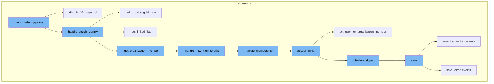
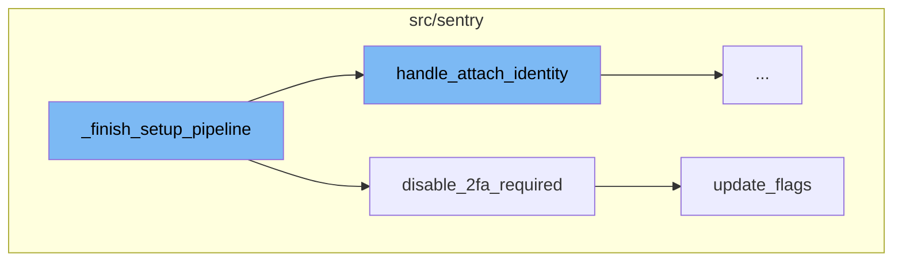
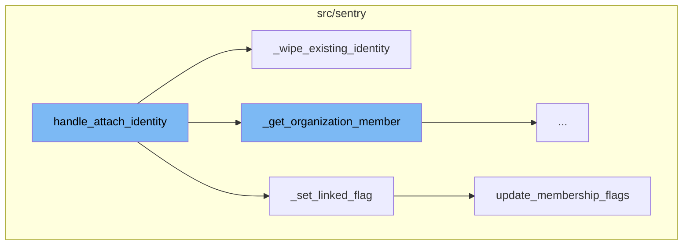
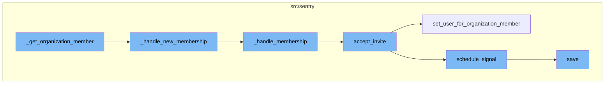

# Overview of \_finish_setup_pipeline

The `_finish_setup_pipeline` function is a crucial part of the Single Sign-On (SSO) setup process in Sentry. It is responsible for configuring SSO for an organization by creating an authentication provider and linking an OrgMember identity to the active user. The function also handles error scenarios such as user not being authenticated or user ID mismatches.

# Disabling 2FA Requirement

Within the `_finish_setup_pipeline` function, the `disable_2fa_required` function is called. This function checks if 2FA is required for the organization and if so, it disables it. This is because only SSO or 2FA can be enabled, not both. An audit entry is created to log this change.

# Attaching Identity

The function `handle_attach_identity` is the starting point of the flow. It is responsible for attaching or re-attaching an identity to an already authenticated user. If the user has an existing identity, it is wiped out and a new identifier is used. If the user is a member of an organization, the function sets a linked flag for the member.

# Handling New Membership

The `_handle_new_membership` function handles the creation of a new membership. It calls the `_handle_membership` function and records an audit log for the new member addition.

# Accepting Invite

The `accept_invite` function accepts an existing invite for the user for the organization. If SSO is required, it checks for a valid AuthIdentity. It then sets the user for the organization member and schedules a signal.

# Saving the Event

The `save` function saves the event into the eventstream after normalizing and processing it. It also saves adjacent models such as releases and environments to postgres.



# Flow drill down

First, we'll zoom into this section of the flow:



<SwmSnippet path="/src/sentry/auth/helper.py" line="856">

---

# \_finish_setup_pipeline Function

The `_finish_setup_pipeline` function is responsible for configuring SSO for an organization. It does this by creating an auth provider and an OrgMember identity linked to the active user. If the user is not authenticated or there is a user ID mismatch, the function will return an error. The function also fetches the state and builds the provider configuration.

```python
    def _finish_setup_pipeline(self, identity: Mapping[str, Any]) -> HttpResponseRedirect:
        """
        the setup flow here is configuring SSO for an organization.
        It does that by creating the auth provider as well as an OrgMember identity linked to the active user
        """
        request = self.request
        if not request.user.is_authenticated:
            return self.error(ERR_NOT_AUTHED)

        if request.user.id != self.state.uid:
            return self.error(ERR_UID_MISMATCH)

        data = self.fetch_state()
        config = self.provider.build_config(state=data)

        om = organization_service.check_membership_by_id(
            organization_id=self.organization.id, user_id=request.user.id
        )
        if om is None:
            return self.error(ERR_UID_MISMATCH)

```

---

</SwmSnippet>

<SwmSnippet path="/src/sentry/auth/helper.py" line="967">

---

## Disabling 2FA Requirement

The `disable_2fa_required` function is called within `_finish_setup_pipeline`. This function checks if 2FA is required for the organization and if so, it disables it. This is because only SSO or 2FA can be enabled, not both. An audit entry is created to log this change.

```python
    def disable_2fa_required(self) -> None:
        require_2fa = self.organization.flags.require_2fa

        if not require_2fa:
            return

        organization_service.update_flags(
            organization_id=self.organization.id,
            flags=RpcOrganizationFlagsUpdate(require_2fa=False),
        )

        logger.info(
            "Require 2fa disabled during sso setup", extra={"organization_id": self.organization.id}
        )
        create_audit_entry(
            request=self.request,
            organization=self.organization,
            target_object=self.organization.id,
            event=audit_log.get_event_id("ORG_EDIT"),
            data={"require_2fa": "to False when enabling SSO"},
        )
```

---

</SwmSnippet>

<SwmSnippet path="/src/sentry/organizations/services/organization/impl.py" line="341">

---

## Updating Organization Flags

The `update_flags` function is called within `disable_2fa_required` to update the organization's flags. This function takes in the organization ID and the flags to be updated. It then updates the flags in the database.

```python
    def update_flags(self, *, organization_id: int, flags: RpcOrganizationFlagsUpdate) -> None:
        updates: F | CombinedExpression = models.F("flags")
        for name, value in flags.items():
            if value is True:
                updates = updates.bitor(getattr(Organization.flags, name))
            elif value is False:
                updates = updates.bitand(~getattr(Organization.flags, name))
            else:
                raise TypeError(f"Invalid value received for update_flags: {name}={value!r}")

        with outbox_context(transaction.atomic(router.db_for_write(Organization))):
            Organization.objects.filter(id=organization_id).update(flags=updates)
            Organization(id=organization_id).outbox_for_update().save()
```

---

</SwmSnippet>

Now, lets zoom into this section of the flow:



<SwmSnippet path="/src/sentry/auth/helper.py" line="311">

---

# \_finish_setup_pipeline Flow

The function `handle_attach_identity` is the starting point of the flow. It is responsible for attaching or re-attaching an identity to an already authenticated user. If the user has an existing identity, it is wiped out and a new identifier is used. If the user is a member of an organization, the function sets a linked flag for the member.

```python
    def handle_attach_identity(self, member: RpcOrganizationMember | None = None) -> AuthIdentity:
        """
        Given an already authenticated user, attach or re-attach an identity.
        """
        # prioritize identifying by the SSO provider's user ID
        with transaction.atomic(router.db_for_write(AuthIdentity)):
            auth_identity = self._get_auth_identity(ident=self.identity["id"])
            if auth_identity is None:
                # otherwise look for an already attached identity
                # this can happen if the SSO provider's internal ID changes
                auth_identity = self._get_auth_identity(user_id=self.user.id)

            if auth_identity is None:
                auth_is_new = True
                auth_identity = AuthIdentity.objects.create(
                    auth_provider=self.auth_provider,
                    user_id=self.user.id,
                    ident=self.identity["id"],
                    data=self.identity.get("data", {}),
                )
            else:
```

---

</SwmSnippet>

<SwmSnippet path="/src/sentry/auth/helper.py" line="390">

---

The function `_wipe_existing_identity` is called within `handle_attach_identity`. It deletes any existing identity of the user for the same auth provider, allowing a new identifier to be used.

```python
    def _wipe_existing_identity(self, auth_identity: AuthIdentity) -> Any:
        # it's possible the user has an existing identity, let's wipe it out
        # so that the new identifier gets used (other we'll hit a constraint)
        # violation since one might exist for (provider, user) as well as
        # (provider, ident)
        with outbox_context(transaction.atomic(router.db_for_write(AuthIdentity))):
            deletion_result = (
                AuthIdentity.objects.exclude(id=auth_identity.id)
                .filter(auth_provider=self.auth_provider, user_id=self.user.id)
                .delete()
            )

            for outbox in self.auth_provider.outboxes_for_mark_invalid_sso(auth_identity.user_id):
                outbox.save()

        return deletion_result
```

---

</SwmSnippet>

<SwmSnippet path="/src/sentry/auth/helper.py" line="175">

---

The function `_set_linked_flag` is also called within `handle_attach_identity`. It sets the `sso__linked` flag to True for the member, indicating that the member is linked to an SSO provider. If the member was previously marked as invalid, the `sso__invalid` flag is set to False.

```python
    def _set_linked_flag(member: RpcOrganizationMember) -> None:
        if member.flags.sso__invalid or not member.flags.sso__linked:
            member.flags.sso__invalid = False
            member.flags.sso__linked = True

            organization_service.update_membership_flags(organization_member=member)
```

---

</SwmSnippet>

<SwmSnippet path="/src/sentry/organizations/services/organization/impl.py" line="472">

---

The function `update_membership_flags` is called within `_set_linked_flag`. It updates the membership flags in the database for the given organization member.

```python
        # It might be nice to return an RpcTeamMember to represent what we just
        # created, but doing so would require a list of project IDs. We can implement
        # that if a return value is needed in the future.

    def update_membership_flags(self, *, organization_member: RpcOrganizationMember) -> None:
        model = OrganizationMember.objects.get(id=organization_member.id)
        model.flags = self._deserialize_member_flags(organization_member.flags)
        model.save()
```

---

</SwmSnippet>

Now, lets zoom into this section of the flow:



<SwmSnippet path="/src/sentry/auth/helper.py" line="407">

---

## \_get_organization_member

The `_get_organization_member` function checks if the user has an associated member. If not, it creates a new membership based on the `auth_identity` email.

```python
    def _get_organization_member(self, auth_identity: AuthIdentity) -> RpcOrganizationMember:
        """
        Check to see if the user has a member associated, if not, create a new membership
        based on the auth_identity email.
        """
        member = organization_service.check_membership_by_id(
            organization_id=self.organization.id, user_id=self.user.id
        )
        if member is None:
            return self._handle_new_membership(auth_identity)
        return member
```

---

</SwmSnippet>

<SwmSnippet path="/src/sentry/auth/helper.py" line="282">

---

## \_handle_new_membership

The `_handle_new_membership` function handles the creation of a new membership. It calls the `_handle_membership` function and records an audit log for the new member addition.

```python
    def _handle_new_membership(self, auth_identity: AuthIdentity) -> RpcOrganizationMember:
        user, om = self._handle_membership(
            request=self.request,
            organization=self.organization,
            auth_identity=auth_identity,
        )

        log_service.record_audit_log(
            event=AuditLogEvent(
                organization_id=self.organization.id,
                date_added=timezone.now(),
                event_id=audit_log.get_event_id("MEMBER_ADD"),
                actor_user_id=user.id,
                actor_label=user.username,
                ip_address=self.request.META["REMOTE_ADDR"],
                target_object_id=om.id,
                data=om.get_audit_log_metadata(user.email),
                target_user_id=user.id,
            )
        )

```

---

</SwmSnippet>

<SwmSnippet path="/src/sentry/auth/helper.py" line="238">

---

## \_handle_membership

The `_handle_membership` function checks if the user is currently pending invite acceptance or if an existing invite exists for the email provided by the identity provider. If an invite can be accepted, it does so. Otherwise, it handles new membership creation.

```python
    def _handle_membership(
        self,
        request: Request,
        organization: RpcOrganization,
        auth_identity: AuthIdentity,
    ) -> tuple[User, RpcOrganizationMember]:
        user = User.objects.get(id=auth_identity.user_id)

        # If the user is either currently *pending* invite acceptance (as indicated
        # from the invite token and member id in the session) OR an existing invite exists on this
        # organization for the email provided by the identity provider.
        invite_helper = ApiInviteHelper.from_session_or_email(
            request=request, organization_id=organization.id, email=user.email, logger=logger
        )

        # If we are able to accept an existing invite for the user for this
        # organization, do so, otherwise handle new membership
        if invite_helper:
            if invite_helper.invite_approved:
                rpc_om = invite_helper.accept_invite(user)
                assert rpc_om
```

---

</SwmSnippet>

<SwmSnippet path="/src/sentry/api/invite_helper.py" line="214">

---

## accept_invite

The `accept_invite` function accepts an existing invite for the user for the organization. If SSO is required, it checks for a valid AuthIdentity. It then sets the user for the organization member and schedules a signal.

```python
    def accept_invite(self, user: User | None = None) -> RpcOrganizationMember | None:
        member = self.invite_context.member
        assert member

        if user is None:
            user = self.request.user

        if self.member_already_exists:
            self.handle_member_already_exists()
            if self.invite_context.invite_organization_member_id is not None:
                organization_service.delete_organization_member(
                    organization_member_id=self.invite_context.invite_organization_member_id,
                    organization_id=self.invite_context.organization.id,
                )
            return None

        try:
            provider = AuthProvider.objects.get(organization_id=self.invite_context.organization.id)
        except AuthProvider.DoesNotExist:
            provider = None

```

---

</SwmSnippet>

<SwmSnippet path="/src/sentry/organizations/services/organization/impl.py" line="293">

---

## set_user_for_organization_member

The `set_user_for_organization_member` function sets the user for the organization member. If the member does not exist, it creates a new one.

```python
    def set_user_for_organization_member(
        self,
        *,
        organization_member_id: int,
        organization_id: int,
        user_id: int,
    ) -> RpcOrganizationMember | None:
        with transaction.atomic(router.db_for_write(OrganizationMember)):
            try:
                org_member = OrganizationMember.objects.get(
                    user_id=user_id, organization_id=organization_id
                )
                return serialize_member(org_member)
            except OrganizationMember.DoesNotExist:
                try:
                    org_member = OrganizationMember.objects.get(
                        id=organization_member_id, organization_id=organization_id
                    )
                    org_member.set_user(user_id)
                    org_member.save()
                except OrganizationMember.DoesNotExist:
```

---

</SwmSnippet>

<SwmSnippet path="/src/sentry/organizations/services/organization/impl.py" line="796">

---

## schedule_signal

The `schedule_signal` function schedules a signal to be sent. It adds the signal to the `ControlOutbox` for the organization.

```python
    def schedule_signal(
        self, signal: Signal, organization_id: int, args: Mapping[str, str | int | None]
    ) -> None:
        with outbox_context(flush=False):
            payload: Any = {
                "args": args,
                "signal": int(RpcOrganizationSignal.from_signal(signal)),
            }
            for region_name in find_regions_for_orgs([organization_id]):
                ControlOutbox(
                    shard_scope=OutboxScope.ORGANIZATION_SCOPE,
                    shard_identifier=organization_id,
                    region_name=region_name,
                    category=OutboxCategory.SEND_SIGNAL,
                    object_identifier=ControlOutbox.next_object_identifier(),
                    payload=payload,
                ).save()
```

---

</SwmSnippet>

<SwmSnippet path="/src/sentry/event_manager.py" line="442">

---

## save

The `save` function saves the event into the eventstream after normalizing and processing it. It also saves adjacent models such as releases and environments to postgres.

```python
    def save(
        self,
        project_id: int | None,
        raw: bool = False,
        assume_normalized: bool = False,
        start_time: float | None = None,
        cache_key: str | None = None,
        skip_send_first_transaction: bool = False,
        has_attachments: bool = False,
    ) -> Event:
        """
        After normalizing and processing an event, save adjacent models such as
        releases and environments to postgres and write the event into
        eventstream. From there it will be picked up by Snuba and
        post-processing.

        We re-insert events with duplicate IDs into Snuba, which is responsible
        for deduplicating events. Since deduplication in Snuba is on the primary
        key (based on event ID, project ID and day), events with same IDs are only
        deduplicated if their timestamps fall on the same day. The latest event
        always wins and overwrites the value of events received earlier in that day.
```

---

</SwmSnippet>

&nbsp;

*This is an auto-generated document by Swimm AI 🌊 and has not yet been verified by a human*

<SwmMeta version="3.0.0" repo-id="Z2l0aHViJTNBJTNBc2VudHJ5LWRlbW8lM0ElM0FTd2ltbS1EZW1v" repo-name="sentry-demo" doc-type="flows"><sup>Powered by [Swimm](/)</sup></SwmMeta>
