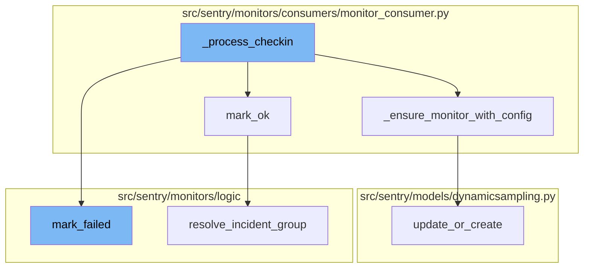
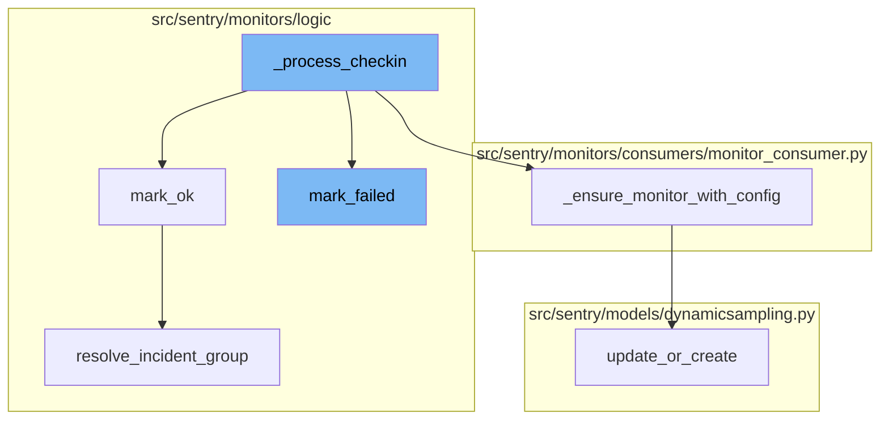
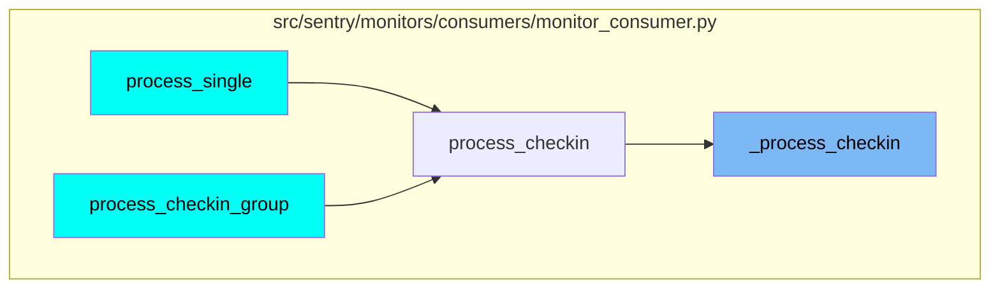

# Overview

\_process_checkin is a function that handles the processing of a check-in item. It extracts necessary information from the item payload and message, performs several checks, and if all checks pass, it proceeds to transform the check-in UUID and validate the monitor check-in. If validation passes, it attempts to retrieve or upsert the monitor for this check-in.

# Successful Check-in

When a check-in is successful, the `mark_ok` function is called. It updates the monitor environment's last check-in time and next expected check-in times. If the monitor environment's status is not OK and the check-in status is OK, it checks if the incident is recovering. If the incident is recovering, it resolves any open incidents and updates the monitor environment's status to OK.

# Monitor Retrieval or Creation

The `_ensure_monitor_with_config` function is used to retrieve or create a monitor with a given configuration. It first tries to get an existing monitor with the given slug. If it doesn't exist, it creates a new one. If a configuration is provided, it validates the configuration and updates the monitor with the validated configuration.

# Failed Check-in

When a check-in fails, the `mark_failed` function is called. It marks the monitor environment as failed and triggers side effects for creating monitor incidents and issues. It updates the monitor environment's last check-in time and next expected check-in times. If the failed check-in is a synthetic missed check-in, it does not move the `last_checkin` timestamp forward.

# Updating or Creating Dynamic Sampling Rules

The `update_or_create` function is used to update an existing custom dynamic sampling rule or create a new one if it doesn't exist. It first checks if a rule already exists for the given condition and organization. If it does, it updates the rule. If it doesn't, it creates a new rule.

# Resolving Incident Group

The `resolve_incident_group` function is used to resolve an incident group. It sends a status change message to Kafka to update the status of the group to RESOLVED.



# Flow drill down



<SwmSnippet path="/src/sentry/monitors/consumers/monitor_consumer.py" line="409">

---

# \_process_checkin Function

The `_process_checkin` function is responsible for processing a check-in item. It starts by extracting necessary information from the item payload and message. It then performs several checks, including killswitch, rate limit, and quota checks. If any of these checks fail, it raises an exception and stops processing. If all checks pass, it proceeds to transform the check-in UUID and validate the monitor check-in. If validation fails, it raises an exception. If validation passes, it attempts to retrieve or upsert the monitor for this check-in.

```python
def _process_checkin(item: CheckinItem, txn: Transaction | Span):
    params = item.payload

    start_time = to_datetime(float(item.message["start_time"]))
    project_id = int(item.message["project_id"])
    source_sdk = item.message["sdk"]

    monitor_slug = item.valid_monitor_slug
    environment = params.get("environment")

    project = Project.objects.get_from_cache(id=project_id)

    # Strip sdk version to reduce metric cardinality
    sdk_platform = source_sdk.split("/")[0] if source_sdk else "none"

    metric_kwargs = {
        "source": "consumer",
        "sdk_platform": sdk_platform,
    }

    if check_killswitch(metric_kwargs, project):
```

---

</SwmSnippet>

<SwmSnippet path="/src/sentry/monitors/logic/mark_ok.py" line="13">

---

# mark_ok Function

The `mark_ok` function is called when a check-in is successful. It updates the monitor environment's last check-in time and next expected check-in times. If the monitor environment's status is not OK and the check-in status is OK, it checks if the incident is recovering. If the incident is recovering, it resolves any open incidents and updates the monitor environment's status to OK.

```python
def mark_ok(checkin: MonitorCheckIn, ts: datetime):
    monitor_env = checkin.monitor_environment

    next_checkin = monitor_env.monitor.get_next_expected_checkin(ts)
    next_checkin_latest = monitor_env.monitor.get_next_expected_checkin_latest(ts)

    params = {
        "last_checkin": checkin.date_added,
        "next_checkin": next_checkin,
        "next_checkin_latest": next_checkin_latest,
    }

    if monitor_env.status != MonitorStatus.OK and checkin.status == CheckInStatus.OK:
        recovery_threshold = monitor_env.monitor.config.get("recovery_threshold", 1)
        if not recovery_threshold:
            recovery_threshold = 1

        # Run incident logic if recovery threshold is set
        if recovery_threshold > 1:
            # Check if our incident is recovering
            previous_checkins = (
```

---

</SwmSnippet>

<SwmSnippet path="/src/sentry/monitors/consumers/monitor_consumer.py" line="89">

---

# \_ensure_monitor_with_config Function

The `_ensure_monitor_with_config` function is used to retrieve or create a monitor with a given configuration. It first tries to get an existing monitor with the given slug. If it doesn't exist, it creates a new one. If a configuration is provided, it validates the configuration and updates the monitor with the validated configuration.

```python
def _ensure_monitor_with_config(
    project: Project,
    monitor_slug: str,
    config: Mapping | None,
):
    try:
        monitor = Monitor.objects.get(
            slug=monitor_slug,
            project_id=project.id,
            organization_id=project.organization_id,
        )
    except Monitor.DoesNotExist:
        monitor = None

    if not config:
        return monitor

    # The upsert payload doesn't quite match the api one. Pop out the owner here since
    # it's not part of the monitor config
    owner = config.pop("owner", None)
    owner_user_id = None
```

---

</SwmSnippet>

<SwmSnippet path="/src/sentry/monitors/logic/mark_failed.py" line="29">

---

# mark_failed Function

The `mark_failed` function is called when a check-in fails. It marks the monitor environment as failed and triggers side effects for creating monitor incidents and issues. It updates the monitor environment's last check-in time and next expected check-in times. If the failed check-in is a synthetic missed check-in, it does not move the `last_checkin` timestamp forward.

```python
def mark_failed(
    failed_checkin: MonitorCheckIn,
    ts: datetime,
    received: datetime | None = None,
):
    """
    Given a failing check-in, mark the monitor environment as failed and trigger
    side effects for creating monitor incidents and issues.

    The provided `ts` is the reference time for when the next check-in time is
    calculated from. This typically would be the failed check-in's `date_added`
    or completion time. Though for the missed and timedout tasks this may be
    computed based on the tasks reference time.
    """
    monitor_env = failed_checkin.monitor_environment
    failure_issue_threshold = monitor_env.monitor.config.get("failure_issue_threshold", 1)
    if not failure_issue_threshold:
        failure_issue_threshold = 1

    # Compute the next check-in time from our reference time
    next_checkin = monitor_env.monitor.get_next_expected_checkin(ts)
```

---

</SwmSnippet>

<SwmSnippet path="/src/sentry/models/dynamicsampling.py" line="163">

---

# update_or_create Function

The `update_or_create` function is used to update an existing custom dynamic sampling rule or create a new one if it doesn't exist. It first checks if a rule already exists for the given condition and organization. If it does, it updates the rule. If it doesn't, it creates a new rule.

```python
    def update_or_create(
        condition: Any,
        start: datetime,
        end: datetime,
        project_ids: Sequence[int],
        organization_id: int,
        num_samples: int,
        sample_rate: float,
        query: str,
        created_by_id: int | None = None,
    ) -> CustomDynamicSamplingRule:
        from sentry.models.organization import Organization
        from sentry.models.project import Project

        with transaction.atomic(router.db_for_write(CustomDynamicSamplingRule)):
            # check if rule already exists for this organization
            existing_rule = CustomDynamicSamplingRule.get_rule_for_org(
                condition, organization_id, project_ids
            )

            if existing_rule is not None:
```

---

</SwmSnippet>

<SwmSnippet path="/src/sentry/monitors/logic/mark_ok.py" line="84">

---

# resolve_incident_group Function

The `resolve_incident_group` function is used to resolve an incident group. It sends a status change message to Kafka to update the status of the group to RESOLVED.

```python
def resolve_incident_group(
    fingerprint: str,
    project_id: int,
):
    from sentry.issues.producer import PayloadType, produce_occurrence_to_kafka
    from sentry.issues.status_change_message import StatusChangeMessage
    from sentry.models.group import GroupStatus

    status_change = StatusChangeMessage(
        fingerprint=[fingerprint],
        project_id=project_id,
        new_status=GroupStatus.RESOLVED,
        new_substatus=None,
    )

    produce_occurrence_to_kafka(
        payload_type=PayloadType.STATUS_CHANGE,
        status_change=status_change,
    )
```

---

</SwmSnippet>

# Where is this flow used?

This flow is used multiple times in the codebase as represented in the following diagram:



&nbsp;

*This is an auto-generated document by Swimm AI 🌊 and has not yet been verified by a human*

<SwmMeta version="3.0.0" repo-id="Z2l0aHViJTNBJTNBc2VudHJ5LWRlbW8lM0ElM0FTd2ltbS1EZW1v" repo-name="sentry-demo" doc-type="flows"><sup>Powered by [Swimm](/)</sup></SwmMeta>
