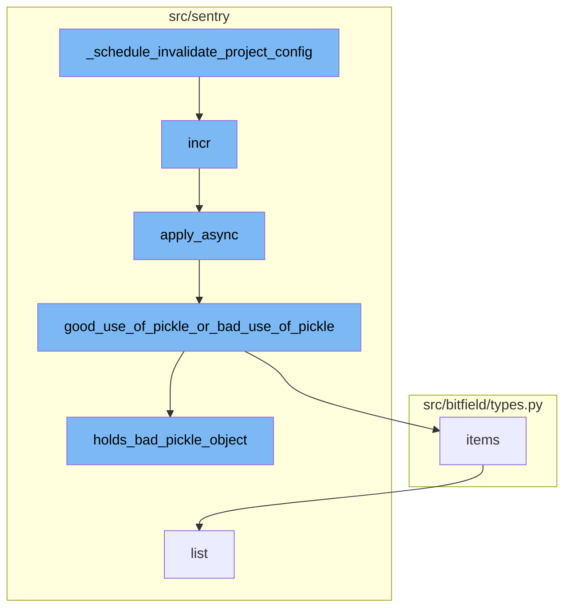

<SwmSnippet path="/src/sentry/tasks/relay.py" line="318">

---

# \_schedule_invalidate_project_config

The function `_schedule_invalidate_project_config` is used to schedule the invalidation of a project's configuration. It first validates the arguments and checks if the task is already in the queue. If not, it increments the metrics for scheduled tasks and applies the `invalidate_project_config` task asynchronously.

```python
def _schedule_invalidate_project_config(
    *,
    trigger,
    organization_id=None,
    project_id=None,
    public_key=None,
    countdown=5,
):
    """For param docs, see :func:`schedule_invalidate_project_config`."""
    from sentry.models.project import Project
    from sentry.models.projectkey import ProjectKey

    validate_args(organization_id, project_id, public_key)

    # The keys we need to check for to see if this is debounced, we want to check all
    # levels.
    check_debounce_keys = {
        "public_key": public_key,
        "project_id": project_id,
        "organization_id": organization_id,
    }
```

---

</SwmSnippet>

<SwmSnippet path="/src/sentry/buffer/base.py" line="83">

---

# incr

The `incr` function is called within `_schedule_invalidate_project_config` to increment the metrics. It applies the `process_incr` task asynchronously.

```python
    def incr(
        self,
        model: type[models.Model],
        columns: dict[str, int],
        filters: dict[str, models.Model | str | int],
        extra: dict[str, Any] | None = None,
        signal_only: bool | None = None,
    ) -> None:
        """
        >>> incr(Group, columns={'times_seen': 1}, filters={'pk': group.pk})
        signal_only - added to indicate that `process` should only call the complete
        signal handler with the updated model and skip creates/updates in the database. this
        is useful in cases where we need to do additional processing before writing to the
        database and opt to do it in a `buffer_incr_complete` receiver.
        """
        process_incr.apply_async(
            kwargs={
                "model": model,
                "columns": columns,
                "filters": filters,
                "extra": extra,
```

---

</SwmSnippet>

<SwmSnippet path="/src/sentry/celery.py" line="103">

---

# apply_async

The `apply_async` function is used to apply tasks asynchronously. It adds metadata to the task and checks for bad uses of pickle. If the task is not a legacy pickle task, it calls the `good_use_of_pickle_or_bad_use_of_pickle` function.

```python
    def apply_async(self, *args, **kwargs):
        self._add_metadata(kwargs)
        # If intended detect bad uses of pickle and make the tasks fail in tests.  This should
        # in theory pick up a lot of bad uses without accidentally failing tasks in prod.
        if (
            settings.CELERY_COMPLAIN_ABOUT_BAD_USE_OF_PICKLE
            and self.name not in LEGACY_PICKLE_TASKS
        ):
            good_use_of_pickle_or_bad_use_of_pickle(self, args, kwargs)

        with metrics.timer("jobs.delay", instance=self.name):
            return Task.apply_async(self, *args, **kwargs)
```

---

</SwmSnippet>

<SwmSnippet path="/src/sentry/celery.py" line="61">

---

# good_use_of_pickle_or_bad_use_of_pickle

The `good_use_of_pickle_or_bad_use_of_pickle` function is used to check if the task arguments contain objects that should not be passed via pickle. If a bad object is found, it raises a TypeError.

```python
def good_use_of_pickle_or_bad_use_of_pickle(task, args, kwargs):
    argiter = chain(enumerate(args), kwargs.items())

    for name, value in argiter:
        bad = holds_bad_pickle_object(value)
        if bad is not None:
            bad_object, reason = bad
            raise TypeError(
                "Task %r was invoked with an object that we do not want "
                "to pass via pickle (%r, reason is %s) in argument %s"
                % (task, bad_object, reason, name)
            )
```

---

</SwmSnippet>

<SwmSnippet path="/src/sentry/celery.py" line="29">

---

# holds_bad_pickle_object

The `holds_bad_pickle_object` function is used within `good_use_of_pickle_or_bad_use_of_pickle` to check if a value holds a bad pickle object. It checks if the value is a Django database model or a custom class, both of which are considered bad objects to pass via pickle.

```python
def holds_bad_pickle_object(value, memo=None):
    if memo is None:
        memo = {}

    value_id = id(value)
    if value_id in memo:
        return
    memo[value_id] = value

    if isinstance(value, (tuple, list)):
        for item in value:
            bad_object = holds_bad_pickle_object(item)
            if bad_object is not None:
                return bad_object
    elif isinstance(value, dict):
        for item in value.values():
            bad_object = holds_bad_pickle_object(item)
            if bad_object is not None:
                return bad_object

    if isinstance(value, models.Model):
```

---

</SwmSnippet>

<SwmSnippet path="/src/bitfield/types.py" line="225">

---

# items

The `items` function is used to return a list of items. It is not directly related to the `_schedule_invalidate_project_config` flow but is part of the `good_use_of_pickle_or_bad_use_of_pickle` function where it could be used to iterate over the items of a value if it is a dictionary.

```python
    def items(self):
        return list(self.iteritems())
```

---

</SwmSnippet>



# Flow drill down


<SwmSnippet path="/src/sentry/tasks/relay.py" line="318">

---

# \_schedule_invalidate_project_config

The function `_schedule_invalidate_project_config` is used to schedule the invalidation of a project's configuration. It first validates the arguments and checks if the task is already in the queue. If not, it increments the metrics for scheduled tasks and applies the `invalidate_project_config` task asynchronously.

```python
def _schedule_invalidate_project_config(
    *,
    trigger,
    organization_id=None,
    project_id=None,
    public_key=None,
    countdown=5,
):
    """For param docs, see :func:`schedule_invalidate_project_config`."""
    from sentry.models.project import Project
    from sentry.models.projectkey import ProjectKey

    validate_args(organization_id, project_id, public_key)

    # The keys we need to check for to see if this is debounced, we want to check all
    # levels.
    check_debounce_keys = {
        "public_key": public_key,
        "project_id": project_id,
        "organization_id": organization_id,
    }
```

---

</SwmSnippet>

<SwmSnippet path="/src/sentry/buffer/base.py" line="83">

---

# incr

The `incr` function is called within `_schedule_invalidate_project_config` to increment the metrics. It applies the `process_incr` task asynchronously.

```python
    def incr(
        self,
        model: type[models.Model],
        columns: dict[str, int],
        filters: dict[str, models.Model | str | int],
        extra: dict[str, Any] | None = None,
        signal_only: bool | None = None,
    ) -> None:
        """
        >>> incr(Group, columns={'times_seen': 1}, filters={'pk': group.pk})
        signal_only - added to indicate that `process` should only call the complete
        signal handler with the updated model and skip creates/updates in the database. this
        is useful in cases where we need to do additional processing before writing to the
        database and opt to do it in a `buffer_incr_complete` receiver.
        """
        process_incr.apply_async(
            kwargs={
                "model": model,
                "columns": columns,
                "filters": filters,
                "extra": extra,
```

---

</SwmSnippet>

<SwmSnippet path="/src/sentry/celery.py" line="103">

---

# apply_async

The `apply_async` function is used to apply tasks asynchronously. It adds metadata to the task and checks for bad uses of pickle. If the task is not a legacy pickle task, it calls the `good_use_of_pickle_or_bad_use_of_pickle` function.

```python
    def apply_async(self, *args, **kwargs):
        self._add_metadata(kwargs)
        # If intended detect bad uses of pickle and make the tasks fail in tests.  This should
        # in theory pick up a lot of bad uses without accidentally failing tasks in prod.
        if (
            settings.CELERY_COMPLAIN_ABOUT_BAD_USE_OF_PICKLE
            and self.name not in LEGACY_PICKLE_TASKS
        ):
            good_use_of_pickle_or_bad_use_of_pickle(self, args, kwargs)

        with metrics.timer("jobs.delay", instance=self.name):
            return Task.apply_async(self, *args, **kwargs)
```

---

</SwmSnippet>

<SwmSnippet path="/src/sentry/celery.py" line="61">

---

# good_use_of_pickle_or_bad_use_of_pickle

The `good_use_of_pickle_or_bad_use_of_pickle` function is used to check if the task arguments contain objects that should not be passed via pickle. If a bad object is found, it raises a TypeError.

```python
def good_use_of_pickle_or_bad_use_of_pickle(task, args, kwargs):
    argiter = chain(enumerate(args), kwargs.items())

    for name, value in argiter:
        bad = holds_bad_pickle_object(value)
        if bad is not None:
            bad_object, reason = bad
            raise TypeError(
                "Task %r was invoked with an object that we do not want "
                "to pass via pickle (%r, reason is %s) in argument %s"
                % (task, bad_object, reason, name)
            )
```

---

</SwmSnippet>

<SwmSnippet path="/src/sentry/celery.py" line="29">

---

# holds_bad_pickle_object

The `holds_bad_pickle_object` function is used within `good_use_of_pickle_or_bad_use_of_pickle` to check if a value holds a bad pickle object. It checks if the value is a Django database model or a custom class, both of which are considered bad objects to pass via pickle.

```python
def holds_bad_pickle_object(value, memo=None):
    if memo is None:
        memo = {}

    value_id = id(value)
    if value_id in memo:
        return
    memo[value_id] = value

    if isinstance(value, (tuple, list)):
        for item in value:
            bad_object = holds_bad_pickle_object(item)
            if bad_object is not None:
                return bad_object
    elif isinstance(value, dict):
        for item in value.values():
            bad_object = holds_bad_pickle_object(item)
            if bad_object is not None:
                return bad_object

    if isinstance(value, models.Model):
```

---

</SwmSnippet>

<SwmSnippet path="/src/bitfield/types.py" line="225">

---

# items

The `items` function is used to return a list of items. It is not directly related to the `_schedule_invalidate_project_config` flow but is part of the `good_use_of_pickle_or_bad_use_of_pickle` function where it could be used to iterate over the items of a value if it is a dictionary.

```python
    def items(self):
        return list(self.iteritems())
```

---

</SwmSnippet>

&nbsp;

*This is an auto-generated document by Swimm AI 🌊 and has not yet been verified by a human*

<SwmMeta version="3.0.0" repo-id="Z2l0aHViJTNBJTNBc2VudHJ5LWRlbW8lM0ElM0FTd2ltbS1EZW1v" repo-name="sentry-demo" doc-type="flows"><sup>Powered by [Swimm](/)</sup></SwmMeta>
