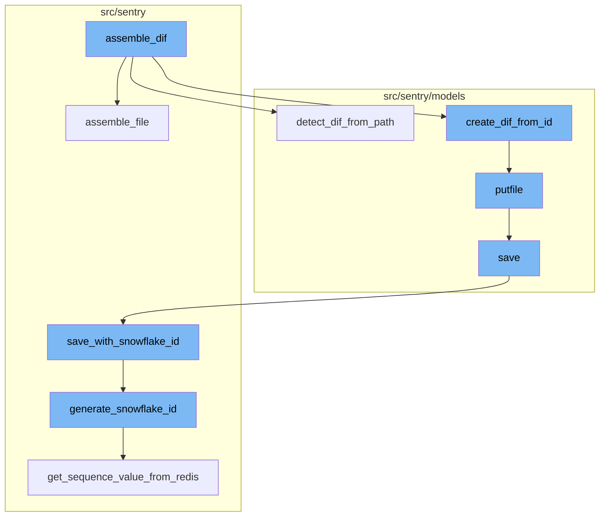
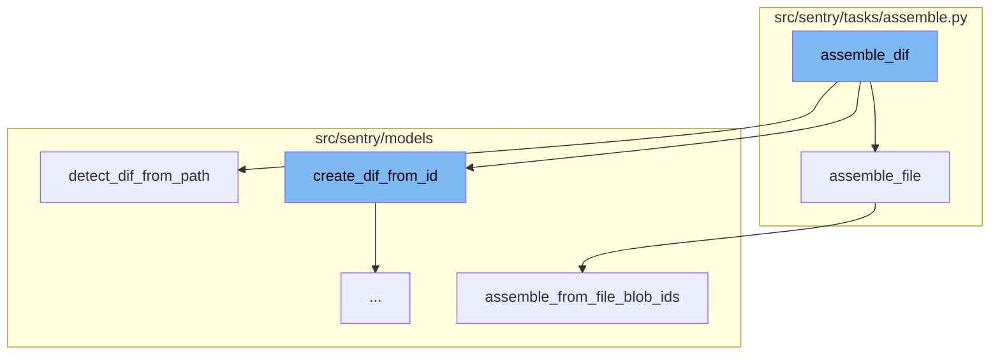
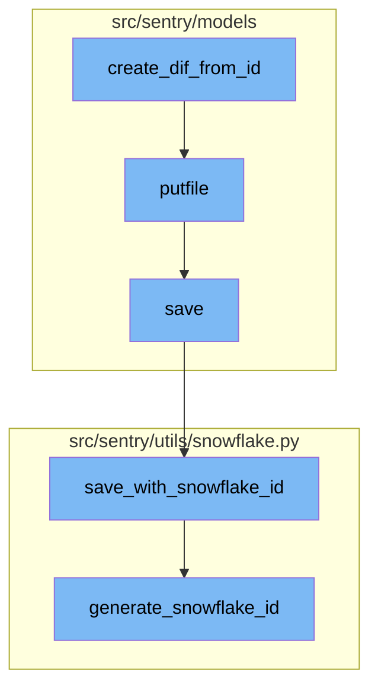

# Overview of assemble_dif

The `assemble_dif` function is a key part of the Sentry application. It is responsible for assembling uploaded chunks into a `ProjectDebugFile`. This process involves setting the project scope, initializing the `delete_file` flag, retrieving the project based on the provided `project_id`, and setting the assemble status to `ASSEMBLING`. The function then calls `assemble_file` to assemble the chunks into a temporary file.

<SwmSnippet path="/src/sentry/tasks/assemble.py" line="80">

---

# Assembling the File

The `assemble_file` function verifies and assembles a file model from chunks. It downloads all chunks from the blob store to verify their integrity and associates them with a created file model. It also assembles the full file in a temporary location and verifies the complete content hash. If the file size exceeds the maximum allowed size for the organization, the function sets the assemble status to `ERROR` and returns `None`.

```python
def assemble_file(task, org_or_project, name, checksum, chunks, file_type) -> AssembleResult | None:
    """
    Verifies and assembles a file model from chunks.

    This downloads all chunks from blob store to verify their integrity and
    associates them with a created file model. Additionally, it assembles the
    full file in a temporary location and verifies the complete content hash.

    Returns a tuple ``(File, TempFile)`` on success, or ``None`` on error.
    """
    from sentry.models.files.fileblob import FileBlob
    from sentry.models.files.utils import AssembleChecksumMismatch

    if isinstance(org_or_project, Project):
        organization = org_or_project.organization
    else:
        organization = org_or_project

    # Load all FileBlobs from db since we can be sure here we already own all chunks need to build the file.
    file_blobs = FileBlob.objects.filter(checksum__in=chunks).values_list("id", "checksum", "size")

```

---

</SwmSnippet>

<SwmSnippet path="/src/sentry/models/debugfile.py" line="460">

---

# Detecting the Debug Information File

The `detect_dif_from_path` function is used to detect the kind of Debug Information File (DIF) the file at a given path is. It supports various file formats including proguard, bcsymbolmap, uuidmap, il2cpp, and native debug information files (MachO, ELF or Breakpad). If the file is not a valid DIF, it raises a `BadDif` exception.

```python
def detect_dif_from_path(
    path: str,
    name: str | None = None,
    debug_id: str | None = None,
    accept_unknown: bool = False,
) -> list[DifMeta]:
    """Detects which kind of Debug Information File (DIF) the file at `path` is.

    :param accept_unknown: If this is ``False`` an exception will be logged with the error
       when a file which is not a known DIF is found.  This is useful for when ingesting ZIP
       files directly from Apple App Store Connect which you know will also contain files
       which are not DIFs.

    :returns: an array since an Archive can contain more than one Object.

    :raises BadDif: If the file is not a valid DIF.
    """
    # proguard files (proguard/UUID.txt) or
    # (proguard/mapping-UUID.txt).
    proguard_id = _analyze_progard_filename(path)
    if proguard_id is not None:
```

---

</SwmSnippet>

<SwmSnippet path="/src/sentry/models/debugfile.py" line="245">

---

# Creating a Debug Information File

The `create_dif_from_id` function is responsible for creating a `ProjectDebugFile` entry for the provided Debug Information File (DIF). It takes a project, a `DifMeta` object, and optionally a file or a binary file object. If the correct entry already exists, it simply returns the existing entry. Otherwise, it creates a new entry and returns it.

```python
def create_dif_from_id(
    project: Project,
    meta: DifMeta,
    fileobj: BinaryIO | None = None,
    file: File | None = None,
) -> tuple[ProjectDebugFile, bool]:
    """Creates the :class:`ProjectDebugFile` entry for the provided DIF.

    This creates the :class:`ProjectDebugFile` entry for the DIF provided in `meta` (a
    :class:`DifMeta` object).  If the correct entry already exists this simply returns the
    existing entry.

    It intentionally does not validate the file, only will ensure a :class:`File` entry
    exists and set its `ContentType` according to the provided :class:DifMeta`.

    Returns a tuple of `(dif, created)` where `dif` is the `ProjectDebugFile` instance and
    `created` is a bool.
    """
    if meta.file_format == "proguard":
        object_name = "proguard-mapping"
    elif meta.file_format in (
```

---

</SwmSnippet>

<SwmSnippet path="/src/sentry/models/eventattachment.py" line="169">

---

# Storing the File

The `putfile` function is used to store the file. It takes a project id and an attachment, and returns a `PutfileResult` which includes the content type, size, sha1, and blob path of the file. The file is stored in a blob path, which is either inline or in a unique path under 'eventattachments/v1/'.

```python
    def putfile(cls, project_id: int, attachment: CachedAttachment) -> PutfileResult:
        from sentry.models.files import FileBlob

        content_type = normalize_content_type(attachment.content_type, attachment.name)
        data = attachment.data

        if len(data) == 0:
            return PutfileResult(content_type=content_type, size=0, sha1=sha1().hexdigest())

        blob = BytesIO(data)

        size, checksum = get_size_and_checksum(blob)

        if can_store_inline(data):
            blob_path = ":" + data.decode()
        else:
            blob_path = "eventattachments/v1/" + FileBlob.generate_unique_path()

            storage = get_storage()
            compressed_blob = BytesIO(zstandard.compress(data))
            storage.save(blob_path, compressed_blob)
```

---

</SwmSnippet>

<SwmSnippet path="/src/sentry/models/project.py" line="365">

---

# Saving the Project

The `save` function is used to save the project. If the project doesn't have a slug, it generates one. If the `SENTRY_USE_SNOWFLAKE` setting is enabled, it saves the project with a snowflake id using the `save_with_snowflake_id` function.

```python
    def save(self, *args, **kwargs):
        if not self.slug:
            lock = locks.get(
                f"slug:project:{self.organization_id}", duration=5, name="project_slug"
            )
            with TimedRetryPolicy(10)(lock.acquire):
                slugify_instance(
                    self,
                    self.name,
                    organization=self.organization,
                    reserved=RESERVED_PROJECT_SLUGS,
                    max_length=50,
                )

        if SENTRY_USE_SNOWFLAKE:
            snowflake_redis_key = "project_snowflake_key"
            save_with_snowflake_id(
                instance=self,
                snowflake_redis_key=snowflake_redis_key,
                save_callback=lambda: super(Project, self).save(*args, **kwargs),
            )
```

---

</SwmSnippet>

<SwmSnippet path="/src/sentry/utils/snowflake.py" line="113">

---

# Generating a Snowflake ID

The `generate_snowflake_id` function is used to generate a snowflake id. It takes a redis key and generates a unique id based on the current time, region, and a sequence value from redis. The generated id is then validated and returned.

```python
def generate_snowflake_id(redis_key: str) -> int:
    segment_values = {}

    segment_values[VERSION_ID] = msb_0_ordering(settings.SNOWFLAKE_VERSION_ID, VERSION_ID.length)

    try:
        segment_values[REGION_ID] = get_local_region().snowflake_id
    except RegionContextError:  # expected if running in monolith mode
        segment_values[REGION_ID] = NULL_REGION_ID

    current_time = datetime.now().timestamp()
    # supports up to 130 years
    segment_values[TIME_DIFFERENCE] = int(current_time - settings.SENTRY_SNOWFLAKE_EPOCH_START)

    snowflake_id = 0
    (
        segment_values[TIME_DIFFERENCE],
        segment_values[REGION_SEQUENCE],
    ) = get_sequence_value_from_redis(redis_key, segment_values[TIME_DIFFERENCE])

    for segment in BIT_SEGMENT_SCHEMA:
```

---

</SwmSnippet>



# Flow drill down

First, we'll zoom into this section of the flow:



<SwmSnippet path="/src/sentry/tasks/assemble.py" line="227">

---

# assemble_dif Function

The `assemble_dif` function is responsible for assembling uploaded chunks into a `ProjectDebugFile`. It starts by setting the project scope and initializing the `delete_file` flag. It then retrieves the project based on the provided `project_id` and sets the assemble status to `ASSEMBLING`. The function then calls `assemble_file` to assemble the chunks into a temporary file.

```python
def assemble_dif(project_id, name, checksum, chunks, debug_id=None, **kwargs):
    """
    Assembles uploaded chunks into a ``ProjectDebugFile``.
    """
    from sentry.lang.native.sources import record_last_upload
    from sentry.models.debugfile import BadDif, create_dif_from_id, detect_dif_from_path
    from sentry.models.project import Project

    Scope.get_isolation_scope().set_tag("project", project_id)

    delete_file = False

    try:
        project = Project.objects.filter(id=project_id).get()
        set_assemble_status(AssembleTask.DIF, project_id, checksum, ChunkFileState.ASSEMBLING)

        # Assemble the chunks into a temporary file
        rv = assemble_file(
            AssembleTask.DIF, project, name, checksum, chunks, file_type="project.dif"
        )

```

---

</SwmSnippet>

<SwmSnippet path="/src/sentry/tasks/assemble.py" line="80">

---

# assemble_file Function

The `assemble_file` function verifies and assembles a file model from chunks. It downloads all chunks from the blob store to verify their integrity and associates them with a created file model. It also assembles the full file in a temporary location and verifies the complete content hash. If the file size exceeds the maximum allowed size for the organization, the function sets the assemble status to `ERROR` and returns `None`.

```python
def assemble_file(task, org_or_project, name, checksum, chunks, file_type) -> AssembleResult | None:
    """
    Verifies and assembles a file model from chunks.

    This downloads all chunks from blob store to verify their integrity and
    associates them with a created file model. Additionally, it assembles the
    full file in a temporary location and verifies the complete content hash.

    Returns a tuple ``(File, TempFile)`` on success, or ``None`` on error.
    """
    from sentry.models.files.fileblob import FileBlob
    from sentry.models.files.utils import AssembleChecksumMismatch

    if isinstance(org_or_project, Project):
        organization = org_or_project.organization
    else:
        organization = org_or_project

    # Load all FileBlobs from db since we can be sure here we already own all chunks need to build the file.
    file_blobs = FileBlob.objects.filter(checksum__in=chunks).values_list("id", "checksum", "size")

```

---

</SwmSnippet>

<SwmSnippet path="/src/sentry/models/debugfile.py" line="460">

---

# detect_dif_from_path Function

The `detect_dif_from_path` function is used to detect the kind of Debug Information File (DIF) the file at a given path is. It supports various file formats including proguard, bcsymbolmap, uuidmap, il2cpp, and native debug information files (MachO, ELF or Breakpad). If the file is not a valid DIF, it raises a `BadDif` exception.

```python
def detect_dif_from_path(
    path: str,
    name: str | None = None,
    debug_id: str | None = None,
    accept_unknown: bool = False,
) -> list[DifMeta]:
    """Detects which kind of Debug Information File (DIF) the file at `path` is.

    :param accept_unknown: If this is ``False`` an exception will be logged with the error
       when a file which is not a known DIF is found.  This is useful for when ingesting ZIP
       files directly from Apple App Store Connect which you know will also contain files
       which are not DIFs.

    :returns: an array since an Archive can contain more than one Object.

    :raises BadDif: If the file is not a valid DIF.
    """
    # proguard files (proguard/UUID.txt) or
    # (proguard/mapping-UUID.txt).
    proguard_id = _analyze_progard_filename(path)
    if proguard_id is not None:
```

---

</SwmSnippet>

<SwmSnippet path="/src/sentry/models/files/abstractfile.py" line="308">

---

# assemble_from_file_blob_ids Function

The `assemble_from_file_blob_ids` function creates a file from file blobs and returns a temp file with the contents. It ensures blobs are in the order and duplication as provided. If the checksum does not match, it raises an `AssembleChecksumMismatch` exception.

```python
    def assemble_from_file_blob_ids(self, file_blob_ids, checksum):
        """
        This creates a file, from file blobs and returns a temp file with the
        contents.
        """
        tf = tempfile.NamedTemporaryFile()
        with atomic_transaction(
            using=(
                router.db_for_write(self.FILE_BLOB_MODEL),
                router.db_for_write(self.FILE_BLOB_INDEX_MODEL),
            )
        ):
            try:
                file_blobs_qs = self.FILE_BLOB_MODEL.objects.filter(id__in=file_blob_ids).all()

                # Ensure blobs are in the order and duplication as provided
                blobs_by_id = {blob.id: blob for blob in file_blobs_qs}
                file_blobs = [blobs_by_id[blob_id] for blob_id in file_blob_ids]
            except Exception:
                # Most likely a `KeyError` like `SENTRY-11QP` because an `id` in
                # `file_blob_ids` does suddenly not exist anymore
```

---

</SwmSnippet>

Now, lets zoom into this section of the flow:



<SwmSnippet path="/src/sentry/models/debugfile.py" line="245">

---

## Creating a Debug Information File

The `create_dif_from_id` function is responsible for creating a `ProjectDebugFile` entry for the provided Debug Information File (DIF). It takes a project, a `DifMeta` object, and optionally a file or a binary file object. If the correct entry already exists, it simply returns the existing entry. Otherwise, it creates a new entry and returns it.

```python
def create_dif_from_id(
    project: Project,
    meta: DifMeta,
    fileobj: BinaryIO | None = None,
    file: File | None = None,
) -> tuple[ProjectDebugFile, bool]:
    """Creates the :class:`ProjectDebugFile` entry for the provided DIF.

    This creates the :class:`ProjectDebugFile` entry for the DIF provided in `meta` (a
    :class:`DifMeta` object).  If the correct entry already exists this simply returns the
    existing entry.

    It intentionally does not validate the file, only will ensure a :class:`File` entry
    exists and set its `ContentType` according to the provided :class:DifMeta`.

    Returns a tuple of `(dif, created)` where `dif` is the `ProjectDebugFile` instance and
    `created` is a bool.
    """
    if meta.file_format == "proguard":
        object_name = "proguard-mapping"
    elif meta.file_format in (
```

---

</SwmSnippet>

<SwmSnippet path="/src/sentry/models/eventattachment.py" line="169">

---

## Storing the File

The `putfile` function is used to store the file. It takes a project id and an attachment, and returns a `PutfileResult` which includes the content type, size, sha1, and blob path of the file. The file is stored in a blob path, which is either inline or in a unique path under 'eventattachments/v1/'.

```python
    def putfile(cls, project_id: int, attachment: CachedAttachment) -> PutfileResult:
        from sentry.models.files import FileBlob

        content_type = normalize_content_type(attachment.content_type, attachment.name)
        data = attachment.data

        if len(data) == 0:
            return PutfileResult(content_type=content_type, size=0, sha1=sha1().hexdigest())

        blob = BytesIO(data)

        size, checksum = get_size_and_checksum(blob)

        if can_store_inline(data):
            blob_path = ":" + data.decode()
        else:
            blob_path = "eventattachments/v1/" + FileBlob.generate_unique_path()

            storage = get_storage()
            compressed_blob = BytesIO(zstandard.compress(data))
            storage.save(blob_path, compressed_blob)
```

---

</SwmSnippet>

<SwmSnippet path="/src/sentry/models/project.py" line="365">

---

## Saving the Project

The `save` function is used to save the project. If the project doesn't have a slug, it generates one. If the `SENTRY_USE_SNOWFLAKE` setting is enabled, it saves the project with a snowflake id using the `save_with_snowflake_id` function.

```python
    def save(self, *args, **kwargs):
        if not self.slug:
            lock = locks.get(
                f"slug:project:{self.organization_id}", duration=5, name="project_slug"
            )
            with TimedRetryPolicy(10)(lock.acquire):
                slugify_instance(
                    self,
                    self.name,
                    organization=self.organization,
                    reserved=RESERVED_PROJECT_SLUGS,
                    max_length=50,
                )

        if SENTRY_USE_SNOWFLAKE:
            snowflake_redis_key = "project_snowflake_key"
            save_with_snowflake_id(
                instance=self,
                snowflake_redis_key=snowflake_redis_key,
                save_callback=lambda: super(Project, self).save(*args, **kwargs),
            )
```

---

</SwmSnippet>

<SwmSnippet path="/src/sentry/utils/snowflake.py" line="47">

---

## Saving with a Snowflake ID

The `save_with_snowflake_id` function is used to save an instance with a snowflake id. It takes an instance, a redis key for the snowflake, and a save callback. If the instance doesn't have an id, it generates a snowflake id using the `generate_snowflake_id` function and assigns it to the instance. Then it tries to save the instance using the save callback.

```python
def save_with_snowflake_id(
    instance: BaseModel, snowflake_redis_key: str, save_callback: Callable[[], object]
) -> None:
    assert uses_snowflake_id(
        instance.__class__
    ), "Only models decorated with uses_snowflake_id can be saved with save_with_snowflake_id()"

    for _ in range(settings.MAX_REDIS_SNOWFLAKE_RETRY_COUNTER):
        if not instance.id:
            instance.id = generate_snowflake_id(snowflake_redis_key)
        try:
            with enforce_constraints(transaction.atomic(using=router.db_for_write(type(instance)))):
                save_callback()
            return
        except IntegrityError:
            instance.id = None  # type: ignore[assignment]  # see typeddjango/django-stubs#2014
    raise MaxSnowflakeRetryError
```

---

</SwmSnippet>

<SwmSnippet path="/src/sentry/utils/snowflake.py" line="113">

---

## Generating a Snowflake ID

The `generate_snowflake_id` function is used to generate a snowflake id. It takes a redis key and generates a unique id based on the current time, region, and a sequence value from redis. The generated id is then validated and returned.

```python
def generate_snowflake_id(redis_key: str) -> int:
    segment_values = {}

    segment_values[VERSION_ID] = msb_0_ordering(settings.SNOWFLAKE_VERSION_ID, VERSION_ID.length)

    try:
        segment_values[REGION_ID] = get_local_region().snowflake_id
    except RegionContextError:  # expected if running in monolith mode
        segment_values[REGION_ID] = NULL_REGION_ID

    current_time = datetime.now().timestamp()
    # supports up to 130 years
    segment_values[TIME_DIFFERENCE] = int(current_time - settings.SENTRY_SNOWFLAKE_EPOCH_START)

    snowflake_id = 0
    (
        segment_values[TIME_DIFFERENCE],
        segment_values[REGION_SEQUENCE],
    ) = get_sequence_value_from_redis(redis_key, segment_values[TIME_DIFFERENCE])

    for segment in BIT_SEGMENT_SCHEMA:
```

---

</SwmSnippet>

&nbsp;

*This is an auto-generated document by Swimm AI 🌊 and has not yet been verified by a human*

<SwmMeta version="3.0.0" repo-id="Z2l0aHViJTNBJTNBc2VudHJ5LWRlbW8lM0ElM0FTd2ltbS1EZW1v" repo-name="sentry-demo" doc-type="flows"><sup>Powered by [Swimm](/)</sup></SwmMeta>
