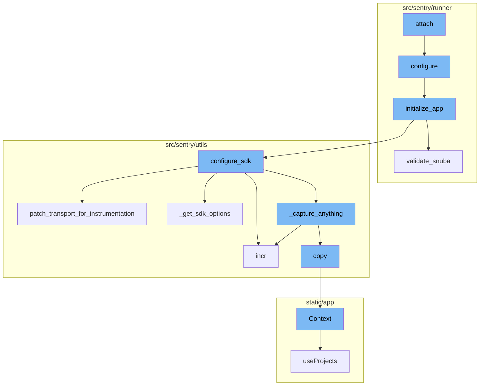
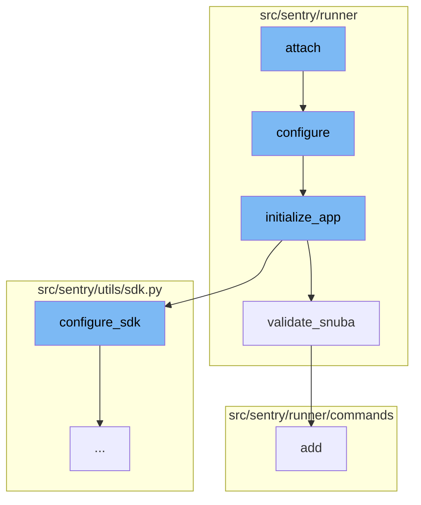
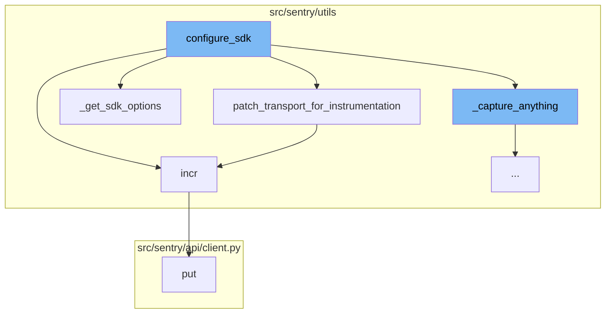
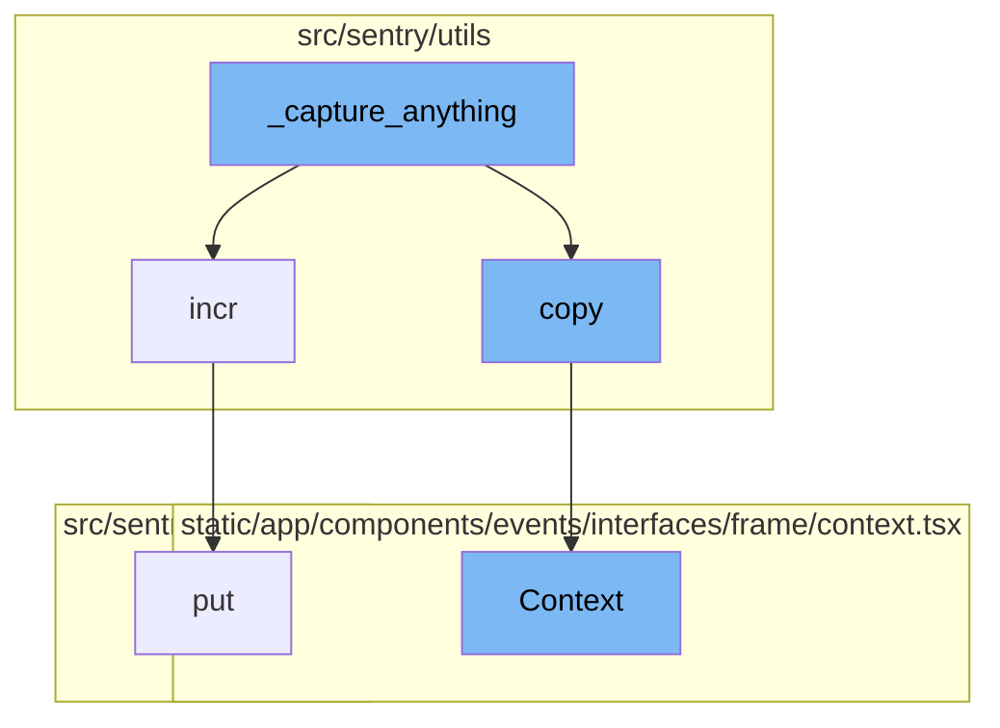

<SwmSnippet path="/src/sentry/runner/commands/devservices.py" line="214">

---

# Attach Function

The `attach` function is used to run a single devservice in the foreground. It accepts a single argument, the name of the service to spawn. The service will run with output printed to your terminal, and the ability to kill it with ^C. This is used in devserver.

```python
def attach(project: str, service: str) -> None:
    """
    Run a single devservice in the foreground.

    Accepts a single argument, the name of the service to spawn. The service
    will run with output printed to your terminal, and the ability to kill it
    with ^C. This is used in devserver.

    Note: This does not update images, you will have to use `devservices up`
    for that.
    """
    from sentry.runner import configure

    configure()

    containers = _prepare_containers(project, silent=True)
    if service not in containers:
        raise click.ClickException(f"Service `{service}` is not known or not enabled.")

    with get_docker_client() as docker_client:
        container = _start_service(
```

---

</SwmSnippet>

<SwmSnippet path="/src/sentry/runner/settings.py" line="53">

---

# Configure Function

The `configure` function is used to set up the environment given two different config files. It ensures that warnings are always displayed and adds in additional mimetypes that are useful for static files. It also checks if the configuration file exists and if not, it raises an exception.

```python
def configure(
    ctx: click.Context | None, py: str, yaml: str | None, skip_service_validation: bool = False
) -> None:
    """
    Given the two different config files, set up the environment.

    NOTE: Will only execute once, so it's safe to call multiple times.
    """
    global __installed
    if __installed:
        return

    # Make sure that our warnings are always displayed.
    warnings.filterwarnings("default", "", Warning, r"^sentry")

    # Add in additional mimetypes that are useful for our static files
    # which aren't common in default system registries
    import mimetypes

    for type, ext in (
        ("application/json", "map"),
```

---

</SwmSnippet>

<SwmSnippet path="/src/sentry/runner/initializer.py" line="306">

---

# Initialize_app Function

The `initialize_app` function is used to set up the application. It configures the settings, validates the regions, options, and snuba, configures the SDK, and sets up the services. It also dynamically sets the CSRF_TRUSTED_ORIGINS for self-hosted settings.

```python
def initialize_app(config: dict[str, Any], skip_service_validation: bool = False) -> None:
    settings = config["settings"]

    # Just reuse the integration app for Single Org / Self-Hosted as
    # it doesn't make much sense to use 2 separate apps for SSO and
    # integration.
    if settings.SENTRY_SINGLE_ORGANIZATION:
        options_mapper.update(
            {
                "github-app.client-id": "GITHUB_APP_ID",
                "github-app.client-secret": "GITHUB_API_SECRET",
            }
        )

    bootstrap_options(settings, config["options"])

    logging.raiseExceptions = settings.DEBUG

    configure_structlog()

    # Commonly setups don't correctly configure themselves for production envs
```

---

</SwmSnippet>

<SwmSnippet path="/src/sentry/runner/initializer.py" line="620">

---

# Validate_snuba Function

The `validate_snuba` function ensures that everything related to Snuba is in sync. It checks if all Snuba required backends are present and if the eventstream is Snuba. If not, it raises a ConfigurationError.

```python
def validate_snuba() -> None:
    """
    Make sure everything related to Snuba is in sync.

    This covers a few cases:

    * When you have features related to Snuba, you must also
      have Snuba fully configured correctly to continue.
    * If you have Snuba specific search/tagstore/tsdb backends,
      you must also have a Snuba compatible eventstream backend
      otherwise no data will be written into Snuba.
    * If you only have Snuba related eventstream, yell that you
      probably want the other backends otherwise things are weird.
    """
    if not settings.DEBUG:
        return

    has_all_snuba_required_backends = (
        settings.SENTRY_SEARCH
        in (
            "sentry.search.snuba.EventsDatasetSnubaSearchBackend",
```

---

</SwmSnippet>

<SwmSnippet path="/src/sentry/runner/commands/permissions.py" line="37">

---

# Add Function

The `add` function is used to add a permission to a user. It creates a UserPermission object for the user with the given permission. If the permission already exists for the user, it echoes a message stating the same.

```python
def add(user: str, permission: str) -> None:
    "Add a permission to a user."
    from django.db import IntegrityError, transaction

    from sentry.models.userpermission import UserPermission

    user_inst = user_param_to_user(user)

    try:
        with transaction.atomic(router.db_for_write(UserPermission)):
            UserPermission.objects.create(user=user_inst, permission=permission)
    except IntegrityError:
        click.echo(f"Permission already exists for `{user_inst.username}`")
    else:
        click.echo(f"Added permission `{permission}` to `{user_inst.username}`")
```

---

</SwmSnippet>

<SwmSnippet path="/src/sentry/utils/sdk.py" line="275">

---

# Configure SDK

The `configure_sdk` function is the starting point of the flow. It sets up the Sentry SDK with the necessary configurations. It also defines the `MultiplexingTransport` class which is responsible for capturing events and envelopes, and recording lost events.

```python
def configure_sdk():
    """
    Setup and initialize the Sentry SDK.
    """
    sdk_options, dsns = _get_sdk_options()

    internal_project_key = get_project_key()

    if dsns.sentry4sentry:
        transport = make_transport(get_options(dsn=dsns.sentry4sentry, **sdk_options))
        sentry4sentry_transport = patch_transport_for_instrumentation(transport, "upstream")
    else:
        sentry4sentry_transport = None

    if dsns.sentry_saas:
        transport = make_transport(get_options(dsn=dsns.sentry_saas, **sdk_options))
        sentry_saas_transport = patch_transport_for_instrumentation(transport, "relay")
    elif settings.IS_DEV and not settings.SENTRY_USE_RELAY:
        sentry_saas_transport = None
    elif internal_project_key and internal_project_key.dsn_private:
        transport = make_transport(get_options(dsn=internal_project_key.dsn_private, **sdk_options))
```

---

</SwmSnippet>

<SwmSnippet path="/src/sentry/utils/sdk.py" line="237">

---

# Patch Transport for Instrumentation

The `patch_transport_for_instrumentation` function is called within `configure_sdk`. It patches the transport functions to add metrics for better resolution around events sent to Sentry's ingest. It does this by wrapping the original `_send_request` method of the transport with a new method that increments a metric before calling the original method.

```python
# Patches transport functions to add metrics to improve resolution around events sent to our ingest.
# Leaving this in to keep a permanent measurement of sdk requests vs ingest.
def patch_transport_for_instrumentation(transport, transport_name):
    _send_request = transport._send_request
    if _send_request:

        def patched_send_request(*args, **kwargs):
            metrics.incr(f"internal.sent_requests.{transport_name}.events")
            return _send_request(*args, **kwargs)

        transport._send_request = patched_send_request
    return transport
```

---

</SwmSnippet>

<SwmSnippet path="/src/sentry/utils/metrics.py" line="101">

---

# Increment Metrics

The `incr` function is used to increment a metric. It is called within `patch_transport_for_instrumentation` and `configure_sdk` to track the number of events and envelopes captured, and the number of requests sent.

```python
    def incr(
        self,
        key: str,
        instance: str | None = None,
        tags: Tags | None = None,
        amount: int = 1,
        sample_rate: float = settings.SENTRY_METRICS_SAMPLE_RATE,
    ) -> None:
        if not self._started:
            self._start()
        self.q.put((key, instance, tags, amount, sample_rate))
```

---

</SwmSnippet>

<SwmSnippet path="/src/sentry/utils/sdk.py" line="256">

---

# Get SDK Options

The `_get_sdk_options` function is called within `configure_sdk` to get the options for the Sentry SDK. These options include the DSNs for Sentry and Relay, and various settings for transactions and events.

```python
def _get_sdk_options() -> tuple[SdkConfig, Dsns]:
    sdk_options = settings.SENTRY_SDK_CONFIG.copy()
    sdk_options["send_client_reports"] = True
    sdk_options["traces_sampler"] = traces_sampler
    sdk_options["before_send_transaction"] = before_send_transaction
    sdk_options["before_send"] = before_send
    sdk_options["release"] = (
        f"backend@{sdk_options['release']}" if "release" in sdk_options else None
    )

    # Modify SENTRY_SDK_CONFIG in your deployment scripts to specify your desired DSN
    dsns = Dsns(
        sentry4sentry=sdk_options.pop("dsn", None),
        sentry_saas=sdk_options.pop("relay_dsn", None),
    )

    return sdk_options, dsns
```

---

</SwmSnippet>

<SwmSnippet path="/src/sentry/utils/sdk.py" line="334">

---

# Capture Anything

The `_capture_anything` method is part of the `MultiplexingTransport` class defined in `configure_sdk`. It is responsible for capturing any event or envelope and sending it to Sentry.

```python
        def _capture_anything(self, method_name, *args, **kwargs):
            # Sentry4Sentry (upstream) should get the event first because
            # it is most isolated from the sentry installation.
```

---

</SwmSnippet>

<SwmSnippet path="/src/sentry/utils/sdk.py" line="334">

---

# \_capture_anything function

The `_capture_anything` function is the starting point of the attach flow. It's responsible for capturing events and metrics. It checks if the `SENTRY_SDK_UPSTREAM_METRICS_ENABLED` setting is enabled and the method name is `capture_envelope`. If these conditions are met, it filters out all the `statsd` envelope items and sends them to the `sentry4sentry_transport`.

```python
        def _capture_anything(self, method_name, *args, **kwargs):
            # Sentry4Sentry (upstream) should get the event first because
            # it is most isolated from the sentry installation.
            if sentry4sentry_transport:
                metrics.incr("internal.captured.events.upstream")
                # TODO(mattrobenolt): Bring this back safely.
                # from sentry import options
                # install_id = options.get('sentry:install-id')
                # if install_id:
                #     event.setdefault('tags', {})['install-id'] = install_id
                s4s_args = args
                # We want to control whether we want to send metrics at the s4s upstream.
                if (
                    not settings.SENTRY_SDK_UPSTREAM_METRICS_ENABLED
                    and method_name == "capture_envelope"
                ):
                    args_list = list(args)
                    envelope = args_list[0]
                    # We filter out all the statsd envelope items, which contain custom metrics sent by the SDK.
                    # unless we allow them via a separate sample rate.
                    safe_items = [
```

---

</SwmSnippet>

<SwmSnippet path="/src/sentry/api/client.py" line="119">

---

# incr function

The `incr` function is called within `_capture_anything` to increment a metric. It takes a key, an optional instance, optional tags, an amount to increment by, and a sample rate. If the metrics system hasn't started yet, it starts it and then puts the metric increment in a queue.

```python
    def put(self, *args, **kwargs):
        return self.request("PUT", *args, **kwargs)
```

---

</SwmSnippet>

<SwmSnippet path="/src/sentry/utils/services.py" line="42">

---

# copy function

The `copy` function is used within `_capture_anything` to create a copy of the envelope. This is done to ensure that the original envelope and its items are distinct references, which is important when sending metrics to different transports.

```python
        self.backends = backends

    def copy(self) -> Context:
        return Context(self.request, self.backends.copy())
```

---

</SwmSnippet>

<SwmSnippet path="/static/app/components/events/interfaces/frame/context.tsx" line="66">

---

# Context function

The `Context` function is used to create a context for a frame in the user interface. It takes a number of properties related to the frame and event, and uses these to display the context of the frame, including source code, variables, registers, and assembly. It also handles the display of coverage data if available.

```tsx
function Context({
  hasContextVars = false,
  hasContextSource = false,
  hasContextRegisters = false,
  isExpanded = false,
  hasAssembly = false,
  emptySourceNotation = false,
  registers,
  frame,
  event,
  className,
  frameMeta,
  registersMeta,
  platform,
}: Props) {
  const organization = useOrganization();

  const {projects} = useProjects();
  const project = useMemo(
    () => projects.find(p => p.id === event.projectID),
    [projects, event]
```

---

</SwmSnippet>

<SwmSnippet path="/src/sentry/api/client.py" line="119">

---

# put function

The `put` function is used to make a PUT request. It's a part of the Sentry API client and is used to update resources on the server.

```python
    def put(self, *args, **kwargs):
        return self.request("PUT", *args, **kwargs)
```

---

</SwmSnippet>



# Flow drill down

First, we'll zoom into this section of the flow:



<SwmSnippet path="/src/sentry/runner/commands/devservices.py" line="214">

---

# Attach Function

The `attach` function is used to run a single devservice in the foreground. It accepts a single argument, the name of the service to spawn. The service will run with output printed to your terminal, and the ability to kill it with ^C. This is used in devserver.

```python
def attach(project: str, service: str) -> None:
    """
    Run a single devservice in the foreground.

    Accepts a single argument, the name of the service to spawn. The service
    will run with output printed to your terminal, and the ability to kill it
    with ^C. This is used in devserver.

    Note: This does not update images, you will have to use `devservices up`
    for that.
    """
    from sentry.runner import configure

    configure()

    containers = _prepare_containers(project, silent=True)
    if service not in containers:
        raise click.ClickException(f"Service `{service}` is not known or not enabled.")

    with get_docker_client() as docker_client:
        container = _start_service(
```

---

</SwmSnippet>

<SwmSnippet path="/src/sentry/runner/settings.py" line="53">

---

# Configure Function

The `configure` function is used to set up the environment given two different config files. It ensures that warnings are always displayed and adds in additional mimetypes that are useful for static files. It also checks if the configuration file exists and if not, it raises an exception.

```python
def configure(
    ctx: click.Context | None, py: str, yaml: str | None, skip_service_validation: bool = False
) -> None:
    """
    Given the two different config files, set up the environment.

    NOTE: Will only execute once, so it's safe to call multiple times.
    """
    global __installed
    if __installed:
        return

    # Make sure that our warnings are always displayed.
    warnings.filterwarnings("default", "", Warning, r"^sentry")

    # Add in additional mimetypes that are useful for our static files
    # which aren't common in default system registries
    import mimetypes

    for type, ext in (
        ("application/json", "map"),
```

---

</SwmSnippet>

<SwmSnippet path="/src/sentry/runner/initializer.py" line="306">

---

# Initialize_app Function

The `initialize_app` function is used to set up the application. It configures the settings, validates the regions, options, and snuba, configures the SDK, and sets up the services. It also dynamically sets the CSRF_TRUSTED_ORIGINS for self-hosted settings.

```python
def initialize_app(config: dict[str, Any], skip_service_validation: bool = False) -> None:
    settings = config["settings"]

    # Just reuse the integration app for Single Org / Self-Hosted as
    # it doesn't make much sense to use 2 separate apps for SSO and
    # integration.
    if settings.SENTRY_SINGLE_ORGANIZATION:
        options_mapper.update(
            {
                "github-app.client-id": "GITHUB_APP_ID",
                "github-app.client-secret": "GITHUB_API_SECRET",
            }
        )

    bootstrap_options(settings, config["options"])

    logging.raiseExceptions = settings.DEBUG

    configure_structlog()

    # Commonly setups don't correctly configure themselves for production envs
```

---

</SwmSnippet>

<SwmSnippet path="/src/sentry/runner/initializer.py" line="620">

---

# Validate_snuba Function

The `validate_snuba` function ensures that everything related to Snuba is in sync. It checks if all Snuba required backends are present and if the eventstream is Snuba. If not, it raises a ConfigurationError.

```python
def validate_snuba() -> None:
    """
    Make sure everything related to Snuba is in sync.

    This covers a few cases:

    * When you have features related to Snuba, you must also
      have Snuba fully configured correctly to continue.
    * If you have Snuba specific search/tagstore/tsdb backends,
      you must also have a Snuba compatible eventstream backend
      otherwise no data will be written into Snuba.
    * If you only have Snuba related eventstream, yell that you
      probably want the other backends otherwise things are weird.
    """
    if not settings.DEBUG:
        return

    has_all_snuba_required_backends = (
        settings.SENTRY_SEARCH
        in (
            "sentry.search.snuba.EventsDatasetSnubaSearchBackend",
```

---

</SwmSnippet>

<SwmSnippet path="/src/sentry/runner/commands/permissions.py" line="37">

---

# Add Function

The `add` function is used to add a permission to a user. It creates a UserPermission object for the user with the given permission. If the permission already exists for the user, it echoes a message stating the same.

```python
def add(user: str, permission: str) -> None:
    "Add a permission to a user."
    from django.db import IntegrityError, transaction

    from sentry.models.userpermission import UserPermission

    user_inst = user_param_to_user(user)

    try:
        with transaction.atomic(router.db_for_write(UserPermission)):
            UserPermission.objects.create(user=user_inst, permission=permission)
    except IntegrityError:
        click.echo(f"Permission already exists for `{user_inst.username}`")
    else:
        click.echo(f"Added permission `{permission}` to `{user_inst.username}`")
```

---

</SwmSnippet>

Now, lets zoom into this section of the flow:



<SwmSnippet path="/src/sentry/utils/sdk.py" line="275">

---

# Configure SDK

The `configure_sdk` function is the starting point of the flow. It sets up the Sentry SDK with the necessary configurations. It also defines the `MultiplexingTransport` class which is responsible for capturing events and envelopes, and recording lost events.

```python
def configure_sdk():
    """
    Setup and initialize the Sentry SDK.
    """
    sdk_options, dsns = _get_sdk_options()

    internal_project_key = get_project_key()

    if dsns.sentry4sentry:
        transport = make_transport(get_options(dsn=dsns.sentry4sentry, **sdk_options))
        sentry4sentry_transport = patch_transport_for_instrumentation(transport, "upstream")
    else:
        sentry4sentry_transport = None

    if dsns.sentry_saas:
        transport = make_transport(get_options(dsn=dsns.sentry_saas, **sdk_options))
        sentry_saas_transport = patch_transport_for_instrumentation(transport, "relay")
    elif settings.IS_DEV and not settings.SENTRY_USE_RELAY:
        sentry_saas_transport = None
    elif internal_project_key and internal_project_key.dsn_private:
        transport = make_transport(get_options(dsn=internal_project_key.dsn_private, **sdk_options))
```

---

</SwmSnippet>

<SwmSnippet path="/src/sentry/utils/sdk.py" line="237">

---

# Patch Transport for Instrumentation

The `patch_transport_for_instrumentation` function is called within `configure_sdk`. It patches the transport functions to add metrics for better resolution around events sent to Sentry's ingest. It does this by wrapping the original `_send_request` method of the transport with a new method that increments a metric before calling the original method.

```python
# Patches transport functions to add metrics to improve resolution around events sent to our ingest.
# Leaving this in to keep a permanent measurement of sdk requests vs ingest.
def patch_transport_for_instrumentation(transport, transport_name):
    _send_request = transport._send_request
    if _send_request:

        def patched_send_request(*args, **kwargs):
            metrics.incr(f"internal.sent_requests.{transport_name}.events")
            return _send_request(*args, **kwargs)

        transport._send_request = patched_send_request
    return transport
```

---

</SwmSnippet>

<SwmSnippet path="/src/sentry/utils/metrics.py" line="101">

---

# Increment Metrics

The `incr` function is used to increment a metric. It is called within `patch_transport_for_instrumentation` and `configure_sdk` to track the number of events and envelopes captured, and the number of requests sent.

```python
    def incr(
        self,
        key: str,
        instance: str | None = None,
        tags: Tags | None = None,
        amount: int = 1,
        sample_rate: float = settings.SENTRY_METRICS_SAMPLE_RATE,
    ) -> None:
        if not self._started:
            self._start()
        self.q.put((key, instance, tags, amount, sample_rate))
```

---

</SwmSnippet>

<SwmSnippet path="/src/sentry/utils/sdk.py" line="256">

---

# Get SDK Options

The `_get_sdk_options` function is called within `configure_sdk` to get the options for the Sentry SDK. These options include the DSNs for Sentry and Relay, and various settings for transactions and events.

```python
def _get_sdk_options() -> tuple[SdkConfig, Dsns]:
    sdk_options = settings.SENTRY_SDK_CONFIG.copy()
    sdk_options["send_client_reports"] = True
    sdk_options["traces_sampler"] = traces_sampler
    sdk_options["before_send_transaction"] = before_send_transaction
    sdk_options["before_send"] = before_send
    sdk_options["release"] = (
        f"backend@{sdk_options['release']}" if "release" in sdk_options else None
    )

    # Modify SENTRY_SDK_CONFIG in your deployment scripts to specify your desired DSN
    dsns = Dsns(
        sentry4sentry=sdk_options.pop("dsn", None),
        sentry_saas=sdk_options.pop("relay_dsn", None),
    )

    return sdk_options, dsns
```

---

</SwmSnippet>

<SwmSnippet path="/src/sentry/utils/sdk.py" line="334">

---

# Capture Anything

The `_capture_anything` method is part of the `MultiplexingTransport` class defined in `configure_sdk`. It is responsible for capturing any event or envelope and sending it to Sentry.

```python
        def _capture_anything(self, method_name, *args, **kwargs):
            # Sentry4Sentry (upstream) should get the event first because
            # it is most isolated from the sentry installation.
```

---

</SwmSnippet>

Now, lets zoom into this section of the flow:



<SwmSnippet path="/src/sentry/utils/sdk.py" line="334">

---

# \_capture_anything function

The `_capture_anything` function is the starting point of the attach flow. It's responsible for capturing events and metrics. It checks if the `SENTRY_SDK_UPSTREAM_METRICS_ENABLED` setting is enabled and the method name is `capture_envelope`. If these conditions are met, it filters out all the `statsd` envelope items and sends them to the `sentry4sentry_transport`.

```python
        def _capture_anything(self, method_name, *args, **kwargs):
            # Sentry4Sentry (upstream) should get the event first because
            # it is most isolated from the sentry installation.
            if sentry4sentry_transport:
                metrics.incr("internal.captured.events.upstream")
                # TODO(mattrobenolt): Bring this back safely.
                # from sentry import options
                # install_id = options.get('sentry:install-id')
                # if install_id:
                #     event.setdefault('tags', {})['install-id'] = install_id
                s4s_args = args
                # We want to control whether we want to send metrics at the s4s upstream.
                if (
                    not settings.SENTRY_SDK_UPSTREAM_METRICS_ENABLED
                    and method_name == "capture_envelope"
                ):
                    args_list = list(args)
                    envelope = args_list[0]
                    # We filter out all the statsd envelope items, which contain custom metrics sent by the SDK.
                    # unless we allow them via a separate sample rate.
                    safe_items = [
```

---

</SwmSnippet>

<SwmSnippet path="/src/sentry/utils/metrics.py" line="101">

---

# incr function

The `incr` function is called within `_capture_anything` to increment a metric. It takes a key, an optional instance, optional tags, an amount to increment by, and a sample rate. If the metrics system hasn't started yet, it starts it and then puts the metric increment in a queue.

```python
    def incr(
        self,
        key: str,
        instance: str | None = None,
        tags: Tags | None = None,
        amount: int = 1,
        sample_rate: float = settings.SENTRY_METRICS_SAMPLE_RATE,
    ) -> None:
        if not self._started:
            self._start()
        self.q.put((key, instance, tags, amount, sample_rate))
```

---

</SwmSnippet>

<SwmSnippet path="/src/sentry/utils/services.py" line="42">

---

# copy function

The `copy` function is used within `_capture_anything` to create a copy of the envelope. This is done to ensure that the original envelope and its items are distinct references, which is important when sending metrics to different transports.

```python
        self.backends = backends

    def copy(self) -> Context:
        return Context(self.request, self.backends.copy())
```

---

</SwmSnippet>

<SwmSnippet path="/static/app/components/events/interfaces/frame/context.tsx" line="66">

---

# Context function

The `Context` function is used to create a context for a frame in the user interface. It takes a number of properties related to the frame and event, and uses these to display the context of the frame, including source code, variables, registers, and assembly. It also handles the display of coverage data if available.

```tsx
function Context({
  hasContextVars = false,
  hasContextSource = false,
  hasContextRegisters = false,
  isExpanded = false,
  hasAssembly = false,
  emptySourceNotation = false,
  registers,
  frame,
  event,
  className,
  frameMeta,
  registersMeta,
  platform,
}: Props) {
  const organization = useOrganization();

  const {projects} = useProjects();
  const project = useMemo(
    () => projects.find(p => p.id === event.projectID),
    [projects, event]
```

---

</SwmSnippet>

<SwmSnippet path="/src/sentry/api/client.py" line="119">

---

# put function

The `put` function is used to make a PUT request. It's a part of the Sentry API client and is used to update resources on the server.

```python
    def put(self, *args, **kwargs):
        return self.request("PUT", *args, **kwargs)
```

---

</SwmSnippet>

&nbsp;

*This is an auto-generated document by Swimm AI 🌊 and has not yet been verified by a human*

<SwmMeta version="3.0.0" repo-id="Z2l0aHViJTNBJTNBc2VudHJ5LWRlbW8lM0ElM0FTd2ltbS1EZW1v" repo-name="sentry-demo" doc-type="flows"><sup>Powered by [Swimm](/)</sup></SwmMeta>
