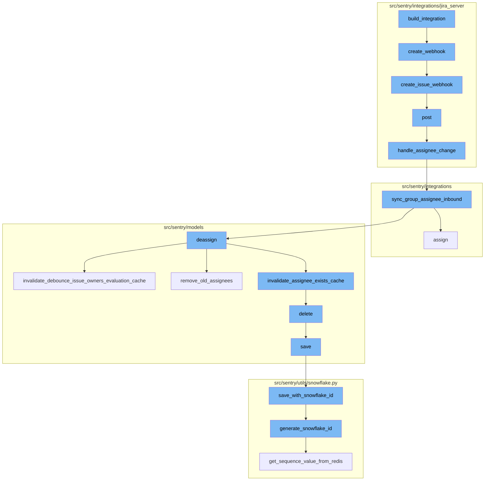
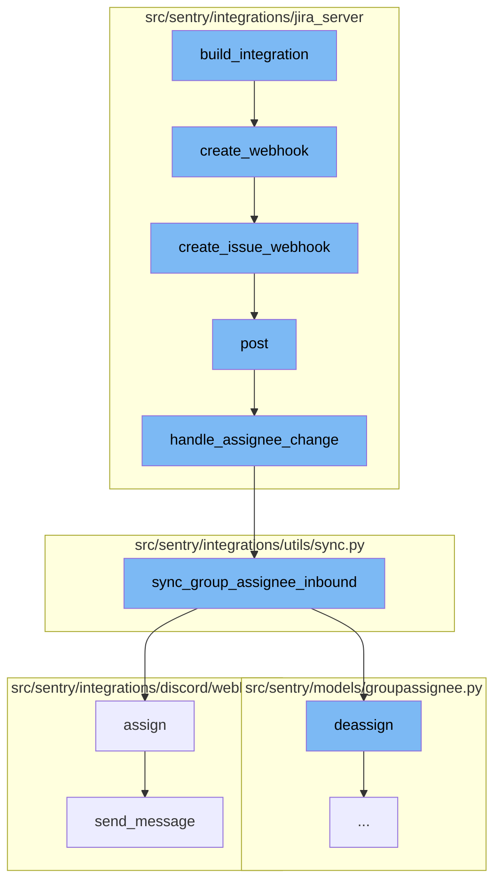
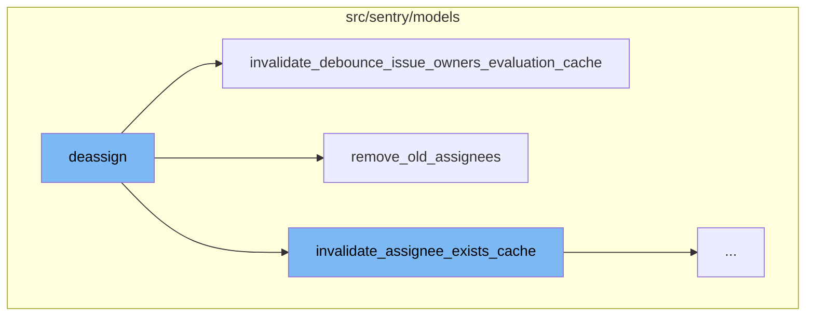
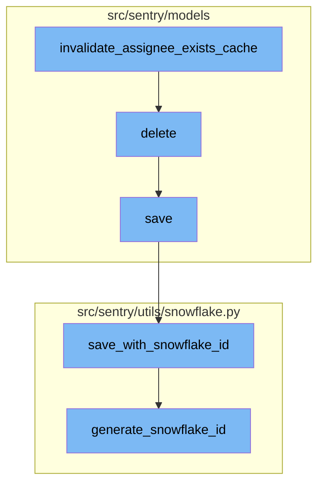

# Overview of build_integration

The `build_integration` process is a sequence of operations that prepares and sets up an integration in the Sentry application. It starts with the `build_integration` function, which prepares the integration data and generates a webhook secret. This function then calls the `create_webhook` function to create a webhook before the integration record exists.

<SwmSnippet path="/src/sentry/integrations/jira_server/integration.py" line="1180">

---

# Overview of build_integration

The `build_integration` function is the starting point of the flow. It prepares the integration data, generates a webhook secret, and calls the `create_webhook` function to create a webhook before the integration record exists.

```python
    def build_integration(self, state):
        install = state["installation_data"]
        access_token = state["access_token"]

        webhook_secret = sha1_text(install["private_key"]).hexdigest()

        hostname = urlparse(install["url"]).netloc
        external_id = "{}:{}".format(hostname, install["consumer_key"])[:64]

        credentials = {
            "consumer_key": install["consumer_key"],
            "private_key": install["private_key"],
            "access_token": access_token["oauth_token"],
            "access_token_secret": access_token["oauth_token_secret"],
        }
        # Create the webhook before the integration record exists
        # so that if it fails we don't persist a broken integration.
        self.create_webhook(external_id, webhook_secret, install, credentials)

        return {
            "name": install["consumer_key"],
```

---

</SwmSnippet>

<SwmSnippet path="/src/sentry/integrations/jira_server/integration.py" line="1217">

---

The `create_webhook` function creates a JiraServerSetupClient and attempts to create an issue webhook via the `create_issue_webhook` function. If the webhook creation fails, it logs the error and raises an IntegrationError.

```python
    def create_webhook(self, external_id, webhook_secret, install, credentials):
        client = JiraServerSetupClient(
            install["url"], install["consumer_key"], install["private_key"], install["verify_ssl"]
        )
        try:
            client.create_issue_webhook(external_id, webhook_secret, credentials)
        except ApiError as err:
            logger.info(
                "jira-server.webhook.failed",
                extra={"error": str(err), "external_id": external_id},
            )
            try:
                details = next(x for x in err.json["messages"][0].values())
            except (KeyError, TypeError, StopIteration):
                details = ""
            message = f"Could not create issue webhook in Jira. {details}"
            raise IntegrationError(message)
```

---

</SwmSnippet>

<SwmSnippet path="/src/sentry/integrations/jira_server/client.py" line="279">

---

The `create_issue_webhook` function creates a JWT token and constructs the data for the webhook. It then makes a POST request to the Jira Server API to create the webhook.

```python
    def create_issue_webhook(self, external_id, secret, credentials):
        auth = OAuth1(
            client_key=credentials["consumer_key"],
            rsa_key=credentials["private_key"],
            resource_owner_key=credentials["access_token"],
            resource_owner_secret=credentials["access_token_secret"],
            signature_method=SIGNATURE_RSA,
            signature_type="auth_header",
            decoding=None,
        )

        # Create a JWT token that we can add to the webhook URL
        # so we can locate the matching integration later.
        token = jwt.encode({"id": external_id}, secret)
        path = reverse("sentry-extensions-jiraserver-issue-updated", kwargs={"token": token})
        data = {
            "name": "Sentry Issue Sync",
            "url": absolute_uri(path),
            "events": ["jira:issue_created", "jira:issue_updated"],
        }
        return self.post("/rest/webhooks/1.0/webhook", auth=auth, data=data)
```

---

</SwmSnippet>

<SwmSnippet path="/src/sentry/integrations/jira_server/webhooks.py" line="63">

---

The `post` function handles the incoming webhook request. It validates the token, extracts the data from the request, and calls the `handle_assignee_change` function if the assignee has changed.

```python
    def post(self, request: Request, token, *args, **kwargs) -> Response:
        clear_tags_and_context()
        extra = {}
        try:
            integration = get_integration_from_token(token)
            extra["integration_id"] = integration.id
        except ValueError as err:
            extra.update({"token": token, "error": str(err)})
            logger.warning("token-validation-error", extra=extra)
            metrics.incr("jira_server.webhook.invalid_token")
            return self.respond(status=400)

        data = request.data

        # Note: If we ever process more webhooks from jira server
        # we also need to update JiraServerRequestParser
        if not data.get("changelog"):
            logger.info("missing-changelog", extra=extra)
            return self.respond()

        try:
```

---

</SwmSnippet>

<SwmSnippet path="/src/sentry/integrations/jira_server/utils/api.py" line="25">

---

The `handle_assignee_change` function checks if the assignee has changed. If the assignee is None, it calls the `sync_group_assignee_inbound` function with assign set to False. If the assignee is not None, it retrieves the assignee's email and calls the `sync_group_assignee_inbound` function with assign set to True.

```python
def handle_assignee_change(
    integration: RpcIntegration | Integration,
    data: Mapping[str, Any],
) -> None:
    assignee_changed = any(
        item for item in data["changelog"]["items"] if item["field"] == "assignee"
    )
    if not assignee_changed:
        return

    fields = data["issue"]["fields"]

    # If there is no assignee, assume it was unassigned.
    assignee = fields.get("assignee")
    issue_key = data["issue"]["key"]

    if assignee is None:
        sync_group_assignee_inbound(integration, None, issue_key, assign=False)
        return

    email = get_assignee_email(integration, assignee)
```

---

</SwmSnippet>

<SwmSnippet path="/src/sentry/integrations/utils/sync.py" line="64">

---

The `sync_group_assignee_inbound` function assigns linked groups to matching users. If assign is False, it deassigns the group. If assign is True, it assigns the group to the user.

```python
def sync_group_assignee_inbound(
    integration: RpcIntegration,
    email: str | None,
    external_issue_key: str,
    assign: bool = True,
) -> Sequence[Group]:
    """
    Given an integration, user email address and an external issue key,
    assign linked groups to matching users. Checks project membership.
    Returns a list of groups that were successfully assigned.
    """

    logger = logging.getLogger(f"sentry.integrations.{integration.provider}")

    orgs_with_sync_enabled = where_should_sync(integration, "inbound_assignee")
    affected_groups = Group.objects.get_groups_by_external_issue(
        integration,
        orgs_with_sync_enabled,
        external_issue_key,
    )
    log_context = {
```

---

</SwmSnippet>

<SwmSnippet path="/src/sentry/integrations/discord/webhooks/message_component.py" line="137">

---

The `assign` function updates the group with the selected assignee and sends a message indicating that the assignee has been updated.

```python
    def assign(self) -> Response:
        assignee = self.request.get_selected_options()[0]

        self.update_group(
            {
                "assignedTo": assignee,
                "integration": ActivityIntegration.DISCORD.value,
            }
        )

        logger.info(
            "discord.assign.dialog",
            extra={
                "assignee": assignee,
                "user": self.request.user,
            },
        )

        assert self.request.user is not None

        analytics.record(
```

---

</SwmSnippet>

# Deassigning and Cache Invalidation

The process also involves deassigning groups and invalidating caches. The `deassign` function removes the assignment of a group. It checks if there is a previous assignee for the group and deletes it. It also invalidates the assignee cache for the deassigned group and syncs the Sentry assignee to external issues if the feature is enabled.

<SwmSnippet path="/src/sentry/models/groupassignee.py" line="197">

---

# Deassigning and Cache Invalidation

The `deassign` function is responsible for removing the assignment of a group. It first checks if there is a previous assignee for the group and deletes it. Then, it creates an activity for the unassigned group and records the group history. It also invalidates the assignee cache for the deassigned group and syncs the Sentry assignee to external issues if the feature is enabled.

```python
    def deassign(
        self,
        group: Group,
        acting_user: User | RpcUser | None = None,
        assigned_to: Team | RpcUser | None = None,
        extra: dict[str, str] | None = None,
    ) -> None:
        from sentry.integrations.utils import sync_group_assignee_outbound
        from sentry.models.activity import Activity
        from sentry.models.projectownership import ProjectOwnership

        try:
            previous_groupassignee = self.get(group=group)
        except GroupAssignee.DoesNotExist:
            previous_groupassignee = None

        affected = self.filter(group=group)[:1].count()
        self.filter(group=group).delete()

        if affected > 0:
            Activity.objects.create_group_activity(group, ActivityType.UNASSIGNED, user=acting_user)
```

---

</SwmSnippet>

<SwmSnippet path="/src/sentry/models/groupowner.py" line="125">

---

The `invalidate_debounce_issue_owners_evaluation_cache` function is called within the `deassign` function. It clears the debounce issue owners cache for the group or for all groups for a project that had an event within a certain duration. This is done to ensure that the issue owners are evaluated correctly after the group has been deassigned.

```python
    def invalidate_debounce_issue_owners_evaluation_cache(cls, project_id, group_id=None):
        """
        If `group_id` is provided, clear the debounce issue owners cache for that group, else clear
        the cache of all groups for a project that had an event within the
        ISSUE_OWNERS_DEBOUNCE_DURATION window.
        """
        if group_id:
            cache.delete(ISSUE_OWNERS_DEBOUNCE_KEY(group_id))
            return

        # Get all the groups for a project that had an event within the ISSUE_OWNERS_DEBOUNCE_DURATION window.
        # Any groups without events in that window would have expired their TTL in the cache.
        queryset = Group.objects.filter(
            project_id=project_id,
            last_seen__gte=timezone.now() - timedelta(seconds=ISSUE_OWNERS_DEBOUNCE_DURATION),
        ).values_list("id", flat=True)

        # Run cache invalidation in batches
        group_id_iter = queryset.iterator(chunk_size=1000)
        while True:
            group_ids = list(itertools.islice(group_id_iter, 1000))
```

---

</SwmSnippet>

<SwmSnippet path="/src/sentry/models/groupassignee.py" line="65">

---

The `remove_old_assignees` function is also called within the `deassign` function. It removes the old assignees from the group. If the feature 'team-workflow-notifications' is enabled and there is a team assigned to the group, it deletes the group subscription for the team. If the new assignee is a user and is a member of the team, it removes the user from the team members and deletes the group subscription for the remaining team members. If the new assignee is a team and the old assignee is a user in the team, it does not remove the user. Otherwise, it deletes the group subscription for the user.

```python
    def remove_old_assignees(
        self,
        group: Group,
        previous_assignee: GroupAssignee | None,
        new_assignee_id: int | None = None,
        new_assignee_type: str | None = None,
    ) -> None:
        from sentry.models.team import Team

        if not previous_assignee:
            return

        if (
            features.has("organizations:team-workflow-notifications", group.organization)
            and previous_assignee.team
        ):
            GroupSubscription.objects.filter(
                group=group,
                project=group.project,
                team=previous_assignee.team,
                reason=GroupSubscriptionReason.assigned,
```

---

</SwmSnippet>

<SwmSnippet path="/src/sentry/models/groupowner.py" line="152">

---

The `invalidate_assignee_exists_cache` function is used to clear the assignee exists cache. If a `group_id` is provided, the cache for that group is cleared. Otherwise, the cache of all groups for a project that had an event within the `ASSIGNEE_EXISTS_DURATION` window is cleared.

```python
    def invalidate_assignee_exists_cache(cls, project_id, group_id=None):
        """
        If `group_id` is provided, clear the assignee exists cache for that group, else
        clear the cache of all groups for a project that had an event within the
        ASSIGNEE_EXISTS_DURATION window.
        """
        if group_id:
            cache.delete(ASSIGNEE_EXISTS_KEY(group_id))
            return

        # Get all the groups for a project that had an event within the ASSIGNEE_EXISTS_DURATION window.
        # Any groups without events in that window would have expired their TTL in the cache.
        queryset = Group.objects.filter(
            project_id=project_id,
            last_seen__gte=timezone.now() - timedelta(seconds=ASSIGNEE_EXISTS_DURATION),
        ).values_list("id", flat=True)

        # Run cache invalidation in batches
        group_id_iter = queryset.iterator(chunk_size=1000)
        while True:
            group_ids = list(itertools.islice(group_id_iter, 1000))
```

---

</SwmSnippet>

# Deleting and Saving

The process concludes with deleting and saving operations. The `delete` function is used to delete a project. Since there is no foreign key relationship, we have to manually cascade. The function also removes notification settings for the project. The `save` function is used to save a project. If the project doesn't have a slug, it generates one. If `SENTRY_USE_SNOWFLAKE` is set, it saves the project with a snowflake id.

<SwmSnippet path="/src/sentry/models/project.py" line="722">

---

# Deleting and Saving

The `delete` function is used to delete a project. Since there is no foreign key relationship, we have to manually cascade. The function also removes notification settings for the project.

```python
    def delete(self, **kwargs):
        # There is no foreign key relationship so we have to manually cascade.
        notifications_service.remove_notification_settings_for_project(project_id=self.id)

        with outbox_context(transaction.atomic(router.db_for_write(Project))):
            Project.outbox_for_update(self.id, self.organization_id).save()
            return super().delete(**kwargs)
```

---

</SwmSnippet>

<SwmSnippet path="/src/sentry/models/project.py" line="365">

---

The `save` function is used to save a project. If the project doesn't have a slug, it generates one. If `SENTRY_USE_SNOWFLAKE` is set, it saves the project with a snowflake id.

```python
    def save(self, *args, **kwargs):
        if not self.slug:
            lock = locks.get(
                f"slug:project:{self.organization_id}", duration=5, name="project_slug"
            )
            with TimedRetryPolicy(10)(lock.acquire):
                slugify_instance(
                    self,
                    self.name,
                    organization=self.organization,
                    reserved=RESERVED_PROJECT_SLUGS,
                    max_length=50,
                )

        if SENTRY_USE_SNOWFLAKE:
            snowflake_redis_key = "project_snowflake_key"
            save_with_snowflake_id(
                instance=self,
                snowflake_redis_key=snowflake_redis_key,
                save_callback=lambda: super(Project, self).save(*args, **kwargs),
            )
```

---

</SwmSnippet>

<SwmSnippet path="/src/sentry/utils/snowflake.py" line="47">

---

The `save_with_snowflake_id` function is used to save a model instance with a snowflake id. If the instance doesn't have an id, it generates one using the `generate_snowflake_id` function.

```python
def save_with_snowflake_id(
    instance: BaseModel, snowflake_redis_key: str, save_callback: Callable[[], object]
) -> None:
    assert uses_snowflake_id(
        instance.__class__
    ), "Only models decorated with uses_snowflake_id can be saved with save_with_snowflake_id()"

    for _ in range(settings.MAX_REDIS_SNOWFLAKE_RETRY_COUNTER):
        if not instance.id:
            instance.id = generate_snowflake_id(snowflake_redis_key)
        try:
            with enforce_constraints(transaction.atomic(using=router.db_for_write(type(instance)))):
                save_callback()
            return
        except IntegrityError:
            instance.id = None  # type: ignore[assignment]  # see typeddjango/django-stubs#2014
    raise MaxSnowflakeRetryError
```

---

</SwmSnippet>

<SwmSnippet path="/src/sentry/utils/snowflake.py" line="113">

---

The `generate_snowflake_id` function is used to generate a snowflake id. It creates a unique id based on the current time, region, and a sequence value from Redis.

```python
def generate_snowflake_id(redis_key: str) -> int:
    segment_values = {}

    segment_values[VERSION_ID] = msb_0_ordering(settings.SNOWFLAKE_VERSION_ID, VERSION_ID.length)

    try:
        segment_values[REGION_ID] = get_local_region().snowflake_id
    except RegionContextError:  # expected if running in monolith mode
        segment_values[REGION_ID] = NULL_REGION_ID

    current_time = datetime.now().timestamp()
    # supports up to 130 years
    segment_values[TIME_DIFFERENCE] = int(current_time - settings.SENTRY_SNOWFLAKE_EPOCH_START)

    snowflake_id = 0
    (
        segment_values[TIME_DIFFERENCE],
        segment_values[REGION_SEQUENCE],
    ) = get_sequence_value_from_redis(redis_key, segment_values[TIME_DIFFERENCE])

    for segment in BIT_SEGMENT_SCHEMA:
```

---

</SwmSnippet>



# Flow drill down

First, we'll zoom into this section of the flow:



<SwmSnippet path="/src/sentry/integrations/jira_server/integration.py" line="1180">

---

# build_integration

The `build_integration` function is the starting point of the flow. It prepares the integration data, generates a webhook secret, and calls the `create_webhook` function to create a webhook before the integration record exists.

```python
    def build_integration(self, state):
        install = state["installation_data"]
        access_token = state["access_token"]

        webhook_secret = sha1_text(install["private_key"]).hexdigest()

        hostname = urlparse(install["url"]).netloc
        external_id = "{}:{}".format(hostname, install["consumer_key"])[:64]

        credentials = {
            "consumer_key": install["consumer_key"],
            "private_key": install["private_key"],
            "access_token": access_token["oauth_token"],
            "access_token_secret": access_token["oauth_token_secret"],
        }
        # Create the webhook before the integration record exists
        # so that if it fails we don't persist a broken integration.
        self.create_webhook(external_id, webhook_secret, install, credentials)

        return {
            "name": install["consumer_key"],
```

---

</SwmSnippet>

<SwmSnippet path="/src/sentry/integrations/jira_server/integration.py" line="1217">

---

## create_webhook

The `create_webhook` function creates a JiraServerSetupClient and attempts to create an issue webhook via the `create_issue_webhook` function. If the webhook creation fails, it logs the error and raises an IntegrationError.

```python
    def create_webhook(self, external_id, webhook_secret, install, credentials):
        client = JiraServerSetupClient(
            install["url"], install["consumer_key"], install["private_key"], install["verify_ssl"]
        )
        try:
            client.create_issue_webhook(external_id, webhook_secret, credentials)
        except ApiError as err:
            logger.info(
                "jira-server.webhook.failed",
                extra={"error": str(err), "external_id": external_id},
            )
            try:
                details = next(x for x in err.json["messages"][0].values())
            except (KeyError, TypeError, StopIteration):
                details = ""
            message = f"Could not create issue webhook in Jira. {details}"
            raise IntegrationError(message)
```

---

</SwmSnippet>

<SwmSnippet path="/src/sentry/integrations/jira_server/client.py" line="279">

---

### create_issue_webhook

The `create_issue_webhook` function creates a JWT token and constructs the data for the webhook. It then makes a POST request to the Jira Server API to create the webhook.

```python
    def create_issue_webhook(self, external_id, secret, credentials):
        auth = OAuth1(
            client_key=credentials["consumer_key"],
            rsa_key=credentials["private_key"],
            resource_owner_key=credentials["access_token"],
            resource_owner_secret=credentials["access_token_secret"],
            signature_method=SIGNATURE_RSA,
            signature_type="auth_header",
            decoding=None,
        )

        # Create a JWT token that we can add to the webhook URL
        # so we can locate the matching integration later.
        token = jwt.encode({"id": external_id}, secret)
        path = reverse("sentry-extensions-jiraserver-issue-updated", kwargs={"token": token})
        data = {
            "name": "Sentry Issue Sync",
            "url": absolute_uri(path),
            "events": ["jira:issue_created", "jira:issue_updated"],
        }
        return self.post("/rest/webhooks/1.0/webhook", auth=auth, data=data)
```

---

</SwmSnippet>

<SwmSnippet path="/src/sentry/integrations/jira_server/webhooks.py" line="63">

---

#### post

The `post` function handles the incoming webhook request. It validates the token, extracts the data from the request, and calls the `handle_assignee_change` function if the assignee has changed.

```python
    def post(self, request: Request, token, *args, **kwargs) -> Response:
        clear_tags_and_context()
        extra = {}
        try:
            integration = get_integration_from_token(token)
            extra["integration_id"] = integration.id
        except ValueError as err:
            extra.update({"token": token, "error": str(err)})
            logger.warning("token-validation-error", extra=extra)
            metrics.incr("jira_server.webhook.invalid_token")
            return self.respond(status=400)

        data = request.data

        # Note: If we ever process more webhooks from jira server
        # we also need to update JiraServerRequestParser
        if not data.get("changelog"):
            logger.info("missing-changelog", extra=extra)
            return self.respond()

        try:
```

---

</SwmSnippet>

<SwmSnippet path="/src/sentry/integrations/jira_server/utils/api.py" line="25">

---

##### handle_assignee_change

The `handle_assignee_change` function checks if the assignee has changed. If the assignee is None, it calls the `sync_group_assignee_inbound` function with assign set to False. If the assignee is not None, it retrieves the assignee's email and calls the `sync_group_assignee_inbound` function with assign set to True.

```python
def handle_assignee_change(
    integration: RpcIntegration | Integration,
    data: Mapping[str, Any],
) -> None:
    assignee_changed = any(
        item for item in data["changelog"]["items"] if item["field"] == "assignee"
    )
    if not assignee_changed:
        return

    fields = data["issue"]["fields"]

    # If there is no assignee, assume it was unassigned.
    assignee = fields.get("assignee")
    issue_key = data["issue"]["key"]

    if assignee is None:
        sync_group_assignee_inbound(integration, None, issue_key, assign=False)
        return

    email = get_assignee_email(integration, assignee)
```

---

</SwmSnippet>

<SwmSnippet path="/src/sentry/integrations/utils/sync.py" line="64">

---

###### sync_group_assignee_inbound

The `sync_group_assignee_inbound` function assigns linked groups to matching users. If assign is False, it deassigns the group. If assign is True, it assigns the group to the user.

```python
def sync_group_assignee_inbound(
    integration: RpcIntegration,
    email: str | None,
    external_issue_key: str,
    assign: bool = True,
) -> Sequence[Group]:
    """
    Given an integration, user email address and an external issue key,
    assign linked groups to matching users. Checks project membership.
    Returns a list of groups that were successfully assigned.
    """

    logger = logging.getLogger(f"sentry.integrations.{integration.provider}")

    orgs_with_sync_enabled = where_should_sync(integration, "inbound_assignee")
    affected_groups = Group.objects.get_groups_by_external_issue(
        integration,
        orgs_with_sync_enabled,
        external_issue_key,
    )
    log_context = {
```

---

</SwmSnippet>

<SwmSnippet path="/src/sentry/integrations/discord/webhooks/message_component.py" line="137">

---

####### assign The `assign` function updates the group with the selected assignee and sends a message indicating that the assignee has been updated.

```python
    def assign(self) -> Response:
        assignee = self.request.get_selected_options()[0]

        self.update_group(
            {
                "assignedTo": assignee,
                "integration": ActivityIntegration.DISCORD.value,
            }
        )

        logger.info(
            "discord.assign.dialog",
            extra={
                "assignee": assignee,
                "user": self.request.user,
            },
        )

        assert self.request.user is not None

        analytics.record(
```

---

</SwmSnippet>

Now, lets zoom into this section of the flow:



<SwmSnippet path="/src/sentry/models/groupassignee.py" line="197">

---

# Deassign Function

The `deassign` function is responsible for removing the assignment of a group. It first checks if there is a previous assignee for the group and deletes it. Then, it creates an activity for the unassigned group and records the group history. It also invalidates the assignee cache for the deassigned group and syncs the Sentry assignee to external issues if the feature is enabled.

```python
    def deassign(
        self,
        group: Group,
        acting_user: User | RpcUser | None = None,
        assigned_to: Team | RpcUser | None = None,
        extra: dict[str, str] | None = None,
    ) -> None:
        from sentry.integrations.utils import sync_group_assignee_outbound
        from sentry.models.activity import Activity
        from sentry.models.projectownership import ProjectOwnership

        try:
            previous_groupassignee = self.get(group=group)
        except GroupAssignee.DoesNotExist:
            previous_groupassignee = None

        affected = self.filter(group=group)[:1].count()
        self.filter(group=group).delete()

        if affected > 0:
            Activity.objects.create_group_activity(group, ActivityType.UNASSIGNED, user=acting_user)
```

---

</SwmSnippet>

<SwmSnippet path="/src/sentry/models/groupowner.py" line="125">

---

# Invalidate Debounce Issue Owners Evaluation Cache Function

The `invalidate_debounce_issue_owners_evaluation_cache` function is called within the `deassign` function. It clears the debounce issue owners cache for the group or for all groups for a project that had an event within a certain duration. This is done to ensure that the issue owners are evaluated correctly after the group has been deassigned.

```python
    def invalidate_debounce_issue_owners_evaluation_cache(cls, project_id, group_id=None):
        """
        If `group_id` is provided, clear the debounce issue owners cache for that group, else clear
        the cache of all groups for a project that had an event within the
        ISSUE_OWNERS_DEBOUNCE_DURATION window.
        """
        if group_id:
            cache.delete(ISSUE_OWNERS_DEBOUNCE_KEY(group_id))
            return

        # Get all the groups for a project that had an event within the ISSUE_OWNERS_DEBOUNCE_DURATION window.
        # Any groups without events in that window would have expired their TTL in the cache.
        queryset = Group.objects.filter(
            project_id=project_id,
            last_seen__gte=timezone.now() - timedelta(seconds=ISSUE_OWNERS_DEBOUNCE_DURATION),
        ).values_list("id", flat=True)

        # Run cache invalidation in batches
        group_id_iter = queryset.iterator(chunk_size=1000)
        while True:
            group_ids = list(itertools.islice(group_id_iter, 1000))
```

---

</SwmSnippet>

<SwmSnippet path="/src/sentry/models/groupassignee.py" line="65">

---

# Remove Old Assignees Function

The `remove_old_assignees` function is also called within the `deassign` function. It removes the old assignees from the group. If the feature 'team-workflow-notifications' is enabled and there is a team assigned to the group, it deletes the group subscription for the team. If the new assignee is a user and is a member of the team, it removes the user from the team members and deletes the group subscription for the remaining team members. If the new assignee is a team and the old assignee is a user in the team, it does not remove the user. Otherwise, it deletes the group subscription for the user.

```python
    def remove_old_assignees(
        self,
        group: Group,
        previous_assignee: GroupAssignee | None,
        new_assignee_id: int | None = None,
        new_assignee_type: str | None = None,
    ) -> None:
        from sentry.models.team import Team

        if not previous_assignee:
            return

        if (
            features.has("organizations:team-workflow-notifications", group.organization)
            and previous_assignee.team
        ):
            GroupSubscription.objects.filter(
                group=group,
                project=group.project,
                team=previous_assignee.team,
                reason=GroupSubscriptionReason.assigned,
```

---

</SwmSnippet>

Now, lets zoom into this section of the flow:



<SwmSnippet path="/src/sentry/models/groupowner.py" line="152">

---

# Invalidate Assignee Exists Cache

The `invalidate_assignee_exists_cache` function is used to clear the assignee exists cache. If a `group_id` is provided, the cache for that group is cleared. Otherwise, the cache of all groups for a project that had an event within the `ASSIGNEE_EXISTS_DURATION` window is cleared.

```python
    def invalidate_assignee_exists_cache(cls, project_id, group_id=None):
        """
        If `group_id` is provided, clear the assignee exists cache for that group, else
        clear the cache of all groups for a project that had an event within the
        ASSIGNEE_EXISTS_DURATION window.
        """
        if group_id:
            cache.delete(ASSIGNEE_EXISTS_KEY(group_id))
            return

        # Get all the groups for a project that had an event within the ASSIGNEE_EXISTS_DURATION window.
        # Any groups without events in that window would have expired their TTL in the cache.
        queryset = Group.objects.filter(
            project_id=project_id,
            last_seen__gte=timezone.now() - timedelta(seconds=ASSIGNEE_EXISTS_DURATION),
        ).values_list("id", flat=True)

        # Run cache invalidation in batches
        group_id_iter = queryset.iterator(chunk_size=1000)
        while True:
            group_ids = list(itertools.islice(group_id_iter, 1000))
```

---

</SwmSnippet>

<SwmSnippet path="/src/sentry/models/project.py" line="722">

---

# Delete Project

The `delete` function is used to delete a project. Since there is no foreign key relationship, we have to manually cascade. The function also removes notification settings for the project.

```python
    def delete(self, **kwargs):
        # There is no foreign key relationship so we have to manually cascade.
        notifications_service.remove_notification_settings_for_project(project_id=self.id)

        with outbox_context(transaction.atomic(router.db_for_write(Project))):
            Project.outbox_for_update(self.id, self.organization_id).save()
            return super().delete(**kwargs)
```

---

</SwmSnippet>

<SwmSnippet path="/src/sentry/models/project.py" line="365">

---

# Save Project

The `save` function is used to save a project. If the project doesn't have a slug, it generates one. If `SENTRY_USE_SNOWFLAKE` is set, it saves the project with a snowflake id.

```python
    def save(self, *args, **kwargs):
        if not self.slug:
            lock = locks.get(
                f"slug:project:{self.organization_id}", duration=5, name="project_slug"
            )
            with TimedRetryPolicy(10)(lock.acquire):
                slugify_instance(
                    self,
                    self.name,
                    organization=self.organization,
                    reserved=RESERVED_PROJECT_SLUGS,
                    max_length=50,
                )

        if SENTRY_USE_SNOWFLAKE:
            snowflake_redis_key = "project_snowflake_key"
            save_with_snowflake_id(
                instance=self,
                snowflake_redis_key=snowflake_redis_key,
                save_callback=lambda: super(Project, self).save(*args, **kwargs),
            )
```

---

</SwmSnippet>

<SwmSnippet path="/src/sentry/utils/snowflake.py" line="47">

---

# Save with Snowflake ID

The `save_with_snowflake_id` function is used to save a model instance with a snowflake id. If the instance doesn't have an id, it generates one using the `generate_snowflake_id` function.

```python
def save_with_snowflake_id(
    instance: BaseModel, snowflake_redis_key: str, save_callback: Callable[[], object]
) -> None:
    assert uses_snowflake_id(
        instance.__class__
    ), "Only models decorated with uses_snowflake_id can be saved with save_with_snowflake_id()"

    for _ in range(settings.MAX_REDIS_SNOWFLAKE_RETRY_COUNTER):
        if not instance.id:
            instance.id = generate_snowflake_id(snowflake_redis_key)
        try:
            with enforce_constraints(transaction.atomic(using=router.db_for_write(type(instance)))):
                save_callback()
            return
        except IntegrityError:
            instance.id = None  # type: ignore[assignment]  # see typeddjango/django-stubs#2014
    raise MaxSnowflakeRetryError
```

---

</SwmSnippet>

<SwmSnippet path="/src/sentry/utils/snowflake.py" line="113">

---

# Generate Snowflake ID

The `generate_snowflake_id` function is used to generate a snowflake id. It creates a unique id based on the current time, region, and a sequence value from Redis.

```python
def generate_snowflake_id(redis_key: str) -> int:
    segment_values = {}

    segment_values[VERSION_ID] = msb_0_ordering(settings.SNOWFLAKE_VERSION_ID, VERSION_ID.length)

    try:
        segment_values[REGION_ID] = get_local_region().snowflake_id
    except RegionContextError:  # expected if running in monolith mode
        segment_values[REGION_ID] = NULL_REGION_ID

    current_time = datetime.now().timestamp()
    # supports up to 130 years
    segment_values[TIME_DIFFERENCE] = int(current_time - settings.SENTRY_SNOWFLAKE_EPOCH_START)

    snowflake_id = 0
    (
        segment_values[TIME_DIFFERENCE],
        segment_values[REGION_SEQUENCE],
    ) = get_sequence_value_from_redis(redis_key, segment_values[TIME_DIFFERENCE])

    for segment in BIT_SEGMENT_SCHEMA:
```

---

</SwmSnippet>

&nbsp;

*This is an auto-generated document by Swimm AI 🌊 and has not yet been verified by a human*

<SwmMeta version="3.0.0" repo-id="Z2l0aHViJTNBJTNBc2VudHJ5LWRlbW8lM0ElM0FTd2ltbS1EZW1v" repo-name="sentry-demo" doc-type="flows"><sup>Powered by [Swimm](/)</sup></SwmMeta>
