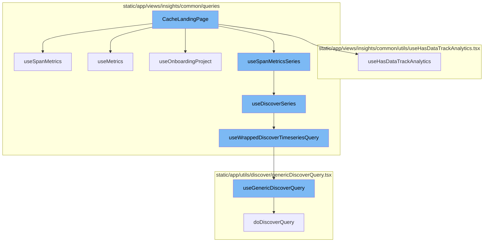
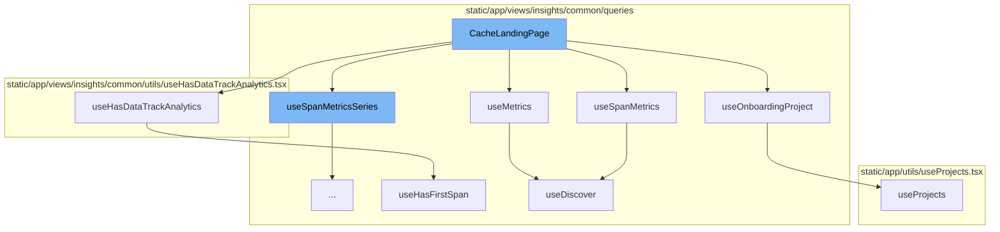
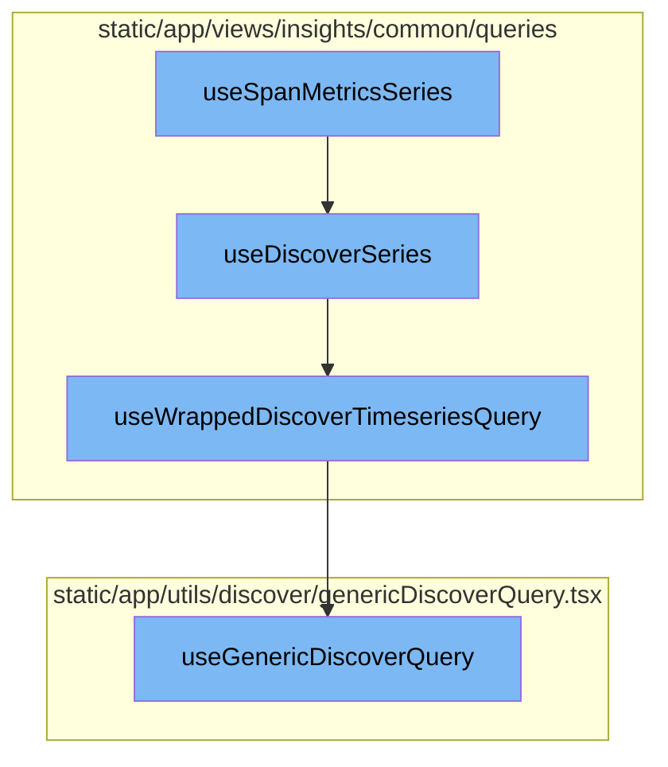

# CacheLandingPage Overview

The `CacheLandingPage` is a key component in the Sentry application. It is responsible for displaying cache insights to the user. The page fetches and manages data required for its various components using several hooks. These hooks include `useSpanMetricsSeries`, `useSpanMetrics`, `useMetrics`, `useOnboardingProject`, and `useHasDataTrackAnalytics`.

<SwmSnippet path="/static/app/views/insights/cache/views/cacheLandingPage.tsx" line="82">

---

## useSpanMetricsSeries Hook

The `useSpanMetricsSeries` hook is used twice in the `CacheLandingPage` function to fetch data for the cache miss rate and throughput charts. The data is then passed to the respective chart components for rendering.

```tsx
  const {
    isLoading: isCacheMissRateLoading,
    data: cacheMissRateData,
    error: cacheMissRateError,
  } = useSpanMetricsSeries(
    {
      yAxis: [`${CACHE_MISS_RATE}()`],
      search: MutableSearch.fromQueryObject(BASE_FILTERS),
    },
    Referrer.LANDING_CACHE_HIT_MISS_CHART
  );

  const {
    isLoading: isThroughputDataLoading,
    data: throughputData,
    error: throughputError,
  } = useSpanMetricsSeries(
    {
      search: MutableSearch.fromQueryObject(BASE_FILTERS),
      yAxis: ['spm()'],
    },
```

---

</SwmSnippet>

<SwmSnippet path="/static/app/views/insights/cache/views/cacheLandingPage.tsx" line="106">

---

## useSpanMetrics Hook

The `useSpanMetrics` hook is used to fetch data for the transactions list. The data is then passed to the `TransactionsTable` component for rendering.

```tsx
  const {
    isFetching: isTransactionsListFetching,
    data: transactionsList,
    meta: transactionsListMeta,
    error: transactionsListError,
    pageLinks: transactionsListPageLinks,
  } = useSpanMetrics(
    {
      search: MutableSearch.fromQueryObject(BASE_FILTERS),
      fields: [
        'project',
        'project.id',
        'transaction',
        'spm()',
        `${CACHE_MISS_RATE}()`,
        'sum(span.self_time)',
        'time_spent_percentage()',
        `avg(${CACHE_ITEM_SIZE})`,
      ],
      sorts: [sort],
      cursor,
```

---

</SwmSnippet>

<SwmSnippet path="/static/app/views/insights/cache/views/cacheLandingPage.tsx" line="132">

---

## useMetrics Hook

The `useMetrics` hook is used to fetch transaction duration data. The data is then used to augment the transactions list with duration information.

```tsx
  const {
    data: transactionDurationData,
    error: transactionDurationError,
    meta: transactionDurationMeta,
    isFetching: isTransactionDurationFetching,
  } = useMetrics(
    {
      search: `transaction:[${transactionsList.map(({transaction}) => `"${transaction}"`).join(',')}]`,
      fields: [`avg(transaction.duration)`, 'transaction'],
      enabled: !isTransactionsListFetching && transactionsList.length > 0,
    },
    Referrer.LANDING_CACHE_TRANSACTION_DURATION
  );
```

---

</SwmSnippet>

<SwmSnippet path="/static/app/views/insights/cache/views/cacheLandingPage.tsx" line="146">

---

## useOnboardingProject Hook

The `useOnboardingProject` hook is used to determine if there's an onboarding project. This information is used to control the display of page information.

```tsx
  const onboardingProject = useOnboardingProject();
```

---

</SwmSnippet>

<SwmSnippet path="/static/app/views/insights/cache/views/cacheLandingPage.tsx" line="149">

---

## useHasDataTrackAnalytics Hook

The `useHasDataTrackAnalytics` hook is used to track analytics data for the cache insights page.

```tsx
  useHasDataTrackAnalytics(ModuleName.CACHE, 'insight.page_loads.cache');
```

---

</SwmSnippet>

# Data Fetching Flow

The data fetching flow starts with the `useSpanMetricsSeries` function, which calls the `useDiscoverSeries` function. The `useDiscoverSeries` function then calls `useWrappedDiscoverTimeseriesQuery` with the `eventView` and other parameters. Finally, `useWrappedDiscoverTimeseriesQuery` calls `useGenericDiscoverQuery` with a payload created from the `eventView` and other parameters. The data returned from `useGenericDiscoverQuery` is then processed and returned.

<SwmSnippet path="/static/app/views/insights/common/queries/useDiscoverSeries.ts" line="30">

---

## useSpanMetricsSeries Function

The `useSpanMetricsSeries` function is the starting point of our flow. It calls the `useDiscoverSeries` function with the provided options, a constant dataset, and a referrer.

```typescript
export const useSpanMetricsSeries = <Fields extends SpanMetricsProperty[]>(
  options: UseMetricsSeriesOptions<Fields> = {},
  referrer: string
) => {
  return useDiscoverSeries<Fields>(options, DiscoverDatasets.SPANS_METRICS, referrer);
};
```

---

</SwmSnippet>

<SwmSnippet path="/static/app/views/insights/common/queries/useDiscoverSeries.ts" line="56">

---

## useDiscoverSeries Function

The `useDiscoverSeries` function takes in options, a dataset, and a referrer. It uses these to create an `eventView` and then calls `useWrappedDiscoverTimeseriesQuery` with the `eventView` and other parameters. It also processes the data returned from `useWrappedDiscoverTimeseriesQuery` and returns it.

```typescript
const useDiscoverSeries = <T extends string[]>(
  options: UseMetricsSeriesOptions<T> = {},
  dataset: DiscoverDatasets,
  referrer: string
) => {
  const {search = undefined, yAxis = [], interval = undefined} = options;

  const pageFilters = usePageFilters();

  const eventView = getSeriesEventView(
    search,
    undefined,
    pageFilters.selection,
    yAxis,
    undefined,
    dataset
  );

  if (interval) {
    eventView.interval = interval;
  }
```

---

</SwmSnippet>

<SwmSnippet path="/static/app/views/insights/common/queries/useSpansQuery.tsx" line="63">

---

## useWrappedDiscoverTimeseriesQuery Function

The `useWrappedDiscoverTimeseriesQuery` function takes in an `eventView` and other parameters. It uses these to call `useGenericDiscoverQuery` with a payload created from the `eventView` and other parameters. It processes the data returned from `useGenericDiscoverQuery` and returns it.

```tsx
export function useWrappedDiscoverTimeseriesQuery<T>({
  eventView,
  enabled,
  initialData,
  referrer,
  cursor,
  overriddenRoute,
}: {
  eventView: EventView;
  cursor?: string;
  enabled?: boolean;
  initialData?: any;
  overriddenRoute?: string;
  referrer?: string;
}) {
  const location = useLocation();
  const organization = useOrganization();
  const {isReady: pageFiltersReady} = usePageFilters();
  const result = useGenericDiscoverQuery<
    {
      data: any[];
```

---

</SwmSnippet>

<SwmSnippet path="/static/app/utils/discover/genericDiscoverQuery.tsx" line="419">

---

## useGenericDiscoverQuery Function

The `useGenericDiscoverQuery` function is the final step in our flow. It takes in properties, uses these to create a URL and a payload, and then makes a query to the API with these. It returns the data from the API response.

```tsx
export function useGenericDiscoverQuery<T, P>(props: Props<T, P>) {
  const api = useApi();
  const {orgSlug, route, options} = props;
  const url = `/organizations/${orgSlug}/${route}/`;
  const apiPayload = getPayload<T, P>(props);

  const res = useQuery<[T, string | undefined, ResponseMeta<T> | undefined], QueryError>(
    [route, apiPayload],
    ({signal: _signal}) =>
      doDiscoverQuery<T>(api, url, apiPayload, {
        queryBatching: props.queryBatching,
        skipAbort: props.skipAbort,
      }),
    options
  );

  return {
    ...res,
    data: res.data?.[0] ?? undefined,
    error: parseError(res.error),
    statusCode: res.data?.[1] ?? undefined,
```

---

</SwmSnippet>



# Flow drill down

First, we'll zoom into this section of the flow:



<SwmSnippet path="/static/app/views/insights/cache/views/cacheLandingPage.tsx" line="73">

---

# CacheLandingPage Function

The `CacheLandingPage` function is the main component of the cache landing page. It uses several hooks to fetch and manage data required for the page. It also handles the rendering of the page layout and its components.

```tsx
export function CacheLandingPage() {
  const location = useLocation();
  const {setPageInfo, pageAlert} = usePageAlert();

  const sortField = decodeScalar(location.query?.[QueryParameterNames.TRANSACTIONS_SORT]);

  const sort = decodeSorts(sortField).filter(isAValidSort).at(0) ?? DEFAULT_SORT;
  const cursor = decodeScalar(location.query?.[QueryParameterNames.TRANSACTIONS_CURSOR]);

  const {
    isLoading: isCacheMissRateLoading,
    data: cacheMissRateData,
    error: cacheMissRateError,
  } = useSpanMetricsSeries(
    {
      yAxis: [`${CACHE_MISS_RATE}()`],
      search: MutableSearch.fromQueryObject(BASE_FILTERS),
    },
    Referrer.LANDING_CACHE_HIT_MISS_CHART
  );

```

---

</SwmSnippet>

<SwmSnippet path="/static/app/views/insights/cache/views/cacheLandingPage.tsx" line="82">

---

## useSpanMetricsSeries Hook

The `useSpanMetricsSeries` hook is used twice in the `CacheLandingPage` function to fetch data for the cache miss rate and throughput charts. The data is then passed to the respective chart components for rendering.

```tsx
  const {
    isLoading: isCacheMissRateLoading,
    data: cacheMissRateData,
    error: cacheMissRateError,
  } = useSpanMetricsSeries(
    {
      yAxis: [`${CACHE_MISS_RATE}()`],
      search: MutableSearch.fromQueryObject(BASE_FILTERS),
    },
    Referrer.LANDING_CACHE_HIT_MISS_CHART
  );

  const {
    isLoading: isThroughputDataLoading,
    data: throughputData,
    error: throughputError,
  } = useSpanMetricsSeries(
    {
      search: MutableSearch.fromQueryObject(BASE_FILTERS),
      yAxis: ['spm()'],
    },
```

---

</SwmSnippet>

<SwmSnippet path="/static/app/views/insights/cache/views/cacheLandingPage.tsx" line="106">

---

## useSpanMetrics Hook

The `useSpanMetrics` hook is used to fetch data for the transactions list. The data is then passed to the `TransactionsTable` component for rendering.

```tsx
  const {
    isFetching: isTransactionsListFetching,
    data: transactionsList,
    meta: transactionsListMeta,
    error: transactionsListError,
    pageLinks: transactionsListPageLinks,
  } = useSpanMetrics(
    {
      search: MutableSearch.fromQueryObject(BASE_FILTERS),
      fields: [
        'project',
        'project.id',
        'transaction',
        'spm()',
        `${CACHE_MISS_RATE}()`,
        'sum(span.self_time)',
        'time_spent_percentage()',
        `avg(${CACHE_ITEM_SIZE})`,
      ],
      sorts: [sort],
      cursor,
```

---

</SwmSnippet>

<SwmSnippet path="/static/app/views/insights/cache/views/cacheLandingPage.tsx" line="132">

---

## useMetrics Hook

The `useMetrics` hook is used to fetch transaction duration data. The data is then used to augment the transactions list with duration information.

```tsx
  const {
    data: transactionDurationData,
    error: transactionDurationError,
    meta: transactionDurationMeta,
    isFetching: isTransactionDurationFetching,
  } = useMetrics(
    {
      search: `transaction:[${transactionsList.map(({transaction}) => `"${transaction}"`).join(',')}]`,
      fields: [`avg(transaction.duration)`, 'transaction'],
      enabled: !isTransactionsListFetching && transactionsList.length > 0,
    },
    Referrer.LANDING_CACHE_TRANSACTION_DURATION
  );
```

---

</SwmSnippet>

<SwmSnippet path="/static/app/views/insights/cache/views/cacheLandingPage.tsx" line="146">

---

## useOnboardingProject Hook

The `useOnboardingProject` hook is used to determine if there's an onboarding project. This information is used to control the display of page information.

```tsx
  const onboardingProject = useOnboardingProject();
```

---

</SwmSnippet>

<SwmSnippet path="/static/app/views/insights/cache/views/cacheLandingPage.tsx" line="149">

---

## useHasDataTrackAnalytics Hook

The `useHasDataTrackAnalytics` hook is used to track analytics data for the cache insights page.

```tsx
  useHasDataTrackAnalytics(ModuleName.CACHE, 'insight.page_loads.cache');
```

---

</SwmSnippet>

Now, lets zoom into this section of the flow:



<SwmSnippet path="/static/app/views/insights/common/queries/useDiscoverSeries.ts" line="30">

---

# useSpanMetricsSeries

The `useSpanMetricsSeries` function is the starting point of our flow. It calls the `useDiscoverSeries` function with the provided options, a constant dataset, and a referrer.

```typescript
export const useSpanMetricsSeries = <Fields extends SpanMetricsProperty[]>(
  options: UseMetricsSeriesOptions<Fields> = {},
  referrer: string
) => {
  return useDiscoverSeries<Fields>(options, DiscoverDatasets.SPANS_METRICS, referrer);
};
```

---

</SwmSnippet>

<SwmSnippet path="/static/app/views/insights/common/queries/useDiscoverSeries.ts" line="56">

---

# useDiscoverSeries

The `useDiscoverSeries` function takes in options, a dataset, and a referrer. It uses these to create an `eventView` and then calls `useWrappedDiscoverTimeseriesQuery` with the `eventView` and other parameters. It also processes the data returned from `useWrappedDiscoverTimeseriesQuery` and returns it.

```typescript
const useDiscoverSeries = <T extends string[]>(
  options: UseMetricsSeriesOptions<T> = {},
  dataset: DiscoverDatasets,
  referrer: string
) => {
  const {search = undefined, yAxis = [], interval = undefined} = options;

  const pageFilters = usePageFilters();

  const eventView = getSeriesEventView(
    search,
    undefined,
    pageFilters.selection,
    yAxis,
    undefined,
    dataset
  );

  if (interval) {
    eventView.interval = interval;
  }
```

---

</SwmSnippet>

<SwmSnippet path="/static/app/views/insights/common/queries/useSpansQuery.tsx" line="63">

---

# useWrappedDiscoverTimeseriesQuery

The `useWrappedDiscoverTimeseriesQuery` function takes in an `eventView` and other parameters. It uses these to call `useGenericDiscoverQuery` with a payload created from the `eventView` and other parameters. It processes the data returned from `useGenericDiscoverQuery` and returns it.

```tsx
export function useWrappedDiscoverTimeseriesQuery<T>({
  eventView,
  enabled,
  initialData,
  referrer,
  cursor,
  overriddenRoute,
}: {
  eventView: EventView;
  cursor?: string;
  enabled?: boolean;
  initialData?: any;
  overriddenRoute?: string;
  referrer?: string;
}) {
  const location = useLocation();
  const organization = useOrganization();
  const {isReady: pageFiltersReady} = usePageFilters();
  const result = useGenericDiscoverQuery<
    {
      data: any[];
```

---

</SwmSnippet>

<SwmSnippet path="/static/app/utils/discover/genericDiscoverQuery.tsx" line="419">

---

# useGenericDiscoverQuery

The `useGenericDiscoverQuery` function is the final step in our flow. It takes in properties, uses these to create a URL and a payload, and then makes a query to the API with these. It returns the data from the API response.

```tsx
export function useGenericDiscoverQuery<T, P>(props: Props<T, P>) {
  const api = useApi();
  const {orgSlug, route, options} = props;
  const url = `/organizations/${orgSlug}/${route}/`;
  const apiPayload = getPayload<T, P>(props);

  const res = useQuery<[T, string | undefined, ResponseMeta<T> | undefined], QueryError>(
    [route, apiPayload],
    ({signal: _signal}) =>
      doDiscoverQuery<T>(api, url, apiPayload, {
        queryBatching: props.queryBatching,
        skipAbort: props.skipAbort,
      }),
    options
  );

  return {
    ...res,
    data: res.data?.[0] ?? undefined,
    error: parseError(res.error),
    statusCode: res.data?.[1] ?? undefined,
```

---

</SwmSnippet>

&nbsp;

*This is an auto-generated document by Swimm AI 🌊 and has not yet been verified by a human*

<SwmMeta version="3.0.0" repo-id="Z2l0aHViJTNBJTNBc2VudHJ5LWRlbW8lM0ElM0FTd2ltbS1EZW1v" repo-name="sentry-demo" doc-type="flows"><sup>Powered by [Swimm](/)</sup></SwmMeta>
